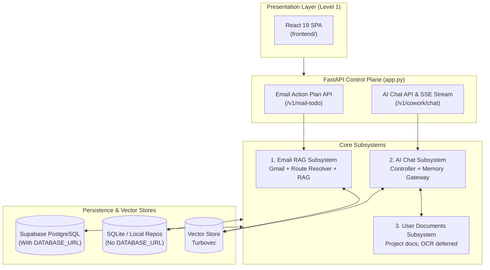

# System Architecture Dashboard & Status Tracker

**Architecture level:** Level 1 — High-Level Component & System Overview (Least Complexity)  
**Last Updated:** 2026-08-17  
**Target Reference:** [TARGET-ARCHITECTURE.md](../TARGET-ARCHITECTURE.md)

---

## 1. System Overview Dashboard

The Cowork Agent project consists of two decoupled primary product flows operating over a unified control plane and persistence engine:
1. **Email Action Plan & RAG Subsystem (PRD-v1):** Standalone, single-turn, memory-free digest: unread Gmail (`gmail.readonly`), route resolver (`NO_ACTION` / `DIRECT_PLAN` / `RETRIEVE_RAG`), optional company RAG. Not an in-chat tool.
2. **AI Chat Assistant with Typed Memory (V2):** Multi-turn SSE chat with four memory scopes, chat-native `TaskEpisode` proposals ([ADR-004](../../../tasks/adr/ADR-004-chat-native-task-episodes.md)), and classifier-gated project documents ([ADR-007](../../../tasks/adr/ADR-007-project-scoped-classifier-gated-user-documents.md)). Company RAG in chat is flag-gated (`CHAT_COMPANY_RAG_ENABLED`, default false).

---

## 2. Live Module Status Matrix

| Module / Component | Implemented Scope | Status | Target Architecture Alignment | Authoritative Code Location |
|---|---|---|---|---|
| **Email Action Plan & RAG** | Standalone single-turn digest: unread Gmail, route resolver (`NO_ACTION`, `DIRECT_PLAN`, `RETRIEVE_RAG`), attachment presence only (ADR-003), body-free plans | **Live / Implemented** | Fully Aligned ([TARGET-ARCHITECTURE.md §1 & §2](../TARGET-ARCHITECTURE.md)) | [features/email_action_plan](../../../src/cowork_agent/features/email_action_plan) |
| **Enterprise RAG Store** | Hybrid Turbovec + BM25 + RRF over committed `data/extracted/*.md`; unknown / retired `qdrant` / failed provider → `NullSemanticMemory` | **Live / Implemented** | Fully Aligned | [integrations/rag](../../../src/cowork_agent/integrations/rag) |
| **AI Chat Controller** | Multi-turn SSE chat; in-process turn (`classify → retrieve → assemble → stream → persist`); no in-chat Email tool | **Live / Implemented** | Mostly Aligned ([TARGET-ARCHITECTURE.md §2](../TARGET-ARCHITECTURE.md)) — graph module not composed | [controller.py](../../../src/cowork_agent/features/ai_chat/controller.py) |
| **4-Type Memory Gateway** | Short-term in-process buffer, explicit declarative profile, episodic `TaskEpisodes` (`retrieval_eligible=false` until approved), flag-gated company RAG | **Live / Implemented** | Mostly Aligned ([ADR-004](../../../tasks/adr/ADR-004-chat-native-task-episodes.md)) — Redis unused; local mode has no durable chat stores | [memory_gateway.py](../../../src/cowork_agent/features/ai_chat/memory_gateway.py) |
| **User Documents Subsystem** | Project-scoped upload/index/retrieve (`/v1/cowork/chat/projects/{id}/documents`); classifier-gated; OCR deferred (`ocr_unavailable`) | **Live / Implemented** | Mostly Aligned ([TARGET-ARCHITECTURE.md §3](../TARGET-ARCHITECTURE.md) & [ADR-007](../../../tasks/adr/ADR-007-project-scoped-classifier-gated-user-documents.md)) — project API vs §21.10 user-wide path | [project_documents.py](../../../src/cowork_agent/integrations/rag/project_documents.py) |
| **Document Ingestion Pipeline** | Offline CLI: DOCX/PDF conversion, SHA-256 hash manifest, symlink checks, atomic Markdown generation | **Live / Implemented** | Fully Aligned ([TARGET-ARCHITECTURE.md §1 & §3](../TARGET-ARCHITECTURE.md)) — not re-audited this pass | [knowledge_ingestion](../../../src/cowork_agent/integrations/knowledge_ingestion) & [ingestion_cli.py](../../../src/cowork_agent/ingestion_cli.py) |
| **Control Plane & Auth** | FastAPI `mail-todo-api` lifespan, Google OAuth, `VerifiedPrincipal`, Fernet token cipher, HttpOnly session cookie | **Live / Implemented** | Fully Aligned on identity & decoupling | [app.py](../../../src/cowork_agent/app.py) & [identity.py](../../../src/cowork_agent/identity.py) |
| **Dual Persistence Engine** | No `DATABASE_URL` → SQLite (`mail_todo.db` / `runs.db` / `tasks.db`) + in-memory; with `DATABASE_URL` → Supabase Postgres (migrations 001–013) | **Live / Implemented** | Fully Aligned on dual-mode switch | [repositories](../../../src/cowork_agent/persistence/repositories) |
| **Presentation Layers** | Production React 19 + Vite + Tailwind 4 SPA. Streamlit GUI is absent. | **Live / Implemented** | Fully Aligned (TARGET specifies an AI Chat client; React is that client) | [frontend/](../../../frontend) |

---

## 3. Architecture Diff Matrix (Current Implementation vs TARGET-ARCHITECTURE.md)

| System Aspect | Target Specification ([TARGET-ARCHITECTURE.md](../TARGET-ARCHITECTURE.md)) | Current Live Implementation | Diff / Variance Status |
|---|---|---|---|
| **Email & Chat Decoupling** | Standalone stateless Email Agent; AI Chat has no email tool interface | Standalone `/v1/mail-todo` Email Agent; chat request schema forbids `tool_choices`. No `@Email` tool. | **0 Diff — 100% Aligned** |
| **TaskEpisode Lifecycle** | Tasks proposed in chat start `retrieval_eligible=false` until explicit user approval | Created only on `is_explicit_task_request`; writes are `system_generated` / `retrieval_eligible=false`; eligibility follows `validation_status`. | **0 Diff — 100% Aligned ([ADR-004](../../../tasks/adr/ADR-004-chat-native-task-episodes.md))** |
| **Company RAG Corpus** | Knowledge provider; copied chunks forbidden in persistent task outputs; chat retrieval flag-gated | Turbovec hybrid over `data/extracted/*.md`; citations are coordinates. Chat-side read gated by `CHAT_COMPANY_RAG_ENABLED` (default false). Retired `qdrant` degrades to null memory. | **0 Diff — 100% Aligned** |
| **User Document Security** | Project-scoped documents; classifier is sole route origin; OCR deferred | Project API + classifier + readiness gate. OCR-required PDFs fail `ocr_unavailable`. Store is Postgres chunks + per-project `.tvim` with no company-index fallback. | **Mostly Aligned ([ADR-007](../../../tasks/adr/ADR-007-project-scoped-classifier-gated-user-documents.md))** — live path is `/v1/cowork/chat/projects/{id}/documents`, not TARGET §21.10 user-wide `/documents`; retrieval timeout default is `10000` vs TARGET `3000` |
| **Turn orchestration** | Small graph `classify → retrieve → assemble → generate → persist` | Same sequence lives in `ChatController.stream_message`. `features/ai_chat/graph/` exists but is not composed in `app.py`. | **Implementation variance — graph unused** |
| **Persistence Flexibility** | Production Postgres; Redis or in-process short-term | Dual SQLite+in-memory vs Postgres (migrations 001–013). Short-term is in-process only (`redis_client` / `run_queue` unbound). Local mode does not bind durable chat profile / TaskEpisode / history stores. | **Mostly Aligned** — Redis unused; local chat durability is a gap vs TARGET durable PostgreSQL memory |
| **Architecture Documentation** | Level 1 docs reflect the running system | Streams 01–03 and this dashboard audited 2026-08-17. Docs 04–06 were not re-audited this pass. | **Streams 01–03 + dashboard current; 04–06 stale-risk** |

---

## 4. Sub-Module Level 1 Architecture References

For detailed Level 1 component boundaries, sequence flows, and data contracts, refer to the individual module documents:

1. **[01-email-action-plan-and-rag.md](01-email-action-plan-and-rag.md):** Standalone Email Action Plan workflow, Gmail adapter, route resolver, and company Turbovec hybrid RAG. Audited 2026-08-17.
2. **[02-ai-chat-and-typed-memory.md](02-ai-chat-and-typed-memory.md):** Multi-turn Chat Controller, 4 typed memories, chat-native `TaskEpisode` lifecycle, and classifier-gated project documents. Audited 2026-08-17.
3. **[03-control-plane-persistence-and-uis.md](03-control-plane-persistence-and-uis.md):** FastAPI control plane, identity, SQLite vs Supabase Postgres (migrations 001–013), `mail-todo-worker`, React 19 SPA. Audited 2026-08-17.
4. **[04-overall-architecture.md](04-overall-architecture.md):** Comprehensive Overall System Architecture, system inventory, decoupled product flows, and state/control ownership.
5. **[05-rag-architecture.md](05-rag-architecture.md):** Deep-dive Enterprise RAG & Vector Memory Subsystem architecture, corpus indexing interface, multi-backend retrieval ladder, and User Documents RAG engine.
6. **[06-knowledge-and-document-ingestion-pipeline.md](06-knowledge-and-document-ingestion-pipeline.md):** Standalone Document Ingestion Pipeline, DOCX/PDF extractors, SHA-256 hash manifest tracking, and atomic Markdown persistence.

> [!NOTE]
> Streams 01–03 and this dashboard were audited against live source on 2026-08-17. Documents 04–06 remain useful Level 1 references but were **not** re-audited in this pass and may lag (for example, Streamlit GUI removal and migration 011–013).

