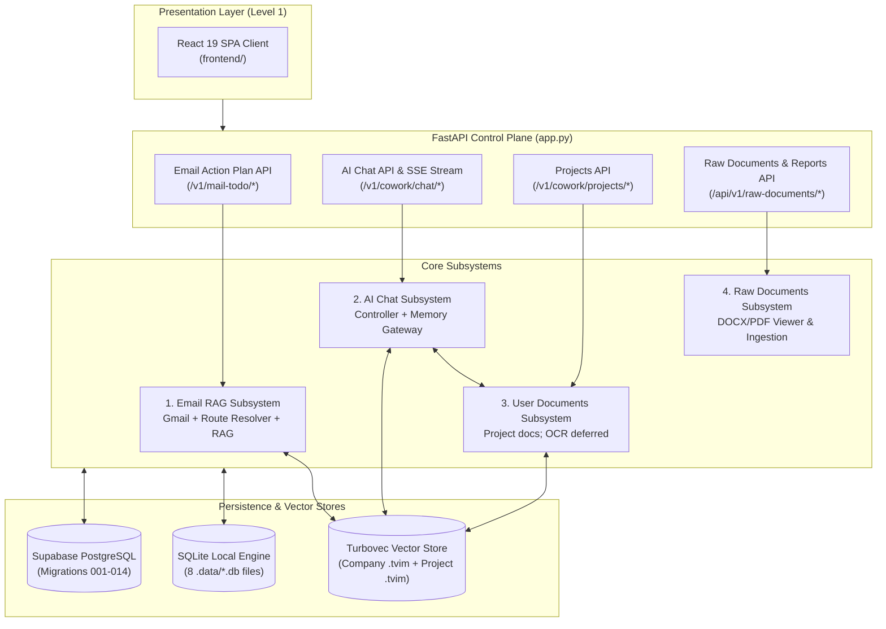

# System Architecture Dashboard & Status Tracker

**Architecture level:** Level 1 — High-Level Component & System Overview (Least Complexity)  
**Last Updated:** 2026-08-21  
**Target Reference:** [TARGET-ARCHITECTURE.md](file:///C:/WORK/EMAIL-AGENT-v1/docs/architectures/TARGET-ARCHITECTURE.md)

---

## 1. System Overview Dashboard

The Cowork Agent project consists of two primary product flows operating over a unified control plane and persistence engine:
1. **Email Action Plan & RAG Subsystem (PRD-v1):** Standalone, single-turn, memory-free digest: unread Gmail (`gmail.readonly`), route resolver (`NO_ACTION` / `DIRECT_PLAN` / `RETRIEVE_RAG`), optional company RAG. In-chat email capability operates via high-level `MailScanSummary` cards.
2. **AI Chat Assistant with Typed Memory (V2):** Multi-turn SSE chat with four memory scopes, chat-native `TaskEpisode` proposals ([ADR-004](file:///C:/WORK/EMAIL-AGENT-v1/tasks/adr/ADR-004-chat-native-task-episodes.md)), and classifier-gated project documents ([ADR-007](file:///C:/WORK/EMAIL-AGENT-v1/tasks/adr/ADR-007-project-scoped-classifier-gated-user-documents.md)). Company RAG in chat is flag-gated (`CHAT_COMPANY_RAG_ENABLED`, default false).

---

## 2. Live Module Status Matrix

| Module / Component | Implemented Scope | Status | Target Architecture Alignment | Authoritative Code Location |
|---|---|---|---|---|
| **Email Action Plan & RAG** | Standalone single-turn digest: unread Gmail, route resolver (`NO_ACTION`, `DIRECT_PLAN`, `RETRIEVE_RAG`), attachment presence only ([ADR-003](file:///C:/WORK/EMAIL-AGENT-v1/tasks/adr/ADR-003-attachment-retrieval-scope.md)), body-free plans | **Live / Implemented** | Fully Aligned ([TARGET-ARCHITECTURE.md §1 & §2](file:///C:/WORK/EMAIL-AGENT-v1/docs/architectures/TARGET-ARCHITECTURE.md)) | [`features/email_action_plan`](file:///C:/WORK/EMAIL-AGENT-v1/src/cowork_agent/features/email_action_plan) |
| **Enterprise RAG Store** | Hybrid Turbovec + BM25 + RRF over committed `data/extracted/*.md`; unknown / retired `qdrant` / failed provider → `NullSemanticMemory` | **Live / Implemented** | Fully Aligned | [`integrations/rag`](file:///C:/WORK/EMAIL-AGENT-v1/src/cowork_agent/integrations/rag) |
| **AI Chat Controller** | Multi-turn SSE chat; in-process turn (`classify → retrieve → assemble → stream → persist`); mail scans integrated via `MailScanSummary` cards | **Live / Implemented** | Mostly Aligned ([TARGET-ARCHITECTURE.md §2](file:///C:/WORK/EMAIL-AGENT-v1/docs/architectures/TARGET-ARCHITECTURE.md)) — graph module not composed | [`controller.py`](file:///C:/WORK/EMAIL-AGENT-v1/src/cowork_agent/features/ai_chat/controller.py) |
| **4-Type Memory Gateway** | Short-term in-process buffer, explicit declarative profile, episodic `TaskEpisodes` (`retrieval_eligible=false` until approved), flag-gated company RAG | **Live / Implemented** | Mostly Aligned ([ADR-004](file:///C:/WORK/EMAIL-AGENT-v1/tasks/adr/ADR-004-chat-native-task-episodes.md)) — Redis unused; local mode uses SQLite stores | [`memory_gateway.py`](file:///C:/WORK/EMAIL-AGENT-v1/src/cowork_agent/features/ai_chat/memory_gateway.py) |
| **User Documents Subsystem** | Project-scoped upload/index/retrieve (`/v1/cowork/projects/{id}/documents`); classifier-gated; OCR deferred (`ocr_unavailable`) | **Live / Implemented** | Mostly Aligned ([TARGET-ARCHITECTURE.md §3](file:///C:/WORK/EMAIL-AGENT-v1/docs/architectures/TARGET-ARCHITECTURE.md) & [ADR-007](file:///C:/WORK/EMAIL-AGENT-v1/tasks/adr/ADR-007-project-scoped-classifier-gated-user-documents.md)) | [`project_documents.py`](file:///C:/WORK/EMAIL-AGENT-v1/src/cowork_agent/integrations/rag/project_documents.py) |
| **Document Ingestion Pipeline** | Offline CLI: DOCX/PDF/TXT/MD conversion, SHA-256 hash manifest, symlink checks, NFC sanitization, YAML frontmatter, date harvesting, atomic Markdown generation | **Live / Implemented** | Fully Aligned ([TARGET-ARCHITECTURE.md §1 & §3](file:///C:/WORK/EMAIL-AGENT-v1/docs/architectures/TARGET-ARCHITECTURE.md)) | [`knowledge_ingestion`](file:///C:/WORK/EMAIL-AGENT-v1/src/cowork_agent/integrations/knowledge_ingestion) & [`ingestion_cli.py`](file:///C:/WORK/EMAIL-AGENT-v1/src/cowork_agent/ingestion_cli.py) |
| **DOCX Viewing & Raw Ingestion** | In-browser high-fidelity Word/PDF viewer (`DocxViewer`), direct upload to `data/raw/`, auto-extraction to `data/extracted/`, delete synchronization | **Live / Implemented** | Fully Aligned | [`frontend/src/dashboard/components/RawDocumentsView.tsx`](file:///C:/WORK/EMAIL-AGENT-v1/frontend/src/dashboard/components/RawDocumentsView.tsx) & [`app.py`](file:///C:/WORK/EMAIL-AGENT-v1/src/cowork_agent/app.py) |
| **Control Plane & Auth** | FastAPI `mail-todo-api` lifespan, Google OAuth, `VerifiedPrincipal`, Fernet token cipher, HttpOnly session cookie | **Live / Implemented** | Fully Aligned on identity & decoupling | [`app.py`](file:///C:/WORK/EMAIL-AGENT-v1/src/cowork_agent/app.py) & [`identity.py`](file:///C:/WORK/EMAIL-AGENT-v1/src/cowork_agent/identity.py) |
| **Dual Persistence Engine** | `POSTGRES_MODE=off` → SQLite (8 database files in `.data/`) plus an in-process working buffer; with `DATABASE_URL` → Supabase Postgres (migrations 001–014) | **Live / Implemented** | Fully Aligned on dual-mode switch | [`repositories`](file:///C:/WORK/EMAIL-AGENT-v1/src/cowork_agent/persistence/repositories) |
| **Presentation Layers** | Production React 19 + Vite + Tailwind 4 SPA. Streamlit GUI is retired. | **Live / Implemented** | Fully Aligned | [`frontend/`](file:///C:/WORK/EMAIL-AGENT-v1/frontend) |

---

## 3. Architecture Diff Matrix (Current Implementation vs TARGET-ARCHITECTURE.md)

| System Aspect | Target Specification ([TARGET-ARCHITECTURE.md](file:///C:/WORK/EMAIL-AGENT-v1/docs/architectures/TARGET-ARCHITECTURE.md)) | Current Live Implementation | Diff / Variance Status |
|---|---|---|---|
| **Email & Chat Decoupling** | Standalone stateless Email Agent; AI Chat has decoupled email tool interface | Standalone `/v1/mail-todo` Email Agent; chat integrates email scan summaries via `MailScanSummary` cards (`/sessions/{id}/mail-scans`) without persisting raw email bodies in chat memory. | **0 Diff — 100% Aligned** |
| **TaskEpisode Lifecycle** | Tasks proposed in chat start `retrieval_eligible=false` until explicit user approval | Created only on `is_explicit_task_request`; writes are `system_generated` / `retrieval_eligible=false`; eligibility follows `validation_status`. | **0 Diff — 100% Aligned ([ADR-004](file:///C:/WORK/EMAIL-AGENT-v1/tasks/adr/ADR-004-chat-native-task-episodes.md))** |
| **Company RAG Corpus** | Knowledge provider; copied chunks forbidden in persistent task outputs; chat retrieval flag-gated | Turbovec hybrid over `data/extracted/*.md`; citations are coordinates. Chat-side read gated by `CHAT_COMPANY_RAG_ENABLED` (default false). Retired `qdrant` degrades to null memory. | **0 Diff — 100% Aligned** |
| **User Document Security** | Project-scoped documents; classifier is sole route origin; OCR deferred | Project API + classifier + readiness gate. OCR-required PDFs fail `ocr_unavailable`. Store is Postgres chunks + per-project `.tvim` with no company-index fallback. | **Mostly Aligned ([ADR-007](file:///C:/WORK/EMAIL-AGENT-v1/tasks/adr/ADR-007-project-scoped-classifier-gated-user-documents.md))** — live path is `/v1/cowork/projects/{id}/documents` |
| **Turn orchestration** | Small graph `classify → retrieve → assemble → generate → persist` | Same sequence lives in `ChatController.stream_message`. `features/ai_chat/graph/` exists but is not composed in `app.py`. | **Implementation variance — graph unused** |
| **Persistence Flexibility** | Production Postgres; Redis or in-process short-term | SQLite persists local chat sessions/history/profile/task episodes and project-document metadata/chunks across 8 local `.db` files; short-term remains in-process. Durable cloud Postgres uses migrations 001–014. | **Mostly Aligned** — Redis unused; local and cloud data are separate |
| **Architecture Documentation** | Level 1 docs reflect the running system | All 7 subsystem modules (01–07) and dashboard audited and synchronized on 2026-08-21. | **0 Diff — 100% Synced** |

---

## 4. Sub-Module Level 1 Architecture References

For detailed Level 1 component boundaries, sequence flows, and data contracts, refer to the individual module documents:

1. **[01-email-action-plan-and-rag.md](file:///C:/WORK/EMAIL-AGENT-v1/docs/architectures/current-architectures/01-email-action-plan-and-rag.md):** Standalone Email Action Plan workflow, Gmail adapter, route resolver, and company Turbovec hybrid RAG. Audited 2026-08-21.
2. **[02-ai-chat-and-typed-memory.md](file:///C:/WORK/EMAIL-AGENT-v1/docs/architectures/current-architectures/02-ai-chat-and-typed-memory.md):** Multi-turn Chat Controller, 4 typed memories, chat-native `TaskEpisode` lifecycle, and classifier-gated project documents. Audited 2026-08-21.
3. **[03-control-plane-persistence-and-uis.md](file:///C:/WORK/EMAIL-AGENT-v1/docs/architectures/current-architectures/03-control-plane-persistence-and-uis.md):** FastAPI control plane, identity, SQLite vs Supabase Postgres (migrations 001–014), `mail-todo-worker`, React 19 SPA. Audited 2026-08-21.
4. **[04-overall-architecture.md](file:///C:/WORK/EMAIL-AGENT-v1/docs/architectures/current-architectures/04-overall-architecture.md):** Comprehensive Overall System Architecture, system inventory, decoupled product flows, and state/control ownership. Audited 2026-08-21.
5. **[05-rag-architecture.md](file:///C:/WORK/EMAIL-AGENT-v1/docs/architectures/current-architectures/05-rag-architecture.md):** Deep-dive Enterprise RAG & Vector Memory Subsystem architecture, corpus indexing interface, multi-backend retrieval ladder, and User Documents RAG engine. Audited 2026-08-21.
6. **[06-knowledge-and-document-ingestion-pipeline.md](file:///C:/WORK/EMAIL-AGENT-v1/docs/architectures/current-architectures/06-knowledge-and-document-ingestion-pipeline.md):** Standalone Document Ingestion Pipeline, DOCX/PDF/TXT/MD extractors, NFC sanitization, YAML frontmatter, binary date harvesting, SHA-256 hash manifest tracking, and atomic Markdown persistence. Audited 2026-08-20.
7. **[07-docx-document-viewing-and-editing.md](file:///C:/WORK/EMAIL-AGENT-v1/docs/architectures/current-architectures/07-docx-document-viewing-and-editing.md):** DOCX Document Viewing Subsystem, high-fidelity in-browser Word viewer (DocxViewer), direct upload/delete sync with extracted markdown. Audited 2026-08-21.

> [!NOTE]
> All architecture modules in `docs/architectures/current-architectures/` are verified against live code and synchronized with [TARGET-ARCHITECTURE.md](file:///C:/WORK/EMAIL-AGENT-v1/docs/architectures/TARGET-ARCHITECTURE.md).
