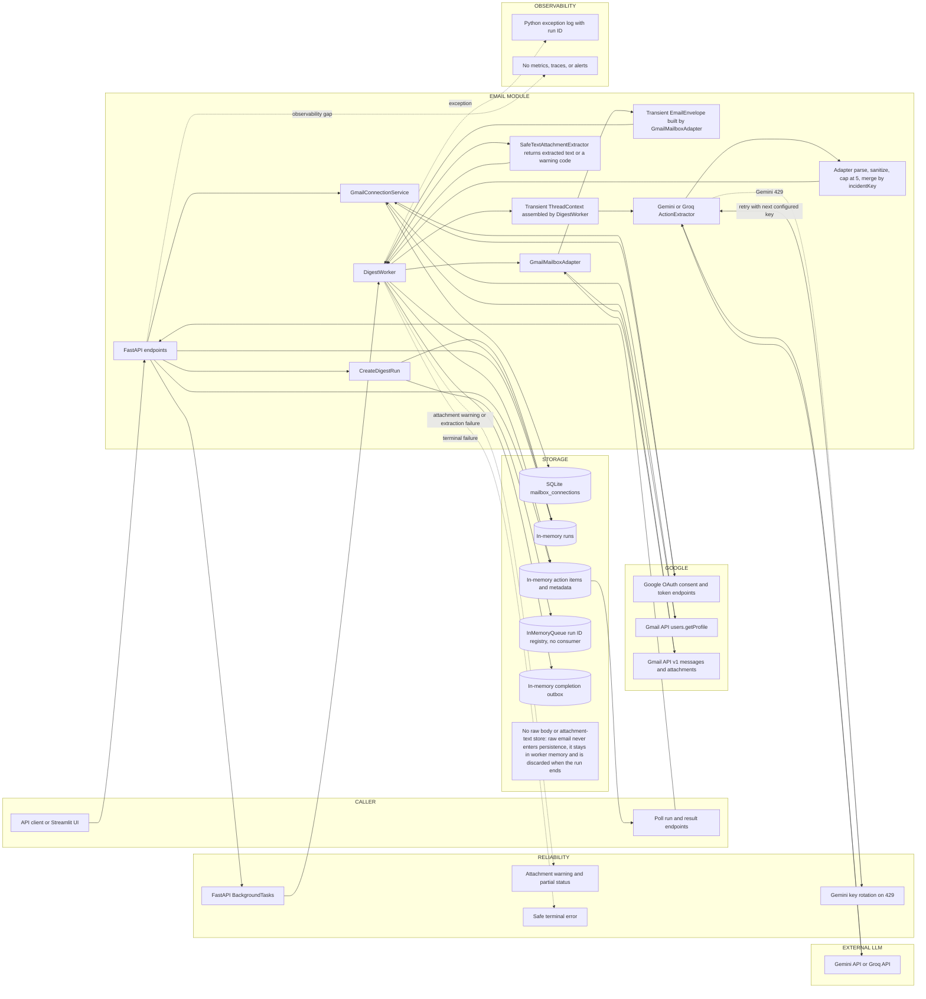

# Current Email Architecture

## Extraction status

This document describes the implementation in commit `cf2fd49801d5932b26de82af9d104d730cf58271` on branch `main`. It was extracted on 2026-08-06 and corrected against live source during an adversarial review on 2026-08-07. It describes runtime code, not the broader architecture claimed in `docs/references/ARCHITECHTURE.md` or the unused PostgreSQL schema in `src/cowork_agent/persistence/migrations/001_mail_todo.sql`.

**Key ownership finding:** final Action Plan generation happens in the Email workflow, and it is shared between the LLM and the provider adapter. `DigestWorker` sends Gmail thread and attachment context to the configured `GeminiActionExtractor` or `GroqActionExtractor`. The LLM authors the candidate `actionPlan` steps, but the adapter then shapes them deterministically:

1. `_parse_action_plan` drops empty steps, steps over 600 characters, case-folded duplicates, and steps containing prompt-leak markers, then truncates to the first 5 steps and renumbers them.
2. `_merge_correlated_emails` groups every action in the batch that shares a normalized `incidentKey`. Any group holding more than one action is merged — including two actions from the *same* email, not only cross-email groups — and `_select_merged_steps` **rebuilds** that group's plan by interleaving the members' plans. It keeps at most 5 steps that are distinct on the exact `(instruction, basis)` pair, so identical instructions with different bases both survive and no action is guaranteed to contribute a step.

`DigestWorker` then assigns that already-shaped tuple verbatim to `ActionItem.action_plan`; it does not author or edit steps itself. No RAG retrieval step participates.

## 1. Module purpose

The module:

1. Connects one Gmail mailbox to a local `user_id` through Google OAuth 2.0 with PKCE.
2. Searches read-only Gmail for unread inbox messages.
3. Fetches full Gmail threads and normalizes selected messages into `EmailEnvelope` objects.
4. Downloads supported text attachments and extracts bounded text in-process.
5. Sends email/thread/attachment context to Gemini or Groq for structured action extraction.
6. Filters, deduplicates, prioritizes, and returns action items and Action Plans.

It does not send, modify, label, archive, or mark Gmail messages as read.

## 2. Entry points

### Runtime entry points

| Type | Entry point | Current behavior |
|---|---|---|
| CLI | `mail-todo-api` -> `cowork_agent.app:main` | Starts Uvicorn and the FastAPI app. |
| Script | `python scripts/run_gui.py` | Starts the Streamlit test UI. |
| API | `GET /health` | Liveness response only. |
| API | `GET /v1/mail-todo/oauth/gmail/connect` | Starts Gmail OAuth for query-string `user_id`. |
| API | `GET /v1/mail-todo/oauth/gmail/callback` | Exchanges OAuth code and persists the connection. |
| API | `GET /v1/mail-todo/connections` | Lists connections owned by `user_id`. |
| API | `DELETE /v1/mail-todo/connections/{connection_id}` | Deletes an owned connection. |
| API | `GET /v1/mail-todo/connections/{connection_id}/unread-preview` | Fetches a bounded unread preview synchronously. |
| API | `POST /v1/mail-todo/runs` | Creates a run and registers `DigestWorker.execute` with FastAPI `BackgroundTasks`. |
| API | `GET /v1/mail-todo/runs/{run_id}` | Polls run state and progress. |
| API | `GET /v1/mail-todo/runs/{run_id}/result` | Returns terminal result. |

### Absent entry points

- No scheduler, cron trigger, schedule repository, or scheduled-job loop is wired into runtime.
- No independent queue worker or broker exists. `InMemoryQueue` only records run IDs; FastAPI `BackgroundTasks` performs actual execution.
- `DigestCompletedEvent` is added to `InMemoryOutbox`, but no publisher or consumer is wired.
- PostgreSQL schedule/run/outbox tables in `src/cowork_agent/persistence/migrations/001_mail_todo.sql` are not used by `create_app()`.

## 3. Authentication

### OAuth flow

1. Client calls the connect endpoint with `user_id`.
2. `GmailConnectionService.begin` creates a PKCE verifier.
3. `OAuthStateManager` creates an HMAC-signed state containing `user_id`, timestamp, and nonce; pending verifier state is held in process memory.
4. Google authorization uses `access_type=offline` and `prompt=consent`.
5. Callback consumes the signed, expiring, single-use state and reuses the PKCE verifier.
6. `GoogleOAuthDriver` exchanges the authorization response and fetches the Gmail profile email.
7. `GmailConnectionService.complete` compares the granted scopes against the configured scopes, encrypts the refresh token with Fernet, and upserts the mailbox connection in SQLite.

Two caveats on that scope check (`src/cowork_agent/integrations/gmail/provider.py:85`, `:133-134`): the comparison is exact tuple equality, so a differently ordered scope list from Google would be rejected; and `GmailOAuthGrant.scopes` falls back to the configured scopes when the token response carries none, in which case the check compares the configured value with itself and cannot fail. It is therefore a configuration-consistency check, not an independent verification that Google granted read-only access.

### Token storage and refresh

- Only the encrypted refresh token is persisted; no access token is stored.
- Each Gmail operation reconstructs Google `Credentials` with the decrypted refresh token, OAuth client credentials, token URI, and stored scopes.
- Refresh is delegated to the Google client/auth libraries during API use. This module has no explicit refresh loop or token-expiry persistence.
- `RefreshError`, HTTP 401, and HTTP 403 become `MailboxReauthRequiredError`.

### Scopes and ownership

- Only `https://www.googleapis.com/auth/gmail.readonly` is accepted.
- SQLite uniqueness is `(user_id, provider, external_account_id)`.
- List/delete/preview/run endpoints check supplied `user_id` ownership.
- `user_id` is a query parameter, not a verified session/JWT identity. Tenant identity is therefore caller-asserted.
- OAuth pending state is process-local. Restarting or routing the callback to another replica invalidates the pending flow.

## 4. Gmail retrieval flow

```text
POST /runs or unread-preview
-> ownership check in SQLite
-> GmailMailboxAdapter
-> decrypt refresh token and build Gmail v1 client
-> users.messages.list(q, maxResults, pageToken)
-> MessageRef(message_id, thread_id)
-> repeat pages until max_emails or no nextPageToken
-> users.threads.get(format="full") per selected thread
-> retain only messages selected by unread search
-> parse headers, body, timestamp, deep link, attachment metadata
-> EmailEnvelope / ThreadContext
-> optional attachment download and text extraction
-> Gemini or Groq structured extraction
-> ActionItem result
```

Important behavior:

- Query policy always adds `is:unread` and `in:inbox` if absent.
- Search page size is at most 100 in `DigestWorker` and at most 500 in the Gmail adapter.
- Spam and trash are excluded.
- Full threads are fetched for context, but the worker retains only messages selected by the unread search.
- Duplicate message IDs are ignored. Messages are grouped by thread before fetch.
- `next_cursor` and `truncated` are stored on the run when the configured message limit stops pagination.
- The parser prefers plain text, can convert HTML to text, and preserves HTML link targets in the normalized text.

## 5. Returned data contracts

### Internal Gmail contracts

`SearchPage`:

- `messages[]`: `message_id`, `thread_id`
- `next_cursor`
- `estimated_total`

`EmailEnvelope`:

- `provider_message_id`
- `provider_thread_id`
- `deep_link`
- `subject`
- `sender_name`
- `sender_address`
- `sent_at`
- `received_at`
- `text_body`
- `attachments[]`: `attachment_id`, `filename`, `declared_mime_type`, `size_bytes`

The current parser does **not** return recipients, CC/BCC, Gmail labels, RFC Message-ID, raw MIME, separate HTML body, or per-message fetch status. `sent_at` and `received_at` both use Gmail `internalDate`.

### `GET /health`

- `status` (always `"ok"`)

### `GET /v1/mail-todo/oauth/gmail/connect`

No JSON body. A `302` redirect to the Google consent URL.

### `GET /v1/mail-todo/oauth/gmail/callback`

- `status` (always `"connected"`)
- `connection`: the `_public_connection` shape below
- `next`: a fixed human-readable hint string

### `GET /v1/mail-todo/connections`

- `connections[]`: the `_public_connection` shape below

`_public_connection` is `id`, `provider`, `emailAddress`, `scopes[]`, `status`, `createdAt` (ISO-8601). The encrypted refresh token is never returned.

### `DELETE /v1/mail-todo/connections/{connection_id}`

- `disconnected` (always `true`; a missing or non-owned connection is a `404` instead)

### `GET .../unread-preview`

- `emailsMatched`
- `messages[]`: `messageId`, `threadId`, `subject`, `sender`, `receivedAt`, `attachmentCount`, `deepLink`
- `nextCursor`

Preview chooses the last message in each fetched thread, not explicitly the selected unread message. It also suppresses duplicate thread IDs.

### `POST .../runs`

- `id`
- `status`
- `statusUrl`

### `GET .../runs/{run_id}`

- `id`
- `status`
- `progress`: `emailsMatched`, `emailsProcessed`, `emailsToProcess`, `maxEmails`
- `error`: null or `code`, `message`
- `processedEmails` in development only: `messageId`, `threadId`, `subject`, `sender`, `receivedAt`

### `GET .../runs/{run_id}/result`

Top-level fields:

- `run`
- `actionItems`
- `nextActions` (first three sorted action items)
- `attachmentWarnings`
- `processedEmails` in development only
- `message` (`"Không có công việc cần xử lý"` when no items)

`run` uses snake_case fields from `DigestRun`: `id`, `user_id`, `mailbox_connection_id`, `trigger`, `status`, `query`, `idempotency_key`, `max_emails`, all email/action/attachment counters, `truncated`, `next_cursor`, safe error fields, and timestamps.

Each `actionItems[]`/`nextActions[]` entry uses snake_case fields from `ActionItem`: IDs, fingerprint/freshness, title/summary, sender and source-email metadata, deadline fields, priority fields, `confidence`, `impact`, `incident_key`, `related_message_ids`, and:

- `action_plan[]`: `order`, `instruction`, `basis`
- `evidence[]`: `source_kind`, `filename`, `location`, `excerpt`, `source_message_id`

`attachmentWarnings[]`: `filename`, `code`, `message`.

## 6. Persistence

| Data | Store | Retention | Purpose |
|---|---|---|---|
| Mailbox connection ID, owner, provider, account/email, encrypted refresh token, scopes, status, timestamps | SQLite `mailbox_connections`; default `.data/mail_todo.db` | Until explicit disconnect/database removal; no TTL in code | Reconstruct Gmail credentials and enforce local ownership. |
| OAuth pending verifier/state nonce | `OAuthStateManager` in memory | Invalid at TTL, but the entry is physically removed only when a later `consume_with_context` runs the sweep, when it is itself consumed, or on process restart | PKCE callback validation and replay prevention. |
| Run state/counters/error | `InMemoryRunRepository` | Process lifetime | Polling, idempotency, claim state. |
| Action items | `InMemoryResultRepository` | Process lifetime | Result API and cross-run fingerprint lookup. |
| Processed message ID/thread ID/subject/sender/date | `InMemoryResultRepository` | Process lifetime | Development diagnostics/result metadata. |
| Attachment warnings | `InMemoryResultRepository` | Process lifetime | Partial-run reporting. |
| Completion event | `InMemoryOutbox` | Process lifetime | Captures terminal event; no publisher wired. |
| Raw email body and normalized `EmailEnvelope` | Not persisted | Worker-call lifetime | LLM extraction input. |
| Extracted attachment content | Not persisted | Worker-call lifetime | LLM extraction input. |
| Logs | Python logging destination configured by host | Host-defined | Failed-run traceback. |

`src/cowork_agent/persistence/migrations/001_mail_todo.sql` defines PostgreSQL tables for future/different runtime persistence, but `create_app()` instantiates only SQLite connection storage plus in-memory run/result/outbox adapters.

## 7. Reliability

Implemented:

- Run creation is idempotent by `(user_id, idempotency_key)` within one process. Payload equivalence is **not** checked: replaying a key with a different `mailboxConnectionId`, `query`, or `maxEmails` silently returns the original run instead of rejecting the mismatch. A replay also re-registers a background task, but `claim` refuses any run that is no longer `queued`, so the duplicate execution is a no-op.
- Run claim changes `queued -> running` once within one in-memory repository.
- Gmail refresh/auth failures map to reauthorization; other Gmail HTTP errors map to a temporary error.
- Attachment size is bounded. Unsupported/too-large/failed attachments produce warnings and a `partial` run while preserving usable action items.
- Gemini requests have a configured timeout and rotate across configured API keys on HTTP 429, up to `max_attempts`.
- Groq requests have a configured timeout and safe HTTP/network errors.
- Unexpected pipeline failures set `failed`, store a safe public error, log a traceback, and still add a completion event.

Not implemented:

- No Gmail timeout, retry, exponential backoff, jitter, or explicit 429 handling.
- No Groq retry or backoff.
- Gemini key rotation is immediate failover, not delayed backoff.
- One LLM batch failure fails the whole run; successful earlier batches are not saved as partial output.
- No durable queue, worker lease, distributed claim, dead-letter queue, or crash recovery.
- FastAPI `BackgroundTasks` work is lost on process termination.
- `ExtractionLimits.timeout_seconds` is defined but not enforced by `SafeTextAttachmentExtractor`.
- In-memory idempotency, deduplication, results, and outbox disappear on restart and do not coordinate replicas.
- A provider configuration `ValueError` at startup leaves the app running with `digest_worker = None`. Digest creation then returns 503 with the message `"Gemini is not configured: ..."` even when the failure came from Groq settings or an invalid `LLM_PROVIDER` value, so the public error misattributes the provider.

## 8. Observability

- One explicit application log exists: `logger.exception("Digest run %s failed", run.id)`.
- Safe API errors avoid returning raw exceptions, secrets, or email bodies.
- No metrics, tracing, correlation IDs, structured audit events, dashboards, or alerts are implemented.
- No code explicitly logs full email content or tokens. The failure logger records exception text/traceback; downstream library logging is not controlled here.
- Processed email metadata can appear in API responses only when `APP_ENV` is development/dev/local.

## 9. State ownership

| State | Current owner |
|---|---|
| OAuth client credentials and encryption/state secrets | Process environment loaded by `GmailSettings`. |
| Encrypted mailbox refresh token and connection ownership | `SQLiteMailboxConnectionRepository`. |
| OAuth nonce and PKCE verifier | Process-local `OAuthStateManager`. |
| Raw Gmail content and normalized email | Transient `GmailMailboxAdapter` -> `DigestWorker` objects. |
| Attachment text | Transient `SafeTextAttachmentExtractor` result. |
| Run state | Process-local `InMemoryRunRepository`. |
| Generated action items and processed metadata | Process-local `InMemoryResultRepository`. |
| Completion event | Process-local `InMemoryOutbox`. |
| Final Action Plan generation | Email workflow. The LLM authors candidate steps; the Gemini/Groq `ActionExtractorPort` adapter sanitizes, caps at 5, and may rebuild them across correlated emails; `DigestWorker` assigns the result unchanged. |

## 10. Production-focused flow

### 10.1 Architecture & Component Flow Diagram



### 10.2 Structured Flow Breakdown

1. **Authentication & Connection Management**:
   - `UI` triggers connection request to `API`.
   - `API` invokes `OAUTH` (`GmailConnectionService`), initiating flow with Google's `CONSENT` endpoints.
   - During the code exchange the driver calls `PROFILE` (`Gmail API users.getProfile`) to learn the mailbox address that identifies the connection.
   - Upon successful callback exchange, `OAUTH` persists encrypted tokens in `SQLITE` (`mailbox_connections`).

2. **Digest Run Creation & Asynchronous Dispatch**:
   - `UI` submits run creation request to `API`.
   - `API` delegates to `CREATE` (`CreateDigestRun`), which initializes run state in `RUNS` (`InMemoryRunRepository`) and records the new run ID in `QUEUE` (`InMemoryQueue`) only on first creation.
   - The `POST /runs` route itself — not `CreateDigestRun` — then dispatches the worker via `BG` (`FastAPI BackgroundTasks`) to execute `WORKER` (`DigestWorker`). `QUEUE` is never read.

3. **Email Retrieval & Attachment Processing**:
   - `WORKER` uses `GMAIL` (`GmailMailboxAdapter`) to query `GAPI` (`Gmail API v1`).
   - `GMAIL` fetches unread threads and parses each Gmail message into a transient `ENVELOPE` (`EmailEnvelope`). It does **not** build `ThreadContext`.
   - `WORKER` drives `ATTACH` (`SafeTextAttachmentExtractor`) per attachment reference. `ATTACH` returns an `ExtractedAttachment` that may carry a `warning_code`, or raises; it does not itself record warnings or change run status.
   - `WORKER` assembles `CONTEXT` (`ThreadContext`) from the envelopes plus the successfully extracted attachments.

4. **Action Extraction & LLM Integration**:
   - `WORKER` passes `CONTEXT` to `ACTION` (`Gemini` or `Groq` `ActionExtractor`).
   - `ACTION` calls external `LLMAPI` (`Gemini API` or `Groq API`) for structured action extraction.
   - Still inside `ACTION`, the raw model response is shaped: `_parse_action_plan` drops empty, over-long, duplicate, and prompt-leak steps and caps the plan at 5, then `_merge_correlated_emails`/`_select_merged_steps` may rebuild a plan by interleaving steps across emails sharing an `incidentKey`.
   - `ACTION` returns the already-shaped action items to `WORKER`, which assigns `action_plan` verbatim and writes results to `RESULTS` (`InMemoryResultRepository`).

5. **State Updates & Event Outbox**:
   - `WORKER` updates final status in `RUNS`.
   - `WORKER` emits a completion event to `OUTBOX` (`InMemoryOutbox`).

6. **Caller Polling & Result Retrieval**:
   - `POLL` continuously queries `API` for run progress against `RUNS`.
   - Once completed, `API` fetches structured action items from `RESULTS` and returns them to `POLL`.

7. **Reliability, Error Handling & Observability**:
   - **Attachment Warning**: When an attachment is oversized, returns a `warning_code`, or raises, `WORKER` — not `ATTACH` — sets `partial` and calls `_warn` to record the warning, producing `PARTIAL`.
   - **Gemini Failover**: If `ACTION` encounters HTTP 429, it triggers `FAILOVER` and retries the same request with the next configured key, subject to the attempt cap.
   - **Terminal Error**: Uncaught errors in `WORKER` trigger `SAFEERR` (safe terminal error message).
   - **Exception Logging**: Worker failures output an exception log with run ID to `LOG`.
   - **Observability Gap**: The current system lacks metrics, tracing, or alerting (`GAP`).

## 11. Unknowns and review points

- No deployment configuration shows how many replicas run or where logs are retained.
- Google client-library refresh timing is not controlled or instrumented by this code.
- No external authentication layer proves that query-string `user_id` belongs to the caller.
- No runtime consumer exists for `InMemoryQueue` or `InMemoryOutbox`; intended future ownership is unknown.
- `docs/references/ARCHITECHTURE.md` describes Outlook, RAG, Qdrant, and knowledge APIs absent from this checkout. Those claims must not be treated as current implementation without another source/branch.
- PostgreSQL migration retention and production use cannot be confirmed because no PostgreSQL adapter is wired.

## Source evidence

- Composition and endpoints: `src/cowork_agent/app.py:49-342`
- API serialization: `src/cowork_agent/api/handlers.py:11-65`
- Run orchestration and final Action Plan ownership: `src/cowork_agent/features/email_action_plan/workflow.py:48-347`
- Internal contracts: `src/cowork_agent/features/email_action_plan/schemas.py:16-71`
- Domain/result fields: `src/cowork_agent/domain/models.py:47-196`
- Gmail OAuth/retrieval/parser: `src/cowork_agent/integrations/gmail/provider.py:42-384`
- SQLite mailbox storage: `src/cowork_agent/persistence/repositories/mailbox_connections.py:11-112`
- In-memory repositories: `src/cowork_agent/persistence/repositories/local.py:11-90`
- Queue and outbox adapters: `src/cowork_agent/orchestration/local.py:11-60`
- Attachment extraction fake and text extractor: `src/cowork_agent/integrations/gmail/fakes.py:11-80`
- Security state/token handling: `src/cowork_agent/integrations/gmail/auth.py:14-97`
- Provider behavior: `src/cowork_agent/integrations/llm/providers/gemini.py:26-152`, `src/cowork_agent/integrations/llm/providers/groq.py:27-137`
- Action Plan parsing, sanitization, and cross-email merge: `src/cowork_agent/integrations/llm/providers/gemini.py:366-419` (`_parse_batch`), `:431-466` (`_parse_action_plan`), `:469-535` (`_merge_correlated_emails`, `_merge_actions`), `:548-570` (`_select_merged_steps`)
- Shared provider internals: `src/cowork_agent/integrations/llm/providers/groq.py:14-21` imports `EXTRACTION_SCHEMA`, `SYSTEM_INSTRUCTION`, `_batch_threads`, `_build_prompt`, `_merge_correlated_emails`, and `_parse_batch` from `gemini.py`, so the two adapters share prompt, schema, batching, parsing, and merge behavior rather than being independent.
- Runtime settings: `src/cowork_agent/config.py:14-141`

