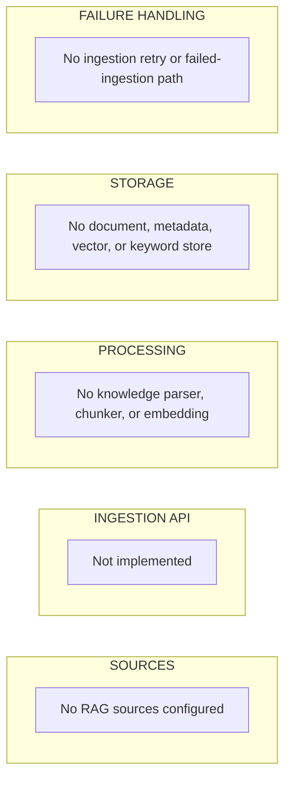
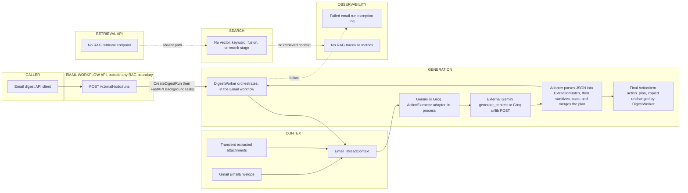

# Current RAG Architecture

## Extraction status

This document describes commit `cf2fd49801d5932b26de82af9d104d730cf58271` on branch `main`. It was extracted on 2026-08-06 and corrected against live source during an adversarial review on 2026-08-07.

**Finding: no RAG module is implemented in the live Python source of this checkout.** There is no ingestion pipeline, retrieval API, embedding adapter, vector/keyword index, reranker, knowledge store, citation validator, or RAG generation flow. Searches for RAG/Qdrant/embedding/reranking/citation/knowledge symbols and Python source returned no implementation. `pyproject.toml` also contains no RAG/vector/search dependencies.

`docs/references/ARCHITECHTURE.md` describes a richer knowledge runtime, but that description does not match the present `src/` tree. It is treated as an unverified reference/target, not current evidence.

**Generation ownership:** final Action Plan generation currently occurs in the Email workflow. `DigestWorker` calls Gemini or Groq with Gmail `ThreadContext`; there is no retrieval step and no RAG module involved.

## 1. RAG module purpose

No current runtime module exists, so these capabilities are absent:

| Capability | Current implementation |
|---|---|
| Ingestion | Not implemented |
| Parsing/chunking for knowledge documents | Not implemented |
| Embedding/indexing | Not implemented |
| Vector search | Not implemented |
| Keyword/BM25 search | Not implemented |
| Reranking | Not implemented |
| Context retrieval/assembly from a knowledge corpus | Not implemented |
| RAG answer generation | Not implemented |
| Knowledge citations/provenance | Not implemented |
| Knowledge ACL/tenant filtering | Not implemented |

Email attachment extraction is not RAG ingestion. Extracted text exists only during one digest run and is sent directly to the action-extraction LLM; it is not chunked, embedded, indexed, or retained as a knowledge corpus.

## 2. Ingestion architecture

There is no implemented flow matching:

```text
Source -> Ingestion API -> Parser -> Chunker -> Metadata -> Embedding -> Index -> Document storage
```

No RAG queues, ingestion workers, retries, failure records, or reindex endpoint exist.

The closest unrelated flow is Gmail attachment handling:

```text
Gmail attachment
-> full attachment response fetched and fully base64-decoded, then rejected if the decoded size exceeds the limit
-> bounded in-process text/csv/json extraction
-> transient ExtractedAttachment
-> Email ActionExtractor prompt
-> discarded after run
```

This flow does not write a document registry or search index.

## 3. Retrieval architecture

There is no RAG retrieval request path. Specifically absent:

- query preprocessing for a knowledge query;
- authorization against document access;
- tenant/organization metadata filters;
- dense or keyword search;
- result fusion or reranking;
- retrieved-context assembly;
- no-result/partial-result response contract.

Gmail `users.messages.list` is mailbox retrieval, not retrieval-augmented generation.

## 4. Generation ownership

Current behavior is **generation without RAG**:

1. `DigestWorker` fetches Gmail messages and extracts supported attachments.
2. It builds `ThreadContext` from email messages and transient attachments.
3. It calls `ActionExtractorPort.extract(user_timezone, current_time, threads)`.
4. Runtime selects `GeminiActionExtractor` or `GroqActionExtractor` through `LLM_PROVIDER`.
5. The provider returns raw JSON. The *adapter* — not the provider and not `DigestWorker` — parses that JSON into the application `ExtractionBatch` contract. The final network call is `GoogleGenAITransport.generate_content` for Gemini and a `urllib` `urlopen` POST for Groq.
6. Inside the adapter, `_parse_action_plan` drops empty, over-long, duplicate, and prompt-leak steps and truncates to 5; `_merge_correlated_emails` may then rebuild a plan by interleaving steps across emails that share an `incidentKey`.
7. `DigestWorker` assigns that already-shaped tuple to `ActionItem.action_plan` without authoring or editing steps.

Therefore:

- RAG context retrieval: absent.
- LLM generation: implemented in external Gemini/Groq adapters.
- Orchestration and final Action Plan ownership: Email workflow. `DigestWorker` owns orchestration; the Gemini/Groq adapter owns the deterministic shaping of the plan the LLM proposed.

## 5. Data stores

| Store category | Current RAG store |
|---|---|
| Vector database | None |
| Keyword index | None |
| Metadata database | None |
| Object/document storage | None |
| Cache | None |
| Queue | None |
| Trace store | None |

SQLite `mailbox_connections` stores Gmail credentials/ownership only. In-memory run/results/outbox stores belong to the Email workflow and contain no reusable knowledge index.

## 6. API contracts

### Ingestion

No endpoint, command, request payload, or response payload exists.

### Retrieval

No endpoint, command, request payload, or response payload exists.

### RAG generation

No RAG generation/chat endpoint or public contract exists.

Nearest non-RAG internal contract:

```text
ActionExtractorPort.extract(
    user_timezone: str,
    current_time: datetime,
    threads: Sequence[ThreadContext]
) -> ExtractionBatch
```

`ThreadContext` contains Gmail `EmailEnvelope[]` and transient `ExtractedAttachment[]`. `ExtractionBatch` contains per-email classifications and generated action items. This is Email action extraction, not a retrieval contract.

## 7. Provenance and citations

No RAG retrieval result exists, so none of these knowledge-provenance fields are produced:

- document ID;
- chunk ID;
- title/section;
- source URL;
- document version;
- dense/keyword relevance score;
- rerank score.

`ActionItem.evidence` contains email/attachment evidence (`source_kind`, filename, location, excerpt, source message ID). It does not prove retrieval from a managed knowledge corpus and must not be labeled a RAG citation.

## 8. Tenant and ACL isolation

No knowledge tenant namespace, user namespace, document ACL, or organization filter exists because no knowledge corpus exists.

Email endpoints perform local ownership checks using caller-supplied `user_id`, but this is not a RAG ACL model and is not bound to verified authentication.

## 9. Reliability

No RAG-specific timeout, retry, no-result path, partial-result path, embedding failure, indexing failure, retrieval failure, generation failure, or dead-letter behavior exists.

The Email LLM path has provider timeouts, Gemini key rotation on 429, and failed-run handling. Those controls belong to action extraction and do not establish RAG reliability.

## 10. Mermaid diagrams

### Diagram A — Ingestion



No arrows are shown because no runtime ingestion path exists.

### Diagram B — Retrieval and Generation



Generation is explicitly inside the Email workflow and bypasses any RAG search stage.

## 11. Unknowns and review points

- A RAG implementation may exist on another branch, repository, package, or uncommitted location not present in this checkout; none can be confirmed here.
- `docs/references/ARCHITECHTURE.md` claims a `knowledge/` package, Qdrant, hybrid retrieval, knowledge endpoints, and Langfuse. Corresponding source and dependencies are absent, so the document may describe a target or later system.
- Intended boundary between future retrieval and Action Plan generation is not implemented.
- Intended corpus ownership, tenant model, retention, and citation contract remain undefined by current code.
- Human review should confirm whether the correct conclusion is “RAG not yet implemented” before this file enters master comparison.

## Source evidence

- Live package tree: `src/cowork_agent/` contains `domain`, `features`, `runtime`, `integrations`, `memory`, `rag`, `persistence`, `orchestration`, and `ops` plus `api` and `gui` presentation adapters; no `knowledge` or working RAG implementation in live source.
- Runtime composition has no RAG dependency: `src/cowork_agent/app.py:49-98`.
- Orchestration and final `ActionItem` construction (the worker copies `action_plan` unchanged at `:218`, it does not create it): `src/cowork_agent/features/email_action_plan/workflow.py:85-244`.
- Action extractor port: `src/cowork_agent/features/email_action_plan/ports.py:27-34`.
- Email/attachment context contracts: `src/cowork_agent/features/email_action_plan/schemas.py:30-71`.
- Generated action/evidence models: `src/cowork_agent/domain/models.py:111-153`.
- Gemini generation and retry loop: `src/cowork_agent/integrations/llm/providers/gemini.py:60-152`.
- Adapter-side parsing of provider JSON into `ExtractionBatch`: `src/cowork_agent/integrations/llm/providers/gemini.py:366-419`.
- Action Plan sanitization, capping, and correlated merge: `src/cowork_agent/integrations/llm/providers/gemini.py:431-466`, `:469-535`, `:548-570`.
- Groq generation: `src/cowork_agent/integrations/llm/providers/groq.py:39-137`; it reuses the Gemini prompt, schema, parser, and merge helpers by direct import at `:14-25`.
- Installed runtime dependencies: `pyproject.toml`.

