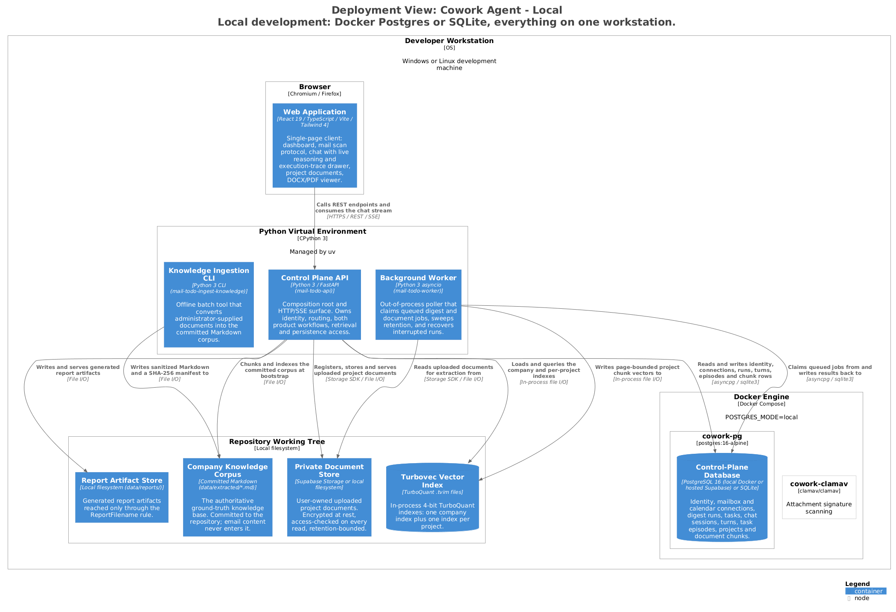
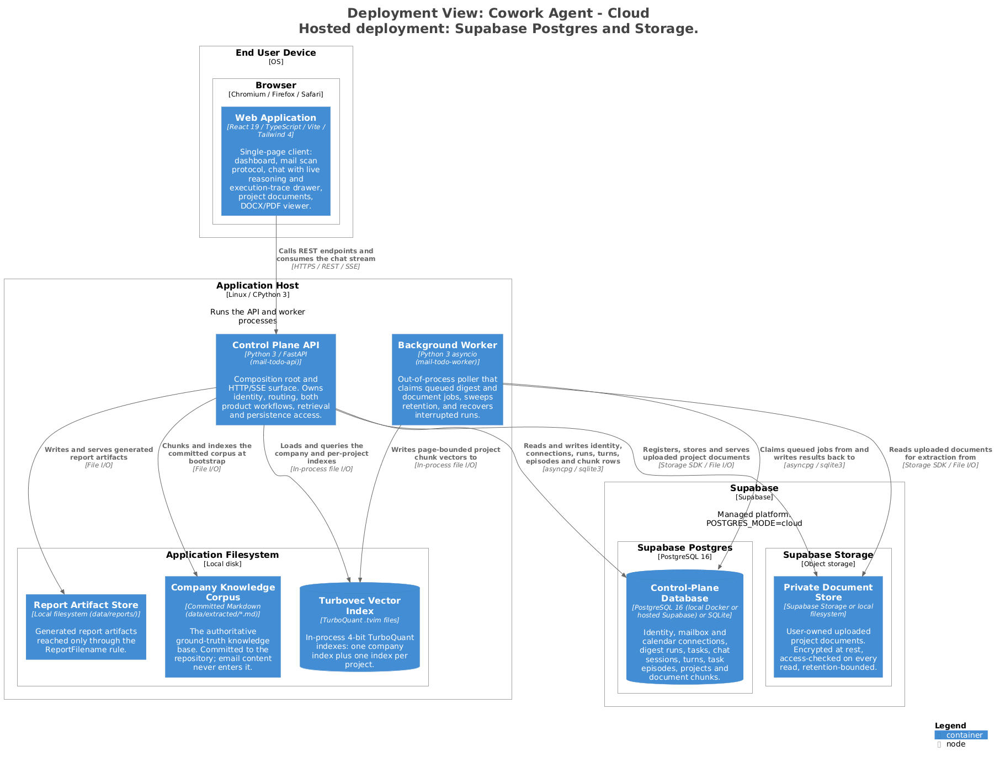

# Deployment

Two supported topologies. Both run the same containers and the same migrations; they
differ only in where the control-plane database and the private document store live.
`POSTGRES_MODE` in `.env` is the selector, and local and hosted are separate databases —
flipping the flag switches datasets, it does not migrate them.

---

## 1. Responsibilities

- Run the API and worker processes against one control-plane database.
- Give a workstation the same schema fidelity as the hosted deployment.
- Keep user-owned document bytes in a store that is private in both topologies.

## 2. Elements

### 2.1 Local — `POSTGRES_MODE=local` or `off`



> Generated from [`workspace.dsl`](workspace.dsl), view `deployment-local`.
> Do not edit the image or its `.puml`; see [README §4](README.md#4-regenerating-the-diagrams).

| Node | Contents |
|---|---|
| Browser | Web Application |
| Python virtual environment (uv) | Control Plane API, Background Worker, Ingestion CLI |
| Repository working tree | Company corpus, report store, private document store, Turbovec indexes |
| Docker Engine | `cowork-pg` (`postgres:16-alpine`), `cowork-clamav` (port 3310) |

With `POSTGRES_MODE=off` the control-plane database is instead the eight SQLite files
under `.data/` listed in [c3-api-platform §3](c3-api-platform.md#3-interfaces), and
documents go to `.data/project-documents` through `LocalPrivateStorage`. This is the only
mode in which the Outlook adapter and its OAuth routes are enabled.

### 2.2 Cloud — `POSTGRES_MODE=cloud`



> Generated from [`workspace.dsl`](workspace.dsl), view `deployment-cloud`.

| Node | Contents |
|---|---|
| End user device | Web Application |
| Application host | Control Plane API, Background Worker, and on its filesystem the company corpus, report store and Turbovec indexes |
| Supabase Postgres | Control-Plane Database, via `DATABASE_URL_CLOUD` (session or direct `:5432`) |
| Supabase Storage | Private Document Store, in private buckets |

## 3. Interfaces

| Setting | Values | Effect |
|---|---|---|
| `POSTGRES_MODE` | `off` · `local` · `cloud` | Selects SQLite, Docker Postgres, or hosted Supabase. |
| `DATABASE_URL_LOCAL` | connection string | Used when `local`. Docker Postgres at `127.0.0.1:5432` ([ADR-010](../../tasks/adr/ADR-010-local-postgres-control-plane-latency.md)). |
| `DATABASE_URL_CLOUD` | connection string | Used when `cloud`. Pooled with `psycopg_pool.AsyncConnectionPool`. |
| `APP_HOST` / `APP_PORT` | host / port | Bind address for `mail-todo-api`. |

Bring the local control plane up with:

```bash
docker compose up -d postgres
```

Integration tests default to the sibling database `cowork_mail_todo` and
`DROP SCHEMA public` — do not point a running app at that name.

## 4. Invariants

| Invariant | Enforced by |
|---|---|
| Local and cloud are separate databases. Data does not move between them. | [`config.py`](../../src/cowork_agent/config.py) |
| Migrations run idempotently in filename order under a PostgreSQL advisory lock, at both API lifespan startup and worker boot. | [`persistence/migrate.py`](../../src/cowork_agent/persistence/migrate.py) |
| Outlook is enabled only in SQLite mode; the Postgres provider constraint was deliberately left unchanged and no migration adds it. | [`api/mailboxes.py`](../../src/cowork_agent/api/mailboxes.py) |
| The company corpus is committed to the repository, so it ships with the application host rather than being provisioned. | [`data/extracted`](../../data/extracted) |
| `.env` and secrets are never committed, and never placed in a `VITE_*` variable. | [`.gitignore`](../../.gitignore) |

## 5. Failure and degradation

| Failure | Behaviour |
|---|---|
| Postgres unavailable at startup | Migrations and lifespan fail loudly. The process does not start on a half-migrated schema. |
| Supabase Storage unavailable | `document-health` degrades to `503`; document controls stay fail-closed. Chat without documents, and mail, continue. |
| ClamAV container not running | Signature scanning is unavailable; the scanner reports the degraded check rather than passing the file silently. |
| Two workers started against one database | Lease claiming prevents double execution. |

## 6. Known gaps

The cloud topology is modelled as one generic application host. The concrete hosting
platform, process supervisor and TLS termination are not in the model because they are
not expressed anywhere in this repository.

## 7. Related

- [c2-containers.md](c2-containers.md) — what is being deployed
- [c3-api-platform.md](c3-api-platform.md) — storage-mode selection and migrations
- [ADR-006](../../tasks/adr/ADR-006-supabase-managed-data-with-gmail-sessions.md) · [ADR-010](../../tasks/adr/ADR-010-local-postgres-control-plane-latency.md)
