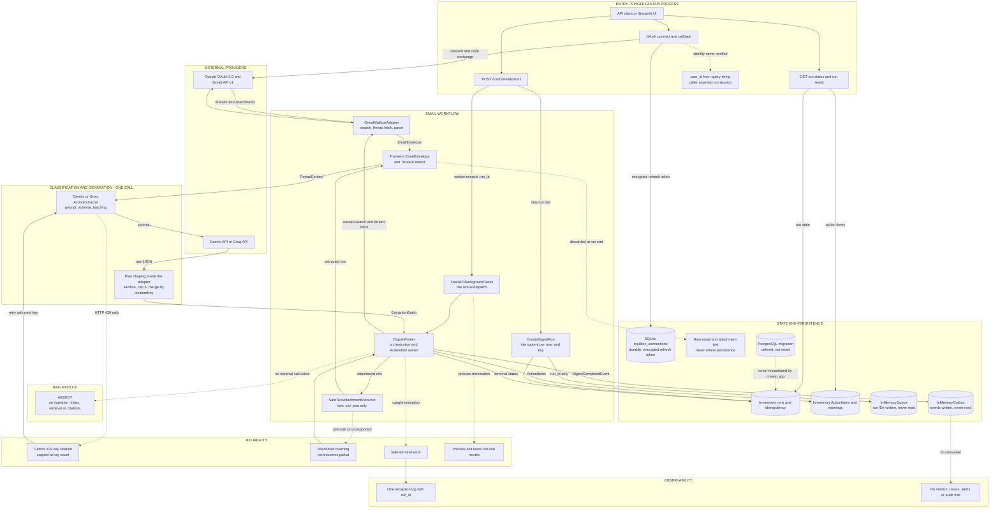
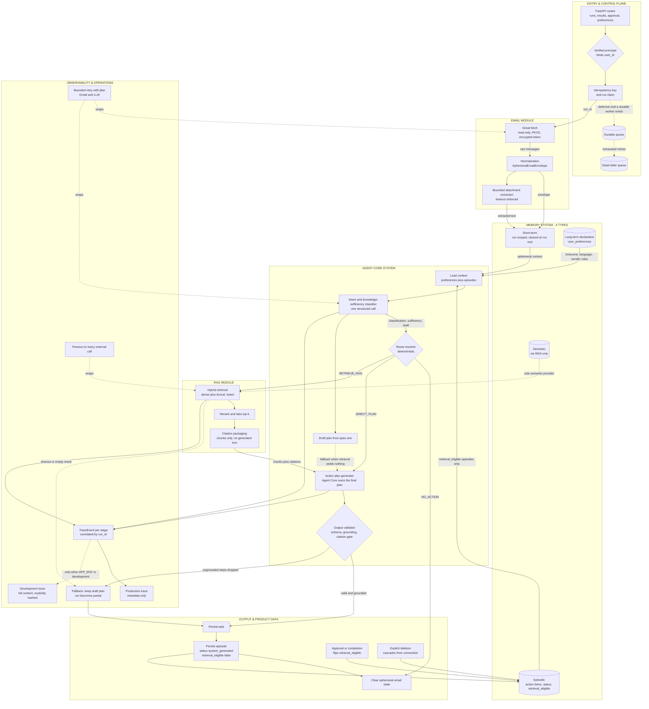
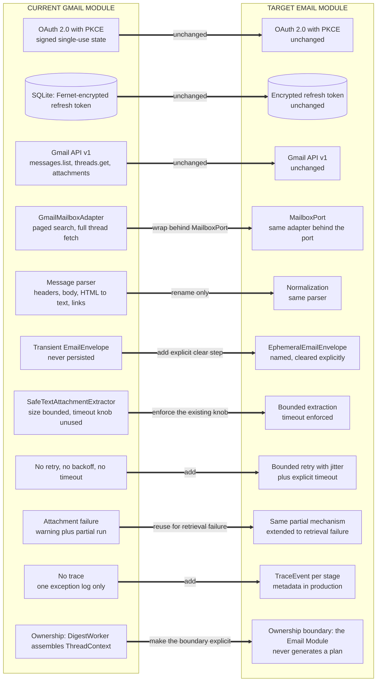
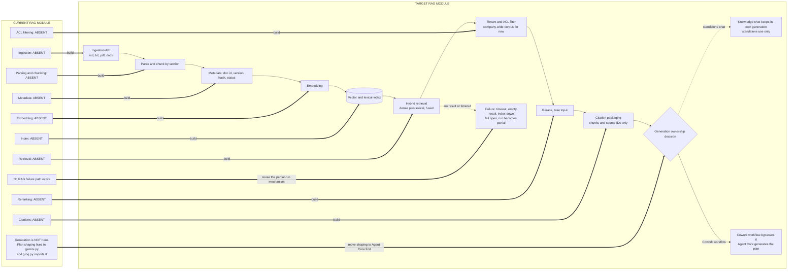
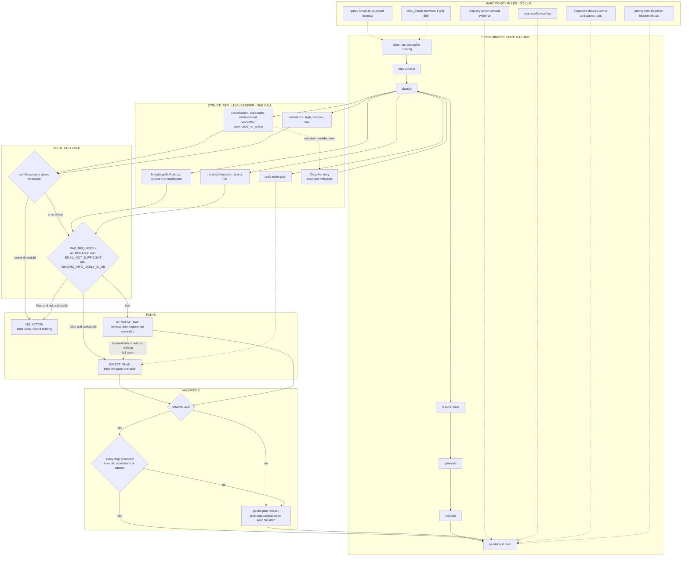
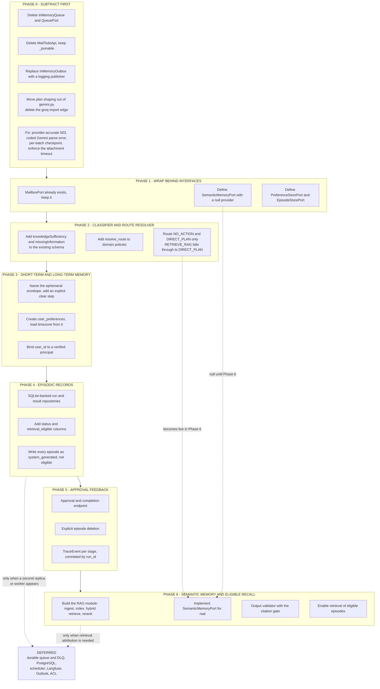

# Master Comparison — Current Architecture vs Deterministic Cowork Agent

**Produced by:** `docs/architectures/master-comparison-architecture.md` (steps 1–7)
**Inputs:** the three reviewed documents in `current-architectures/`, plus their review record
**Baseline:** commit `cf2fd49801d5932b26de82af9d104d730cf58271`, branch `main`
**Date:** 2026-08-07

### Label legend

Every non-trivial claim below carries one of these:

| Label | Meaning |
|---|---|
| **[S]** | Source-derived observation — verified against live code at the cited `file:line` |
| **[D]** | Design recommendation — my proposal, not present in any supplied material |
| **[A]** | Assumption — stated explicitly so it can be overturned |
| **[U]** | Unresolved question — needs a human answer |

### Answer to the decisive extraction question, and what it costs

> *Where does the final Action Plan generation currently happen: inside the RAG module, inside the Email workflow, or in a separate Agent or LLM service?*

**Inside the Email workflow, split between the LLM and the provider adapter. [S]** The LLM proposes `actionPlan` steps; `gemini.py:431-466` sanitizes and caps them at 5; `gemini.py:469-535` and `:548-570` rebuild plans for any group of two or more actions sharing a normalized `incidentKey`; `services.py:218` copies the resulting tuple into `ActionItem.action_plan` unchanged. `groq.py:14-21` imports the schema, system instruction, batching, prompt builder, parser and merge helpers straight from `gemini.py`, so both providers share one plan-shaping implementation. **[S]**

The prompt offers three consequences. My determination:

**This requires a change in orchestration ownership, delivered through a small interface adjustment. It does not require a larger separation between retrieval and generation. [D]**

Defence:

1. **The retrieval/generation separation problem does not exist here.** That consequence applies when generation is embedded inside a RAG module, so that adding an agent creates two competing generators. There is no RAG module in this checkout — no ingestion, index, retriever, reranker, or citation validator, and no vector or search dependency in `pyproject.toml`. **[S]** Nothing needs separating from nothing.
2. **There is a real ownership defect, and it is not where the prompt guessed.** Deterministic business policy — a 5-step cap, case-folded de-duplication, prompt-leak filtering, incident correlation, interleaved plan rebuilding — lives inside a *transport adapter* named after a vendor. The codebase already declares where that belongs: `domain/policies.py` opens with the docstring *"Deterministic policies applied after model extraction."* **[S]** The shaping rules in `gemini.py` are exactly that, in the wrong file.
3. **The fix is subtractive.** Moving plan shaping into the application layer deletes the `groq.py` → `gemini.py` import edge, reduces both adapters to transport plus parse, and gives the Agent Core ownership of the final plan — which is precisely what target rule 3 demands. No new component is created. A component is *moved*, and a dependency is *removed*.
4. **The interface adjustment is two schema fields, not a new service.** Knowledge-sufficiency classification fits inside the structured response that already carries `classification` and `confidence` (`gemini.py:220-326`). **[S]** No second classifier, no second call on the common path.

If a RAG implementation exists elsewhere and does own generation, consequence (c) applies instead and this determination must be revisited. See the resolution of that question immediately below.

### Resolution of the review's blocking question

`current-architecture-review.md` §4.1 asked whether "RAG not yet implemented" is the intended conclusion. **It is, and the repository says so in its own words.** `docs/references/rag_mail_pipeline_explanation.md:7` states: *"In the current live Python codebase (`src/mail_todo/`), 0% of the RAG pipeline exists … The RAG + Mail pipeline described below is the target blueprint defined in `ARCHITECHTURE.md`."* **[S]** `git branch -a` shows only `main`, with no remote-tracking branches fetched. **[S]**

`docs/references/ARCHITECHTURE.md` is therefore the **target-side** document throughout this comparison, never current state — despite its own header claiming to describe implemented code. It describes Outlook adapters, a `knowledge/` package, Qdrant, hybrid retrieval, Jina reranking, Langfuse and combined runs, none of which exist in `src/`. **[S]**

This is load-bearing and useful: the target architecture is not something I am inventing. `ARCHITECHTURE.md` §5.3 step 9 and §5.5 already specify draft-then-retrieve-then-reground, with the retrieval query built from the draft action's title, summary, incident key and evidence. **[S]** My recommendations converge on that design because it is already the stated intent.

---

## Step 1 — The existing architecture, as provided

No redesign in this section. Everything is source-derived unless labelled otherwise.

### 1.1 Services

One deployable: the FastAPI process created by `create_app()` (`server.py:44-292`). The Streamlit app in `gui/` is a test client, not a backend. There is no second service, no worker process, and no internal service boundary. External dependencies are Google OAuth, Gmail API v1, and one of Gemini or Groq.

### 1.2 Modules

| Module | Responsibility |
|---|---|
| `api/server.py` | Composition root, all HTTP routes, background dispatch |
| `api/handlers.py` | `_jsonable` serializer; also an unwired `MailTodoApi` class |
| `application/services.py` | `CreateDigestRun`, `DigestWorker`, `GetDigestResult` |
| `application/ports.py` | Nine protocols: mailbox, connections, attachments, actions, queue, publisher, runs, results, outbox |
| `application/contracts.py` | `ThreadContext`, `ExtractedAction`, `EmailExtraction`, `ExtractionBatch`, `ExtractionLimits` |
| `domain/models.py` | `EmailEnvelope`, `ActionItem`, `ActionPlanStep`, `DigestRun`, `EvidenceRef`, enums |
| `domain/policies.py` | Query normalization, limit validation, priority calculation, action fingerprinting |
| `infrastructure/gmail.py` | OAuth driver, mailbox adapter, message parser, error mapping |
| `infrastructure/gemini.py` | Transport, key rotator, prompt, schema, parser, **plan shaping and incident merging** |
| `infrastructure/groq.py` | Transport and error mapping only; everything else imported from `gemini.py` |
| `infrastructure/memory.py` | In-memory run/result repositories, queue, outbox, attachment extractor, test fakes |
| `infrastructure/connections.py` | SQLite mailbox connection repository |
| `infrastructure/security.py` | Fernet token cipher, HMAC-signed OAuth state manager |
| `infrastructure/config.py` | `GmailSettings`, `GeminiSettings`, `GroqSettings` from environment |

**No RAG module. No agent module. No memory module. No scheduler.**

### 1.3 APIs

Nine endpoints: `GET /health`; OAuth connect and callback; connection list and delete; unread preview; `POST /v1/mail-todo/runs`; run status; run result. No ingestion, retrieval, knowledge, chat, notification, approval, or preference endpoint exists.

### 1.4 Databases

| Store | Type | Durability |
|---|---|---|
| `mailbox_connections` | SQLite, default `.data/mail_todo.db` | Durable |
| Runs and idempotency map | `InMemoryRunRepository` | Process lifetime |
| Action items, warnings, processed metadata | `InMemoryResultRepository` | Process lifetime |
| `migrations/001_mail_todo.sql` | PostgreSQL DDL for connections, schedules, runs, schedule occurrences, action items, attachment extractions, outbox | **Not wired** — `create_app()` instantiates no PostgreSQL adapter |

### 1.5 Queues

**There is no queue.** `InMemoryQueue` records run IDs and nothing reads them. The instance is constructed inline at `server.py:70` and never stored on `app.state`, so its `run_ids` list is unreachable by any other code in the process. `InMemoryOutbox` is constructed inline at `server.py:88`; `DigestWorker` calls `.add()` on it (`services.py:243`) but its `pending()` and `mark_published()` can never be called. **Both are provably write-only.** Actual dispatch is `background_tasks.add_task(worker.execute, run.id)` at `server.py:231`, issued by the route, not by `CreateDigestRun`.

### 1.6 State ownership

| State | Owner | Lifetime |
|---|---|---|
| OAuth client secrets, cipher key, state secret | Process environment via `GmailSettings` | Process |
| Encrypted refresh token, mailbox ownership | `SQLiteMailboxConnectionRepository` | Until disconnect |
| OAuth nonce and PKCE verifier | `OAuthStateManager`, in memory | Invalid at TTL; evicted only by a later sweep, its own consumption, or restart |
| Raw email, normalized envelope, thread context | `GmailMailboxAdapter` → `DigestWorker`, transient | One worker call |
| Extracted attachment text | `SafeTextAttachmentExtractor` result, transient | One worker call |
| Run state, counters, safe error | `InMemoryRunRepository` | Process |
| Action items, warnings, processed metadata | `InMemoryResultRepository` | Process |
| Completion event | `InMemoryOutbox` | Process, unreadable |
| Candidate plan steps | LLM, then `gemini.py` shaping functions | One call |
| Final `ActionItem.action_plan` | Assigned unchanged by `DigestWorker` at `services.py:218` | With the action item |

### 1.7 Retry behavior

- **Gmail: none.** No retry, backoff, jitter, or explicit 429 handling.
- **Gemini: key rotation only, on HTTP 429 only** (`gemini.py:136-152`). Attempts are `min(GEMINI_MAX_ATTEMPTS_PER_REQUEST, key count)` (`config.py:106`), so a single-key deployment retries zero times. `GEMINI_ROTATE_ON_RATE_LIMIT=false` re-raises immediately. Non-429 errors are never retried.
- **Groq: none.**
- **Batches are not checkpointed.** `gemini.py:124-127` loops batches and lets any failure escape, discarding every earlier successful batch in the run.
- **Idempotent replay re-registers a background task**, but `claim` refuses a run that is no longer `queued` (`memory.py:43-48`), so the duplicate execution is a no-op.

### 1.8 Timeout behavior

- Gemini: `HttpOptions(timeout=timeout_seconds * 1000)` (`gemini.py:70-73`).
- Groq: `urllib` request timeout.
- Gmail: **no application timeout configured.**
- Attachments: `ExtractionLimits.timeout_seconds = 60` is defined at `contracts.py:34` and **never read** by `SafeTextAttachmentExtractor`. It is a dead knob.

### 1.9 Persistence paths

Exactly one write reaches durable storage: the encrypted refresh token and mailbox connection row, on OAuth callback. Everything a run produces is in-process. **Raw email bodies and attachment text are never written anywhere** — no store, no log statement, no API field carries them. This is the strongest thing the current system has going for it against the target.

### 1.10 Observability paths

One log statement: `logger.exception("Digest run %s failed", run.id)` (`services.py:238`). One event write that nothing can read (`services.py:243`). Safe error codes on the run, returned by polling. `processedEmails` metadata exposed in responses only when `APP_ENV` is development, dev or local (`server.py:311-312`). No metrics, no traces, no correlation IDs beyond `run_id` in that single log line, no audit trail, no external backend.

### 1.11 Gmail data flow

`POST /runs` → SQLite ownership check → `CreateDigestRun` → `BackgroundTasks` → `DigestWorker._fetch_threads` → paged `users.messages.list` with `is:unread in:inbox` forced by `normalize_query` → per-thread `users.threads.get(format="full")` → retain only messages the unread search selected → parse into `EmailEnvelope` → per-attachment download and bounded extraction → `DigestWorker` assembles `ThreadContext` → provider adapter → shaped `ExtractionBatch` → filter, fingerprint, prioritize, sort → `InMemoryResultRepository`.

### 1.12 RAG data flow

**None.** The nearest flow is attachment extraction, which is not RAG: text is read, passed into one prompt, and discarded. It is never chunked, embedded, indexed, or searched.

### 1.13 Where generation occurs

Answered above. Prompt build and shaping in `gemini.py`; candidate authoring in the external provider; assignment in `services.py:218`.

### 1.14 Where routing occurs

**There is no route resolver.** The only routing-shaped logic is a filter in the middle of the worker loop (`services.py:167-172`): skip unless `classification == "actionable"`, then skip any candidate with no evidence or `confidence == "low"`. That is a two-way keep/drop gate, evaluated after generation has already happened, not a decision that selects a path before it.

### 1.15 Where memory currently exists, even if not called memory

This is the most useful part of the extraction, because three of the four target memory types already have a seed.

| Target memory type | What already plays that role | Gap |
|---|---|---|
| **Short-term** | `EmailEnvelope` + `ThreadContext` + local vars in `DigestWorker.execute`. Ephemeral by construction, discarded at run end, never persisted. **Already satisfies the target's privacy boundary.** | Not a named or inspectable object; no explicit clear step; no TTL because scope ends the lifetime |
| **Long-term declarative** | `DigestWorker.execute(user_timezone: str = "UTC")` at `services.py:102` — a preference, hardcoded as a default parameter and never supplied by any caller | No store, no other preference exists |
| **Episodic** | `ActionItem` is already an episode: title, summary, plan, evidence, sender, deep link, fingerprint, `freshness` new/seen/changed, confidence, priority. `fingerprint_seen` (`memory.py:72-77`) scans prior items — this is episodic recall | Process-local, so recall dies at restart. No `status`, no `retrieval_eligible` |
| **Semantic** | Nothing | Entirely absent |

### 1.16 Cannot be determined from the material

- Deployment replica count, log destination, log retention. **[U]**
- Whether any external authentication layer fronts the API. `user_id` is an unverified query parameter (`server.py:107`). **[U]**
- Whether `migrations/001_mail_todo.sql` targets this runtime or the larger system in `ARCHITECHTURE.md`. **[U]**
- Whether Outlook support, `knowledge/`, and combined runs exist in another repository. **[U]**

---

## Step 2 — Current versus target

`K` = keep, `M` = modify, `R` = remove, `Miss` = missing today.

| Concern | Current implementation | Target implementation | K | M | R | Miss | Reason |
|---|---|---|:-:|:-:|:-:|:-:|---|
| Gmail ingestion | `GmailMailboxAdapter`, read-only scope, PKCE, Fernet-encrypted refresh token, paged search, full-thread fetch | Unchanged, behind `MailboxPort` | yes | | | | Works, is scoped minimally, and target rule 1 says keep Gmail as an external module |
| Email normalization | Adapter builds `EmailEnvelope`; worker assembles `ThreadContext` | Same objects, named `EphemeralEmailEnvelope` in contracts | yes | | | | Rename in documentation only; the shape is already correct |
| Triggering and scheduling | `POST /runs` only. `digest_schedules` and `schedule_occurrences` exist in the unused migration | On-demand now; scheduler deferred | yes | | | yes | No scheduler exists and none is needed to reach the target flow. Defer |
| Intent classification | `classification` enum of four values, produced in the same structured call as generation | Same call, same field | yes | | | | A classifier already exists; it is simply not named as one |
| Knowledge-sufficiency classification | Absent | Two new fields in the existing response schema | | yes | | yes | The cheapest possible addition: extend `EXTRACTION_SCHEMA`, no new call |
| Direct-plan path | The only path. Every actionable email gets an ungrounded plan | Explicit `DIRECT_PLAN` route, same behavior | yes | yes | | | Behavior kept; it stops being implicit |
| RAG retrieval path | Absent | `RETRIEVE_RAG` route behind `SemanticMemoryPort` | | | | yes | The one genuinely new subsystem |
| RAG generation ownership | Not applicable — no RAG. Plan shaping owned by `gemini.py`, inherited by `groq.py` via import | Agent Core owns final plan. RAG returns chunks and citations only | | yes | | | Resolves the ownership defect and pre-empts duplicate generation |
| Short-term state | Transient envelopes and local variables; never persisted | Named `EphemeralEmailEnvelope`, explicit clear at run end | yes | yes | | | Already correct; needs a name and an explicit termination step for auditability |
| Long-term memory | One hardcoded `user_timezone="UTC"` default | `user_preferences` row in the existing SQLite database | | | | yes | One small table, not a subsystem |
| Episodic memory | `ActionItem` in a process-local repository; `fingerprint_seen` recall | Same entity, durable, plus `status` and `retrieval_eligible` | yes | yes | | | The entity and its DDL already exist in `migrations/001_mail_todo.sql`. Two columns short |
| Semantic memory | Absent | RAG module as the sole provider, one store | | | | yes | Target rule: no duplicate semantic stores |
| Output persistence | In-memory; lost at restart | Durable action items and runs | | yes | | | Approval feedback across runs is impossible without durability |
| Provenance | `EvidenceRef` with `source_kind`, filename, location, excerpt, `source_message_id`. Email-side only | Same, plus `KnowledgeCitation` for retrieved chunks | yes | | | yes | Email provenance is already good; knowledge provenance does not exist |
| Confidence | `Confidence` enum on every action; worker drops `low` | Same enum, drives the route resolver, with a named threshold | yes | yes | | | The signal exists; it just is not used for routing |
| TTL | None. In-memory loss at restart is not a policy | Short-term ends at run end; episodic retained; OAuth state TTL kept | yes | | | yes | An accidental lifetime is not a retention policy |
| Deletion | Disconnect deletes a SQLite row. Everything else evaporates | Explicit episode deletion, cascading from the connection | | yes | | yes | The migration already declares `ON DELETE CASCADE` from `mailbox_connections` |
| Retries | Gmail none; Groq none; Gemini key rotation on 429 only, capped at key count | One bounded retry with jitter at the port boundary, for Gmail and LLM alike | | yes | | | Key rotation is failover, not retry. A single-key deployment silently has none |
| Timeouts | Gemini and Groq have them; Gmail does not; `ExtractionLimits.timeout_seconds` is never read | Timeout on every external call; the attachment knob enforced or deleted | | yes | | | A configuration value that does nothing is worse than no value |
| Fallback paths | Attachment failure to `partial` — and it works well | Same mechanism extended to retrieval failure and partial plans | yes | yes | | | Reuse the partial-run machinery rather than inventing degraded modes |
| Observability | One exception log; one unreadable event | Structured `TraceEvent` per stage, correlated by `run_id` | | yes | | yes | Turn the dead outbox write into the first real signal |
| Development traces | `_is_development()` gates `processedEmails` in responses | Same gate, extended to full-content traces with the mandated marker | yes | yes | | | The gate pattern already exists; reuse it rather than adding a flag |
| User or tenant namespaces | `user_id` from a query parameter, checked for ownership, never authenticated | Same checks, but bound to a verified principal before any memory write | | yes | | yes | Memory namespacing inherits the trust level of the identity it keys on |
| Queue and dead-letter | `InMemoryQueue` is write-only and unread; `InMemoryOutbox` is write-only | Deferred. Durable queue and DLQ only when a durable worker exists | | | yes | yes | Delete the fake now; add the real one when it has a consumer |
| Unwired API class | `MailTodoApi` in `api/handlers.py`; only `_jsonable` is imported | Deleted | | | yes | | Dead duplicate of the live routes, and it has already drifted from them |

---

## Step 3 — Simplify before redesigning

The prompt asks for adaptation over replacement, and the README's step 10 singles out *simplify the system before adding new components*. Applying the target's own eight rules, here is what comes out **before** anything goes in.

### 3.1 Delete: `InMemoryQueue` and `QueuePort`

Constructed inline at `server.py:70`, never bound to `app.state`, never read. `CreateDigestRun` takes it as a constructor argument solely to append a string to an unreachable list. **[S]**

Deleting it removes one port, one adapter, one constructor parameter, and one misleading arrow from every diagram of this system. The target requires a queue and a dead-letter queue — but a queue with no consumer is not a step toward one, it is a decoy that makes reviewers believe asynchronous dispatch already exists. Add a real queue in the same change that adds a real worker process, not before. **[D]**

### 3.2 Delete: `MailTodoApi`

`api/handlers.py:11-52`. `server.py:35` imports only `_jsonable` from that module. **[S]** The class duplicates three live routes and has already drifted from them: its `statusUrl` omits `?user_id=`, and it has no development gate on `processedEmails`. Keep `_jsonable`; delete the class. **[D]**

### 3.3 Replace, do not delete: `InMemoryOutbox`

`DigestWorker` writes a `DigestCompletedEvent` on every run (`services.py:243`) into an object nothing can read. **[S]** Two options, and the lazy one is better:

Replace the adapter with a logging publisher that emits one structured line per terminal run. The write already happens at the right place with the right data; only the sink is wrong. This converts dead code into the observability baseline the target needs, at the cost of a handful of lines and zero dependencies. Keep `CompletionOutboxPort` and `DigestCompletedEvent` — they are the natural attachment point for a real broker later, and the `outbox_events` table already exists in the migration. **[D]**

### 3.4 Move, do not rewrite: plan shaping

`_parse_action_plan`, `_merge_correlated_emails`, `_merge_actions`, `_select_merged_steps`, `_normalize_incident_key`, `_impact_rank` (`gemini.py:431-581`) are deterministic post-model policy. They operate on `application.contracts` types (`EmailExtraction`, `ExtractedAction`), not on anything Gemini-specific. **[S]**

Move them verbatim into a new `application/extraction_policies.py` — sibling to `services.py`, matching the placement rule the codebase already follows for `domain/policies.py`, whose docstring is *"Deterministic policies applied after model extraction."* **[S]**

This single move:

- deletes the `groq.py:14-21` import-from-`gemini` edge, the one real structural defect in the codebase;
- reduces both provider adapters to transport, prompt, and JSON parse;
- puts final Action Plan ownership in the application layer, satisfying target rule 3 without creating an Agent Core service;
- makes the shaping rules unit-testable without a provider stub.

It is a move plus an import change. No logic is rewritten. **[D]**

### 3.5 Do not add an Agent Core service

`DigestWorker` already claims runs, orchestrates every stage, applies the classification and confidence gate, fingerprints, deduplicates, prioritizes, sorts, sets terminal state, and emits the completion event. That is the Agent Core. **[S]** Adding a separate agent service beside it would duplicate all of it and create two owners of run state.

The Agent Core is `DigestWorker` plus §3.4's policies plus §3.6's route resolver. Nothing is instantiated that does not exist today. **[D]**

### 3.6 Do not add a classifier call or a classifier service

The structured response already carries `classification` (four values) and per-action `confidence` (`gemini.py:237-239`, `:318`). **[S]** Knowledge-sufficiency needs two more fields in the same object:

```
"knowledgeSufficiency": {"enum": ["sufficient", "insufficient"]}
"missingInformation":   {"type": ["string", "null"]}
```

Zero new calls, zero new services, zero added latency. The route resolver is then a pure function over data the system already receives. **[D]**

### 3.7 The route resolver is a function, not a component

```
RAG_REQUIRED = ACTIONABLE
           AND EMAIL_NOT_SUFFICIENT
           AND MISSING_INFORMATION_LIKELY_EXISTS_IN_COMPANY_KB
```

Three booleans from fields the classifier already returns, plus a confidence floor. It belongs in `domain/policies.py` beside `calculate_priority`, returns one of `NO_ACTION`, `DIRECT_PLAN`, `RETRIEVE_RAG`, and is fully testable without any provider. **[D]**

### 3.8 Retrieve on the exception, not on every run

The expensive part of the target is a second generation call. It does not need to happen on every action.

Pass 1 is the existing call: classify, emit route signals, and draft a plan. If the route is `NO_ACTION` or `DIRECT_PLAN` — which is 100% of traffic today — the run ends exactly as it does now, at today's cost. Only `RETRIEVE_RAG` triggers retrieval and a second, grounded generation for that action alone.

This is not my invention: `ARCHITECHTURE.md` §5.3 step 9 and §5.5 already specify drafting first and regenerating grounded, with the query built from the draft's title, summary, incident key and evidence. **[S]** My contribution is only to state that it must stay conditional and must fail open. **[D]**

### 3.9 Four memory types, two new stores

- **Short-term** — exists. Rename in contracts, add an explicit clear step. No store. **[S]**
- **Long-term declarative** — one `user_preferences` table in the SQLite database that is already wired and already durable. Not PostgreSQL, not a memory service. **[D]**
- **Episodic** — the `action_items` table in `migrations/001_mail_todo.sql:65-90` is already the episode schema, with the right columns and a `run_id` cascade. It needs `status text NOT NULL DEFAULT 'system_generated'` and `retrieval_eligible boolean NOT NULL DEFAULT false`. **[S] + [D]**
- **Semantic** — the RAG module, reached only through `SemanticMemoryPort`. One provider, one store. **[D]**

Total: one new table, two new columns, one new port. Not a memory subsystem.

### 3.10 Keep SQLite; treat PostgreSQL as the multi-replica trigger

Episodic memory must survive restart, because approval feedback spans runs. It does not follow that it must be PostgreSQL. SQLite is already wired, already durable, and already has a working repository pattern in `connections.py`. **[S]**

Make the existing SQLite database durable for runs and action items now, keeping column names identical to `001_mail_todo.sql` so the eventual move is mechanical. Adopt PostgreSQL when — and only when — a second replica or an independent worker process exists, since that is the point at which idempotency, claim, and fingerprint recall genuinely stop working in SQLite. **[D]**

### 3.11 Not added, deliberately

Multi-agent orchestration, a Reflexion loop, a second semantic store, a message broker, a scheduler, a vector cache, an evaluation harness, Langfuse. The target principles forbid the first two; the rest are absent, unneeded for the target flow, and each would arrive with operational weight this system has no consumer for yet. **[D]**

---

## Step 4 — Recommended changes

Every entry gives: current component, proposed component, reason, migration difficulty, schema or API change, backward-compatibility risk.

### 4.1 Keep unchanged

| Current component | Proposed | Reason | Difficulty | Schema / API change | Compat risk |
|---|---|---|---|---|---|
| Gmail OAuth: PKCE, HMAC-signed single-use state, Fernet token encryption (`gmail.py`, `security.py`) | Same | Correct and minimally scoped. Nothing in the target improves it | None | None | None |
| `gmail.readonly` scope enforcement (`config.py:47-48`) | Same | Hard guarantee that the agent cannot mutate a mailbox | None | None | None |
| `GmailMailboxAdapter` search, thread fetch, message parse | Same, behind `MailboxPort` | Target rule 1: Gmail stays an external module | None | None | None |
| `domain/policies.py`: `normalize_query`, `validate_max_emails`, `calculate_priority`, `action_fingerprint` | Same | Deterministic, tested, exactly where the target wants policy | None | None | None |
| Idempotency-Key plus `queued → running` claim | Same | Prevents duplicate runs, already correct | None | None | None |
| Filter gate: actionable, evidence present, confidence not low (`services.py:167-172`) | Same, relocated into the route resolver | The target's confidence threshold, already implemented | None | None | None |
| Short-term ephemerality: raw email never persisted | Same | **Already satisfies the target privacy boundary in full.** Do not weaken it | None | None | None |
| Result and polling API shapes | Same | Clients depend on them; the target adds fields, it does not change these | None | Additive only | None |
| `_is_development()` trace gate (`server.py:311-312`) | Same, reused for trace content | The mandated development-only content marker needs exactly this gate | None | None | None |

### 4.2 Wrap behind a new interface

| Current component | Proposed | Reason | Difficulty | Schema / API change | Compat risk |
|---|---|---|---|---|---|
| Nothing (absent) | `SemanticMemoryPort` — `retrieve(SemanticRetrievalRequest) -> SemanticRetrievalResponse` | Target rule 2: RAG as a pluggable semantic-memory provider. Defining the port first lets Phase 1 land with a null implementation and no RAG at all | Low | New internal port; no HTTP change | None — a null provider makes `RETRIEVE_RAG` degrade to `DIRECT_PLAN` |
| Nothing (absent) | `PreferenceStorePort` — `load(user_id) -> LongTermPreferences` | Long-term declarative memory has one consumer and should not be reachable any other way | Low | New `user_preferences` table | None |
| `InMemoryResultRepository` (episodic in all but name) | `EpisodeStorePort` over the existing `ResultRepository` shape | Names the episodic role and adds the write policy in one place | Low | Two new columns | Low — the in-memory implementation stays for tests |
| `GeminiActionExtractor` / `GroqActionExtractor` | Same port, reduced to transport plus parse | Once §3.4 lands, the port contract is unchanged but the adapters get much smaller | Low | None | None |

### 4.3 Modify internally

| Current component | Proposed | Reason | Difficulty | Schema / API change | Compat risk |
|---|---|---|---|---|---|
| `gemini.py:431-581` plan shaping | Move verbatim to `application/extraction_policies.py` | §3.4. Deletes the `groq.py` → `gemini.py` coupling and hands plan ownership to the Agent Core | Low | None — pure relocation | **Low, but real.** Both providers change import paths in one commit. Character-for-character move, no behavior edit |
| `EXTRACTION_SCHEMA` (`gemini.py:220-326`) | Add `knowledgeSufficiency` and `missingInformation` | §3.6. Enables routing with no extra call | Low | LLM response schema only, never HTTP | Low — treat a missing field as `sufficient`, so old responses keep working |
| `DigestWorker.execute` | Insert route resolution between extraction and item construction | Makes the implicit filter an explicit three-way route | Medium | None | Low — `DIRECT_PLAN` reproduces current behavior exactly |
| `services.py:102` `user_timezone="UTC"` | Load from `PreferenceStorePort`, default to `"UTC"` | Turns a hardcoded default into the first long-term memory read | Low | Reads `user_preferences` | None — the default is preserved |
| `InMemoryRunRepository`, `InMemoryResultRepository` | SQLite-backed implementations of the same protocols | Durability. Ports are unchanged, so this is an adapter swap at `create_app()` | Medium | New SQLite tables mirroring `001_mail_todo.sql` | Medium — first time run state outlives a restart. Idempotency keys now persist, which is the point but changes replay behavior |
| Gemini key rotation as retry (`gemini.py:136-152`) | Bounded retry with jitter at the port boundary; rotation kept as one strategy inside it | A single-key deployment currently has **zero** retries, and no non-429 error is ever retried | Medium | None | Low — a retry that did not exist cannot regress |
| Gmail calls (no timeout, no retry) | Same bounded retry and an explicit timeout | The only external dependency with neither | Low | None | Low |
| Batch loop (`gemini.py:124-127`) | Catch per batch; keep successes; mark the run `partial` | One late failure currently discards every earlier successful batch | Low | None | Low — strictly more output than today |
| `ExtractionLimits.timeout_seconds` (`contracts.py:34`, never read) | Enforce with `asyncio.timeout`, or delete the field | A knob that does nothing misleads every reader of the config | Low | None | Low — enforcement may newly fail a pathological attachment, which becomes a warning and a `partial` run |
| 503 message hardcoded to "Gemini is not configured" (`server.py:221`) | Report the provider that actually failed | Misattributes Groq and invalid-`LLM_PROVIDER` failures | Low | Message text only | None |
| Gemini `_parse_batch` raising bare `ValueError` (`gemini.py:366-419`) | Wrap as a coded error, matching Groq's `GROQ_API_ERROR` | The same failure class reports differently per provider; Gemini's surfaces as generic `RUN_PROCESSING_FAILED` | Low | New error code | Low — a previously generic code becomes specific. Note it for clients |
| `InMemoryOutbox` | Logging completion publisher | §3.3. Same write site, a sink that exists | Low | None | None |

### 4.4 Add

| Current component | Proposed | Reason | Difficulty | Schema / API change | Compat risk |
|---|---|---|---|---|---|
| Absent | `resolve_route()` in `domain/policies.py` | The target's deterministic state machine, as a pure function | Low | None | None |
| Absent | `user_preferences` table plus loader | Long-term declarative memory | Low | One table | None |
| Absent | `status` and `retrieval_eligible` on action items | The mandated episodic policy: persist as `system_generated`, `retrieval_eligible = false` | Low | Two columns with safe defaults | None — defaults preserve existing rows |
| Absent | Output validator: schema check, citation gate, partial-plan fallback | The target's grounding validation. Cheap: a step citing an unknown source ID is dropped, and a plan reduced to zero grounded steps falls back to the draft | Medium | None | Low |
| Absent | RAG module: ingestion, chunking, embedding, index, hybrid retrieval, reranking, citation packaging | Semantic memory. The largest single piece of new work, and the only genuinely new subsystem | **High** | New store, new endpoints, new dependencies | Medium — see risks |
| Absent | `TraceEvent` emission per stage, correlated by `run_id` | The target's observability plane, at the lowest possible cost: structured logs, no backend | Low | None | None |
| Absent | Approval or completion endpoint flipping `retrieval_eligible` | Without it, no episode ever becomes retrieval-eligible and Phase 6 can never start | Low | One endpoint, one column write | None |
| Absent | Explicit episode deletion | The target requires a deletion path; `ON DELETE CASCADE` from `mailbox_connections` already exists in the migration | Low | One endpoint | None |

### 4.5 Remove or deprecate

| Current component | Proposed | Reason | Difficulty | Schema / API change | Compat risk |
|---|---|---|---|---|---|
| `InMemoryQueue` and `QueuePort` | Delete both | Provably write-only; makes the system look asynchronous when it is not | Low | Removes a constructor argument from `CreateDigestRun` | **None** — nothing reads it |
| `MailTodoApi` (`api/handlers.py:11-52`) | Delete the class, keep `_jsonable` | Unwired, drifted duplicate of the live routes | Low | None | **None** — nothing imports it |
| `InMemoryOutbox` | Replace per §3.3 | Write-only | Low | None | None |
| `groq.py:14-21` import block | Delete once §3.4 lands | The coupling disappears with the move; nothing to reconcile | Low | Import paths | Low |
| Plan-shaping code inside `gemini.py` | Remove from the adapter after relocation | Vendor adapters should not own business policy | Low | None | Low |

### 4.6 Defer until later

| Item | Why deferred | Trigger to revisit |
|---|---|---|
| Durable queue and dead-letter queue | There is no durable worker to consume from one. A broker without a consumer repeats today's mistake at greater cost | The first independent worker process, or a run that must survive API restart |
| PostgreSQL migration | SQLite is wired and sufficient for one process | A second replica, or an out-of-process worker |
| Scheduler and `digest_schedules` | `POST /runs` covers every target flow; the tables exist and can wait | A product requirement for unattended runs |
| Langfuse and external tracing | Structured logs with `run_id` answer every question this system currently raises | RAG lands and retrieval quality needs per-stage attribution |
| Multi-agent, Reflexion | Explicitly forbidden by the target principles | Not applicable |
| Outlook and combined runs (`ARCHITECHTURE.md` §5.2) | Not in this checkout and orthogonal to every target principle | A second provider becomes a requirement |
| Attachment sandboxing and OCR | Real risks, but unchanged by this migration and independently scoped | Untrusted binary formats beyond text, csv and json |
| Per-tenant knowledge ACL | Requires a corpus first, and `ARCHITECHTURE.md` §5.4 already notes the corpus is company-wide | The first non-company-wide document |

---

## Step 5 — Diagrams

### Diagram 1 — Current overall architecture



### Diagram 2 — Target overall architecture

Dotted edges are deferred or optional. Solid edges are the production path after Phase 4.



### Diagram 3 — Gmail module: current versus target



### Diagram 4 — RAG module: current versus target

The left side answers the prompt's question directly: **generation does not occur inside RAG, because RAG does not exist.** It occurs in the Email workflow's provider adapter.



**Decision recorded [D]:** take *both* options the prompt offers, scoped differently. The knowledge-chat endpoint keeps its own grounded generation for standalone use. The Cowork workflow bypasses it: RAG returns chunks and citation candidates, and the Agent Core makes the generation call. This satisfies "avoid duplicate generation between the RAG module and Agent Core" for the workflow that matters, without crippling a chat feature whose whole purpose is generation. Note that `ARCHITECHTURE.md` §5.5 currently places grounded plan generation *inside* the RAG side; this recommendation deliberately overrides that, because target rule 3 assigns final plan ownership to the Agent Core. **[U]** — confirm this override.

### Diagram 5 — Agent Core with intent classifier



**Fail-open, stated explicitly [D]:** retrieval failure never fails the run. The draft plan from pass one is kept, `retrieval_status` records the reason, and the run becomes `partial` — reusing the mechanism attachment failures already use. A knowledge outage degrades plan quality; it does not cost the user their action items.

### Diagram 6 — Four-type memory system

```mermaid
flowchart TB
    AGENT["AGENT CORE"]
    NS{"Namespace resolver<br/>user_id from verified principal"}

    subgraph STMEM["SHORT-TERM MEMORY"]
        ST1["Run state, raw email, classifier output,<br/>retrieved context, candidate output"]
        ST2["Read: this run only<br/>Write: unrestricted within the run"]
        ST3["TTL: ends with the run<br/>Deletion: explicit clear step"]
        ST4["Provenance: source message id<br/>Confidence: carried, not stored"]
    end

    subgraph LTMEM["LONG-TERM DECLARATIVE MEMORY"]
        LT1[("user_preferences")]
        LT2["Timezone, language,<br/>sender priority rules, output preferences"]
        LT3["Read: at load context<br/>Write: only by explicit user action"]
        LT4["TTL: none<br/>Deletion: on user request"]
        LT5["RAW EMAIL MUST NEVER ENTER"]
    end

    subgraph EPMEM["EPISODIC MEMORY"]
        EP1[("action_items with status<br/>and retrieval_eligible")]
        EP2["Action items, plans, citations,<br/>Gmail pointer, status, outcome"]
        EP3["Write: status system_generated,<br/>retrieval_eligible false"]
        EP4["Read for recall: retrieval_eligible true only"]
        EP5["Provenance: evidence refs plus citations<br/>Confidence: stored per item"]
        EP6["Deletion: explicit, cascades from connection"]
        EP7["RAW EMAIL BODY MUST NEVER ENTER<br/>only pointers and short excerpts"]
    end

    subgraph SEMEM["SEMANTIC MEMORY"]
        SE1[("Company procedures, policies,<br/>governance documents")]
        SE2["Provided solely by the RAG module"]
        SE3["Read: retrieval only<br/>Write: document ingestion only"]
        SE4["Provenance: doc id, chunk id,<br/>version, score"]
        SE5["RAW EMAIL MUST NEVER ENTER"]
    end

    APPROVE["Approval or completion"]

    AGENT --> NS
    NS -- run scope --> ST1
    NS -- user scope --> LT1
    NS -- user scope --> EP1
    NS -- company scope for now --> SE1

    AGENT -- read and write --> ST1
    AGENT -- read only --> LT1
    AGENT -- write system_generated --> EP1
    AGENT -- read eligible episodes --> EP4
    AGENT -- retrieve via SemanticMemoryPort --> SE1

    APPROVE -- flips retrieval_eligible to true --> EP1
    ST1 -. never promoted automatically .-> LT1
    ST1 -. only derived episodes, never raw body .-> EP1
    ST1 -. never .-> SE1
```



**The privacy boundary is already met on the current side and must survive the migration [S] + [D]:** raw email exists only in short-term memory today, because nothing persists it. Each of the three durable types above carries an explicit prohibition. Development traces may carry full content only behind the existing `_is_development()` gate and only when marked `ALLOW ONLY FOR CURRENT DEVELOPMENT STAGE`.

### Diagram 7 — Migration architecture



**Why Phase 0 exists [D]:** the prompt's suggested phases start by wrapping Gmail and RAG behind interfaces. Gmail is already behind `MailboxPort` and RAG does not exist, so that phase is nearly empty as written. The genuinely useful first phase is deletion: every removal in Phase 0 is independently shippable, has no schema change, and shrinks the surface every later phase has to reason about. Phase 0 also makes Phase 2 possible at all, since routing cannot be added to plan-shaping code that lives inside a vendor adapter.

---

## Step 6 — Implementation contracts

Language-neutral YAML. Field types are indicative, not a serialization format.

### 1. `EphemeralEmailEnvelope`

Maps to the existing `EmailEnvelope` plus `ThreadContext`. **Never persisted.**

```yaml
EphemeralEmailEnvelope:
  run_id: string                 # correlation only, not stored with the envelope
  provider: string               # "gmail"
  provider_message_id: string
  provider_thread_id: string
  deep_link: string | null
  subject: string
  sender_name: string | null
  sender_address: string
  sent_at: timestamp
  received_at: timestamp
  text_body: string              # SHORT-TERM MEMORY ONLY
  attachments:
    - attachment_id: string
      filename: string
      declared_mime_type: string
      size_bytes: integer | null
      extracted_text: string | null   # SHORT-TERM MEMORY ONLY
      warning_code: string | null
  thread_siblings: [provider_message_id]
  lifecycle:
    scope: run
    ttl: end_of_run
    persisted: false
    cleared_by: explicit_clear_step
```

### 2. `EmailRouteDecision`

```yaml
EmailRouteDecision:
  run_id: string
  provider_message_id: string
  classification: enum [actionable, informational, newsletter, automated_no_action]
  classification_reason: string
  knowledge_sufficiency: enum [sufficient, insufficient]
  missing_information: string | null
  confidence: enum [high, medium, low]
  confidence_threshold: enum [high, medium, low]   # configured floor; default medium
  route: enum [NO_ACTION, DIRECT_PLAN, RETRIEVE_RAG]
  rule: >
    RETRIEVE_RAG when classification == actionable
      and knowledge_sufficiency == insufficient
      and missing_information is not null
      and confidence >= confidence_threshold
    DIRECT_PLAN when classification == actionable and confidence >= threshold
    NO_ACTION otherwise
  decided_by: deterministic_function     # never the LLM
  decided_at: timestamp
```

### 3. `MemoryContextRequest`

```yaml
MemoryContextRequest:
  run_id: string
  namespace:
    user_id: string              # from the verified principal, not a query parameter
    mailbox_connection_id: string
  request:
    short_term: true             # always available in-process
    long_term: true              # preferences
    episodic:
      enabled: true
      retrieval_eligible_only: true      # non-negotiable
      max_items: integer
      lookback_days: integer
    semantic:
      enabled: boolean           # true only when route == RETRIEVE_RAG
  response:
    preferences: LongTermPreferences | null
    episodes: [TaskEpisode]      # eligible only
    semantic: SemanticRetrievalResponse | null
    degraded: boolean            # true when any optional source failed
    degraded_reason: string | null
```

### 4. `SemanticRetrievalRequest`

```yaml
SemanticRetrievalRequest:
  run_id: string
  action_ref:
    provider_message_id: string
    incident_key: string | null
  query:
    text: string                 # built from title, summary, incident_key, evidence excerpts
    max_length_chars: integer
  filters:
    tenant_scope: enum [company_wide, workspace, user]   # company_wide today
    document_status: [ready]
  limits:
    top_k: integer
    min_score: float
    timeout_ms: integer
  options:
    rerank: boolean
  constraint: >
    The RAG module MUST NOT generate an action plan for this request.
    It returns chunks and citation candidates only.
```

### 5. `SemanticRetrievalResponse`

```yaml
SemanticRetrievalResponse:
  run_id: string
  status: enum [ok, empty, timeout, error]
  error_code: string | null
  chunks:
    - chunk_id: string
      document_id: string
      document_version: string
      title: string | null
      section: string | null
      source_url: string | null
      text: string
      dense_score: float | null
      lexical_score: float | null
      fused_score: float | null
      rerank_score: float | null
  citations:
    - citation_id: string        # referenced by ActionPlanOutput steps
      chunk_id: string
      document_id: string
      document_version: string
      label: string
  fallback_policy: >
    On empty, timeout or error the Agent Core keeps the pass-one draft plan,
    records retrieval_status, and marks the run partial. The run never fails
    because retrieval failed.
```

### 6. `ActionPlanOutput`

```yaml
ActionPlanOutput:
  action_id: string
  run_id: string
  provider_message_id: string
  provider_thread_id: string
  title: string
  summary: string
  deadline_at: timestamp | null
  deadline_text: string | null
  deadline_source: enum [explicit, inferred, none]
  priority: enum [urgent, high, medium, low]
  priority_reason: string
  confidence: enum [high, medium, low]
  impact: enum [none, production_blocked, service_outage, data_loss_risk, security_risk]
  incident_key: string | null
  related_message_ids: [string]
  route: enum [DIRECT_PLAN, RETRIEVE_RAG]
  retrieval_status: enum [not_required, ok, empty, timeout, error]
  steps:
    - order: integer             # 1-based, contiguous
      instruction: string        # max 600 chars
      basis: enum [email, attachment, inference, suggestion, knowledge]
      citation_id: string | null # REQUIRED when basis == knowledge
  evidence:
    - source_kind: enum [email_body, attachment]
      filename: string | null
      location: string | null
      excerpt: string
      source_message_id: string
  validation:
    max_steps: 5
    grounding_rule: >
      Every step with basis == knowledge must carry a citation_id present in the
      SemanticRetrievalResponse. Steps failing this are dropped, not rewritten.
    fallback: >
      If dropping ungrounded steps empties the plan, restore the pass-one draft
      and set retrieval_status accordingly.
  owner: agent_core              # never the provider adapter
```

### 7. `TaskEpisode`

```yaml
TaskEpisode:
  episode_id: string
  namespace:
    user_id: string
    mailbox_connection_id: string
  run_id: string
  created_at: timestamp
  fingerprint: string
  freshness: enum [new, seen, changed]
  action: ActionPlanOutput
  gmail_pointer:
    provider_message_id: string
    provider_thread_id: string
    deep_link: string | null
  citations: [citation_id]
  status: enum [system_generated, approved, completed, dismissed]
  status_default: system_generated
  retrieval_eligible: boolean
  retrieval_eligible_default: false
  retrieval_eligible_rule: >
    Set true only on transition to approved or completed. Never set at creation.
  outcome: string | null
  ttl: none
  deletion: >
    Explicit per-episode deletion, plus cascade when the mailbox connection is deleted.
  privacy: >
    Stores pointers, titles, summaries, plans and short evidence excerpts.
    MUST NOT store the raw email body or full attachment text.
```

### 8. `TraceEvent`

```yaml
TraceEvent:
  trace_id: string               # equals run_id
  span_id: string
  parent_span_id: string | null
  stage: enum [
    run_created, gmail_fetch, normalize, attachment_extract, load_context,
    classify, route, retrieve, generate, validate, persist, clear, complete
  ]
  status: enum [ok, degraded, error]
  started_at: timestamp
  duration_ms: integer
  attributes:
    user_id: string
    mailbox_connection_id: string
    provider: string | null
    emails_processed: integer | null
    route: string | null
    retrieval_status: string | null
    confidence: string | null
    steps_generated: integer | null
    steps_dropped_ungrounded: integer | null
    error_code: string | null
  content_policy:
    production: metadata_only
    development: full_content_allowed
    development_marker: "ALLOW ONLY FOR CURRENT DEVELOPMENT STAGE"
    gate: existing APP_ENV development check
  sink: structured_log            # external backend deferred
```

---

## Step 7 — Final change plan

### Top 5 architecture changes

1. **Move plan shaping out of the provider adapter into the application layer.** Answers the decisive question, deletes the `groq.py` → `gemini.py` coupling, and hands the Agent Core ownership of the final plan. It removes a dependency instead of adding a component, and it is a prerequisite for everything in Phase 2.
2. **Add knowledge-sufficiency to the existing classifier schema, and a deterministic route resolver.** Two schema fields and one pure function replace what would otherwise be a classifier service and a second LLM call.
3. **Make episodic memory durable, using the entity and DDL that already exist.** `ActionItem` plus `status` plus `retrieval_eligible`, in SQLite. Without durability there is no approval feedback and no Phase 6.
4. **Delete the three pieces of write-only machinery.** `InMemoryQueue`, `MailTodoApi`, `InMemoryOutbox`. Each is provably unreachable, and each currently misrepresents the system's capabilities to anyone reading it.
5. **Build the RAG module as a retrieval-only semantic-memory provider, last.** It is the only genuinely new subsystem, it is the largest, and every other change is more valuable per unit of effort. Building it first would mean integrating retrieval into plan-shaping code that lives in the wrong file.

### Top 5 risks

1. **Relocating plan shaping changes both providers at once.** `groq.py` inherits its behavior by import, so one edit alters both. Mitigation: move the functions character-for-character with no behavior edit, in a commit that changes nothing else, and pin the behavior with tests over `_merge_correlated_emails` before the move — noting that the existing test suite cannot even be collected here (`google_auth_oauthlib` is not installed), so this must be verified in an environment where it can.
2. **Durability changes idempotency semantics.** Today an idempotency key dies at restart. Once run state is durable, a replayed key returns a run from days ago — and `CreateDigestRun` performs no payload-equivalence check (`memory.py:32-38`), so a replay with a different `mailboxConnectionId` or `query` silently returns the original run. **[S]** That bug is currently masked by restarts. Mitigation: add the payload check in the same change as durability.
3. **Retrieval quality is unmeasurable at first.** There is no evaluation harness in this checkout and no golden set. A grounded plan can be worse than an ungrounded one and nothing will detect it. Mitigation: keep the fail-open fallback, record `retrieval_status` on every episode, and compare grounded against draft plans on a held-out set before making `RETRIEVE_RAG` the default for any category.
4. **Tenant identity is asserted, not verified, and memory will key on it.** `user_id` is a query parameter (`server.py:107`). **[S]** Every namespace in Diagram 6 derives from it. Persisting long-term and episodic memory before binding it to a verified principal converts a read-authorization gap into a cross-tenant write gap. Mitigation: Phase 3 item C3 is a prerequisite for Phase 4, not a parallel task.
5. **`ARCHITECHTURE.md` will be mistaken for current state again.** It describes Outlook, `knowledge/`, Qdrant and combined runs, none of which exist, while its own header claims to describe implemented code. **[S]** It already caused one round of extraction defects. Mitigation: change that header to say "target" before anyone else reads it.

### First implementation milestone

**Phase 0, shipped as one reviewable change set, with no schema change and no new dependency.**

1. Delete `InMemoryQueue`, `QueuePort`, and the `queue` parameter of `CreateDigestRun`.
2. Delete `MailTodoApi`; keep `_jsonable`.
3. Replace `InMemoryOutbox` with a logging completion publisher.
4. Move `_parse_action_plan`, `_merge_correlated_emails`, `_merge_actions`, `_select_merged_steps`, `_normalize_incident_key` and `_impact_rank` to `application/extraction_policies.py`; repoint both adapters; delete `groq.py:14-21`'s import of merge and parse helpers.
5. Four bounded correctness fixes: provider-accurate 503 message; coded error for Gemini's parse failure; per-batch checkpointing so early successes survive a late batch failure; enforce or delete `ExtractionLimits.timeout_seconds`.

**Done means:** identical API responses for a successful run, `ruff` and `mypy --strict` clean, and the plan-shaping tests passing in an environment where the suite can be collected.

Why this milestone: it is entirely subtractive plus one file move, it needs no product decision, it can ship before any open question below is answered, and it unblocks Phase 2.

### Recommended order of work

| Order | Work | Depends on | Blocked by an open question |
|---|---|---|---|
| 1 | Phase 0 — deletions, the plan-shaping move, four fixes | Nothing | No |
| 2 | Phase 1 — `SemanticMemoryPort` with a null provider, `PreferenceStorePort`, `EpisodeStorePort` | Phase 0 | No |
| 3 | Phase 2 — schema fields, `resolve_route`, `NO_ACTION` and `DIRECT_PLAN` live | Phase 1 | No |
| 4 | Phase 3 — named ephemeral envelope, `user_preferences`, **verified principal** | Phase 2 | Q3 |
| 5 | Phase 4 — durable runs and episodes, `status`, `retrieval_eligible` | Phase 3 item C3 | Q2 |
| 6 | Phase 5 — approval endpoint, deletion endpoint, `TraceEvent` | Phase 4 | No |
| 7 | Phase 6 — RAG module, real `SemanticMemoryPort`, citation gate, eligible episodic recall | Phase 5 | Q1, Q4 |

Steps 1 through 3 need no answer from anyone. That is roughly half the migration, available immediately.

### Open questions that must be clarified

1. **Is the Cowork workflow's grounded generation owned by the Agent Core, overriding `ARCHITECHTURE.md` §5.5?** **[U]** I have recommended yes, with the knowledge-chat endpoint keeping its own generation for standalone use. This is the one recommendation that contradicts a document you wrote. Blocks Phase 6 only.
2. **SQLite or PostgreSQL for durable episodes?** **[U]** I have recommended SQLite now, with `001_mail_todo.sql` as the multi-replica target, on the assumption **[A]** that this runs as a single process today. If it already runs multiple replicas, that assumption is wrong and Phase 4 must go straight to PostgreSQL.
3. **Does an external authentication layer front this API?** **[U]** If one exists, Phase 3 item C3 is configuration. If not, it is real work and gates Phase 4.
4. **Who owns the knowledge corpus, and is it company-wide?** **[U]** `ARCHITECHTURE.md` §5.4 says company-wide with no `user_id` filter. If per-workspace isolation is required, ACL filtering moves from deferred into Phase 6 proper and changes the retrieval contract.
5. **Is the unwired `MailTodoApi` intended for a non-FastAPI transport?** **[U]** I have recommended deletion on the assumption **[A]** it is abandoned. If a second transport is planned, it should be regenerated from the live routes rather than resurrected, since it has already drifted.
6. **Confirmed as resolved, recorded here so it is not reopened:** RAG is genuinely unimplemented, and `docs/references/ARCHITECHTURE.md` is the target blueprint — stated by `docs/references/rag_mail_pipeline_explanation.md:7`. **[S]**

---

## Appendix — Reusable components, at a glance

The prompt asks explicitly for reusable components. Ranked by value retained:

| Component | Reuse |
|---|---|
| Gmail OAuth, PKCE, Fernet encryption, signed state | Verbatim. Nothing in the target improves it |
| `GmailMailboxAdapter` and message parser | Verbatim, behind the port it already implements |
| `EmailEnvelope` and `ThreadContext` | Become `EphemeralEmailEnvelope` by renaming, not rebuilding |
| `ActionItem` and `EvidenceRef` | Become `TaskEpisode` with two added columns |
| `migrations/001_mail_todo.sql` `action_items` DDL | The episodic schema, already written, already cascading |
| `domain/policies.py` | The home for the route resolver; its existing four functions are unchanged |
| Classification and confidence enums | The intent classifier and the confidence threshold, already implemented |
| Partial-run mechanism | Extends to retrieval failure with no new concept |
| Idempotency key and run claim | The control plane's concurrency guarantees |
| `_is_development()` gate | The development-trace content gate the target mandates |
| `_parse_action_plan` and the merge helpers | Reused entirely — relocated, not rewritten |
| Streamlit UI | Unchanged test client |

Nothing in the current system needs to be replaced. One thing needs to move, three need to be deleted, and one subsystem needs to be built.
```
