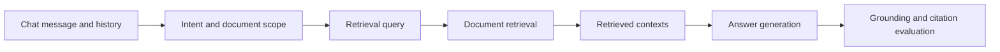

# Chat-RAG Evaluation Dashboard

> Status: no Chat-RAG evaluation report has been recorded.

## Decision State

| Area | Evidence | Decision |
|---|---|---|
| Chat intent routing | Separate routing evaluation exists | Does not prove document-grounded answers |
| Retrieval relevance | No Chat-RAG report | Cannot compare document retrieval quality |
| Answer faithfulness | No Chat-RAG report | Cannot assess hallucination risk |
| Citation correctness | No Chat-RAG report | Cannot verify claim-to-context support |
| Multi-turn document scope | No Chat-RAG report | Cannot prove history/document isolation |
| Latency | No component timing | Cannot identify a Chat-RAG bottleneck |

## Planned Pipeline

The next report should use the [Chat-RAG contract](./README.md), include a
human-reviewed subset, and publish retrieval, generation, and evaluator timing
separately.
