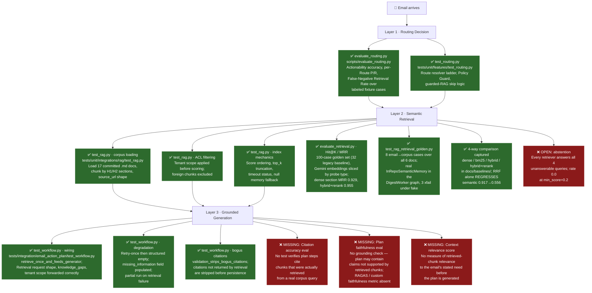

# RAG Evaluation — Status Report

> **Document status:** current snapshot as of 2026-08-12, revised after the golden-set
> and evaluation-harness work landed (C4, C5, C6 all closed — see
> [SPEC](./SPEC-rag-golden-set-and-eval.md) / [PLAN](./PLAN-rag-golden-set-and-eval.md)).  
> Earlier revisions of this file described a **3-document** corpus including
> `dang_ky_tam_tru.md`, and chunking by **H2 only**. Both are stale: the committed corpus is
> **17 documents / 1,043 chunks** (with legacy E2E test scoped to 6 documents) and chunking splits on **H1 and H2**. Corrected throughout.  
> Purpose: map what is already tested vs. what is missing for the full Email-RAG quality evaluation story.  
> The evaluation pipeline covers three conceptually distinct layers:  
> **Routing** (does the classifier decide that RAG is needed?) →  
> **Retrieval** (does semantic search return the right chunks?) →  
> **Generation** (does the LLM use those chunks to produce a grounded plan?).

---

## Evaluation Coverage Map

### Plain English Summary (1 Line Per Eval)

**Layer 1 · Routing (The Traffic Controller)**
- ✅ **Offline Routing Benchmark (`evaluate_routing.py`)**: Tests if the AI correctly recognizes when an email needs company guidebook lookups (prevents blind guessing).
- ✅ **Route Resolver Logic (`test_routing.py`)**: Tests the safety rules that force RAG retrieval when explicit document types are requested (ensures safety compliance).
- ❌ **Corpus-Matched Routing Fixtures**: Missing test emails that explicitly ask about ingested procedures (like CCCD renewal) to prove routing works on real domain content.

**Layer 2 · Retrieval (The Librarian)**
- ✅ **Corpus Loader & Chunking (`test_rag.py`)**: Tests that markdown guidebooks load cleanly and split into H1/H2 section chunks (ensures data ingest reliability).
- ✅ **Tenant ACL Filtering (`test_rag.py`)**: Tests that private company guidebooks are never leaked to unauthorized users/tenants (ensures data privacy).
- ✅ **Search Index Mechanics (`test_rag.py`)**: Tests score sorting, top-k limits, timeouts, and fallback handling when search fails (ensures basic system stability).
- ✅ **Real AI Embedding Accuracy (Hit@K / MRR)**: 100 labeled questions (32 in legacy Gemini baseline) run against the real embedder measure whether search returns the right *section*, not just the right document.
- ✅ **End-to-End Retrieval Fixtures**: 8 test emails — one per guidebook plus an unanswerable one — go through the real pipeline and must land on the correct document.
- ✅ **Hybrid Search Benchmark**: Keyword, AI vector, fused, and reranked search all measured on the same questions. Fusion **alone** made semantic questions worse; the reranker is what recovers it.
- ❌ **Abstention on Unanswerable Questions**: The system never says "I don't know" — every retriever returns confident-looking chunks for questions the guidebooks cannot answer.

**Layer 3 · Generation (The Plan Writer)**
- ✅ **Pipeline Integration Wiring (`test_workflow.py`)**: Tests that retrieved guidebook chunks are correctly passed to the AI plan writer (ensures plumbing works).
- ✅ **Graceful Error Degradation (`test_workflow.py`)**: Tests that if search fails, the system warns the user instead of breaking or crashing (ensures high reliability).
- ✅ **Fake Citation Stripping (`test_workflow.py`)**: Tests that citations to non-existent document chunks are automatically removed before saving (prevents broken links).
- ❌ **Citation Accuracy Verification**: Missing automated check verifying that plan steps accurately cite retrieved chunk content (bogus citation ID stripping tested in `test_workflow.py`).
- ❌ **Plan Faithfulness / Hallucination Check**: Missing automated checks (e.g. RAGAS) to ensure generated action plans don't fabricate steps absent from the guidebooks.
- ❌ **Context Relevance Scoring**: Missing evaluation measuring if retrieved chunks are actually relevant to the email's request before generating the plan.

---

## Layer 1 — Routing Evaluation

### ✅ Available

#### `scripts/evaluate_routing.py` — Offline Routing Benchmark

| Property | Detail |
|---|---|
| **Scope** | All labeled fixture cases under `tests/fixtures/routing/` |
| **Mode** | `--dry-run` (deterministic fake, perfect by construction) or live LLM provider |
| **Metrics** | Actionability accuracy, per-Route precision & recall, **False-Negative Retrieval Rate** |
| **Output** | JSON report written to `docs/baselines/routing-eval-<date>.json` |
| **PRD ref** | PRD-v1 §16 Milestone 2 exit obligation (task T2.6) |

The **False-Negative Retrieval Rate** (`false_negative_retrieval.rate`) is the primary quality gate: it tracks how often emails labeled `RETRIEVE_RAG` were incorrectly routed to `DIRECT_PLAN` or `NO_ACTION`. This is PRD-v1 §14's highest-risk error class.

#### `tests/unit/features/test_routing.py` — Route Resolver Unit Tests

Covers the resolve-route ladder (actionability → sufficiency → guard → route), the Policy Guard forcing `RETRIEVE_RAG` when `expected_document_types` is non-empty, and the guarded-RAG skip rule (retrieval is skipped, not guessed, when no query/gaps are present).

### ❌ Missing

- **No semantic classifier evaluation against the real corpus.** The routing fixtures contain synthetic email bodies, none of which reference procedures from `data/extracted/`. A routing case whose email body mentions needing CCCD renewal or marriage registration steps (directly mirroring a corpus document) would verify the full intent-to-route path with real content.

---

## Layer 2 — Retrieval Quality Evaluation

### ✅ Available

#### `tests/unit/integrations/rag/` — RAG Unit Test Suite

| Test File | What it checks |
|---|---|
| `test_rag.py` | Corpus loading (17 `.md` docs), H1/H2 chunking, ACL filtering before embedding, score ordering/top_k, timeout status, `NullSemanticMemory`, `HashingEmbedder` determinism |
| `test_bm25.py` | Tenant-scoped BM25 lexical ranking, exact term match, Markdown/case/punctuation normalization, ACL filtering before scoring |
| `test_rrf.py` | Reciprocal Rank Fusion, 1-based position rank scoring (`RRF_K=60`), duplicate handling, score fusion |
| `test_hybrid.py` | `HybridSemanticMemory` composition of dense + BM25 + RRF, candidate pool limits, query assembly, tenant ACL gate, Jina reranker integration |
| `test_jina_reranker.py` | `JinaRerankerAdapter` cross-encoder reranker boundary, HTTP transport, custom User-Agent, exception fallback to original candidate order, `FakeJinaReranker` |

> **Important caveat:** every test using `HashingEmbedder` — a deterministic fake that converts text to a numeric hash vector — validates *mechanics* (index building, scoring pipeline, ACL logic, chunk filtering), but **not semantic similarity**. Ranking order under it is arbitrary, which is why no test there asserts *which* document wins; an earlier `cap_lai_cccd` assertion was removed once H1 chunking exposed it as a chunk-boundary coincidence. Semantic quality is measured by the golden set below, under a real embedder.

### ✅ C4 — Real-embedding Hit@K / MRR (closed 2026-08-09)

`tests/fixtures/rag/retrieval_golden.json` holds **100 labeled cases** (expanded from the 32 legacy baseline cases) over the 17-document corpus, loaded by `tests/fixtures/rag/loader.py` and scored by `scripts/evaluate_retrieval.py`. Metrics are Hit@1, Hit@3, MRR, Recall@5 and abstention rate, reported at **document level and section level**.

Two design constraints make the numbers meaningful and must not be simplified away:

1. **Section level is the headline, not document level.** The 6 corpus documents are topically disjoint, so document-level Hit@1 saturates near 1.0 for *any* retriever including raw BM25. Only section-level MRR discriminates.
2. **Acceptance is stated per probe slice, never on the aggregate.** Every case is tagged `lexical`, `semantic`, `mixed`, or `unanswerable`. An aggregate that improves while `semantic` regresses is a failure — and that is exactly what the C6 measurement caught.

The loader validates every label against live `load_corpus` output, so a re-chunk fails loudly instead of silently scoring 0.0.

### ✅ C5 — End-to-end email → retrieval fixture (closed 2026-08-09)

`tests/integration/email_action_plan/test_rag_retrieval_golden.py` replays the **8 golden cases carrying an `email_body`** — one per corpus document, plus one unanswerable — through the real `DigestWorker` graph: `FakeMailbox` → `FakeRouteClassifier` → **real `InRepoSemanticMemory`** over the committed corpus → generator. The assertion is on the chunk the generator actually received, so nothing between routing and generation can drop or reorder retrieval and still pass.

Offline it runs on `HashingEmbedder`; 3 cases (`q-001`, `q-006`, `q-026`) cannot rank correctly under a non-semantic embedder and are `xfail` with the measured reason. **All 7 answerable cases pass under `--embedder gemini`.** The assertion was deliberately not weakened to "appears somewhere in the top 5", which would rebuild the blind spot this work exists to remove.

### ✅ C6 — Hybrid comparative benchmark (closed 2026-08-09)

Four variants, same 32 cases, same day, reports in `docs/baselines/retrieval-eval-2026-08-08-gemini-*.json`.

**Section-level MRR — the discriminating metric:**

| slice | n | dense | bm25 | hybrid (RRF) | hybrid + rerank |
|---|--:|--:|--:|--:|--:|
| **overall** | 28 | 0.929 | 0.795 | 0.869 | **0.955** |
| `lexical` | 6 | 0.833 | 0.917 | 0.917 | **1.000** |
| `semantic` | 6 | **0.917** | 0.375 | 0.556 | 0.792 |
| `mixed` | 16 | 0.969 | 0.906 | 0.969 | **1.000** |

| other metric | dense | bm25 | hybrid | hybrid + rerank |
|---|--:|--:|--:|--:|
| section Hit@1 | 0.857 | 0.679 | 0.786 | **0.929** |
| document Hit@1 | 0.964 | 0.857 | **1.000** | 0.929 |
| Recall@5 (section) | — | — | 0.964 | **1.000** |
| abstention rate | 0.000 | 0.000 | 0.000 | 0.000 |
| latency p50 / p95 (ms) | 438 / 937 | 0 / 0 | 438 / 937 | 1027 / 2432 |

Four findings, in order of importance:

1. **RRF fusion on its own is a regression, and only the reranker rescues it.** Hybrid drops overall section MRR from dense's 0.929 to 0.869, and collapses `semantic` from 0.917 to 0.556. The mechanism is in `rrf.py`: scores are discarded and only positions are fused, unweighted, at `1/(60+rank)`. A chunk dense ranks #1 scores `1/61`; a chunk dense ranks #3 that BM25 ranks #1 scores `1/63 + 1/61` and wins. Worse, a pure-BM25 #1 ties a pure-dense #1 exactly, and the tie breaks **alphabetically by `chunk_id`**. On `semantic` queries BM25's ranking is near-random, so it is casting an equal vote on the slice where it is least competent.
2. **Document-level Hit@1 says hybrid is the winner (1.000) — and it is wrong.** This is precisely the saturation trap the probe slicing was built to expose. Anyone reading only document-level numbers would have shipped a regression.
3. **The probe tags are predictive, so the golden set is doing its job.** BM25 peaks on `lexical` (0.917) and collapses on `semantic` (0.375) — a 0.54 spread the aggregate would have hidden entirely.
4. **`hybrid + rerank` is the best configuration measured**, and is the only one that clears dense on the aggregate. It still trails dense on `semantic` (0.792 vs 0.917), which at n=6 is roughly 1.5 rank-slips — worth re-measuring on a larger semantic slice before treating it as settled. It also costs ~2.3× dense's p50 latency.

> **Reranker defect found and fixed during this measurement.** The first `--rerank` run returned metrics byte-identical to plain hybrid. The cause was not agreement: Cloudflare fronts `api.jina.ai` and rejects `urllib`'s default User-Agent with `HTTP 403 error code: 1010`, and `JinaRerankerAdapter.rerank` catches every exception and returns the untouched candidate order. **The reranker had never executed a single successful call**, while the report still recorded `reranker: jina`. Fixed by sending an explicit `User-Agent` (`jina_reranker.py`). The silent-fallback behaviour is correct for production — retrieval must not fail because reranking is down — but it is undetectable from the outside, and every number in the table above depends on a fallback that reports nothing. Surfacing whether the reranker actually ran is tracked as an open observability gap.

### ❌ C7 — Abstention on unanswerable queries (open)

**No retriever abstains on any unanswerable query.** All unanswerable cases (4 in the 32-case legacy set `q-029`–`q-032`, 12 in the 100-case expanded dataset) return chunks above threshold under dense, BM25, hybrid, and hybrid+rerank alike — `abstention_rate = 0.000` in every report, and under `HashingEmbedder` too. `min_score = 0.2` filters nothing: Gemini cosine similarity between a Vietnamese query and any Vietnamese administrative text sits comfortably above 0.2.

This is a real product gap, not a measurement artifact, and it is the one SPEC §4 added the `unanswerable` probe specifically to catch. It also makes the SPEC §7 Phase-2 gate "abstention must not decrease" vacuous — it is already at the floor. `q-029` is marked `xfail` in the C5 integration test with that reason recorded.

The evaluator now records score provenance and provides **evaluation-only**
absolute-score and margin calibration sweeps. These make the answerable versus
unanswerable trade-off inspectable, but do not select or apply a runtime
threshold. A production abstention policy remains open until it is chosen and
validated against fresh live evidence.

Note the related consequence: `latency_ms` reads `0` for local-only retrievers because `SemanticRetrievalResponse.latency_ms` is an `int` and in-repo retrieval is sub-millisecond. That is a contract-level truncation, not a harness bug.

---

## Layer 3 — Generation Quality Evaluation

### ✅ Available

#### `tests/integration/email_action_plan/test_workflow.py` — RAG Wiring Tests

| Test | What it checks |
|---|---|
| `test_retrieve_rag_candidate_retrieves_once_and_feeds_generator` | Exactly one `memory.retrieve()` call; request shape (run_id, tenant_id, query, knowledge_gaps, filters) forwarded correctly; `generator.received_retrievals` contains the response |
| `test_direct_plan_candidate_makes_zero_retrieval_calls` | `DIRECT_PLAN` emails never touch `SemanticMemory` |
| `test_retrieval_failure_retries_once_then_degrades_to_structured_empty` | Two attempts on failure, then degraded plan with `missing_information` field populated |
| `test_genuine_empty_retrieval_marks_missing_info_without_degraded_marker` | Healthy port returning `NO_RESULTS` populates `missing_information` without marking the plan as degraded |
| `test_validation_strips_bogus_citations_from_direct_plan_task` | Citations not backed by a real retrieval chunk are removed before persistence |

All of the above use `RecordingMemory` (a canned fake) or `FakePlanGenerator`. They test the **integration wiring and contracts** — not the semantic quality of generated output.

### ❌ Missing

#### D4 — Citation Accuracy Evaluation

No test verifies that a plan step referencing `cit_X` is actually discussing the content of the chunk with `chunk_id == cit_X`. A model could hallucinate content while correctly placing a valid citation ID.

**What is needed:** a golden (email, retrieved_chunks, expected_plan) triple where the plan text is independently verified to reflect the chunk content.

#### D5 — Plan Faithfulness / Grounding Score

No automated check that the generated action plan's procedure steps are *grounded* in the retrieved chunks and do not introduce unsupported claims. The target architecture references RAGAS as an option (see [EMAIL-RAG-ARCHITECHTURE.md](./EMAIL-RAG-ARCHITECHTURE.md) §11), but no RAGAS harness exists yet.

**Metrics to add:** RAGAS Faithfulness, RAGAS Answer Relevance, or a custom LLM-as-judge check.

#### D6 — Context Relevance Score

No measurement of whether the retrieved chunks are relevant to the email's stated request *before* the plan is generated. A retrieval returning high-scoring but topically wrong chunks would currently go undetected until the plan is read by a human.

**Metric to add:** Context Precision / Context Recall (RAGAS) or manual golden-set relevance labels for the six corpus documents. The C4 golden set already supplies the (query → expected section) labels these metrics need.

---

## Current Evidence Reconciliation

The following corrections supplement the original coverage map and distinguish
implemented evaluation mechanics from runtime guarantees.

| Evaluation area | Current status | Evidence boundary |
|---|---|---|
| C7 abstention | Runtime missing; evaluation-only support available | All four retained unanswerable cases return chunks in every retained baseline (`abstention_rate = 0.000`). `evaluate_retrieval.py` now emits score evidence and absolute-score/margin sweeps, but it does not select or apply a runtime gate. |
| Citation accuracy | Missing | No automated claim-to-chunk lexical or semantic citation accuracy test exists (`test_workflow.py` validates bogus citation ID stripping). |
| Plan faithfulness | Missing | No automated claim-to-evidence or generated-plan faithfulness evaluation exists. |
| Context relevance | Partial labels | The 32-case golden set supports document/section Hit@K, MRR, and Recall@5. It does not provide exhaustive semantic relevance judgments for every returned chunk against the email need. |
| Reranker evidence | Partial | Retained Jina baseline results are useful only when reranking actually ran. Runtime fallback preserves candidate order but does not publish an applied/fallback signal. |

### Interpretation rule

Do not describe score sweeps as a calibrated runtime abstention policy, citation
ID validation as semantic grounding, or target-section labels as exhaustive
context-relevance judgments.

## Summary Table

| Layer | Eval item | Status | Location |
|---|---|---|---|
| Routing | Actionability accuracy | ✅ Available | `scripts/evaluate_routing.py` |
| Routing | Per-Route precision / recall | ✅ Available | `scripts/evaluate_routing.py` |
| Routing | False-Negative Retrieval Rate | ✅ Available | `scripts/evaluate_routing.py` |
| Routing | Route resolver unit tests | ✅ Available | `tests/unit/features/test_routing.py` |
| Routing | Fixtures grounded in corpus content | ❌ Missing | — |
| Retrieval | Corpus loading & chunking | ✅ Available | `tests/unit/integrations/rag/test_rag.py` |
| Retrieval | ACL / tenant filtering | ✅ Available | `tests/unit/integrations/rag/test_rag.py`, `test_bm25.py`, `test_hybrid.py` |
| Retrieval | Score ordering, top_k, timeout | ✅ Available | `tests/unit/integrations/rag/test_rag.py` |
| Retrieval | BM25, RRF & Hybrid unit tests | ✅ Available | `tests/unit/integrations/rag/` (`test_bm25.py`, `test_rrf.py`, `test_hybrid.py`, `test_jina_reranker.py`) |
| Retrieval | Real-embedding Hit@K / MRR | ✅ Available | `scripts/evaluate_retrieval.py`, `tests/fixtures/rag/` |
| Retrieval | Email → corpus retrieval fixture | ✅ Available | `tests/integration/email_action_plan/test_rag_retrieval_golden.py` |
| Retrieval | Hybrid retrieval benchmark (BM25 + dense + RRF) | ✅ Available | `docs/baselines/retrieval-eval-2026-08-08-gemini-*.json` |
| Retrieval | Abstention on unanswerable queries | ❌ Missing | measured at 0.000 for every retriever |
| Generation | Retrieval wiring (request shape, feed to generator) | ✅ Available | `tests/integration/email_action_plan/test_workflow.py` |
| Generation | Degradation on retrieval failure | ✅ Available | `tests/integration/email_action_plan/test_workflow.py` |
| Generation | Bogus citation stripping | ✅ Available | `tests/integration/email_action_plan/test_workflow.py` |
| Generation | Citation accuracy (plan ↔ chunk content) | ❌ Missing | — |
| Generation | Plan faithfulness / grounding (RAGAS or judge) | ❌ Missing | — |
| Generation | Context relevance before generation | ❌ Missing | — |

**12 of 19 evaluation items are covered. Layer 2 (retrieval quality) unit & benchmark testing is complete across dense, BM25, RRF, and Jina reranker; its one remaining gap is abstention (C7).  
The gap is now concentrated in Layer 3 (generation fidelity) — citation accuracy, faithfulness, and context relevance are all still unmeasured, and they are what decides whether a retrieved chunk actually becomes a correct action plan.**

---

## Recommended Next Steps

Items 1 and 2 of the previous revision (golden set, end-to-end fixture) are **done**. What remains, in priority order:

1. **Decide what to do about RRF before hybrid is relied on.** The measurement says plain hybrid is worse than dense. Three options, cheapest first: (a) keep dense as the default and treat hybrid as opt-in; (b) weight the RRF legs so BM25 cannot outvote dense on semantic queries; (c) require the reranker whenever hybrid is enabled, since `hybrid + rerank` is the only configuration that beats dense. Whichever is chosen, re-run the four variants and update the C6 table — do not accept an aggregate improvement that comes with a `semantic` regression.

2. **Fix abstention (C7).** A cosine floor of 0.2 does not separate "relevant" from "same language, unrelated topic" for Vietnamese administrative text. Calibrate the threshold against the 4 unanswerable cases and the 28 answerable ones jointly — the golden set already contains everything needed to pick a number — or add a margin rule (top score must exceed the runner-up by some delta). Re-measure `abstention_rate` afterwards; it is currently 0.000 and any real value is an improvement.

3. **Make silent reranker failure visible.** `JinaRerankerAdapter` swallowed a total outage for an entire evaluation run and still reported `reranker: jina`. The fallback should stay, but the harness report and the runtime path both need to record whether reranking actually happened.

4. **Add a faithfulness smoke test** using an LLM-as-judge or deterministic keyword check: given a known chunk text and a generated plan step, assert the step text is a paraphrase of the chunk rather than a fabrication. This is the biggest remaining hole — Layer 3 has no quality measurement at all.

5. **Grow the `semantic` slice beyond n=6** before treating the dense-vs-rerank gap on that slice as settled; one rank slip currently moves it by 0.08.

6. **Wire RAGAS** (optional, production milestone) when `data/extracted/` grows well beyond six documents and real-world query hit-rate needs tracking across versions.

---

*Related documents:*
- [EMAIL-RAG-ARCHITECHTURE.md](./EMAIL-RAG-ARCHITECHTURE.md) — full system architecture including target retrieval pipeline
- [agent-experience-registry.md](./agent-experience-registry.md) — known patterns and gotchas
- [SPEC-rag-golden-set-and-eval.md](./SPEC-rag-golden-set-and-eval.md) — golden-set schema, probe taxonomy, acceptance gates
- [PLAN-rag-golden-set-and-eval.md](./PLAN-rag-golden-set-and-eval.md) — task breakdown and the T-6 comparison procedure
- [HYBRID-SEARCH-IMPLEMENTATION-REPORT.md](./HYBRID-SEARCH-IMPLEMENTATION-REPORT.md) — the hybrid implementation this benchmark evaluates
- `tests/unit/integrations/rag/test_rag.py` — current retrieval unit tests
- `tests/fixtures/rag/` — golden set, loader, and schema README
- `scripts/evaluate_retrieval.py` — retrieval benchmark harness
- `tests/integration/email_action_plan/test_rag_retrieval_golden.py` — end-to-end email → corpus fixtures
- `tests/integration/email_action_plan/test_workflow.py` — workflow-level RAG wiring tests
- `scripts/evaluate_routing.py` — offline routing benchmark

## Local knowledge ingestion

An administrator CLI now ingests local DOCX and native-text PDF documents as
Markdown for the corpus. It is covered by focused unit/integration tests for
manifest skips, atomic output, deterministic discovery, safe rejection paths,
CLI exit codes, and compatibility with `load_corpus()`.

Scan, image-based, and mixed PDFs currently return
`mistral_not_configured`; no Mistral request is made until OCR is enabled and
an API key is provided. There is no Gmail-attachment ingestion or upload API,
and this ingestion capability is not yet included in the retrieval-quality
golden set or live-Qdrant benchmark.
