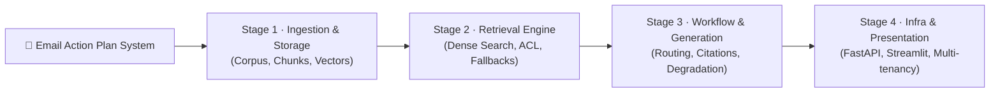
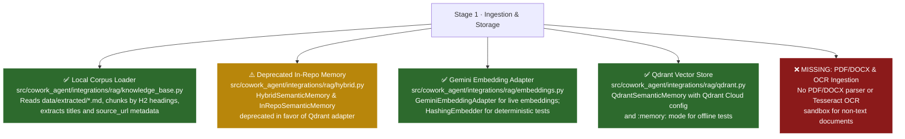
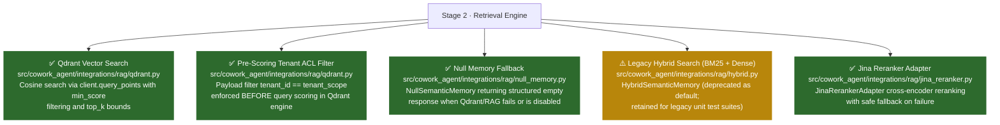
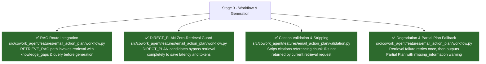
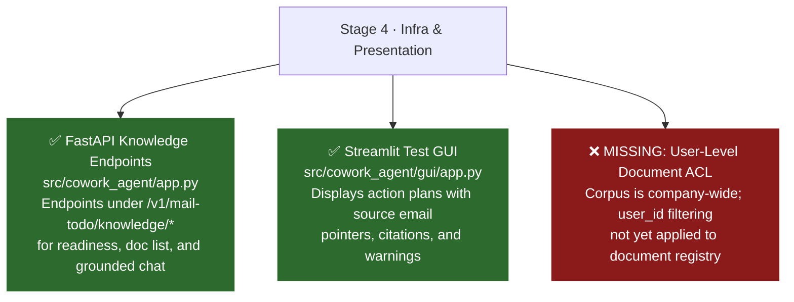

# Email RAG — Architecture Implementation Status

> **Document status:** current snapshot as of 2026-08-10.  
> Purpose: map what Email RAG architectural components are implemented in the current codebase vs. what remains target/production-only scope.  
> The system architecture spans four main areas:  
> **1. Ingestion & Storage** (document parsing, chunking, vector memory) →  
> **2. Retrieval Engine** (dense search, BM25, ACL filtering, reranking) →  
> **3. Workflow & Generation** (RAG routing, grounded prompt assembly, citation validation, degradation) →  
> **4. Infrastructure & Presentation** (FastAPI endpoints, Streamlit GUI, multi-tenant security).

---

## Architecture Implementation Map

### System-Wide Architecture Overview

---

### Decomposed Stage Maps

#### Stage 1 · Ingestion & Storage Implementation Map

#### Stage 2 · Retrieval Engine Implementation Map

#### Stage 3 · Workflow & Generation Implementation Map

#### Stage 4 · Infrastructure & Presentation Implementation Map

---

### Plain English Summary (1 Line Per Component)

**Stage 1 · Ingestion & Storage**
- ✅ **Local Corpus Loader (`knowledge_base.py`)**: Loads Markdown files from `data/extracted/`, chunks by H2 section headers, and extracts title metadata.
- ⚠️ **Deprecated In-Repo Vector Memory (`HybridSemanticMemory` / `InRepoSemanticMemory`)**: Replaced by Qdrant adapter as production default; issues `DeprecationWarning` at construction.
- ✅ **Gemini Embedding Adapter (`GeminiEmbeddingAdapter`)**: Generates vector embeddings via Gemini API (with `HashingEmbedder` in `fakes.py` for fast unit tests).
- ✅ **Qdrant Vector Database Integration (`QdrantSemanticMemory`)**: Qdrant Cloud adapter (`qdrant.py`) with payload metadata, automatic corpus ingestion, and `:memory:` mode for offline tests.
- ❌ **PDF/DOCX & OCR Ingestion Sandbox**: Target document ingestion pipeline for binary files (PDF/DOCX) and image OCR is not implemented.

**Stage 2 · Retrieval Engine**
- ✅ **Qdrant Vector Search (`QdrantSemanticMemory.retrieve`)**: Performs vector similarity search via `query_points` with `min_score` filtering, `top_k` limit, and cosine distance.
- ✅ **Pre-Scoring Tenant ACL Filtering (`QdrantSemanticMemory`)**: Enforces payload filter `tenant_id == tenant_scope` in Qdrant engine before vector scoring.
- ✅ **Null Memory Safe Fallback (`NullSemanticMemory`)**: Returns structured `NO_RESULTS` response when RAG is disabled, unreachable, or fails.
- ⚠️ **Legacy Hybrid Search (BM25 + Dense)**: `HybridSemanticMemory` (`hybrid.py`) deprecated as default; retained for legacy test suites.
- ✅ **Jina Reranker Adapter (`JinaRerankerAdapter`)**: Secondary cross-encoder reranker (`jina_reranker.py`) integrated into retrieval workflow with fallback.

**Stage 3 · Workflow & Generation**
- ✅ **RAG Route Workflow Path (`DigestWorker`)**: Automatically triggers semantic retrieval when an email is classified as `RETRIEVE_RAG`.
- ✅ **DIRECT_PLAN Zero-Retrieval Guard (`DigestWorker`)**: Prevents retrieval calls for `DIRECT_PLAN` emails to save latency and API tokens.
- ✅ **Citation Validation & Stripping (`validation.py`)**: Strips any LLM-generated citations referencing chunk IDs not returned in the current retrieval.
- ✅ **Degradation & Missing Information Warning (`DigestWorker`)**: Retries failed retrieval once, then produces a Partial Plan with an explicit `missing_information` warning without hallucinating.

**Stage 4 · Infrastructure & Presentation**
- ✅ **FastAPI Knowledge Endpoints (`app.py`)**: Exposes REST endpoints (`/v1/mail-todo/knowledge/*`) for health readiness, document list, and grounded chat.
- ✅ **Streamlit Test Interface (`gui/app.py`)**: Renders generated action plans with Gmail thread pointers, citations, and missing-context warnings.
- ❌ **User-Level Document Authorization**: Knowledge corpus is company-wide; user-level access control on documents is not yet active.

---

## Detailed Architectural Coverage

### Stage 1 — Ingestion & Storage

| Component | Status | Implementation File / Note |
|---|---|---|
| Markdown Corpus Loader | ✅ Implemented | [knowledge_base.py](file:///e:/VIN-INTERNSHIP/EMAIL-AGENT-v1/src/cowork_agent/integrations/rag/knowledge_base.py) — loads `cap_lai_cccd.md`, `dang_ky_ket_hon.md`, `dang_ky_tam_tru.md` |
| H2 Section Chunking | ✅ Implemented | [knowledge_base.py](file:///e:/VIN-INTERNSHIP/EMAIL-AGENT-v1/src/cowork_agent/integrations/rag/knowledge_base.py#L99-L115) — splits docs by `#` / `##` headings |
| Dense Vector Storage | ✅ Implemented | [QdrantSemanticMemory](file:///e:/VIN-INTERNSHIP/EMAIL-AGENT-v1/src/cowork_agent/integrations/rag/qdrant.py) — Qdrant Cloud / `:memory:` client |
| Gemini Embedder Adapter | ✅ Implemented | [GeminiEmbeddingAdapter](file:///e:/VIN-INTERNSHIP/EMAIL-AGENT-v1/src/cowork_agent/integrations/rag/embeddings.py) — calls Gemini embedding API |
| Deterministic Test Embedder | ✅ Implemented | [HashingEmbedder](file:///e:/VIN-INTERNSHIP/EMAIL-AGENT-v1/src/cowork_agent/integrations/rag/fakes.py#L14-L36) — MD5 hash vectorizer for fast offline tests |
| Qdrant External DB | ✅ Implemented | [qdrant.py](file:///e:/VIN-INTERNSHIP/EMAIL-AGENT-v1/src/cowork_agent/integrations/rag/qdrant.py) — production Qdrant Cloud adapter wired in `bootstrap.py` |
| PDF/DOCX Parser & OCR | ❌ Target | Target ingestion pipeline for binary documents and OCR scanning |

### Stage 2 — Retrieval Engine

| Component | Status | Implementation File / Note |
|---|---|---|
| Dense Vector Cosine Search | ✅ Implemented | [QdrantSemanticMemory](file:///e:/VIN-INTERNSHIP/EMAIL-AGENT-v1/src/cowork_agent/integrations/rag/qdrant.py) — `query_points` cosine similarity |
| Pre-scoring ACL Filter | ✅ Implemented | [QdrantSemanticMemory](file:///e:/VIN-INTERNSHIP/EMAIL-AGENT-v1/src/cowork_agent/integrations/rag/qdrant.py) — filters by `tenant_scope` before vector scoring |
| Top-K & Min Score Filtering | ✅ Implemented | Configured via `RetrievalLimits(top_k=5, min_score=0.0)` |
| Timeout Handling | ✅ Implemented | Graceful degradation to `NullSemanticMemory` on connection/timeout error |
| Null Memory Adapter | ✅ Implemented | [NullSemanticMemory](file:///e:/VIN-INTERNSHIP/EMAIL-AGENT-v1/src/cowork_agent/integrations/rag/null_memory.py) — safe no-op when RAG is disabled |
| BM25 Lexical Keyword Search | ⚠️ Legacy | [bm25.py](file:///e:/VIN-INTERNSHIP/EMAIL-AGENT-v1/src/cowork_agent/integrations/rag/bm25.py) — part of deprecated `HybridSemanticMemory` |
| Reciprocal Rank Fusion (RRF) | ⚠️ Legacy | [rrf.py](file:///e:/VIN-INTERNSHIP/EMAIL-AGENT-v1/src/cowork_agent/integrations/rag/rrf.py) — part of deprecated `HybridSemanticMemory` |
| Jina Reranking Adapter | ✅ Implemented | [jina_reranker.py](file:///e:/VIN-INTERNSHIP/EMAIL-AGENT-v1/src/cowork_agent/integrations/rag/jina_reranker.py) — Jina cross-encoder reranker with fallback |

### Stage 3 — Workflow & Generation

| Component | Status | Implementation File / Note |
|---|---|---|
| `RETRIEVE_RAG` Dispatch | ✅ Implemented | [workflow.py](file:///e:/VIN-INTERNSHIP/EMAIL-AGENT-v1/src/cowork_agent/features/email_action_plan/workflow.py#L230-L233) — invokes semantic memory when route requires knowledge |
| `DIRECT_PLAN` Zero-Call Guard | ✅ Implemented | [workflow.py](file:///e:/VIN-INTERNSHIP/EMAIL-AGENT-v1/src/cowork_agent/features/email_action_plan/workflow.py#L237-L246) — bypasses retrieval completely for direct emails |
| Citation Integrity Validator | ✅ Implemented | [validation.py](file:///e:/VIN-INTERNSHIP/EMAIL-AGENT-v1/src/cowork_agent/features/email_action_plan/validation.py#L129-L205) — strips invalid citations before task persistence |
| Retrieval Bounded Retry | ✅ Implemented | [workflow.py](file:///e:/VIN-INTERNSHIP/EMAIL-AGENT-v1/src/cowork_agent/features/email_action_plan/workflow.py#L502-L514) — retries retrieval once on transient failure |
| Degradation to Partial Plan | ✅ Implemented | [workflow.py](file:///e:/VIN-INTERNSHIP/EMAIL-AGENT-v1/src/cowork_agent/features/email_action_plan/workflow.py#L296-L305) — attaches `missing_information` warning on empty retrieval |
| Grounded Action Plan Generation | ✅ Implemented | [fakes.py](file:///e:/VIN-INTERNSHIP/EMAIL-AGENT-v1/src/cowork_agent/integrations/llm/fakes.py) / Gemini Generator — injects retrieved chunks into LLM prompt |

### Stage 4 — Infrastructure & Presentation

| Component | Status | Implementation File / Note |
|---|---|---|
| FastAPI Composition Root | ✅ Implemented | [app.py](file:///e:/VIN-INTERNSHIP/EMAIL-AGENT-v1/src/cowork_agent/app.py) — merges mailbox digest & knowledge endpoints under `/v1/mail-todo` |
| Knowledge REST API | ✅ Implemented | `/v1/mail-todo/knowledge/ready`, `/v1/mail-todo/knowledge/documents`, `/v1/mail-todo/knowledge/chat` |
| Streamlit Test GUI | ✅ Implemented | [gui/app.py](file:///e:/VIN-INTERNSHIP/EMAIL-AGENT-v1/src/cowork_agent/gui/app.py) — displays tasks, citations, and missing info warnings |
| Dev Trace Telemetry | ✅ Implemented | [observability.py](file:///e:/VIN-INTERNSHIP/EMAIL-AGENT-v1/src/cowork_agent/features/email_action_plan/observability.py) — encrypted trace sink with metadata-only rules |
| User-Level Document ACL | ❌ Target | Knowledge corpus is company-wide; user-level access filtering is pending |

---

## Summary Matrix

| Category | Total Items | Implemented (Local MVP / Cloud) | Missing / Target Production |
|---|:---:|:---:|:---:|
| **Stage 1: Ingestion & Storage** | 7 | 6 ✅ | 1 ❌ |
| **Stage 2: Retrieval Engine** | 8 | 8 ✅ | 0 ❌ |
| **Stage 3: Workflow & Generation** | 6 | 6 ✅ | 0 ❌ |
| **Stage 4: Infrastructure & Presentation** | 5 | 4 ✅ | 1 ❌ |
| **Total Architecture Features** | **26** | **24 ✅ (92%)** | **2 ❌ (8%)** |

---

*Related Documents:*
- [EMAIL-RAG-ARCHITECHTURE.md](../../references/EMAIL-RAG-ARCHITECHTURE.md) — full target system architecture specification
- [RAG-EVALUATION-STATUS.md](./RAG-EVALUATION-STATUS.md) — evaluation & test coverage map
- [master-comparison.md](../../master-comparison.md) — current vs target gap analysis and milestones
