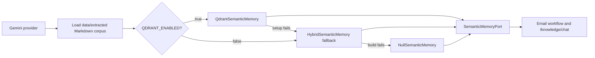

# Email RAG — Architecture Implementation Status
> **Document status:** current snapshot as of 2026-08-10. This report describes
> the code in this checkout, not a target architecture.

## Executive summary

Email RAG is implemented as a retrieval-only capability behind
`SemanticMemoryPort`. With the Gemini provider, the application loads the
committed Markdown corpus and prefers a Qdrant-backed semantic memory when
`QDRANT_ENABLED=true`. If Qdrant is disabled or fails while the app starts, it
falls back to the deprecated in-repo hybrid retriever. If neither store can be
built, it uses `NullSemanticMemory`, which returns a structured empty response
rather than blocking an email run.

The production default is therefore configurable Qdrant, not an unconditional
requirement. Dense/BM25/RRF/Jina code remains executable as the local fallback
and evaluation harness; it is not the preferred configured store.

## Implemented architecture

| Area | Status | Current behavior and evidence |
|---|---|---|
| Corpus source | Implemented | `knowledge_base.py` loads committed `data/extracted/*.md`, creates document/section metadata, and does not ingest raw email bodies. |
| Qdrant configuration | Implemented | `QdrantSettings` reads URL, API key, collection, vector size, reindex flag, and `QDRANT_ENABLED`. A URL alone does not enable Qdrant. |
| Qdrant store | Implemented | `QdrantSemanticMemory` queries Qdrant with cosine vectors, top-k and score threshold. `ingest_corpus()` creates/recreates and upserts the approved corpus. |
| Qdrant tenant isolation | Implemented | The Qdrant payload filter for `tenant_id == tenant_scope` is constructed before query embedding/scoring. An empty tenant scope returns `authorization_denied`. |
| Qdrant lifecycle | Partial | A missing/empty collection is ingested on boot; `QDRANT_REINDEX=true` forces re-ingestion. Each ingestion recreates the collection before upsert, so it is a corpus replacement rather than an incremental update. There is no upload API, registry, versioning, or incremental document update workflow. |
| In-repo hybrid fallback | Implemented, deprecated | `HybridSemanticMemory` combines dense Gemini embeddings, BM25, RRF, optional query expansion/HyDE, optional Jina reranking, and optional MMR. It is used as a fallback/evaluation implementation and emits `DeprecationWarning`. |
| Empty-result fallback | Implemented | When no memory can be built, `NullSemanticMemory` returns `retrieval_status=no_results` with no chunks. Known Qdrant query failures also degrade to this structured empty result. |
| Email workflow wiring | Implemented | `DigestWorker` invokes retrieval for `RETRIEVE_RAG`, skips it for `DIRECT_PLAN`, forwards chunks to the generator, and records missing information when retrieval is empty or unavailable. |
| Citation boundary | Implemented | Validation removes generated citation IDs that are not present in the retrieval response for the current request. |
| Knowledge HTTP API | Implemented | `app.py` exposes readiness, document-list, and `/v1/mail-todo/knowledge/chat` endpoints. The chat endpoint returns the port's chunks, status, and latency; it does not generate an answer. |
| Streamlit presentation | Implemented | The GUI renders `retrieval_status=no_results` as “Không tìm thấy kết quả phù hợp.” A client transport timeout/error is separately rendered as a fetch error (`mã 0`). |

## Runtime behavior and degradation

1. `LLM_PROVIDER=gemini` calls `build_semantic_memory()` at application startup.
2. If Qdrant is enabled, the bootstrap connects to the configured collection;
   it ingests the committed corpus only when the collection is missing/empty or
   reindexing is requested.
3. A Qdrant bootstrap failure is logged and the bootstrap attempts
   `HybridSemanticMemory`. The same hybrid path is used when Qdrant is not
   enabled.
4. A hybrid bootstrap failure produces `NullSemanticMemory`. Retrieval then
   succeeds as an API operation with `no_results`, rather than failing the
   digest workflow.
5. A healthy retriever returning no matching chunks also returns `no_results`.
   This is distinct from a Streamlit-to-backend network/timeout failure.

`QDRANT_ENABLED=false` is therefore a deliberate local fallback mode, not an
absence of RAG. Groq and Faucet currently use `NullSemanticMemory`.

## Security and data boundaries

- Gmail access remains read-only.
- Raw email bodies and attachment content are transient; the RAG corpus comes
  only from repository Markdown files.
- Tenant scope is enforced in the Qdrant query filter before scoring. The
  in-repo retrievers also filter tenant-visible chunks before retrieval.
- Per-user, group, document-status, and document-level ACL policies are not
  implemented. The current corpus is effectively company-wide within its
  tenant scope.

## Known gaps and limits

| Gap | Status | Why it matters |
|---|---|---|
| Live Qdrant quality benchmark | Missing | Qdrant adapter mechanics are tested, but the retained real-embedding benchmark measures the in-repo variants, not Qdrant Cloud retrieval quality. |
| Calibrated abstention | Missing | `no_results` is structurally supported, but no validated runtime score or margin policy separates unrelated Vietnamese queries from relevant corpus content. |
| Active end-to-end deadline | Partial | Embedding/reranker transports have their own timeouts, but `RetrievalLimits.timeout_ms` is not enforced as one deadline across every remote step. |
| Reranker observability | Missing | Jina safely falls back, but the runtime response does not report whether reranking was applied or bypassed. |
| Semantic grounding | Missing | Citation IDs are constrained to retrieved chunks; no evaluation proves generated plan claims are entailed by those chunks. |
| Binary ingestion | Partial | The administrator CLI converts local DOCX and native-text PDF files into Markdown. Scan, image-based, and mixed PDFs fail safely with `mistral_not_configured` until Mistral OCR is configured; XLSX/PPTX, upload, and Gmail-attachment ingestion do not exist. |
| Corpus administration | Missing | No persistent document registry, version history, incremental update, or asynchronous ingestion pipeline exists. |

## Operational checks

| Check | Expected result |
|---|---|
| `GET /v1/mail-todo/knowledge/ready` | `ready` when a non-null store and corpus are available; `degraded` for `NullSemanticMemory`; `unavailable` when the corpus cannot load. |
| `POST /v1/mail-todo/knowledge/chat` with no matching chunk | HTTP 200 with `retrieval_status: "no_results"` and an empty `chunks` list. |
| Streamlit search for the same response | “Không tìm thấy kết quả phù hợp.” |
| Qdrant unavailable at boot | Warning in backend log, then hybrid fallback; only a subsequent hybrid failure yields null memory. |

## Source of truth

- `src/cowork_agent/integrations/rag/bootstrap.py`
- `src/cowork_agent/integrations/rag/qdrant.py`
- `src/cowork_agent/integrations/rag/hybrid.py`
- `src/cowork_agent/app.py`
- `src/cowork_agent/features/email_action_plan/workflow.py`
- `src/cowork_agent/gui/app.py`

## Local knowledge ingestion

The `mail-todo-ingest-knowledge` administrator CLI accepts `--source`,
`--output`, `--force`, and `--dry-run`. It deterministically discovers local
DOCX/PDF files, writes non-empty Markdown atomically, and records hashes in an
ingestion manifest. Run it with `KNOWLEDGE_INGEST_OCR_ENABLED=false` until
`MISTRAL_API_KEY` is configured.

Native-text PDFs and DOCX files are supported. PDFs that need OCR fail with
`mistral_not_configured` and do not create partial output. The CLI never
downloads Gmail attachments, has no upload API, and does not write to Qdrant;
after a successful ingestion, operators choose when to restart the local
retriever or set `QDRANT_REINDEX=true` for a corpus replacement.
- [RAG-EVALUATION-STATUS.md](./RAG-EVALUATION-STATUS.md) — evaluation & test coverage map
- [master-comparison.md](../../master-comparison.md) — current vs target gap analysis and milestones
