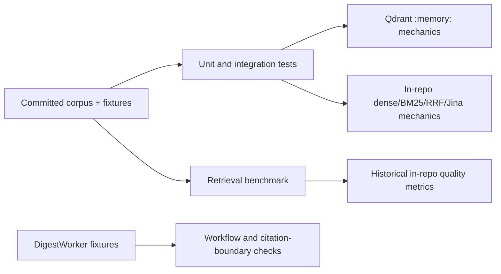

# Email RAG — Evaluation Status

> **Document status:** current snapshot as of 2026-08-10.
> This report separates verified adapter/workflow behavior from retrieval
> quality claims. Passing an offline mechanics test is not semantic-quality
> evidence.

## What the suite currently proves

| Layer | Evidence | Status | Main locations |
|---|---|---|---|
| Configuration | Qdrant defaults, opt-in enablement, invalid vector-size rejection, and reindex parsing | Covered | `tests/unit/test_config.py` |
| Qdrant adapter | Ingestion, idempotent upsert, vector-size validation, tenant isolation, top-k, score threshold, timeout status, and missing-collection degradation | Covered | `tests/unit/integrations/test_qdrant.py` |
| Qdrant bootstrap | Enabled-store selection, existing-collection reuse, forced reindex, disabled/failing-store fallback, and missing-corpus handling | Covered | `tests/unit/integrations/test_bootstrap.py` |
| Qdrant integration | Real Qdrant client in `:memory:` mode over the committed corpus; ACL, threshold, ordering, top-k, and unavailable-store degrade path | Covered | `tests/integration/test_qdrant_integration.py` |
| In-repo retrieval mechanics | Corpus loading, chunking, dense/BM25/RRF, query expansion, HyDE, MMR, Jina transport fallback, and query guards | Covered | `tests/unit/integrations/rag/` |
| Workflow wiring | `RETRIEVE_RAG` retrieval, `DIRECT_PLAN` zero-retrieval guard, empty/degraded handling, retrieval-to-generator flow, and citation ID stripping | Covered | `tests/integration/email_action_plan/test_workflow.py` |
| Retrieval golden set | 32 labelled corpus cases, loader validation, Hit@K/MRR/Recall@5 reporting and score/margin sweeps | Covered for in-repo variants | `tests/fixtures/rag/`, `scripts/evaluate_retrieval.py` |
| Email-to-retrieval fixture | Golden email cases through `DigestWorker` and in-repo memory | Covered for in-repo variants | `tests/integration/email_action_plan/test_rag_retrieval_golden.py` |
| Routing evaluation | Actionability/route metrics and false-negative retrieval-rate reporting | Covered | `scripts/evaluate_routing.py` |

## Evaluation architecture

The Qdrant tests use the real `AsyncQdrantClient` in `:memory:` mode. They
exercise the adapter and Qdrant query semantics without requiring a cloud
credential or server. They do **not** prove network behavior, Qdrant Cloud
performance, or real-embedding ranking quality.

## Retained quality baseline: historical in-repo retrieval

`docs/baselines/retrieval-eval-2026-08-08-gemini-*.json` records a previous
comparison of dense, BM25, RRF hybrid, and hybrid plus Jina reranking over the
32-case corpus golden set. These figures remain useful for evaluating the
deprecated/fallback in-repo implementation, but they must not be reported as
Qdrant runtime results.

| Section-level metric | Dense | BM25 | Hybrid RRF | Hybrid + rerank |
|---|---:|---:|---:|---:|
| MRR overall (28 answerable cases) | 0.929 | 0.795 | 0.869 | 0.955 |
| Hit@1 | 0.857 | 0.679 | 0.786 | 0.929 |
| Recall@5 | — | — | 0.964 | 1.000 |
| Abstention rate (4 unanswerable cases) | 0.000 | 0.000 | 0.000 | 0.000 |

Interpretation constraints:

- The offline `HashingEmbedder` tests deterministic mechanics only; it is not
  semantic evidence and cannot establish the correct document rank.
- The benchmark numbers above do not measure `QdrantSemanticMemory` or a live
  Qdrant collection.
- Plain RRF regressed the semantic slice against dense in the retained run;
  the reranked variant improved the aggregate but needs fresh measurement if
  the fallback configuration changes.
- The retained unanswerable cases did not abstain under any measured in-repo
  variant. Score/margin sweeps are evaluation tools, not an enabled runtime
  abstention policy.

## Runtime behavior that has direct coverage

| Scenario | Expected contract |
|---|---|
| Empty tenant scope | `authorization_denied`, no embedding call, no chunks. |
| Foreign tenant scope | `no_results`, no cross-tenant chunk. |
| Query score below threshold | `no_results`, empty chunks. |
| Qdrant collection missing/query failure | Structured `no_results` rather than an exception escaping the retrieval port. |
| Qdrant unreachable while bootstrapping | Bootstrap logs the failure and attempts the in-repo hybrid fallback. |
| No store can be built | `NullSemanticMemory` returns structured `no_results`. |
| Genuine empty retrieval in email workflow | Missing information is recorded without marking the plan as a transport degradation. |
| Streamlit receives HTTP 200 + `no_results` | UI shows “Không tìm thấy kết quả phù hợp.” |

## Evidence gaps

| Gap | Current state | Required evidence |
|---|---|---|
| Qdrant Cloud semantic quality | Not measured | Run the golden set through the configured Qdrant collection using live embeddings; report the same slice-level metrics and latency. |
| Runtime abstention | Not selected | Choose and validate a score/margin policy on answerable and unanswerable cases, then enforce it in the active Qdrant path. |
| Whole-request timeout | Not enforced | Apply one deadline around embedding, Qdrant query, and optional reranking; add a timeout integration test. |
| Jina application signal | Not observable | Record whether reranking ran, was skipped, or fell back; expose it in telemetry/evaluation output without logging query content. |
| Claim-to-citation faithfulness | Not measured | Evaluate whether each generated plan claim is supported by its cited retrieved chunk. |
| Context relevance | Partial labels only | Add exhaustive relevance judgements or a validated evaluator for returned contexts. |
| Corpus administration | Not evaluated | Add tests for document lifecycle, versioning, incremental indexing, and authorization when those capabilities exist. |
| UI transport handling | Partial | Streamlit distinguishes an HTTP `no_results` response from a fetch error, but timeout behavior needs an automated UI/API test. |

## Recommended next evaluation work

1. Add a Qdrant-backed golden-set mode to `scripts/evaluate_retrieval.py` and
   publish a separately named baseline; do not overwrite the historical
   in-repo figures.
2. Select an abstention policy from live score/margin evidence and add
   answerable/unanswerable regression tests to the active Qdrant path.
3. Add a bounded end-to-end retrieval deadline and test that the UI continues
   to distinguish a structured `no_results` from a client timeout.
4. Add telemetry for reranker execution/fallback and a grounding evaluation for
   final action-plan claims.

## Source of truth

- `tests/unit/integrations/test_qdrant.py`
- `tests/unit/integrations/test_bootstrap.py`
- `tests/integration/test_qdrant_integration.py`
- `tests/unit/integrations/rag/`
- `tests/integration/email_action_plan/test_workflow.py`
- `tests/fixtures/rag/retrieval_golden.json`
- `scripts/evaluate_retrieval.py`
