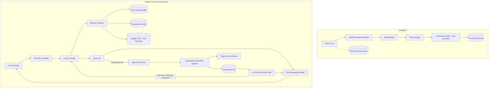
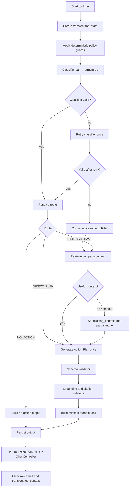
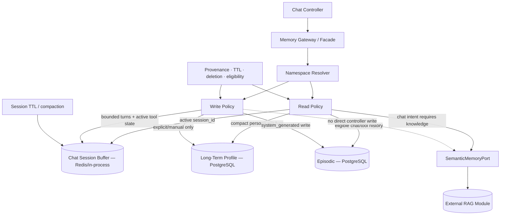
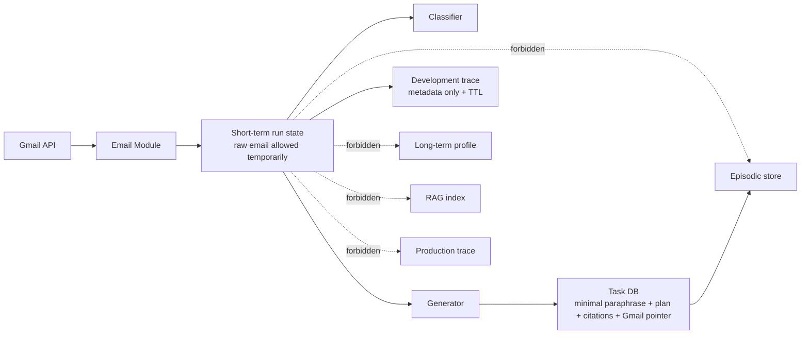
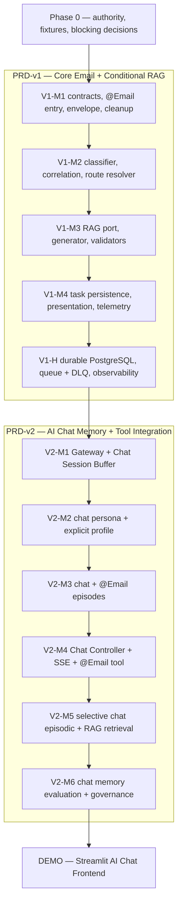

# Master Comparison — Current Architecture vs Target Cowork Agent

**Alignment status:** Corrected against `TARGET-ARCHITECTURE.md`; Step 7 decomposed against `PRD-v1-Core-Email-and-RAG.md` and `PRD-v2-Memory-Extension.md`<br>
**Authoritative target:** `TARGET-ARCHITECTURE.md` — Baseline target architecture<br>
**Current-code baseline:** commit `cf2fd49801d5932b26de82af9d104d730cf58271`, branch `main`<br>
**Date:** 2026-08-09

## Label legend

| Label | Meaning |
|---|---|
| **[S]** | Source-derived observation verified against the current code review |
| **[T]** | Required by the authoritative target architecture |
| **[D]** | Migration or implementation recommendation consistent with the target |
| **[A]** | Assumption that must be validated |
| **[U]** | Unresolved implementation question that does not override the target |

---

# 0. Alignment Decision

## AI Chat memory scope realignment

V1-M1..M4 establish the completed standalone Email RAG baseline. That
pipeline remains stateless and memory-free. PRD-v2 assigns the four-type
memory system to the multi-turn AI Chat Assistant, and exposes the completed
pipeline as an executable in-chat `@Email` skill. The Chat Controller owns
session orchestration and all Memory Gateway access; raw email remains
strictly ephemeral tool data. **[T]**

The original `master-comparison.md` was **conceptually aligned but not contract-aligned** with the target. It correctly identified the current system, preserved the one-shot deterministic pattern, kept RAG retrieval-only for the Cowork workflow, and protected raw email from durable memory. However, it diverged from the target on several load-bearing decisions.

## Corrected target execution shape

```text
User message → Chat Controller → Memory Gateway context assembly
→ stream assistant response or explicit @Email tool call
→ run the standalone Email RAG pipeline statelessly
→ render a grounded Action Plan card in the active chat thread
→ record chat turn and system-generated episode
→ purge raw email and transient tool state
```

This means:

- The classifier is a **separate structured LLM call** from Action Plan generation. **[T]**
- The classifier may produce a minimal `candidate_action_item`, but it does **not** produce the final draft plan. **[T]**
- Every resolved task candidate reaches exactly one final Action Plan generation call. Classifier
  invocations may be bounded batches, but each selected email still receives one route decision.
  **[T+D]**
- RAG failure produces a partial plan with explicit missing context; the system must not restore an unsupported pass-one draft or invent company procedure. **[T]**

## Critical corrections applied

| Area | Original comparison | Target-aligned correction |
|---|---|---|
| Classifier/generator calls | Reused the existing extraction-and-plan call as classifier and draft generator | Split into bounded classifier batch calls and exactly one final generator call per resolved task candidate |
| RAG path | Draft first, retrieve, regenerate only on RAG route | Classify first, retrieve conditionally, then generate once |
| RAG failure | Keep the pass-one draft | Generate a partial plan and expose missing context |
| Queue and DLQ | Deferred after deleting the fake queue | Delete fake queue, then implement a real queue worker and DLQ as target control plane |
| Long-term and episodic storage | SQLite recommended | PostgreSQL is the target initial durable store; SQLite may remain local-development only |
| Attachments | Existing extraction retained and extended | Attachment processing is out of scope; record presence only |
| Classifier contract | Existing enum plus two fields | Use the target actionability, route, reason-code, query, document-type, and numeric-confidence contract |
| Memory boundary | “Not a memory subsystem” | Implement a logical Memory Gateway/Facade and policy layer; it may remain in-process |
| Evaluation | Deferred | Build a labeled routing evaluation dataset before declaring routing stable |

## Decisive ownership answer

The current code generates Action Plans inside the Email workflow: the provider produces candidate steps, provider-specific code shapes them, and `DigestWorker` stores the result. **[S]** The target changes ownership as follows:

```text
Chat Controller → session orchestration, Memory Gateway access, SSE, tool routing
@Email Tool Adapter → invoke the standalone Email RAG pipeline
Email Module → fetch and normalize only
Classifier → actionability and knowledge sufficiency only
RAG Module → retrieve company chunks and citations only
@Email deterministic pipeline → own final Action Plan generation
Validators → enforce schema, grounding, and citation rules
```

Moving deterministic plan-shaping functions out of `gemini.py` remains a valid cleanup, but it is not enough by itself. The existing extraction call must be split or replaced so the target has a classifier stage and a separate generator stage. **[D]**

## Target precedence rule

Where `docs/references/ARCHITECHTURE.md`, earlier RAG blueprints, or the original comparison conflict with `TARGET-ARCHITECTURE.md`, this document treats `TARGET-ARCHITECTURE.md` as authoritative. In particular, the previous draft-then-retrieve-then-reground flow is superseded by classify-then-retrieve-then-generate-once.

---

## Step 1 — The existing architecture, as provided

No redesign in this section. Everything is source-derived unless labelled otherwise.

### 1.1 Services

One deployable: the FastAPI process created by `create_app()` (`server.py:44-292`). The Streamlit app in `gui/` is a test client, not a backend. There is no second service, no worker process, and no internal service boundary. External dependencies are Google OAuth, Gmail API v1, and one of Gemini or Groq.

### 1.2 Modules

| Module | Responsibility |
|---|---|
| `api/server.py` | Composition root, all HTTP routes, background dispatch |
| `api/handlers.py` | `_jsonable` serializer; also an unwired `MailTodoApi` class |
| `application/services.py` | `CreateDigestRun`, `DigestWorker`, `GetDigestResult` |
| `application/ports.py` | Nine protocols: mailbox, connections, attachments, actions, queue, publisher, runs, results, outbox |
| `application/contracts.py` | `ThreadContext`, `ExtractedAction`, `EmailExtraction`, `ExtractionBatch`, `ExtractionLimits` |
| `domain/models.py` | `EmailEnvelope`, `ActionItem`, `ActionPlanStep`, `DigestRun`, `EvidenceRef`, enums |
| `domain/policies.py` | Query normalization, limit validation, priority calculation, action fingerprinting |
| `infrastructure/gmail.py` | OAuth driver, mailbox adapter, message parser, error mapping |
| `infrastructure/gemini.py` | Transport, key rotator, prompt, schema, parser, **plan shaping and incident merging** |
| `infrastructure/groq.py` | Transport and error mapping only; everything else imported from `gemini.py` |
| `infrastructure/memory.py` | In-memory run/result repositories, queue, outbox, attachment extractor, test fakes |
| `infrastructure/connections.py` | SQLite mailbox connection repository |
| `infrastructure/security.py` | Fernet token cipher, HMAC-signed OAuth state manager |
| `infrastructure/config.py` | `GmailSettings`, `GeminiSettings`, `GroqSettings` from environment |

**No RAG module. No agent module. No memory module.**

### 1.3 APIs

Nine endpoints: `GET /health`; OAuth connect and callback; connection list and delete; unread preview; `POST /v1/mail-todo/runs`; run status; run result. No ingestion, retrieval, knowledge, chat, notification, approval, or preference endpoint exists.

### 1.4 Databases

| Store | Type | Durability |
|---|---|---|
| `mailbox_connections` | SQLite, default `.data/mail_todo.db` | Durable |
| Runs and idempotency map | `InMemoryRunRepository` | Process lifetime |
| Action items, warnings, processed metadata | `InMemoryResultRepository` | Process lifetime |
| `migrations/001_mail_todo.sql` | PostgreSQL DDL for connections, runs, action items, attachment extractions, outbox | **Not wired** — `create_app()` instantiates no PostgreSQL adapter |

### 1.5 Queues

**There is no queue.** `InMemoryQueue` records run IDs and nothing reads them. The instance is constructed inline at `server.py:70` and never stored on `app.state`, so its `run_ids` list is unreachable by any other code in the process. `InMemoryOutbox` is constructed inline at `server.py:88`; `DigestWorker` calls `.add()` on it (`services.py:243`) but its `pending()` and `mark_published()` can never be called. **Both are provably write-only.** Actual dispatch is `background_tasks.add_task(worker.execute, run.id)` at `server.py:231`, issued by the route, not by `CreateDigestRun`.

### 1.6 State ownership

| State | Owner | Lifetime |
|---|---|---|
| OAuth client secrets, cipher key, state secret | Process environment via `GmailSettings` | Process |
| Encrypted refresh token, mailbox ownership | `SQLiteMailboxConnectionRepository` | Until disconnect |
| OAuth nonce and PKCE verifier | `OAuthStateManager`, in memory | Invalid at TTL; evicted only by a later sweep, its own consumption, or restart |
| Raw email, normalized envelope, thread context | `GmailMailboxAdapter` → `DigestWorker`, transient | One worker call |
| Extracted attachment text | `SafeTextAttachmentExtractor` result, transient | One worker call |
| Run state, counters, safe error | `InMemoryRunRepository` | Process |
| Action items, warnings, processed metadata | `InMemoryResultRepository` | Process |
| Completion event | `InMemoryOutbox` | Process, unreadable |
| Candidate plan steps | LLM, then `gemini.py` shaping functions | One call |
| Final `ActionItem.action_plan` | Assigned unchanged by `DigestWorker` at `services.py:218` | With the action item |

### 1.7 Retry behavior

- **Gmail: none.** No retry, backoff, jitter, or explicit 429 handling.
- **Gemini: key rotation only, on HTTP 429 only** (`gemini.py:136-152`). Attempts are `min(GEMINI_MAX_ATTEMPTS_PER_REQUEST, key count)` (`config.py:106`), so a single-key deployment retries zero times. `GEMINI_ROTATE_ON_RATE_LIMIT=false` re-raises immediately. Non-429 errors are never retried.
- **Groq: none.**
- **Batches are not checkpointed.** `gemini.py:124-127` loops batches and lets any failure escape, discarding every earlier successful batch in the run.
- **Idempotent replay re-registers a background task**, but `claim` refuses a run that is no longer `queued` (`memory.py:43-48`), so the duplicate execution is a no-op.

### 1.8 Timeout behavior

- Gemini: `HttpOptions(timeout=timeout_seconds * 1000)` (`gemini.py:70-73`).
- Groq: `urllib` request timeout.
- Gmail: **no application timeout configured.**
- Attachments: `ExtractionLimits.timeout_seconds = 60` is defined at `contracts.py:34` and **never read** by `SafeTextAttachmentExtractor`. It is a dead knob.

### 1.9 Persistence paths

Exactly one write reaches durable storage: the encrypted refresh token and mailbox connection row, on OAuth callback. Everything a run produces is in-process. **Raw email bodies and attachment text are never written anywhere** — no store, no log statement, no API field carries them. This is the strongest thing the current system has going for it against the target.

### 1.10 Observability paths

One log statement: `logger.exception("Digest run %s failed", run.id)` (`services.py:238`). One event write that nothing can read (`services.py:243`). Safe error codes on the run, returned by polling. `processedEmails` metadata exposed in responses only when `APP_ENV` is development, dev or local (`server.py:311-312`). No metrics, no traces, no correlation IDs beyond `run_id` in that single log line, no audit trail, no external backend.

### 1.11 Gmail data flow

`POST /runs` → SQLite ownership check → `CreateDigestRun` → `BackgroundTasks` → `DigestWorker._fetch_threads` → paged `users.messages.list` with `is:unread in:inbox` forced by `normalize_query` → per-thread `users.threads.get(format="full")` → retain only messages the unread search selected → parse into `EmailEnvelope` → per-attachment download and bounded extraction → `DigestWorker` assembles `ThreadContext` → provider adapter → shaped `ExtractionBatch` → filter, fingerprint, prioritize, sort → `InMemoryResultRepository`.

### 1.12 RAG data flow

**None.** The nearest flow is attachment extraction, which is not RAG: text is read, passed into one prompt, and discarded. It is never chunked, embedded, indexed, or searched.

### 1.13 Where generation occurs

Answered above. Prompt build and shaping in `gemini.py`; candidate authoring in the external provider; assignment in `services.py:218`.

### 1.14 Where routing occurs

**There is no route resolver.** The only routing-shaped logic is a filter in the middle of the worker loop (`services.py:167-172`): skip unless `classification == "actionable"`, then skip any candidate with no evidence or `confidence == "low"`. That is a two-way keep/drop gate, evaluated after generation has already happened, not a decision that selects a path before it.

### 1.15 Where memory currently exists, even if not called memory

This is the most useful part of the extraction, because three of the four target memory types already have a seed.

| Target memory type | What already plays that role | Gap |
|---|---|---|
| **Short-term** | `EmailEnvelope` + `ThreadContext` + local vars in `DigestWorker.execute`. Ephemeral by construction, discarded at run end, never persisted. **Already satisfies the target's privacy boundary.** | Not a named or inspectable object; no explicit clear step; no TTL because scope ends the lifetime |
| **Long-term declarative** | `DigestWorker.execute(user_timezone: str = "UTC")` at `services.py:102` — a preference, hardcoded as a default parameter and never supplied by any caller | No store, no other preference exists |
| **Episodic** | `ActionItem` is already an episode: title, summary, plan, evidence, sender, deep link, fingerprint, `freshness` new/seen/changed, confidence, priority. `fingerprint_seen` (`memory.py:72-77`) scans prior items — this is episodic recall | Process-local, so recall dies at restart. No `status`, no `retrieval_eligible` |
| **Semantic** | Nothing | Entirely absent |

### 1.16 Cannot be determined from the material

- Deployment replica count, log destination, log retention. **[U]**
- Whether any external authentication layer fronts the API. `user_id` is an unverified query parameter (`server.py:107`). **[U]**
- Whether `migrations/001_mail_todo.sql` targets this runtime or the larger system in `ARCHITECHTURE.md`. **[U]**
- Whether Outlook support, `knowledge/`, and combined runs exist in another repository. **[U]**

---

---

# Step 2 — Current vs Authoritative Target

`K` = keep, `M` = modify, `R` = remove, `Miss` = missing today.

| Concern | Current implementation | Authoritative target | K | M | R | Miss | Alignment action |
|---|---|---|:-:|:-:|:-:|:-:|---|
| Gmail ingestion | Read-only Gmail adapter with OAuth, paging, and normalization | External Email Module with read-only Gmail access | yes | yes | | | Keep adapter; add target retries, timeout, and partial-batch contract |
| Email envelope | `EmailEnvelope` and `ThreadContext` | `EphemeralEmailEnvelope` with Gmail pointer and normalized body | yes | yes | | | Consolidate into the target contract; delete state after run |
| Attachments | Existing bounded text extraction | Attachments present may be reported, but processing is out of scope | | | yes | | Disable attachment extraction in this baseline; set `attachments_processed=false` |
| Queue and DLQ | Fake write-only in-memory queue; actual FastAPI background task | Real Job Queue and Dead-Letter Queue consumed by a run worker | | yes | yes | yes | Remove fake queue; add real worker-backed queue and DLQ |
| Run coordinator | `DigestWorker` owns the workflow | Agent Worker / Run Coordinator owns lifecycle | yes | yes | | | Evolve `DigestWorker`; no additional deployable Agent service is required |
| Classifier call | Classification and plan extraction occur in the same LLM response | One structured Actionability + Knowledge-Sufficiency classifier call | | yes | | | Split classifier from final generation |
| Classifier contract | `actionable/informational/newsletter/automated_no_action`; enum confidence | Target actionability labels, route, candidate action, gaps, query, expected docs, reason codes, numeric confidence | | yes | | | Introduce target DTO and map old values during migration |
| Route resolver | Keep/drop filter after generation | Deterministic resolver before retrieval and generation | | yes | | | Implement pure `resolve_route()` over rules + classifier + confidence |
| Direct route | Existing plan is produced in extraction call | `DIRECT_PLAN` calls the final Action Plan Generator once | | yes | | | Do not reuse classifier output as final plan |
| RAG route | Absent | `RETRIEVE_RAG` calls `SemanticMemoryPort`, then generator once | | | | yes | Add retrieval-only semantic provider |
| RAG ownership | No RAG; provider adapter shapes plans | RAG returns chunks/citations only; Agent Core generates final plan | | yes | | | Move plan ownership to Agent Core |
| Classifier failure | Provider failure ends or degrades run inconsistently | Retry classifier once; then route conservatively to RAG | | yes | | | Implement exact fallback sequence |
| RAG failure | No path | Retry once; structured empty result; partial plan; expose missing context | | | | yes | Never restore an unsupported draft or invent company procedure |
| Final generator | Existing extraction call creates plans | One Action Plan generation call after route and optional retrieval | | yes | | | Add separate generator contract and prompt |
| Output validation | Provider parser and deterministic shaping | Schema validator + grounding validator + citation validator | | yes | | yes | Centralize validators after generation |
| Short-term memory | In-process local variables | Redis or in-process Chat Session Buffer with bounded turns and TTL | yes | yes | | | Key by `session_id`; keep raw email only in separate transient tool state |
| Long-term declarative | Hardcoded timezone default | PostgreSQL AI Chat persona/profile loaded compactly per turn | | yes | | yes | Implement profile repository behind Memory Gateway |
| Episodic memory | In-memory `ActionItem` history | PostgreSQL chat summaries and `@Email` plan episodes | yes | yes | | | Persist derived output, never raw body |
| Episodic eligibility | No durable status policy | Approved/completed only are retrieval-eligible | | yes | | yes | Default `retrieval_eligible=false` |
| Semantic memory | `HybridSemanticMemory` local retrieval exists | Existing/pluggable RAG module through `SemanticMemoryPort` available to chat and `@Email` | yes | yes | | | No direct Chat Controller write into semantic memory |
| Memory facade | No logical facade | Memory Gateway/Facade serving Chat Controller with namespace and policy enforcement | | | | yes | Implement in-process facade first; it need not be a separate service |
| AI Chat Controller | Missing | Session orchestration, context assembly, tool routing, and SSE streaming | | | | yes | Add Chat API Controller, SSE handler, and Chat Controller event loop |
| Chat Session Working Memory | Missing | Bounded `session_id` turn history in Redis or in-process TTL state | | | | yes | Add Chat Session Buffer behind the Memory Gateway |
| `@Email` Chat Skill Tool | Missing | Executable wrapper around the completed stateless Email RAG pipeline | | | | yes | Return a structured Action Plan DTO to the active chat thread |
| Durable task output | In-memory | Task DB with title, minimal paraphrase, plan, citations, Gmail pointer | | yes | | | Use idempotent PostgreSQL persistence |
| Raw email durability | Raw body is not persisted | Raw body remains transient tool state with no durable exception | yes | | | | Preserve and test this boundary |
| Development trace | Minimal development-only processed metadata | Metadata-only; raw bodies and full prompts are prohibited | yes | yes | | | Keep hard environment guard and TTL |
| Production trace | One exception log and polling status | Metadata-only trace, event stream, metrics, and alerts | | yes | | yes | Structured logs may bootstrap, but are not the final target |
| Human approval | Absent | Future gate; current output remains `system_generated` and ineligible | yes | yes | | | Do not block baseline on approval UI |
| Reflexion/multi-agent | Absent | Explicitly out of scope | yes | | | | Keep absent |
| Routing evaluation | Absent | Labeled routing evaluation dataset | | | | yes | Add before production route tuning |

---

# Step 3 — Simplify Without Violating the Target

## 3.1 Remove fake asynchronous components, then implement the real control plane

Delete the current write-only `InMemoryQueue` and its unused wiring. **[S]** This cleanup remains correct. It must not be interpreted as removing queueing from the target.

Target migration:

```text
Current fake InMemoryQueue
→ delete
→ introduce real Job Queue
→ run coordinator consumes jobs
→ exhausted infrastructure retries enter DLQ
```

The `@Email` command creates runs through the same Feature API and queue. **[T]**

## 3.2 Delete the unwired `MailTodoApi`

Delete the unused class and keep the live FastAPI routes and `_jsonable`. **[D]** This is an implementation cleanup and does not affect the target architecture.

## 3.3 Replace the unreadable outbox with observable lifecycle events

The current completion event has no consumer. **[S]** Replace it initially with structured lifecycle events, then wire those events to the target development trace, production trace, and metrics sinks. A logging publisher is a valid first adapter, not the final observability plane. **[D]**

## 3.4 Move deterministic plan policy out of provider adapters

Move sanitization, step caps, de-duplication, incident correlation, and deterministic merge logic into Agent Core/application policy. **[D]** Provider adapters should own only transport and structured parsing.

The final target boundary is:

```text
ClassifierAdapter → EmailRouteDecision
ActionPlanGeneratorAdapter → ActionPlanOutput
Application policy → route resolution and deterministic output validation
```

The old combined `ActionExtractor` may remain behind a compatibility adapter during migration, but it must not remain the final target interface.

## 3.5 Evolve `DigestWorker` into the Agent Worker / Run Coordinator

No new deployable “Agent Core service” is required. **[D]** `DigestWorker` can evolve into the target worker if it explicitly owns:

- run lifecycle and idempotency;
- short-term state creation and cleanup;
- compact profile loading;
- classifier invocation;
- deterministic route resolution;
- optional RAG retrieval;
- bounded classifier invocation with one route decision per selected email;
- deterministic thread/incident correlation into task candidates;
- exactly one final Action Plan generation call per resolved task candidate;
- validation and persistence;
- episode write and lifecycle events.

## 3.6 Add a separate classifier call, not a classifier microservice

The target requires a distinct structured classifier call, but not a separate network service. **[T]** Implement a `RouteClassifierPort` in the application layer and let Gemini/Groq adapters satisfy it.

The existing combined extraction prompt can be split into:

```text
Call 1 — Route classifier
  actionability
  candidate_action_item
  email_is_sufficient
  knowledge_gaps
  retrieval_query
  expected_document_types
  reason_codes
  confidence

Call 2 — Final generator
  email context
  profile context
  eligible episodic context, when selected
  optional RAG context
  structured Action Plan output
```

## 3.7 Keep the route resolver as a pure deterministic function

```text
RETRIEVE_RAG =
    actionability is actionable
    AND email_is_sufficient = false
    AND missing knowledge is likely available in company documents
```

Hard policy rules may force retrieval for categories such as tax, governance, policy, procedures, and forms. The resolver combines those rules, the classifier result, and confidence. **[T]**

## 3.8 Generate once after routing

```text
NO_ACTION
  → build informational/no-action output

DIRECT_PLAN
  → final generator once with email + profile + eligible episode context

RETRIEVE_RAG
  → retrieve once
  → final generator once with retrieved chunks and citations
```

Do not ask the classifier to draft a final plan. Do not preserve a pre-retrieval draft as the RAG fallback. **[T]**

## 3.9 Implement four memory types behind one logical gateway

| Memory | Target behavior | Initial target storage |
|---|---|---|
| Short-term | Current run state, raw email, classifier result, retrieved context, generated candidate; clear at completion | Redis or in-process state |
| Long-term declarative | Compact user/profile configuration; explicit/manual writes only | PostgreSQL |
| Episodic | Derived task episodes; write every result as `system_generated`; retrieve approved/completed only | PostgreSQL |
| Semantic | Company policies, procedures, governance, templates; read only when routed | Existing RAG module |

The Memory Gateway is a logical application facade. It may be implemented in-process, but namespace enforcement, read/write eligibility, provenance, TTL, and deletion policy must be explicit. **[T]**

## 3.10 PostgreSQL is the target; SQLite is a temporary local adapter only

The authoritative target selects PostgreSQL for long-term declarative and episodic memory. **[T]** SQLite may be retained for local development or a short-lived migration adapter, but the comparison must not redefine SQLite as the production target.

## 3.11 Remove attachment processing from the baseline

The current code can extract some attachment text. **[S]** The target explicitly places email attachment processing out of scope. **[T]** For this baseline:

```yaml
attachments_present: boolean
attachments_processed: false
```

Attachment extraction, OCR, sandboxing, and attachment-derived evidence belong to a later architecture revision.

---

# Step 4 — Target-Aligned Recommended Changes

## 4.1 Keep

| Current component | Target-aligned use |
|---|---|
| Gmail OAuth, PKCE, read-only scope, encrypted refresh token | Keep within the Email Module |
| Gmail adapter and body normalization | Keep behind the Email Module API/port |
| Standalone Email RAG pipeline | Keep as the deterministic implementation behind `@Email` |
| Idempotency key and queued-to-running claim semantics | Preserve and make durable |
| Current raw-email ephemerality | Preserve as a non-negotiable privacy boundary |
| `ActionItem`, evidence, Gmail pointer, fingerprint concepts | Reuse as seeds for task output and episodic records |
| Deterministic policies | Move to Agent Core/application policy |
| Existing `HybridSemanticMemory` | Deprecated as default in favor of `QdrantSemanticMemory` (Qdrant Cloud adapter); retained only for backward compatibility |
| Existing development environment gate | Reuse for safe metadata-only diagnostics |

## 4.2 Modify

| Current component | Modification |
|---|---|
| Combined ActionExtractor | Split into `RouteClassifierPort` and `ActionPlanGeneratorPort` |
| Current classification enum | Map to target actionability enum during migration |
| Enum confidence | Convert classifier contract to numeric confidence |
| Provider plan shaping | Move to application validators/policies |
| BackgroundTasks dispatch | Replace with queue-backed worker execution |
| In-memory runs/results | Replace with PostgreSQL task and episode repositories |
| Timeout/retry behavior | Apply target budgets per external operation |
| Completion outbox | Emit target lifecycle events and telemetry |
| Current attachment flow | Disable processing for this baseline |
| Memory Gateway / Facade | Route namespaced memory access through the Chat Controller |
| Episodic Store | Persist chat summaries and tool outputs with lifecycle policy |

## 4.3 Add

| Component | Purpose |
|---|---|
| Cowork Feature API and Job Queue | Manual `@Email` run creation and delivery |
| Dead-Letter Queue | Exhausted job failures without raw email payload by default |
| Short-Term Run State | Explicit runtime state and cleanup |
| Memory Gateway / Facade | Namespace and memory policy enforcement |
| Long-Term Profile Store | Compact preferences/configuration in PostgreSQL |
| Episodic Store | Durable system-generated/approved/completed task episodes in PostgreSQL |
| `RouteClassifierPort` | Structured Actionability + Knowledge-Sufficiency classifier |
| Deterministic Route Resolver | `NO_ACTION`, `DIRECT_PLAN`, `RETRIEVE_RAG` |
| `SemanticMemoryPort` | Retrieval-only company knowledge interface |
| Action Plan Generator | Exactly one final generation call per resolved task candidate |
| Schema/Grounding/Citation Validators | Machine-enforced output guarantees |
| Task Output Repository | Minimal durable task artifact |
| Event Stream, traces, metrics, alerts | Target observability plane |
| Routing evaluation dataset | Measure actionable and RAG routing precision/recall |
| Chat API Controller | Create sessions and accept multi-turn messages |
| SSE Streaming Handler | Stream assistant deltas, tool calls, tool output, and citations |
| Chat Session Working Memory | Store bounded turn history keyed by `session_id` |
| `@Email` Skill Tool Wrapper | Execute the stateless Email RAG pipeline from chat |
| In-Chat Task Validation UI | Approve, complete, or reject Action Plan episodes inline |

## 4.4 Remove or defer

| Item | Decision |
|---|---|
| `InMemoryQueue` production wiring | Remove; retain a deterministic queue fake/local adapter for tests |
| Unwired `MailTodoApi` | Remove |
| `InMemoryOutbox` unreadable sink | Replace |
| Plan policy inside vendor adapters | Remove after relocation |
| Attachment processing | Defer; out of scope |
| Reflexion, ReAct loop, multi-agent orchestration | Do not add |
| Automatic email replies or external task execution | Do not add |
| Automatic preference extraction from emails | Do not add |
| Automatic semantic ingestion from emails | Do not add |
| Retrieval of unvalidated episodes | Do not add |

---

# Step 5 — Target Diagrams

## Diagram 1 — Current to Target Control and Execution Flow



## Diagram 2 — Stateless `@Email` Pipeline State Machine



## Diagram 3 — Four-Type Memory System



## Diagram 4 — Email Content Boundaries



## Diagram 5 — Migration Order (PRD-aligned)



---

# Step 6 — Target-Aligned Contracts

## 6.1 `EphemeralEmailEnvelope`

```yaml
run_id: string
session_id: string | null
chat_turn_id: string | null
tenant_id: string
user_id: string

gmail_message_id: string
gmail_thread_id: string
gmail_url: string

sender:
  name: string
  email: string
recipients:
  - string
subject: string
received_at: datetime
labels:
  - string

normalized_body: string
body_format: text | html_converted

attachments_present: boolean
attachments_processed: false

fetch_status: complete | partial
```

Lifecycle:

```yaml
scope: current_run
expires_at: datetime
persisted_to_product_db: false
cleanup: finalizer_plus_safety_ttl
```

## 6.2 `EmailRouteDecision`

```yaml
actionability:
  enum:
    - action_required
    - action_suggested
    - informational
    - unclear
    - irrelevant

route:
  enum:
    - no_action
    - direct_plan
    - retrieve_rag

candidate_action_item: string | null
email_is_sufficient: boolean

knowledge_gaps:
  - string

retrieval_query: string | null

expected_document_types:
  - company_policy
  - governance_document
  - procedure
  - guideline
  - template
  - product_documentation

reason_codes:
  - no_action
  - email_self_contained
  - company_procedure_required
  - governance_required
  - policy_required
  - template_required
  - internal_term_unresolved
  - domain_knowledge_required

confidence: number
```

The LLM proposes this structured decision. The deterministic resolver verifies consistency and applies hard rules before selecting the execution route.

## 6.3 `ChatMessageRequest`

```yaml
session_id: string
user_message: string
tool_choices:
  - "@Email"
idempotency_key: string
```

## 6.4 `ChatMessageStreamEvent`

```yaml
event_id: string
session_id: string
turn_id: string
event_type: delta | tool_call | tool_output | memory_citation | completed | error

delta:
  text: string | null
tool_call:
  name: "@Email" | null
  call_id: string | null
tool_output:
  action_plan: object | null
memory_citation:
  memory_type: declarative | episodic | semantic | null
  source_id: string | null
error:
  code: string | null
  safe_message: string | null
```

The stream never contains raw email bodies or full assembled prompts.

## 6.5 `MemoryContextRequest`

```yaml
session_id: string
namespace:
  tenant_id: string
  user_id: string
  session_id: string
  feature: ai_chat

reads:
  short_term: true
  long_term: true
  episodic:
    enabled: boolean
    retrieval_eligible_only: true
    max_items: integer
  semantic:
    enabled: boolean
    condition: chat_intent_requires_enterprise_context

response:
  profile: object | null
  episodes: []
  semantic_context: object | null
  degraded: boolean
  degraded_sources:
    - long_term
    - episodic
    - semantic
```

## 6.6 `SemanticRetrievalRequest`

```yaml
run_id: string
tenant_id: string
user_id: string

query: string
knowledge_gaps:
  - string
expected_document_types:
  - string

filters:
  tenant_scope: string
  document_status:
    - ready

limits:
  top_k: integer
  min_score: number
  timeout_ms: integer

constraint: >
  Return chunks, citation metadata, and scores only.
  Do not generate an Action Plan.
```

## 6.7 `SemanticRetrievalResponse`

```yaml
query_id: string
tenant_id: string

chunks:
  - chunk_id: string
    document_id: string
    document_title: string
    section: string | null
    text: string
    source_url: string
    document_version: string | null
    relevance_score: number
    rerank_score: number | null

retrieval_status:
  enum:
    - success
    - no_results
    - timeout
    - authorization_denied
    - partial

latency_ms: integer
```

## 6.8 `ActionPlanOutput`

```yaml
task:
  task_id: string
  run_id: string

  gmail_message_id: string
  gmail_url: string
  source_message_ids:
    - string
  incident_key: string | null

  title: string
  request_summary: string

  actionability: action_required | action_suggested | informational
  route: no_action | direct_plan | retrieve_rag

  priority: low | medium | high | urgent | null
  deadline: datetime | null

  action_plan:
    - step: integer
      instruction: string
      supporting_citation_ids:
        - string

  supporting_documents:
    - citation_id: string
      document_id: string
      title: string
      section: string | null
      url: string
      relevance_score: number

  missing_information:
    - string

  classifier_confidence: number
  generation_confidence: number | null

  validation_status: system_generated
  created_at: datetime
```

Validation rules:

- The schema must validate before persistence.
- Knowledge-specific instructions must be supported by a retrieved citation.
- RAG timeout or no-result mode must expose missing information.
- The generator must not invent company procedures.
- The output must not contain the full email body.

## 6.9 `TaskEpisode`

```yaml
episode_id: string
record_id: string
tenant_id: string
user_id: string
run_id: string
chat_session_id: string
chat_turn_id: string
source_tool: "@Email"

gmail_message_id: string
gmail_url: string

task_title: string
minimal_request_paraphrase: string
action_plan:
  - string

rag_citations:
  - document_id: string
    document_title: string
    section: string | null
    source_url: string

missing_information:
  - string

validation_status:
  enum:
    - system_generated
    - user_approved
    - completed
    - rejected

retrieval_eligible: boolean
retrieval_rule: >
  false when system_generated;
  true only after user_approved or completed.

source_type: system_generated_task | user_approved_task
created_at: datetime
updated_at: datetime
pipeline_version: string
model_id: string | null
prompt_version: string | null

privacy: >
  Store derived task output and Gmail pointer only.
  Do not store the raw email body.
```

## 6.10 `TraceEvent`

```yaml
run_id: string
tenant_id: string
user_id: string
gmail_message_id: string | null

event_name: string
status: success | partial | failed
route: no_action | direct_plan | retrieve_rag | null
reason_codes:
  - string

classifier_confidence: number | null
rag_result_count: integer | null
retrieval_status: string | null
generation_status: string | null
validation_status: string | null

latency_ms:
  email: integer | null
  memory: integer | null
  classifier: integer | null
  rag: integer | null
  generation: integer | null
  persistence: integer | null

content_policy:
  production: metadata_only
  development: metadata_only
  raw_email_allowed: false
  full_prompt_allowed: false
  development_ttl_required: true
```

---

# Step 7 — Final Change Plan, Aligned to PRD-v1 and PRD-v2

This step decomposes the migration into two PRD-scoped milestone groups so each implementation scope matches exactly one PRD:

- **PRD-v1** — `docs/PRD-v1-Core-Email-and-RAG.md`: manual `@Email` workflow, classification, routing, retrieval-only RAG, single generation, validation, minimal task persistence, telemetry. Long-term and episodic memory are explicitly deferred.
- **PRD-v2** — `docs/PRD-v2-Memory-Extension.md`: multi-turn AI
  Chat Controller, four-type memory, SSE, executable `@Email`, in-chat
  validation lifecycle, and selective episodic/RAG retrieval.

Decomposition rules:

1. Every work item cites the PRD sections/FRs it satisfies; an item with no citation is out of scope for that phase.
2. PRD-v1 §15 acceptance criteria gate the v1 group; PRD-v2 §16 acceptance criteria gate the v2 group.
3. Phase 0 is the shared prerequisite; each blocking decision is tagged with the PRD it gates.
4. The old Milestone 0–3 numbering is replaced to avoid collision with the PRDs' own delivery milestones: phases are now `Phase 0`, `V1-M*`, `V1-H`, `V2-M*`, where `V1-M1..M4` mirror PRD-v1 §16 Milestones 1–4 and `V2-M1..M6` mirror PRD-v2 §17 Milestones 1–6.

## 7.1 Scope mapping — master-comparison concerns to PRD phases

The Step 2 gap rows and Step 6 contracts are assigned here:

| Concern / contract | Assigned phase | PRD basis |
|---|---|---|
| `EphemeralEmailEnvelope` (6.1), attachment non-processing, cleanup/TTL | V1-M1 | PRD-v1 FR-04, FR-14; ADR-003 |
| Verified tenant/user principal | V1-M1 | PRD-v1 §13 |
| `EmailRouteDecision` (6.2), classifier split, resolver, guards | V1-M2 | PRD-v1 FR-05..FR-07, §12.2 |
| `SemanticRetrievalRequest`/`Response` (6.4/6.5), live RAG, partial-plan fallback | V1-M3 | PRD-v1 FR-08, FR-11, §12.3 |
| Generator call, schema/grounding/citation validators | V1-M3 | PRD-v1 FR-09, FR-10, §12.4 |
| `ActionPlanOutput` (6.8), idempotent task persistence, presentation, basic telemetry, development trace | V1-M4 | PRD-v1 FR-12..FR-16, §12.5 |
| Labeled routing evaluation dataset | V1-M2, grown through V1-H | PRD-v1 §14, §16 |
| PostgreSQL run/result/outbox repositories, real queue + DLQ, lifecycle events, production observability, launch gates | V1-H | PRD-v1 FR-02, §16 hardening |
| Chat message/SSE contracts (6.3–6.4), `MemoryContextRequest` (6.5), Memory Gateway, namespaces | V2-M1 | PRD-v2 FR-01, FR-02 |
| Long-term profile store, compact loading, degraded fallback | V2-M2 | PRD-v2 FR-03..FR-05, FR-18 |
| `TaskEpisode` (6.9), episodic writes, `retrieval_eligible=false` | V2-M3 | PRD-v2 FR-06, FR-08 |
| Approve/complete/reject transitions | V2-M4 | PRD-v2 FR-07, §12 |
| Selective episodic retrieval, labeled generation context, conflict rules | V2-M5 | PRD-v2 FR-09..FR-13 |
| `TraceEvent` memory fields (6.10), retention, deletion, memory evaluation | V2-M6 | PRD-v2 FR-15..FR-17, §15 |

## 7.2 Scope conflicts resolved by this alignment

| Conflict | Original master-comparison position | PRD position | Resolution |
|---|---|---|---|
| Queue/DLQ timing | Real queue + DLQ required before classifier work (old Milestone 1) | PRD-v1 FR-02 permits the existing runtime for the MVP; queue/DLQ listed under §16 hardening | The MVP loop (V1-M1..M4) runs on the in-process runtime but must enforce idempotent creation and at-most-one execution; durable queue/DLQ ships in V1-H |
| Live RAG placement | Bundled with memory in old Milestone 3 | PRD-v1 includes conditional RAG; PRD-v2 adds memory | Live RAG lands in V1-M3; all memory work lands in the V2 group |
| Episode writes | Bundled with task persistence | PRD-v1 persists the minimal task artifact only; episodes are a v2 capability | Task persistence in V1-M4; episodic records in V2-M3 |
| Generator inputs | Profile/episode context anticipated in the generator call | PRD-v1 FR-09 excludes long-term and episodic context | Generator context is extended only in V2-M5 |
| PostgreSQL-first durability | Durable repositories before workflow changes | PRD-v1 allows the MVP on the existing runtime | Task/run repositories are port interfaces from V1-M4; PostgreSQL adapters land in V1-H; §3.10 stands — PostgreSQL remains the production target |

## Authority and migration decisions

The target baseline intentionally changes current attachment behavior. ADR-003 supersedes
ADR-002 and only the attachment-processing clauses of ADR-001. The remaining ADR-001 decisions
about an asynchronous pipeline, durable queue, PostgreSQL source of truth, idempotency, worker
claim semantics, and ports/adapters remain authoritative.

The current codebase provides useful seams but not the production control plane:

- `QueuePort`, `RunRepository`, `ResultRepository`, and `CompletionOutboxPort` already exist;
- the application wires in-memory run/result/outbox adapters;
- the HTTP route invokes `DigestWorker` through FastAPI `BackgroundTasks`, bypassing queue
  consumption;
- PostgreSQL DDL exists for runs, action items, attachment extraction history, and
  outbox events, but production run/result repository adapters are not wired;
- no `tenant_id`, Memory Gateway, semantic-memory port, or RAG adapter exists in this repository.

Therefore the change plan must close the durability and identity gaps before introducing a real
cross-process worker.

## Target execution unit and call cardinality

The target preserves current bounded batching and cross-message correlation:

1. A run may use one or more bounded classifier batch calls.
2. Every selected email receives exactly one `EmailRouteDecision`.
3. Application-owned deterministic logic correlates decisions by thread/incident and forms task
   candidates while preserving `source_message_ids` and `incident_key`.
4. Each task candidate resolves once to `NO_ACTION`, `DIRECT_PLAN`, or `RETRIEVE_RAG`.
5. A `RETRIEVE_RAG` task candidate performs zero or one logical retrieval operation, with only
   the documented bounded technical retry.
6. Agent Core invokes the final generator exactly once per resolved task candidate. It does not
   invoke the generator for `NO_ACTION`.

Observability must report classifier batch count, email decision count, correlated task-candidate
count, retrieval count, and generator count separately.

## Compatibility contract

Compatibility is a required migration contract, not “where possible”:

| Current behavior | Target migration requirement |
|---|---|
| `POST /v1/mail-todo/runs` returns `202` and a pollable run | Preserve endpoint, idempotency, status URL, and terminal-state semantics |
| Result contains `actionItems`, `nextActions`, warnings, and an empty-state message | Provide a versioned compatibility mapper from persisted task outputs |
| Priority includes `urgent` and drives ordering | Retain `urgent` in the target task contract and preserve deterministic ordering |
| Multiple messages may form one correlated incident/action | Preserve `source_message_ids`, `incident_key`, evidence provenance, and dedupe behavior |
| Development responses may expose processed-email metadata | Keep the development-only guard; production remains metadata-minimal |
| Attachment extraction can produce partial runs and warnings | Treat this as an intentional product-scope change under ADR-003; report presence only and do not claim behavior preservation |
| Duplicate create requests enqueue one logical run | Preserve atomic idempotent creation and at-most-one logical enqueue |

The old combined `ActionExtractorPort` may remain behind a temporary compatibility adapter while
callers migrate. Production removal happens only after the compatibility tests pass.

## Phase 0 — Authority, baseline, and blocking decisions

Complete before implementation refactors. Tags mark which PRD group each item gates.

1. **[both]** Record ADR-003 and mark ADR-002 superseded.
2. **[v1]** Freeze current API/result fixtures, priority ordering, batching, correlation, dedupe, and
   privacy behavior as compatibility tests.
3. **[v1]** Build the first labeled routing fixture set and capture the existing combined-extractor
   quality, latency, call-count, and cost baseline.
4. **[v1]** Define the task-candidate correlation contract and generator cardinality above.
5. **[v1]** Resolve the verified principal source and mandatory `tenant_id` + `user_id` namespace.
6. **[v1-H / v2]** Select PostgreSQL deployment/migration ownership and the durable queue/DLQ
   technology.
7. **[v1]** Decide whether the RAG provider is external or must be built, and identify corpus/ACL
   ownership.

**Exit criteria:**

- **[v1]** no dependent implementation relies on an unverified query-parameter identity;
- **[v1-H]** queue, database, and RAG ownership decisions have named owners;
- **[v1]** compatibility and routing fixtures can detect regressions before provider prompts change;
- **[both]** attachment scope is unambiguous across the PRDs, Target Architecture, ADRs, and this
  comparison.

## PRD-v1 milestone group — Core Email and Conditional RAG

### V1-M1 — Core contracts and Gmail entry

Maps to PRD-v1 §16 Milestone 1; satisfies FR-01, FR-03, FR-04, FR-14, and §13.

1. Define versioned `EphemeralEmailEnvelope`, `EmailRouteDecision`, `ActionPlanOutput`, and trace
   contracts, including `source_message_ids`, `incident_key`, and `urgent`. (`TaskEpisode` and
   `MemoryContextRequest` are deferred to V2-M1.)
2. Implement the verified principal boundary that supplies `tenant_id` and `user_id`; remove
   authorization decisions based only on caller-provided query parameters.
3. Route manual `@Email` invocation through the run-creation service with atomic idempotent
   creation and at-most-one logical execution.
4. Consolidate `EmailEnvelope`/`ThreadContext` into `EphemeralEmailEnvelope`; disable attachment
   download/extraction under ADR-003 and record `attachments_present` only.
5. Implement explicit short-term run-state cleanup plus a safety TTL.
6. Delete the write-only fake queue wiring and the unwired `MailTodoApi` after endpoint
   compatibility tests cover the live FastAPI routes; retain deterministic fakes for tests.

**Exit criteria:**

- duplicate create requests produce exactly one logical run;
- the run/status/result compatibility suite passes;
- attachment presence never invokes download/extraction;
- no raw email content survives run completion (cleanup and TTL tested);
- Gmail access is gated by verified identity.

### V1-M2 — Classification and routing

Maps to PRD-v1 §16 Milestone 2; satisfies FR-05, FR-06, FR-07, and §12.2.

1. Split provider integration into `RouteClassifierPort` and `ActionPlanGeneratorPort`; move
   deterministic plan shaping, correlation, dedupe, priority, and ordering out of vendor adapters
   into application-owned services.
2. Implement bounded classifier batching with one schema-validated decision per selected email.
3. Implement deterministic task-candidate correlation by thread/incident, preserving
   `source_message_ids` and `incident_key`.
4. Implement the deterministic route resolver with hard policy guards: `NO_ACTION`,
   `DIRECT_PLAN`, `RETRIEVE_RAG`, and partial-mode direct fallback.
5. Implement classifier failure fallback: retry once, then route conservatively to `RETRIEVE_RAG`.
6. Grow the labeled routing fixture set and run the routing evaluation after every prompt or
   provider change.

**Exit criteria:**

- classifier batch count and per-email decisions are observable and schema-valid;
- correlation preserves current related-message/incident behavior;
- the resolver is pure and deterministic, with guard categories covered by tests;
- the fallback sequence matches PRD-v1 §12.2 exactly.

### V1-M3 — RAG, generation, and validation

Maps to PRD-v1 §16 Milestone 3; satisfies FR-08..FR-11, §12.3, and §12.4.

1. Implement the retrieval-only `SemanticMemoryPort`: a null adapter returning structured
   `no_results` first, then the production adapter against the external RAG with ACL/tenant
   filtering before ranking.
2. Implement exactly one final generator call per resolved non-`NO_ACTION` task candidate; v1
   inputs are limited to email context, route decision, retrieved RAG context, and system defaults.
3. Implement schema, grounding, citation, privacy (no raw body in output), and
   unsupported-procedure validators.
4. Implement the RAG failure path: bounded retry once, structured empty result, partial plan with
   explicit `missing_information`.
5. Implement the generation failure path: one schema-repair retry, then fail per the user-facing
   error policy.
6. `DIRECT_PLAN` performs zero semantic retrieval.

**Exit criteria:**

- generator count equals the number of resolved non-`NO_ACTION` task candidates;
- a null/no-result semantic response yields an explicit partial plan with missing information;
- company-specific steps survive validation only with a current-retrieval citation;
- `DIRECT_PLAN` performs no retrieval;
- raw email is absent from generated output.

#### V1-M3 implementation addendum — T3.7 (2026-08-09)

The local retrieval adapter is now `HybridSemanticMemory`: tenant ACL is checked before query
embedding or lexical statistics/scoring; the allowed corpus is searched by the existing in-repo
dense numpy adapter and BM25, fused with deterministic RRF (`k=60`), optionally reranked by Jina,
then reduced to final top-k. `JINA_API_KEY` is optional; a missing key or any Jina transport/schema
failure preserves the RRF candidate order. This closes the local hybrid-retrieval slice only.
Production Qdrant, ingestion APIs, and the PRD-v2 four-type memory system remain target work.

### V1-M4 — Persistence and product presentation

Maps to PRD-v1 §16 Milestone 4; satisfies FR-12, FR-13, FR-15, FR-16, and §12.5.

1. Implement idempotent task persistence behind a repository port, keyed
   `tenant_id:user_id:gmail_message_id:pipeline_version`; local adapter first, PostgreSQL adapter
   in V1-H.
2. Provide the versioned compatibility mapper from persisted task outputs to the legacy result
   shape (`actionItems`, `nextActions`, warnings, empty-state message).
3. Show tasks with Gmail pointer, citations, priority/deadline, and missing-information warnings
   in the Cowork surface.
4. Emit metadata-only basic telemetry: run status, message id, route/reason codes, confidence,
   retrieval status/count, validation status, stage latency, errors, fallback use.
5. Keep development traces metadata-only with TTL, restricted access, and a
   hard production guard; raw email and full prompts are prohibited.

**Exit criteria:**

- task rows contain no raw email body; idempotent replay is safe;
- the compatibility suite passes against persisted outputs;
- production telemetry is metadata-only; development trace cannot be enabled in production.

### V1-H — Engineering hardening (durable control plane)

Maps to PRD-v1 §16 future engineering hardening and FR-02's optional production-grade execution.
These items close the durability gaps from old Milestone 1 without gating the MVP product loop.

1. Implement PostgreSQL run/result/outbox repositories using the existing schema as migration
   input, with atomic idempotent create and compare-and-set claim semantics; migrate from the
   local adapters.
2. Wire a durable queue producer and worker consumer with bounded retry and DLQ; replace the
   FastAPI `BackgroundTasks` bypass. DLQ payloads must not contain email body, attachment bytes,
   or OAuth tokens.
3. Replace the unreadable outbox with observable metadata-only lifecycle events wired to trace
   and metrics sinks.
4. Apply target timeout/retry budgets per external operation: Gmail backoff/jitter, token
   refresh, partial-batch continuation.
5. Add advanced observability, alerts, numeric launch gates, and the scaled evaluation harness.

**Exit criteria (carried from old Milestone 1):**

- an API-created run is visible to a separate worker process;
- only one worker can claim a run;
- retry exhaustion reaches the DLQ without email body, attachment bytes, or OAuth tokens;
- process restart does not lose run status or completed output.

**PRD-v1 is complete when** PRD-v1 §15 acceptance criteria 1–19 pass and the V1-H exit criteria
hold.

## PRD-v2 milestone group — AI Chat Memory and `@Email` Tool Extension

Depends on a stable PRD-v1. `V2-M1..M6` mirror PRD-v2 §17 Milestones 1–6.

### V2-M1 — Chat Memory Gateway and session working memory

Satisfies PRD-v2 FR-01, FR-02.

1. Define `ChatMessageRequest`, `ChatMessageStreamEvent`, `TaskEpisode`, profile,
   retrieval, transition, provenance, and `MemoryContextRequest` contracts.
2. Implement the logical Memory Gateway (in-process allowed): namespace resolution, read/write
   eligibility, provenance, degraded responses, memory-type isolation; fail closed on missing or
   inconsistent namespace.
3. Route all Chat Controller memory access through the gateway.
4. Implement a bounded Chat Session Buffer keyed by mandatory `session_id` and
   `feature: ai_chat`, with TTL and compaction policy.

**Exit criteria:** cross-tenant and cross-user access tests fail closed; no memory access
bypasses the gateway.

### V2-M2 — AI Chat declarative profile

Satisfies PRD-v2 FR-03..FR-05, FR-15, FR-16, FR-18.

1. Implement the PostgreSQL profile store and the explicit-only write path (user configuration,
   explicit remember request, trusted admin config); no inference from email bodies.
2. Implement compact persona and preference loading for each relevant chat
   turn with a default-profile degraded fallback.
3. Implement preference/profile deletion and retention behavior.

**Exit criteria:** stored preferences change later chat responses; profile read
failure never blocks the chat turn or the stateless v1 tool; writes are explicit-only.

### V2-M3 — Chat and `@Email` episodic persistence

Satisfies PRD-v2 FR-06, FR-08, FR-14, FR-18.

1. Write bounded chat summaries and one episode per successfully persisted
   `@Email` task: `system_generated`,
   `retrieval_eligible=false`, idempotent and retry-safe; an episode write failure preserves the
   task and never duplicates it.
2. Enforce retrieval eligibility at both write and read boundaries in code, not prompts.
3. Make provenance and lifecycle metadata mandatory; validate that episodes contain no raw email
   body.

**Exit criteria:** system-generated episodes cannot be retrieved; writes are idempotent; episodes
contain derived task output and Gmail pointer only.

### V2-M4 — AI Chat Controller, SSE, and `@Email` tool execution

Satisfies PRD-v2 FR-07 and §12.

1. Implement Chat API session/message endpoints, the Chat Controller event
   loop, and typed SSE streaming.
2. Wrap the completed Email RAG pipeline as the allow-listed `@Email` skill.
3. Render its Action Plan DTO in chat with transactional, idempotent
   approve/complete/reject controls.
4. Enforce eligibility, provenance, and timestamps on every transition.

**Exit criteria:** approval/completion makes an episode retrieval-eligible; rejection keeps it
ineligible; invalid transitions are refused.

### V2-M5 — Selective episodic and RAG retrieval for chat

Satisfies PRD-v2 FR-09..FR-13.

1. Implement the episodic retrieval request with eligibility filters (`user_approved`,
   `completed`, `retrieval_eligible=true`), bounded results, and relevance scoring.
2. Implement the selective trigger policy from chat intent; never retrieve all
   episodic or semantic context on every turn.
3. Assemble labeled chat context: system persona, active session buffer,
   explicit preference, validated episode, and company evidence.
4. Implement conflict precedence: current instruction > current company evidence > stored
   preference > advisory episode; never invent to resolve conflicts.

**Exit criteria:** retrieval returns approved/completed episodes only, even when directly
requested by the model; generation context sources are labeled; episodic retrieval failure skips
episodes and continues.

### V2-M6 — AI Chat memory evaluation and governance

Satisfies PRD-v2 §15, §17 Milestone 6, FR-16, FR-17.

1. Evaluate memory-enabled chat against a memory-disabled chat baseline.
2. Define retention periods; implement background purge, deletion audits, and index propagation.
3. Add memory safety metrics and alerts: unvalidated retrieval, cross-tenant incidents,
   raw-email violations, rejected-episode retrieval, expired-record retrieval — all must hold at
   zero.
4. Establish launch thresholds.

**Exit criteria:** PRD-v2 §16 acceptance criteria 1–20 pass; safety counters remain at zero under
test.

## DEMO — Streamlit AI Chat showcase (after both PRD groups)

A demonstration frontend that exercises the complete value loop end-to-end in
a browser. Full specification: `docs/SPEC-Demo-Frontend.md`.

1. Increment A centers the AI Chat Assistant and embedded `@Email` tool after
   the required backend gates pass; Increment B adds memory transparency and
   in-chat lifecycle controls after PRD-v2 §16 passes.
2. The demo is a pure API client: no workflow, routing, generation, or
   memory-policy logic in the client; no scaffolding of unimplemented
   milestone capabilities.
3. Privacy invariants hold in the UI: raw email bodies are never rendered or
   cached; attachments are presence-only; Gmail stays read-only.
4. Verification is live: backend + GUI run locally and the full loop is
   walked in a real browser with screenshot evidence (SPEC §9).

**Exit criteria:** all SPEC-Demo-Frontend §8 acceptance criteria pass with
browser-verified evidence.

## Recommended implementation order

| Order | Phase | Work | Dependency or proof |
|---:|---|---|---|
| 0 | Phase 0 | Resolve authority and record ADR-003 | Attachment scope agreed |
| 1 | Phase 0 | Freeze API/behavior compatibility fixtures | Current behavior captured |
| 2 | Phase 0 | Build initial labeled routing and cost baseline | Split-call regression gate |
| 3 | Phase 0 | Resolve verified principal, PostgreSQL owner, queue technology, and RAG/ACL owner | Named blocking decisions |
| 4 | V1-M1 | Define shared versioned contracts and task-candidate cardinality | Contract review |
| 5 | V1-M1 | Implement verified tenant/user boundary | Authorization tests |
| 6 | V1-M1 | `@Email` run creation, envelope, cleanup/TTL, attachment non-processing, fake-queue/`MailTodoApi` removal | Privacy, idempotency, no-download tests |
| 7 | V1-M2 | Split classifier/generator ports; move deterministic shaping to application services | Provider contract tests |
| 8 | V1-M2 | Implement bounded classification, correlation, deterministic route resolution | Labeled routing evaluation |
| 9 | V1-M3 | Implement `SemanticMemoryPort` (null then live), generator, validators, fallbacks | Call-count, citation, fallback tests |
| 10 | V1-M4 | Implement idempotent task persistence, presentation, telemetry, development trace | Persistence/privacy/compatibility tests |
| 11 | V1 | PRD-v1 §15 acceptance review | v1 launch readiness |
| 12 | V1-H | Implement durable PostgreSQL run/result/outbox adapters | Restart and atomic-claim tests |
| 13 | V1-H | Implement queue producer/consumer, retry, and DLQ | Separate-process integration test |
| 14 | V1-H | Add telemetry sinks, retention, purge, and launch gates | Operational verification |
| 15 | V2-M1 | Implement Memory Gateway, `feature: ai_chat` namespace, and Chat Session Buffer | Namespace, TTL, and fail-closed tests |
| 16 | V2-M2 | Implement AI Chat persona/profile loading, fallback, and deletion | Preference application tests |
| 17 | V2-M3 | Persist chat summaries and idempotent `@Email` episodes | Eligibility and privacy tests |
| 18 | V2-M4 | Implement Chat Controller, SSE handler, `@Email` tool, and inline transitions | Stream, tool, transition, and eligibility tests |
| 19 | V2-M5 | Implement selective episodic/RAG retrieval and labeled chat context | Retrieval and conflict tests |
| 20 | V2-M6 | Evaluate AI Chat memory, retention, deletion audits, and launch gates | Operational verification |
| 21 | DEMO | Build Streamlit AI Chat showcase with embedded `@Email` and memory panels | SPEC §8 acceptance + Playwright evidence |

## Blocking decisions

These decisions do not reopen the target behavior, but they block the dependent implementation:

| Decision | Must be resolved before | Gates |
|---|---|---|
| ~~Verified principal source and tenant/user binding~~ | Any durable task, memory, or RAG access (V1-M1) | PRD-v1 — **resolved 2026-08-07, see below** |
| PostgreSQL deployment and migration owner | Durable run/task adapters (V1-H) and profile/episode stores (V2-M2/M3) | PRD-v1 hardening + PRD-v2 |
| ~~Queue/DLQ technology and retry ownership~~ | Real worker integration (V1-H) | PRD-v1 hardening — **resolved 2026-08-07, see below** |
| ~~Corpus owner and ACL model~~ | Live semantic retrieval (V1-M3) | PRD-v1 — **resolved 2026-08-07, see below** |
| ~~External RAG availability versus in-repo build~~ | `SemanticMemoryPort` production adapter (V1-M3) | PRD-v1 — **resolved 2026-08-07, see below** |
| Routing/retrieval/citation/latency/cost thresholds | Classifier/RAG launch approval (V1-H gates) | PRD-v1 launch |
| Preference field set and approval/completion UI shape | Long-term writes (V2-M2) and transitions (V2-M4) | PRD-v2 |
| Episodic relevance algorithm and thresholds | Selective retrieval (V2-M5) | PRD-v2 |
| Retention periods and memory quality-improvement threshold | Launch approval (V2-M6) | PRD-v2 launch |

### Blocking decision resolutions (2026-08-07)

Resolved with the product owner; do not reopen without cause.

| Decision | Resolution |
|---|---|
| Verified principal source | **Mailbox-Connection principal.** `user_id` is the Gmail account email from the verified OAuth grant (Mailbox Connection); `tenant_id` is a fixed local-tenant constant for the MVP. The caller-provided `user_id` query parameter is removed; all Gmail/task/RAG access is scoped to the connection owner. Land in V1-M1. |
| External vs in-repo RAG | **Build a minimal in-repo RAG** (embedding + vector store) inside V1-M3, exposed through the retrieval-only `SemanticMemoryPort`. |
| Corpus owner and ACL model | Corpus is local to this repository (owner: this project); ACL = tenant/user namespace filtering applied before ranking/return, enforced in the port adapter. |
| Queue/DLQ technology | **Redis Streams** (consumer groups, retry/claim, DLQ stream) at V1-H; the MVP loop (V1-M1..M4) stays on the in-process runtime per PRD-v1 FR-02. |

Still open: PostgreSQL deployment/migration owner (decide before V1-H).

## Resolved decisions that should not be reopened

- Agent Core owns final Action Plan generation.
- RAG is retrieval-only for the Cowork workflow.
- Classifier and generator are separate ports and calls.
- Classifier calls may be bounded batches; every selected email receives one route decision.
- Deterministic application logic forms task candidates and preserves cross-message correlation.
- The final generator is called exactly once per resolved non-`NO_ACTION` task candidate.
- `urgent` remains a supported priority during and after compatibility migration.
- Durable run state precedes and is shared by the real queue worker (V1-H internal ordering).
- Long-term and episodic production storage is PostgreSQL.
- Queue worker and DLQ remain part of the target baseline; PRD-v1 delivers them in V1-H
  hardening rather than gating the MVP product loop (PRD-v1 FR-02).
- PRD-v1 ships without long-term and episodic memory; those capabilities belong exclusively to
  the PRD-v2 group.
- Production attachment processing is out of scope under ADR-003; presence is recorded only.
- Queue fakes/local adapters remain valid for tests and local development, not production wiring.
- Raw email is not long-term, episodic, or semantic memory.
- System-generated episodes are not retrieval-eligible.
- Reflexion and multi-agent orchestration are out of scope.
