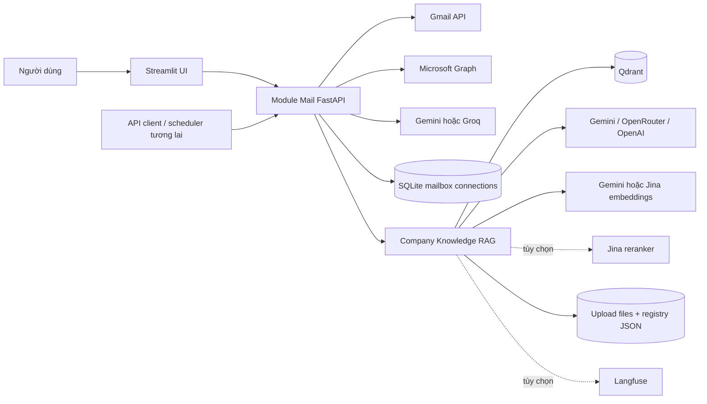
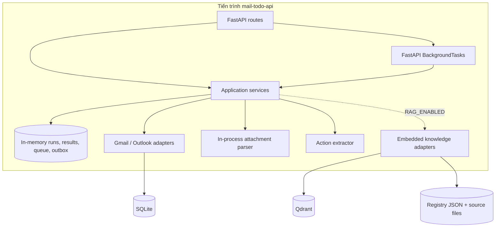
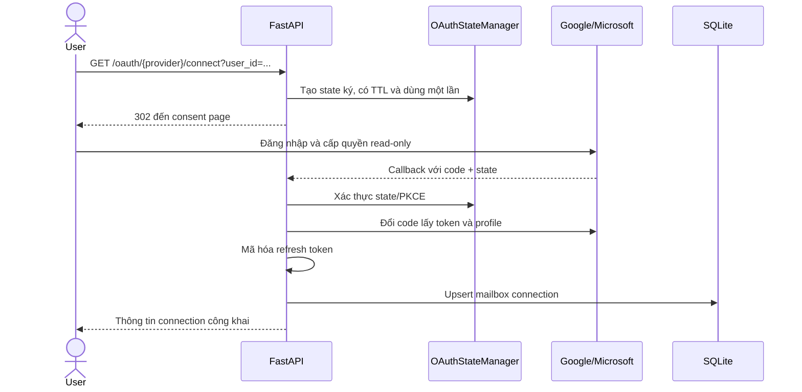
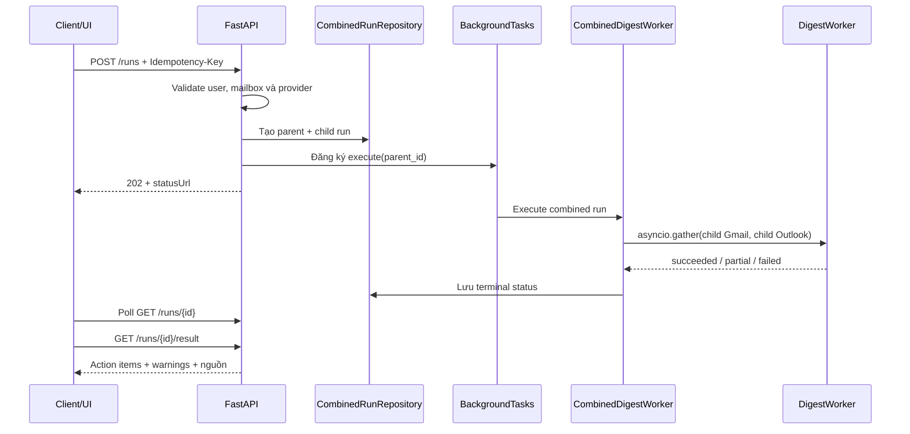
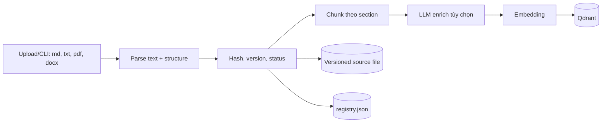
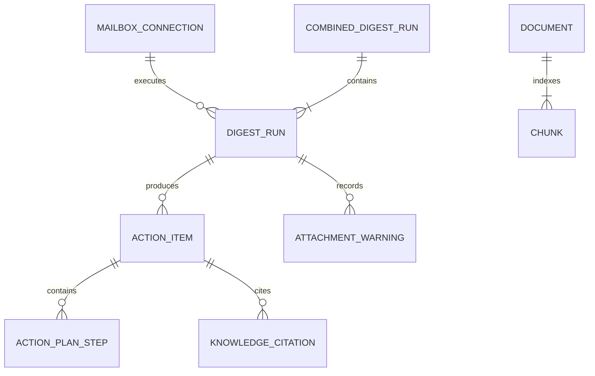

# Kiến trúc hệ thống Module Mail

> Trạng thái tài liệu: mô tả kiến trúc **đang được hiện thực trong mã nguồn** tại ngày 2026-08-06.  
> Các nội dung thuộc kiến trúc đích nhưng chưa được nối vào runtime hiện tại được ghi rõ là “định hướng production”.

## 1. Mục tiêu và phạm vi

Module Mail chuyển email chưa đọc từ Gmail và Outlook/Microsoft 365 thành danh sách công việc có cấu trúc. Hệ thống có thể dùng kho tài liệu quy trình nội bộ (Company Knowledge RAG) để tạo kế hoạch hành động có trích dẫn.

Hệ thống hiện thực các khả năng chính:

- Kết nối Gmail và Outlook qua OAuth, chỉ xin quyền đọc.
- Quét đồng thời tối đa một mailbox cho mỗi provider trong một combined run.
- Đọc email chưa đọc, lấy ngữ cảnh thread và file đính kèm.
- Dùng Gemini hoặc Groq để phân loại email và trích xuất action item có cấu trúc.
- Chuẩn hóa ưu tiên, deadline, bằng chứng và chống trùng lặp trong phạm vi dữ liệu kết quả hiện có.
- Tùy chọn truy hồi quy trình nội bộ từ Qdrant và sinh action plan có citation.
- Cung cấp REST API và giao diện kiểm thử Streamlit.

Ngoài phạm vi hiện tại:

- Không gửi, sửa, xóa hoặc đánh dấu đã đọc email.
- Không tự động thực thi action plan.
- Chưa có authentication/authorization production cho API.
- Chưa dùng PostgreSQL và durable queue trong runtime API hiện tại.
- Chưa có sandbox/OCR production cho file đính kèm.

## 2. Bối cảnh hệ thống



Điểm vào duy nhất là `mail_todo.api.server:create_app`. FastAPI app này hợp nhất mailbox digest, quản lý tài liệu knowledge và knowledge chat dưới cùng namespace `/v1/mail-todo`. `mail_todo.knowledge.api.router` chỉ tạo `APIRouter`, không khởi tạo một FastAPI app hoặc runtime riêng.

## 3. Kiến trúc runtime hiện tại

Runtime local/MVP chạy trong một tiến trình:



Hệ quả vận hành quan trọng:

- API trả `202 Accepted`, sau đó chạy combined worker bằng `BackgroundTasks` trong cùng process.
- Run, child run, kết quả, queue và outbox mất khi process restart.
- Không có worker process độc lập; không có retry bền vững sau crash.
- Chỉ mailbox connection được lưu bền vững trong SQLite.
- Khi bật RAG, metadata tài liệu và file gốc được lưu trên filesystem; vector/chunk được lưu trong Qdrant.

## 4. Phân lớp và trách nhiệm

Hệ thống áp dụng ports-and-adapters, với dependency hướng vào domain/application.

### 4.1 `domain/`

Chứa mô hình và policy thuần, không phụ thuộc FastAPI, database hoặc SDK provider:

- `MailboxConnection`, `DigestRun`, `CombinedDigestRun`.
- `EmailEnvelope`, `AttachmentRef`, `ExtractedAttachment`.
- `ActionItem`, `ActionPlanStep`, `KnowledgeCitation`, `EvidenceRef`.
- Trạng thái run: `queued`, `running`, `succeeded`, `partial`, `failed`.
- Policy chuẩn hóa query, giới hạn email, tính priority và tạo fingerprint.

### 4.2 `application/`

Điều phối use case và định nghĩa port:

- `CreateDigestRun`: tạo child run có idempotency và enqueue qua `QueuePort`.
- `DigestWorker`: thực hiện toàn bộ pipeline của một mailbox.
- `CreateCombinedDigestRun`: tạo parent run và một child run cho từng mailbox.
- `CombinedDigestWorker`: chạy các child worker đồng thời và tổng hợp trạng thái.
- `GetDigestResult` / `GetCombinedDigestResult`: trả kết quả terminal.
- `ports.py`: contract cho mailbox, repository, queue, attachment extractor, LLM, RAG và outbox.

Application layer chỉ biết các protocol; adapter cụ thể được nối tại startup của API.

### 4.3 `infrastructure/`

Hiện thực các port và tích hợp bên ngoài:

- Gmail OAuth và Gmail API.
- Microsoft OAuth và Microsoft Graph.
- Router chọn mailbox adapter theo provider đã lưu trong connection.
- Gemini/Groq action extractor.
- Parser attachment trong process.
- SQLite repository cho mailbox connection.
- Repository, queue và outbox in-memory cho local runtime/test.
- Adapter nối mail pipeline với knowledge retrieval và grounded plan generation.
- Mã hóa refresh token và ký OAuth state.

### 4.4 `api/`

Chứa FastAPI composition root và HTTP adapter:

- Nạp một `RuntimeSettings` từ environment trong lifespan.
- Khởi tạo repository, provider adapter, worker và knowledge runtime.
- Validate ownership theo `user_id`, payload, provider và trạng thái run.
- Chuyển domain object thành JSON response.
- Chỉ trả thông báo lỗi đã được đánh dấu an toàn.

### 4.5 `knowledge/`

Là bounded context cho Company Knowledge RAG:

- `ingestion/`: parse, cấu trúc, chunk và tùy chọn enrich tài liệu.
- `retrieval/`: dense search, BM25, Reciprocal Rank Fusion và tùy chọn rerank.
- `providers/`: generation, embedding, key rotation và provider fallback.
- `generation/`: trả lời grounded có citation gate.
- `storage/`: registry tài liệu trên filesystem.
- `observability/`: tracing với chính sách che dữ liệu.
- `evaluation/`: golden set, metric, artifact và RAGAS tùy chọn.
- `runtime.py`: tạo một `KnowledgeRuntime` dùng chung provider, store, registry, tracer, ingestion và chat.
- `api/`: router knowledge được gắn vào FastAPI app hợp nhất.
- `cli.py`: ingest/evaluation gọi trực tiếp knowledge runtime, không dựng FastAPI phụ.

### 4.6 `gui/`

Streamlit là giao diện kiểm thử, không chứa business logic. UI gọi REST API để:

- Kết nối/chọn tài khoản Gmail và Outlook.
- Tạo combined run và poll trạng thái.
- Hiển thị action item, action plan, nguồn mail và citation quy trình.

## 5. Luồng xử lý chính

### 5.1 Kết nối mailbox qua OAuth



Gmail chỉ cho phép scope read-only. Outlook dùng delegated `Mail.Read`. Refresh token được mã hóa bằng Fernet trước khi ghi SQLite; client secret, token và khóa API không được đưa vào response.

### 5.2 Combined digest run



Một request nhận tối đa hai connection ID và chỉ cho phép một connection cho mỗi provider. Khi chỉ có một provider, run vẫn hợp lệ và trả danh sách provider còn thiếu. Nếu một provider lỗi nhưng provider kia thành công, parent run là `partial` và giữ kết quả thành công.

### 5.3 Pipeline của một mailbox

`DigestWorker` thực hiện theo thứ tự:

1. Claim run: `queued -> running`; claim giúp tránh xử lý lặp trong cùng repository.
2. Tìm email theo filter cố định `unread_inbox`/`is:unread in:inbox`, có phân trang và giới hạn.
3. Lấy toàn bộ thread cho các email khớp để LLM có ngữ cảnh liên quan. Lịch sử thread không làm tăng bộ đếm giới hạn email chưa đọc.
4. Tải và parse attachment trong giới hạn kích thước/ký tự.
5. Gửi từng batch thread vào Gemini hoặc Groq để nhận structured output.
6. Bỏ email không actionable; bỏ action không có evidence hoặc có confidence thấp.
7. Tính fingerprint, loại trùng trong run và xác định `new`/`seen` từ result repository.
8. Tính priority bằng policy xác định dựa trên deadline, required/blocker và impact.
9. Nếu RAG được bật, truy hồi tài liệu quy trình và sinh lại action plan grounded.
10. Lưu item/warning/counters; ghi completion event vào outbox; chuyển run thành terminal state.

Attachment hoặc RAG lỗi cục bộ làm run thành `partial` nhưng vẫn giữ action item có thể sử dụng. Lỗi toàn pipeline làm run `failed`; exception nội bộ không được trả nguyên văn qua API.

### 5.4 Ingest tài liệu knowledge



- Tài liệu cùng source/content được nhận diện bằng hash; reindex tạo lại index theo version.
- PDF scan không có text được đánh dấu `needs_ocr`; hệ thống hiện chưa OCR.
- Raw email và attachment **không** được đưa vào knowledge index.
- Corpus dùng cho mail pipeline hiện là corpus toàn công ty; `user_id` chưa được dùng để filter retrieval.

### 5.5 Hybrid retrieval và grounded action plan

1. Tạo truy vấn giới hạn độ dài từ title, summary, incident key và evidence của action.
2. Tạo query embedding và dense search trong Qdrant, chỉ lấy chunk `ready` qua ngưỡng điểm.
3. Scroll tập ứng viên và xếp hạng lexical bằng BM25.
4. Hợp nhất dense và lexical bằng Reciprocal Rank Fusion.
5. Tùy chọn rerank bằng Jina, sau đó lấy top-k.
6. Ghép email, attachment và procedure chunk vào prompt tạo action plan.
7. Chỉ giữ procedure step tham chiếu một source ID hợp lệ; citation chỉ được trả cho chunk thực sự được dùng.

Nếu không có tài liệu phù hợp, action plan không được phép tự tạo procedure step thiếu căn cứ. Nếu retrieval/generation lỗi, action item vẫn được giữ nhưng run chuyển `partial` và `retrieval_status` phản ánh lỗi.

## 6. Dữ liệu và lưu trữ

| Dữ liệu | Runtime hiện tại | Độ bền | Ghi chú |
|---|---|---:|---|
| Mailbox connection | SQLite, mặc định dưới `.data/` | Có | Refresh token đã mã hóa |
| Combined/child run | In-memory repository | Không | Mất khi restart |
| Queue/background job | In-memory + FastAPI BackgroundTasks | Không | Không có worker độc lập |
| Action item, warning, processed metadata | In-memory result repository | Không | Không lưu raw body mặc định |
| Completion event | In-memory outbox | Không | Chưa có consumer production |
| Knowledge source files | `.data/rag/uploads` | Có theo filesystem | Lưu theo document ID/version |
| Knowledge registry | `.data/rag/registry.json` | Có theo filesystem | Atomic replace trong một process |
| Knowledge chunks/vectors | Qdrant | Có theo cấu hình Qdrant | Collection mặc định `company_processes` |
| Evaluation artifacts | Filesystem | Có | Phục vụ benchmark, không thuộc request path |

Migration `migrations/001_mail_todo.sql` định nghĩa schema PostgreSQL cho mailbox connection, schedule, run, action item, attachment extraction và outbox. Đây là kiến trúc đích; `mail_todo.api.server` hiện chưa khởi tạo PostgreSQL adapter từ migration này.

Các quan hệ domain chính:



`CombinedDigestRun` hiện là model/runtime in-memory và chưa có bảng tương ứng trong migration PostgreSQL hiện tại.

## 7. API surface hiện tại

### Mailbox và digest

| Method | Endpoint | Vai trò |
|---|---|---|
| `GET` | `/health` | Liveness của API |
| `GET` | `/v1/mail-todo/oauth/gmail/connect` | Bắt đầu Gmail OAuth |
| `GET` | `/v1/mail-todo/oauth/gmail/callback` | Hoàn tất Gmail OAuth |
| `GET` | `/v1/mail-todo/oauth/outlook/connect` | Bắt đầu Microsoft OAuth |
| `GET` | `/v1/mail-todo/oauth/outlook/callback` | Hoàn tất Microsoft OAuth |
| `GET` | `/v1/mail-todo/connections` | Liệt kê connection của user |
| `DELETE` | `/v1/mail-todo/connections/{id}` | Xóa connection của user |
| `GET` | `/v1/mail-todo/connections/{id}/unread-preview` | Kiểm tra email chưa đọc |
| `POST` | `/v1/mail-todo/runs` | Tạo combined run |
| `GET` | `/v1/mail-todo/runs/{id}` | Poll trạng thái/progress |
| `GET` | `/v1/mail-todo/runs/{id}/result` | Lấy kết quả terminal |

### Knowledge được nhúng trong Module Mail API

| Method | Endpoint | Vai trò |
|---|---|---|
| `GET` | `/v1/mail-todo/knowledge/ready` | Readiness của RAG |
| `POST` | `/v1/mail-todo/knowledge/documents` | Upload và index tài liệu |
| `GET` | `/v1/mail-todo/knowledge/documents` | Liệt kê tài liệu |
| `GET` | `/v1/mail-todo/knowledge/documents/{id}` | Xem metadata tài liệu |
| `POST` | `/v1/mail-todo/knowledge/documents/{id}/reindex` | Reindex tài liệu |
| `POST` | `/v1/mail-todo/knowledge/chat` | Hỏi đáp grounded trên cùng knowledge runtime |

Tất cả endpoint knowledge và mailbox cùng xuất hiện trong OpenAPI/Swagger của `mail-todo-api`. Mail action-plan generation, document API và chat API tham chiếu cùng một `KnowledgeRuntime`; không còn namespace ngắn hoặc RAG app độc lập.

## 8. Tích hợp và cấu hình

`RuntimeSettings` là điểm nạp cấu hình duy nhất của API. Bên trong nó vẫn giữ các nhóm settings có kiểu riêng để mỗi adapter chỉ nhận đúng phần cấu hình cần thiết:

- Mailbox: `GMAIL_*`, `MICROSOFT_*`, redirect URI, read-only scopes và đường dẫn SQLite.
- Security: `TOKEN_ENCRYPTION_KEY`, `OAUTH_STATE_SECRET`, TTL của OAuth state.
- Action extraction: `LLM_PROVIDER=gemini|groq`, `GEMINI_*` hoặc `GROQ_*`.
- Knowledge: `RAG_ENABLED`, Qdrant URL/collection/vector size, retrieval limit và context limit.
- Knowledge providers: Gemini, OpenRouter hoặc OpenAI cho generation; Gemini/Jina cho embedding; Jina reranker tùy chọn.
- Observability: trace mode và Langfuse credentials.
- Runtime/UI: environment, host/port và polling timeout.

Gemini action extractor hỗ trợ nhiều API key, round-robin và đổi key khi gặp rate limit. Knowledge provider dùng primary/fallback router cho lỗi tạm thời; key pool có cooldown. Giá trị secret phải nằm trong environment hoặc secret manager, không commit vào repository.

## 9. Bảo mật và riêng tư

Các kiểm soát đã có:

- Gmail và Outlook chỉ dùng quyền đọc.
- OAuth dùng state được ký, có hạn sử dụng, one-time validation và PKCE trong luồng provider.
- Refresh token được mã hóa trước khi lưu.
- Provider router chỉ hoạt động với connection `active`.
- API kiểm tra connection/run thuộc `user_id` được yêu cầu.
- Error response chỉ trả mã/thông báo an toàn; không phát tán exception, token hay nội dung email.
- Prompt structured output không cấp tool cho model; citation của procedure được kiểm tra lại sau generation.
- Tracing mặc định theo metadata; full/sensitive tracing cần opt-in rõ ràng.

Khoảng trống cần xử lý trước production:

- `user_id` đang lấy từ query string, chưa được ràng buộc với session/JWT đáng tin cậy.
- Các endpoint upload/list knowledge chưa có authorization theo tenant/role.
- Corpus knowledge của mail pipeline là company-wide, chưa cách ly workspace/user.
- Attachment parser chạy trong process API, chưa sandbox, antivirus, timeout riêng hoặc OCR.
- Secret hiện đọc trực tiếp từ environment; cần secret manager và quy trình rotation production.
- Filesystem registry phù hợp single process, chưa an toàn cho nhiều replica cùng ghi.

## 10. Khả năng chịu lỗi và tính nhất quán

- Idempotency key ngăn tạo lặp run trong repository hiện tại.
- Claim transition ngăn cùng child run bị xử lý đồng thời trong một process.
- Gmail và Outlook child worker chạy đồng thời; lỗi một nhánh không hủy kết quả nhánh còn lại.
- Attachment lỗi và RAG lỗi được hạ cấp thành `partial` khi vẫn còn kết quả hữu ích.
- Fingerprint ổn định giúp đánh dấu action `new` hoặc `seen` trong phạm vi result repository.
- Provider có timeout, giới hạn batch, retry/key rotation tùy adapter.

Giới hạn: các bảo đảm idempotency, claim, dedupe và outbox hiện không tồn tại qua restart vì repository là in-memory. Chúng cũng chưa cung cấp khóa phân tán giữa nhiều API replica.

## 11. Quan sát, đánh giá và kiểm thử

- Logging tiêu chuẩn ghi lỗi backend; response không lộ chi tiết nhạy cảm.
- Knowledge tracing hỗ trợ Langfuse với `metadata_only` mặc định và flush khi shutdown/CLI kết thúc.
- Evaluation subsystem có golden set theo nhóm direct lookup, multi-hop, ambiguous, adversarial và unanswerable.
- Metric bao gồm retrieval/generation score, aggregate/segment và RAGAS tùy chọn.
- Test suite chia thành unit, component và integration; external provider được thay bằng fake trong phần lớn pipeline test.
- Quality gates được cấu hình cho Ruff, mypy strict, pytest và wheel build.


## 13. Bản đồ mã nguồn

```text
src/mail_todo/
├── api/                 # FastAPI composition root duy nhất, HTTP serialization
├── application/         # Use case, pipeline, ports và contracts
├── domain/              # Entity/value object/policy thuần
├── infrastructure/      # Gmail, Outlook, LLM, SQLite, parser, RAG adapters
├── knowledge/           # Runtime chung, router, ingestion, retrieval, generation, eval
├── gui/                 # Streamlit testing interface
└── __init__.py          # Public package surface

migrations/              # PostgreSQL schema đích và rollback
docs/adr/                # Quyết định kiến trúc
evaluation/              # Golden sets và evaluation metadata
tests/                   # Unit, component, integration
scripts/                 # Launcher/utility scripts
```

## 14. Tài liệu liên quan

- `README.md`: cách cài đặt, cấu hình và chạy local.
- `docs/product_requirements.md`: yêu cầu sản phẩm.
- `docs/technical_spec.md`: contract và thiết kế kỹ thuật chi tiết.
- `docs/adr/ADR-001-async-pipeline-and-adapters.md`: pipeline bất đồng bộ và ports/adapters.
- `docs/adr/ADR-002-sandboxed-attachment-extraction.md`: định hướng sandbox attachment.
- `migrations/001_mail_todo.sql`: PostgreSQL schema đích hiện có.
