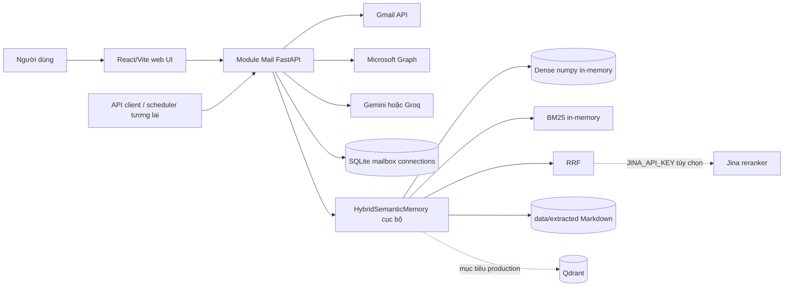
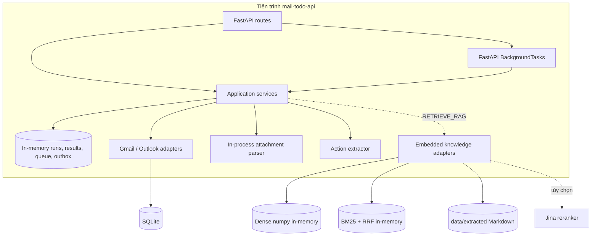
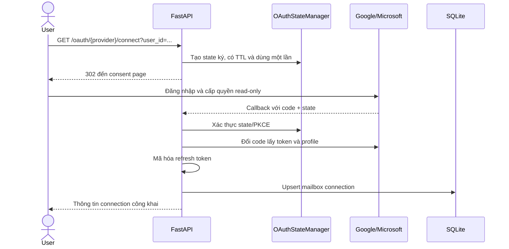
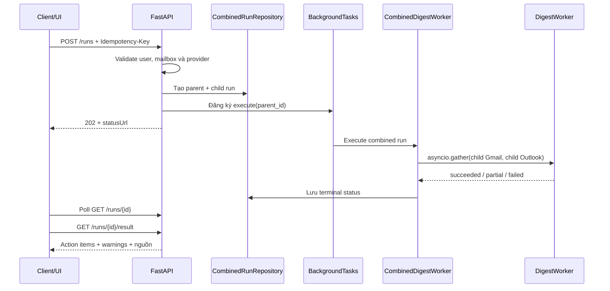
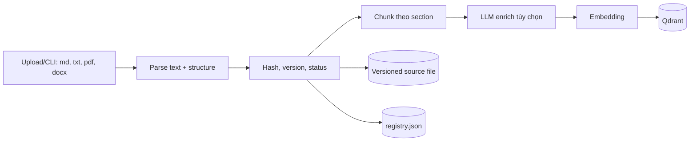
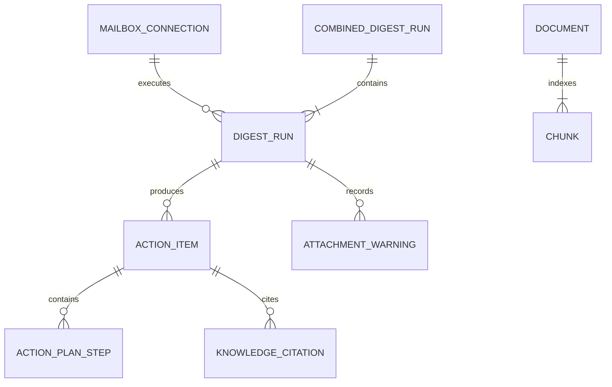

# Kiến trúc hệ thống Module Mail

> Trạng thái tài liệu: mô tả kiến trúc **đang được hiện thực trong mã nguồn** tại ngày 2026-08-09.
> Các nội dung thuộc kiến trúc đích nhưng chưa được nối vào runtime hiện tại được ghi rõ là “định hướng production”.

## 1. Mục tiêu và phạm vi

Module Mail chuyển email chưa đọc từ Gmail và Outlook/Microsoft 365 thành danh sách công việc có cấu trúc. Hệ thống có thể dùng kho tài liệu quy trình nội bộ (Company Knowledge RAG) để tạo kế hoạch hành động có trích dẫn.

Hệ thống hiện thực các khả năng chính:

- Kết nối Gmail và Outlook qua OAuth, chỉ xin quyền đọc.
- Quét đồng thời tối đa một mailbox cho mỗi provider trong một combined run.
- Đọc email chưa đọc, lấy ngữ cảnh thread và file đính kèm.
- Dùng Gemini hoặc Groq để phân loại email và trích xuất action item có cấu trúc.
- Chuẩn hóa ưu tiên, deadline, bằng chứng và chống trùng lặp trong phạm vi dữ liệu kết quả hiện có.
- Truy hồi quy trình nội bộ bằng hybrid search cục bộ (dense in-memory + BM25 + RRF), với Jina reranking tùy chọn, rồi cung cấp context/citation cho final generator.
- Cung cấp REST API cho React web frontend.

Ngoài phạm vi hiện tại:

- Không gửi, sửa, xóa hoặc đánh dấu đã đọc email.
- Không tự động thực thi action plan.
- Chưa có authentication/authorization production cho API.
- Chưa dùng PostgreSQL và durable queue trong runtime API hiện tại.
- Chưa có sandbox/OCR production cho file đính kèm.

## 2. Bối cảnh hệ thống



Điểm vào duy nhất là `cowork_agent.app:create_app` (CLI entry point `mail-todo-api` gọi `cowork_agent.app:main`). FastAPI app này hợp nhất mailbox digest và knowledge chat dưới cùng namespace `/v1/mail-todo`.

## 3. Kiến trúc runtime hiện tại

Runtime local/MVP chạy trong một tiến trình:



Hệ quả vận hành quan trọng:

- API trả `202 Accepted`, sau đó chạy combined worker bằng `BackgroundTasks` trong cùng process.
- Run, child run, kết quả, queue và outbox mất khi process restart.
- Không có worker process độc lập; không có retry bền vững sau crash.
- Chỉ mailbox connection được lưu bền vững trong SQLite.
- Với Gemini, corpus đi kèm repository được load và dense index được dựng in-memory lúc startup. Qdrant chỉ là target production, không được nối vào runtime hiện tại.
- Thiếu `JINA_API_KEY`, timeout, lỗi mạng hoặc response Jina không hợp lệ đều giữ nguyên thứ tự RRF; retrieval không bị chặn bởi reranker.

## 4. Phân lớp và trách nhiệm

Hệ thống áp dụng ports-and-adapters, với dependency hướng vào domain/application.

### 4.1 `domain/`

Chứa mô hình và policy thuần, không phụ thuộc FastAPI, database hoặc SDK provider:

- `MailboxConnection`, `DigestRun`, `CombinedDigestRun`.
- `EmailEnvelope`, `AttachmentRef`, `ExtractedAttachment`.
- `ActionItem`, `ActionPlanStep`, `KnowledgeCitation`, `EvidenceRef`.
- Trạng thái run: `queued`, `running`, `succeeded`, `partial`, `failed`.
- Policy chuẩn hóa query, giới hạn email, tính priority và tạo fingerprint.

### 4.2 `application/` (hiện thực trong `features/email_action_plan/`)

Điều phối use case và định nghĩa port:

- `CreateDigestRun`: tạo child run có idempotency và enqueue qua `QueuePort`.
- `DigestWorker`: thực hiện toàn bộ pipeline của một mailbox.
- `CreateCombinedDigestRun`: tạo parent run và một child run cho từng mailbox.
- `CombinedDigestWorker`: chạy các child worker đồng thời và tổng hợp trạng thái.
- `GetDigestResult` / `GetCombinedDigestResult`: trả kết quả terminal.
- `ports.py`: contract cho mailbox, repository, queue, attachment extractor, LLM, RAG và outbox.

Application layer chỉ biết các protocol; adapter cụ thể được nối tại startup của API.

### 4.3 `infrastructure/` (hiện thực trong `integrations/` & `persistence/`)

Hiện thực các port và tích hợp bên ngoài:

- Gmail OAuth và Gmail API (`integrations/gmail/`).
- Microsoft OAuth và Microsoft Graph (định hướng production).
- Router chọn mailbox adapter theo provider đã lưu trong connection.
- Gemini/Groq/Faucet action extractor (`integrations/llm/`).
- Parser attachment trong process.
- SQLite repository cho mailbox connection và task (`persistence/`).
- Repository, queue và outbox in-memory cho local runtime/test.
- Adapter nối mail pipeline với knowledge retrieval và grounded plan generation (`integrations/rag/`).
- Mã hóa refresh token và ký OAuth state.

### 4.4 `api/` và `app.py`

Chứa FastAPI composition root và HTTP adapter:

- Nạp cấu hình từ environment trong lifespan (`app.py` là entry point duy nhất).
- Khởi tạo repository, provider adapter, worker và knowledge runtime.
- Validate ownership theo `user_id`, payload, provider và trạng thái run.
- Chuyển domain object thành JSON response.
- Chỉ trả thông báo lỗi đã được đánh dấu an toàn.

### 4.5 `knowledge/` (hiện thực trong `integrations/rag/`)

Là bounded context cho Company Knowledge RAG:

- `knowledge_base.py`: load và chunk corpus Markdown tĩnh trong `data/extracted/*.md`.
- `memory.py`: `InRepoSemanticMemory`, dense cosine search bằng numpy trên embedding Gemini.
- `bm25.py`: lexical search in-memory; tenant ACL được áp dụng trước khi tính document statistics và score.
- `rrf.py`: Reciprocal Rank Fusion với thứ tự xác định khi đồng điểm.
- `hybrid.py`: `HybridSemanticMemory` điều phối ACL gate → dense/BM25 candidate retrieval → RRF → optional rerank → final top-k.
- `jina_reranker.py`: boundary Jina tùy chọn; không có key hoặc bất kỳ lỗi/response không hợp lệ nào đều pass-through, không log query hay credential.
- `null_memory.py`: structured no-results fallback khi semantic memory không thể khởi tạo.

Qdrant, document upload/ingestion API, registry ghi động, OCR và knowledge chat là **định hướng production**, không phải module đang được nối vào runtime hiện tại.

### 4.6 `frontend/`

React/Vite là giao diện web độc lập, không chứa business logic. UI gọi REST API để:

- Kết nối/chọn tài khoản Gmail và Outlook.
- Tạo combined run và poll trạng thái.
- Hiển thị action item, action plan, nguồn mail và citation quy trình.

## 5. Luồng xử lý chính

### 5.1 Kết nối mailbox qua OAuth



Gmail chỉ cho phép scope read-only. Outlook dùng delegated `Mail.Read`. Refresh token được mã hóa bằng Fernet trước khi ghi SQLite; client secret, token và khóa API không được đưa vào response.

### 5.2 Combined digest run



Một request nhận tối đa hai connection ID và chỉ cho phép một connection cho mỗi provider. Khi chỉ có một provider, run vẫn hợp lệ và trả danh sách provider còn thiếu. Nếu một provider lỗi nhưng provider kia thành công, parent run là `partial` và giữ kết quả thành công.

### 5.3 Pipeline của một mailbox

`DigestWorker` thực hiện theo thứ tự:

1. Claim run: `queued -> running`; claim giúp tránh xử lý lặp trong cùng repository.
2. Tìm email theo filter cố định `unread_inbox`/`is:unread in:inbox`, có phân trang và giới hạn.
3. Lấy toàn bộ thread cho các email khớp để LLM có ngữ cảnh liên quan. Lịch sử thread không làm tăng bộ đếm giới hạn email chưa đọc.
4. Tải và parse attachment trong giới hạn kích thước/ký tự.
5. Gửi từng batch thread vào Gemini hoặc Groq để nhận structured output.
6. Bỏ email không actionable; bỏ action không có evidence hoặc có confidence thấp.
7. Tính fingerprint, loại trùng trong run và xác định `new`/`seen` từ result repository.
8. Tính priority bằng policy xác định dựa trên deadline, required/blocker và impact.
9. Correlate task candidate và resolve route; chỉ `RETRIEVE_RAG` gọi `SemanticMemoryPort`, còn `DIRECT_PLAN` thực hiện zero retrieval.
10. Gọi final generator đúng một lần cho mỗi candidate không phải `NO_ACTION`, với retrieval context nếu có; sau đó validate và lưu task/warning/counters.
11. Ghi completion event vào outbox và chuyển run thành terminal state.

Attachment hoặc RAG lỗi cục bộ làm run thành `partial` nhưng vẫn giữ action item có thể sử dụng. Lỗi toàn pipeline làm run `failed`; exception nội bộ không được trả nguyên văn qua API.

### 5.4 Ingest tài liệu knowledge

> **Target-only:** sơ đồ dưới đây mô tả pipeline ingestion production chưa được nối. Runtime hiện tại chỉ load corpus Markdown đã commit từ `data/extracted/*.md` lúc startup; không có upload/reindex endpoint hoặc Qdrant write path.



- Tài liệu cùng source/content được nhận diện bằng hash; reindex tạo lại index theo version.
- PDF scan không có text được đánh dấu `needs_ocr`; hệ thống hiện chưa OCR.
- Raw email và attachment **không** được đưa vào knowledge index.
- Corpus dùng cho mail pipeline hiện là corpus toàn công ty; `user_id` chưa được dùng để filter retrieval.

### 5.5 Hybrid retrieval và grounded action plan

1. `HybridSemanticMemory` kiểm tra tenant-visible chunks trước mọi query embedding hoặc lexical scoring.
2. Trên tập dữ liệu được ACL cho phép, `InRepoSemanticMemory` thực hiện dense cosine search in-memory và `BM25SearchAdapter` thực hiện lexical ranking.
3. `ReciprocalRankFusion` hợp nhất hai ranked list bằng RRF (`k=60`) với tie-break xác định.
4. Candidate pool được giới hạn; `JinaRerankerAdapter` chỉ gọi Jina khi có `JINA_API_KEY`.
5. Thiếu key hoặc Jina timeout/network/schema/validation failure giữ nguyên toàn bộ thứ tự RRF.
6. Chỉ sau fusion/rerank mới áp dụng final top-k và trả `SemanticRetrievalResponse` cho generator.

Đây là retrieval-only RAG. `HybridSemanticMemory` không sinh answer/action plan và không lưu raw email; Agent Core dùng các chunk được trả về trong lần gọi final generator duy nhất của candidate.

## 6. Dữ liệu và lưu trữ

| Dữ liệu | Runtime hiện tại | Độ bền | Ghi chú |
|---|---|---:|---|
| Mailbox connection | SQLite tại `.data/mail_todo.db` (`SQLiteMailboxConnectionRepository`) | Có | Refresh token đã mã hóa |
| Combined/child run | `InMemoryRunRepository` (hoặc `PostgresRunRepository` khi có `DATABASE_URL`) | Không / Có | Mất khi restart nếu dùng In-Memory |
| Queue/background job | FastAPI `BackgroundTasks` hoặc `RedisRunQueue` khi có `REDIS_URL` | Không / Có | Xử lý bất đồng bộ |
| Action item, warning, processed metadata | `InMemoryResultRepository` và `SQLiteTaskRepository` (`.data/tasks.db`) hoặc `PostgresTaskRepository` | Có (task trong SQLite/Postgres) | Không lưu raw email body |
| Completion event | `InMemoryOutbox` hoặc `PostgresOutboxRepository` | Có khi dùng Postgres | — |
| Knowledge source files | `data/extracted/*.md` (corpus đi kèm repository; định hướng: `.data/rag/uploads`) | Có | Load lúc startup qua `load_corpus()` |
| Knowledge registry | định hướng production: `.data/rag/registry.json` | định hướng | Atomic replace trong một process |
| Knowledge chunks/vectors | `HybridSemanticMemory`: dense numpy + BM25 + RRF in-memory; Qdrant là target production | Không | Dùng `GeminiEmbeddingAdapter`; optional Jina chỉ rerank candidate đã ACL-filter |
| Evaluation artifacts | Filesystem | Có | Phục vụ benchmark, không thuộc request path |

Migration `src/cowork_agent/persistence/migrations/001_mail_todo.sql` định nghĩa schema PostgreSQL cho `mailbox_connections`, `digest_runs`, `tasks`, `task_run_links` và `outbox_events`. `cowork_agent.app` khởi tạo PostgreSQL adapter khi `DATABASE_URL` được thiết lập.

Các quan hệ domain chính:



`CombinedDigestRun` hiện là model/runtime in-memory và chưa có bảng tương ứng trong migration PostgreSQL hiện tại.

## 7. API surface hiện tại

### Mailbox và digest

| Method | Endpoint | Vai trò |
|---|---|---|
| `GET` | `/health` | Liveness của API |
| `GET` | `/v1/mail-todo/oauth/gmail/connect` | Bắt đầu Gmail OAuth |
| `GET` | `/v1/mail-todo/oauth/gmail/callback` | Hoàn tất Gmail OAuth |
| `GET` | `/v1/mail-todo/oauth/outlook/connect` | Bắt đầu Microsoft OAuth (định hướng production) |
| `GET` | `/v1/mail-todo/oauth/outlook/callback` | Hoàn tất Microsoft OAuth (định hướng production) |
| `GET` | `/v1/mail-todo/connections` | Liệt kê connection của user |
| `DELETE` | `/v1/mail-todo/connections/{connection_id}` | Xóa connection của user |
| `GET` | `/v1/mail-todo/connections/{connection_id}/unread-preview` | Kiểm tra email chưa đọc |
| `POST` | `/v1/mail-todo/runs` | Tạo combined run |
| `GET` | `/v1/mail-todo/runs/{run_id}` | Poll trạng thái/progress |
| `GET` | `/v1/mail-todo/runs/{run_id}/result` | Lấy kết quả terminal |
| `GET` | `/v1/mail-todo/runs/{run_id}/tasks` | Lấy danh sách task của run |

### Knowledge API (định hướng production, chưa được nối)

Runtime hiện tại không expose knowledge upload/chat/readiness endpoint. Bảng dưới đây là target API surface, không phải route hiện có trong `create_app()`.

| Method | Endpoint | Vai trò |
|---|---|---|
| `GET` | `/v1/mail-todo/knowledge/ready` | Readiness của RAG |
| `POST` | `/v1/mail-todo/knowledge/documents` | Upload và index tài liệu |
| `GET` | `/v1/mail-todo/knowledge/documents` | Liệt kê tài liệu |
| `GET` | `/v1/mail-todo/knowledge/documents/{id}` | Xem metadata tài liệu |
| `POST` | `/v1/mail-todo/knowledge/documents/{id}/reindex` | Reindex tài liệu |
| `POST` | `/v1/mail-todo/knowledge/chat` | Hỏi đáp grounded trên cùng knowledge runtime |

Tất cả endpoint knowledge và mailbox cùng xuất hiện trong OpenAPI/Swagger của `mail-todo-api`. Mail action-plan generation, document API và chat API tham chiếu cùng một `KnowledgeRuntime`; không còn namespace ngắn hoặc RAG app độc lập.

## 8. Tích hợp và cấu hình

Cấu hình được nạp từ môi trường qua các lớp dataclass riêng biệt trong `config.py` (`GmailSettings`, `GeminiSettings`, `GroqSettings`, `FaucetSettings`) và các hàm helper (`database_url`, `redis_url`). Bên trong vẫn giữ các nhóm settings có kiểu riêng để mỗi adapter chỉ nhận đúng phần cấu hình cần thiết:

- Mailbox: `GMAIL_*` (`GMAIL_CLIENT_ID`, `GMAIL_CLIENT_SECRET`, `GMAIL_REDIRECT_URI`, `GMAIL_SCOPES`, `GMAIL_CONNECTION_DB_PATH`); `MICROSOFT_*` cho Outlook (định hướng production).
- Security: `TOKEN_ENCRYPTION_KEY`, `OAUTH_STATE_SECRET`, `OAUTH_STATE_TTL_SECONDS`.
- Action extraction: `LLM_PROVIDER=gemini|groq|faucet`, `GEMINI_*`, `GROQ_*` hoặc `FAUCET_*`.
- Knowledge hiện tại: corpus cố định `data/extracted/*.md`, Gemini embedding, dense numpy, BM25 và RRF in-memory; không cần `RAG_ENABLED` hay Qdrant config.
- Reranking: `JINA_API_KEY` là optional. Blank/missing hoặc lỗi Jina làm adapter pass-through và bảo toàn thứ tự RRF.
- Knowledge target-only: Qdrant URL/collection/vector size, ingestion limits, OpenRouter/OpenAI generation, Jina embedding và Langfuse.
- Observability: `DEV_TRACE_ENABLED`, `DEV_TRACE_SINK`; Langfuse credentials (định hướng production).
- Runtime/Storage: `APP_ENV`, `APP_HOST`, `APP_PORT`, `DATABASE_URL` (PostgreSQL), `REDIS_URL` (Redis queue).

Gemini action extractor hỗ trợ nhiều API key, round-robin và đổi key khi gặp rate limit. Knowledge provider dùng primary/fallback router cho lỗi tạm thời; key pool có cooldown. Giá trị secret phải nằm trong environment hoặc secret manager, không commit vào repository.

## 9. Bảo mật và riêng tư

Các kiểm soát đã có:

- Gmail và Outlook chỉ dùng quyền đọc.
- OAuth dùng state được ký, có hạn sử dụng, one-time validation và PKCE trong luồng provider.
- Refresh token được mã hóa trước khi lưu.
- Provider router chỉ hoạt động với connection `active`.
- API kiểm tra connection/run thuộc `user_id` được yêu cầu.
- Error response chỉ trả mã/thông báo an toàn; không phát tán exception, token hay nội dung email.
- Prompt structured output không cấp tool cho model; citation của procedure được kiểm tra lại sau generation.
- Tracing mặc định theo metadata; full/sensitive tracing cần opt-in rõ ràng.

Khoảng trống cần xử lý trước production:

- `user_id` đang lấy từ query string, chưa được ràng buộc với session/JWT đáng tin cậy.
- Các endpoint upload/list knowledge chưa có authorization theo tenant/role.
- Corpus knowledge của mail pipeline là company-wide, chưa cách ly workspace/user.
- Attachment parser chạy trong process API, chưa sandbox, antivirus, timeout riêng hoặc OCR.
- Secret hiện đọc trực tiếp từ environment; cần secret manager và quy trình rotation production.
- Filesystem registry phù hợp single process, chưa an toàn cho nhiều replica cùng ghi.

## 10. Khả năng chịu lỗi và tính nhất quán

- Idempotency key ngăn tạo lặp run trong repository hiện tại.
- Claim transition ngăn cùng child run bị xử lý đồng thời trong một process.
- Gmail và Outlook child worker chạy đồng thời; lỗi một nhánh không hủy kết quả nhánh còn lại.
- Attachment lỗi và RAG lỗi được hạ cấp thành `partial` khi vẫn còn kết quả hữu ích.
- Fingerprint ổn định giúp đánh dấu action `new` hoặc `seen` trong phạm vi result repository.
- Provider có timeout, giới hạn batch, retry/key rotation tùy adapter.

Giới hạn: các bảo đảm idempotency, claim, dedupe và outbox hiện không tồn tại qua restart vì repository là in-memory. Chúng cũng chưa cung cấp khóa phân tán giữa nhiều API replica.

## 11. Quan sát, đánh giá và kiểm thử

- Logging tiêu chuẩn ghi lỗi backend; response không lộ chi tiết nhạy cảm.
- Knowledge tracing hỗ trợ Langfuse với `metadata_only` mặc định và flush khi shutdown/CLI kết thúc.
- Evaluation subsystem có golden set theo nhóm direct lookup, multi-hop, ambiguous, adversarial và unanswerable.
- Metric bao gồm retrieval/generation score, aggregate/segment và RAGAS tùy chọn.
- Test suite chia thành unit, component và integration; external provider được thay bằng fake trong phần lớn pipeline test.
- Quality gates được cấu hình cho Ruff, mypy strict, pytest và wheel build.


## 13. Bản đồ mã nguồn

```text
src/cowork_agent/
├── api/                 # HTTP handlers và serializers
├── domain/              # Entity/value object/policy thuần
├── features/            # Feature workflows và ports (email_action_plan)
├── integrations/        # External integration adapters (gmail, llm, rag)
├── orchestration/       # Task execution, queue management, worker
├── persistence/         # Repositories, migrations (SQLite, Postgres)
├── app.py               # FastAPI composition root và main runner
├── config.py            # Environment configuration settings
├── identity.py          # Tenant and principal utilities
└── __init__.py          # Public package surface

docs/adr/                # Quyết định kiến trúc
tests/                   # Unit, component, integration
scripts/                 # Launcher/utility scripts
frontend/                # React/Vite web application
```

## 14. Tài liệu liên quan

- `README.md`: cách cài đặt, cấu hình và chạy local.
- `docs/product_requirements.md`: yêu cầu sản phẩm.
- `docs/technical_spec.md`: contract và thiết kế kỹ thuật chi tiết.
- `docs/adr/ADR-001-async-pipeline-and-adapters.md`: pipeline bất đồng bộ và ports/adapters.
- `docs/adr/ADR-002-sandboxed-attachment-extraction.md`: định hướng sandbox attachment.
- `migrations/001_mail_todo.sql`: PostgreSQL schema đích hiện có.
