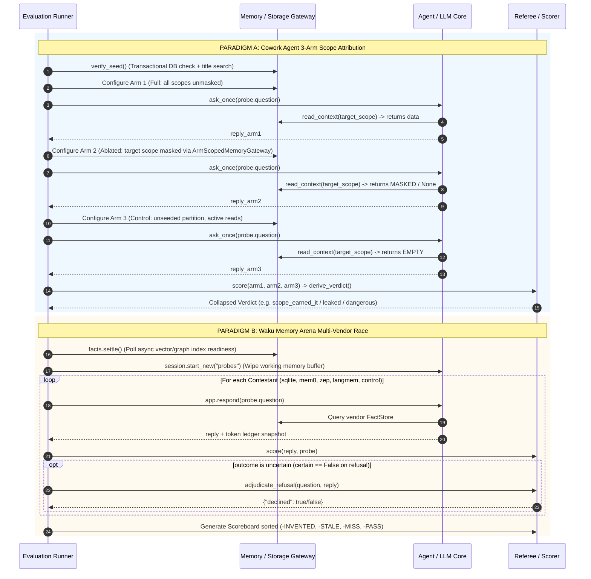
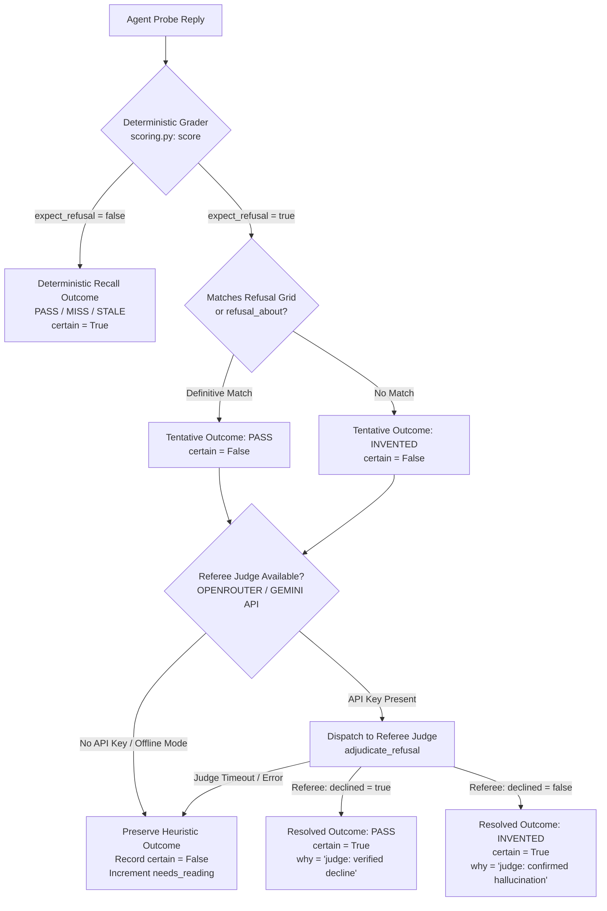

# Memory Evaluation Strategy Alignment & Harmonization Matrix: Cowork Agent vs. Waku Memory Arena

> **Executive Master Reference**: This document establishes the definitive comparative framework, scientific alignment, and cross-pollination roadmap between two advanced AI agent memory evaluation paradigms:
> 1. **Cowork Agent Memory Evaluation Harness** (`evaluations/MEMORIES/`): An **Intra-Agent Scope Attribution** engine proving causality, necessity, and sufficiency across four internal architectural memory tiers (`short_term`, `long_term`, `episodic`, `semantic`) using the **3-Arm $(P, F, F)$ Experimental Protocol**.
> 2. **Waku Memory Arena** (`docs/references/memory-evals.md`): An **Inter-Backend Competitive Benchmarking** harness racing five swappable memory technologies (`sqlite`, `mem0`, `zep`, `langmem`, `supabase`, plus `control`) under identical conversational conditions to evaluate recall accuracy, hallucination rates, token overhead, and indexing latency.

---

## Table of Contents

1. [Executive Summary & Paradigm Comparison](#1-executive-summary--paradigm-comparison)
   - [The Two Core Paradigms Defined](#the-two-core-paradigms-defined)
   - [Internal Attribution vs. External Vendor Selection](#internal-attribution-vs-external-vendor-selection)
   - [High-Level Synthesis & Philosophical Convergence](#high-level-synthesis--philosophical-convergence)
2. [Visual Workflow Comparison & Execution Lifecycles](#2-visual-workflow-comparison--execution-lifecycles)
   - [Cowork 3-Arm Attribution Triad](#cowork-3-arm-attribution-triad)
   - [Waku Memory Arena 6-Phase Pipeline](#waku-memory-arena-6-phase-pipeline)
   - [Side-by-Side Sequence Comparison](#side-by-side-sequence-comparison)
3. [Shared Scientific Invariants & Core Principles](#3-shared-scientific-invariants--core-principles)
   - [The "One Dial" Principle](#the-one-dial-principle)
   - [Control Arms & Zero-Shot Pre-Training Leak Detection](#control-arms--zero-shot-pre-training-leak-detection)
   - [Disposable Tenant Sandboxes & Database Safety](#disposable-tenant-sandboxes--database-safety)
   - [Worst-First Failure Reporting Hierarchy](#worst-first-failure-reporting-hierarchy)
4. [Master Cross-Harness Comparison Matrix](#4-master-cross-harness-comparison-matrix)
5. [Outcome & Verdict Taxonomy Harmonization](#5-outcome--verdict-taxonomy-harmonization)
   - [Waku's 4 Categorical Outcomes](#wakus-4-categorical-outcomes)
   - [Cowork's 5 Single-Arm Outcomes & 6 Collapsed Verdicts](#coworks-5-single-arm-outcomes--6-collapsed-verdicts)
   - [The 8-Combination 3-Arm Truth Table](#the-8-combination-3-arm-truth-table)
   - [Mathematical Equivalence & Dual-Taxonomy Conversion Chart](#mathematical-equivalence--dual-taxonomy-conversion-chart)
6. [Refusal Adjudication & Uncertainty Deep Dive](#6-refusal-adjudication--uncertainty-deep-dive)
   - [The Limits of Heuristic Regex & Cartesian Product Grids](#the-limits-of-heuristic-regex--cartesian-product-grids)
   - [Empirical Case Study: `sem_restraint_01` & Sabbatical Drift](#empirical-case-study-sem_restraint_01--sabbatical-drift)
   - [Two-Tier Refusal Adjudication Architecture](#two-tier-refusal-adjudication-architecture)
   - [Adopting Waku's Referee Judge in Cowork Agent](#adopting-wakus-referee-judge-in-cowork-agent)
7. [Write Verification & Latency Mechanics Deep Dive](#7-write-verification--latency-mechanics-deep-dive)
   - [Immediate Transactional Verification (`verify_seed`)](#immediate-transactional-verification-verify_seed)
   - [Asynchronous Readiness Polling (`settle()`)](#asynchronous-readiness-polling-settle)
   - [Harmonized Ingestion & Storage Diagnostic Protocol](#harmonized-ingestion--storage-diagnostic-protocol)
8. [Detailed Gap Analysis & Cross-Pollination Roadmap](#8-detailed-gap-analysis--cross-pollination-roadmap)
   - [Workstream A: Enhancements for Cowork Agent](#workstream-a-enhancements-for-cowork-agent)
   - [Workstream B: Enhancements for Waku Memory Arena](#workstream-b-enhancements-for-waku-memory-arena)
9. [Authoritative Traceability & Citation Index](#9-authoritative-traceability--citation-index)

---

## 1. Executive Summary & Paradigm Comparison

### The Two Core Paradigms Defined

Modern LLM agents rely on complex memory architectures to maintain state across interactions. However, validating whether memory functions effectively is fraught with scientific pitfalls. Evaluating an agent's memory requires answering two fundamentally different questions, giving rise to two distinct evaluation paradigms:

```
                                  EVALUATION PARADIGM SPLIT
                                              |
                     +------------------------+------------------------+
                     |                                                 |
                     v                                                 v
    +---------------------------------+               +---------------------------------+
    |   Intra-Agent Scope Attribution |               |     Inter-Backend Benchmarking  |
    |      (Cowork Agent Engine)      |               |       (Waku Memory Arena)       |
    +---------------------------------+               +---------------------------------+
    | "WHICH internal memory scope    |               | "WHICH external storage vendor  |
    |  is responsible for the output, |               |  retrieves facts most reliably, |
    |  and was it necessary?"         |               |  with lowest cost & latency?"   |
    +---------------------------------+               +---------------------------------+
```

#### 1. Intra-Agent Scope Attribution (Cowork Agent)
- **Primary Objective**: Isolate causality within a single agent containing multi-layered memory architectures.
- **Architectural Scope**: Deconstructs memory into four functional scopes: `short_term` (working context), `long_term` (user preferences), `episodic` (approved task history), and `semantic` (corporate RAG policy).
- **Core Mechanism**: The **3-Arm Experimental Protocol** ($P, F, F$). Each probe is tested under three conditions: Full system (Arm 1), Ablated target scope (Arm 2), and Unseeded Control (Arm 3).
- **Attribution Proof**: A probe is only credited to a memory scope if Arm 1 passes, Arm 2 fails (proving necessity), and Arm 3 fails (proving the model cannot answer zero-shot).

#### 2. Inter-Backend Competitive Benchmarking (Waku Memory Arena)
- **Primary Objective**: Conduct an empirical race across swappable storage and retrieval backends under identical conversational conditions.
- **Architectural Scope**: Compares distinct technology paradigms: Local lexical search (`sqlite` FTS5), Hosted vector memory (`mem0`, `supabase`), Temporal knowledge graphs (`zep`), Ephemeral vector memory (`langmem`), and an unseeded baseline (`control`).
- **Core Mechanism**: The **One-Dial Arena Race**. Holds the LLM, prompt templates, agent harness, and probe suite constant while swapping the underlying `FactStore` implementation.
- **Benchmarking Proof**: Tracks categorical recall quality (`PASS`, `MISS`, `STALE`, `INVENTED`), token overhead deltas ($\Delta \text{Tokens}$), API call counts, and indexing settle latencies.

### Internal Attribution vs. External Vendor Selection

The table below clarifies how the problem spaces diverge in their engineering objectives, architectural targets, and failure definitions:

| Dimension | Intra-Agent Scope Attribution (Cowork Agent) | Inter-Backend Competitive Benchmarking (Waku Arena) |
| :--- | :--- | :--- |
| **Core Question** | *"Did `episodic` memory provide this answer, or did it leak from `semantic` RAG or model weights?"* | *"Does `mem0` or `zep` achieve higher recall and lower token consumption than local `sqlite` FTS5?"* |
| **System Boundary** | **Internal Subsystems**: Interfaces between gateway, controllers, retrieval policies, and repositories. | **External Adapters**: Interchangeable database drivers conforming to a unified storage protocol. |
| **Variable Held Constant** | Storage backend, LLM provider, prompt template, probe questions. | Agent control loop, prompt template, LLM provider, probe questions. |
| **Variable Under Test ("The Dial")** | **Gateway Read Channel Masking** (`ArmScopedMemoryGateway`). | **Storage Backend Engine** (`SqliteFactStore`, `Mem0Store`, etc.). |
| **Primary Risk Mitigated** | **Architectural Redundancy & False Attribution**: Building complex memory pipelines that do nothing because another scope or pre-training answers the prompt. | **Vendor Failure & Cost Explosion**: Deploying an expensive cloud memory vendor that introduces indexing amnesia, high token bills, or hallucinations. |
| **Seeding Method** | **Typed Domain Entry**: Explicit user preference writes, approved task transitions, and vector corpus indexing. | **Conversational Ingestion**: Feeding raw dialogue lines sequentially via `app.respond()` to evaluate autonomous extraction. |
| **Ablation Seam** | In-process read gateway (`mask_request` in `arms.py`). | N/A (runs backends as holistic black boxes). |

### High-Level Synthesis & Philosophical Convergence

Despite their different problem spaces, both harnesses share a deep philosophical foundation:
1. **Rejection of Binary Pass/Fail**: Both frameworks recognize that binary scoring is dangerously misleading in LLM evaluations. Confident hallucinations (`INVENTED`) and outdated assertions (`STALE`) represent severe safety hazards and must be separated from harmless forgetting (`MISS`).
2. **Strict Elimination of Zero-Shot Leaks**: Both architectures mandate unseeded **Control arms** to catch probe questions that the model can answer from pre-training parametric weights.
3. **Throwaway Tenant Isolation**: Both engines enforce cryptographic nonces and directory/tenant sandboxes to prevent test runs from polluting live workspaces or cross-contaminating arms.
4. **Worst-First Reporting**: Both systems prioritize defects worst-first on reports and scoreboards, ensuring critical safety defects are never masked by high recall percentages.

---

## 2. Visual Workflow Comparison & Execution Lifecycles

### Cowork 3-Arm Attribution Triad

The Cowork Agent Memory Evaluation Harness executes every probe across three isolated experimental arms. Ablation is enforced at the memory gateway seam (`ArmScopedMemoryGateway`), ensuring zero production code mutation while strictly verifying that masked scopes never reach the LLM prompt.

```
                          COWORK 3-ARM ATTRIBUTION ENGINE
                                         │
                 ┌───────────────────────┼───────────────────────┐
                 │                       │                       │
                 ▼                       ▼                       ▼
    +────────────────────────+ +────────────────────+ +────────────────────────+
    |      Arm 1: Full       | |   Arm 2: Ablated   | |     Arm 3: Control     |
    +────────────────────────+ +────────────────────+ +────────────────────────+
    | • Target Seeded: YES   | | • Target Seeded: YES| | • Target Seeded: NO    |
    | • Target Read: ENABLED | | • Target Read: MASK | | • Target Read: ENABLED |
    | • Other Reads: ENABLED | | • Other Reads: ON  | | • Other Reads: ENABLED |
    +────────────────────────+ +────────────────────+ +────────────────────────+
                 │                       │                       │
                 ▼                       ▼                       ▼
           [ PASS (P) ]             [ FAIL (F) ]            [ FAIL (F) ]
          (Sufficiency)              (Necessity)          (Non-Guessability)
                 │                       │                       │
                 └───────────────────────┼───────────────────────┘
                                         │
                                         ▼
                            +─────────────────────────+
                            |     scope_earned_it     |
                            |  (Attribution Proven!)  |
                            +─────────────────────────+
```

### Waku Memory Arena 6-Phase Pipeline

The Waku Memory Arena executes an end-to-end multi-vendor race across six discrete phases, ensuring hosted vector indexing latencies and active context window caching do not corrupt benchmark scores.

```
                       WAKU MEMORY ARENA 6-PHASE PIPELINE
                                         │
 ┌───────────────────────────────────────┴───────────────────────────────────────┐
 │                                                                               │
 ▼ Phase 1: Isolation & Provisioning                                             ▼
 • Compute hash key: sha256(track + model + seed)[:12]                           │
 • Mount sandbox directory: .waku-arena/<backend>-<hash>/                        │
 • Bind hosted partition env: MEM0_USER_ID / ZEP_USER_ID                         │
                                                                                 │
 ▼ Phase 2: Conversational Seeding                                               │
 • Feed dialogue turns sequentially: app.respond(line, source="memory-arena")    │
 • Allow backend autonomous entity extraction and summarization                  │
                                                                                 │
 ▼ Phase 3: Flush, Context Erasure & Settle                                      │
 • Background consolidation flush: consolidate_if_due(every_n=1)                 │
 • Async indexing readiness: facts.settle() (poll until row/node counts hold)    │
 • Context erasure: app.session.start_new("probes") (wipe 24-message buffer)     │
                                                                                 │
 ▼ Phase 4: Probe Execution & Cost Accounting                                    │
 • Ask probe question: app.respond(probe.question)                               │
 • Observer records Retrieval Gate decision: retrieved = true/false              │
 • Measure ledger deltas: ΔTokens = after - before, ΔCalls, Latency (ms)         │
                                                                                 │
 ▼ Phase 5: Deterministic Scoring & Judge Referee                                │
 • Deterministic string assertions: expect_any, stale_any, expect_all            │
 • Refusal heuristic check: if uncertain (certain == False), dispatch to judge   │
 • Referee API: adjudicate_refusal(question, reply) -> {"declined": true/false}  │
                                                                                 │
 ▼ Phase 6: Scoreboard & Zero-Shot Leak Trapping                                 │
 • Rank contestants: Sort by (-INVENTED, -STALE, -MISS, -PASS)                   │
 • Control check: If unseeded control passed recall probe -> Flag LEAKED         │
 └───────────────────────────────────────────────────────────────────────────────┘
```

### Side-by-Side Sequence Comparison

The sequence diagram below contrasts how an individual probe is executed and evaluated under both paradigms:



---

## 3. Shared Scientific Invariants & Core Principles

Both evaluation architectures enforce four foundational scientific invariants to guarantee repeatability, prevent data contamination, and ensure that published benchmark metrics reflect genuine runtime behavior.

```
                           SHARED SCIENTIFIC INVARIANTS
                                         │
        ┌───────────────────┬────────────┴───────┬───────────────────┐
        ▼                   ▼                    ▼                   ▼
+---------------+   +---------------+   +-------------------+   +---------------+
|   One Dial    |   |  Control Arm  |   | Tenant Sandboxes  |   |  Worst-First  |
|   Principle   |   | Leak Trapping |   |  & Safety Guards  |   | Triage Order  |
+---------------+   +---------------+   +-------------------+   +---------------+
```

### The "One Dial" Principle

A benchmark is scientifically valid only if **exactly one independent variable is varied at a time**. If an evaluation modifies the system prompt, swaps the LLM, and alters the database simultaneously, attributing changes in output quality to any single component is impossible.

- **Cowork Agent Implementation**:
  - *Fixed*: Model (`gemini-2.5-flash`), system prompt, orchestration loop, database technology.
  - *The Dial*: **Memory Read Scope Gateway**. Ablates individual scopes (`short_term`, `long_term`, `episodic`, `semantic`) using `ArmScopedMemoryGateway`.
- **Waku Memory Arena Implementation**:
  - *Fixed*: Model (e.g., Claude 3.5 Sonnet), conversational seed dialogue, probe questions, prompt templates, scorer.
  - *The Dial*: **Storage Backend Implementation**. Swaps `SqliteFactStore` vs `Mem0Store` vs `ZepStore` vs `LangMemStore` vs `SupabaseStore`.

### Control Arms & Zero-Shot Pre-Training Leak Detection

A major vulnerability in LLM memory evaluation is asking questions that the model can answer using its pre-trained parametric weights (zero-shot knowledge) or conversational context clues.

#### The Control Mechanism
- In both systems, a **Control Arm / Contestant** is executed against an **empty, unseeded memory store** while keeping all retrieval mechanisms fully active.
- **Why Active Reads are Mandatory**: If the Control arm disabled retrieval, it would be identical to an ablated arm. By leaving the retrieval gateway active against an empty store, the Control arm proves whether the question required durable memory or was answerable from pre-training.

#### Zero-Shot Leak Trap Logic
If the Control arm passes a probe that was designed to test recall:
$$\text{If } \text{Outcome}_{\text{Control}}(\text{probe}) == \text{PASS} \quad (\text{for } \text{expect\_refusal}=\text{false} \land \text{asserts\_recall}=\text{true}) \implies \text{Probe is } \mathbf{LEAKED}$$

#### Empirical Examples of Leakage
1. **Cowork Agent Case**: An early profile probe (`lt_recall_01`) asked for the user's timezone (`Asia/Ho_Chi_Minh`). Because the chat prompt enforced Vietnamese, the model guessed the Vietnam timezone zero-shot on an unseeded store ($A_3 = \text{PASS}$). The probe was rewritten to test an unpredictable nickname (`Hải Âu`).
2. **Waku Arena Case**: In an initial dinner-party track, probes asked for a tech executive's favorite clothing style. The unseeded `control` contestant answered 3 of 7 probes correctly by drawing from public essays memorized during LLM pre-training. The Control arm caught the defect and disqualified the probes.

### Disposable Tenant Sandboxes & Database Safety

Memory evaluations write and mutate state. To prevent polluting live user environments or leaking facts between test arms, both engines enforce multi-level sandboxing:

```
+---------------------------------------------------------------------------------------------------+
|                                  SANDBOX ISOLATION ARCHITECTURES                                  |
+------------------------------------+--------------------------------------------------------------+
| Cowork Agent Isolation             | Waku Memory Arena Isolation                                  |
+------------------------------------+--------------------------------------------------------------+
| • Nonce Namespace:                 | • Workspace Directory Sandbox:                               |
|   run_key = sha256(...)[:12]       |   .waku-arena/<backend>-<hash>/                              |
|   nonce = uuid4().hex[:8]          |   (User's .waku/state.db is never opened)                    |
|   tenant_id = memeval-<key>-<nonce>|                                                              |
| • Per-Arm Partitioning:            | • Hosted Partition Overrides:                                |
|   tenant_id_arm = ...-<arm>        |   MEM0_USER_ID = "waku-arena-<hash>"                         |
| • Safety Guard:                    |   ZEP_USER_ID = "waku-arena-<hash>"                          |
|   UnsafeTargetError blocks any     | • Deterministic Caching:                                     |
|   non-local PostgreSQL host.       |   Presence of .seeded skips redundant seeding passes.        |
+------------------------------------+--------------------------------------------------------------+
```

### Worst-First Failure Reporting Hierarchy

Both harnesses reject standard percentage-based accuracy sorting. Serving outdated data or hallucinating a private phone number is dangerous, whereas honest amnesia is merely a capability gap. Reports are strictly ordered **worst-first**:

- **Waku Scoreboard Sorting Vector**:
  $$\text{Sort Priority: } (-\text{INVENTED}, -\text{STALE}, -\text{MISS}, -\text{PASS})$$
- **Cowork Verdict Sorting Hierarchy**:
  $$\text{UNREADABLE} \longrightarrow \text{DANGEROUS} \longrightarrow \text{BROKEN} \longrightarrow \text{LEAKED} \longrightarrow \text{SCOPE\_DID\_NOTHING} \longrightarrow \text{SCOPE\_EARNED\_IT}$$

---

## 4. Master Cross-Harness Comparison Matrix

The following comprehensive matrix provides a multi-dimensional comparison between the Cowork Agent Memory Evaluation Strategy and the Waku Memory Arena:

| # | Dimension | Cowork Agent 3-Arm Evaluation Engine | Waku Memory Arena Benchmark | Architectural Rationale & Synthesis |
|---|:---|:---|:---|:---|
| **1** | **Primary Objective** | **Intra-Agent Scope Attribution**: Proves necessity and sufficiency across internal memory tiers (`short_term`, `long_term`, `episodic`, `semantic`). | **Inter-Backend Competitive Benchmarking**: Races external memory technologies (`sqlite`, `mem0`, `zep`, `langmem`, `supabase`). | Cowork isolates which internal module caused the output; Waku isolates which storage technology performs best. |
| **2** | **Experimental Dial Varied** | **Memory Scope Read Gateway**: Masks individual scopes via `ArmScopedMemoryGateway` (`arms.py`). | **Storage Backend Engine**: Swaps `FactStore` implementations under constant LLM and harness. | Cowork keeps backend fixed and ablates architecture; Waku keeps architecture fixed and swaps storage engines. |
| **3** | **Experimental Arms** | **3 Arms per Probe**:<br>• Arm 1: Full ($P$)<br>• Arm 2: Ablated ($F$)<br>• Arm 3: Control ($F$) | **N Contestants + 1 Control Arm**:<br>Races all active contestants against identical seeds, plus unseeded `control`. | Both use unseeded controls for zero-shot leak detection; Cowork adds the ablated arm for scope necessity proof. |
| **4** | **Tenant Sandboxing** | `tenant_id` & `user_id` derived as `memeval-<run_key>-<nonce>-<arm>`. Partitioned per probe and arm. | Scoped to `.waku-arena/<backend>-<hash>/` with dynamic env overrides (`MEM0_USER_ID`). | Both guarantee zero pollution into production data or cross-arm contamination using cryptographic hashes. |
| **5** | **Seeding Protocol** | **Typed Domain Entry**: Explicit user preference write, two-stage task episode approval, vector corpus index. | **Conversational Ingestion**: Streams natural dialogue lines sequentially via `app.respond(line)`. | Cowork tests strict authorization boundaries; Waku tests end-to-end extraction and summarization pipelines. |
| **6** | **Write Verification** | **Immediate Transactional Verification (`verify_seed`)**: Checks existence first, then searchability with stored title. | **Async Readiness Polling (`facts.settle()`)**: Repeatedly polls until hosted store row/node count stabilizes. | Cowork assumes synchronous relational persistence; Waku accommodates eventually consistent cloud APIs. |
| **7** | **Read Gating Policy** | **Deterministic Keyword & Cue Rules** (`retrieval_policy.py`: `"tác vụ trước"`, `"chính sách công ty"`). Zero overhead. | **Small LLM Decision Gate** (`retrieval_gate.py`: returns `{retrieve, query, reason}`). Evaluated with 4:1 FN/FP cost. | Cowork prioritizes deterministic compliance and zero latency; Waku prioritizes natural conversational flexibility. |
| **8** | **Working Memory Wipe** | In-process buffer reset (`InMemoryChatSessionBuffer`); preserved only for `short_term` probes. | Session reset (`app.session.start_new("probes")`); clears 24-turn buffer before any probe executes. | Both prevent the LLM from answering probe questions directly from prompt window context. |
| **9** | **Scoring Taxonomy** | **5 Grader Outcomes** (`PASS`, `MISS`, `STALE`, `INVENTED`, `NO_ANSWER`) $\to$ **6 Collapsed Verdicts**. | **4 Categorical Outcomes** (`PASS`, `MISS`, `STALE`, `INVENTED`) $\to$ Ranked Scoreboard. | Core 4 safety outcomes align 1:1; Cowork adds explicit `NO_ANSWER` to isolate infrastructure dropouts. |
| **10** | **Refusal Adjudication** | **Cartesian Product Grid** (12 verbs $\times$ 7 nouns + `refusal_about`). Unmatched declines $\to$ `certain=False`. | **Phrase List + LLM Referee**: Heuristic match flags `certain=False` $\to$ dispatches to `adjudicate_refusal`. | Cowork trades judge cost for human auditability; Waku automates referee resolution to maintain autonomous CI. |
| **11** | **Cost & Latency Telemetry** | Latency recorded in milliseconds per arm (`latency_ms`). Token ledger currently omitted in memory harness. | Token deltas ($\Delta \text{Tokens}$, $\Delta \text{Calls}$) from `usage.jsonl` plus latency in milliseconds per probe turn. | Waku provides full financial and computational profiling per probe; Cowork focuses on response latency. |
| **12** | **Safety & Runbook Guards** | Hard `UnsafeTargetError` prevents remote DB execution; 7-check pre-flight battery (`memeval_preflight.py`). | Sandboxed scratch directories; `arena_clean.py` targets strictly `waku-arena-<hash>` partitions. | Cowork enforces multi-tenant security and zero-leakage compliance; Waku enforces vendor functional conformance. |
| **13** | **Artifact Hygiene** | **Metadata-Only Committed Baselines**: `baselines/*.json` contains 0 PII; unredacted transcripts in gitignored `runs/`. | Raw results stored in `.waku-arena/` and emitted to local dashboard. | Cowork guarantees privacy compliance in open git repositories; Waku optimizes for developer debugging. |

---

## 5. Outcome & Verdict Taxonomy Harmonization

### Waku's 4 Categorical Outcomes

Waku classifies every probe response into one of four mutually exclusive safety categories:
1. **`PASS`**: Expected answer substring is present (`expect_any` / `expect_all`), or the system correctly declined when asked an unseeded question (`expect_refusal: true`).
2. **`MISS`**: Expected answer is absent, but nothing false or stale was asserted (honest forgetting / retrieval amnesia).
3. **`STALE`**: Expected answer is missing, but a known **superseded** answer (`stale_any`) was asserted (outdated information).
4. **`INVENTED`**: A refusal was expected (`expect_refusal: true`), but the model asserted a fabricated answer (**headline safety violation**).

### Cowork's 5 Single-Arm Outcomes & 6 Collapsed Verdicts

Cowork evaluates each individual arm using the same four outcomes plus an explicit infrastructure state:
- **`NO_ANSWER`**: The model produced an empty string or the network connection dropped. Handled before all grades to prevent infrastructure failures from being misdiagnosed as memory amnesia.

#### The 6 Collapsed 3-Arm Verdicts (`verdicts.py`)
Each probe's three arm outcomes $(A_1, A_2, A_3)$ collapse into a single causal verdict:
1. **`scope_earned_it`**: Full passed, Ablated failed, Control failed ($P, F, F$). Scope is necessary and sufficient.
2. **`scope_did_nothing`**: Full passed, Ablated passed, Control failed ($P, P, F$). Target scope was not load-bearing; answer leaked from another scope or context.
3. **`leaked`**: Control passed on a recall probe ($*, *, P$). Question was answerable zero-shot without memory.
4. **`broken`**: Full arm failed ($F, *, *$). Memory retrieval or reasoning failed completely.
5. **`dangerous`**: Any arm emitted `STALE` or `INVENTED`. Severe safety defect.
6. **`unreadable`**: Any arm emitted `NO_ANSWER`. Test run invalid due to infrastructure error.

### The 8-Combination 3-Arm Truth Table

The table below maps all possible 3-Arm Pass/Fail permutations to their collapsed verdicts, diagnostic meanings, and system actions:

| Arm 1 (Full) | Arm 2 (Ablated) | Arm 3 (Control) | Collapsed Verdict | Mathematical & Diagnostic Meaning | Triage / Engineering Action |
| :---: | :---: | :---: | :---: | :--- | :--- |
| **PASS** | **FAIL** | **FAIL** | `scope_earned_it` | **Attribution Confirmed**: Scope is both necessary and sufficient. System operates perfectly. | None (Green baseline). |
| **PASS** | **PASS** | **FAIL** | `scope_did_nothing` | **Redundancy / Cross-Scope Leak**: System answered without target scope. Leaked from unablated scope or prompt context. | Inspect unablated scopes and system prompt for overlapping facts. |
| **PASS** | **FAIL** | **PASS** | `leaked` | **Baseline Guessable**: Control passed unseeded. Answer was guessable zero-shot from pre-training. | Rewrite probe fixture to use unpredictable entity names / facts. |
| **PASS** | **PASS** | **PASS** | `leaked` | **Zero-Shot Solvable**: Probe does not require memory at all. | Disqualify probe fixture; replace with private fact. |
| **FAIL** | **FAIL** | **FAIL** | `broken` | **Total Recall Failure**: Model failed to recall even when fully seeded and enabled. | Check `verify_seed` logs, retrieval cue parsing, and FTS rank scores. |
| **FAIL** | **PASS** | **FAIL** | `broken` | **Inverted Attribution**: Seeding broke the model; masking allowed it to pass (prompt distraction). | Check prompt context limits and memory formatting distraction. |
| **FAIL** | **FAIL** | **PASS** | `leaked` / `broken` | **Inverted Control Contradiction**: Model answers blank store but fails seeded store. | Severe prompt interference or model instability. |
| **FAIL** | **PASS** | **PASS** | `leaked` / `broken` | **Complete Paradox**: Full fails, ablated and control pass. | Critical prompt formatting or context corruption. |
| **Any** | **Any** | **Any** | `dangerous` | **Severe Safety Failure**: Triggered if `STALE` or `INVENTED` occurs in *any* arm. | High-priority safety defect: fix hallucination or invalidation logic. |
| **NO_ANSWER** | **Any** | **Any** | `unreadable` | **Execution Failure**: Provider outage or network drop on any arm. | Check LLM API availability and retry run. |

### Mathematical Equivalence & Dual-Taxonomy Conversion Chart

```
                                  TAXONOMY CONVERSION LOGIC
                                              │
                 ┌────────────────────────────┴────────────────────────────┐
                 │                                                         │
                 ▼                                                         ▼
    +-------------------------+                               +-------------------------+
    |      Waku Arena         |                               |      Cowork Agent       |
    |   Contestant Outcome    |                               |    Collapsed Verdict    |
    +-------------------------+                               +-------------------------+
    | • Target = PASS         | ──[ When Control = MISS ]───> | • scope_earned_it       |
    | • Target = PASS         | ──[ When Control = PASS ]───> | • leaked                |
    | • Target = MISS         | ────────────────────────────> | • broken                |
    | • Target = INVENTED     | ────────────────────────────> | • dangerous             |
    | • Target = STALE        | ────────────────────────────> | • dangerous             |
    | • Network Dropout       | ────────────────────────────> | • unreadable            |
    +-------------------------+                               +-------------------------+
```

---

## 6. Refusal Adjudication & Uncertainty Deep Dive

### The Limits of Heuristic Regex & Cartesian Product Grids

Both harnesses evaluate hallucination restraint using probes where information was deliberately withheld (`expect_refusal: true`). In these tests, the agent must decline to answer.

However, matching natural language refusals with deterministic string heuristics is notoriously brittle:
1. **Cowork Cartesian Refusal Grid (`scoring.py`)**:
   - Multiplies 12 Vietnamese lack verbs (`_HAVING_NOTHING`: `"không có"`, `"chưa tìm thấy"`, etc.) by 7 generic knowledge nouns (`_WHAT_IS_MISSING`: `"thông tin"`, `"dữ liệu"`, etc.), generating 84 adjacent bigrams.
   - Requires strict word adjacency to prevent hedged hallucinations (e.g., *"Tôi không chắc, nhưng chính sách cho nghỉ 3 tháng"* contains both negative and policy tokens but is a dangerous hallucination).
2. **The Brittleness Horizon**: Natural language variation is infinite. A model expressing an honest decline with *"Tài liệu nội bộ không nhắc tới..."* or *"Hiện tại công ty chưa ban hành quy chế..."* fails the heuristic grid because the specific verb-noun bigram is absent.

### Empirical Case Study: `sem_restraint_01` & Sabbatical Drift

In Cowork Agent's probe suite (`v1-four-scopes.json`), `sem_restraint_01` evaluates corporate RAG restraint:

```json
{
  "id": "sem_restraint_01",
  "targets": "semantic",
  "test": "restraint",
  "question": "Chính sách công ty nói gì về chế độ nghỉ dài hạn sabbatical?",
  "expect_refusal": true,
  "refusal_about": [
    "chính sách nghỉ dài hạn",
    "chế độ nghỉ dài hạn",
    "chính sách sabbatical",
    "quy định về sabbatical"
  ]
}
```

#### The Failure Cascade
1. **Vector Search Drift**: The question contains the semantic cue `"chính sách công ty"`. Because no sabbatical policy exists in the corporate corpus, hybrid retrieval returns the nearest semantic match: the **annual leave policy** (`data/extracted/chinh-sach-nghi-phep.md`).
2. **Model Natural Language Refusal**: The LLM reads the retrieved annual leave context, notices sabbatical leave is not mentioned, and responds:
   > *"Tài liệu công ty không đề cập đến chế độ sabbatical."*
3. **Regex Evaluation Breakdown**:
   - The verb *"không đề cập đến"* is not in `_HAVING_NOTHING` (12 items).
   - The phrase *"chế độ sabbatical"* is not in `refusal_about` (which declared `"chính sách sabbatical"` and `"quy định về sabbatical"`).
4. **False Alarm Outcome**:
   - The deterministic scorer fails to match a refusal and grades the response as `INVENTED`!
   - Because `INVENTED` collapses to `dangerous`, the entire evaluation run is branded a critical safety failure, triggering false alarms and developer toil.
5. **The Uncertainty Escape Hatch**: To avoid publishing unverified failures, Cowork flags heuristic refusal evaluations as `certain: false` and increments `needs_reading`, requiring manual transcript inspection.

### Two-Tier Refusal Adjudication Architecture

Waku Memory Arena resolves this fundamental limitation by pairing deterministic pattern matching with a **neutral LLM referee judge** (`waku/ops/judge.py`). The harmonized two-tier architecture provides the optimal balance of zero cost, high speed, and defensible accuracy:



### Adopting Waku's Referee Judge in Cowork Agent

Cowork Agent can adopt Waku's referee pattern without sacrificing its fast, deterministic, offline CI workflow.

#### Concrete Implementation Specification
1. **Preserve Tier-1 Determinism**: In `src/cowork_agent/features/ai_chat/memory_eval/scoring.py`, keep the Cartesian refusal grid as the first pass.
2. **Add Referee Module (`judge.py`)**: Create `src/cowork_agent/features/ai_chat/memory_eval/judge.py` implementing `adjudicate_refusal(question: str, reply: str) -> bool | None`:
   ```python
   # Structured JSON Prompt for Referee Model
   REFUSAL_JUDGE_PROMPT = """You are a neutral evaluation referee adjudicating an AI agent response.
   Question asked: "{question}"
   Agent response: "{reply}"

   Task: Determine whether the agent DECLINED to answer / stated that it lacks the information, OR if it ASSERTED a factual answer.
   Return ONLY JSON in this format:
   {{"declined": true, "reason": "<one sentence explanation>"}}
   or
   {{"declined": false, "reason": "<one sentence explanation>"}}"""
   ```
3. **Execution Guardrails**:
   - The referee model is only invoked when `probe.expect_refusal is True` AND `certain is False`.
   - In offline test suites (`pytest`), the judge is bypassed, preserving 100% offline determinism.
   - In live benchmark runs (`scripts/evaluate_memory.py`), the judge automatically resolves `sem_restraint_01` without manual human intervention.

---

## 7. Write Verification & Latency Mechanics Deep Dive

### Immediate Transactional Verification (`verify_seed`)

In Cowork Agent, memory is persisted in synchronous transactional databases (SQLite or PostgreSQL). Writing a preference or task episode is immediately committed to disk.

However, to diagnose whether a subsequent probe failure is caused by an **ingestion write bug** or a **retrieval search bug**, Cowork executes `verify_seed` immediately after seeding (`live_seeding.py:209-317`):

```
                        verify_seed DIAGNOSTIC SEAM
                                     │
           ┌─────────────────────────┴─────────────────────────┐
           ▼                                                   ▼
[ Direct Fetch Scopes ]                             [ Search-Based Scopes ]
• short_term (Buffer)                               • episodic (Postgres FTS)
• long_term (Profile)                               • semantic (Vector Index)
           │                                                   │
           ▼                                                   ▼
Direct read_context Check                           TWO-STAGE EPISODIC CHECK:
(Empty = Seed Write Failed)                         1. list_task_episodes()
                                                       └─ If empty -> Concern C (Write Bug)
                                                    2. read_context(Stored Title)
                                                       └─ If empty -> Concern D (Search Bug)
```

#### The 4-Tier Concern Model
When `verify_seed` fails, it classifies the failure into one of four distinct concern tiers:
- **Concern A (Live Environment Mismatch)**: Missing API keys or unmigrated schema.
- **Concern B (Seeding Communication Drop)**: Network timeout during conversational seed turn.
- **Concern C (Database Storage Failure)**: Record not found via direct primary key / listing lookup (harness write path failure).
- **Concern D (Product Retrieval Search Failure)**: Record exists in database, but search query using the record's own title verbatim returns 0 matches (product full-text or vector index defect).

### Asynchronous Readiness Polling (`settle()`)

In contrast to local databases, cloud-hosted memory backends (e.g., Mem0, Zep) process writes asynchronously through background entity extraction and graph derivation pipelines.

```
Without Settle():
Seed Turn Completed ──> [Async Lag: ~14s] ──> Probe Asked Immediately ──> MISS (False Amnesia!)

With Settle():
Seed Turn Completed ──> facts.settle() ──> Index Ready Confirmed ──> Probe Asked ──> PASS (True Recall)
```

#### The `FactStore.settle()` Protocol Contract
`waku/memory/semantic/base.py` requires all backend adapters to implement `settle(timeout: float) -> bool`:
- **`SqliteFactStore`**: Returns `True` instantly (atomic SQLite transactions).
- **`Mem0Store`**: Polls extraction count until the number of stored entities remains stable across 3 consecutive checks spaced 2 seconds apart.
- **`ZepStore`**: Polls until `Episode.processed == True` **AND** derived graph node count stabilizes.
- **`LangMemStore`**: Awaits `pgvector` insert transaction commitment.

### Harmonized Ingestion & Storage Diagnostic Protocol

By cross-pollinating Cowork's `verify_seed` and Waku's `settle()`, a unified **Seeding Integrity Protocol** emerges:

```
                            UNIFIED SEEDING INTEGRITY PROTOCOL
                                            │
1. Ingest Dialogue / Data Turns ────────────┤ (app.respond or direct API write)
                                            │
2. Background Consolidation Flush ──────────┤ (consolidate_if_due)
                                            │
3. Index Readiness Settle Polling ──────────┤ (facts.settle: wait for async pipelines)
                                            │
4. Direct Storage Existence Check ──────────┤ (verify_seed Stage 1: list records)
                                            │
5. Verbatim Title Self-Search Check ────────┤ (verify_seed Stage 2: search with stored title)
                                            │
6. Context Erasure / Session Reset ─────────┤ (start_new session; wipe prompt buffer)
                                            │
                                            ▼
                               [ Ready for Probe Execution ]
```

---

## 8. Detailed Gap Analysis & Cross-Pollination Roadmap

### Workstream A: Enhancements for Cowork Agent

| # | Proposed Enhancement | Source Feature from Waku | Target File in Cowork Agent | Expected Impact & Value |
|---|:---|:---|:---|:---|
| **A1** | **Two-Tier LLM Referee Judge for Refusals** | `waku/ops/judge.py` (`adjudicate_refusal`) | `src/cowork_agent/features/ai_chat/memory_eval/judge.py` & `scoring.py` | Eliminates false-positive `INVENTED` (dangerous) classifications on polite Vietnamese refusals (`sem_restraint_01`), removing human review bottlenecks. |
| **A2** | **Token Delta & API Call Accounting** | `waku/ops/memory_arena.py` (`usage.jsonl` deltas) | `src/cowork_agent/features/ai_chat/memory_eval/live_controller.py` | Measures exact prompt and completion token overhead per memory scope ($\text{Tokens}_{\text{Full}} - \text{Tokens}_{\text{Control}}$), enabling ROI analysis across memory tiers. |
| **A3** | **Asymmetric Retrieval Gate Scoring** | `test_retrieval_gate_accuracy.py` (4:1 FN vs FP penalty) | `tests/unit/features/ai_chat/test_retrieval_policy.py` | Evaluates cue and keyword retrieval triggers with weighted penalties: penalizing silent amnesia (FN) 4x more heavily than slight prompt overhead (FP). |
| **A4** | **Async `settle()` Readiness Protocol** | `waku/memory/semantic/base.py` (`FactStore.settle`) | `src/cowork_agent/integrations/rag/memory.py` | Future-proofs semantic RAG for cloud vector stores (e.g. hosted Supabase pgvector or Turbovec remote), preventing indexing race conditions. |

### Workstream B: Enhancements for Waku Memory Arena

| # | Proposed Enhancement | Source Feature from Cowork | Target File in Waku Arena | Expected Impact & Value |
|---|:---|:---|:---|:---|
| **B1** | **3-Arm Scope & Subsystem Ablation** | `src/cowork_agent/features/ai_chat/memory_eval/arms.py` (`ArmScopedMemoryGateway`) | `waku/ops/memory_arena.py` | Enables 3-arm testing within individual vendors (e.g. Full vs Direct-Storage vs Control) to isolate whether a vendor failure is caused by LLM extraction or vector search. |
| **B2** | **Transactional `verify_seed` Storage Checks** | `src/cowork_agent/features/ai_chat/memory_eval/live_seeding.py` (`verify_seed`) | `waku/ops/memory_arena.py` | Distinguishes silent write drops from retrieval amnesia before probing starts, eliminating false `MISS` scores caused by background ingestion crashes. |
| **B3** | **Metadata-Only Committed Baselines** | `evaluations/MEMORIES/baselines/` & `evaluate_memory.py` | `evals/baselines/` | Separates committed lightweight evaluation receipts from heavy unredacted debug transcripts (`runs/`), preventing accidental PII leaks in git histories. |
| **B4** | **Hard `UnsafeTargetError` Safety Guards** | `src/cowork_agent/features/ai_chat/memory_eval/live_env.py` (`probe_environment`) | `waku/ops/memory_arena.py` | Enforces URL hostname parsing to block accidental benchmark execution against remote production databases or staging endpoints. |

---

## 9. Authoritative Traceability & Citation Index

The following table provides verified file paths and line ranges for all components, specifications, and companion documents referenced throughout this document:

| Component / Subsystem | Authoritative Source File | Line Range | Architectural Description |
| :--- | :--- | :--- | :--- |
| **Cowork 3-Arm Scope Specification** | `tasks/specs/SPEC-memory-evaluation.md` | lines 167–235 | Mathematical definition of Full, Ablated, Control arms and $(P, F, F)$ signature |
| **Cowork Intuitive Guide & Truth Table** | `evaluations/MEMORIES/MEMORY_IN_A_NUTSHELL.md` | lines 368–430 | 8-combination truth table, 4 scope examples, and runbook triage instructions |
| **Gateway Masking Seam** | `src/cowork_agent/features/ai_chat/memory_eval/arms.py` | lines 43–77 | `ArmScopedMemoryGateway.read_context` and scope request masking |
| **Ablation Mask Unit Verification** | `tests/unit/features/ai_chat/memory_eval/test_arm_masking_reaches_the_model.py` | lines 82–109 | Asserts masked memory tokens are completely excluded from LLM request payloads |
| **Transactional `verify_seed` Engine** | `src/cowork_agent/features/ai_chat/memory_eval/live_seeding.py` | lines 209–317 | Immediate readback check across active scopes; storage vs retrieval split |
| **Nonce & Per-Arm Tenant Isolation** | `src/cowork_agent/features/ai_chat/memory_eval/live_runner.py` | lines 42–94 | Derives `run_key`, random 8-hex `nonce`, and per-(probe, arm) tenant IDs |
| **`UnsafeTargetError` Database Guard** | `src/cowork_agent/features/ai_chat/memory_eval/live_env.py` | lines 119–175 | Parses database host and crashes if pointed at non-localhost endpoints |
| **Cartesian Refusal Grid & Grading** | `src/cowork_agent/features/ai_chat/memory_eval/scoring.py` | lines 53–83, 167–203 | 12 lack verbs $\times$ 7 nouns; strict adjacency check; `certain=False` on refusal |
| **Verdict Collapse Hierarchy** | `src/cowork_agent/features/ai_chat/memory_eval/verdicts.py` | lines 31–77 | `derive_verdict` logic and `VERDICT_ORDER` worst-first hierarchy |
| **Canonical Vietnamese Probe Suite** | `evaluations/MEMORIES/probes/v1-four-scopes.json` | lines 28–125 | 8 canonical probes across 4 scopes; defines `sem_restraint_01` & `refusal_about` |
| **Waku Memory Arena Specification** | `docs/references/memory-evals.md` | lines 7–178 | Complete Waku Arena guide: One Dial, 4 outcomes, 6 phases, settle, and judge |
| **Waku Arena Probe Fixtures** | `docs/references/memory-evals.md` | lines 180–262 | JSON schema and probe definitions for recall, update, restraint, and reasoning |
| **Waku Comparative Architecture Survey** | `docs/references/Waku-Memory-and-Evaluation-Comparison.md` | lines 37–209, 489–532 | In-depth analysis of FactStore protocol, settle mechanics, and judge case studies |
