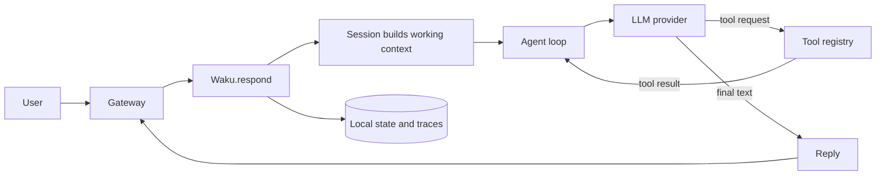
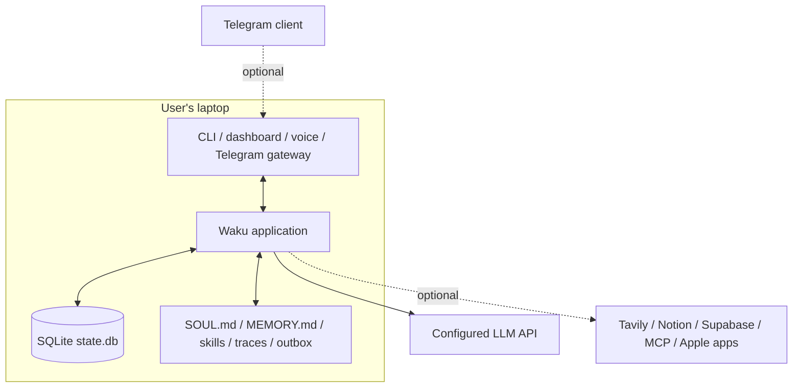
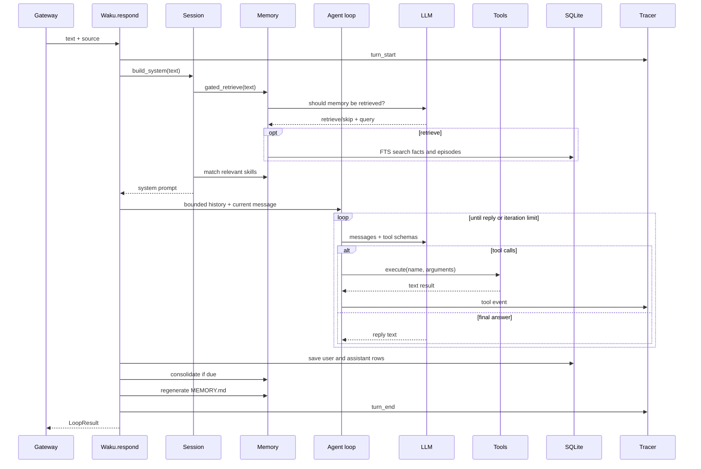
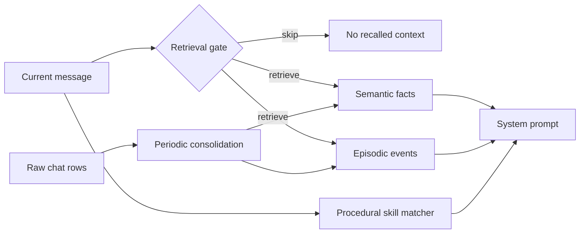

# Waku Agent System Design

This document explains how the `waku-agent` codebase works as a system. It is
written for a reader who wants to understand the architecture before changing
the code.

## 1. The shortest useful mental model

Waku is a local-first agent harness built around four pillars:

1. **Harness** — gateways accept text and route every request through one
   application object.
2. **Loop** — an LLM reasons, calls tools, observes their results, and repeats
   until it can answer.
3. **Memory** — durable facts, dated episodes, skills, and bounded chat history
   are assembled into working context when relevant.
4. **Eval and LLM-Ops** — every turn is traced, token use is recorded, behavior
   is tested, and a release gate decides whether the current version is safe.

The architectural center is `Waku.respond()` in `waku/app.py`. CLI, voice,
Telegram, dashboard chat, brief generation, and model comparisons all converge
there.



## 2. System context

Waku runs as one local Python process. It is not a distributed service and does
not require an application server framework.

The durable state is local by default, but model prompts are sent to the
configured external LLM provider. Optional integrations can also contact
Tavily, Telegram, Notion, Supabase, MCP servers, or macOS applications.
"Local-first" therefore describes state ownership and runtime control, not
fully offline inference.



## 3. Repository map

| Area | Responsibility | Main entry points |
|---|---|---|
| `waku/app.py` | Composes configuration, database, model, memory, tools, session, and tracing | `Waku`, `Waku.respond()` |
| `waku/config.py` | Reads environment-backed settings and creates the runtime home | `Settings`, `load_settings()` |
| `waku/db.py` | Creates and migrates the local SQLite schema | `connect()` |
| `waku/gateway/` | Converts channel-specific input into text and returns text | CLI, Telegram, voice |
| `waku/runtime/session.py` | Builds the system prompt and maintains bounded conversation history | `Session` |
| `waku/loop/agent.py` | Implements the reason-act-observe loop | `run_loop()` |
| `waku/loop/models.py` | Selects providers and normalizes two API wire formats | `get_client()`, `OpenAICompatClient` |
| `waku/tools/` | Defines tool schemas and executable handlers | `build_registry()`, `ToolRegistry` |
| `waku/memory/` | Coordinates semantic, episodic, and procedural memory | `Memory` |
| `waku/ops/` | Tracing, dashboard, comparisons, scoring, release gate, and brief generation | `Tracer`, dashboard, release gate |
| `waku/ops/static/` | Plain HTML, CSS, and JavaScript dashboard frontend | `index.html`, JavaScript modules |
| `evals/deterministic/` | Binary checks for behavior and regressions | pytest suite |
| `evals/judge/` | Model-scored reply-quality checks | DeepEval suite |
| `scripts/` | Demo reset, model shootout, and skill validation utilities | script `main()` functions |
| `skills/` | Built-in and community procedural-memory instructions | `SKILL.md` files |
| `examples/` | Minimal MCP configuration and server example | MCP demo |
| `sql/` | Optional Supabase semantic-memory schema | `init_supabase.sql` |

## 4. Object composition

Constructing `Waku` builds the runtime in dependency order:

```text
Settings
  -> runtime directories
  -> SQLite connection
  -> model client
  -> Memory
  -> ToolRegistry (memory-aware tools included)
  -> Session
  -> Tracer
```

`Waku.__init__()` accepts an injected model client and database connection.
Production uses the real implementations; deterministic evals inject a scripted
model and temporary database through the same seam. There is no separate test
architecture.

The application owns an optional MCP bridge and closes its subprocesses when the
dashboard rebuilds the agent after a settings change.

## 5. One turn, end to end

Every normal request follows this sequence:



### 5.1 Working-context assembly

`Session.build_system()` combines:

- `SOUL.md`, the assistant's standing identity and preferences;
- the current local date, time, timezone, provider, and model;
- relevant semantic and episodic memory, only if the retrieval gate says it is
  needed;
- procedural skills whose keywords match the request.

`Waku.respond()` then adds only the last `history_turns` exchanges plus the
current user message. This sliding window bounds prompt size, cost, and latency.
Older messages remain durable in SQLite and can influence future turns through
consolidated facts or episodic retrieval.

### 5.2 The agent loop

`run_loop()` uses one internal message format: the Anthropic Messages shape.
Each iteration:

1. sends the system prompt, messages, and tool schemas to the model;
2. appends the model response to working memory;
3. returns immediately if the model requested no tools;
4. otherwise executes every requested tool;
5. appends the tool results as the next user-side observation;
6. starts the next iteration.

Two guardrails end the loop:

- **Natural stop:** the model returns text without tool calls.
- **Hard stop:** `max_iterations` is reached.

Streaming is an output optimization, not a second control path. The dashboard
receives text deltas live, while the final response still flows through the same
loop and persistence logic. If streaming fails, the loop retries with a normal
model call.

### 5.3 After the reply

The session stores a compact summary of any tool activity with the assistant
message. This prevents a later turn from forgetting that an action already
happened.

The assistant database row also stores JSON metadata:

- retrieval-gate decision and reason;
- loop iteration count;
- latency;
- tool names and status;
- provider and model.

Finally, consolidation may distill unconsolidated chat rows into facts and an
episode, and `MEMORY.md` is regenerated as a human-readable view.

## 6. Gateways

Gateways are deliberately thin. Their job is to produce text, call
`Waku.respond()`, and present the returned text.

| Gateway | Behavior |
|---|---|
| CLI | Synchronous terminal loop with `/memory` and exit commands |
| Dashboard | Local `ThreadingHTTPServer`, streaming chat, settings, data, traces, comparisons, and session management |
| Telegram | Long-polling text handler with an optional allowed-user check |
| Voice | Whisper speech-to-text, optional wake-word loop, and local/system text-to-speech |
| Brief | Builds a scheduled briefing request and sends it through the normal harness |

Each gateway tags messages with a `source`, allowing one database-backed inbox
to show where every turn originated. CLI and Telegram use stable session IDs;
the dashboard supports creating, resuming, rotating, and switching conversations.

The dashboard binds to `127.0.0.1` and tries ports 7777 through 7786. It uses a
process lock around agent turns because the agent, SQLite connection, and
session history are shared mutable state.

## 7. Model-provider boundary

The loop understands one API dialect. `get_client()` returns either:

- a native Anthropic-shaped client; or
- `OpenAICompatClient`, which translates OpenAI-compatible chat completions
  into the Anthropic-shaped content blocks expected by the loop.

This isolates provider differences in `waku/loop/models.py` instead of spreading
provider branches through the agent loop.

The adapter translates:

- system and chat messages;
- tool schemas;
- tool calls and tool-result messages;
- token usage;
- stop reasons;
- streaming;
- provider-specific details such as Gemini thought signatures.

Provider selection, model overrides, endpoint overrides, API keys, and the LLM
timeout come from environment-backed settings. The normal model handles the
agent loop; `small_model` handles retrieval decisions and consolidation.

## 8. Tools

`Tool` combines three things:

- an LLM-visible name and description;
- a JSON input schema;
- a Python handler.

`ToolRegistry` exposes schemas to the model and dispatches calls by name. This is
the only boundary the loop knows.

### Default tools

- calendar event creation and event listing;
- note saving;
- outbox message writing;
- web search;
- memory correction/deletion;
- `SOUL.md` updates;
- procedural-skill creation.

### Optional tools

- Apple Calendar, Mail, Reminders, and Notes when explicitly enabled;
- tools imported from configured MCP servers;
- experimental tools behind `WAKU_EXPERIMENTAL`.

The live experimental capability delegates coding work to the external `pi`
agent. Terminal, browser, and cron entries are explicit placeholders that report
their status rather than pretending to work.

The scheduling tool writes both SQLite and `calendar.ics`; repeated identical
requests are idempotent. Apple Calendar synchronization is a separate opt-in
side effect.

## 9. Memory system

Waku separates memory by meaning, not only by storage location. For a dedicated deep dive on data models, retrieval gating, and consolidation algorithms, see [docs/memory-system.md](file:///e:/VIN-INTERNSHIP/Other-Coding-Project/waku-agent/docs/memory-system.md).



### Semantic memory

Semantic memory stores durable facts ("what is durably true") as subject/content pairs. The default `SqliteFactStore` uses SQLite FTS5 keyword search. Supabase pgvector is an optional backend selected through configuration.

- **Use case:** Remembering standing preferences, personal facts, and project context across sessions (e.g., subject: `user`, content: `"Alex prefers morning meetings"`). When a user asks *"Can we schedule a call with Alex?"*, Waku retrieves this fact to suggest morning time slots without asking for preferences again.

### Episodic memory

Episodic memory stores dated summaries of past events ("what happened, when"). `SqliteEpisodeStore` is the default backend, blending FTS keyword relevance with recency ordering (`ORDER BY rank, happened_at DESC`). (A Notion adapter is planned as a future extension per `docs/good-first-issues.md`).

- **Use case:** Recalling past interaction history, event outcomes, and timeline logs (e.g., dated: `"2026-07-28"`, summary: `"Discussed Acme demo architecture and selected FTS5 for local search"`). When a user asks *"What did we decide about demo search last week?"*, Waku retrieves matching episodic summaries to provide context on previous decisions.

### Procedural memory

Procedural memory consists of `SKILL.md` instructions ("how to act") from:

- the repository `skills/` directory;
- the user's `.waku/skills/` directory.

`SkillLoader` scans file modification timestamps on each match call and refreshes them automatically, so newly created skills become usable without restarting the process.

- **Use case:** Guiding the agent through specialized, multi-step workflows or task execution patterns (e.g., `SKILL.md` for idea refinement or code review). When a user says *"Refine my new feature idea"*, Waku matches keyword overlap with `skills/community/idea-refine/SKILL.md` and injects its structured instructions into the system prompt.

### Retrieval gate

Before searching facts or episodes, a small model returns:

- whether retrieval is needed;
- a search query;
- a reason.

The gate fails open. Invalid output or an exception causes retrieval rather than
silently losing potentially important personal context.

### Consolidation

After a configurable number of exchanges, the small model summarizes all
unconsolidated chat rows. Valid facts and one optional episode are written, then
the processed rows are marked consolidated.

Failure is loss-safe: if the model call or JSON parsing fails, the rows remain
unconsolidated and can be retried after a later turn.

## 10. Persistence model

The default runtime home is `.waku/`.

| Path | Purpose |
|---|---|
| `.waku/state.db` | Source of truth for chat, facts, episodes, and calendar events |
| `.waku/MEMORY.md` | Generated human-readable memory mirror |
| `.waku/SOUL.md` | Standing assistant identity and user preferences |
| `.waku/calendar.ics` | Portable calendar mirror |
| `.waku/skills/` | Installed and agent-authored skills |
| `.waku/outbox/` | Messages, delegated-task logs, and generated artifacts |
| `.waku/traces/YYYY-MM-DD.jsonl` | Ordered turn events |
| `.waku/usage.jsonl` | Append-only token-usage ledger |
| `.waku/mcp.json` | Optional MCP server configuration |
| `.waku/compare-history.jsonl` | Model-comparison scoreboard, separate from `state.db` |

### SQLite schema

| Table | Meaning |
|---|---|
| `calendar_events` | Events created by the flagship scheduling tool |
| `facts` | Semantic facts |
| `facts_fts` | FTS5 index synchronized by insert/update/delete triggers |
| `episodes` | Dated episodic summaries |
| `episodes_fts` | FTS5 index synchronized by triggers |
| `chat_log` | User and assistant messages, session/source labels, consolidation state, and assistant metadata |

Database startup is additive and idempotent. `_migrate()` checks existing
`chat_log` columns before adding `session_id`, `source`, or `meta`, preserving
older user databases.

## 11. Observability and dashboard

`Tracer` is also a loop observer. It receives gate, LLM, tool, consolidation,
and lifecycle events without the loop depending on a dashboard or telemetry
vendor.

Every turn writes a readable sequence:

```text
turn_start -> gate -> llm -> tool -> llm -> consolidation? -> turn_end
```

JSONL tracing is always active. If an OpenTelemetry endpoint is configured and
the optional dependency is installed, the same events are also exported as
spans. Missing OpenTelemetry never disables local tracing.

Each LLM event appends token counts to `usage.jsonl`. Monetary cost is derived
later so historical token data remains useful when pricing changes.

The dashboard backend:

- runs and streams chat turns;
- reads SQLite, traces, and usage data;
- manages sessions, memory, skills, settings, and pinned models;
- exposes a read-only SQL console;
- compares providers/models and optionally judges replies;
- serves the static frontend with no build step.

The comparison arena stores its own JSONL history. It intentionally does not
pollute the personal-memory database.

## 12. Evaluation and release flow

Waku keeps two different questions separate:

| Suite | Question | Result |
|---|---|---|
| `evals/deterministic/` | Did the correct behavior occur? | pass/fail |
| `evals/judge/` | Was the natural-language reply good? | scored judgment |

Deterministic tests use `ScriptedClient` to make exact model responses
repeatable. They inspect tool calls, SQLite rows, files, provider translation,
session behavior, traces, settings, dashboard assets, and failure cases.

The judge suite uses DeepEval and a provider-backed judge for qualitative reply
quality.

`make gate`:

1. runs all deterministic evals;
2. stops immediately if any fail;
3. runs judge evals when the active provider has a key;
4. records the verdict;
5. opens the gate only when every required suite passes.

Supporting evaluation tools include:

- `scripts/shootout.py` for repeated model comparisons;
- `waku/ops/scoring.py` for expected tool behavior;
- `waku/ops/judge.py` for reply scoring;
- `waku/ops/coding_eval.py` for test-command-scored delegated coding cases;
- `waku/ops/compare_history.py` for historical comparison summaries.

## 13. Configuration and extension points

Configuration is environment-based and centralized in `Settings`. The main
extension seams are intentionally small:

| To extend | Change |
|---|---|
| Add a text channel | Create a thin gateway that calls `Waku.respond()` |
| Add a tool | Return a `Tool` and register it in `build_registry()` |
| Add an OpenAI-compatible provider | Add one `Provider` record |
| Add an Anthropic-compatible provider | Add one `Provider` record |
| Change semantic storage | Implement the fact-store operations and select it in `Memory` |
| Change episodic storage | Implement the episode-store operations and select it in `Memory` |
| Add a procedural capability | Add a `SKILL.md` |
| Add telemetry | Subscribe through the observer composition path |
| Add a deterministic behavior contract | Add one focused case under `evals/deterministic/` |

Optional dependencies are grouped by capability (`voice`, `telegram`, `mcp`,
`tracing`, `notion`, `supabase`, and eval tooling), keeping the default runtime
small.

## 14. Failure behavior and trust boundaries

Important design behavior:

- Retrieval-gate failure retrieves memory rather than dropping it.
- Consolidation failure preserves raw chat for retry.
- Streaming failure falls back to a non-streaming LLM call.
- LLM requests have a configurable timeout.
- The loop cannot exceed its iteration cap.
- Missing OpenTelemetry preserves JSONL tracing.
- Database migrations only add missing columns.
- Legacy non-UTF-8 trace files are rejected rather than rewritten or mixed.
- Dashboard turns are serialized around shared agent state.
- Telegram can restrict messages to one user ID.
- Dashboard access has no application authentication, but it binds only to the
  loopback interface.

Trust boundaries still matter:

- model providers receive prompts and recalled context;
- tools can write the calendar, memory, files, or external services;
- MCP servers are user-configured subprocesses with their own capabilities;
- Apple tools request OS automation permissions;
- experimental delegation can run an external coding agent in a chosen working
  directory.

## 15. Deliberate limits

Waku favors legibility over production-scale machinery:

- one local process rather than distributed services;
- SQLite and files rather than infrastructure by default;
- keyword FTS rather than mandatory embeddings;
- a bounded in-memory history rather than an unbounded context;
- a process lock around dashboard turns rather than concurrent mutation;
- direct tool registration rather than a plugin framework;
- plain `http.server` and static assets rather than a web framework and build
  pipeline.

These are useful boundaries for a personal assistant and a teaching codebase.
They become upgrade points only when measured needs exceed them.

## 16. Suggested reading order

Use one complete user turn as the spine:

1. `waku/__main__.py` — command dispatch.
2. `waku/gateway/cli.py` — the thinnest gateway.
3. `waku/app.py` — composition and the full-turn orchestrator.
4. `waku/runtime/session.py` — working-context assembly.
5. `waku/memory/__init__.py` and `retrieval_gate.py` — recall decisions.
6. `waku/loop/agent.py` — reason, act, observe, repeat.
7. `waku/tools/registry.py` and `waku/tools/calendar.py` — one tool end to end.
8. `waku/loop/models.py` — provider normalization.
9. `waku/db.py` — durable state.
10. `waku/ops/tracing.py` — evidence emitted by the turn.
11. `evals/deterministic/test_tool_trigger.py` — executable behavior contract.
12. `waku/ops/dashboard.py` — the larger operational surface after the core is
    clear.

Then follow one vertical slice: schedule a calendar event from gateway input to
tool execution, SQLite/ICS persistence, trace events, and deterministic eval.
That path touches every pillar without requiring you to read the repository
file by file.

## 17. Final architecture summary

Waku's core is one honest pipeline:

```text
text gateway
  -> Waku.respond
  -> assemble bounded, relevant context
  -> model/tool loop
  -> persist chat and actions
  -> consolidate durable memory
  -> trace and evaluate the result
  -> return text
```

The system stays understandable because the major policy choices have one home:
gate policy in memory, iteration policy in the loop, provider translation in
models, execution in the tool registry, persistence in SQLite/files, and
quality policy in evals.

For the shorter whiteboard-oriented view, also see `docs/architecture.md`.
