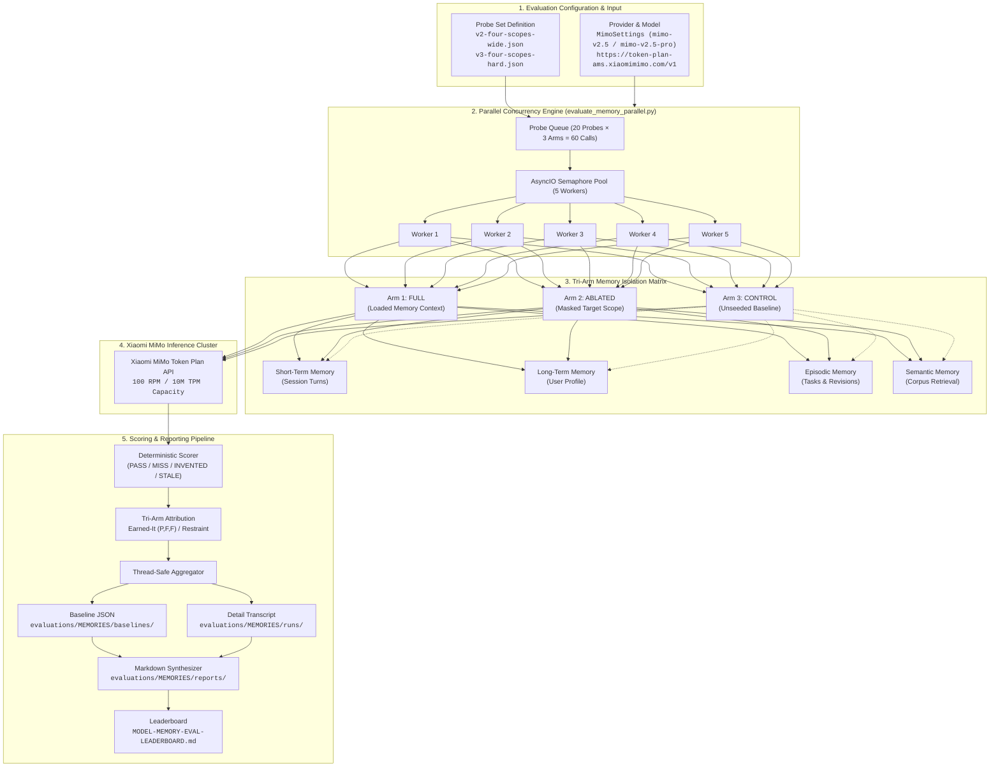
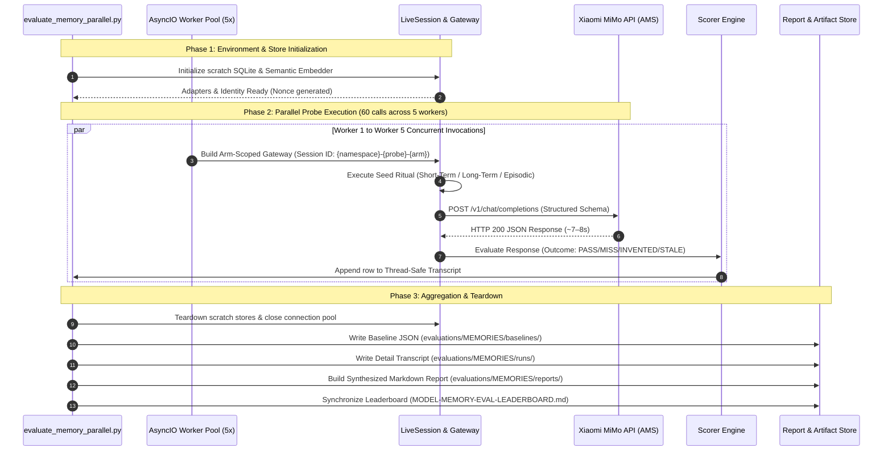
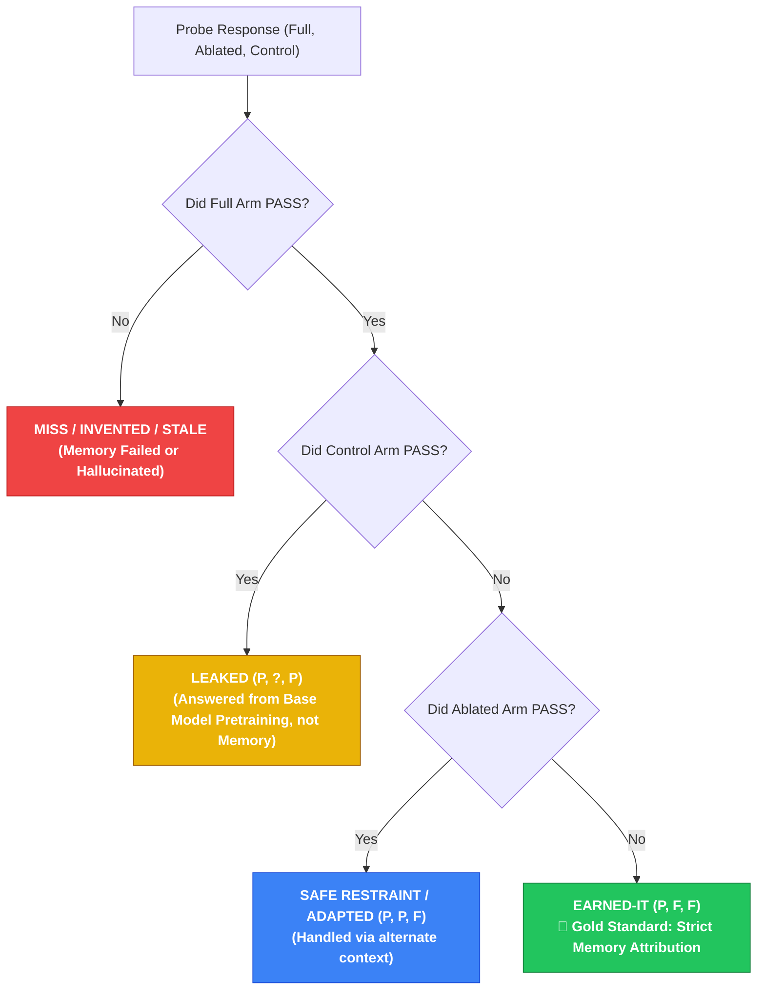

# Parallel Memory Evaluation Workflow (5-Worker Concurrency Architecture)

This document visualizes the complete end-to-end architecture, parallel dispatch pipeline, 3-arm isolation guarantees, and reporting lifecycle for high-speed memory evaluations in Cowork Agent.

MIMO `mimo-v2.5-pro` scoreboard and open defects:
[`MIMO-V2.5-PRO-CHAT-REPLY-TRAIL.md`](./MIMO-V2.5-PRO-CHAT-REPLY-TRAIL.md).

---

## 1. High-Level System Architecture



---

## 2. Parallel Worker Dispatch Sequence

The following sequence details how 5 concurrent workers pull probe-arm execution pairs from the queue without data contamination or race conditions:



---

## 3. Tri-Arm Attribution Logic & Classification Matrix

Each probe is tested across three distinct states to isolate whether success is **genuinely earned by memory** or hallucinated / leaked from base model pretraining:



---

## 4. Execution Commands & Quick Reference

```powershell
# 1. High-Speed 5-Worker Evaluation on v2 Wide:
uv run python scripts/evaluate_memory_parallel.py `
  --provider mimo `
  --model mimo-v2.5-pro `
  --probe-set evaluations/MEMORIES/probes/v2-four-scopes-wide.json `
  --workers 5 `
  --output evaluations/MEMORIES/baselines/mimo-v2.5-pro-v2-parallel.json

# 2. High-Speed 5-Worker Evaluation on v3 Hard:
uv run python scripts/evaluate_memory_parallel.py `
  --provider mimo `
  --model mimo-v2.5-pro `
  --probe-set evaluations/MEMORIES/probes/v3-four-scopes-hard.json `
  --workers 5 `
  --output evaluations/MEMORIES/baselines/mimo-v2.5-pro-v3-parallel.json

# 3. Generate Synthesized Report:
uv run python scripts/build_memory_evaluation_report.py `
  --baseline evaluations/MEMORIES/baselines/mimo-v2.5-pro-v2-parallel.json
```
