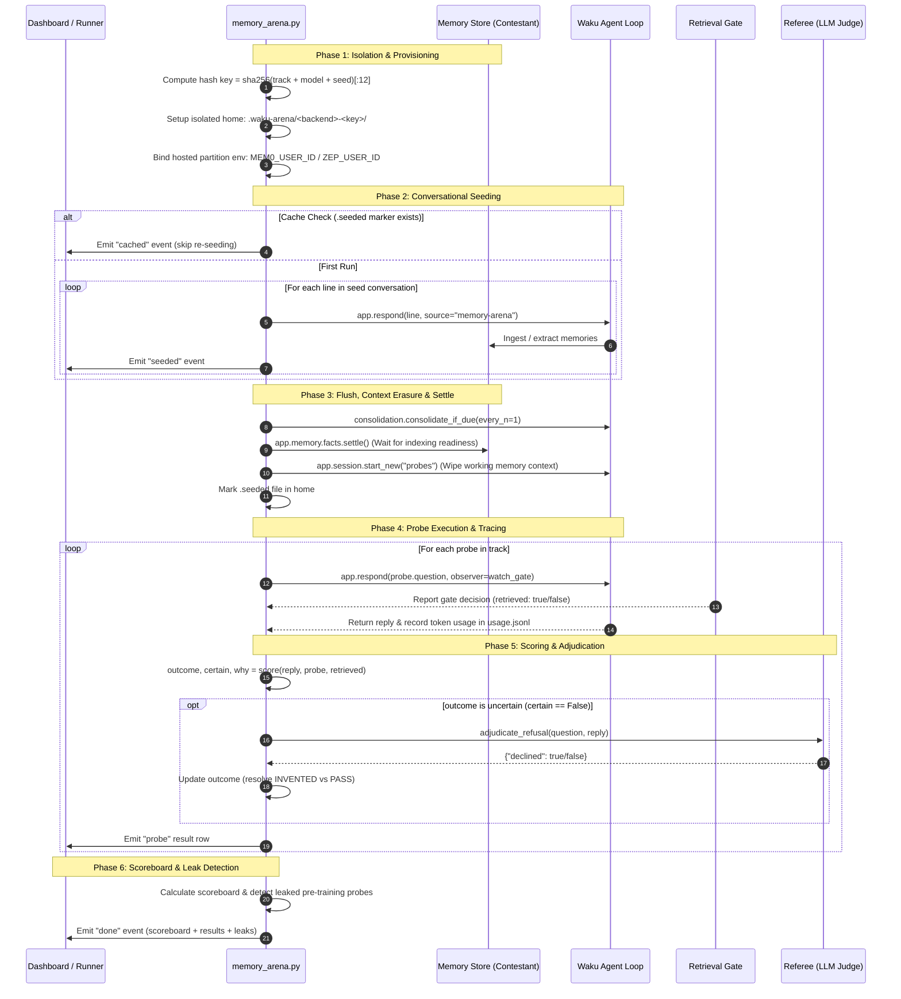

# Memory Evaluation System — The Waku Memory Arena

A comprehensive guide to Waku's memory evaluation framework, its scientific methodology, execution workflow, scoring engine, and backend isolation guarantees.

---

## 1. Overview and Core Philosophy

The **Memory Arena** ([`waku/ops/memory_arena.py`](../waku/ops/memory_arena.py)) is Waku's evaluation harness for benchmarking different **semantic memory backends** (e.g., SQLite FTS5, Mem0, Zep, LangMem, Supabase) under strictly controlled, identical conditions.

### The "One Dial" Principle
A meaningful benchmark requires varying exactly one variable at a time:
- **Model Arena (`arena.py`)**: Holds the harness and memory store constant, varies the **LLM**.
- **Memory Arena (`memory_arena.py`)**: Holds the harness and the LLM constant, varies the **Memory Backend**.

```
                         ┌──→ Waku + SQLite (FTS5) ──┐
Seed Conversation ───────┼──→ Waku + Mem0         ───┼──→ Same Probes ──→ One Scorer
(conversational turns)   ├──→ Waku + Zep          ───┤
                         ├──→ Waku + LangMem      ───┤
                         └──→ Waku + Control      ───┘
```

---

## 2. The Four Categorical Outcomes (Why Not Pass/Fail)

A simple boolean (Pass/Fail) obscures the most critical safety distinction in memory systems: **an honest admission of ignorance versus a confident hallucination or stale assertion.**

Waku classifies every probe response into one of four distinct outcomes:

| Outcome | Definition | Real-World Significance | Scorer Rule |
| :--- | :--- | :--- | :--- |
| **`PASS`** | The expected answer is present, or the system declined when asked an unseeded question. | System behaves correctly under certainty or correctly under ignorance. | Matches `expect_any` / `expect_all`, or declines on `expect_refusal`. |
| **`STALE`** | The expected answer is missing, and a **superseded** answer was asserted. | "The launch is in March" after being told it moved to June. Dangerous in scheduling or business ops. | Matches `stale_any` without matching `expect_any`. |
| **`INVENTED`** | A refusal was expected (`expect_refusal: true`), but the system asserted an answer anyway. | The fact was never given, so the model fabricated it (e.g., inventing a legal filing deadline). **Headline metric.** | Fails refusal heuristic and fails judge adjudication on an `expect_refusal` probe. |
| **`MISS`** | The expected answer is absent, but nothing false was asserted. | An honest knowledge gap. The system lost or failed to retrieve the fact, but did not lie. | Default when `expect_any` is missing and `stale_any` is not asserted. |

### Ranking Order on the Scoreboard
Because fabricating facts (`INVENTED`) and serving outdated data (`STALE`) are worse than admitting a gap (`MISS`), the scoreboard ranks contestants by worst behavior first:

$$\text{Sort Priority: } (-\text{INVENTED}, -\text{STALE}, -\text{MISS}, -\text{PASS})$$

---

## 3. Architecture and Core Components

```
waku-agent/
├── evals/
│   ├── memory_arena.json              # Default fixture and probe definitions
│   └── deterministic/
│       └── test_memory_arena.py       # Offline zero-cost test suite for scoring & harness
├── waku/
│   ├── memory/
│   │   ├── consolidation.py           # Background memory extraction & summarization
│   │   ├── retrieval_gate.py          # Decides whether to query memory for a turn
│   │   └── semantic/                  # Backend adapters (sqlite, mem0, zep, langmem, etc.)
│   └── ops/
│       ├── memory_arena.py            # The Arena runner, isolation, settle, and scorer
│       ├── judge.py                   # LLM-as-a-judge referee client
│       └── dashboard.py               # Localhost dashboard exposing the Memory tab
```

### Component Roles

1. **Probe Fixtures ([`evals/memory_arena.json`](../evals/memory_arena.json))**:
   Declares evaluation tracks, conversational seed dialogues, and probe questions with assertion rules. Overridable via `WAKU_MEMORY_PROBES` or `.waku/probes/*.json`.
2. **Arena Runner ([`waku/ops/memory_arena.py`](../waku/ops/memory_arena.py))**:
   Orchestrates concurrent contestant sandboxes, conversation seeding, session resetting, readiness polling, probe querying, token ledger delta accounting, and scoring.
3. **Refusal Adjudicator (`adjudicate_refusal`)**:
   An LLM judge pass triggered when a verdict relies on ambiguous refusal heuristics (`certain=False`), preventing honest decline phrasings from being misclassified as `INVENTED`.
4. **The `control` Contestant**:
   A baseline contestant given **no seed facts** and asked all probes. Any probe `control` passes is flagged as a **leak** (meaning the model answered from pre-training data rather than memory).

---

## 4. End-to-End Evaluation Workflow

The evaluation lifecycle follows strict scientific controls to prevent data leakage, context caching, and async timing errors.

### Workflow Diagram



---

### Step-by-Step Phase Breakdown

### Phase 1: Isolation and Partition Setup
- **Local Isolation**: Each backend runs inside its own isolated folder under `.waku-arena/<backend>-<hash>/`. The user's live database (`.waku/state.db`) is never touched.
- **Hosted Partition Isolation**: Hosted services like Mem0 and Zep share user accounts. To prevent benchmark runs from polluting live user memories, dynamic environment variable wrappers (`arena_partition_env`) temporarily set `MEM0_USER_ID` and `ZEP_USER_ID` to `waku-arena-<hash>` for the duration of the race.
- **Deterministic Caching**: The partition key and directory hash are derived from `sha256(track + model + seed)`. If an identical race was previously seeded and settled, re-seeding is skipped.

### Phase 2: Conversational Seeding
- Facts are fed via `app.respond(line)` sequentially rather than injected directly into database tables.
- **Fairness Guarantee**: Some memory backends offer proprietary extraction pipelines that determine what is worth storing. Feeding natural conversational sentences allows each backend's extraction and consolidation capabilities to be evaluated fairly.

### Phase 3: Flush, Context Erasure, and Settle
Three critical guards execute before any probe is asked:
1. **Consolidation Flush**: `consolidation.consolidate_if_due(..., every_n=1)` forces background extraction so facts sitting in recent turn buffers are committed to the memory store.
2. **Readiness Settle (`settle()`)**: Hosted vector and graph stores are eventually consistent (e.g., Mem0 takes ~14s to become queryable; Zep builds graph nodes asynchronously). The runner invokes `facts.settle()`, which polls until the store confirms data is searchable. Probing prematurely would record network latency as memory amnesia (`MISS`).
3. **Session Reset (`app.session.start_new("probes")`)**: History buffers hold the last 24 messages. Without resetting the session, the LLM would simply answer probes by reading the conversation history from its active context window, bypassing the memory store entirely.

### Phase 4: Probe Execution and Ledger Deltas
- Probes are submitted via `app.respond(probe["question"])`.
- An observer hooks into the **Retrieval Gate** to record whether the agent chose to query memory (`retrieved = true/false`).
- Token accounting is read directly from `usage.jsonl` by measuring the delta across each probe turn:
  - Tokens spent per probe: `after_tokens - before_tokens`
  - API calls per probe: `after_calls - before_calls`
  - Latency: Measured in milliseconds per probe turn.

### Phase 5: Deterministic Scoring and LLM Adjudication
- **Pure Substring Evaluation**:
  - `expect_any`: At least one required substring must be present in the reply (case-insensitive).
  - `stale_any`: Flags superseded answers if present without the new answer.
  - `expect_all`: Multi-hop requirement where all listed substrings must appear.
  - `expect_retrieval: false`: Verifies that the agent did not query memory for arithmetic or general knowledge.
- **Refusal Heuristics & Adjudication**:
  - For `expect_refusal: true` probes, responses matching `_REFUSALS` receive `certain=False`.
  - Probes with `certain=False` are dispatched to `adjudicate_refusal()` (via `waku/ops/judge.py`), where a neutral LLM referee decides whether the reply genuinely declined or hallucinated.

### Phase 6: Scoreboard Aggregation and Leak Detection
- The `scoreboard()` aggregates total `PASS`, `STALE`, `INVENTED`, `MISS`, `tokens`, and `calls` per contestant.
- **Leak Detection**: If the `control` contestant (which received zero seed facts) passes a probe that asserts recalled content, that probe is flagged as `leaked` (the question tests LLM pre-training rather than memory retrieval).

---

## 5. Probe Specification Schema

Probe fixtures are structured as JSON files containing named tracks:

```json
{
  "tracks": {
    "track_id": {
      "label": "Human-readable label",
      "seed": [
        "Conversational fact line 1",
        "Conversational fact line 2"
      ],
      "probes": [
        {
          "id": "unique-probe-id",
          "test": "recall | update | restraint | reasoning",
          "question": "Question string sent to the agent",
          "expect_any": ["string1", "string2"],
          "stale_any": ["superseded_string"],
          "expect_all": ["required_part1", "required_part2"],
          "expect_refusal": false,
          "expect_retrieval": true,
          "note": "Explanation of what this probe measures"
        }
      ]
    }
  }
}
```

### The Four Standard Test Types

#### 1. `recall` (Baseline Retrieval)
Tests whether basic facts stored during seeding can be retrieved.
```json
{
  "id": "priya-meeting-time",
  "test": "recall",
  "question": "When does Priya like to meet?",
  "expect_any": ["morning"],
  "note": "Baseline. A backend that misses this stored nothing."
}
```

#### 2. `update` (Superseded Knowledge)
Tests whether the store reflects corrections or serves stale data.
```json
{
  "id": "design-review-day",
  "test": "update",
  "question": "When is the design review?",
  "expect_any": ["Wednesday"],
  "stale_any": ["Tuesday"],
  "note": "Both days were seeded; Wednesday is the correction. Answering Tuesday scores as STALE."
}
```

#### 3. `restraint` (Hallucination Prevention)
Tests whether the agent refuses to answer when information was never provided.
```json
{
  "id": "priya-phone-number",
  "test": "restraint",
  "question": "What is Priya's phone number?",
  "expect_refusal": true,
  "note": "Priya was introduced, but no phone number was given. Fabricating one scores as INVENTED."
}
```

#### 4. `reasoning` (Multi-Hop Synthesis)
Tests whether the store can retrieve and combine multiple distinct memories to answer a question.
```json
{
  "id": "marcus-attendance",
  "test": "reasoning",
  "question": "Can Marcus make the design review?",
  "expect_any": ["yes", "can", "able"],
  "expect_all": ["Wednesday"],
  "note": "Requires combining Marcus's OOO days (Thu/Fri) with the rescheduled review day (Wed)."
}
```

---

## 6. Supported Contestants & Backend Matrix

| Contestant | Type | Storage Engine | Query Strategy | Isolation Mechanism |
| :--- | :--- | :--- | :--- | :--- |
| **`sqlite`** | Local | SQLite table + FTS5 full-text index | BM25 lexical keyword search | Unique `.waku-arena/` directory |
| **`mem0`** | Hosted | Managed vector database + user partition | Semantic vector similarity | `MEM0_USER_ID = waku-arena-<hash>` |
| **`zep`** | Hosted | Temporal Knowledge Graph + entity nodes | Hybrid graph search + validity intervals | `ZEP_USER_ID = waku-arena-<hash>` |
| **`langmem`** | Local / Hosted | In-memory dict or PostgreSQL (`pgvector`) | Semantic vector search | In-memory or isolated DB table |
| **`supabase`** | Hosted | PostgreSQL + `pgvector` table | Cosine similarity vector search | Dedicated database table / filter |
| **`control`** | Synthetic | None (zero stored facts) | N/A | Given empty seed list; checks pretraining leaks |

---

## 7. How to Run Memory Evaluations

### 1. Interactive Web Dashboard
Run the dashboard and navigate to the **Memory** sub-tab under **Compare**:
```bash
make dashboard
```
- Open `http://localhost:7777` → **Compare** → **Memory Arena**.
- Choose a question track from the dropdown (loaded from `evals/memory_arena.json` or `.waku/probes/`).
- Select target model and backends.
- Click **Tell Stores** to seed (cached automatically), then **Ask Stores** to execute probes.
- Inspect the live SSE stream, token costs, and scoreboard table.

### 2. Offline Deterministic Tests (Zero API Cost)
Verify the scorer, fixture integrity, token accounting, and isolation logic offline:
```bash
pytest evals/deterministic/test_memory_arena.py -v
```

### 3. Programmatic Invocation (Python SDK)
Execute an evaluation run directly from Python:
```python
from waku.ops import memory_arena


def event_logger(kind, payload):
    print(f"[{kind.upper()}] {payload}")


# Run memory arena across SQLite and Mem0
memory_arena.run_arena(
    backends=["sqlite", "mem0", "control"],
    track="example",
    emit=event_logger,
    model="anthropic:claude-3-5-sonnet-20241022",
)
```

### 4. Custom Probe Sets
To use custom question fixtures without modifying repository files:
```bash
export WAKU_MEMORY_PROBES="/path/to/custom_probes.json"
```
Or place JSON files in `.waku/probes/` inside your agent home directory.

---

## 8. Cleanup and Safety Guarantees

Running benchmarks against hosted services can accumulate test partitions. The Memory Arena provides dedicated cleanup utilities:

```bash
# Preview and remove arena scratch homes and hosted test partitions
python scripts/arena_clean.py --yes
```

Inside the dashboard, clicking **Clean Stores** calls `clean_stores(track, model)`, which targets only the specific `waku-arena-<hash>` partition and its matching `.waku-arena/` directory. It **never** modifies or wipes `.waku/state.db` or the default `waku` user partition.
