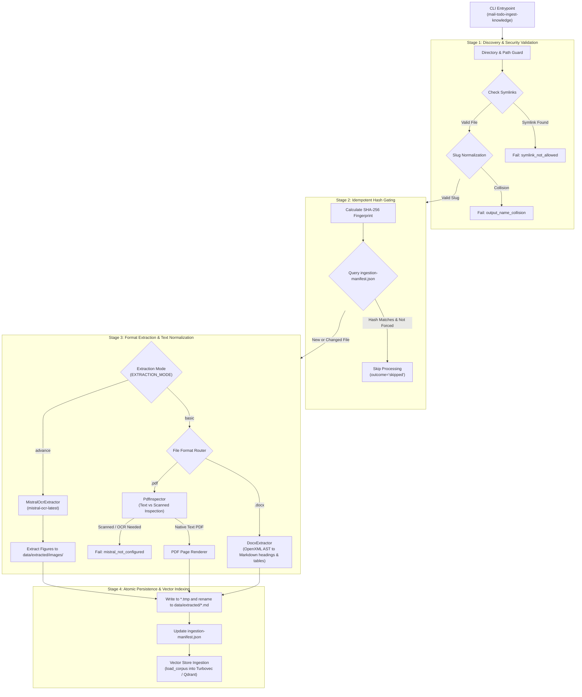
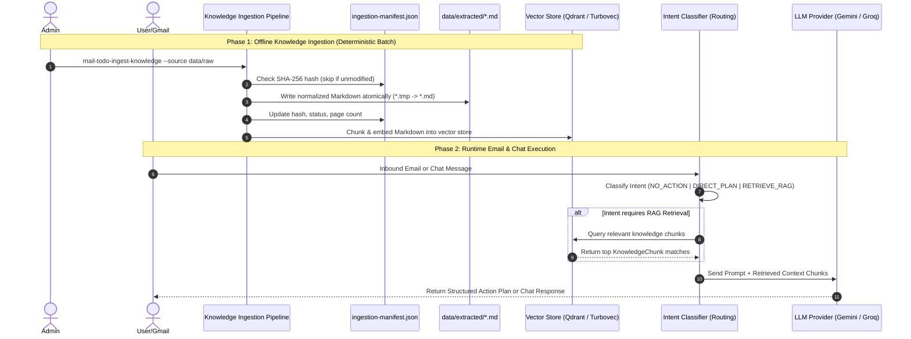
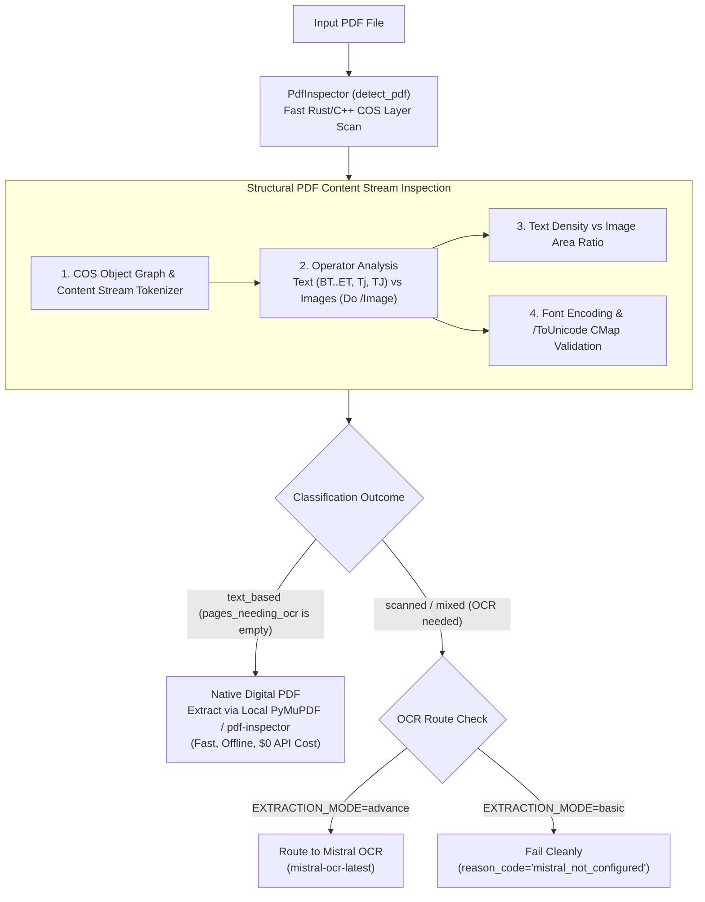
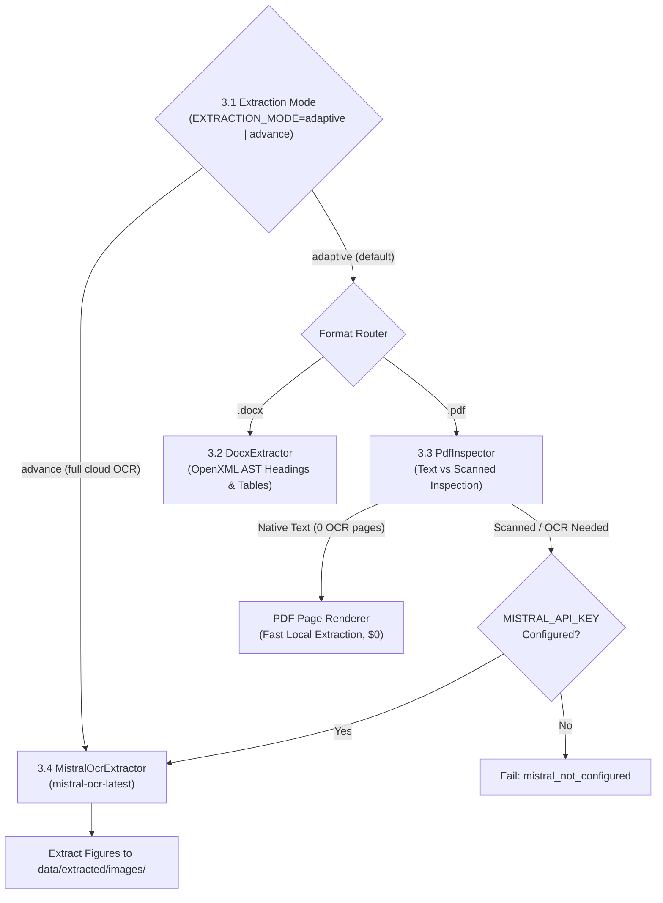

# Ingestion Pipeline Brainstorming & Architecture Reference Board

**Status:** Reference & Study Guide  
**Location:** `docs/references/understand/ingestion-pipeline-brainstorming.md`  
**Related Architecture Docs:**  
- [06-knowledge-and-document-ingestion-pipeline.md](file:///E:/VIN-INTERNSHIP/EMAIL-AGENT-v1/docs/architectures/current-architectures/06-knowledge-and-document-ingestion-pipeline.md)
- [01-email-action-plan-and-rag.md](file:///E:/VIN-INTERNSHIP/EMAIL-AGENT-v1/docs/architectures/current-architectures/01-email-action-plan-and-rag.md)
- [02-ai-chat-and-typed-memory.md](file:///E:/VIN-INTERNSHIP/EMAIL-AGENT-v1/docs/architectures/current-architectures/02-ai-chat-and-typed-memory.md)
- [05-rag-architecture.md](file:///E:/VIN-INTERNSHIP/EMAIL-AGENT-v1/docs/architectures/current-architectures/05-rag-architecture.md)

---

## 1. Core Question & Conceptual Clarification

### Q: Is the ingestion pipeline a centralized document ingestion pipeline for Email RAG and Chat with PRD (including LLM + Intent classifier and RAG)? Do they both use the same ingestion pipeline?

### Key Architectural Answers

1. **Shared Company Knowledge Base (Centralized Ingestion):**
   * **Yes**, for company-wide administrator documentation (`.docx`, `.pdf`).
   * The central ingestion CLI (`mail-todo-ingest-knowledge`) converts raw company documents into standard Markdown files committed under `data/extracted/*.md`.
   * **Both Email RAG and AI Chat** query the vector index (Qdrant or Turbovec) built from this shared corpus (`data/extracted/*.md`):
     * **Email RAG (Single-Turn):** Queries `data/extracted/*.md` when an incoming email triggers `RETRIEVE_RAG` intent to gather background context for generating Action Plans.
     * **AI Chat (Multi-Turn):** Queries `data/extracted/*.md` as its **Semantic Memory** (Type 4 Memory) to answer user questions using company knowledge.

2. **Project-Scoped User Documents (Decoupled Runtime Ingestion - ADR-007):**
   * **No**, user-uploaded workspace documents do not pass through the central CLI pipeline.
   * User documents are uploaded via `POST /v1/projects/{id}/documents` and extracted at runtime via [`ProjectDocumentExtractor`](file:///E:/VIN-INTERNSHIP/EMAIL-AGENT-v1/src/cowork_agent/integrations/knowledge_ingestion/project_documents.py).
   * These are isolated per user project workspace and used **only in AI Chat** (gated by `USER_DOCUMENTS_ENABLED`).

3. **Emails are Ephemeral and NEVER Ingested (ADR-003):**
   * Raw email bodies and email attachments are ephemeral data.
   * Per security rules, emails are processed only in transient memory during an email evaluation turn and are **never** passed into the document ingestion pipeline or persisted in vector stores.

4. **Vector Store Provider Independence (Turbovec `.tvim` vs Qdrant):**
   * **Yes, Turbovec's `.tvim` file and Qdrant's vector collection are completely independent from each other.**
   * They are two alternative implementations of the `SemanticMemoryPort` ([`bootstrap.py`](file:///E:/VIN-INTERNSHIP/EMAIL-AGENT-v1/src/cowork_agent/integrations/rag/bootstrap.py)):
     * If `RAG_STORE_PROVIDER=turbovec`: The app builds an in-process, 4-bit quantized vector index stored locally at `.data/turbovec_index.tvim` ([`turbovec_memory.py`](file:///E:/VIN-INTERNSHIP/EMAIL-AGENT-v1/src/cowork_agent/integrations/rag/turbovec_memory.py)).
     * If `RAG_STORE_PROVIDER` is unset or default (with `QDRANT_ENABLED=true`): The app connects to an external or local Qdrant vector database server collection ([`qdrant.py`](file:///E:/VIN-INTERNSHIP/EMAIL-AGENT-v1/src/cowork_agent/integrations/rag/qdrant.py)).
   * Both stores read from the **same source Markdown files** (`data/extracted/*.md`), but they index and store the text/vector embeddings in completely separate, independent formats. At runtime, the app selects **one active provider** via `RAG_STORE_PROVIDER`, and both Email RAG and AI Chat query that active provider.

---

## 2. Ingestion Pipeline Execution Flow (Deterministic Batch Phase)

The central Document Ingestion Pipeline ([`KnowledgeIngestionService`](file:///E:/VIN-INTERNSHIP/EMAIL-AGENT-v1/src/cowork_agent/integrations/knowledge_ingestion/service.py)) is a **pure extraction and normalization pipeline**. It does **not** run LLMs or Intent Classifiers during document processing.

### Ubiquitous Language & Terminology Reference (Beginner Guide)

If you are new to this codebase, use this table to decode all domain terms, acronyms, and file concepts used throughout the ingestion pipeline:

| Domain Term / Concept | Simple Plain-English Explanation | Code / File Reference | Why It Matters |
| :--- | :--- | :--- | :--- |
| **Ingestion Pipeline** | The offline automated assembly line that converts raw documents (`.pdf`, `.docx`) into standardized Markdown files (`data/extracted/*.md`). | [`service.py`](file:///E:/VIN-INTERNSHIP/EMAIL-AGENT-v1/src/cowork_agent/integrations/knowledge_ingestion/service.py) | Ensures all raw company documents are converted into uniform, clean text that vector search engines can easily read. |
| **Corpus (`data/extracted/*.md`)** | The ground-truth collection of converted Markdown files stored on disk. | `data/extracted/` | This is the single source of truth for all enterprise knowledge used by both Email RAG and AI Chat. |
| **Manifest Store (`ingestion-manifest.json`)** | A tracking ledger/database stored as JSON that records file hashes, timestamps, page counts, and extraction results. | [`manifest.py`](file:///E:/VIN-INTERNSHIP/EMAIL-AGENT-v1/src/cowork_agent/integrations/knowledge_ingestion/manifest.py) | Remembers what files were already ingested so the system doesn't waste time/money re-processing unchanged files. |
| **Idempotency / Idempotent Hash Gating** | Running the ingestion script 1 time or 100 times on the same input files produces the exact same result without duplicate work. | `ManifestStore.should_skip()` in [`manifest.py`](file:///E:/VIN-INTERNSHIP/EMAIL-AGENT-v1/src/cowork_agent/integrations/knowledge_ingestion/manifest.py) | Calculates a SHA-256 fingerprint for each file; if the fingerprint matches the manifest, it skips extraction immediately. |
| **Slug Normalization** | Transforming complex file names like `"Company Policy (v2) Final!.pdf"` into clean ASCII filenames like `"company-policy-v2-final.md"`. | `_output_name()` in [`service.py`](file:///E:/VIN-INTERNSHIP/EMAIL-AGENT-v1/src/cowork_agent/integrations/knowledge_ingestion/service.py) | Prevents invalid filename characters, spaces, or OS path issues across Windows, Linux, and macOS. |
| **Slug Collision (`output_name_collision`)** | An error that occurs if two different input files slugify into the exact same output filename (e.g. `Policy-A.docx` and `Policy_A.docx` both becoming `policy-a.md`). | [`models.py`](file:///E:/VIN-INTERNSHIP/EMAIL-AGENT-v1/src/cowork_agent/integrations/knowledge_ingestion/models.py) | Prevents one file from accidentally overwriting another file's content in the extracted corpus. |
| **Symlink Defense (`symlink_not_allowed`)** | Rejecting shortcut/symbolic link files found in input folders. | [`service.py`](file:///E:/VIN-INTERNSHIP/EMAIL-AGENT-v1/src/cowork_agent/integrations/knowledge_ingestion/service.py) | Security rule: prevents malicious users from placing a symlink pointing to sensitive system files (like `/etc/passwd`). |
| **Atomic Write (`.tmp` $\rightarrow$ `.md`)** | Writing Markdown output to a temporary `.tmp` file first, then atomically renaming it to `.md` in a single instant OS operation (`os.replace`). | `write_markdown_atomically()` in [`manifest.py`](file:///E:/VIN-INTERNSHIP/EMAIL-AGENT-v1/src/cowork_agent/integrations/knowledge_ingestion/manifest.py) | Guarantees that vector indexers running in parallel will never read a half-written, corrupted file while ingestion is active. |
| **DOCX AST Parsing** | Converting Word XML documents into structured Markdown headings (`#`), lists (`-`), and pipe tables (`\| Header \|`). | [`docx_extractor.py`](file:///E:/VIN-INTERNSHIP/EMAIL-AGENT-v1/src/cowork_agent/integrations/knowledge_ingestion/docx_extractor.py) | Preserves Word document structure (headings, tables) cleanly in text without needing heavy Word software. |
| **PDF Inspection & Page Markers** | Scanning PDF pages to check if text is native/searchable and inserting comments like `<!-- Page 3 -->` into the output Markdown. | [`pdf_inspector.py`](file:///E:/VIN-INTERNSHIP/EMAIL-AGENT-v1/src/cowork_agent/integrations/knowledge_ingestion/pdf_inspector.py) | Allows vector search and LLM citations to refer back to exact PDF page numbers (`[Doc Name, Page 3]`). |
| **Scanned PDF / OCR Deferral (`mistral_not_configured`)** | Halting PDF ingestion gracefully if a PDF contains scanned image pages instead of native text, when OCR is not enabled. | [`pdf_inspector.py`](file:///E:/VIN-INTERNSHIP/EMAIL-AGENT-v1/src/cowork_agent/integrations/knowledge_ingestion/pdf_inspector.py) | Prevents writing empty/garbage text to the knowledge corpus when text extraction fails on scanned images. |
| **Knowledge Chunk (`KnowledgeChunk`)** | Small, structured chunks of text (with headers and page metadata) sliced out of Markdown files for vector storage. | [`knowledge_base.py`](file:///E:/VIN-INTERNSHIP/EMAIL-AGENT-v1/src/cowork_agent/integrations/rag/knowledge_base.py) | LLMs cannot digest entire 500-page books at once; chunking breaks documents into digestible 500-token pieces. |
| **Vector Store / Semantic Store (Qdrant & Turbovec)** | Databases that convert text chunks into mathematical numbers (vectors) to allow semantic search by meaning rather than exact keywords. | [`qdrant.py`](file:///E:/VIN-INTERNSHIP/EMAIL-AGENT-v1/src/cowork_agent/integrations/rag/qdrant.py) & [`turbovec_memory.py`](file:///E:/VIN-INTERNSHIP/EMAIL-AGENT-v1/src/cowork_agent/integrations/rag/turbovec_memory.py) | Enables asking questions in natural language (e.g. "What is the policy for sick leave?") and getting relevant document sections. |
| **Ephemeral Envelope (`EphemeralEmailEnvelope`)** | A temporary in-memory object holding email text and attachments during a single execution turn. | [`models.py`](file:///E:/VIN-INTERNSHIP/EMAIL-AGENT-v1/src/cowork_agent/domain/models.py) | Raw emails are discarded after processing and never saved into the vector store or long-term knowledge base. |
| **Intent Classifier** | An automated router (`routing.py` for Email, `service.py` for Chat) that analyzes incoming user input to decide what action to take. | [`routing.py`](file:///E:/VIN-INTERNSHIP/EMAIL-AGENT-v1/src/cowork_agent/features/email_action_plan/routing.py) | Saves cost and latency by deciding if RAG vector search is needed or if the prompt can be answered directly without search. |

---

## 3. End-to-End System Separation: Ingestion vs Runtime Execution

To clearly understand where the **Intent Classifier** and **LLM** sit relative to the **Ingestion Pipeline**:

| Phase | Subsystem | Responsibility | Component / Implementation |
| :--- | :--- | :--- | :--- |
| **Offline / Batch** | **Document Ingestion Pipeline** | Converts `.docx`/`.pdf` files into `data/extracted/*.md` and populates vector stores. | [`ingestion_cli.py`](file:///E:/VIN-INTERNSHIP/EMAIL-AGENT-v1/src/cowork_agent/ingestion_cli.py) & [`service.py`](file:///E:/VIN-INTERNSHIP/EMAIL-AGENT-v1/src/cowork_agent/integrations/knowledge_ingestion/service.py) |
| **Runtime Request** | **Email Intent Classifier** | Evaluates incoming Gmail envelope to decide `NO_ACTION`, `DIRECT_PLAN`, or `RETRIEVE_RAG`. | [`routing.py`](file:///E:/VIN-INTERNSHIP/EMAIL-AGENT-v1/src/cowork_agent/features/email_action_plan/routing.py) |
| **Runtime Request** | **Chat Intent Classifier** | Determines tool relevance, user document query eligibility, and semantic memory needs. | [`service.py`](file:///E:/VIN-INTERNSHIP/EMAIL-AGENT-v1/src/cowork_agent/features/ai_chat/intent/service.py) |
| **Runtime Execution** | **Vector Store Retrieval** | Fetches top matching knowledge chunks when retrieval is triggered. | [`knowledge_base.py`](file:///E:/VIN-INTERNSHIP/EMAIL-AGENT-v1/src/cowork_agent/integrations/rag/knowledge_base.py) / [`qdrant.py`](file:///E:/VIN-INTERNSHIP/EMAIL-AGENT-v1/src/cowork_agent/integrations/rag/qdrant.py) / [`turbovec_memory.py`](file:///E:/VIN-INTERNSHIP/EMAIL-AGENT-v1/src/cowork_agent/integrations/rag/turbovec_memory.py) |
| **Runtime Generation**| **LLM Action / Reply Generator** | Takes retrieved chunks + prompt to generate structured Action Plans or multi-turn chat replies. | [`workflow.py`](file:///E:/VIN-INTERNSHIP/EMAIL-AGENT-v1/src/cowork_agent/features/email_action_plan/workflow.py) & [`controller.py`](file:///E:/VIN-INTERNSHIP/EMAIL-AGENT-v1/src/cowork_agent/features/ai_chat/controller.py) |

### End-to-End Runtime Dataflow Diagram

---

## 4. Key Subsystem Comparison

| Metric / Dimension | Central Knowledge Ingestion | Project User Documents (ADR-007) | Email Action Plan RAG (ADR-003) | AI Chat Subsystem (ADR-004) |
| :--- | :--- | :--- | :--- | :--- |
| **Primary Scope** | Enterprise Company Docs | User Workspace Files | Single-turn Gmail Action Plans | Multi-turn AI Assistant |
| **Ingestion Entrypoint** | CLI `mail-todo-ingest-knowledge` | API `POST /v1/projects/{id}/documents` | Ephemeral Mailbox Fetch | SSE Endpoint `/v1/cowork/chat` |
| **Storage Destination** | `data/extracted/*.md` + Shared Vector DB | Project-scoped Vector Index | SQLite/Postgres Action Tasks | Session Buffer, Profile, Episodic, Semantic |
| **Uses Ingestion Pipeline?** | **Yes** (Primary pipeline) | **Partial** (Uses `ProjectDocumentExtractor`) | **No** (Reads vector store downstream) | **No** (Reads vector store downstream) |
| **Uses Intent Classifier?** | No | No | **Yes** (`routing.py`) | **Yes** (`service.py`) |

---

## 5. Summary Cheat-Sheet for Developers

1. **Document Ingestion** converts raw company files (`.docx`, `.pdf`) into clean Markdown (`data/extracted/*.md`) and populates the vector store offline.
2. **Email RAG** and **AI Chat** are two separate workflows, but they **both read from the same vector store** created by the ingestion pipeline.
3. **Emails are never ingested into the RAG corpus** (ephemeral envelope only).
4. **User Documents in Chat** use project-scoped runtime extraction ([`project_documents.py`](file:///E:/VIN-INTERNSHIP/EMAIL-AGENT-v1/src/cowork_agent/integrations/knowledge_ingestion/project_documents.py)) decoupled from the central company knowledge CLI.
5. **Intent Classification and LLMs** happen at runtime when emails or chat messages arrive, querying the vector store populated by the ingestion pipeline.

## 6. Deep-Dive: How PDF Inspection Detects Scanned Pages (Deterministic OCR Identification)

A critical architectural question is: **How does `PdfInspector` determine whether a PDF is native text or a scanned document requiring OCR before sending it to Mistral OCR?**

### 1. The 4 Deterministic Detection Checks Under the Hood

When `PdfInspector.inspect()` calls `detect_pdf(path)` ([`pdf_inspector.py`](file:///e:/VIN-INTERNSHIP/EMAIL-AGENT-v1/src/cowork_agent/integrations/knowledge_ingestion/pdf_inspector.py)), the underlying inspection engine examines the PDF's binary COS structure without needing full rendering or optical analysis:

#### A. Graphic Operator & Content Stream Tokenization
- **Text Operators (`BT` .. `ET`, `Tj`, `TJ`, `'`, `"`):** In a digital PDF (e.g. exported from Microsoft Word or LaTeX), text is rendered via explicit string drawing operators.
- **Image XObjects (`/Do` with `/Subtype /Image`):** In a scanned PDF, the scanner places a high-resolution raster image (JPEG/CCITT) directly onto the page canvas.

#### B. Text Density vs. Image Area Coverage Ratio
- The inspector computes the ratio:
  $$\text{Coverage Ratio} = \frac{\text{Bounding Box Area of Bitmap Images}}{\text{Total Page Bounding Box}}$$
- If a page has **$>85\%$ of its area covered by a single raster image XObject** and contains near-zero text characters, it is flagged as a scanned page (`needs_ocr = True`).

#### C. Font Encoding & Unicode CMap Mapping Integrity
- Some PDFs appear to have text, but when selected or extracted, they emit unreadable replacement characters (`\ufffd`) or private glyph codes because the PDF lacks a valid `/ToUnicode` mapping table.
- The inspector verifies that text operator glyphs map to valid Unicode characters. If character codes map to corrupt or unmapped fonts, `has_encoding_issues` is flagged and the page is added to `pages_needing_ocr`.

#### D. Invisible OCR / False-Layer Detection
- Some low-grade OCR tools burn invisible text over a low-quality scan. The inspector checks whether text layer coordinates align with the underlying image structures or are corrupted.

---

### 2. Output Schema & Inspection State Representation

`PdfInspector.inspect()` returns a standardized `PdfInspection` domain model ([`models.py`](file:///e:/VIN-INTERNSHIP/EMAIL-AGENT-v1/src/cowork_agent/integrations/knowledge_ingestion/models.py)):

| Field | Type | Meaning / Example |
| :--- | :--- | :--- |
| `kind` | `PdfKind` enum | `'text_based'` (100% digital text), `'scanned'` (100% scanned bitmaps), `'mixed'` (hybrid), or `'image_based'`. |
| `page_count` | `int` | Total number of pages in the document. |
| `pages_needing_ocr` | `tuple[int, ...]` | 1-indexed list of specific page numbers requiring OCR (e.g. `(2, 5)` in a mixed PDF). |
| `native_markdown_by_page` | `Mapping[int, str]` | Clean Markdown extracted for native text pages (`{1: "# Heading", 3: "Content..."}`). |

---

### 3. Why This Design Prevents System Failures & Saves Cloud Costs

1. **Zero Garbage in Corpus (Grounded Invariant):**  
   If a scanned PDF were passed into a standard text parser like `pypdf`, it would return an empty string or whitespace. Storing empty Markdown in `data/extracted/*.md` would corrupt vector search. `PdfInspector` intercepts this and halts with `mistral_not_configured` or triggers Mistral OCR.
2. **Optimal Cost & Latency:**  
   Sending every 100-page clean digital PDF to Mistral OCR wastes API credits and adds 15–30 seconds of network latency. By using `PdfInspector` as the preliminary detector, digital PDFs extract in **< 15 ms locally for $0**, while only true scanned documents are routed to Mistral OCR.

