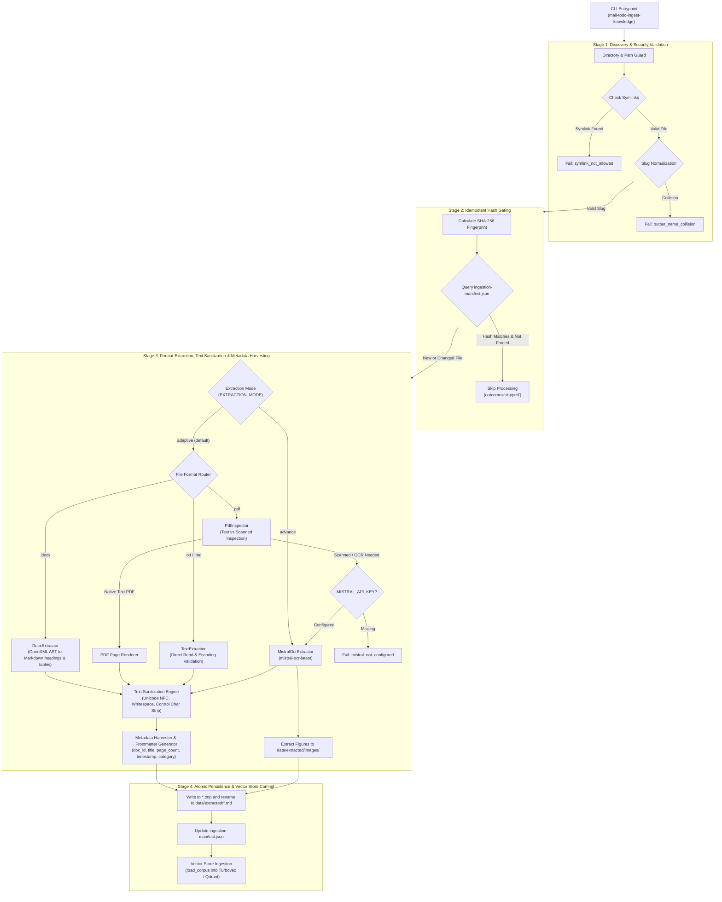
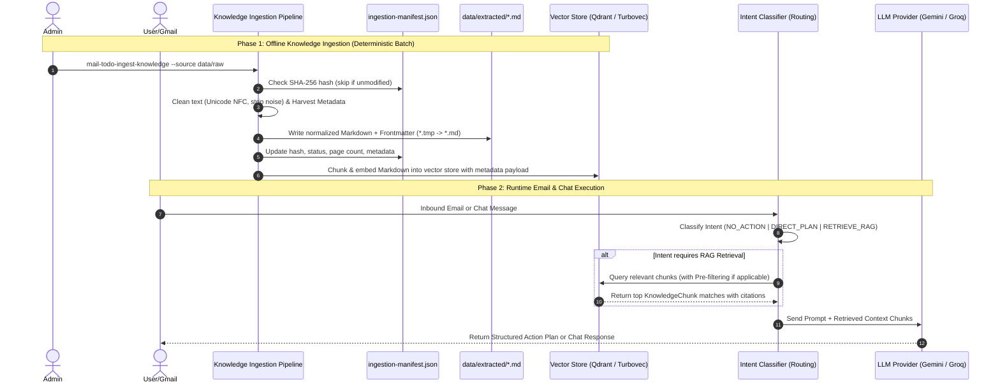
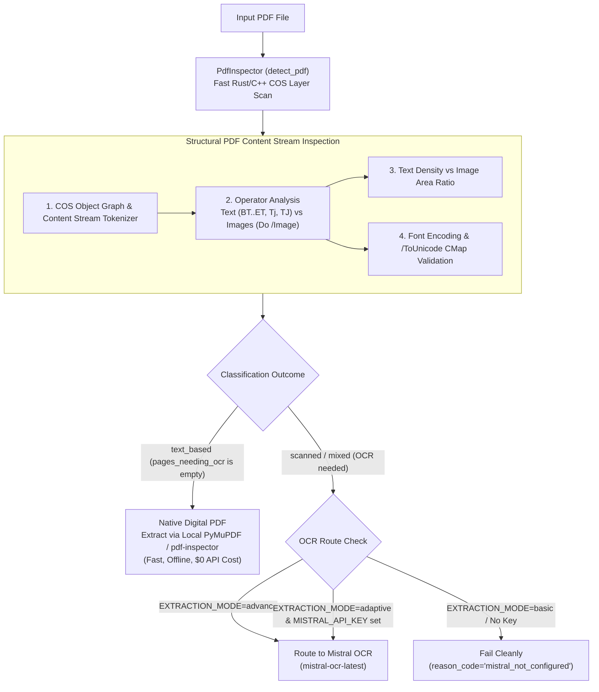

# Ingestion Pipeline Brainstorming & Architecture Reference Board

**Status:** Reference, Study Guide & Optimization Blueprint  
**Location:** `docs/references/ingestion-pipeline-brainstorming.md`  
**Primary Theoretical Reference:** [Simple-RAG.pdf](file:///e:/VIN-INTERNSHIP/EMAIL-AGENT-v1/docs/references/Simple-RAG.pdf) (Phase 1: Indexing & Document Loading)  
**Related Architecture Docs:**  
- [06-knowledge-and-document-ingestion-pipeline.md](file:///e:/VIN-INTERNSHIP/EMAIL-AGENT-v1/docs/architectures/current-architectures/06-knowledge-and-document-ingestion-pipeline.md)
- [01-email-action-plan-and-rag.md](file:///e:/VIN-INTERNSHIP/EMAIL-AGENT-v1/docs/architectures/current-architectures/01-email-action-plan-and-rag.md)
- [02-ai-chat-and-typed-memory.md](file:///e:/VIN-INTERNSHIP/EMAIL-AGENT-v1/docs/architectures/current-architectures/02-ai-chat-and-typed-memory.md)
- [05-rag-architecture.md](file:///e:/VIN-INTERNSHIP/EMAIL-AGENT-v1/docs/architectures/current-architectures/05-rag-architecture.md)

---

## 1. Core Conceptual Foundations & Boundary Invariants

### Q: Is the ingestion pipeline a centralized document ingestion pipeline for Email RAG and Chat with PRD (including LLM + Intent classifier and RAG)? Do they both use the same ingestion pipeline?

### Key Architectural Answers

1. **Shared Company Knowledge Base (Centralized Ingestion):**
   * **Yes**, for enterprise administrator documentation (`.docx`, `.pdf`, `.txt`, `.md`).
   * The central ingestion CLI (`mail-todo-ingest-knowledge`) converts raw company documents into standard Markdown files committed under `data/extracted/*.md`.
   * **Both Email RAG and AI Chat** query the vector index (Qdrant or Turbovec) built from this shared corpus (`data/extracted/*.md`):
     * **Email RAG (Single-Turn):** Queries `data/extracted/*.md` when an incoming email triggers `RETRIEVE_RAG` intent to gather background context for generating Action Plans.
     * **AI Chat (Multi-Turn):** Queries `data/extracted/*.md` as its **Semantic Memory** (Type 4 Memory) to answer user questions using company knowledge.

2. **Project-Scoped User Documents (Decoupled Runtime Ingestion - ADR-007):**
   * **No**, user-uploaded workspace documents do not pass through the central CLI pipeline.
   * User documents are uploaded via `POST /v1/projects/{id}/documents` and extracted at runtime via [`ProjectDocumentExtractor`](file:///e:/VIN-INTERNSHIP/EMAIL-AGENT-v1/src/cowork_agent/integrations/knowledge_ingestion/project_documents.py).
   * These are isolated per user project workspace and used **only in AI Chat** (gated by `USER_DOCUMENTS_ENABLED`).

3. **Emails are Ephemeral and NEVER Ingested (ADR-003):**
   * Raw email bodies and email attachments are ephemeral data.
   * Per security rules, emails are processed only in transient memory during an email evaluation turn and are **never** passed into the document ingestion pipeline or persisted in vector stores.

4. **Vector Store Provider Independence (Turbovec `.tvim` vs Qdrant):**
   * **Turbovec's `.tvim` file and Qdrant's vector collection are completely independent from each other.**
   * They are two alternative implementations of the `SemanticMemoryPort` ([`bootstrap.py`](file:///e:/VIN-INTERNSHIP/EMAIL-AGENT-v1/src/cowork_agent/integrations/rag/bootstrap.py)):
     * If `RAG_STORE_PROVIDER=turbovec`: The app builds an in-process, 4-bit quantized vector index stored locally at `.data/turbovec_index.tvim` ([`turbovec_memory.py`](file:///e:/VIN-INTERNSHIP/EMAIL-AGENT-v1/src/cowork_agent/integrations/rag/turbovec_memory.py)).
     * If `RAG_STORE_PROVIDER` is unset or default (with `QDRANT_ENABLED=true`): The app connects to an external or local Qdrant vector database server collection ([`qdrant.py`](file:///e:/VIN-INTERNSHIP/EMAIL-AGENT-v1/src/cowork_agent/integrations/rag/qdrant.py)).
   * Both stores read from the **same source Markdown files** (`data/extracted/*.md`), but they index and store the text/vector embeddings in completely separate, independent formats. At runtime, the app selects **one active provider** via `RAG_STORE_PROVIDER`, and both Email RAG and AI Chat query that active provider.

---

## 2. Ingestion Pipeline Execution Flow (Deterministic Batch Phase)

The central Document Ingestion Pipeline ([`KnowledgeIngestionService`](file:///e:/VIN-INTERNSHIP/EMAIL-AGENT-v1/src/cowork_agent/integrations/knowledge_ingestion/service.py)) is a **pure extraction and normalization pipeline**. It does **not** run LLMs or Intent Classifiers during document processing.



---

## 3. Ubiquitous Language & Terminology Reference

| Domain Term / Concept | Simple Plain-English Explanation | Code / File Reference | Why It Matters |
| :--- | :--- | :--- | :--- |
| **Ingestion Pipeline** | The offline automated assembly line that converts raw documents (`.pdf`, `.docx`, `.txt`) into standardized Markdown files (`data/extracted/*.md`). | [`service.py`](file:///e:/VIN-INTERNSHIP/EMAIL-AGENT-v1/src/cowork_agent/integrations/knowledge_ingestion/service.py) | Ensures all raw company documents are converted into uniform, clean text that vector search engines can easily read. |
| **Document Loading** | The foundational Phase 1 ETL step in RAG: acquiring raw files, parsing layouts, cleaning noisy text, and harvesting metadata. | [Simple-RAG.pdf](file:///e:/VIN-INTERNSHIP/EMAIL-AGENT-v1/docs/references/Simple-RAG.pdf) §II.2.1 | Garbage in = Garbage out. Clean text & rich metadata are the prerequisite for high-precision retrieval. |
| **Corpus (`data/extracted/*.md`)** | The ground-truth collection of converted Markdown files stored on disk. | `data/extracted/` | Single source of truth for all enterprise knowledge used by both Email RAG and AI Chat. |
| **Manifest Store (`ingestion-manifest.json`)** | A tracking ledger that records file hashes, timestamps, page counts, extractor types, and metadata. | [`manifest.py`](file:///e:/VIN-INTERNSHIP/EMAIL-AGENT-v1/src/cowork_agent/integrations/knowledge_ingestion/manifest.py) | Remembers what files were already ingested so the system skips unchanged files instantly. |
| **Idempotency** | Running the ingestion script 1 time or 100 times produces identical results without duplicate work. | `ManifestStore.should_skip()` in [`manifest.py`](file:///e:/VIN-INTERNSHIP/EMAIL-AGENT-v1/src/cowork_agent/integrations/knowledge_ingestion/manifest.py) | Calculates SHA-256 fingerprints; matching hashes skip extraction immediately. |
| **Unicode Normalization (NFC)** | Converting composite Unicode characters (combining accents) into standard precomposed NFC forms. | `clean_vietnamese_text` ([Simple-RAG.pdf](file:///e:/VIN-INTERNSHIP/EMAIL-AGENT-v1/docs/references/Simple-RAG.pdf) §IV.3) | Critical for Vietnamese/multilingual text: prevents embedding and BM25 token mismatch bugs. |
| **Pre-Filtering (Metadata Filtering)** | Using structured metadata (e.g. `year: 2024`, `category: legal`, `doc_id`) to narrow search space before vector ranking. | [Simple-RAG.pdf](file:///e:/VIN-INTERNSHIP/EMAIL-AGENT-v1/docs/references/Simple-RAG.pdf) §II.2.1 | Avoids searching entire database when user asks about a specific scope (e.g. "Doanh thu năm 2024"). |
| **Atomic Write (`.tmp` $\rightarrow$ `.md`)** | Writing Markdown output to a temporary `.tmp` file first, then atomically renaming it via `os.replace`. | `write_markdown_atomically()` in [`manifest.py`](file:///e:/VIN-INTERNSHIP/EMAIL-AGENT-v1/src/cowork_agent/integrations/knowledge_ingestion/manifest.py) | Guarantees vector indexers running in parallel never read half-written, corrupted files. |
| **PDF Inspection & Page Markers** | Scanning PDF structure to check if text is native/searchable and inserting `<!-- Page N -->` markers. | [`pdf_inspector.py`](file:///e:/VIN-INTERNSHIP/EMAIL-AGENT-v1/src/cowork_agent/integrations/knowledge_ingestion/pdf_inspector.py) | Allows vector search and LLM citations to refer back to exact source page numbers (`[Doc, Page 3]`). |
| **Knowledge Chunk (`KnowledgeChunk`)** | Section-bounded, page-tagged slices of text indexed into vector stores. | [`knowledge_base.py`](file:///e:/VIN-INTERNSHIP/EMAIL-AGENT-v1/src/cowork_agent/integrations/rag/knowledge_base.py) | LLMs cannot digest entire 500-page manuals at once; chunking breaks text into digestible 500-token pieces. |

---

## 4. End-to-End System Separation: Ingestion vs Runtime Execution

| Phase | Subsystem | Responsibility | Component / Implementation |
| :--- | :--- | :--- | :--- |
| **Offline / Batch** | **Document Ingestion Pipeline** | Converts `.docx`/`.pdf`/`.txt` files into `data/extracted/*.md` with metadata and populates vector stores. | [`ingestion_cli.py`](file:///e:/VIN-INTERNSHIP/EMAIL-AGENT-v1/src/cowork_agent/ingestion_cli.py) & [`service.py`](file:///e:/VIN-INTERNSHIP/EMAIL-AGENT-v1/src/cowork_agent/integrations/knowledge_ingestion/service.py) |
| **Runtime Request** | **Email Intent Classifier** | Evaluates incoming Gmail envelope to decide `NO_ACTION`, `DIRECT_PLAN`, or `RETRIEVE_RAG`. | [`routing.py`](file:///e:/VIN-INTERNSHIP/EMAIL-AGENT-v1/src/cowork_agent/features/email_action_plan/routing.py) |
| **Runtime Request** | **Chat Intent Classifier** | Determines tool relevance, user document query eligibility, and semantic memory needs. | [`service.py`](file:///e:/VIN-INTERNSHIP/EMAIL-AGENT-v1/src/cowork_agent/features/ai_chat/intent/service.py) |
| **Runtime Execution** | **Vector Store Retrieval** | Fetches top matching knowledge chunks via Dense (Qdrant/Turbovec) + Sparse (BM25) + Pre-filtering. | [`knowledge_base.py`](file:///e:/VIN-INTERNSHIP/EMAIL-AGENT-v1/src/cowork_agent/integrations/rag/knowledge_base.py) / [`qdrant.py`](file:///e:/VIN-INTERNSHIP/EMAIL-AGENT-v1/src/cowork_agent/integrations/rag/qdrant.py) / [`turbovec_memory.py`](file:///e:/VIN-INTERNSHIP/EMAIL-AGENT-v1/src/cowork_agent/integrations/rag/turbovec_memory.py) |
| **Runtime Generation**| **LLM Action / Reply Generator** | Takes retrieved chunks + prompt to generate structured Action Plans or multi-turn chat replies. | [`workflow.py`](file:///e:/VIN-INTERNSHIP/EMAIL-AGENT-v1/src/cowork_agent/features/email_action_plan/workflow.py) & [`controller.py`](file:///e:/VIN-INTERNSHIP/EMAIL-AGENT-v1/src/cowork_agent/features/ai_chat/controller.py) |



---

## 5. Deep-Dive: Deterministic PDF Inspection & Scanned Page Detection



### The 4 Deterministic Detection Checks Under the Hood
1. **Graphic Operator & Token Analysis:** Evaluates explicit string drawing operators (`BT`..`ET`, `Tj`, `TJ`) vs image XObjects (`/Do` `/Image`).
2. **Text Density vs Image Area Coverage Ratio:** If single bitmap image coverage $>85\%$ with negligible text characters, flags page as scanned (`needs_ocr=True`).
3. **Font Encoding & Unicode CMap Mapping:** Verifies glyph-to-Unicode mapping to prevent unreadable replacement glyphs (`\ufffd`).
4. **Invisible OCR / False-Layer Detection:** Detects low-grade OCR artifacts where invisible text misaligns with underlying scanned images.

---

## 6. ★ Document Loading Optimization Deep-Dive (Grounded in `Simple-RAG.pdf`)

In modern RAG theory ([Simple-RAG.pdf](file:///e:/VIN-INTERNSHIP/EMAIL-AGENT-v1/docs/references/Simple-RAG.pdf) §II.2.1 & §IV.3), **Document Loading** is the single most critical quality gate. If raw data is poorly cleaned or lacks metadata, all downstream phases (Chunking, Embedding, Vector Search, LLM Generation) suffer severe degradation.

```
                    ┌────────────────────────────────────────────────────────┐
                    │          PHASE 1: DOCUMENT LOADING & INGESTION         │
                    └────────────────────────────────────────────────────────┘
                                                │
         ┌──────────────────────────────────────┼──────────────────────────────────────┐
         ▼                                      ▼                                      ▼
┌──────────────────┐                  ┌──────────────────┐                   ┌──────────────────┐
│ 1. Multi-Format  │                  │ 2. Text Cleaning │                   │  3. Metadata     │
│    Acquisition   │                  │   & Normalizing  │                   │    Harvesting    │
├──────────────────┤                  ├──────────────────┤                   ├──────────────────┤
│ • PDF (Text/Scan)│                  │ • Unicode NFC    │                   │ • doc_id / slug  │
│ • DOCX (OpenXML) │  ──────────────► │ • Strip Control C│   ──────────────► │ • page_start/end │
│ • Plain TXT / MD │                  │ • Collapse Space │                   │ • title / header │
│ • Table parsing  │                  │ • Regularize \n  │                   │ • topic/category │
│ • Repack OOXML   │                  │ • Table pipes    │                   │ • published year │
└──────────────────┘                  └──────────────────┘                   └──────────────────┘
                                                                                       │
                                                                                       ▼
                                                                             ┌──────────────────┐
                                                                             │ Output Artifact: │
                                                                             │ Clean Markdown + │
                                                                             │ YAML Frontmatter │
                                                                             └──────────────────┘
```

### 6.1 Pillar 1: Multi-Format Parsing & Layout Fidelity
- **DOCX AST Preservation:** Using `docx_extractor.py` to convert Word paragraph styles into Markdown heading hierarchies (`#`, `##`, `###`), bullet lists (`-`), and pipe tables (`| Col1 | Col2 |`).
- **PDF Layer Extraction:** Using `pdf_inspector.py` to preserve page numbers via `<!-- Page N -->` and extract tables as clean Markdown rather than jumbled columnar text.
- **OOXML Repacking:** Using `normalize_ooxml()` in `ocr.py` to ensure `[Content_Types].xml` is the initial archive entry, preventing 422 errors with cloud OCR providers.

### 6.2 Pillar 2: Text Cleaning & Normalization Engine (Vietnamese & Multilingual)
As demonstrated in [Simple-RAG.pdf](file:///e:/VIN-INTERNSHIP/EMAIL-AGENT-v1/docs/references/Simple-RAG.pdf) §IV.3 (`clean_vietnamese_text`), raw documents frequently suffer from Unicode anomalies, mixed accent encodings, and control character noise:

```python
def sanitize_text(text: str) -> str:
    """Normalize Unicode to NFC, remove non-printable characters, and regularize whitespace."""
    # 1. Unicode NFC Normalization (CRITICAL for Vietnamese accents & token matching)
    text = unicodedata.normalize("NFC", text)
    
    # 2. Strip non-printable / control characters while preserving \n and \t
    text = "".join(
        char for char in text 
        if not unicodedata.category(char).startswith("C") or char in "\n\t"
    )
    
    # 3. Regularize whitespace and multiple empty lines
    text = re.sub(r"[ \t]+", " ", text)
    text = re.sub(r"\n\s*\n+", "\n\n", text)
    return text.strip()
```

> [!IMPORTANT]
> **Why Unicode NFC is a Non-Negotiable Invariant:**  
> In Vietnamese, a character like `ế` can be encoded as a single code point `\u1EBF` (NFC) or as `e` + `\u0302` (circumflex) + `\u0301` (acute) (NFD). If the corpus uses NFD while the user query uses NFC, BPE/WordPiece tokenizers produce completely different token IDs, causing both Dense Embedding cosine similarity and BM25 exact-match scoring to fail drastically!

### 6.3 Pillar 3: Metadata Harvesting & Frontmatter Generation
Raw text alone lacks contextual coordinates. A complete Document Loader extracts both document-level and structural metadata:

```yaml
---
document_id: "01-2021-nd-cp-283247"
title: "Nghị định 01/2021/NĐ-CP về đăng ký doanh nghiệp"
source_file: "01_2021_ND-CP_283247.docx"
extractor: "docx"
page_count: 48
created_at: "2026-08-14T05:00:00Z"
category: "legal_regulation"
year: 2021
---
```

### 6.4 Pillar 4: Why Metadata is Essential for Pre-Filtering
According to [Simple-RAG.pdf](file:///e:/VIN-INTERNSHIP/EMAIL-AGENT-v1/docs/references/Simple-RAG.pdf) §II.2.1:
> *"The role of metadata is extremely important to support Pre-filtering. For example, if the user asks about 'Revenue in 2024', the system uses metadata to filter specifically the documents from 2024 instead of searching the entire knowledge base."*

Pre-filtering provides three immense benefits:
1. **Precision & Elimination of False Positives:** Hard filters ensure non-relevant years/projects are never scored.
2. **Reduced Vector Search Latency:** Qdrant and Turbovec search only over candidate subsets (using payload indexes or allowlist masks).
3. **Grounded Citations:** LLM responses can explicitly cite `[Document Title, Page N, Section M]`.

---

## 7. ★ Codebase Gap Analysis & Target Architecture Comparison

| Dimension | Current EMAIL-AGENT-v1 State | `Simple-RAG.pdf` Best Practice | Target Optimized State |
| :--- | :--- | :--- | :--- |
| **Text Sanitization** | Basic string `.strip()`; no Unicode normalization across DOCX/PDF. | `clean_vietnamese_text`: NFC normalization + control character filter + whitespace collapse. | Central `sanitize_text()` applied across all extractors (`DocxExtractor`, `PdfInspector`, `ProjectDocumentExtractor`). |
| **Supported Formats** | `.docx`, `.pdf` only in central discovery whitelist. | Multi-format inputs (PDF, DOCX, TXT, MD, HTML). | Expand whitelist to support `.txt` and `.md` direct ingestion in central & project extractors. |
| **Metadata in Corpus** | Raw Markdown with `# Heading` only; no frontmatter or document metadata headers. | Rich metadata extraction (`doc_id`, `title`, `year`, `author`, `pages`, `category`). | Emit YAML frontmatter at the top of every `data/extracted/*.md` file. |
| **Page Marker Handling** | `<!-- Page N -->` inserted into Markdown, but ignored by `load_corpus()` in `knowledge_base.py`. | Page coordinates propagated to each chunk for precise citation and retrieval bounds. | `load_corpus()` parses page comments into `KnowledgeChunk.page_start` & `page_end`. |
| **Manifest Metadata** | Technical tracking only (`source`, `sha256`, `status`, `output`, `extractor`, `page_count`). | Rich metadata tracking for pre-filtering and auditability. | Record `title`, `category`, and extracted attributes in `ingestion-manifest.json`. |
| **Pre-Filtering in Vector Stores** | Qdrant filters only on `document_status`; Turbovec has no metadata filter. | Dynamic metadata pre-filtering on `document_id`, `category`, `year`, `page_range`. | Expose metadata filter keys (`document_id`, `category`, `year`) in `SemanticRetrievalRequest.filters`. |

---

## 8. ★ Scope of Impact: Code Files, Documents & Tests Matrix

When implementing the Document Loading optimizations, the following files and modules will be touched:

### A. Documentation & Architecture References
- [docs/references/ingestion-pipeline-brainstorming.md](file:///e:/VIN-INTERNSHIP/EMAIL-AGENT-v1/docs/references/ingestion-pipeline-brainstorming.md): Main reference board for ingestion design & optimizations.
- [docs/references/reference-document-loading-and-ingestion.md](file:///e:/VIN-INTERNSHIP/EMAIL-AGENT-v1/docs/references/reference-document-loading-and-ingestion.md): Updated with text sanitization formulas and metadata schemas.
- [docs/architectures/current-architectures/06-knowledge-and-document-ingestion-pipeline.md](file:///e:/VIN-INTERNSHIP/EMAIL-AGENT-v1/docs/architectures/current-architectures/06-knowledge-and-document-ingestion-pipeline.md): Synchronized to reflect text sanitization and frontmatter metadata pipeline.

### B. Ingestion Subsystem Source Files (`src/cowork_agent/integrations/knowledge_ingestion/`)
- [`service.py`](file:///e:/VIN-INTERNSHIP/EMAIL-AGENT-v1/src/cowork_agent/integrations/knowledge_ingestion/service.py):
  - Integrate `sanitize_text()` into pipeline execution.
  - Expand `_SUPPORTED_SUFFIXES` to include `.txt`, `.md`.
  - Coordinate metadata harvesting and frontmatter writing.
- [`docx_extractor.py`](file:///e:/VIN-INTERNSHIP/EMAIL-AGENT-v1/src/cowork_agent/integrations/knowledge_ingestion/docx_extractor.py):
  - Sanitize extracted paragraph/table text with Unicode NFC.
  - Extract document core properties (`title`, `author`, `created`).
- [`pdf_inspector.py`](file:///e:/VIN-INTERNSHIP/EMAIL-AGENT-v1/src/cowork_agent/integrations/knowledge_ingestion/pdf_inspector.py):
  - Sanitize native text pages with Unicode NFC and control character stripping.
  - Extract PDF metadata dictionary (`Title`, `Author`, `CreationDate`).
- [`project_documents.py`](file:///e:/VIN-INTERNSHIP/EMAIL-AGENT-v1/src/cowork_agent/integrations/knowledge_ingestion/project_documents.py):
  - Apply `sanitize_text()` to user-uploaded project documents.
  - Support `.txt` and `.md` file uploads.
- [`models.py`](file:///e:/VIN-INTERNSHIP/EMAIL-AGENT-v1/src/cowork_agent/integrations/knowledge_ingestion/models.py):
  - Define `DocumentMetadata` contract (`title`, `category`, `year`, `author`, `page_count`).
  - Update `ExtractionResult` and `ManifestEntry` to carry metadata attributes.
- [`manifest.py`](file:///e:/VIN-INTERNSHIP/EMAIL-AGENT-v1/src/cowork_agent/integrations/knowledge_ingestion/manifest.py):
  - Update `_ENTRY_FIELDS` and serialization to preserve extracted metadata attributes in `ingestion-manifest.json`.

### C. RAG & Chunking Subsystem Source Files (`src/cowork_agent/integrations/rag/`)
- [`knowledge_base.py`](file:///e:/VIN-INTERNSHIP/EMAIL-AGENT-v1/src/cowork_agent/integrations/rag/knowledge_base.py):
  - Parse YAML frontmatter metadata in `load_corpus()`.
  - Parse `<!-- Page N -->` comments to propagate `page_start` and `page_end` into `KnowledgeChunk`.
- [`markdown_chunking.py`](file:///e:/VIN-INTERNSHIP/EMAIL-AGENT-v1/src/cowork_agent/integrations/rag/markdown_chunking.py):
  - Ensure page numbers and section headers propagate seamlessly across paragraph boundaries.
- [`qdrant.py`](file:///e:/VIN-INTERNSHIP/EMAIL-AGENT-v1/src/cowork_agent/integrations/rag/qdrant.py):
  - Store metadata payload (`page_start`, `page_end`, `category`, `year`, `document_id`).
  - Create payload keyword indexes for pre-filtering.
- [`turbovec_memory.py`](file:///e:/VIN-INTERNSHIP/EMAIL-AGENT-v1/src/cowork_agent/integrations/rag/turbovec_memory.py):
  - Add metadata filtering support to candidate allowlist generation.

### D. Verification Test Suites (`tests/`)
- `tests/unit/integrations/knowledge_ingestion/test_service.py`: Unit tests for text sanitization, format expansion, and metadata frontmatter generation.
- `tests/unit/integrations/knowledge_ingestion/test_docx_extractor.py`: Tests for Unicode NFC and table cleaning in Word documents.
- `tests/unit/integrations/knowledge_ingestion/test_pdf_inspector.py`: Tests for PDF text cleaning and page comment integrity.
- `tests/integration/test_knowledge_ingestion_to_rag.py`: End-to-end test verifying ingested Markdown + Frontmatter is parsed and indexed into Qdrant/Turbovec with full metadata.

---

## 9. Actionable Evolution Roadmap

```md
[Phase 1: Ingestion Sanitization & Metadata Engine]
  1.1 Create text_sanitizer utility (Unicode NFC, control char stripping, whitespace collapse).
  1.2 Integrate sanitizer into DocxExtractor, PdfInspector, ProjectDocumentExtractor.
  1.3 Add YAML Frontmatter generation to KnowledgeIngestionService.

[Phase 2: Corpus Loading & Page Coordinate Propagation]
  2.1 Upgrade load_corpus() in knowledge_base.py to parse YAML frontmatter and <!-- Page N --> comments.
  2.2 Attach page_start, page_end, and metadata attributes to KnowledgeChunk domain objects.

[Phase 3: Vector Store Payload & Pre-Filtering]
  3.1 Index metadata fields in QdrantSemanticMemory payload (document_id, category, page_range, year).
  3.2 Add allowlist metadata filtering to TurbovecSemanticMemory.
  3.3 Validate with full test suite: uv run pytest.
```