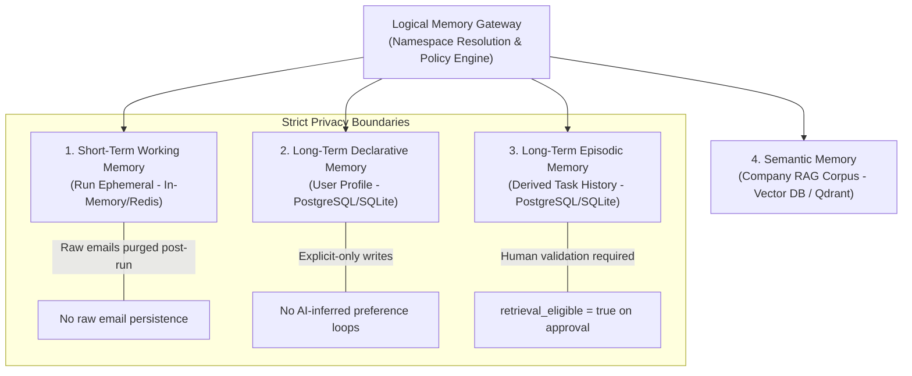
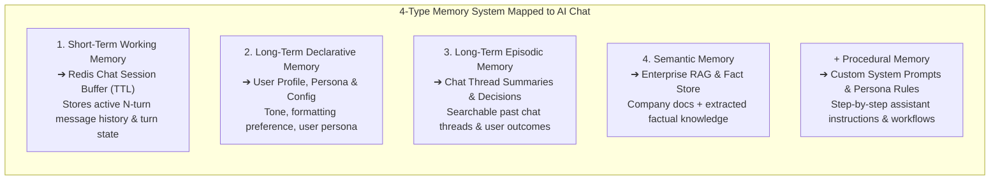
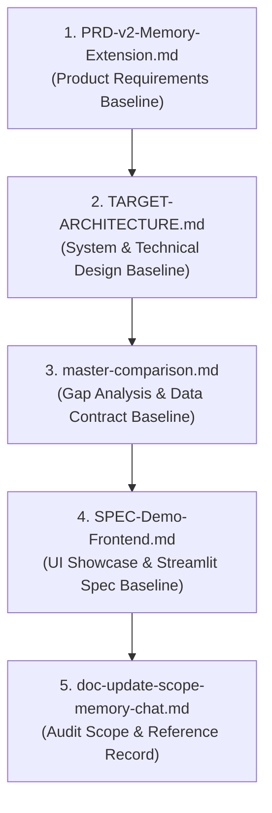

# Comprehensive Analysis: Memory System Features, Frontend Demo Specs, & AI Chat Compatibility

> [!CAUTION]
> **CRITICAL REVISION CONTEXT & SPECIFICATION ALIGNMENT NOTE**:
> **Primary Purpose of Memory System**: The user has explicitly clarified that **the 4-Type Memory System is intended to support AI Chat features**, **NOT Email features**.
> **Status of Email RAG**: The Email RAG feature is mostly completed, functioning in the frontend, and **does NOT require the memory system**.
> **Document Status**: The current PRD-v2, Target Architecture, and Frontend Spec contained a major requirement misalignment by binding Memory to Email Action Planning instead of AI Chat. This document serves as the audit baseline for realigning project documentation (PRDs, Target Architecture, Specs).

> [!IMPORTANT]
> **Executive Summary & Core Question Answer**:
> **Does the Memory System in the PRD support regular AI chat (like ChatGPT) out-of-the-box?**
> **NO.** In its current specification ([PRD-v2-Memory-Extension.md](file:///E:/VIN-INTERNSHIP/EMAIL-AGENT-v1/docs/PRD-v2-Memory-Extension.md), [TARGET-ARCHITECTURE.md](file:///E:/VIN-INTERNSHIP/EMAIL-AGENT-v1/docs/architectures/TARGET-ARCHITECTURE.md), and [SPEC-Demo-Frontend.md](file:///E:/VIN-INTERNSHIP/EMAIL-AGENT-v1/docs/SPEC-Demo-Frontend.md)), the system misattributes memory to a **deterministic, asynchronous Email-to-Action-Plan batch pipeline** (triggered by `@Email`). 
> 
> As clarified, **the 4-Type Memory System architecture (Working, Declarative Profile, Episodic, Semantic RAG) MUST be decoupled from Email and realigned as the foundation for the AI Chat Assistant**, requiring document audits and specification updates.

---

## 1. How the Memory System Architecture Works (PRD-v2 & Target Architecture)

The system categorizes memory into **four distinct, typed memory domains** ([PRD-v2-Memory-Extension.md §7](file:///E:/VIN-INTERNSHIP/EMAIL-AGENT-v1/docs/PRD-v2-Memory-Extension.md#L7); [TARGET-ARCHITECTURE.md §5](file:///E:/VIN-INTERNSHIP/EMAIL-AGENT-v1/docs/architectures/TARGET-ARCHITECTURE.md#L5)). Each operates under strict data privacy boundaries and read/write access policies:



### The 4 Memory Pillars

| Memory Type | Definition & Purpose | Primary Storage | Write & Privacy Policy |
|---|---|---|---|
| **1. Short-Term Working Memory** | Ephemeral runtime state created per execution run (`run_id`). Holds normalized envelopes, classifier output, RAG chunks, candidate action plans. | Redis / In-Memory (TTL) | **Strict Ephemerality**: Raw email bodies and full prompt contexts are purged immediately upon run completion ([AGENTS.md](file:///E:/VIN-INTERNSHIP/EMAIL-AGENT-v1/AGENTS.md) Invariant 1). |
| **2. Long-Term Declarative Memory** | Explicit, durable user preferences (language, timezone, formatting style, priority rules, manager/colleague roles). | PostgreSQL (`user_profile`) / SQLite | **Explicit-Only Writes**: Populated *only* via manual UI configuration or explicit user commands ("remember this preference"). Auto-inference from raw emails is forbidden ([PRD-v2 §FR-04](file:///E:/VIN-INTERNSHIP/EMAIL-AGENT-v1/docs/PRD-v2-Memory-Extension.md)). |
| **3. Long-Term Episodic Memory** | Derived task history and experience tracking (task titles, paraphrases, action plans, Gmail deep links). | PostgreSQL (`task_episode`) / SQLite | **Human-Gated Eligibility**: System-generated episodes default to `retrieval_eligible = false`. They become eligible *only* when a human clicks `Approve` or `Complete` in the UI ([PRD-v2 §FR-08](file:///E:/VIN-INTERNSHIP/EMAIL-AGENT-v1/docs/PRD-v2-Memory-Extension.md)). |
| **4. Semantic Memory (Company RAG)** | Enterprise-wide declarative domain knowledge (SOPs, governance, technical guides, templates). | Qdrant Vector DB + BM25 Hybrid Index | **Read-Only Agent Core**: Accessed via `SemanticMemoryPort` only when classifier sets `route = RETRIEVE_RAG`. Raw emails are never ingested into company RAG ([TARGET-ARCHITECTURE.md §6](file:///E:/VIN-INTERNSHIP/EMAIL-AGENT-v1/docs/architectures/TARGET-ARCHITECTURE.md#L6)). |

> [!NOTE]
> **Note on Procedural Memory**: Standard cognitive architecture includes "Procedural Memory" (how-to rules & skills). In PRD-v2, procedural rules are enforced deterministically via hard policy guards and backend schemas rather than a dynamic, user-writeable memory store.

### Hybrid Retrieval & Fusion Pipeline

Semantic Memory retrieval utilizes a hybrid dense-sparse vector pipeline ([master-comparison.md §1.12](file:///E:/VIN-INTERNSHIP/EMAIL-AGENT-v1/docs/master-comparison.md)):
1. **Tenant ACL Pre-Filter**: Filters chunks by `tenant_id` and document permissions before scoring.
2. **Dense Vector Search + Lexical BM25 Keyword Search**: Evaluated concurrently over document chunks.
3. **Reciprocal Rank Fusion (RRF, $k=60$)**: Merges dense and sparse result lists into a single ranked list.
4. **Jina Reranking**: Optional reranker layer refines top-k relevance scores.
5. **Context Precedence Enforcement**:
   $$\text{Current User Instruction} > \text{Company RAG Policy} > \text{Stored Preference} > \text{Approved Prior Episode}$$

---

## 2. How Memory Features are Demoed in the Frontend ([SPEC-Demo-Frontend.md](file:///E:/VIN-INTERNSHIP/EMAIL-AGENT-v1/docs/SPEC-Demo-Frontend.md))

The frontend demo is built with **Streamlit** ([gui/app.py](file:///E:/VIN-INTERNSHIP/EMAIL-AGENT-v1/src/cowork_agent/gui/app.py)) and organized into 6 core screens. Memory features are delivered across two milestones:

```text
Streamlit Navigation Structure (SPEC-Demo-Frontend.md §5):
├── 1. Connect        (Gmail OAuth & Mailbox Status)
├── 2. Run            (@Email invocation & live pipeline execution)
├── 3. Tasks          (Task List → Detail Cards with Citations & Action Buttons)
├── 4. Knowledge      [Increment A]: RAG Corpus Status, Chunk Search & Ad-hoc Grounded Query
├── 5. Memory         [Increment B]: User Preferences Editor | Episode Provenance | Deletion UI
└── 6. Run audit      (Route & Telemetry Summary, Latencies, Dev-Gated Traces)
```

### Key Memory Inspector & UI Components

1. **Knowledge Screen (`4. Knowledge`) — Semantic RAG Inspection**:
   * **Corpus Readiness Indicator**: Real-time health badge (**Green "Ready"**, **Amber "Degraded"**, **Red "Unavailable"**).
   * **Loaded Document List**: Shows ingested files, titles, chunk counts, and source links.
   * **Ad-hoc Grounded RAG Query Input (`POST /v1/mail-todo/knowledge/chat`)**: A single-turn query panel to test document retrieval. It renders answers with **relevance scores**, **reranker status**, and clickable **Citation Chips**.
   > [!CAUTION]
   > `POST /v1/mail-todo/knowledge/chat` is an **ad-hoc RAG corpus testing panel**, NOT a multi-turn conversational AI chatbot!

2. **Memory Screen (`5. Memory`) — Declarative & Episodic Inspection**:
   * **Preferences Profile Editor**: Editable form for explicit user preferences (language, output style, priority rules, key contacts).
   * **Task Validation Badges & Lifecycle Controls**: Per-task buttons (`Approve`, `Complete`, `Reject`) and status badges (`system_generated`, `user_approved`, `completed`, `rejected`). Shows `retrieval_eligible` toggle.
   * **Episode Provenance Inspector**: Detailed metadata panel showing model ID, prompt version, pipeline version, and Gmail deep link.
   * **Memory Effect Inspector**: Toggle/side-by-side view comparing generated plan outputs **with vs. without** memory context, along with a **preference-application indicator** showing how stored rules altered the output.
   * **Deletion Controls**: Interface to delete individual preferences, specific task episodes, or purge all memory with confirmation dialogs.

3. **Strict Constraints**:
   * **No Client Mocks**: Pure API client talking to FastAPI backend ([SPEC-Demo-Frontend.md §2 Rule 1](file:///E:/VIN-INTERNSHIP/EMAIL-AGENT-v1/docs/SPEC-Demo-Frontend.md#L2)).
   * **No Raw Prompt/Context Visualizer**: Raw email bodies and full prompts are strictly hidden from the UI to protect user privacy ([SPEC-Demo-Frontend.md §2 Rule 3](file:///E:/VIN-INTERNSHIP/EMAIL-AGENT-v1/docs/SPEC-Demo-Frontend.md#L2)).

---

## 3. Email Agent vs. Regular AI Chat (ChatGPT-style) Comparison

| Architectural Dimension | Email Task Agent (Current Scope) | Regular AI Chat (ChatGPT-style) |
|---|---|---|
| **Trigger & Interaction** | Event/Batch driven via `@Email` invocation | Interactive multi-turn dialogue with real-time token streaming |
| **Short-Term Context** | Single run (`run_id`), deleted immediately post-execution | Multi-turn chat session buffer (`session_id`) retained across dialogue turns |
| **Episodic Memory Entry** | Derived from task outputs; strictly human-gated (`retrieval_eligible=true` only on approval) | Ingests conversational turn summaries & user decisions across chat history |
| **Preference Learning** | Explicit UI/Command configuration only | Automatic extraction of facts & user preferences from chat messages |
| **API Endpoints** | `/v1/mail-todo/runs`, `/v1/tasks` | `/v1/cowork/chat/sessions`, `/v1/cowork/chat/sessions/{id}/messages` (SSE) |

---

## 4. Extending the 4-Type Memory System to Support Regular AI Chat

To support standard AI chat alongside the Email agent, the 4-type memory primitives map directly as follows:



### Required Architecture & Document Extensions

To enable regular AI Chat in the codebase, the following additions would be made across the architecture:

1. **New Backend Chat Controllers & Streaming**: Add an SSE-capable conversational event loop alongside the batch email runner ([TARGET-ARCHITECTURE.md §2](file:///E:/VIN-INTERNSHIP/EMAIL-AGENT-v1/docs/architectures/TARGET-ARCHITECTURE.md#L2)).
2. **REST API Extensions**:
   * `POST /v1/cowork/chat/sessions` — Create a new chat session
   * `POST /v1/cowork/chat/sessions/{session_id}/messages` — Multi-turn SSE streaming message endpoint
   * `GET /v1/cowork/chat/sessions/{session_id}/messages` — Fetch conversation turn history
   * `GET/PUT /v1/memory/procedural/rules` — Manage assistant instructions & persona rules
3. **Namespace Expansion**: Expand `Logical Memory Gateway` namespace filter from `feature: email_action_plan` to support `feature: general_chat` ([PRD-v2 §FR-02](file:///E:/VIN-INTERNSHIP/EMAIL-AGENT-v1/docs/PRD-v2-Memory-Extension.md)).
4. **Frontend Chat Screen**: Add a 7th screen (`7. AI Chat Assistant`) to [SPEC-Demo-Frontend.md](file:///E:/VIN-INTERNSHIP/EMAIL-AGENT-v1/docs/SPEC-Demo-Frontend.md) featuring `st.chat_input`, session sidebars, inline memory recall badges, and grounded RAG citations.

---

*Analysis produced by Antigravity AI Team via parallel research dispatches:*
   * [[Memory Architecture Researcher Log]](conversation://56db9d13-9c38-47a0-a92c-610883d8d25b)*
* [[Frontend Memory Demo Researcher Log]](conversation://6ab0a642-3882-4012-83ba-697f9e13dd34)*
* [[AI Chat & Memory Support Researcher Log]](conversation://b4ee4e64-7295-433f-a368-c65da62cfff7)*

---

## 5. Documentation Update Roadmap & File-by-File Modification Specifications

> [!IMPORTANT]
> **ROADMAP OBJECTIVE & SCOPE REALIGNMENT**:
> The 4-Type Memory System architecture (Working Memory, Declarative Profile, Episodic Memory, Semantic RAG) is being realigned from a standalone batch Email runner (`feature: email_action_plan`) to power a primary **Multi-Turn AI Chat Assistant** (`feature: ai_chat`).
> In this target architecture:
> 1. **Email RAG operates as a stateless executable Tool/Skill (`@Email`)** callable inside the AI Chat Assistant thread.
> 2. **Chat Memory Engine automatically persists conversation turns and `@Email` Action Plan outputs** into Short-Term Working Memory (`session_id`) and Long-Term Episodic Memory (`validation_status = system_generated`, `retrieval_eligible = false` until human-validated in chat).
> 3. **Raw email content remains 100% ephemeral**, never entering durable episodic, declarative, or semantic memory.

---

### 5.1 Ordered Sequence of Documentation Updates & Rationale

Documentation must be updated in a strict top-down dependency sequence to maintain architectural consistency across PRDs, technical designs, contract specifications, and frontend specifications:



| Order | Document | Rationale for Sequence Position |
|---|---|---|
| **1** | `PRD-v2-Memory-Extension.md` | **Product Baseline**: Defines foundational product goals, user stories, privacy boundaries, memory type definitions, namespace keys (`feature: ai_chat`, `session_id`), and acceptance criteria. All downstream architecture and contracts depend on PRD requirements. |
| **2** | `TARGET-ARCHITECTURE.md` | **Technical Baseline**: Translates updated PRD requirements into technical architecture diagrams, component layers (Chat Controller, SSE Handler, `@Email` Skill Tool), data flow pipelines, state ownership tables, and service APIs. |
| **3** | `master-comparison.md` | **Contract & Migration Baseline**: Updates current-vs-target gap analysis, technical data contracts (`ChatMessageRequest`, `ChatMessageStreamEvent`, `MemoryContextRequest`, `TaskEpisode`), component recommendations (Keep/Modify/Add/Remove), and milestone breakdowns (`V2-M1`..`V2-M6`). |
| **4** | `SPEC-Demo-Frontend.md` | **UI/UX Baseline**: Re-arranges Streamlit information architecture (making AI Chat Assistant Screen 1), specifies in-chat `@Email` tool invocation, inline task lifecycle controls (`Approve`/`Complete`/`Reject`), and chat memory transparency badges. |
| **5** | `doc-update-scope-memory-chat.md` | **Audit Baseline**: Persists the complete audit log, exact line ranges, and comprehensive change inventory across all project docs for engineering team reference. |

---

### 5.2 File-by-File Exact Modification Specifications

---

#### 1. `PRD-v2-Memory-Extension.md`

* **Target File**: [PRD-v2-Memory-Extension.md](file:///E:/VIN-INTERNSHIP/EMAIL-AGENT-v1/docs/PRD-v2-Memory-Extension.md)
* **Primary Scope**: Decouple 4-Type Memory from standalone Email Action Planning; re-target Memory Gateway to serve AI Chat Assistant; reframe `@Email` as an in-chat executable tool.

| Section Heading & Number | Line Range | Exact Changes Required |
|---|---|---|
| **Title & Metadata Table** | `L1-16` | **Modify Title**: Change to *"Cowork Agent — Memory Extension for AI Chat Assistant & Executable `@Email` Tool"*. <br>**Modify Table**: Update product target to reflect AI Chat Assistant as primary memory owner. |
| **§1. Executive Summary** | `L19-60` | **Reframe Context**: State explicitly that PRD-v2 decouples Memory from standalone Email RAG and assigns it to Multi-Turn AI Chat. Define `@Email` as an in-chat executable tool skill. <br>**Update Flow**: Update memory lifecycle sequence to: `User Chat Message → Memory Context Assembly (Profile + Episodic + RAG + Working Buffer) → LLM Response / Tool Trigger → Execute @Email Skill (if invoked) → Render Action Plan Card in Chat Thread → Record Turn & Episode → Delete Ephemeral Email Payload`. |
| **§2. Product Hypothesis** | `L62-79` | **Modify Hypothesis**: Shift focus to multi-turn conversational AI Chat. Memory improves chat continuity, preference adherence, persona alignment, and cross-session task context. Retain raw email ephemerality invariant. |
| **§3. Problem Statement** | `L80-96` | **Reframe Problem**: A stateless chat assistant forgets user preferences, previous chat decisions, enterprise RAG documents, and past `@Email` tool execution plans across chat sessions. |
| **§4. V2 Goal & Value Loop** | `L97-114` | **Replace Value Loop**: Change `@Email` standalone run diagram to AI Chat interaction loop with `@Email` tool execution and in-chat Action Plan card rendering. |
| **§5. Goals** | `L116-136` | **Re-scope Goals 1–13**: <br>1. Memory Gateway for AI Chat.<br>2. Namespace supporting `feature: ai_chat` and `session_id`.<br>3. Multi-turn Chat Working Memory.<br>4. Profile for chat persona & user preferences.<br>5. Store `@Email` Action Plans as Chat Episodic records.<br>6. In-chat task validation controls (`Approve`/`Complete`/`Reject`).<br>7. Preserve raw email ephemerality during tool execution. |
| **§6. Non-Goals** | `L137-158` | **Add Non-Goals**: Standalone Email pipeline memory integration (Email pipeline remains memory-free); background auto-ingestion of emails into memory; autonomous email sending. |
| **§7. Memory Types Table** | `L159-169` | **Update Table Definitions**: <br>• **Short-term**: Active chat session turn history (`session_id`) + transient `@Email` tool state.<br>• **Long-term Declarative**: User persona, language, tone, explicit preferences.<br>• **Episodic**: Chat conversation thread summaries + derived `@Email` Action Plan outputs.<br>• **Semantic**: Enterprise document corpus accessible via RAG in chat. |
| **§8. Core User Stories** (`US-01`..`US-08`) | `L170-205` | **Rewrite Stories**: <br>• *US-01/02*: Chat assistant follows stored persona & preferences across chat sessions.<br>• *US-03/04/05/06*: Execute `@Email` inside chat, see rendered Action Plan, approve/complete it so it becomes retrievable episodic memory for future chat questions.<br>• *US-08*: Raw emails fetched via `@Email` tool remain strictly ephemeral and excluded from durable storage. |
| **§9. Memory Architecture Diagram** | `L207-230` | **Modify Diagram**: Replace "Agent Core (Email)" block with **"AI Chat Controller"**. Add **"`@Email` Executable Skill / Tool"** block connected as a tool called by Chat Controller. |
| **§10. Memory Principles** | `L234-248` | **Modify Principle 6 & 8**: Principle 6: Raw email content accessed via `@Email` tool is strictly transient. Principle 8: Scoped to `tenant_id`, `user_id`, `session_id`, and `feature: ai_chat`. |
| **§11. Functional Requirements** (`FR-01`..`FR-18`) | `L249-623` | **Update FRs**: <br>• **FR-01**: Memory Gateway serves Chat Controller.<br>• **FR-02**: Key format changed to `tenant_id / user_id / session_id / feature: ai_chat / memory_type / record_id`. Mandatory `session_id`.<br>• **FR-03/04**: Add chat persona/style fields (response brevity, tone, default tool permissions).<br>• **FR-06**: Episodic task writes record chat summaries and `@Email` tool Action Plans (`system_generated`, `retrieval_eligible = false`).<br>• **FR-12**: Context assembler builds prompt for Chat LLM: `System Persona + Compact Profile + Validated Episodic Hits + RAG Chunks + Working Memory (Active Session Buffer)`. |
| **§12. User Approval and Completion** | `L625-664` | **Modify Controls**: Specify that approval/completion/rejection controls are rendered directly on `@Email` Action Plan components inside the Chat Thread UI. |
| **§16. Acceptance Criteria** | `L748-773` | **Reframe Criteria**: Validate (1) Chat Controller consumes Memory Gateway, (2) `@Email` executes as an in-chat tool, (3) Rendered Action Plans are saved as `system_generated` episodes, (4) In-chat approval enables episodic retrieval, (5) Raw emails remain absent from durable storage. |
| **§17. Delivery Milestones** (`V2-M1`..`V2-M6`) | `L775-824` | **Update Milestones**: Re-align `V2-M1` through `V2-M6` to deliver Chat Session Working Memory, Chat Profile Store, Chat Episodic Store, SSE Chat Controller, and `@Email` Tool integration. |
| **§21. Baseline Summary** | `L883-900` | **Replace Summary**: Update execution trace to reflect user chat message, context assembly, `@Email` tool invocation, Action Plan card rendering, turn recording, and raw email purging. |

---

#### 2. `TARGET-ARCHITECTURE.md`

* **Target File**: [TARGET-ARCHITECTURE.md](file:///E:/VIN-INTERNSHIP/EMAIL-AGENT-v1/docs/architectures/TARGET-ARCHITECTURE.md)
* **Primary Scope**: Restructure Entry, Control, Tool, and Memory Planes to center on `Chat API Controller`, `Streaming SSE Handler`, `Chat Session Buffer`, and `@Email Skill Tool Adapter`.

| Section Heading & Number | Line Range | Exact Changes Required |
|---|---|---|
| **Header & §1. Product and Architecture Hypothesis** | `L1-46` | **Reframe Hypothesis**: Update target architecture to **AI Chat Assistant with Executable `@Email` Tool & 4-Type Memory System**. Update primary use case to multi-turn conversational chat with memory and tool invocation. |
| **§2. Overall Production Architecture** | `L48-230` | **Update Architecture Diagram (§2)**:<br>1. **Entry Plane**: Replace `@Email Command` entry with **`AI Chat Client / UI`** connecting to **`Chat API Controller`** via **`Streaming SSE Handler`**.<br>2. **Control Plane**: Introduce **`Chat Controller & Orchestrator`** that owns chat session state, calls Memory Gateway, and invokes LLMs/Tools.<br>3. **Tool Plane**: Add **"`@Email` Skill / Tool Adapter"**. When invoked, it executes the standalone Email RAG pipeline (Email Reader → Classifier → Email RAG → Action Plan Generator) statelessly.<br>4. **Memory Plane**: Connect Memory Gateway to `Chat Controller`. Short-Term Memory stores `Chat Session Buffer` (`session_id`). Episodic Memory stores validated chat turns & approved Action Plans. |
| **§3. Email Module Architecture** | `L231-341` | **Re-position Email Module**: Position Email Module as a backend component wrapped by the `@Email` Skill Tool. Emphasize that execution is triggered via Chat Controller and returns formatted Action Plan DTO to the active chat session. |
| **§4. Agent Core and Intent Classifier Architecture** | `L342-502` | **Divide Operational Modes**: <br>1. **Chat Controller Event Loop**: Multi-turn dialogue handling, context assembly, tool routing (detecting `@Email` invocation), SSE token streaming.<br>2. **`@Email` Tool Pipeline**: The existing deterministic email classification, RAG retrieval, and Action Plan generation pipeline (retained from V1-M4). |
| **§5. Four-Type Memory System Architecture** | `L503-659` | **Update Memory Architecture**:<br>• Re-draw diagram showing Memory Gateway serving `Chat Controller`.<br>• **Short-Term Memory**: Redis / In-memory TTL storing `session_id` turn history + active tool execution state.<br>• **Long-Term Profile**: `user_profile` table storing user persona and assistant rules.<br>• **Episodic Memory**: `task_episode` table storing chat summaries and tool-generated Action Plans (`system_generated`).<br>• Update namespace key format: `tenant_id / user_id / session_id / feature: ai_chat / memory_type / record_id`. |
| **§7. Agent and Memory Interaction Flow** | `L785-840` | **Replace Interaction Flow**: <br>`User Chat Message → Chat Controller → Read Memory (Profile + Episodic + RAG) → LLM Assistant → [Detect @Email Tool Call] → Execute @Email Pipeline → Render Action Plan Card to SSE Stream → Write Chat Turn & Task Episode (system_generated) → Purge Raw Email State`. |
| **§8. State Ownership Table** | `L843-857` | **Add Component Ownership Rows**: Add rows for `Chat Controller` (owns chat session turns, SSE connection), `Chat Session Buffer` (owns short-term turn history), and `@Email Tool` (owns transient email fetch state). |
| **§10. Suggested Internal Service APIs** | `L950-1001` | **Add Chat API Endpoints**:<br>• `POST /v1/cowork/chat/sessions` (Create chat session)<br>• `POST /v1/cowork/chat/sessions/{session_id}/messages` (SSE streaming chat message)<br>• `GET /v1/cowork/chat/sessions/{session_id}/messages` (Get conversation history)<br>• `POST /v1/cowork/tools/email` (Internal execution endpoint for `@Email` tool)<br>Update internal events to include `chat.message.received`, `chat.tool.invoked`, `chat.message.completed`. |
| **§16. Architecture Principles** | `L1293-1325` | **Update Principles**: Principle 1: Chat Controller owns session orchestration; `@Email` is an executable tool skill. Principle 5: Raw email remains transient tool execution data, never durable memory. |
| **§17 & §19. Implementation Order & Baseline Summary** | `L1327-1384` | **Update Implementation Summary**: Reflect Chat Controller, SSE Streaming, Chat Memory Engine, and `@Email` Tool integration order. |

---

#### 3. `master-comparison.md`

* **Target File**: [master-comparison.md](file:///E:/VIN-INTERNSHIP/EMAIL-AGENT-v1/docs/master-comparison.md)
* **Primary Scope**: Update current-vs-target gap analysis, add multi-turn Chat contracts, reframe component recommendations, and update milestones (`V2-M1`..`V2-M6`).

| Section Heading & Number | Line Range | Exact Changes Required |
|---|---|---|
| **§0. Alignment Decision** | `L20-77` | **Add Alignment Decision**: Update execution target: Standalone Email RAG is completed as a stateless service (V1-M1..M4); PRD-v2 Memory System is assigned to power the **AI Chat Assistant**, with `@Email` integrated as an executable chat skill. |
| **Step 2. Current vs Authoritative Target Gap Table** | `L201-236` | **Add/Modify Gap Rows**: <br>• Add row: `AI Chat Controller` (Missing → Add Chat Controller & SSE streaming handler).<br>• Add row: `Chat Session Working Memory` (Missing → Add Redis/In-memory Chat Session Buffer).<br>• Add row: `@Email Chat Skill Tool` (Missing → Wrap Email RAG pipeline as executable chat tool).<br>• Modify row: `Memory Gateway` (Re-route namespace and policy engine to serve Chat Controller). |
| **Step 4. Recommended Changes (Keep/Modify/Add/Remove)** | `L374-437` | **Modify Recommendations**:<br>• **Keep**: Standalone Email RAG pipeline, Gmail OAuth adapter, Hybrid Semantic RAG.<br>• **Modify**: Memory Gateway (serve Chat API), Episodic Store (store chat turns & tool outputs).<br>• **Add**: Chat API Controller, SSE Streaming Handler, Chat Session Working Memory (`session_id`), `@Email` Skill Tool Wrapper, In-Chat Task Validation UI. |
| **Step 5. Target Diagrams** (Diagrams 1–5) | `L440-600` | **Modify Diagrams**:<br>• **Diagram 1 (Control & Execution Flow)**: Show Chat Client → Chat Controller → Memory Gateway & LLM → `@Email` Tool Execution → Render Action Plan Card.<br>• **Diagram 3 (Four-Type Memory)**: Show Memory Gateway serving Chat Controller with `Chat Session Buffer` as Working Memory.<br>• **Diagram 5 (Migration Order)**: Show V1-M1..M4 (Email RAG baseline) → V2-M1..M6 (Chat Memory Engine & Tool Integration) → DEMO (Streamlit Chat Frontend). |
| **Step 6. Target-Aligned Contracts** | `L601-915` | **Add/Modify Contracts**:<br>• **Add**: `ChatMessageRequest` (`session_id`, `user_message`, `tool_choices`).<br>• **Add**: `ChatMessageStreamEvent` (SSE event shape: delta, tool_call, tool_output, memory_citation).<br>• **Modify `MemoryContextRequest`**: Add `session_id: string`, update `feature: ai_chat`.<br>• **Modify `TaskEpisode`**: Add `chat_session_id`, `chat_turn_id`, `source_tool: "@Email"`. |
| **Step 7. Final Change Plan & Milestones** | `L918-1307` | **Update Milestone Definitions**:<br>• `V1-M1..M4` & `V1-H`: Retain as completed/hardened standalone Email RAG baseline.<br>• `V2-M1`: Memory Gateway & Chat Session Working Memory (`feature: ai_chat`, `session_id`).<br>• `V2-M2`: Long-Term Declarative Profile Store for AI Chat persona & user config.<br>• `V2-M3`: Chat Turn & `@Email` Action Plan Episodic Persistence (`system_generated`, `retrieval_eligible=false`).<br>• `V2-M4`: AI Chat Controller, SSE Streaming Handler, and `@Email` Skill Tool Execution.<br>• `V2-M5`: Selective Episodic & RAG Retrieval for Multi-Turn AI Chat Dialogue.<br>• `V2-M6`: Memory Evaluation & Governance for AI Chat.<br>• `DEMO`: Streamlit AI Chat Showcase with embedded `@Email` Tool Execution & Memory Panels. |

---

#### 4. `SPEC-Demo-Frontend.md`

* **Target File**: [SPEC-Demo-Frontend.md](file:///E:/VIN-INTERNSHIP/EMAIL-AGENT-v1/docs/SPEC-Demo-Frontend.md)
* **Primary Scope**: Restructure Streamlit demo navigation hierarchy to make `1. AI Chat Assistant` the primary screen; integrate `@Email` as an in-chat tool card; add chat memory transparency badges.

| Section Heading & Number | Line Range | Exact Changes Required |
|---|---|---|
| **Header & §1. Purpose** | `L1-29` | **Re-align Purpose & Value Loop**: Change value loop to:<br>`Connect Gmail → Open AI Chat Assistant → Multi-turn Chat / Invoke @Email Tool → See rendered Action Plan in Chat Thread → Approve/Complete in Chat → Observe Memory Context active in Chat`. |
| **§2. Positioning and hard rules** | `L30-46` | **Add Rules**: Retain all hard privacy rules. Add rule that AI Chat UI uses standard streaming SSE / polling client logic and renders tool execution outputs as structured embedded components. |
| **§3. Delivery structure** (Increments A & B) | `L47-71` | **Restructure Increments**:<br>• **Increment A (Core Chat & Email Tool)**:<br>  - `AI Chat Assistant`: Chat thread UI (`st.chat_message`, `st.chat_input`), session sidebar, message history.<br>  - `@Email` Skill Execution: In-chat tool trigger that runs Email RAG and renders Action Plan cards with citation chips directly inside the chat thread.<br>  - `Connect` & `Knowledge` screens (retained for connection status & corpus inspection).<br>• **Increment B (Chat Memory & Transparency)**:<br>  - `Preferences`: Explicit user profile editor.<br>  - `In-Chat Task Controls`: Inline `Approve` / `Complete` / `Reject` buttons on `@Email` Action Plan components.<br>  - `Memory Transparency`: In-chat memory recall badges showing active profile rules and retrieved episodic hits used by the assistant. |
| **§5. Information architecture** | `L85-95` | **Re-organize Streamlit Navigation Hierarchy**:<br>```text<br>Cowork Demo<br>├── 1. AI Chat Assistant  (Primary Screen: Multi-turn Chat, @Email tool trigger, inline Action Plan cards)<br>├── 2. Connect            (Gmail OAuth & Mailbox Connection management)<br>├── 3. Knowledge          (RAG Corpus Readiness & Document Inspection)<br>├── 4. Memory             (Preferences Profile Editor, Episode Provenance, Deletion)<br>└── 5. Run audit          (Chat & Tool Telemetry, Latency, SSE Stream Debug)<br>``` |
| **§6. UX and quality bar** | `L97-132` | **Add Chat UX Guidelines**: (1) `st.chat_message` for user and assistant, (2) Smooth streaming token updates or `st.status` tool execution indicators, (3) Formatted card container for `@Email` Action Plan outputs with expandable citation details, (4) In-thread memory recall indicators. |
| **§7. Backend API contract assumptions** | `L133-152` | **Add Chat Endpoints to API Inventory**:<br>• `POST /v1/cowork/chat/sessions`<br>• `POST /v1/cowork/chat/sessions/{session_id}/messages` (SSE)<br>• `GET /v1/cowork/chat/sessions/{session_id}/messages`<br>• In-chat Task transition endpoints. |
| **§8. Acceptance criteria** | `L153-186` | **Reframe Acceptance Criteria**:<br>• *Increment A*: User can chat with AI Assistant; invoking `@Email` triggers tool pipeline and renders Action Plan with citation chips in chat thread; duplicate clicks send idempotency key; raw email never rendered.<br>• *Increment B*: Preferences profile editable; in-chat approval/completion updates episode status and enables episodic memory recall in subsequent chat messages; memory transparency badges display active context sources. |
| **§9. Live verification plan** | `L187-212` | **Update Verification Plan**: Update verification steps to test multi-turn chat session creation, `@Email` tool invocation inside chat, rendering Action Plan card, approving task in chat, and verifying episodic memory recall in next message turn. |

---

*Synthesis completed by Antigravity AI Team.*

