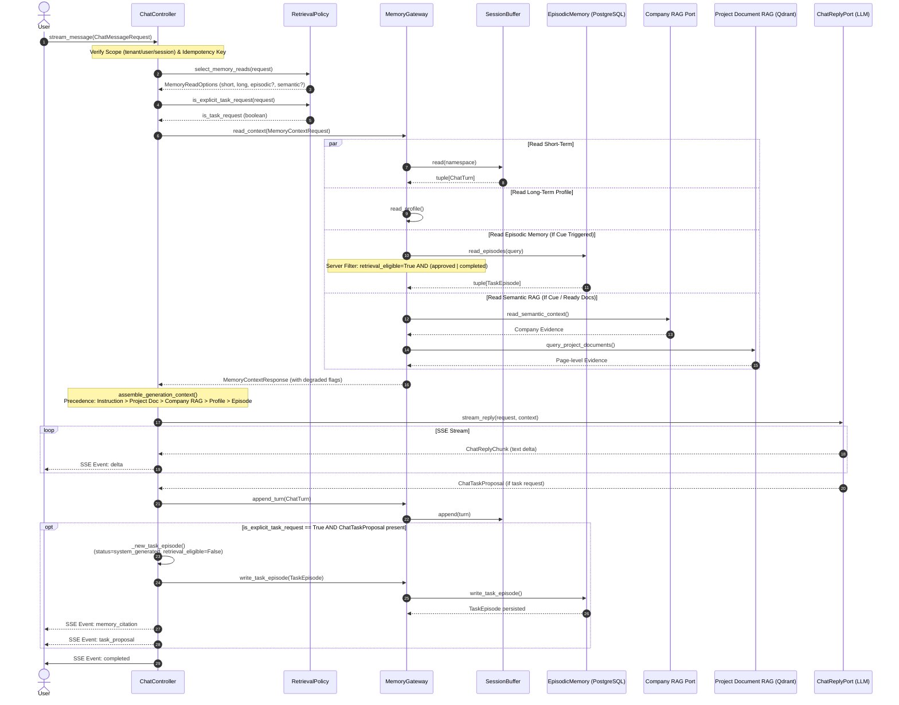
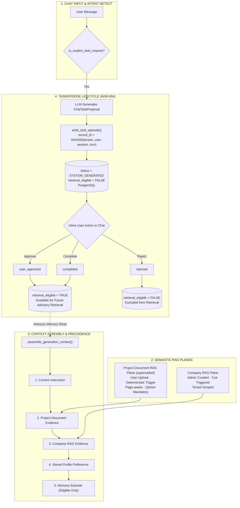
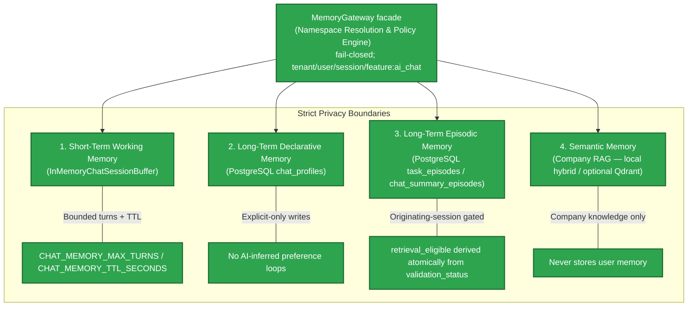
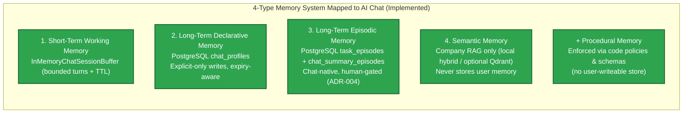

# Comprehensive Analysis: Memory System Features, Frontend Demo Specs, & AI Chat Compatibility

> Updated 2026-08-11: reflects completed V2-M1..V2-M6 backend memory system; frontend demo separate.

> [!CAUTION]
> **DOCUMENT REALIGNMENT — COMPLETED**:
> **Primary Purpose of Memory System**: The 4-Type Memory System is implemented to support **AI Chat features**, **NOT Email features**. The documentation realignment originally demanded by this page has been executed (PRD-v2 v2.2, ADR-004, TARGET-ARCHITECTURE.md).
> **Status of Email RAG**: The standalone Email RAG feature (PRD-v1) remains completed, functional, and **memory-free by design**. <span style="color: #2ea44f; font-weight: bold;">[IMPLEMENTED]</span>
> **Status of AI Chat Memory**: The full 4-Type Memory System (Working, Declarative Profile, Episodic, Semantic RAG) plus governance (observability, retention, purge, deletion, backup/restore, evaluation) is implemented and accepted as of V2-M6 (2026-08-11). <span style="color: #2ea44f; font-weight: bold;">[IMPLEMENTED]</span>

> [!IMPORTANT]
> **Executive Summary & Implementation Status Overview**:
> **Does the Memory System serve regular AI chat (like ChatGPT)?**
> **YES.** The 4-Type Memory System architecture (Working, Declarative Profile, Episodic, Semantic RAG) has been decoupled from Email and is implemented as the foundation for the AI Chat Assistant. ADR-004 supersedes earlier PRD-v2 decisions that bound memory to `@Email` Action Plans.
>
> **Codebase Implementation Status Summary (2026-08-11)**:
> - <span style="color: #2ea44f; font-weight: bold;">[IMPLEMENTED]</span>: Stateless Email RAG Pipeline (`/v1/mail-todo/runs`, `/v1/tasks`), Local Hybrid RAG Corpus Inspection (`/v1/mail-todo/knowledge/*`), 5-Screen Streamlit Frontend (Connect, Run, Tasks, Knowledge, Audit), **and** the full AI Chat memory stack: `MemoryGateway` facade, `InMemoryChatSessionBuffer`, PostgreSQL `chat_profiles` / `task_episodes` / `chat_summary_episodes`, SSE `ChatController` + typed stream events, deterministic retrwieval policy, `MemoryPurgeCoordinator`, paired evaluation runner with launch gate, `LoggingMemoryOperationSink` + `MemoryOperationMetrics`.
> - <span style="color: #cb2431; font-weight: bold;">[NOT IMPLEMENTED — BY DESIGN]</span>: In-chat `@Email` executable tool (retired by ADR-004; chat-native `TaskEpisode` replaces it), automatic chat-facts extraction (explicit-only writes are a deliberate policy, not a gap), Redis-backed working memory (in-memory buffer is the accepted MVP tier).
> - <span style="color: #d97706; font-weight: bold;">[IN PROGRESS — SEPARATE WORKSTREAM]</span>: Streamlit `Memory` and `AI Chat Assistant` demo screens. The backend chat APIs they will consume are implemented.

---

## 1. AI Chat Memory Workflow, Lifecycle, & "When is RAG vs. When is Memory?"

Based on [TARGET-ARCHITECTURE.md](file:///E:/VIN-INTERNSHIP/EMAIL-AGENT-v1/docs/architectures/TARGET-ARCHITECTURE.md) (§1, §4, §5, §6, §20, §21), [ADR-004](file:///E:/VIN-INTERNSHIP/EMAIL-AGENT-v1/tasks/adr/ADR-004-chat-native-task-episodes.md), and source code in [`src/cowork_agent/features/ai_chat/`](file:///E:/VIN-INTERNSHIP/EMAIL-AGENT-v1/src/cowork_agent/features/ai_chat/), this section defines the conceptual boundary between Memory and RAG, details the 8-step AI Chat turn execution lifecycle, specifies data lifecycles across typed memory domains, and presents sequence/flowchart diagrams.

---

### 1.1 Conceptual & Operational Boundary: "When is RAG vs. When is Memory?"

The AI Chat Assistant interacts with two distinct state paradigms: **Memory Systems** (stateful, user-centric operational state) and **RAG Retrieval Planes** (external evidence/knowledge providers).

*   **Memory System (Types 1–3)**: Owned by the Chat Controller (`feature: ai_chat`) to sustain multi-turn dialogue context, user preferences, and user-authorized task outcomes across turns and sessions. Memory represents **typed, privacy-bounded, stateful user state** governed by strict namespace rules (`tenant_id / user_id / session_id / feature: ai_chat / memory_type / record_id`) and human-gated validation lifecycle states (`system_generated`, `user_approved`, `completed`, `rejected`).
*   **RAG Retrieval Planes (Type 4 & Extension)**: Represent **read-only external semantic context providers** that search and retrieve grounded document evidence (company policies or uploaded project documents) into LLM generation context. RAG is accessed exclusively through read-only ports (`SemanticChatMemoryPort` and `ProjectDocumentPort`). The Chat Controller **never performs direct writes to RAG knowledge bases**.

#### Memory vs. RAG Comparative Matrix

| Feature Dimension | Memory System (Types 1–3: Working, Profile, Episodic) | Company RAG Plane (Type 4 Semantic) | Project Document RAG Plane (superseded §21 extension) |
|---|---|---|---|
| **Data Nature** | Bounded turns, explicit preferences, body-free task summaries | Unstructured enterprise SOPs, policies, templates | Unstructured user uploads (PDF, DOCX) with page-aware chunking |
| **Ownership Scope** | User / Session (`tenant_id`, `user_id`, `session_id`, `feature: ai_chat`) | Workspace Administrator (`tenant_id`) | Uploading User (`tenant_id`, `user_id`, `project_id`, `document_id`) |
| **Storage Engine** | In-Memory/Redis (Working), PostgreSQL `user_profile` (Declarative), PostgreSQL `task_episode` (Episodic) | Qdrant / Local hybrid BM25 + dense index (`data/extracted/`) | Dedicated Project-Document Qdrant Collection (Qdrant **mandatory**) |
| **Read Trigger** | Working & Profile: **Every turn**; Episodic: **Selective** (cue phrase / intent match) | **Selective** (cue match: "company policy", "procedure") | **Deterministic** on every turn when project has `ready` documents |
| **Write Mechanism** | Controller turn append (Working); Explicit UI/command (Profile); Explicit task request + proposal (Episodic) | Offline administrator CLI (`load_corpus`) | Runtime multipart REST upload (`POST /documents`) + background job (Mistral OCR) |
| **Copy / Citation Rules** | Body-free metadata only. Citations store coordinates without copying chunk text | Read-only context provider; copied chunks **forbidden** from entering TaskEpisodes | Read-only context provider; page-level citations (`page_start`, `page_end`) |
| **Failure Behavior** | Fails closed or degrades gracefully (`degraded: true`); chat turn continues | Returns empty semantic context (`degraded: true`); chat proceeds without company docs | Returns empty context with `degraded: true`; chat states document evidence unavailable |

---

### 1.2 The 4 Memory Types & 2 RAG Retrieval Planes

#### The 4 Memory Types
1.  **Short-Term Session Working Memory**: Active conversation turn history (`session_id`). Managed by [`InMemoryChatSessionBuffer`](file:///E:/VIN-INTERNSHIP/EMAIL-AGENT-v1/src/cowork_agent/features/ai_chat/session_buffer.py#L21-L87). Enforces newest-N turns (max 8 turns in generation context) with sliding inactivity TTL (`CHAT_MEMORY_TTL_SECONDS`).
2.  **Long-Term Declarative Memory**: Explicit user preferences (language, tone, brevity, timezone, priority rules). Stored in PostgreSQL `user_profile` via [`profile_policy.py`](file:///E:/VIN-INTERNSHIP/EMAIL-AGENT-v1/src/cowork_agent/features/ai_chat/profile_policy.py#L1-L45). Written **only** via explicit user action (`MemoryGateway.write_profile`); passive AI inference is strictly forbidden.
3.  **Long-Term Episodic Memory**: Structured chat-native `TaskEpisode` records and chat summaries stored in PostgreSQL `task_episode` via [`episode_policy.py`](file:///E:/VIN-INTERNSHIP/EMAIL-AGENT-v1/src/cowork_agent/features/ai_chat/episode_policy.py#L55-L140). Created **only** after explicit user task requests ("create an action plan"). Initial status `system_generated` + `retrieval_eligible = False`.
4.  **Semantic Memory**: Enterprise domain knowledge accessed via [`SemanticChatMemoryPort`](file:///E:/VIN-INTERNSHIP/EMAIL-AGENT-v1/src/cowork_agent/features/ai_chat/ports.py#L1-L50). Read-only; contains zero user state.

#### The 2 RAG Retrieval Planes
1.  **Company RAG Plane**: Tenant-wide workspace knowledge (`tenant_id`). Ingested offline via CLI (`load_corpus`) into local hybrid/Qdrant index. Selective read trigger based on cue phrases (`_SEMANTIC_CUES`: "company policy", "procedure").
2.  **Project Document RAG Plane (superseded; see [TARGET-ARCHITECTURE §21](file:///E:/VIN-INTERNSHIP/EMAIL-AGENT-v1/docs/architectures/TARGET-ARCHITECTURE.md#L1580-L1856))**: User workspace documents scoped by `tenant_id + user_id + project_id + document_id`. Uploaded via REST API, processed asynchronously via `PdfInspector`, `DocxExtractor`, Mistral OCR, and page-aware chunker (`<!-- Page N -->`). **Qdrant is mandatory**. Deterministic read trigger on every turn whenever the project contains `ready` documents.

---

### 1.3 AI Chat Turn Execution Lifecycle (8 Sequential Steps)

Every user chat turn executed by [`ChatController.stream_message()`](file:///E:/VIN-INTERNSHIP/EMAIL-AGENT-v1/src/cowork_agent/features/ai_chat/controller.py#L165-L350) follows a deterministic 8-step lifecycle:

```text
[Step 1: Request Entry & Scope Verification]
                 ↓
[Step 2: Intent Check & Selective Memory Read Selection]
                 ↓
[Step 3: Concurrent Memory Fetch via MemoryGateway]
                 ↓
[Step 4: Generation Context Assembly & Conflict Precedence]
                 ↓
[Step 5: LLM Stream Generation (SSE Deltas)]
                 ↓
[Step 6: Short-Term Turn Persistence]
                 ↓
[Step 7: Task Episode Proposal & Idempotent Persistence]
                 ↓
[Step 8: Inline User Approval & Lifecycle Transitions]
```

1.  **Request Entry & Scope Verification**: `ChatMessageRequest` arrives at `ChatController`. [`InMemoryChatSessionRegistry.require()`](file:///E:/VIN-INTERNSHIP/EMAIL-AGENT-v1/src/cowork_agent/features/ai_chat/controller.py#L116-L128) validates `tenant_id` and `user_id`. `session_id` is verified against controller scope. Idempotency keys check for completed replays or pending task retries.
2.  **Intent Check & Memory Read Selection**: [`select_memory_reads(request)`](file:///E:/VIN-INTERNSHIP/EMAIL-AGENT-v1/src/cowork_agent/features/ai_chat/retrieval_policy.py#L66-L95) analyzes the prompt for cue words (`_EPISODIC_CUES` and `_SEMANTIC_CUES`). [`is_explicit_task_request(request)`](file:///E:/VIN-INTERNSHIP/EMAIL-AGENT-v1/src/cowork_agent/features/ai_chat/retrieval_policy.py#L98-L154) checks for task directive verbs (`create`, `make`, `draft`, `prepare`) without negation.
3.  **Concurrent Memory Fetch via MemoryGateway**: [`MemoryGateway.read_context()`](file:///E:/VIN-INTERNSHIP/EMAIL-AGENT-v1/src/cowork_agent/features/ai_chat/memory_gateway.py#L82-L216) queries active memory ports concurrently. Server-side episodic filter strictly enforces `episode.retrieval_eligible == True` AND `validation_status IN {USER_APPROVED, COMPLETED}`. Unconfigured or failing stores set `degraded = True` without raising exceptions.
4.  **Generation Context Assembly & Conflict Precedence**: [`assemble_generation_context()`](file:///E:/VIN-INTERNSHIP/EMAIL-AGENT-v1/src/cowork_agent/features/ai_chat/generation_context.py#L66-L106) combines fetched memory into labeled sections (`LabeledSection`). **Conflict Precedence** ([`generation_context.py:58-63`](file:///E:/VIN-INTERNSHIP/EMAIL-AGENT-v1/src/cowork_agent/features/ai_chat/generation_context.py#L58-L63)) strictly resolves overlap:
    $$\text{Current Instruction} > \text{Project Document Evidence} > \text{Company RAG Evidence} > \text{Stored Profile Preference} > \text{Advisory Episode}$$
5.  **LLM Stream Generation**: `ChatController` invokes [`reply.stream_reply()`](file:///E:/VIN-INTERNSHIP/EMAIL-AGENT-v1/src/cowork_agent/features/ai_chat/controller.py#L226-L243) and streams SSE events (`delta`, `message_completed`). If a task request was active, the LLM produces a structured [`ChatTaskProposal`](file:///E:/VIN-INTERNSHIP/EMAIL-AGENT-v1/src/cowork_agent/features/ai_chat/ports.py#L28-L40).
6.  **Short-Term Turn Persistence**: Upon complete assistant response, `ChatController` appends the `ChatTurn` to `InMemoryChatSessionBuffer` via `MemoryGateway.append_turn()`.
7.  **Task Episode Proposal & Persistence**: If `is_explicit_task_request` is True and `ChatTaskProposal` is present, `ChatController` constructs a body-free `TaskEpisode` with SHA-256 `record_id`, `validation_status = SYSTEM_GENERATED`, and `retrieval_eligible = False`. Writes to PostgreSQL via `MemoryGateway.write_task_episode()`, and emits `memory_citation` and `task_proposal` SSE events.
8.  **Inline User Approval & Lifecycle Transitions**: In UI task card, user clicks `Approve`, `Complete`, or `Reject`. [`build_task_episode_transition()`](file:///E:/VIN-INTERNSHIP/EMAIL-AGENT-v1/src/cowork_agent/features/ai_chat/episode_policy.py#L104-L139) atomically derives `retrieval_eligible`:
    *   `SYSTEM_GENERATED` $\rightarrow$ `USER_APPROVED` / `COMPLETED` sets `retrieval_eligible = True` (eligible for future episodic retrieval).
    *   `SYSTEM_GENERATED` $\rightarrow$ `REJECTED` sets `retrieval_eligible = False` (permanently ineligible for retrieval).

---

### 1.4 Data Lifecycle of Each Memory Domain

*   **Short-Term Working Memory**: Created on first turn append in session. Updated on each turn; retains newest N turns and refreshes sliding inactivity TTL. Expired records auto-swept during reads/appends ([`session_buffer.py:39-87`](file:///E:/VIN-INTERNSHIP/EMAIL-AGENT-v1/src/cowork_agent/features/ai_chat/session_buffer.py#L39-L87)).
*   **Long-Term Declarative Profile**: Created/Updated **only** via explicit user configuration or explicit instructions (`authorize_profile_write`, [`profile_policy.py:1-45`](file:///E:/VIN-INTERNSHIP/EMAIL-AGENT-v1/src/cowork_agent/features/ai_chat/profile_policy.py#L1-L45)). Deleted explicitly per field or full user profile.
*   **Episodic TaskEpisode**: Created as `system_generated` + `retrieval_eligible = False`. Lifecycle transitions (`USER_APPROVED`, `COMPLETED`, `REJECTED`) atomically control eligibility. Retention defaults to 90 days (`CHAT_EPISODE_RETENTION_SECONDS`). Body-free contract: zero raw email/attachment/transcript text ([`TARGET-ARCHITECTURE.md:1498-1539`](file:///E:/VIN-INTERNSHIP/EMAIL-AGENT-v1/docs/architectures/TARGET-ARCHITECTURE.md#L1498-L1539)).
*   **Semantic RAG Planes**: Company RAG is static corporate knowledge managed via admin CLI. Project Document RAG follows runtime status machine `received -> extracting -> indexing -> ready` (or `failed`), defaults to 30-day retention, and cascades deletion across object store, extracted text, and Qdrant points ([`TARGET-ARCHITECTURE.md:1830-1860`](file:///E:/VIN-INTERNSHIP/EMAIL-AGENT-v1/docs/architectures/TARGET-ARCHITECTURE.md#L1830-L1860)).

---

### 1.5 Mermaid Workflows & Sequence Diagrams

#### Sequence Diagram: Chat Turn Execution & Memory / RAG Interactivity



#### Flowchart: TaskEpisode Lifecycle & Memory Data Flow



---

## 2. How the Memory System Architecture Works (PRD-v2 v2.2, ADR-004)

The system categorizes memory into **four distinct, typed memory domains** ([PRD-v2-Memory-Extension.md](file:///E:/VIN-INTERNSHIP/EMAIL-AGENT-v1/docs/PRD-v2-Memory-Extension.md); [TARGET-ARCHITECTURE.md](file:///E:/VIN-INTERNSHIP/EMAIL-AGENT-v1/docs/architectures/TARGET-ARCHITECTURE.md)). Each operates under strict data privacy boundaries and read/write access policies:



### The 4 Memory Pillars

| Memory Type | Definition & Purpose | Primary Storage | Write & Privacy Policy | Implementation Status |
|---|---|---|---|---|
| **1. Short-Term Working Memory** | Active chat session turn history (`session_id`). Bounded by `CHAT_MEMORY_MAX_TURNS` (default 20) and `CHAT_MEMORY_TTL_SECONDS` (default 1800) via `ChatMemorySettings`. | In-memory `InMemoryChatSessionBuffer` ([session_buffer.py](file:///E:/VIN-INTERNSHIP/EMAIL-AGENT-v1/src/cowork_agent/features/ai_chat/session_buffer.py)) | **Strict Ephemerality**: Raw email bodies and full prompt contexts are never held here. Buffer is bound to verified session scope. | <span style="color: #2ea44f; font-weight: bold;">[IMPLEMENTED]</span> |
| **2. Long-Term Declarative Memory** | Explicit, durable user preferences (language, timezone, formatting style, priority rules). Expiry-aware reads with default-profile fallback on outage. | PostgreSQL `chat_profiles` via `PostgresChatProfileRepository` ([postgres.py](file:///E:/VIN-INTERNSHIP/EMAIL-AGENT-v1/src/cowork_agent/persistence/repositories/postgres.py)) | **Explicit-Only Writes**: Populated *only* via `MemoryGateway.write_profile`. Auto-inference from raw emails or chat is forbidden. | <span style="color: #2ea44f; font-weight: bold;">[IMPLEMENTED]</span> |
| **3. Long-Term Episodic Memory** | Chat-native `TaskEpisode` created **only** after an explicit user task request (finite deterministic grammar). Initial status `system_generated` + `retrieval_eligible=false`. Stable opaque `record_id` derived from `(tenant, user, session, turn)` for retry-safe idempotency. Originating-session approve/complete/reject transitions atomically derive eligibility. Also: `chat_summary_episodes` for bounded chat summaries. Raw email/transcript/tool fields structurally excluded. | PostgreSQL `task_episodes` and `chat_summary_episodes` via `PostgresTaskEpisodeRepository` ([postgres.py](file:///E:/VIN-INTERNSHIP/EMAIL-AGENT-v1/src/cowork_agent/persistence/repositories/postgres.py)); ADR-004 | **Human-Gated Eligibility**: Approval/completion sets `retrieval_eligible = true`; rejection keeps it false. Eligible-only retrieval (approved/completed, unexpired, same tenant/user/feature). | <span style="color: #2ea44f; font-weight: bold;">[IMPLEMENTED]</span> |
| **4. Semantic Memory (Company RAG)** | Enterprise-wide declarative domain knowledge (SOPs, governance, technical guides, templates). **Never stores user memory.** Citation allowlisting enforced. | Local hybrid BM25 + dense + RRF + optional Jina reranker ([hybrid.py](file:///E:/VIN-INTERNSHIP/EMAIL-AGENT-v1/src/cowork_agent/integrations/rag/hybrid.py)); optional Qdrant | **Read-Only Company Knowledge**: Accessed only when relevant per retrieval policy. Raw emails are never ingested into company RAG. | <span style="color: #2ea44f; font-weight: bold;">[IMPLEMENTED]</span> |

> [!NOTE]
> **Note on Procedural Memory**: Standard cognitive architecture includes "Procedural Memory" (how-to rules & skills). In PRD-v2, procedural rules are enforced deterministically via hard policy guards and backend schemas rather than a dynamic, user-writeable memory store. <span style="color: #2ea44f; font-weight: bold;">[IMPLEMENTED via Code Policies]</span>

### Context Precedence

The generation context assembler ([generation_context.py](file:///E:/VIN-INTERNSHIP/EMAIL-AGENT-v1/src/cowork_agent/features/ai_chat/generation_context.py)) enforces:

$$\text{Current User Instruction} > \text{Current Company Evidence} > \text{Stored Preferences} > \text{Advisory Episodes}$$

<span style="color: #2ea44f; font-weight: bold;">[IMPLEMENTED]</span>

### Hybrid Retrieval & Fusion Pipeline

Semantic Memory retrieval utilizes a hybrid dense-sparse vector pipeline:
1. **Tenant ACL Pre-Filter**: Filters chunks by `tenant_id` and document permissions before scoring. <span style="color: #2ea44f; font-weight: bold;">[IMPLEMENTED — LOCAL_TENANT_ID]</span>
2. **Dense Vector Search + Lexical BM25 Keyword Search**: Evaluated concurrently over document chunks. <span style="color: #2ea44f; font-weight: bold;">[IMPLEMENTED — bm25.py / embeddings.py]</span>
3. **Reciprocal Rank Fusion (RRF, $k=60$)**: Merges dense and sparse result lists into a single ranked list. <span style="color: #2ea44f; font-weight: bold;">[IMPLEMENTED — rrf.py]</span>
4. **Jina Reranking**: Optional reranker layer refines top-k relevance scores. <span style="color: #2ea44f; font-weight: bold;">[IMPLEMENTED — jina_reranker.py]</span>

### Selective Retrieval Policy

The retrieval policy ([retrieval_policy.py](file:///E:/VIN-INTERNSHIP/EMAIL-AGENT-v1/src/cowork_agent/features/ai_chat/retrieval_policy.py)) applies deterministic intent-based selection: episodic reads only when relevant, bounded result counts, eligible-only (approved/completed, unexpired, same tenant/user/feature). <span style="color: #2ea44f; font-weight: bold;">[IMPLEMENTED]</span>

### V2-M6 Governance Layer

V2-M6 (completed 2026-08-11) adds a cross-cutting governance layer over the four memory pillars:

| Concern | Implementation | Key Files |
|---|---|---|
| **Observability** | `MemoryOperationEvent` (metadata-only, 8 fields, validated bounds); production `LoggingMemoryOperationSink` + thread-safe `MemoryOperationMetrics` injected into every `MemoryGateway` at app startup. DENIED outcomes log at ERROR as alertable safety incidents. Sink failure can never block chat. Zero hard-safety counters enforced: unvalidated retrieval, cross-tenant access, raw-email memory violation, rejected-episode retrieval, expired-record retrieval. | [memory_observability.py](file:///E:/VIN-INTERNSHIP/EMAIL-AGENT-v1/src/cowork_agent/features/ai_chat/memory_observability.py), [app.py](file:///E:/VIN-INTERNSHIP/EMAIL-AGENT-v1/src/cowork_agent/app.py) |
| **Retention** | `compute_expires_at` applies `CHAT_EPISODE_RETENTION_SECONDS` / `CHAT_PROFILE_RETENTION_SECONDS` (product-approved default 90 days = 7776000s, documented in `.env.example`). `ChatController` computes expiry once per request and reuses on retry for idempotency. Expired records are unreadable before physical purge. | [retention.py](file:///E:/VIN-INTERNSHIP/EMAIL-AGENT-v1/src/cowork_agent/features/ai_chat/retention.py), [.env.example](file:///E:/VIN-INTERNSHIP/EMAIL-AGENT-v1/.env.example) |
| **Purge** | `MemoryPurgeCoordinator` + `scripts/purge_chat_memory.py` — explicit infrastructure entry point only (NO scheduler, not a product feature). Emits purge telemetry. | [retention.py](file:///E:/VIN-INTERNSHIP/EMAIL-AGENT-v1/src/cowork_agent/features/ai_chat/retention.py), [purge_chat_memory.py](file:///E:/VIN-INTERNSHIP/EMAIL-AGENT-v1/scripts/purge_chat_memory.py) |
| **Deletion** | Exact-scope user-wide deletion (profile + episodes, same tenant/user/feature only). Live PostgreSQL audit proves deleted/expired/rejected memory unretrievable, other users untouched, semantic company RAG never deleted. | [deletion.py](file:///E:/VIN-INTERNSHIP/EMAIL-AGENT-v1/src/cowork_agent/features/ai_chat/deletion.py) |
| **Backup / Restore** | `scripts/backup_restore_chat_memory.py` (pg_dump/pg_restore of the three chat-memory tables, host or docker-exec mode). Live test proves namespace/lifecycle/eligibility/expiry survive backup/restore. | [backup_restore_chat_memory.py](file:///E:/VIN-INTERNSHIP/EMAIL-AGENT-v1/scripts/backup_restore_chat_memory.py) |
| **Evaluation** | `evaluation_runner.py` + `evaluation_dataset.py` (8 synthetic labeled cases, opaque IDs, no sensitive content, deterministic MVP scorer) + `scripts/run_paired_chat_evaluation.py` CLI. Fail-closed launch gate (`evaluate_launch_gate`). Product-approved Moderate-MVP thresholds in `.env.example` (min deltas 0.05, min scores 0.6, max degradation 0.25). Gate passes with all five safety counters at zero. | [evaluation_runner.py](file:///E:/VIN-INTERNSHIP/EMAIL-AGENT-v1/src/cowork_agent/features/ai_chat/evaluation_runner.py), [evaluation_dataset.py](file:///E:/VIN-INTERNSHIP/EMAIL-AGENT-v1/src/cowork_agent/features/ai_chat/evaluation_dataset.py), [evaluation.py](file:///E:/VIN-INTERNSHIP/EMAIL-AGENT-v1/src/cowork_agent/features/ai_chat/evaluation.py), [run_paired_chat_evaluation.py](file:///E:/VIN-INTERNSHIP/EMAIL-AGENT-v1/scripts/run_paired_chat_evaluation.py) |
| **Index propagation** | N/A — no derived user-memory search index exists; Qdrant/local hybrid indexes company knowledge only. | — |

---

## 3. How Memory Features are Demoed in the Frontend ([SPEC-Demo-Frontend.md](file:///E:/VIN-INTERNSHIP/EMAIL-AGENT-v1/docs/SPEC-Demo-Frontend.md))

> [!NOTE]
> **Backend readiness**: The backend chat APIs (`/v1/cowork/chat/sessions`, `/v1/cowork/chat/sessions/{session_id}/messages`, task-episode lifecycle endpoints) that a Streamlit chat/memory demo will consume are **implemented** (see [chat.py](file:///E:/VIN-INTERNSHIP/EMAIL-AGENT-v1/src/cowork_agent/api/chat.py)). The Streamlit `Memory` and `AI Chat Assistant` demo screens remain a **separate in-progress workstream**, out of scope of the backend V2-M1..V2-M6 milestones.

The existing Streamlit demo ([gui/app.py](file:///E:/VIN-INTERNSHIP/EMAIL-AGENT-v1/src/cowork_agent/gui/app.py)) covers:

```text
Streamlit Navigation Structure (gui/app.py):
├── 1. Connect        (Gmail OAuth & Mailbox Status) [IMPLEMENTED]
├── 2. Run            (@Email invocation & live pipeline execution) [IMPLEMENTED]
├── 3. Tasks          (Task List → Detail Cards with Citations) [IMPLEMENTED]
├── 4. Knowledge      [Increment A]: RAG Corpus Status, Chunk Search & Ad-hoc Grounded Query [IMPLEMENTED]
├── 5. Memory         [Increment B]: User Preferences Editor | Episode Provenance | Deletion UI [IN PROGRESS — separate workstream]
└── 6. Run audit      (Route & Telemetry Summary, Dev-Gated Traces) [IMPLEMENTED]
```

### Key Memory Inspector & UI Components

1. **Knowledge Screen (`4. Knowledge`) — Semantic RAG Inspection**: <span style="color: #2ea44f; font-weight: bold;">[IMPLEMENTED]</span>
   * **Corpus Readiness Indicator**: Real-time health badge. <span style="color: #2ea44f; font-weight: bold;">[IMPLEMENTED — /v1/mail-todo/knowledge/ready]</span>
   * **Loaded Document List**: Shows ingested files, titles, chunk counts, and source links. <span style="color: #2ea44f; font-weight: bold;">[IMPLEMENTED — /v1/mail-todo/knowledge/documents]</span>
   * **Ad-hoc Grounded RAG Query Input (`POST /v1/mail-todo/knowledge/chat`)**: A single-turn query panel to test document retrieval with relevance scores, reranker status, and citation chips. <span style="color: #2ea44f; font-weight: bold;">[IMPLEMENTED]</span>
   > [!CAUTION]
   > `POST /v1/mail-todo/knowledge/chat` is an **ad-hoc RAG corpus testing panel**, NOT a multi-turn conversational AI chatbot.

2. **Memory Screen (`5. Memory`) — Declarative & Episodic Inspection**: <span style="color: #d97706; font-weight: bold;">[IN PROGRESS — separate workstream]</span>
   * **Preferences Profile Editor**: Editable form for explicit user preferences. Backend: `MemoryGateway.write_profile` + PostgreSQL `chat_profiles`. <span style="color: #d97706; font-weight: bold;">[Backend IMPLEMENTED; UI IN PROGRESS]</span>
   * **Task Validation Badges & Lifecycle Controls**: Per-episode `Approve`, `Complete`, `Reject` transitions via `/v1/cowork/chat/sessions/{session_id}/task-episodes/{episode_id}/{approve|complete|reject}`. <span style="color: #d97706; font-weight: bold;">[Backend IMPLEMENTED; UI IN PROGRESS]</span>
   * **Episode Provenance Inspector**: Metadata panel (model ID, prompt version, pipeline version, chat session/turn provenance). <span style="color: #d97706; font-weight: bold;">[Backend IMPLEMENTED; UI IN PROGRESS]</span>
   * **Deletion Controls**: Exact-scope user-wide deletion. <span style="color: #d97706; font-weight: bold;">[Backend IMPLEMENTED; UI IN PROGRESS]</span>

3. **Strict Constraints**:
   * **No Client Mocks**: Pure API client talking to FastAPI backend. <span style="color: #2ea44f; font-weight: bold;">[IMPLEMENTED]</span>
   * **No Raw Prompt/Context Visualizer**: Raw email bodies and full prompts are strictly hidden from the UI to protect user privacy. <span style="color: #2ea44f; font-weight: bold;">[IMPLEMENTED]</span>

---

## 4. Email Agent vs. Regular AI Chat Comparison

| Architectural Dimension | Email Task Agent (PRD-v1 Scope) | Regular AI Chat (ChatGPT-style, PRD-v2 + ADR-004) | Implementation Status |
|---|---|---|---|
| **Trigger & Interaction** | Event/batch driven via `/v1/mail-todo/runs` | Interactive multi-turn dialogue with SSE token streaming via `/v1/cowork/chat/sessions/{session_id}/messages` | Email Agent: <span style="color: #2ea44f; font-weight: bold;">[IMPLEMENTED]</span><br>AI Chat SSE Controller: <span style="color: #2ea44f; font-weight: bold;">[IMPLEMENTED — controller.py, api/chat.py]</span> |
| **Short-Term Context** | Single run (`run_id`), deleted immediately post-execution | Multi-turn chat session buffer (`session_id`) retained across dialogue turns, bounded by `CHAT_MEMORY_MAX_TURNS` + `CHAT_MEMORY_TTL_SECONDS` | Email Run: <span style="color: #2ea44f; font-weight: bold;">[IMPLEMENTED]</span><br>Chat Session Buffer: <span style="color: #2ea44f; font-weight: bold;">[IMPLEMENTED — session_buffer.py]</span> |
| **Episodic Memory Entry** | Derived from task outputs; strictly human-gated | Chat-native `TaskEpisode` created only after explicit user task request (finite deterministic grammar); `system_generated` + `retrieval_eligible=false` until originating-session approval/completion. Chat summaries stored in `chat_summary_episodes`. Raw email/transcript/tool fields structurally excluded (ADR-004). | Email Task DB: <span style="color: #2ea44f; font-weight: bold;">[IMPLEMENTED — SQLiteTaskRepository]</span><br>Chat Episode Engine: <span style="color: #2ea44f; font-weight: bold;">[IMPLEMENTED — PostgreSQL task_episodes/chat_summary_episodes]</span> |
| **Preference Learning** | Explicit UI/command configuration only | Explicit-only writes via `MemoryGateway.write_profile`. **No automatic extraction of facts from chat messages** — this is a deliberate product policy (privacy-by-design), not a gap. | Email Preferences: N/A (memory-free pipeline)<br>Chat Facts: <span style="color: #2ea44f; font-weight: bold;">[IMPLEMENTED — explicit-only by design]</span> |
| **API Endpoints** | `/v1/mail-todo/runs`, `/v1/tasks` | `/v1/cowork/chat/sessions`, `/v1/cowork/chat/sessions/{session_id}/messages` (SSE), `/v1/cowork/chat/sessions/{session_id}/task-episodes/{episode_id}/{approve|complete|reject}`, `GET/DELETE` on episodes | `/v1/mail-todo/*`: <span style="color: #2ea44f; font-weight: bold;">[IMPLEMENTED]</span><br>`/v1/cowork/chat/*`: <span style="color: #2ea44f; font-weight: bold;">[IMPLEMENTED — api/chat.py]</span> |
| **In-Chat Tool Surface** | N/A | **None by design (AC-18)**: no in-chat `@Email` tool, no scheduler, no recurring email processing, no autonomous Gmail action. Gmail scopes remain `gmail.readonly`. Retired `tool_choices` rejected 422. ADR-004 supersedes the earlier `@Email`-in-chat direction. | <span style="color: #2ea44f; font-weight: bold;">[IMPLEMENTED — AC-18 accepted]</span> |

---

## 5. Extending the 4-Type Memory System to Support Regular AI Chat

The 4-type memory system is **fully mapped to AI Chat** as follows:



### Architecture Extensions — Delivered

| Extension | Status | Notes |
|---|---|---|
| **Chat Controller + SSE Streaming** | <span style="color: #2ea44f; font-weight: bold;">[IMPLEMENTED]</span> | `ChatController` in [controller.py](file:///E:/VIN-INTERNSHIP/EMAIL-AGENT-v1/src/cowork_agent/features/ai_chat/controller.py); typed SSE stream events (error/delta/completed + proposal/lifecycle events); idempotency keys; retry-safe episode persistence (same `record_id` AND same `expires_at` on retry); graceful degradation on memory outage (FR-18 behavior). |
| **Chat REST API** | <span style="color: #2ea44f; font-weight: bold;">[IMPLEMENTED]</span> | `POST /v1/cowork/chat/sessions`, `POST /v1/cowork/chat/sessions/{session_id}/messages` (SSE), task-episode lifecycle endpoints, episode GET/DELETE — see [chat.py](file:///E:/VIN-INTERNSHIP/EMAIL-AGENT-v1/src/cowork_agent/api/chat.py). Verified principal; typed events; explicit bounded task proposals. |
| **MemoryGateway namespace** | <span style="color: #2ea44f; font-weight: bold;">[IMPLEMENTED]</span> | Fail-closed namespace (`tenant_id/user_id/session_id/feature:ai_chat`); cross-scope access raises `NamespaceAccessDenied`. |
| **In-chat `@Email` tool** | <span style="color: #cb2431; font-weight: bold;">[NOT IMPLEMENTED — BY DESIGN]</span> | Retired by ADR-004. AC-18: no in-chat tool surface, no scheduler, no recurring email processing, no autonomous Gmail action. Gmail scopes remain `gmail.readonly`. Retired `tool_choices` rejected 422 by strict deserialization. |
| **Frontend Chat Screen** | <span style="color: #d97706; font-weight: bold;">[IN PROGRESS — separate workstream]</span> | Streamlit `AI Chat Assistant` screen; backend APIs it consumes are implemented. |

---

*Analysis originally produced by Antigravity AI Team via parallel research dispatches. Realignment audit completed 2026-08-11.*

---

## 6. Documentation Update Roadmap — Completed Outcomes

> [!IMPORTANT]
> **ROADMAP STATUS — COMPLETED**:
> The documentation realignment demanded in earlier revisions of this page has been executed. The 4-Type Memory System is now documented (and implemented) as the foundation for the AI Chat Assistant, decoupled from the standalone Email pipeline.

### Completed Outcomes Summary

1. **PRD-v2 realigned**: PRD-v2-Memory-Extension.md v2.2 governs. Memory is scoped to AI Chat; Email remains memory-free.
2. **ADR-004 accepted**: [ADR-004-chat-native-task-episodes.md](file:///E:/VIN-INTERNSHIP/EMAIL-AGENT-v1/tasks/adr/ADR-004-chat-native-task-episodes.md) supersedes PRD-v2 and target-architecture decisions that made `@Email` the producer of AI Chat TaskEpisodes. The in-chat `@Email` feature and its Action Plan card lifecycle are retired. The standalone PRD-v1 Email Agent remains unchanged and memory-free.
3. **TARGET-ARCHITECTURE.md realigned**: Chat Controller, SSE handler, memory plane all target AI Chat.
4. **master-comparison.md realigned**: Gap analysis and milestone breakdown reflect V2-M1..V2-M6 as completed.
5. **SPEC-Demo-Frontend.md realigned**: Backend API assumptions include `/v1/cowork/chat/*`; Memory and Chat screens remain the frontend workstream's deliverable.
6. **V2-M1..V2-M6 accepted**: All six backend memory milestones (gateway + working memory, declarative profile store, episodic store, SSE controller, selective retrieval, governance) are implemented and accepted as of 2026-08-11.
7. **AC-18 accepted**: No in-chat tool surface, no scheduler, no recurring email processing, no autonomous Gmail action. Gmail scopes remain `gmail.readonly`. Retired `tool_choices` rejected 422.

The per-file modification tables that previously occupied this section have been retired — they described planned edits, and those edits are now landed in the authoritative documents they targeted.
