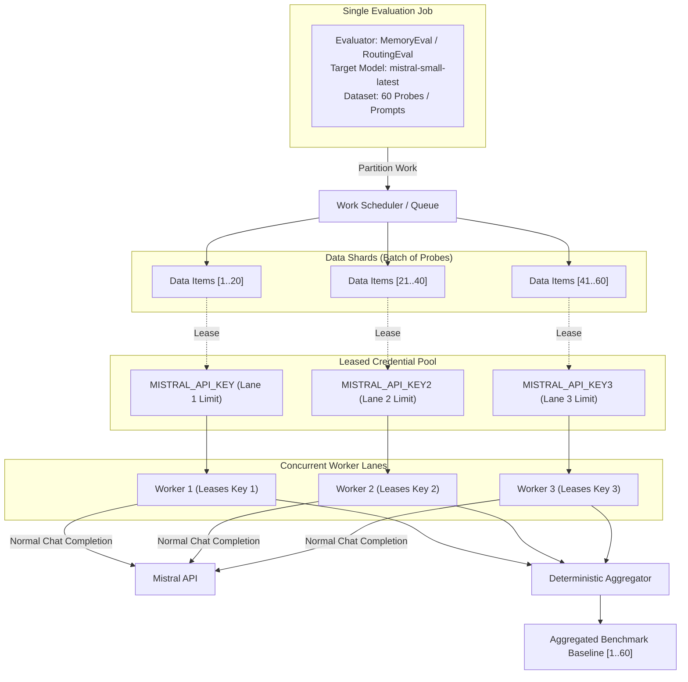

# Pluggable Batch Evaluation API — Level 1 System Design & Brainstorming

**Status:** Brainstorming & Idea Refinement  
**Area:** Evaluation Control Plane & Worker Architecture  
**Reference Document:** [`tasks/specs/SPEC-pluggable-batch-evaluation-api.md`](../tasks/specs/SPEC-pluggable-batch-evaluation-api.md)

---

## 1. Problem Statement

> **How Might We** build an extensible, rate-limit-aware evaluation engine that maximizes throughput across multiple independent API keys for a given model, without conflating local data-parallel sharding with provider-side batch APIs or multi-model benchmarking matrices?

---

## 2. Core Architectural Clarification

When discussing "Batch Processing" in the context of LLM evaluations, three distinct dimensions often get conflated:

| Dimension | Meaning | In Level 1 Scope? |
|---|---|---|
| **A. Data Batching (Workload Sharding)** | Splitting $N$ evaluation items/probes across $K$ workers running against the **same model** using **distinct API keys** to bypass single-key rate limits. | **YES (Core Focus)** |
| **B. Multi-Model Matrix Batching** | Running an evaluation across a suite of $M$ different models (e.g. Mistral 7B vs Large vs Gemini) for comparison. | **NO (Composition Layer above Level 1)** |
| **C. Provider Batch API** | Offloading offline asynchronous jobs directly to provider infrastructure (e.g. Mistral/OpenAI 24h JSONL batch endpoints). | **NO (Explicitly Out of Scope)** |

### Visual Topology: Level 1 Data-Parallel Sharding

---

## 3. Recommended Direction & Refinements for Level 1

### A. Disambiguate Terminology in Specs and Code
Replace generic terms like `BatchExecutor` with domain-accurate abstractions:
- **`DataSharder` / `WorkUnitQueue`**: Responsible for slicing datasets into atomic units.
- **`CredentialLeasingPool`**: Manages the lifecycle (`available`, `leased`, `cooling_down`, `disabled`) of provider keys with independent quotas.
- **`LaneExecutor`**: The concurrent worker executing against an assigned API key lease.

### B. Execution Strategy Tailoring: Pull Queue vs Static Shards
Level 1 defines two execution modes that require different queue semantics:
1. **`request_batch` (Stateless Fan-out)**:
   - *Problem with Static Sharding:* If Key 2 hits a transient `429` backoff, static shards leave Shard 2 blocked while Workers 1 and 3 sit idle.
   - *Refined Design:* Use a **Dynamic Pull Queue**. Workers 1, 2, and 3 pull the next atomic request from a shared in-memory queue. Throttled keys pause their pull loop without starving the overall job.
2. **`workflow_shards` (Stateful Multi-Step Pipelines)**:
   - Requires deterministic isolation (e.g. dedicated SQLite database per shard, unique tenant nonces, seed $\to$ mask $\to$ query $\to$ score).
   - Uses **Deterministic Partitioning** (e.g. round-robin probe assignment) with per-shard scratch databases and atomic teardown.

### C. Dynamic Elasticity & Fault Recovery
The system must gracefully handle dynamic key pool sizes:
- **$M = 3$**: 3 concurrent lanes (optimal speedup).
- **$M = 1$**: 1 sequential lane (backward-compatible local dev).
- **Key Authentication Failure (`401/403`)**: Mark key `disabled`. Its remaining unstarted work items return to the queue and get processed by remaining healthy keys.

### D. Composition Hierarchy (How Multi-Model Fits Later)
- **Level 1 (Atomic Execution Primitive)**:
  $$\text{execute\_job}(\text{evaluator\_type}, \text{target\_model}, \text{dataset}, \text{key\_pool}) \to \text{JobResult}$$
- **Layer Above Level 1 (Multi-Model Suite Orchestrator)**:
  Dispatches $M$ Level 1 jobs across different models and merges the results into leaderboard formats (e.g., updating `MODEL-MEMORY-EVAL-LEADERBOARD.md`).

---

## 4. Key Assumptions to Validate

- [ ] **Assumption 1 (Key Independence):** The 3 configured Mistral API keys truly maintain isolated rate limits and do not share an invisible organization-wide concurrency bottleneck.
  - *Validation:* Run a concurrent synthetic probe benchmark saturating all 3 keys simultaneously and check for cross-key 429 throttling.
- [ ] **Assumption 2 (In-Memory Queue vs Job Store Crash Safety):** For long-running jobs, storing work-item state in the SQLite Job Store provides sufficient crash recovery without adding heavy distributed queue dependencies (e.g. Celery / Redis).
  - *Validation:* Simulate service restart mid-job and verify that the job store marks orphaned running shards as retryable or failed.
- [ ] **Assumption 3 (Memory Eval Seeding Isolation):** Complete probe arms (`FULL`, `ABLATED`, `CONTROL`) executed on an isolated SQLite file on Shard $i$ will never bleed context or side-effects into Shard $j$.
  - *Validation:* Parallel probe suite execution with unique synthetic memories asserted per shard.

---

## 5. MVP Scope (Level 1)

### What's In
- Job submission API (`POST /v1/evaluation-jobs`, `GET /v1/evaluation-jobs/{job_id}`, `GET /v1/evaluation-jobs/{job_id}/result`).
- SQLite-backed durable job state machine (`accepted -> validating -> queued -> running -> collecting -> succeeded`).
- Credential Lease Pool managing $K$ keys with status tracking (`available`, `leased`, `cooling_down`, `disabled`).
- Worker execution engine supporting both `request_batch` (stateless pull queue) and `workflow_shards` (isolated stateful shards).
- Deterministic result aggregation preserving input probe ordering.
- Offline fakes for job store, credential pool, and provider transports.

### What's Out (and Why)
- **Mistral Provider Batch API Integration**: Bypasses local control plane, introduces 24h asynchronous turnaround, and cannot execute stateful local memory seeding/scoring workflows.
- **Multi-Model Benchmark Matrix within a single job**: Mixing multiple model targets into a single job complicates shard scheduling and error recovery. Handled as multiple Level 1 jobs instead.
- **PostgreSQL Parallel Memory Sharding**: Kept at concurrency `1` to avoid advisory-lock contention and complex parallel schema isolation in this phase.
- **Public Multi-Tenant Authentication**: Internal administrator/evaluator tooling only.

---

## 6. Open Questions for Brainstorming

1. **Job Preemption & Cancellation Granularity:**
   When `POST /v1/evaluation-jobs/{job_id}/cancel` is called, should in-flight HTTP requests be aborted immediately via `asyncio.CancelledError`, or should the worker finish the current probe arm and exit before the next item?
2. **Dynamic Work Stealing in `workflow_shards`:**
   If Shard 1 finishes its 20 probes much faster than Shard 2 (due to probe length variance), should Shard 1 be allowed to "steal" remaining unstarted probes from Shard 2, given the need to re-initialize SQLite scratch states?
3. **Artifact Retention & Cleanup Lifecycle:**
   How long should intermediate per-shard SQLite scratch databases and raw provider response logs be retained before automated garbage collection?
