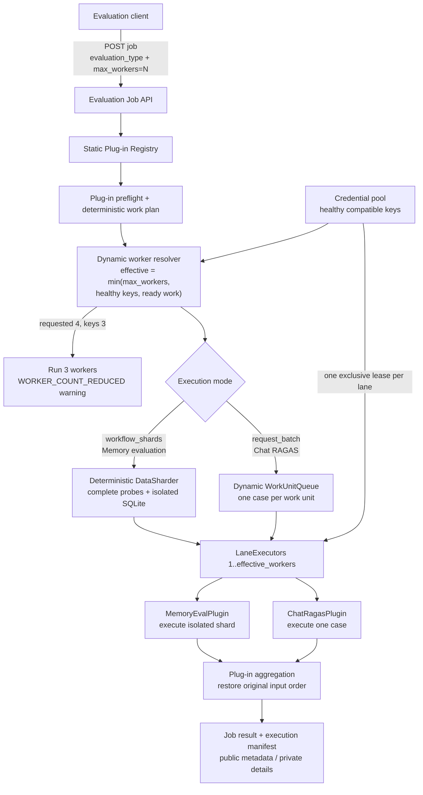

# Pluggable Batch Evaluation — Level 1 Brainstorming

**Status:** Recommended design preview
**Official spec:** [`SPEC-pluggable-batch-evaluation-api.md`](../../tasks/specs/SPEC-pluggable-batch-evaluation-api.md)

---

## 1. Problem Statement — Solve Slow Evaluation with Batch Processing and Multiple Evaluation Plug-ins

Evaluation is slow when every case runs sequentially through one provider API
key. We need one small Level 1 batch-processing system that can:

- Run one evaluation job against one target model.
- Use `max_workers=1..N` to process independent work concurrently.
- Bound workers by healthy compatible API keys and ready work.
- Support multiple evaluation use cases without adding another scheduler or API.
- Preserve each evaluator's correctness, privacy, and aggregation rules.

Level 1 is local data-parallel execution. It is not a provider batch API and it
is not a multi-model benchmark matrix.

The first two plug-in use cases prove both execution shapes:

- **Memory evaluation:** stateful `workflow_shards`; complete probes stay
  together and each shard receives isolated SQLite state.
- **Chat RAGAS evaluation:** stateless `request_batch`; one case is one work unit
  pulled by the next free worker.

---

## 2. Clarification

### How a memory-evaluation batch job is activated

The existing memory evaluator does not start or manage batch workers. The
caller submits one job:

```text
POST /v1/evaluation-jobs
evaluation_type = "memory-eval"
execution_mode = "workflow_shards"
target_model = "mistral-small-latest"
dataset_ref = "probes_v1"
max_workers = 4
credential_pool = "mistral-eval"
```

The Level 1 engine resolves the registered `MemoryEvalPlugin`, calculates the
effective worker count, leases credentials, runs isolated shards, and asks the
plug-in to aggregate their results.

### Dynamic worker rule

```text
effective_workers = min(
    requested max_workers,
    healthy compatible credentials,
    ready work units or planned shards,
)
```

Examples:

| Request | Healthy keys | Ready work | Result |
|---|---:|---:|---|
| `max_workers=1` | 3 | 20 | Run 1 worker |
| `max_workers=2` | 3 | 20 | Run 2 workers |
| `max_workers=4` | 3 | 20 | Run 3 workers and emit `WORKER_COUNT_REDUCED` |
| `max_workers=4` | 3 | 2 | Run 2 workers; no credential-capacity warning |

The warning records requested workers, effective workers, and available
credentials. It never exposes API-key values.

### Recommended memory plug-in boundary

Create new batch integration code, but reuse the existing memory-evaluation
semantics. A small extraction is required because reusable orchestration should
not be imported from the private CLI script.

```python
class MemoryEvalPlugin:
    evaluation_type = "memory-eval"
    execution_strategy = "workflow_shards"

    async def preflight(self, request) -> MemoryEvalPlan:
        payload = load_dataset_json(request.dataset_ref)
        probe_set = load_probe_set(payload)
        return MemoryEvalPlan(probe_set=probe_set)

    def plan_shards(
        self,
        plan: MemoryEvalPlan,
        effective_workers: int,
    ) -> list[MemoryShard]:
        return partition_complete_probes(plan.probe_set, effective_workers)

    async def execute_shard(
        self,
        shard: MemoryShard,
        context: ShardContext,
    ) -> MemoryShardResult:
        return await execute_memory_shard(
            probe_set=shard.probe_set,
            environment=context.isolated_environment,
            reply=context.lease_bound_reply,
            provider=context.provider,
            model=context.model,
        )

    def aggregate(self, plan, shard_results):
        return merge_in_original_probe_order(plan, shard_results)
```

Recommended improvements:

- Extract reusable `execute_memory_shard()` and adapter construction from the
  memory-evaluation CLI into the memory-evaluation package.
- Keep the plug-in stateless; never store one job's probe set on the registered
  plug-in instance.
- Pass a lease-bound reply client instead of a raw API key.
- Give every shard a collision-safe path containing job ID and shard ID.
- Keep FULL, ABLATED, and CONTROL arms of one probe in the same shard.
- Preserve the existing scorer, verdicts, seeding, masking, transcript privacy,
  and teardown behavior.
- Merge completed rows in original probe-set order.
- Keep PostgreSQL memory evaluation at `max_workers=1` in Level 1.

### Why this remains pluggable

The core owns only job state, worker resolution, scheduling, credential leases,
progress, cancellation, and durable work-unit outcomes. Each plug-in owns its
evaluation-specific planning, execution, failure interpretation, artifacts, and
aggregation.

| Concern | Memory evaluation plug-in | Chat RAGAS plug-in |
|---|---|---|
| Execution mode | `workflow_shards` | `request_batch` |
| Work unit | Isolated shard of complete probes | One RAGAS case |
| Inside one unit | Probes sequential; three arms together | Metrics sequential |
| Core worker pool | Dynamic `1..N` | Dynamic `1..N` |
| Nested worker pool | None | RAGAS internal workers fixed at `1` |
| Aggregation | Original probe order | Original case order |

Adding either plug-in requires no new endpoint, scheduler, credential pool, job
state machine, or artifact store.

---

## 3. Visual Topology: Level 1 Data-Parallel Sharding with Dynamic `max_workers`



The Level 1 core changes concurrency, not evaluation meaning. A worker executes
the work unit defined by the selected plug-in; the plug-in continues to own how
that unit is evaluated and interpreted.
