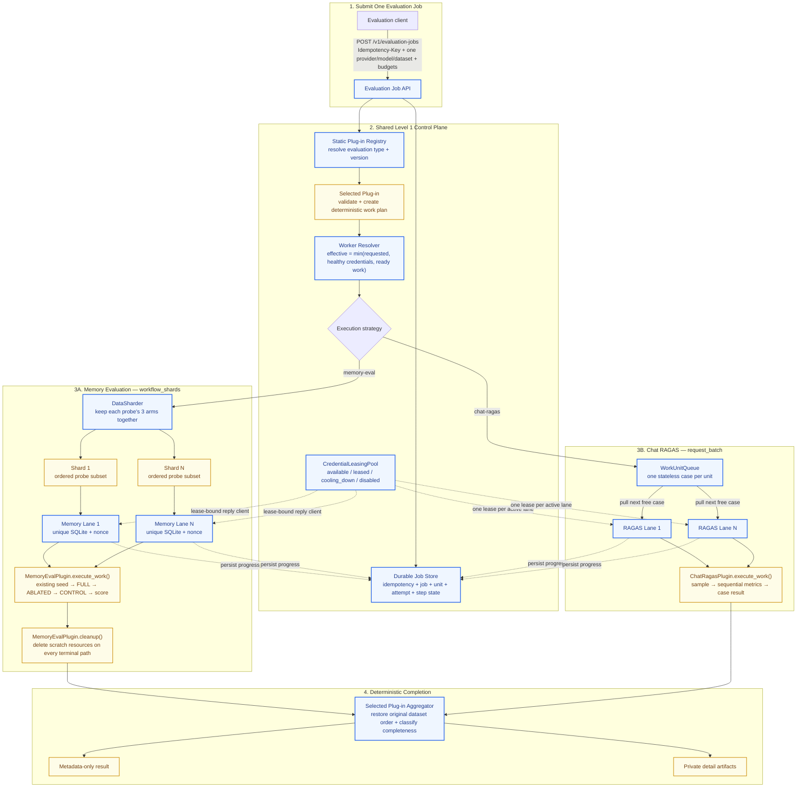

# Pluggable Batch Evaluation — Level 1 Plug-in Simulation

**Status:** Brainstorming preview

**Focus:** How evaluation plug-ins use the Level 1 batch-processing core

**Official specification:** [`SPEC-pluggable-batch-evaluation-api.md`](../../tasks/specs/SPEC-pluggable-batch-evaluation-api.md)

**Chat RAGAS semantics:** [`SPEC-chat-ragas-evaluation.md`](../../tasks/specs/SPEC-chat-ragas-evaluation.md)

---

## 1. Problem Statement — Solve Slow Evaluation with Batch Processing + Pluggable Evaluation Use Cases

> **How might we** speed up slow evaluation runs with multiple credential-backed workers while keeping one reusable Level 1 batch-processing core for memory evaluation, Chat RAGAS, and future evaluation types?

The system should provide:

- One job API and one worker engine for every registered evaluation type.
- Dynamic worker count from `1` to requested `max_workers`.
- Safe reduction when fewer healthy credentials exist. Example: request `4`, find `3` healthy Mistral keys, run `3` workers and emit `WORKER_COUNT_REDUCED`.
- Plug-in-owned evaluation behavior without plug-in-owned scheduling, credential lifecycle, or HTTP state.
- Deterministic outputs even when work finishes out of order.
- Durable idempotency, restart recovery, bounded retries, cancellation, and request/token budgets before provider spend.
- Safe metadata-only API responses and manifests; questions, replies, contexts, raw errors, and keys stay private.
- Minimal changes to existing evaluation semantics.

Level 1 is local data-parallel execution against one target model. It is not a provider batch API and not a multi-model benchmark matrix.
Multiple configured keys are not proof of independent quotas: multi-lane operation requires an opt-in concurrent smoke test, and provider-reported organization limits take precedence.

---

## 2. Clarification

### 2.1 How a plug-in is activated

The evaluation code does not start workers directly. A client submits a normal job:

```http
POST /v1/evaluation-jobs
Idempotency-Key: memeval-probes-v1-mistral-small
Authorization: Bearer <internal-evaluator-token>
```

```json
{
  "evaluation_type": "memory-eval",
  "provider": "mistral",
  "target_model": "mistral-small-latest",
  "dataset_ref": "probes_v1",
  "credential_pool": "mistral-eval",
  "execution_mode": "workflow_shards",
  "execution_options": {
    "max_workers": 4
  },
  "budgets": {
    "max_provider_requests": 180,
    "max_total_tokens": 500000
  },
  "parameters": {}
}
```

The Level 1 engine then:

1. Authenticates an internal evaluator and atomically claims `Idempotency-Key` with a canonical request hash.
2. Resolves the startup-registered `memory-eval` plug-in.
3. Runs plug-in preflight and creates a deterministic work plan from an allowlisted dataset reference, never an arbitrary submitted path.
4. Calculates `effective_workers = min(requested workers, healthy compatible credentials, ready work)`.
5. Creates isolated shards or stateless work units and persists their durable state.
6. Leases one healthy credential per active worker and calls the plug-in for each assigned unit.
7. Persists unit, attempt, and step outcomes, then aggregates results in original dataset order.

`max_workers` defaults to `1`. If credentials reduce the count, status and the execution manifest record `WORKER_COUNT_REDUCED`, requested workers, effective workers, and available credentials. A small dataset may leave lanes idle without producing that credential-capacity warning. The count may shrink later when a key enters `cooling_down` or becomes `disabled`.

### 2.2 Does existing memory-evaluation code need changes?

Yes, but only a small structural extraction. Do not rewrite memory-evaluation behavior.

| Area | Recommendation |
|---|---|
| Existing probe execution | Extract `run_probe_rows()` from `run_probe_set()` so shards return mergeable rows; keep `run_probe_set()` as the compatibility wrapper that calls those rows and then `build_report()`. |
| Existing semantics | Preserve scoring, verdict derivation, seeding, masking, privacy, and teardown. |
| CLI orchestration | Extract reusable shard execution from `scripts/evaluate_memory.py` into a production memory-evaluation module. |
| New plug-in code | Add a stateless `MemoryEvalPlugin` that validates input, plans shards, invokes reusable execution, and aggregates rows. |
| Worker credentials | Give the plug-in a lease-bound reply client or transport, not a raw API-key string. |
| Scratch state | Give every shard a unique SQLite file, nonce, session, transcript, and artifact path containing job and shard identity. |
| Dataset loading | Resolve stable dataset ids through a trusted catalog; the API cannot submit arbitrary filesystem paths. |
| Aggregation | Restore rows to original probe order, verify completeness, and call existing `build_report()` exactly once for the whole probe set. |
| PostgreSQL | Keep memory evaluation at one worker until parallel database isolation has a separate design. |

Recommended reusable seam:

```python
async def execute_memory_shard(
    probe_set: ProbeSet,
    environment: LiveEnvironment,
    reply: ChatReply,
    *,
    provider: str,
    model: str,
) -> MemoryShardResult:
    """Run one isolated subset while preserving existing memory-eval behavior."""
```

Both the existing CLI and the new plug-in should call this function. Production code should not import private helpers from `scripts/evaluate_memory.py`.

### 2.3 Recommended memory-evaluation plug-in simulation

The following is an illustrative contract; exact class names can change during implementation.

```python
class MemoryEvalPlugin:
    evaluation_type = "memory-eval"
    version = "1"
    supported_modes = frozenset({"workflow_shards"})
    parameter_schema = MemoryEvalParameters

    async def preflight(self, request: EvaluationRequest) -> MemoryEvalPlan:
        payload = self.dataset_catalog.resolve(request.dataset_ref)
        probe_set = load_probe_set(payload)
        return MemoryEvalPlan(probe_set=probe_set)

    def build_work_units(
        self,
        plan: MemoryEvalPlan,
        lane_count: int,
    ) -> list[WorkUnit]:
        return partition_complete_probes(
            plan.probe_set,
            lane_count,
        )

    async def execute_work(
        self,
        unit: WorkUnit,
        context: WorkContext,
    ) -> MemoryShardResult:
        shard_probe_set = plan_probe_subset(context.plugin_plan, unit.payload)
        return await execute_memory_shard(
            probe_set=shard_probe_set,
            environment=context.isolated_environment,
            reply=context.lease_bound_reply,
            provider=context.provider,
            model=context.model,
        )

    def aggregate(
        self,
        plan: MemoryEvalPlan,
        outcomes: list[WorkUnitOutcome],
    ) -> JobResult:
        return merge_in_original_probe_order(plan, outcomes)
```

Important boundaries:

- The registered plug-in is stateless. Per-job state lives in `MemoryEvalPlan` and shard context, so concurrent jobs cannot overwrite each other.
- All three arms of one memory probe remain in one shard and execute sequentially.
- Level 1 owns worker creation, credential leasing, retries, cancellation, progress, and durable job state.
- The plug-in owns only memory-evaluation validation, deterministic planning, execution semantics, step outcomes, aggregation, artifact privacy, cleanup, and failure classification.
- A shard keeps the same credential lease for its full lifecycle. Level 1 does not move probes between active memory shards.
- Every lane invokes plug-in cleanup before a terminal job state is persisted. Scratch databases are deleted on success, partial success, failure, and cancellation.
- Plug-ins declare whether nested library concurrency exists. Chat RAGAS disables it or fixes it at `1`.

### 2.4 Durable job lifecycle

The canonical path is:

`accepted → validating → queued → running → collecting → succeeded`

Terminal alternatives are `partially_succeeded`, `failed`, and `cancelled`; cancellation passes through `cancellation_requested`. Durable unit and attempt state is authoritative. After restart, completed units remain complete and orphaned running attempts become `unknown` before retry policy decides whether replay is safe.

### 2.5 Multiple evaluation use cases remain pluggable

| Evaluation plug-in | Level 1 mode | Work unit | Internal behavior |
|---|---|---|---|
| Memory evaluation | `workflow_shards` | Deterministic subset of complete probes | Stateful and sequential inside an isolated SQLite environment. |
| Chat RAGAS | `request_batch` | One RAGAS case | Stateless case pulled by any free lane; `faithfulness` and `answer_relevancy` execute sequentially, with missing/non-finite/NaN scores marked failed. |
| Future routing/retrieval evaluation | Chosen by plug-in | Prompt, case, or isolated workflow | Reuses the same registry, worker resolver, credential pool, job store, and artifact store. |

This is the pluggability test: adding a new evaluation type should add a plug-in and its domain tests, not another endpoint, scheduler, worker pool, or credential manager.

Implementation focus for the first delivery is the Level 1 core plus the production memory-evaluation plug-in. Chat RAGAS remains the second-use-case stress-test contract: core `request_batch` behavior is proven with a fake stateless plug-in now, while the real `ChatRagasPlugin` is deferred until its evaluator runtime is implemented and validated independently.

---

## 3. Visual Topology — How the Plug-in Uses Level 1



> [!NOTE]
> **Visual Legend & Architectural Separation:**
> - 🟦 **`core` (Blue)**: Reusable Level 1 Control Plane & Engine (**HOW work runs** — API, Durable Job Store, Worker Resolver, `CredentialLeasingPool`, `DataSharder`, `WorkUnitQueue`, `LaneExecutor`s, Aggregator Engine).
> - 🟨 **`plugin` (Yellow)**: Evaluation Domain Logic (**WHAT evaluation means** — Preflight validation, Shard/Case Work Units, Domain Execution Seams `MemoryEvalPlugin` / `ChatRagasPlugin`, Metric Scoring, Artifact Mapping).


### How to read the topology

1. The authenticated client chooses one evaluation type, provider, model, dataset reference, execution mode, and budget; it never uploads executable plug-in code or arbitrary paths.
2. The API atomically claims idempotency before spend. The registry selects one startup-registered plug-in, which validates the dataset and describes deterministic work.
3. The shared engine calculates worker capacity and leases credentials. If `max_workers=4` but only three healthy keys exist, it starts three lanes and records `WORKER_COUNT_REDUCED`.
4. Stateful memory evaluation receives fixed isolated shards. Stateless RAGAS cases use a shared pull queue.
5. Workers call the selected plug-in's execution seam; the plug-in reuses the existing evaluation domain logic.
6. Cleanup runs before terminal state. The aggregator restores input order, classifies incomplete execution honestly, and preserves the boundary between public metadata and private evaluation details.
7. `GET /v1/evaluation-jobs/{job_id}` returns safe status; `/result` returns `409` until terminal; cancellation stops new claims and remains idempotent.

The key separation is simple:

> **Level 1 controls how work runs; each plug-in controls what the evaluation means.**
