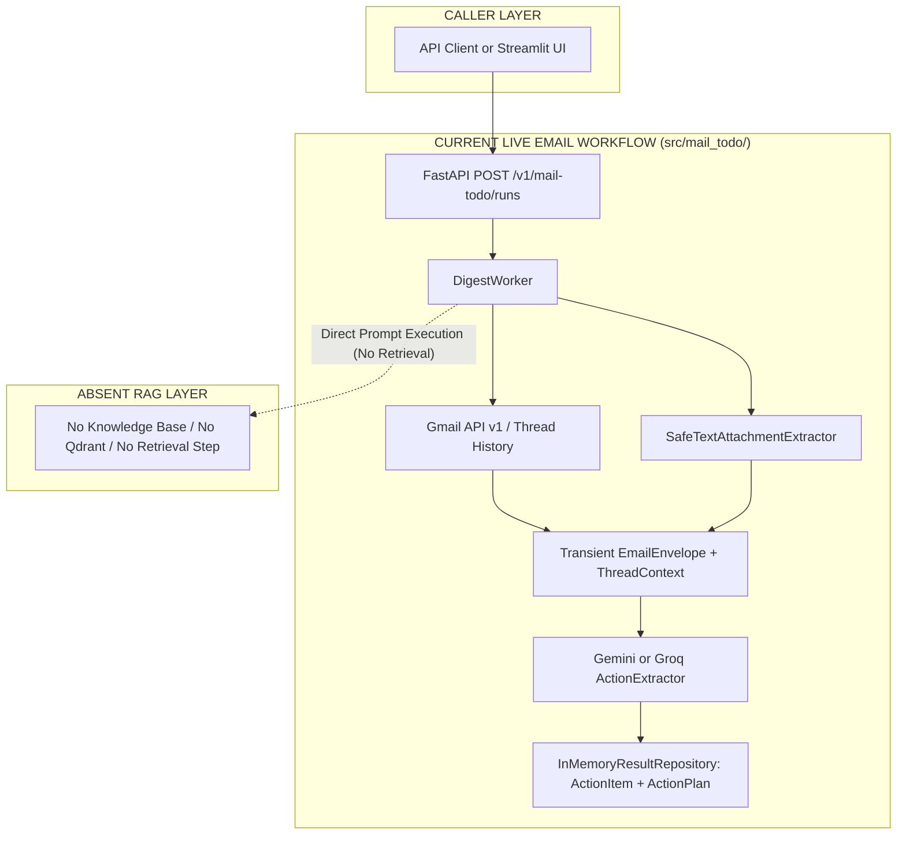
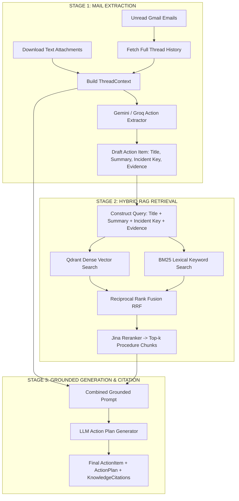

# RAG & Mail Pipeline Integration Explanation

## 📌 Executive Summary

This document explains the relationship between the **Email Pipeline** and **RAG (Retrieval-Augmented Generation)**, comparing the **current live codebase implementation** (`src/mail_todo/`) against the **target reference architecture** (`docs/references/ARCHITECHTURE.md`).

> ⚠️ **Key Finding:** In the current live Python codebase (`src/mail_todo/`), **0% of the RAG pipeline exists** (no ingestion, no vector DB, no retrieval, no embedding, and no citations). The RAG + Mail pipeline described below is the **target blueprint** defined in `ARCHITECHTURE.md`.

---

## 📊 RAG Status: Live Code vs. Target Architecture

| Component / Capability | Live Code (`src/mail_todo/`) | Target Architecture (`docs/references/ARCHITECHTURE.md`) |
| :--- | :---: | :---: |
| **Document Ingestion** (Parsing, Chunking, Hashing) | ❌ **0% Implemented** | Planned ingestion pipeline for md, txt, pdf, docx |
| **Vector Indexing & Storage** | ❌ **0% Implemented** | Qdrant vector database (`company_processes` collection) |
| **Hybrid Retrieval** (Dense + BM25) | ❌ **0% Implemented** | Qdrant dense search + BM25 lexical search + RRF fusion |
| **Cross-Encoder Reranking** | ❌ **0% Implemented** | Jina reranker for top-k chunk selection |
| **Grounded Generation & Citations** | ❌ **0% Implemented** | Mandatory citation linking (`KNOWLEDGE_CITATION`) |

---

## 🔄 Side-by-Side Flowchart Comparison

### 1. Current Live State Flowchart (No RAG)

---

### 2. Target Reference Architecture Flowchart (RAG + Mail Integrated)

---

## ⚙️ Workflow Steps Breakdown

### Current Live State (`src/mail_todo/`)
1. **Trigger**: `POST /v1/mail-todo/runs` starts `DigestWorker`.
2. **Fetch**: `DigestWorker` fetches unread threads from Gmail.
3. **Parse**: In-memory text/CSV/JSON attachment extraction.
4. **Extract & Return**: Passes thread history + attachment text directly to Gemini/Groq prompt. Returns `ActionItem` and ungrounded `ActionPlan` directly to in-memory repository.

### Target Reference Architecture (`docs/references/ARCHITECHTURE.md`)
1. **Stage 1 (Mail Extraction)**: Extracts draft action items from email threads and attachments.
2. **Stage 2 (Hybrid RAG Retrieval)**: Builds search queries from draft action items and runs dense vector search (Qdrant) + BM25 lexical search, combined via RRF and reranked by Jina.
3. **Stage 3 (Grounded Generation)**: Synthesizes final action plans using combined email + attachment + company procedure chunks, strictly attaching `KNOWLEDGE_CITATION` links.

---

## ❓ Why Email Attachment Parsing is NOT RAG

Email attachment parsing in the current codebase (`SafeTextAttachmentExtractor`) is **not** RAG retrieval:
- Attachment text is read temporarily during a run and passed directly into the LLM prompt.
- Attachment text is **never chunked, never embedded, never stored in a vector DB, and never searched**.
- Once the run completes, attachment text is discarded.

---

## 📁 Source References

- **Live Codebase**: [src/mail_todo/](file:///e:/VIN-INTERNSHIP/EMAIL-AGENT-v1/src/mail_todo/) (FastAPI server, SQLite connections, Gemini/Groq adapters).
- **Installed Dependencies**: [pyproject.toml](file:///e:/VIN-INTERNSHIP/EMAIL-AGENT-v1/pyproject.toml) (Contains zero vector DB or search libraries).
- **Target Architecture Spec**: [docs/references/ARCHITECHTURE.md](file:///e:/VIN-INTERNSHIP/EMAIL-AGENT-v1/docs/references/ARCHITECHTURE.md) (Blueprints for Qdrant, hybrid retrieval, and grounded action plans).
- **Current RAG Status Audit**: [docs/architectures/current-architectures/current-rag-architecture.md](file:///e:/VIN-INTERNSHIP/EMAIL-AGENT-v1/docs/architectures/current-architectures/current-rag-architecture.md).
