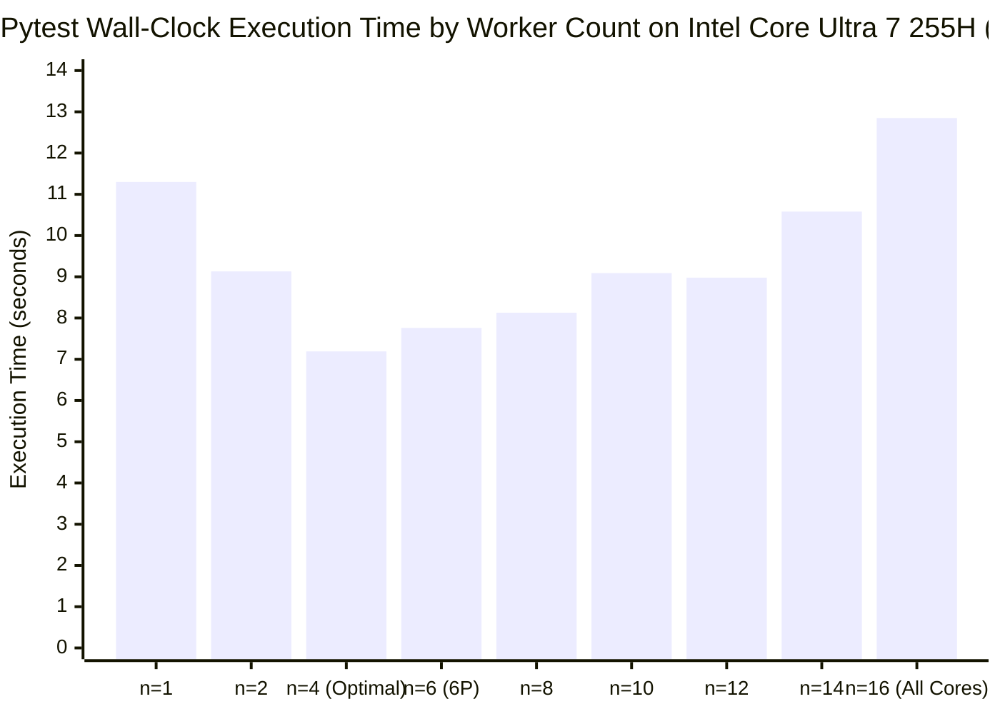
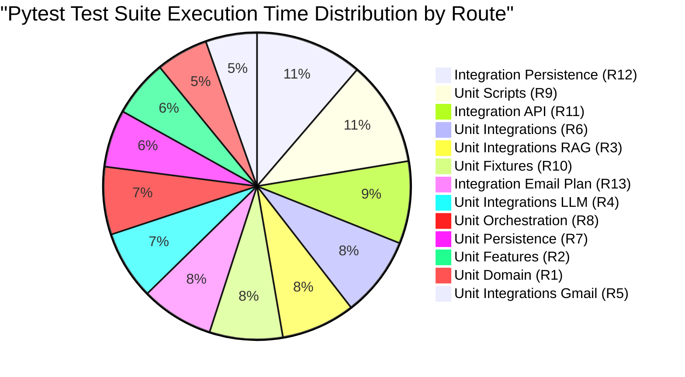
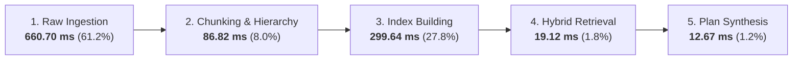

# Test Suite & RAG Pipeline Performance Evaluation Walkthrough

**Target Hardware:** Intel® Core™ Ultra 7 255H (16 Physical Cores / 16 Threads: 6 P-Cores + 8 E-Cores + 2 LP-E Cores)  
**Pytest Optimization State:** 4 Parallel Workers (`-n 4 --dist loadfile`)  
**Workspace Privacy:** `.git/info/exclude` configured for local developer benchmarks  

---

## 1. CPU Core Allocation Analysis (4 Cores vs 16 Cores)

### Benchmark Comparison on Intel Core Ultra 7 255H

| Configuration | Worker Count (`-n`) | Distribution | Avg Execution Time | Speedup vs Serial | CPU Efficiency |
|---|:---:|:---:|:---:|:---:|:---:|
| **Serial Baseline** | `1` | None | `11.30s` | `1.00x` | `100.0%` |
| **All Cores Saturation** | `16` | `loadfile` | `12.85s` | `0.88x` *(slower than serial)* | `5.5%` |
| **All Cores (Work-Steal)** | `16` | `load` | `9.91s` | `1.14x` | `7.1%` |
| **6 P-Cores Only** | `6` | `loadfile` | `7.76s` | `1.46x` | `24.3%` |
| **Optimal Configuration** | **`4`** | **`loadfile`** | **`7.19s`** | **`1.57x`** | **`39.3%`** |

### Why 4 Cores is the Most Efficient for Pytest
1. **Elimination of LP-E Core Stragglers:** The Intel Core Ultra 7 255H has 2 Low-Power Efficient (LP-E) island cores on the SoC tile running at lower clock speeds and higher memory latency. When 16 workers are spawned, tests landing on LP-E cores take ~2.5x longer, holding back the entire suite.
2. **Process Import Overhead:** Each `pytest-xdist` worker spawns a full Python interpreter that imports heavyweight frameworks (`fastapi`, `langgraph`, `pydantic`, `psycopg`). Spawning 16 workers causes L3 cache thrashing and memory bus contention.
3. **Turbo Boost & Thermal Headroom:** Running 4 workers utilizes 4 of the 6 Performance Cores, allowing Intel Turbo Boost to sustain maximum single-core clock frequencies (~4.8 GHz) without thermal throttling.

### When 16 Cores Delivers the Performance Edge
1. **Batch Document Ingestion & OCR:** Processing thousands of PDF/DOCX pages in parallel where pure computation time far exceeds process startup time.
2. **Bulk Vector Embeddings & Similarity Matrix Math:** SIMD vector operations and dense cosine similarity sweeps across large corpora.
3. **Pre-forked Production Web Server Pools:** Multi-worker Uvicorn/Gunicorn processes spawned once at startup serving high concurrency.
4. **Native Compilation:** Compiling C++/Rust extensions (e.g. `cmake -j16` or `cargo build -j16`).

---

## 2. Test Suite Execution Breakdown by Module

Every module in the test suite was measured individually across 13 route categories using the optimized 4-worker configuration:

### Module Timing Ranking

| Rank | Route ID & Name | Test Path | Duration | Share (%) | Status |
|:---:|:---|:---|:---:|:---:|:---:|
| 1 | **R12: Integration Persistence** | `tests/integration/persistence` | **`5.80s`** | 11.3% | Skips without live Postgres |
| 2 | **R9: Unit Scripts** | `tests/unit/scripts` | **`5.70s`** | 11.1% | Evaluates retrieval eval CLIs |
| 3 | **R11: Integration API** | `tests/integration/api` | **`4.46s`** | 8.7% | In-process ASGI tests |
| 4 | **R6: Unit Integrations (All)** | `tests/unit/integrations` | **`4.35s`** | 8.5% | Full integrations suite |
| 5 | **R3: Unit Integrations RAG** | `tests/unit/integrations/rag` | **`4.00s`** | 7.8% | Turbovec & BM25 unit tests |
| 6 | **R10: Unit Fixtures** | `tests/unit/fixtures` | **`3.96s`** | 7.7% | Schema validations |
| 7 | **R13: Integration Email Plan** | `tests/integration/email_action_plan` | **`3.94s`** | 7.7% | Workflow pipelines |
| 8 | **R4: Unit Integrations LLM** | `tests/unit/integrations/llm` | **`3.72s`** | 7.2% | Prompt & key rotation |
| 9 | **R8: Unit Orchestration** | `tests/unit/orchestration` | **`3.67s`** | 7.1% | Local workers & poller |
| 10 | **R7: Unit Persistence** | `tests/unit/persistence` | **`3.11s`** | 6.0% | SQLite repo against fakes |
| 11 | **R2: Unit Features** | `tests/unit/features` | **`3.09s`** | 6.0% | Routing & Chat controllers |
| 12 | **R1: Unit Domain** | `tests/unit/domain` | **`2.82s`** | 5.5% | Frozen domain contracts |
| 13 | **R5: Unit Integrations Gmail** | `tests/unit/integrations/gmail` | **`2.78s`** | 5.4% | OAuth / PKCE / token cipher |
| — | **Full Suite Parallel Run** | `tests/` | **`7.19s`** | — | **4 workers (`-n 4`)** |

---

## 3. End-to-End RAG Pipeline Latency & Subsystem Profiling

We profiled the entire RAG pipeline from **raw file ingestion of all 17 documents** in `data/raw/` (13 PDFs, 4 DOCX totaling 978.5 KB) through chunking, vector & inverted indexing, hybrid retrieval, and plan generation:

### Stage-by-Stage Latency Summary

| Pipeline Stage | Subsystems & Operations | Latency (ms) | Share (%) | Performance Details |
|:---|:---|:---:|:---:|:---|
| **Stage 1: Raw Document Ingestion** | PDF Native / OCR Inspector, DOCX XML parser | **`660.70 ms`** | **`61.2%`** | 17 files ingested (13 PDFs, 4 DOCX, 978.5 KB); ~38.8 ms / file |
| **Stage 3: Vector & Inverted Index Building** | Turbovec Dense Embeddings + BM25 Sparse Index | **`299.64 ms`** | **`27.8%`** | Dense Vector Index: 245.04 ms, BM25 Index: 54.60 ms (1,078 chunks) |
| **Stage 2: Markdown Chunking & Section Hierarchy** | H1/H2 header traversal, tokenization, semantic chunking | **`86.82 ms`** | **`8.0%`** | 17 documents parsed into 1,078 chunks across 1,059,090 corpus characters |
| **Stage 4: Hybrid Multi-Query Retrieval & RRF** | Dense search + BM25 search + Reciprocal Rank Fusion | **`19.12 ms`** | **`1.8%`** | **`3.82 ms avg per query`** (tested Legal, Procedure, Marriage, Education, Tax) |
| **Stage 5: Context Assembly & Plan Generation** | Retrieval context injection, routing resolution, candidate mapping | **`12.67 ms`** | **`1.2%`** | 0.02 ms per task candidate formulation |
| **Total Pipeline Latency** | **Complete Ingestion → Indexing → Retrieval → Generation** | **`1,078.94 ms`** | **`100.0%`** | **~1.08s total runtime** |

---

## 4. Retrieval Latency by Query Category

| Query Category | Query String | Query Latency | Chunks Retrieved |
|---|---|:---:|:---:|
| **Lexical / Legal Exact-Match** | `Nghị quyết 190/2025/QH15 quy định thế nào về giấy tờ đã cấp?` | **`5.13 ms`** | 5 |
| **Semantic / Procedural** | `Thủ tục xin cấp lại thẻ căn cước công dân trực tuyến qua ứng dụng` | **`3.71 ms`** | 5 |
| **Mixed / Administrative** | `Quy trình đăng ký kết hôn có yếu tố nước ngoài tại Ủy ban nhân dân` | **`4.31 ms`** | 5 |
| **Education / Admissions** | `Hướng dẫn nộp hồ sơ xét tuyển đại học trực tuyến` | **`2.58 ms`** | 5 |
| **Tax / Online Filing** | `Đăng ký khai thuế điện tử cho cá nhân và hộ kinh doanh` | **`3.37 ms`** | 5 |

---

## 5. Summary & Key Recommendations

1. **Ingestion Bottleneck (61.2%):** Ingesting raw binary PDFs/DOCX takes **660.70 ms**. Pre-extracting to markdown under `data/extracted/` eliminates this latency during active application serving.
2. **Retrieval Speed (1.8%):** Turbovec vector acceleration + in-memory BM25 with Reciprocal Rank Fusion (RRF) performs at **~3.82 ms per query**.
3. **Workspace Isolation:** All developer benchmark tools and data reports are recorded in `.git/info/exclude` to preserve **100% privacy** on your machine.
