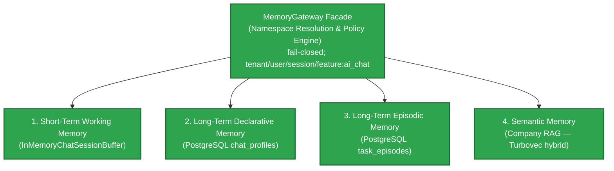
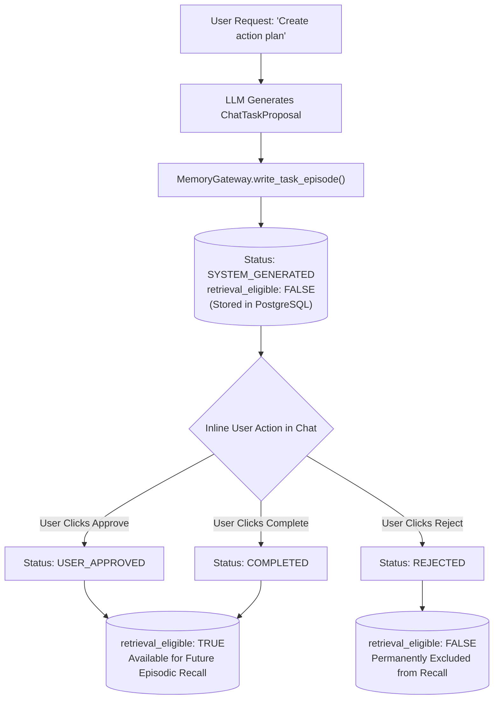
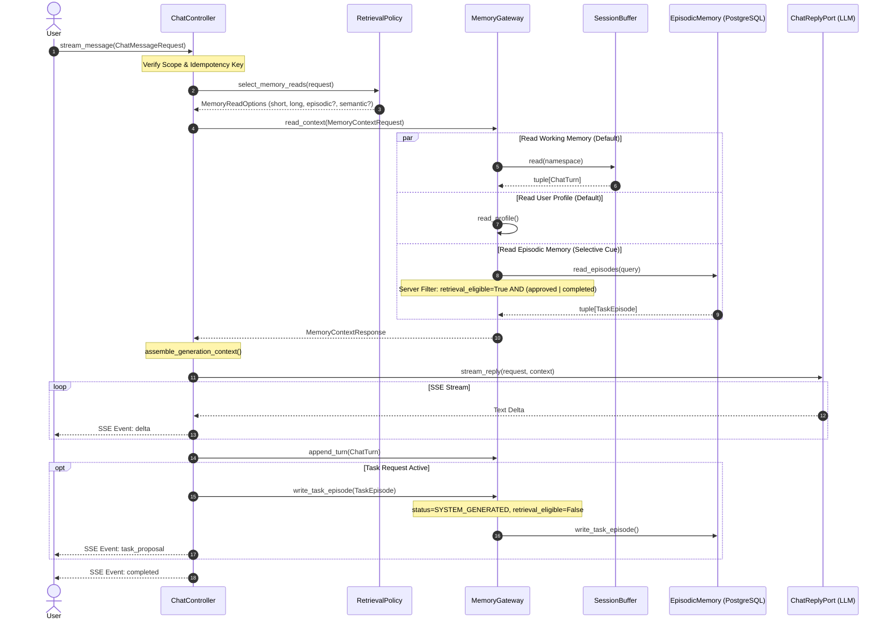

# AI Engineer's Guide: 4-Type Memory System & Retrieval Architecture

> **Authoritative Baseline**: Aligned with [`TARGET-ARCHITECTURE.md`](file:///e:/VIN-INTERNSHIP/EMAIL-AGENT-v1/.worktree/demo-frontend/docs/architectures/TARGET-ARCHITECTURE.md), [`ADR-004`](file:///e:/VIN-INTERNSHIP/EMAIL-AGENT-v1/.worktree/demo-frontend/tasks/adr/ADR-004-chat-native-task-episodes.md), and backend implementation in [`src/cowork_agent/features/ai_chat/`](file:///e:/VIN-INTERNSHIP/EMAIL-AGENT-v1/.worktree/demo-frontend/src/cowork_agent/features/ai_chat/).

---

## 💡 Executive Summary for AI Engineers

The **4-Type Memory System** in Cowork Agent is a decoupled, privacy-bounded state machine that powers interactive AI Chat. It separates **stateful user state** (Short-Term Working Memory, Declarative User Profile, and Episodic Task Memory) from **read-only external knowledge** (Semantic Company RAG & Project Document RAG). 

By design, **Working Memory and User Profiles are fetched by default on every turn**, while **Episodic Task Memory and Semantic RAG are selectively retrieved** using deterministic intent cue matching. Every turn streams SSE deltas while atomically deriving human-gated memory eligibility (`system_generated` $\rightarrow$ `user_approved`/`completed`), ensuring unapproved tasks or raw user emails never leak into future LLM contexts.

---

## 🗂️ Persona-Based Reading Pathways Index

To prevent cognitive overload, choose the reading pathway below that best matches your reading style or immediate task objective:

```text
┌───────────────────────────────────────────────────────────────────────────────────┐
│                          CHOOSE YOUR READING PATHWAY                              │
├───────────────────────────────┬───────────────────────────────────────────────────┤
│ 🧠 ADHD / High-Efficiency      │ Jump to 📌 Core Focus callouts, tables & diagrams │
│ 🛠️ AI Engineer / Builder       │ Executive Summary → Level 1 → Level 2 → Level 3   │
│ 🔬 AI Researcher / Architect   │ Level 1 (Decision Logic) → Level 3 (Precedence)   │
│ ⚡ Quick Skimmer (2-Min Overview)│ Level 1 (When RAG vs Memory) → Level 3 (Code Map) │
└───────────────────────────────┴───────────────────────────────────────────────────┘
```

### Recommended Reading Order by Persona

*   🧠 **ADHD / High-Efficiency Reader**:
    1. Read the **Executive Summary** above.
    2. Jump straight to [Level 1: §1.1 The Biggest Question (When RAG vs Memory vs Default)](#11-the-biggest-question-how-the-ai-decides-when-to-rag-vs-when-to-memory-vs-memory-by-default).
    3. Scan the **📌 Core Focus** boxes at the start of Level 2 and Level 3.
    4. Review the visual Mermaid diagrams in [§2.3](#23-visual-workflows--mermaid-diagrams).
*   🛠️ **AI Engineer / Software Developer**:
    1. Read sequentially from Level 1 to Level 3.
    2. Focus on [§1.1 Decision Matrix](#11-the-biggest-question-how-the-ai-decides-when-to-rag-vs-when-to-memory-vs-memory-by-default) for routing logic.
    3. Study [§2.1 The 8-Step Chat Turn Execution Lifecycle](#21-the-8-step-chat-turn-execution-lifecycle).
    4. Use [§3.1 Code Map & Module Registry](#31-code-map--module-registry) to locate specific Python classes for implementation work.
*   🔬 **AI Researcher / System Architect**:
    1. Read [§1.2 Memory vs. RAG Boundary Matrix](#12-memory-vs-rag-conceptual--operational-boundary).
    2. Examine [§3.2 Conflict Precedence Formula](#32-conflict-precedence-formula--resolution-math).
    3. Review [§2.4 Governance Layer](#24-governance-layer-v2-m6) (Observability, Evaluation Launch Gate, and Zero-Safety Counters).
*   ⚡ **Quick Skimmer**:
    1. Read the Executive Summary.
    2. Read [§1.1 Decision Matrix Table](#memory-vs-rag-read-trigger-matrix).
    3. Jump to [§3.1 Code Map](#31-code-map--module-registry).

---

# LEVEL 1: High-Level Mental Model & Decision Logic

> [!NOTE]
> 📌 **LEVEL 1 CORE FOCUS (ADHD Anchor)**:
> Focus your attention on **how the system decides what to read**. Working Memory & User Profile read **BY DEFAULT**. Episodic Memory & Semantic RAG read **ONLY ON CUE**. Memory stores user state; RAG stores external documents.

---

### 1.1 The Biggest Question: How the AI Decides "When to RAG vs. When to Memory vs. Memory by Default?"

The primary question for an AI Engineer is: *When a user sends a prompt, which memory stores or RAG knowledge bases are queried, and why?*

The Chat Controller uses a deterministic retrieval policy ([`retrieval_policy.py`](file:///e:/VIN-INTERNSHIP/EMAIL-AGENT-v1/.worktree/demo-frontend/src/cowork_agent/features/ai_chat/retrieval_policy.py)) that splits retrieval into **Default Reads** (always active) and **Selective Cue-Triggered Reads** (intent-activated):

```text
Incoming Chat Message Request
              │
              ├───► ALWAYS READ (BY DEFAULT) ────────► [1. Short-Term Working Memory]
              │                                      ► [2. Declarative User Profile]
              │
              ├───► IF Intent Cue Detected? ─────────► [3. Long-Term Episodic Task Memory]
              │     (e.g., "previous task", "plan")    (Eligible & Approved Only)
              │
              └───► IF Keyword/Doc Cue Detected? ────► [4. Semantic Company RAG]
                    (e.g., "company policy", SOPs)     [+ Project Document RAG]
```

#### Memory vs. RAG Read Trigger Matrix

| Memory / RAG Domain | Read Trigger Behavior | Trigger Condition / Cue Grammar | What is Fetched into Prompt Context? |
|---|---|---|---|
| **1. Short-Term Working Memory** | 🟢 **READ BY DEFAULT** | **Every Turn** (Bound to `session_id`) | Up to newest 8 turns ($N=8$) of current chat session conversation history. |
| **2. Long-Term Declarative Memory** | 🟢 **READ BY DEFAULT** | **Every Turn** (Bound to `user_id`) | Explicit user preferences (e.g., tone, language, brevity, priority formatting). |
| **3. Long-Term Episodic Task Memory** | 🟡 **SELECTIVE READ** | Cue phrase match (`_EPISODIC_CUES`: "task", "plan", "previous", "status", "action") | Body-free `TaskEpisode` metadata (only if `retrieval_eligible == True` AND status $\in$ `{USER_APPROVED, COMPLETED}`). |
| **4. Semantic Company RAG** | 🟡 **SELECTIVE READ** | Keyword/Cue phrase match (`_SEMANTIC_CUES`: "policy", "procedure", "SOP", "rules") | Relevant text chunks from enterprise domain knowledge base (BM25 + Dense RRF ranked). |
| **5. Project Document RAG** | 🔵 **DETERMINISTIC** | Project has active `ready` documents | Page-aware chunks from Postgres FTS + per-project Turbovec `.tvim` (ADR-008). |

---

### 1.2 Memory vs. RAG: Conceptual & Operational Boundary

A common point of confusion is mixing up **User Memory** and **RAG Knowledge**. The codebase maintains a strict boundary:

*   **Memory Systems (Types 1–3)**: Owned by the Chat Controller (`feature: ai_chat`). Represents **stateful, privacy-bounded user state** scoped by `tenant_id / user_id / session_id`. Contains bounded turns, user settings, and human-authorized task summaries.
*   **RAG Retrieval Planes (Type 4 & Extensions)**: Read-only external evidence providers. Contains unstructured corporate policies, user-uploaded PDFs, and SOPs. **The Chat Controller NEVER writes user memory into RAG indexes.**

```text
                  ┌──────────────────────────────────────────────┐
                  │                 CHAT TURN                    │
                  └──────┬────────────────────────────────┬──────┘
                         │                                │
        ┌────────────────▼──────────────┐  ┌──────────────▼──────────────┐
        │        MEMORY SYSTEM          │  │     RAG RETRIEVAL PLANES     │
        │      (Types 1, 2, and 3)      │  │           (Type 4)           │
        ├───────────────────────────────┤  ├──────────────────────────────┤
        │ • Stateful User Context       │  │ • External Static Knowledge  │
        │ • Read/Write per Session      │  │ • READ-ONLY Chunks & SOPs    │
        │ • Privacy-bounded (Tenant/User)│ │ • Corporate & Project Docs   │
        └───────────────────────────────┘  └──────────────────────────────┘
```

---

### 1.3 The 4 Memory Pillars Overview



1.  **Short-Term Working Memory**: Active conversation history stored in-memory ([`session_buffer.py`](file:///e:/VIN-INTERNSHIP/EMAIL-AGENT-v1/.worktree/demo-frontend/src/cowork_agent/features/ai_chat/session_buffer.py)). Automatically bound by max turns (`CHAT_MEMORY_MAX_TURNS=20`) and TTL (`CHAT_MEMORY_TTL_SECONDS=1800`).
2.  **Long-Term Declarative Memory**: Explicit user preferences stored in PostgreSQL `chat_profiles` ([`profile_policy.py`](file:///e:/VIN-INTERNSHIP/EMAIL-AGENT-v1/.worktree/demo-frontend/src/cowork_agent/features/ai_chat/profile_policy.py)). **Explicit-only writes** via UI; passive AI inference is forbidden.
3.  **Long-Term Episodic Memory**: Chat-native task summaries stored in PostgreSQL `task_episodes` ([`episode_policy.py`](file:///e:/VIN-INTERNSHIP/EMAIL-AGENT-v1/.worktree/demo-frontend/src/cowork_agent/features/ai_chat/episode_policy.py)). Created as `system_generated` + `retrieval_eligible=False`. Becomes eligible **only** when user clicks `Approve` or `Complete`.
4.  **Semantic Memory**: Enterprise domain knowledge accessed via `SemanticChatMemoryPort`. Read-only corporate SOPs.

---

# LEVEL 2: Component Interactions, Lifecycles & Workflows

> [!NOTE]
> 📌 **LEVEL 2 CORE FOCUS (ADHD Anchor)**:
> Focus your attention on two core workflows:
> 1. **The 8-Step Chat Lifecycle**: Request $\rightarrow$ Selective Read $\rightarrow$ Generation Context Assembly $\rightarrow$ SSE Stream $\rightarrow$ Persistence.
> 2. **TaskEpisode State Machine**: Tasks start ineligible (`SYSTEM_GENERATED`), and become eligible for memory ONLY after user approval.

---

### 2.1 The 8-Step Chat Turn Execution Lifecycle

Every chat turn processed by [`ChatController.stream_message()`](file:///e:/VIN-INTERNSHIP/EMAIL-AGENT-v1/.worktree/demo-frontend/src/cowork_agent/features/ai_chat/controller.py#L165-L350) follows an explicit 8-step sequence:

```text
[Step 1: Scope & Idempotency Verification]
                  ↓
[Step 2: Intent & Selective Retrieval Analysis]
                  ↓
[Step 3: Concurrent Multi-Store Memory Fetch]
                  ↓
[Step 4: Generation Context Assembly & Conflict Resolution]
                  ↓
[Step 5: LLM Stream Generation (SSE Events)]
                  ↓
[Step 6: Short-Term Turn Persistence]
                  ↓
[Step 7: Task Episode Proposal & Idempotent Persistence]
                  ↓
[Step 8: Inline User Approval & Lifecycle Transition]
```

#### Detailed Breakdown of Steps

1.  **Scope Verification**: `ChatController` validates `tenant_id`, `user_id`, and `session_id`. Rejects unauthorized cross-tenant requests with `403/422`.
2.  **Intent & Retrieval Analysis**: [`select_memory_reads()`](file:///e:/VIN-INTERNSHIP/EMAIL-AGENT-v1/.worktree/demo-frontend/src/cowork_agent/features/ai_chat/retrieval_policy.py#L66-L95) determines whether to trigger Episodic Memory or Semantic RAG based on prompt cues. [`is_explicit_task_request()`](file:///e:/VIN-INTERNSHIP/EMAIL-AGENT-v1/.worktree/demo-frontend/src/cowork_agent/features/ai_chat/retrieval_policy.py#L98-L154) checks if the turn requests a new task proposal.
3.  **Concurrent Memory Fetch**: [`MemoryGateway.read_context()`](file:///e:/VIN-INTERNSHIP/EMAIL-AGENT-v1/.worktree/demo-frontend/src/cowork_agent/features/ai_chat/memory_gateway.py#L82-L216) queries store ports concurrently. Server-side filter enforces `episode.retrieval_eligible == True`. Store outages mark `degraded = True` without breaking the turn.
4.  **Generation Context Assembly**: [`assemble_generation_context()`](file:///e:/VIN-INTERNSHIP/EMAIL-AGENT-v1/.worktree/demo-frontend/src/cowork_agent/features/ai_chat/generation_context.py#L66-L106) merges memory into prompt sections and enforces **Conflict Precedence** (Current Instruction > Project Docs > Company RAG > Profile > Episode).
5.  **LLM Stream Generation**: Assistant streams text deltas over Server-Sent Events (SSE). If a task request was active, LLM outputs a structured `ChatTaskProposal`.
6.  **Short-Term Persistence**: Appends the completed `ChatTurn` to `InMemoryChatSessionBuffer`.
7.  **Task Episode Proposal Persistence**: If a task was requested, constructs a body-free `TaskEpisode` with SHA-256 `record_id`, sets `validation_status = SYSTEM_GENERATED` & `retrieval_eligible = False`, and writes to PostgreSQL `task_episodes`.
8.  **Inline User Approval**: In the UI, the user clicks `Approve`, `Complete`, or `Reject`. Approval transition sets `retrieval_eligible = True` for future episodic recall.

---

### 2.2 TaskEpisode State Machine & Lifecycle Rules

Under **ADR-004**, task episodes created during chat follow a strict human-in-the-loop lifecycle to prevent unverified tasks from contaminating long-term memory:



---

### 2.3 Visual Workflows & Mermaid Diagrams

#### Sequence Diagram: Chat Turn Execution & Memory Interactivity



---

### 2.4 Governance Layer (V2-M6)

The system includes a cross-cutting governance layer to ensure enterprise safety, observability, and GDPR compliance:

| Concern | Mechanics & Policy | Implementation Pointers |
|---|---|---|
| **Observability** | Thread-safe `LoggingMemoryOperationSink` logs memory events. **Zero-Safety Counters** flag alertable incidents (cross-tenant attempts, unvalidated retrieval, raw email leaks). | [`memory_observability.py`](file:///e:/VIN-INTERNSHIP/EMAIL-AGENT-v1/.worktree/demo-frontend/src/cowork_agent/features/ai_chat/memory_observability.py) |
| **Retention** | Default retention: **90 days** (`CHAT_EPISODE_RETENTION_SECONDS=7776000`). Expired records become immediately unreadable. | [`retention.py`](file:///e:/VIN-INTERNSHIP/EMAIL-AGENT-v1/.worktree/demo-frontend/src/cowork_agent/features/ai_chat/retention.py) |
| **Purge** | Explicit CLI infrastructure job (`scripts/purge_chat_memory.py`) physically sweeps expired records from PostgreSQL. | [`purge_chat_memory.py`](file:///e:/VIN-INTERNSHIP/EMAIL-AGENT-v1/.worktree/demo-frontend/scripts/purge_chat_memory.py) |
| **Deletion** | User-wide deletion handler purges all profile & episode records for a specific tenant/user. | [`deletion.py`](file:///e:/VIN-INTERNSHIP/EMAIL-AGENT-v1/.worktree/demo-frontend/src/cowork_agent/features/ai_chat/deletion.py) |
| **Evaluation Launch Gate** | Synthetic evaluation runner (`evaluation_runner.py`) checks 8 benchmark cases before release. Fails closed if metrics degrade or safety counters > 0. | [`evaluation_runner.py`](file:///e:/VIN-INTERNSHIP/EMAIL-AGENT-v1/.worktree/demo-frontend/src/cowork_agent/features/ai_chat/evaluation_runner.py) |

---

# LEVEL 3: Deep Technical Implementation & Code Contracts

> [!NOTE]
> 📌 **LEVEL 3 CORE FOCUS (ADHD Anchor)**:
> Focus your attention on:
> 1. **Code Map**: Knowing which file owns which logic.
> 2. **Conflict Precedence Formula**: How context conflicts are resolved.
> 3. **API & SSE Contracts**: Endpoint routes and event names.

---

### 3.1 Code Map & Module Registry

| Subsystem / Layer | File Path | Key Responsibilities & Core Classes |
|---|---|---|
| **Orchestration Root** | [`controller.py`](file:///e:/VIN-INTERNSHIP/EMAIL-AGENT-v1/.worktree/demo-frontend/src/cowork_agent/features/ai_chat/controller.py) | `ChatController`: Manages SSE streaming, turn persistence, task episode emission, and error handling. |
| **Facade & Namespace** | [`memory_gateway.py`](file:///e:/VIN-INTERNSHIP/EMAIL-AGENT-v1/.worktree/demo-frontend/src/cowork_agent/features/ai_chat/memory_gateway.py) | `MemoryGateway`: Enforces tenant/user/session namespace bounds and routes reads/writes concurrently. |
| **Retrieval Policy** | [`retrieval_policy.py`](file:///e:/VIN-INTERNSHIP/EMAIL-AGENT-v1/.worktree/demo-frontend/src/cowork_agent/features/ai_chat/retrieval_policy.py) | `select_memory_reads()`, `is_explicit_task_request()`: Analyzes prompts for episodic/semantic cues. |
| **Context Assembly** | [`generation_context.py`](file:///e:/VIN-INTERNSHIP/EMAIL-AGENT-v1/.worktree/demo-frontend/src/cowork_agent/features/ai_chat/generation_context.py) | `assemble_generation_context()`: Formats prompt sections and enforces strict conflict precedence. |
| **Working Memory** | [`session_buffer.py`](file:///e:/VIN-INTERNSHIP/EMAIL-AGENT-v1/.worktree/demo-frontend/src/cowork_agent/features/ai_chat/session_buffer.py) | `InMemoryChatSessionBuffer`: In-memory ring buffer with sliding inactivity TTL and N-turn window. |
| **Episodic Policy** | [`episode_policy.py`](file:///e:/VIN-INTERNSHIP/EMAIL-AGENT-v1/.worktree/demo-frontend/src/cowork_agent/features/ai_chat/episode_policy.py) | `build_task_episode_transition()`: Derives `retrieval_eligible` state transitions atomically. |
| **Profile Policy** | [`profile_policy.py`](file:///e:/VIN-INTERNSHIP/EMAIL-AGENT-v1/.worktree/demo-frontend/src/cowork_agent/features/ai_chat/profile_policy.py) | Profile validation rules enforcing explicit-only writes for user preferences. |
| **PostgreSQL Persistence** | [`postgres.py`](file:///e:/VIN-INTERNSHIP/EMAIL-AGENT-v1/.worktree/demo-frontend/src/cowork_agent/persistence/repositories/postgres.py) | `PostgresChatProfileRepository`, `PostgresTaskEpisodeRepository`: Handles DB reads/writes. |
| **REST API Layer** | [`chat.py`](file:///e:/VIN-INTERNSHIP/EMAIL-AGENT-v1/.worktree/demo-frontend/src/cowork_agent/api/chat.py) | FastAPI routes (`/v1/cowork/chat/sessions`, `/messages`, task episode approvals). |

---

### 3.2 Conflict Precedence Formula & Resolution Math

When multiple memory sources or RAG evidence chunks are returned for a single turn, [`generation_context.py`](file:///e:/VIN-INTERNSHIP/EMAIL-AGENT-v1/.worktree/demo-frontend/src/cowork_agent/features/ai_chat/generation_context.py#L58-L63) applies a strict conflict resolution hierarchy:

$$\text{Current Instruction} > \text{Project Document Evidence} > \text{Company RAG Evidence} > \text{Stored Profile Preference} > \text{Advisory Episode}$$

```python
# Exact Precedence Enforcement in generation_context.py
# 1. Current User Instruction (Highest priority — overrides all preferences & evidence)
# 2. Project Document Evidence (Specific user-uploaded document RAG)
# 3. Company RAG Evidence (Workspace corporate SOPs & knowledge)
# 4. Stored Profile Preference (User language/tone settings)
# 5. Advisory Episode (Past completed/approved task metadata — Lowest priority)
```

If a stored profile preference says *"Always respond in French"*, but the Current User Instruction says *"Reply in Spanish"*, Spanish **strictly wins** because Current Instruction higher in precedence than Stored Profile Preference.

---

### 3.3 Data Schemas & Core Domain Contracts

#### 1. TaskEpisode Entity Contract ([`domain/models.py`](file:///e:/VIN-INTERNSHIP/EMAIL-AGENT-v1/.worktree/demo-frontend/src/cowork_agent/domain/models.py))

```python
class TaskEpisode(BaseModel):
    record_id: str                   # SHA-256 hash of (tenant, user, session, turn_index)
    tenant_id: str                   # Workspace isolation boundary
    user_id: str                     # User boundary
    session_id: str                  # Originating chat session
    task_name: str                   # Concise summary of proposed task
    action_type: str                 # E.g., "create_plan", "draft_email"
    validation_status: ValidationStatus # SYSTEM_GENERATED, USER_APPROVED, COMPLETED, REJECTED
    retrieval_eligible: bool         # Derived atomically: True ONLY if approved/completed
    created_at: datetime             # Creation timestamp
    expires_at: datetime             # Expiry timestamp (default +90 days)
```

#### 2. ValidationStatus Enum Values

*   `SYSTEM_GENERATED`: Newly created task proposal; `retrieval_eligible = False`.
*   `USER_APPROVED`: Explicitly approved by user in chat UI; `retrieval_eligible = True`.
*   `COMPLETED`: Task completed successfully; `retrieval_eligible = True`.
*   `REJECTED`: Explicitly rejected by user; `retrieval_eligible = False` (permanently ignored).

---

### 3.4 API Endpoints & SSE Event Specifications

Backend API routes in [`src/cowork_agent/api/chat.py`](file:///e:/VIN-INTERNSHIP/EMAIL-AGENT-v1/.worktree/demo-frontend/src/cowork_agent/api/chat.py):

#### REST API Endpoints

*   `POST /v1/cowork/chat/sessions`: Create a new chat session.
*   `POST /v1/cowork/chat/sessions/{session_id}/messages`: Send message & open SSE stream (`text/event-stream`).
*   `POST /v1/cowork/chat/sessions/{session_id}/task-episodes/{episode_id}/approve`: Inline user approval transition.
*   `POST /v1/cowork/chat/sessions/{session_id}/task-episodes/{episode_id}/complete`: Inline completion transition.
*   `POST /v1/cowork/chat/sessions/{session_id}/task-episodes/{episode_id}/reject`: Inline rejection transition.
*   `GET /v1/cowork/chat/sessions/{session_id}/task-episodes`: List episodes for session.
*   `DELETE /v1/cowork/chat/memory`: Exact-scope user memory wipe.

#### Server-Sent Events (SSE) Stream Types

When calling `POST /messages`, the API streams JSON-formatted SSE events:

```text
event: delta
data: {"text": "Hello! I can help you draft that plan."}

event: memory_citation
data: {"memory_type": "declarative_profile", "citation_key": "user_preference_language"}

event: task_proposal
data: {"episode_id": "ep_sha256...", "task_name": "Draft Project Plan", "status": "system_generated"}

event: completed
data: {"session_id": "sess_123", "turn_index": 4, "status": "success"}
```

---

## 📌 Summary Checklist for AI Engineers

When working on or extending the Memory System codebase, verify:

- [ ] **Read Triggers**: Did you preserve default reads for Working Memory & User Profile, and cue-triggered reads for Episodic & Semantic RAG?
- [ ] **Eligibility Check**: Are episodic reads strictly filtering for `retrieval_eligible == True` AND `validation_status IN {USER_APPROVED, COMPLETED}`?
- [ ] **Precedence Order**: Does prompt formatting adhere to `Instruction > Project Docs > Company RAG > Profile > Episode`?
- [ ] **Body-Free Isolation**: Are TaskEpisodes strictly metadata-only (zero raw email bodies or raw prompt text)?
- [ ] **Namespace Protection**: Are all database queries filtered by `tenant_id` and `user_id`?
- [ ] **Zero-Safety Counters**: Do your changes pass the evaluation launch gate with zero safety incidents?
