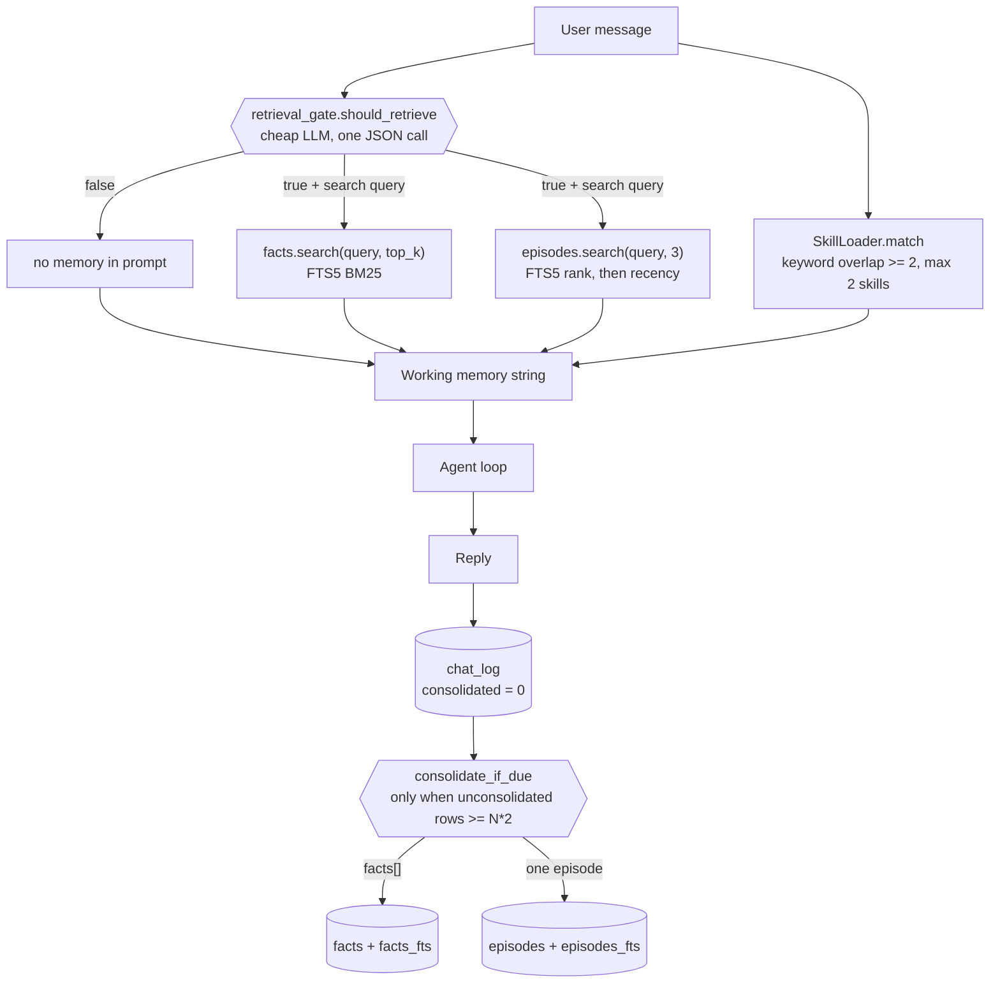
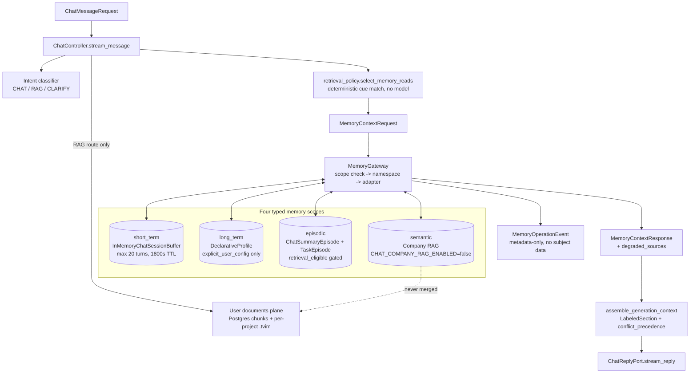
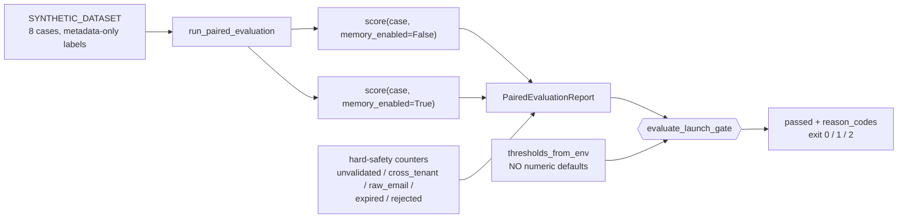

# Waku Agent — Memory System and Memory Evaluation

A specialized companion to [Waku-Agent-System-Design.md](./Waku-Agent-System-Design.md).
That document explains Waku as a whole system. This one covers exactly two
things: **how Waku's agent memory works for its AI chat**, and **how Waku
evaluates that memory** — then sets both side by side against
`EMAIL-AGENT-v1`'s typed memory and paired evaluation.

The goal is comparison, not scoring. The two systems solve different problems,
and the interesting content is *where their assumptions diverge*, because each
divergence is a design decision one of us made and the other did not.

- Waku source read at: `C:\WORK\waku-agent`
- Our source read at: `C:\WORK\EMAIL-AGENT-v1`
- Every claim below cites a file path. Section 10 lists what was verified by
  reading code versus what is inferred.

---

## 0. The shortest useful contrast

| | **Waku** | **Ours (EMAIL-AGENT-v1)** |
|---|---|---|
| What memory *is* | Three cognitive pillars — semantic / episodic / procedural — behind one facade | Four typed scopes — short-term / long-term / episodic / semantic — behind one gateway |
| Who decides to retrieve | A cheap **LLM gate** decides per turn | A deterministic **keyword-cue policy** decides per turn |
| Who decides what to store | A cheap LLM **summarizer** distills chats into facts every N exchanges | The **user's explicit request** is the only authorization; no model may create memory |
| Default posture on failure | **Fail open** — retrieve anyway, a stale memory beats a lost one | **Fail closed** — deny the read, emit a safety event |
| Isolation unit | One local user, one SQLite file | `tenant → user → session → feature → memory_type → record` |
| Memory evaluation | A **bake-off** that races backends and grades four outcomes | A **paired A/B** that measures memory-on vs memory-off deltas against a launch gate |
| Headline metric | `INVENTED` — how often it confidently makes something up | `mean_*_delta` — how much memory actually improved the answer |

Both systems have something the other is missing, and sections 7 and 8 are
about those.

---

## 1. Waku's memory system

### 1.1 The facade

`waku/memory/__init__.py` is a small class holding three stores plus two agents
that manage them. Its own docstring is the map:

```text
procedural  SKILL.md files      how to act
semantic    facts table (FTS5)  what is durably true
episodic    episodes table      what happened, when

retrieval_gate   decides IF a turn needs memory
consolidation    distills chats into facts, every N exchanges
```

Working memory is assembled per turn in `waku/runtime/session.py` and thrown
away afterwards. It is literally string concatenation:

```text
SOUL.md (persona)
+ "Right now it is <local time>"
+ "Your model: <provider/model>"
+ "Relevant memory:\n<facts + episodes>"             <- only if the gate said yes
+ "Relevant skill instructions:\n<SKILL.md bodies>"  <- only on keyword match
```



### 1.2 The retrieval gate — the load-bearing idea

`waku/memory/retrieval_gate.py` runs one small-model call before touching any
store:

```text
{"retrieve": true/false, "query": "<keywords>", "reason": "<5 words>"}
```

Two arguments are made for it in the source. Default-on retrieval is slow, and
— the argument that matters more — irrelevant memories bias the answer. The
module calls this "over-interpretation".

It **fails open**: any exception, or a reply with no JSON in it, returns
`(True, message, reason)`. The stated rationale is that *a stale memory beats a
lost one*. This is the exact opposite of our gateway's posture, and section 3
treats that as the central divergence.

The gate is also *observable*: `Memory.gated_retrieve` takes a `notify`
callback and emits a `gate` event carrying `decision` and `reason`. That single
design choice is what makes the memory benchmark in section 4 possible — "did
retrieval even happen for this probe" is answerable from the run record.

### 1.3 Consolidation — memory is written by a model

`waku/memory/consolidation.py`. Every turn appends two rows to `chat_log` with
`consolidated = 0`. When the backlog reaches `N` exchanges (`2N` rows), a cheap
model reads the whole unconsolidated log and returns:

```json
{"facts": [{"subject": "...", "content": "..."}], "episode": "..."}
```

Facts land in semantic memory with `source='consolidation'`; the episode lands
in episodic memory dated today; the rows are flagged consolidated.

Three properties worth naming:

- **Batched, not per-turn.** The stated reason is that a summarizer needs
  enough context to judge what is worth keeping in a month.
- **Loss-safe.** Every failure path returns `0` — the log stays unconsolidated
  and is retried next time. It never throws away raw material.
- **Model-authored.** The model decides what becomes durable memory. There is
  no user authorization step anywhere in this path.

### 1.4 Procedural memory — skills as memory

`waku/memory/procedural/loader.py` scans `SKILL.md` files (Anthropic Agent
Skills frontmatter: `name` + `description`) from the bundled `skills/` directory
and `WAKU_HOME/skills`. Matching is deliberately transparent — set intersection
of 3+-character lowercase tokens between the message and `name + description`,
requiring overlap >= 2, capped at 2 skills. The loader re-scans when any
`SKILL.md` mtime changes, so a skill the agent writes mid-session is live on
the next turn.

Progressive disclosure is the point: frontmatter is always scanned (cheap),
bodies load only on match, referenced files only if the model asks.

We have no equivalent of this pillar at all.

### 1.5 The FactStore contract and the swappable backend

`waku/memory/semantic/base.py` defines a `runtime_checkable` `Protocol` with
six methods plus `settle()`:

| method | caller |
|---|---|
| `add`, `search` | the agent, every turn |
| `list`, `search_with_ids` | the dashboard, and the agent's `manage_memory` tool |
| `update`, `delete` | humans correcting memory; the agent when a fact goes stale |
| `settle(timeout)` | bulk writers that read straight back — i.e. the benchmark |

The docstring is unusually candid about *why* the Protocol exists. Before it,
`SqliteFactStore` had six methods and `SupabaseFactStore` had two, and the
worst failure was silent: `search_with_ids` was guarded by
`hasattr(...) else []`, so the agent told users "no matching facts" while the
facts sat in the database. The lesson stated in-source — *"a guard around a
missing method doesn't prevent a bug; it converts a loud one into a silent
lie"* — is worth lifting verbatim into our own review standards.

Backends selected by `WAKU_SEMANTIC_STORE`: `sqlite` (default, FTS5),
`supabase` (pgvector), `mem0`, `zep`, `langmem`. Episodic selects `sqlite` or
`notion`. Every backend is held to the contract by
`evals/deterministic/test_fact_store_conformance.py` (14 tests) which runs
against *every* store, so a non-conforming backend fails CI rather than a user.

`settle()` deserves its own note, because it exists purely to make benchmarking
honest:

- **sqlite** returns `True` instantly — the row and its FTS index land in one
  transaction.
- **mem0** has *no* readiness signal; a live measurement put a row 14s from
  queryable. The adapter polls until the row count *stops changing* (3 stable
  reads, 2s apart) rather than waiting for a target count, because with
  extraction on, the store decides how many memories your sentences become.
- **zep** exposes `Episode.processed`, which the adapter's docstring calls
  "necessary and NOT sufficient" — every episode reported processed while the
  derived graph still held zero matching nodes. So it waits for *processed AND
  a node count that has held still*.

### 1.6 Storage model

One SQLite file, `~/.waku/state.db` (`waku/db.py`). Tables: `calendar_events`,
`facts` + `facts_fts` (plus three sync triggers), `episodes` + `episodes_fts`,
and `chat_log` (role, content, `consolidated`, `session_id`, `source`, `meta`).
Sessions are just a label on `chat_log` rows.

`Memory.export_markdown()` mirrors every fact and episode into
`~/.waku/MEMORY.md` after each turn, so "your memory is a file you can open" is
literally true. `state.db` remains the source of truth; the file is a generated
view.

There is **no tenant, no per-request scope, and no authorization anywhere** in
Waku's memory layer. It is a single-user local agent and the code is honest
about that.

One implementation detail is worth borrowing outright. `_fts_query` in
`semantic/store.py` reduces user text to FTS5 tokens using `[^\W_]{2,}` —
matching exactly what the unicode61 tokenizer keeps — because an ASCII-only
`[a-zA-Z0-9]` truncated accented Latin ("Müller" became `ller`) and reduced
every non-Latin script to an empty query. An empty query was not a no-op:
`SqliteEpisodeStore.search()` reads it as "give me the recent ones", so a user
asking about a Cyrillic name was handed an unrelated English episode under the
heading "Relevant memory". Given our golden set is Vietnamese, that is a failure
mode we should assume applies to us until measured.

---

## 2. Our memory system

Source: `src/cowork_agent/features/ai_chat/`. Architecture record:
[c3-api-ai-chat.md](../../architectures/c3-api-ai-chat.md).

### 2.1 Four typed scopes behind a fail-closed gateway



1. **Short-term** — `session_buffer.py`. In-process, newest-N logical turns
   (`CHAT_MEMORY_MAX_TURNS=20`) with an inactivity TTL refreshed on append
   (`CHAT_MEMORY_TTL_SECONDS=1800`). Thread-locked, sweeps expired entries.
   Requires `record_id == session_id` and refuses a `source_id`.
2. **Long-term declarative** — a compact `DeclarativeProfile` (language,
   timezone, persona, tone), each field capped at 200 characters.
3. **Episodic** — `ChatSummaryEpisode` (always `retrieval_eligible=false`) and
   `TaskEpisode` with a validation lifecycle.
4. **Semantic** — company RAG, gated by `CHAT_COMPANY_RAG_ENABLED` (default
   **false**), and even when enabled still requires a policy cue.

User documents are a *second semantic plane*, not a fifth memory type, and the
two are never merged.

### 2.2 Namespacing is the primitive

`MemoryNamespace.logical_key()` builds
`user_id/session_id/feature/memory_type/record_id`. `MemoryGateway` checks the
request's scope against the verified chat scope *before* any adapter call, and
re-checks identity on the way back out — a profile whose `user_id` differs from
the scope raises `NamespaceAccessDenied` and emits a `profile_scope_denied`
safety event even though the adapter returned it.

Episodic reads are filtered *after* retrieval to `retrieval_eligible` AND
`validation_status in {USER_APPROVED, COMPLETED}` AND `user_id == scope.user_id`,
then truncated to `max_items`, with the discarded count reported as
`filtered_count`. Waku has no equivalent of a post-retrieval eligibility filter,
because it has no concept of a memory that exists but may not be read.

### 2.3 Retrieval is a deterministic policy, not a model

`retrieval_policy.select_memory_reads` tokenizes the message, strips
punctuation, and looks for exact n-gram cue phrases:

- episodic cues: `previous task`, `prior task`, `past task`, `related work`,
  `earlier task`
- semantic cues: `company policy`, `company procedure`, `company handbook`,
  `employee handbook`, `our policy`, `our procedure`

Matched reads get `max_items=5`, `min_score=0.6`, `timeout_ms=500`; unmatched
reads become explicitly-disabled read objects rather than omissions. Short-term
and long-term are always read.

This is the same decision Waku's gate makes, reached by the opposite mechanism:
**zero tokens, zero latency, fully reproducible, and brittle to phrasing.** A
user asking "what did we do on the last one?" gets no episodic read from us and
would get one from Waku.

### 2.4 Writes are authorized, not inferred

Two pure policy modules stand between a caller and any durable write.

`profile_policy.authorize_profile_write` refuses unless the namespace is
`LONG_TERM`, the profile's `user_id` matches, and provenance is
`EXPLICIT_USER_CONFIG`. Nothing a model produces can carry that provenance.

`episode_policy.authorize_task_episode_write` round-trips the episode through
`TaskEpisode.from_dict(episode.to_dict())` to get a canonical trusted copy, then
requires: episodic namespace; scope, record and source all matching;
`creation_reason == "explicit_user_task_request"`;
`validation_status == SYSTEM_GENERATED`; `retrieval_eligible` false; correct
`source_type`; and a timezone-aware `expires_at` strictly after `created_at`. It
returns the *trusted* copy, so the caller's object is not what gets written.

`retrieval_policy.is_explicit_task_request` is the upstream authorization: verb
directives (`create/make/add/draft/prepare/build` + optional fillers + `task` or
`action plan`), plus the `turn this into a task` form, minus negation markers
(`do not`, `don't`, `never`, `no`).

Compare this with `consolidation.py`, where a model reads the chat log and
writes whatever it decides is durable. **That is the single largest
philosophical gap between the two systems.**

### 2.5 Retention, deletion, observability

- `retention.compute_expires_at` — UTC-only, positive-int-only, `bool` rejected
  explicitly. `MemoryPurgeCoordinator.purge_expired` runs both purges and emits
  metadata-only delete events. Defaults `CHAT_PROFILE_RETENTION_SECONDS` and
  `CHAT_EPISODE_RETENTION_SECONDS` are 7,776,000s (90 days).
- `memory_observability.py` — `MemoryOperationEvent` carries only
  `memory_type / operation / outcome / result_count / filtered_count /
  latency_ms / reason_code`. Counts are bounded to 10,000; `reason_code` must be
  a short alphanumeric identifier. `LoggingMemoryOperationSink` swallows every
  exception so telemetry can never take a turn down; DENIED outcomes log at
  ERROR as `memory_safety_incident`.
- Deletion path is `delete_profile` / `delete_task_episode` /
  `delete_chat_summary` / `delete_all_for_user`.

Waku has none of this. Its nearest equivalents are `manage_memory` (an agent
tool) and the dashboard's CRUD page, plus a JSONL trace per run.

### 2.6 Context assembly has explicit precedence

`generation_context.assemble_generation_context` produces `LabeledSection`s
tagged with a `ContextSource`, and — the part with no Waku analogue — a declared
`conflict_precedence` tuple:

```text
current_instruction
  > current_project_evidence   (only when project docs are present)
  > current_company_evidence
  > stored_preference
  > advisory_episode           (advisory=True)
```

Episodes enter as *advisory*. Waku concatenates facts, episodes and skills into
one prompt string under one heading, with no ranking between sources and no
signal about which should win a conflict.

### 2.7 One thing that is built but not wired

`write_chat_summary` exists on the gateway (`memory_gateway.py:320`), on the
port (`ports.py:149`), in the Postgres repository (`postgres.py:440`), and in
unit and integration tests — but **grep finds no production caller**. Nothing in
`ChatController.stream_message` writes a chat summary.

The practical consequence: we have no consolidation loop at all. Short-term
memory expires after 30 minutes of inactivity and nothing distills it into
anything durable. Waku's `consolidation.py` is exactly the missing producer, and
§7.8 treats this as a high-value borrow.

---

## 3. Memory: dimension-by-dimension

| Dimension | Waku | Ours | Why the difference exists |
|---|---|---|---|
| **Memory taxonomy** | Semantic / episodic / procedural (cognitive-science framing) | Short-term / long-term / episodic / semantic (lifecycle + policy framing) | Waku teaches the concept; we enforce a data-governance boundary |
| **Working memory** | `Session.history`, last `history_turns` exchanges, rebuilt per turn | `InMemoryChatSessionBuffer`, newest 20 turns + 30-min TTL, last 8 into the prompt | Ours must survive a multi-user server; Waku's lives in one process |
| **Retrieval decision** | LLM gate, one small-model call, returns query + reason | Deterministic n-gram cue match, no model | Waku buys recall with tokens; we buy reproducibility with brittleness |
| **Retrieval failure** | Fail **open** — retrieve anyway | Fail **closed** — deny, emit safety event, degrade typed | Waku's worst case is a wasted search; ours is a cross-tenant leak |
| **Search** | FTS5 BM25 keyword (or pgvector / mem0 / zep / langmem) | Vector + BM25 hybrid with optional rerank, `min_score=0.6`, `top_k=5` | Ours indexes documents; Waku indexes one user's short facts |
| **Non-ASCII search** | `_fts_query` matches unicode61 exactly; CJK runs prefix-searched | Embedding-based; golden set is Vietnamese | Both hit the same bug class; Waku's fix is documented alongside the failure it caused |
| **Write authority** | A model (`consolidation.py`) | The user, via `explicit_user_config` / `explicit_user_task_request` | The core divergence |
| **Write batching** | Every N exchanges, loss-safe retry | N/A — no automatic producer exists | Our gap (§2.7) |
| **Read eligibility** | Everything stored is retrievable | `retrieval_eligible` + `validation_status`, filtered post-retrieval | We can store something we may not surface; Waku cannot express that |
| **Correcting a stale fact** | `manage_memory` tool + dashboard CRUD; row stores leave the old fact equally retrievable | Profile overwrite; episode lifecycle transition | Neither has temporal invalidation; Zep (a Waku backend) does |
| **Isolation** | One local user, one SQLite file | `tenant/user/session/feature/type/record`, checked in both directions | Different products |
| **Backend pluggability** | 5 semantic backends behind one Protocol + a conformance suite | Postgres repositories behind ports; no cross-backend conformance suite | Waku's whole benchmark depends on this |
| **Procedural memory** | `SKILL.md`, progressive disclosure, agent can author skills | **None** | A real capability gap |
| **Human-readable mirror** | `~/.waku/MEMORY.md` regenerated every turn | None | Cheap, and unusually good for debugging |
| **Telemetry** | JSONL trace per run + OTel; gate decision emitted as an event | Metadata-only `MemoryOperationEvent` + Langfuse `@observe` spans | Ours is privacy-shaped; Waku's is debugging-shaped |
| **Retention/purge** | None | `compute_expires_at` + `MemoryPurgeCoordinator`, 90-day defaults | A compliance requirement we have and Waku does not |

---

## 4. Waku's evaluation strategy for memory

This is the half worth studying closely. Waku treats memory evaluation as a
first-class engineering problem with its own harness, its own fairness rules,
and — critically — its own honesty rules.

### 4.1 Two tiers that are never allowed to mix

`CLAUDE.md` states the rule and the directory layout enforces it:

- `evals/deterministic/` — pytest, 0/1 truths, no model, no keys. 497 test
  functions across the suite; memory-relevant files include
  `test_memory_arena.py` (50 tests), `test_episodic_store_switch.py` (15),
  `test_fact_store_conformance.py` (14), `test_consolidation.py` (13),
  `test_memory_search.py` (12), `test_retrieval_gate.py` (11).
- `evals/judge/` — DeepEval `GEval`, 0–1 scores with thresholds, real model
  calls, skipped when no key is present.

`waku/ops/release_gate.py` composes them: deterministic must pass **100%** or
the gate closes with exit 1; the judge suite runs only when the active
provider's key is present; the verdict is persisted to `eval_report.json` and
appended to `eval_runs.jsonl`. CI
(`.github/workflows/validate-skills.yml`) runs the deterministic tier only — no
keys in CI.

### 4.2 The Memory Arena — the centerpiece

`waku/ops/memory_arena.py` (43.7 KB) races memory *backends* through one fixed
harness and one fixed model. Its sibling `arena.py` does the reverse — fixed
harness, varying model. **One dial each, so a result means something.**


### 4.3 Four outcomes instead of pass/fail

This is the idea most worth stealing. From the module docstring:

| outcome | meaning |
|---|---|
| `PASS` | the expected answer is there |
| `STALE` | the expected answer is missing and a **superseded** one is asserted |
| `INVENTED` | a refusal was correct and it answered anyway |
| `MISS` | the expected answer is missing and nothing wrong was asserted — the honest failure |

The argument: *"A system that says 'I don't know' is behaving correctly under
uncertainty. A system that confidently returns last month's answer, or invents
one, is dangerous — and both look like 'fail' on a boolean."*

`INVENTED` is called "the number the whole exercise exists to produce."
`scoreboard()` sorts by `(-INVENTED, -STALE, -MISS, -PASS)` so the dangerous
column cannot be buried.

A probe declares what a right answer contains (`expect_any` / `expect_all`) and
— more usefully — what a **wrong** one contains (`stale_any`), plus
`expect_refusal` and `expect_retrieval`. Four probe *types* ship in the example
fixture: `recall`, `update`, `restraint`, `reasoning`.

`score()` is a pure function over strings, so the entire scoring layer is
testable offline with no model, no keys, no network — 50 deterministic tests
cover it. Only the runner costs money.

### 4.4 The control contestant

A contestant named `control` is seeded with **nothing** and asked
**everything**. It should fail every probe. Any probe it *passes* is not a
memory probe at all — it is one the model can answer from training data.

This is not hypothetical, and the source says so: the dinner track once asked
what a well-known founder always wears and what another dislikes. With an empty
store, the model answered both correctly, citing an essay. **Three of seven
probes were scoring the model, not the store, and nothing on screen said so.**

Leak detection is careful about which probes it flags: `expect_retrieval=False`
probes (designed to need no memory) and `expect_refusal` probes (passed by
declining, which an empty store always does) are excluded, or they would be
flagged forever and mean nothing.

### 4.5 Harness fairness — five rules, each from a real bug

The runner's comments read as a list of ways a memory benchmark lies:

1. **Seed conversationally, never via `facts.add()`.** Some backends sell their
   own extraction step; handing every backend a pre-extracted fact list would
   skip the feature half of them exist to provide. Every contestant hears the
   same sentences a user would type.
2. **Flush consolidation before probing** (`every_n=1`). Otherwise the tail of
   the seed conversation is still sitting unconsolidated and the store was never
   given those facts.
3. **Forget the conversation before probing** (`session.start_new("probes")`).
   With `history_turns=12` and an 8-exchange seed, every seeded fact was still
   in the context window — three probes passed *with the gate reporting "no
   lookup"*, meaning the contestant was never used. "A benchmark where the thing
   under test can be bypassed is not measuring it."
4. **Wait for the store to become searchable** (`settle()`), or you score the
   network and score it as amnesia.
5. **Isolate on both sides.** Each contestant gets a throwaway home named by
   `sha256(track, model, seed)[:12]` — which also makes seeding cacheable
   (seeding was 53% of a race) and is a staleness guard by construction. Hosted
   stores get a matching `waku-arena-<hash>` partition, because before that fix
   every race wrote benchmark seeds into the operator's real mem0/Zep memory
   under the shared default user `waku`.

### 4.6 The judge over the heuristic

Refusal detection starts as a phrase list (`_REFUSALS`, roughly 30 phrasings).
The source is explicit that the list *will never be complete*, so `score()`
returns `certain=False` on every verdict resting on it, and the runner sends
exactly those probes to a neutral judge (`adjudicate_refusal`, a binary "did
this reply decline?", sharing `judge_client()` with the model arena).

The bug that forced this is documented in-source: LangMem answered *"Nothing
shared about Pikachu's food preferences"* — a correct refusal — and scored
`INVENTED`, because the list held "nothing about" and not "nothing shared". The
conclusion drawn is a standard worth adopting verbatim:

> **A benchmark may not publish a verdict it cannot defend.**

An unreachable judge returns `None` and changes nothing — the heuristic stands,
still flagged uncertain, rather than silently converting "I could not check"
into either verdict.

### 4.7 Per-probe receipts

Every probe row records `contestant, probe, test, question, answer, outcome,
certain, why, retrieved, tokens, calls, ms`. Two of those exist because of
specific past failures: `retrieved` (the gate decision, previously computed and
discarded at render time — "which is most of what a memory benchmark is for"),
and `calls` (read by counting ledger rows, because the token delta alone left
"why does one question cost 4,783 tokens" answerable only by guessing).

Token cost is a **delta** against a cumulative ledger, because storing the
running total per row would make the scoreboard sum a triangular number and
report several times the tokens actually spent.

### 4.8 Retrieval-gate accuracy — asymmetric costs

`evals/judge/test_retrieval_gate_accuracy.py` (29 KB) is the other memory eval,
and its statistical framing is the most transferable idea in the repo.

The two error directions are **not symmetric**:

- **false NO** — the gate refused to look, so a fact the user supplied is
  silently absent from the reply, and nothing in the trace says why.
- **false YES** — one local FTS5 search and a few hundred characters of prompt.

So the headline is a **cost-weighted score** with `FALSE_NEGATIVE_COST = 4.0`
against `FALSE_POSITIVE_COST = 1.0`:

```text
incurred = fn * 4.0 + fp * 1.0
worst    = positives * 4.0 + negatives * 1.0
weighted = 1 - incurred / worst
```

Accuracy is still reported — deliberately *second*, labeled "it treats both
errors as equal, which they are not". Both directions get their own report
section; every miss prints a warning naming the case. The 4:1 ratio is a named
constant precisely so a reader can disagree with it.

Three further refinements:

- **A "yes" is only half the decision.** A correct yes carrying a useless query
  retrieves nothing, which from outside is indistinguishable from a correct no.
  So a separate `GEval` metric scores whether the gate's *search query* would
  actually find the memory.
- **The judge never sees the ground-truth label.** It independently scores
  whether the decision was *defensible*, not whether it matched.
- **This test measures; it does not gate.** A false negative does not fail it,
  because it is live small-model behaviour across eleven providers and
  `make gate` runs it — a hard assertion would make the release gate hostage to
  provider drift.

### 4.9 The honest-framing discipline

`docs/benchmarks.md` and `docs/memory-backends-playbook.md` are as much a part
of the strategy as the code. The recurring pattern: **name what the number does
not mean, next to the number.**

- The battery does not reproduce SWE-bench / tau-bench / Terminal-Bench; it is
  "the local, reproducible mirror".
- The Mem0 adapter calls `add()` with `infer=False` to satisfy the FactStore
  contract, which **turns Mem0's extraction off** — so an arena result measures
  its *retrieval*, not its extraction. Stated in the playbook, not buried.
- LangMem's store card shows *unreadable* rather than "0 facts", because
  reporting zero "would be a false statement about an empty store instead of a
  true one about an unreadable one".
- A backend that errors reports the error, never an empty list — "'0 facts' and
  'I could not reach the service' look identical on screen and mean opposite
  things".
- The referee must not be racing. K3 was dropped as judge both because a
  contestant grading its own round is not credible, and because judging every
  column at once 429'd its own endpoint.
- The shipped probe fixture is deliberately dull and says so: *"waku ships the
  mechanism... The questions are yours, and they should be: a memory benchmark
  is only meaningful against the kind of facts your users actually store."*

---

## 5. Our evaluation strategy for memory

### 5.1 Paired evaluation — the A/B we have and Waku does not

`features/ai_chat/evaluation.py` + `evaluation_runner.py`.



Every case is scored **twice** — memory off and memory on — across three axes:

| axis | question |
|---|---|
| `continuity` | did memory make the conversation cohere? |
| `grounded` | was the answer grounded in evidence? |
| `citation` | were the citations right? |

The report carries per-axis **mean deltas**, per-axis enabled means, and a
`degradation_rate` — the fraction of cases where memory made *any* axis worse.
That last one is the metric Waku has no analogue for: Waku can tell you which
backend is better, but never whether memory is helping at all.

### 5.2 The launch gate is fail-closed on twelve checks

`evaluate_launch_gate` returns `passed` plus `reason_codes`. Seven are quality
thresholds (three deltas, three absolute enabled scores, one degradation
ceiling). Five are **hard safety counters that must be exactly zero**:

```text
hard_safety_unvalidated_retrieval
hard_safety_cross_tenant
hard_safety_raw_email
hard_safety_expired_record
hard_safety_rejected_retrieval
```

`thresholds_from_env` has **no numeric defaults** — any missing or unparsable
`EVAL_*` variable raises, and the CLI exits 2 with *"launch thresholds require
explicit product-approved configuration"*. Nobody can accidentally ship against
a default threshold. This is stricter than anything in Waku's gate.

### 5.3 The honest gap: the scorer is a lookup table

`evaluation_dataset.DeterministicPairedScorer` says so in its own docstring —
*"This is a STAND-IN for real model scoring at MVP tier."* Disabled scores come
from a hardcoded per-case table; enabled scores add fixed bonuses (+0.15/+0.08
continuity, +0.12/+0.06 grounded and citation) keyed off metadata-only labels.
No randomness, no clock, no network, **and no model**.

It is also self-fulfilling: the base table was "recalibrated so disabled
per-case scores sit in [0.50, 0.62] and the memory-enabled means comfortably
clear the product-approved 0.6 bar." Running the gate today proves the *gate
math* works. It cannot fail on a real regression, because no real system is
being measured.

The hard-safety counters have the same shape: `run_paired_chat_evaluation.py`
passes all five as literal `0` with the comment *"sourced as constants from
test-suite safety evidence; do not fake nonzero."* They are asserted, not
observed — even though `MemoryOperationMetrics.safety_incidents()` already
counts exactly these events at runtime.

And the script is **not in CI** — `.github/workflows/ci.yml` runs ruff, mypy,
pytest and the frontend checks; nothing invokes the launch gate.

### 5.4 Where our real memory correctness lives

Not in the paired eval. It lives in the policy unit suite, and that suite is
genuinely strong:

| file | tests | what it pins |
|---|---|---|
| `test_memory_gateway.py` | 44 | scope denial, degradation, eligibility filtering, event emission |
| `test_retrieval_policy.py` | 12 | cue matching, negation, task-directive parsing |
| `test_episode_policy.py` | 10 | every rejection branch on episode writes and transitions |
| `test_memory_observability.py` | 7 | bounded, metadata-only events |
| `test_profile_policy.py` | 7 | provenance and scope refusal |
| `test_evaluation*.py` | 18 | report math, threshold loading, dataset shape |

Plus integration coverage: `test_chat_profile_repository.py`,
`test_task_episode_repository.py`, `test_chat_summary_repository.py`,
`test_chat_memory_backup_restore.py`, `test_chat_memory_deletion_audit.py`.
971 test functions repo-wide.

These are **safety-invariant tests**, and they answer "can memory leak, or be
written without authorization?" What no test answers is *"does memory make the
answer better?"* — which is exactly what the paired eval was built for, and what
the stand-in scorer prevents it from doing.

### 5.5 The layered harnesses

`evaluations/HARNESS-GUIDE.md` separates three layers, each with its own script,
on the principle that *"a failure in one is invisible in the others"*:

```text
[ROUTING]     evaluate_routing.py / evaluate_chat_routing.py
[RETRIEVAL]   evaluate_retrieval.py    Hit@1/3, MRR, Recall@5, abstention, p95
[GENERATION]  evaluate_chat_rag.py     grounding + citation validity
```

The guide's non-optional rules are strong and have no Waku equivalent:

- **Reports are metadata-only** — no email bodies, chunk text, prompts, or model
  answers in any committed artifact; a unit test asserts it.
- **The hashing embedder is not semantic** — `--dry-run` validates mechanics
  only; never compare a hashing report to a Gemini report.
- **Reports are only comparable at equal corpus size** (1,043 vs 1,066 chunks is
  not a valid A/B).
- **"A report is not a result."**
- **Read the slices, not the headline** — a stack can look fine overall and
  score near zero on semantic probes.

`evaluate_retrieval.py` also has real CI gates (`--fail-under-mrr`,
`--fail-under-doc-mrr`, `--fail-under-recall`, `--fail-over-latency-p95`), and
the golden set is Vietnamese with labeled `lexical / mixed / semantic` probe
types and named distractors.

---

## 6. Evaluation: dimension-by-dimension

| Dimension | Waku | Ours |
|---|---|---|
| **Core question** | "Which memory backend behaves best, and how does it fail?" | "Does memory improve the answer, and can it leak?" |
| **Experimental design** | Bake-off — N backends, one harness, one model, one dial | Paired A/B — one system, memory on vs off, per case |
| **Baseline** | A `control` contestant told nothing | The memory-disabled variant of each case |
| **Failure taxonomy** | 4 outcomes; `INVENTED` and `STALE` separated from `MISS` | 3 continuous axes + a `degradation_rate` |
| **Scoring** | Pure string functions, offline-testable; judge only on uncertain refusals | Lookup-table stand-in; no model anywhere |
| **Are the numbers real?** | Yes — real model, real stores, real network, real dollars (a measured dinner race cost ~$4.36 on the priciest pinned model) | No — synthetic labels and hardcoded score tables |
| **Cost asymmetry modelled?** | Yes — 4:1 false-negative weighting, both directions reported | No |
| **Safety in the gate** | Not applicable — single user | Yes — 5 hard counters that must be 0 |
| **Thresholds** | Deterministic 100%; judge threshold 0.6 in code | 7 thresholds from env with **no defaults** |
| **Release gating** | `make gate` blocks on deterministic failure; deterministic tier runs in CI | Launch gate exists as a CLI; **not in CI** |
| **Leak detection** | Yes — control-passed probes flagged as "leaked" | No equivalent |
| **Retrieval-decision eval** | Yes — cost-weighted, plus a query-quality metric | No — the cue policy is unit-tested, never scored against intent |
| **Per-item receipts** | tokens, calls, ms, gate decision, verdict + reason, per probe | metadata-only counts, latency, reason codes |
| **Privacy of artifacts** | Warns you to clean up before filming | Enforced by construction and asserted by a test |
| **Layer separation** | Deterministic vs judge, never mixed | Routing vs retrieval vs generation, never conflated |
| **Backend conformance** | Yes — one suite runs against all five stores | No cross-backend conformance suite |

**The clean summary:** Waku's memory evaluation is *behavioural and real, but
single-user and hand-curated*. Ours is *structural and safety-first, but not yet
measuring anything real*. They are complementary, and the borrows run in both
directions.

---

## 7. What to borrow from Waku, ranked

### 7.1 Replace the stand-in scorer with a real one, keeping the paired design

Our design is better than Waku's; our data is not. The paired A/B with a
degradation rate is the right experiment. Feed it real runs:

- Drive `ChatController.stream_message` twice per case — once with
  `MemoryReadOptions(short_term=False, long_term=False, ...)` and once with the
  real policy.
- Score continuity / grounded / citation with a `GEval`-style judge that never
  sees the label, exactly as `test_retrieval_gate_accuracy.py` does.
- Keep the metadata-only rule: store case IDs and scores, never text.

### 7.2 Adopt the four-outcome taxonomy on top of our three axes

`INVENTED` and `STALE` are not expressible in our current report, and both are
failure modes an email-and-documents assistant can genuinely commit. Concretely:
add `stale_any` and `expect_refusal` fields to the evaluation dataset, and add
`invented_count` / `stale_count` to `PairedEvaluationReport` alongside the
existing hard-safety counters. `evaluation.py` already has the validation
scaffolding for bounded nonnegative counts.

### 7.3 Add a control arm

Run each case with all four memory scopes disabled and no retrieval. Any case
the control passes is not testing memory — it is testing the model. Our 8-case
synthetic set has never been checked for this, and Waku found three of seven
probes leaking on a set someone had hand-curated on purpose.

### 7.4 Wire the hard-safety counters to real telemetry

`MemoryOperationMetrics.safety_incidents()` already aggregates DENIED outcomes
by `reason_code`. Feed that into `run_paired_evaluation(**safety)` instead of
passing literal zeros. The counters then *observe* rather than assert, and the
gate becomes capable of failing.

### 7.5 Put the launch gate in CI

Once 7.1 and 7.4 land, add it to `.github/workflows/ci.yml`. A gate that never
runs is documentation.

### 7.6 Score the retrieval decision, with asymmetric costs

Our cue policy is unit-tested for *what it does*, never for *whether it was
right*. Build the equivalent of `test_retrieval_gate_accuracy.py`: a labeled set
of messages with a ground-truth "should this have read episodic/semantic?" and a
cost-weighted headline. Our asymmetry may not be 4:1 — for a document-grounded
assistant a false YES that injects the wrong company policy may cost more than
Waku's wasted FTS5 search — and picking that ratio deliberately is the exercise.

That evaluation is also the honest way to decide whether the cue list should
stay deterministic. Right now we cannot say what recall
`{"previous task", "prior task", "past task", "related work", "earlier task"}`
achieves against real phrasings, and a measured miss rate is what would justify
(or refute) adding a model gate.

### 7.7 Adopt three of Waku's honesty rules verbatim

Add to `evaluations/HARNESS-GUIDE.md` §3:

1. **A benchmark may not publish a verdict it cannot defend.** Any verdict
   resting on a heuristic must carry a `certain=False` flag and be escalated.
2. **Unavailable is not zero.** A degraded source must report degraded, never an
   empty result — `MemoryGateway` already does this via `DegradedMemorySource`;
   the rule belongs in the eval artifacts too.
3. **Name what the number does not mean, next to the number.** Our guide already
   does this well for the hashing embedder and corpus size; extend it to every
   new harness.

### 7.8 Consolidation — with our authorization model, not Waku's

The missing producer for `write_chat_summary` (§2.7). Waku's mechanics are
directly reusable: batch after N exchanges, cheap model, one JSON reply, mark
rows consolidated, and **never lose the log on failure**.

What must *not* be copied is the authority model. Waku lets a model write
durable, immediately-retrievable memory. Ours must keep `ChatSummaryEpisode` at
`retrieval_eligible=false` / `SYSTEM_GENERATED` — which `episode_policy` already
enforces — so a summary is stored but not retrievable until something explicit
promotes it. The infrastructure for that promotion is already built.

### 7.9 A `MEMORY.md`-style human-readable mirror

`Memory.export_markdown()` costs about 20 lines and makes memory inspectable
without a query tool. A per-user debug endpoint rendering the profile, episode
list, and eligibility flags would pay for itself the first time someone asks
"why did the assistant say that?"

### 7.10 A cross-backend conformance suite

Waku's `test_fact_store_conformance.py` exists because a partially-implemented
adapter produced a *silent* wrong answer. Our ports are Protocols; nothing runs
one suite against every implementation. As soon as we have a second real
implementation of any memory port, this becomes cheap insurance.

---

## 8. What we already do better

Worth recording, so the comparison is not one-directional.

1. **Fail-closed by default.** Waku's gate fails open on purpose; that is
   correct for a single-user laptop agent and would be a cross-tenant incident
   for us. `NamespaceAccessDenied` plus a typed `DegradedMemorySource` is the
   right posture for a multi-tenant product.
2. **Writes are authorized, not inferred.** No model output can create durable
   memory. `authorize_task_episode_write` even round-trips to a canonical
   trusted copy, so the caller's object is never what gets persisted.
3. **Explicit conflict precedence.** Waku concatenates all memory under one
   heading; we declare which source wins and mark episodes advisory.
4. **Retrieval eligibility as a first-class concept.** "Stored but not
   retrievable" is not expressible in Waku's model.
5. **Retention and purge.** `compute_expires_at` + `MemoryPurgeCoordinator` with
   90-day defaults. Waku has no retention at all.
6. **Metadata-only observability, enforced.** `MemoryOperationEvent` cannot
   carry subject data by construction, and the committed-artifact rule is
   asserted by a test. Waku's playbook has to *warn you* to clean up hosted
   memory before filming.
7. **Thresholds with no defaults.** Nobody can ship against an accidental
   default. Waku's judge threshold is a literal `0.6` in the metric constructor.
8. **Layer separation in the harnesses.** "Never quote one layer's number as
   evidence for another" is a rule Waku's benchmarks doc gestures at but does
   not structurally enforce.

---

## 9. Reading order

If you have an hour, in this order:

**Waku memory**
1. `waku/memory/__init__.py` — the facade, 202 lines, the whole map
2. `waku/memory/retrieval_gate.py` — 55 lines, the central idea
3. `waku/memory/consolidation.py` — 82 lines, how memory gets written
4. `waku/memory/semantic/base.py` — the Protocol, and why it exists
5. `waku/db.py` — the schema, one file

**Waku memory evaluation**
6. `waku/ops/memory_arena.py` lines 1–90 — the four outcomes
7. `waku/ops/memory_arena.py` `run_arena()` — the five fairness rules
8. `evals/judge/test_retrieval_gate_accuracy.py` lines 1–70 — asymmetric costs
9. `docs/memory-backends-playbook.md` — what each backend actually does
10. `docs/benchmarks.md` §8 — the two families of agent evaluation

**Ours, for the mapping**
11. `features/ai_chat/memory_gateway.py` — the fail-closed facade
12. `features/ai_chat/retrieval_policy.py` — our answer to the gate
13. `features/ai_chat/episode_policy.py` — our answer to consolidation
14. `features/ai_chat/evaluation.py` — the paired report and launch gate
15. `evaluations/HARNESS-GUIDE.md` — the layer separation rule

---

## 10. Verification notes

**Verified by reading source during this investigation:**

- Waku: `waku/memory/{__init__,consolidation,retrieval_gate}.py`,
  `waku/memory/semantic/{base,store,mem0_store,zep_store}.py`,
  `waku/memory/episodic/store.py`, `waku/memory/procedural/loader.py`,
  `waku/runtime/session.py`, `waku/db.py`,
  `waku/ops/{memory_arena,judge,scoring,release_gate}.py`,
  `evals/memory_arena.json`, `evals/helpers.py`, `evals/judge/*`,
  `docs/{architecture,benchmarks,memory-backends-playbook}.md`, `CLAUDE.md`,
  `.github/workflows/validate-skills.yml`.
- Ours: `features/ai_chat/{ports,memory_gateway,retrieval_policy,episode_policy,
  profile_policy,session_buffer,retention,memory_observability,
  generation_context,evaluation,evaluation_dataset,evaluation_runner}.py`,
  `domain/_chat_contracts_{common,memory}.py`,
  `scripts/run_paired_chat_evaluation.py`,
  `evaluations/{README,HARNESS-GUIDE}.md`, `.env.example`,
  `.github/workflows/ci.yml`.
- Test counts came from `grep -c "def test_"` per file.

**Specific claims worth re-checking before they are quoted elsewhere:**

- *`write_chat_summary` has no production caller.* Established by
  `grep -rn "write_chat_summary" src/ tests/` — hits are the gateway, the port,
  the Postgres repository, and tests only. Re-run before relying on it.
- *The launch gate is not in CI.* `.github/workflows/ci.yml` contains no
  reference to `run_paired_chat_evaluation`.
- *Waku CI runs only the deterministic tier.* `validate-skills.yml` runs
  `pytest -q evals/deterministic`; the judge tier needs a key and runs via
  `make gate` locally.

**Not verified — do not quote as measured:**

- No arena race, release gate, or paired evaluation was executed during this
  investigation. Every number quoted from Waku (14s mem0 settle time, ~$4.36 per
  dinner race, "three of seven probes leaked", "656 leaked directories", "53% of
  a race is seeding") is quoted **from Waku's own source comments**, not
  independently reproduced.
- The claim that our cue-based retrieval policy has worse recall than an LLM
  gate on real phrasings is an inference from the cue list's size, not a
  measurement. §7.6 is the work that would settle it.
