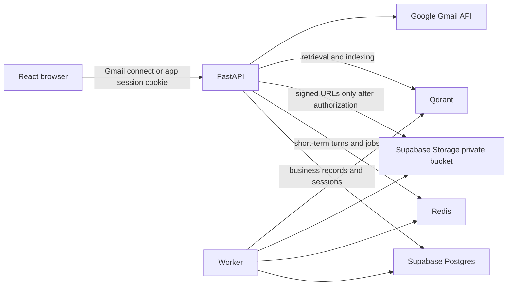

# Supabase Postgres and Storage with Gmail Session Design

**Status:** Proposed — design selected 2026-08-12; implementation not started.

## Goal

Move Cowork Agent from local/demonstration persistence to a multi-user capable
runtime using Supabase Postgres and private Supabase Storage, while retaining
FastAPI as the application boundary and Gmail OAuth as the user login mechanism.
Supabase Auth is explicitly excluded.

## Decisions

1. Supabase is used only as managed Postgres and private object storage. The
   browser never calls its data API and never receives a service-role key.
2. Gmail OAuth is both mailbox consent and the initial identity proof. After a
   successful callback, FastAPI creates a cryptographically random opaque app
   session, stores only its hash, and returns it in a Secure, HttpOnly,
   SameSite=Lax cookie.
3. FastAPI resolves every request to an internal `VerifiedPrincipal` from the
   opaque app session. `user_id` is an immutable internal ID; a Gmail email
   address is an integration attribute and not a primary identity key.
4. One user may own multiple Gmail mailbox connections. A workspace is the
   tenant boundary, and a user can belong to one or more workspaces.
5. Redis remains the execution queue/DLQ and the short-term chat buffer. It is
   not replaced by Supabase Realtime or Postgres polling.
6. Qdrant remains the retrieval engine. The company collection and the
   project-document collection remain physically separate.
7. Raw Gmail bodies, Gmail attachments, prompt context, and copied RAG chunks
   remain excluded from Supabase Postgres and Storage under the existing PRD
   privacy boundary.

## Architecture



FastAPI remains the only public data authority. It validates the opaque
session, derives the `VerifiedPrincipal`, checks workspace/project ownership,
executes policy-sensitive mutations, and exposes the current SSE chat API.
The frontend uses FastAPI for all reads and writes, including profile changes,
episode lifecycle transitions, document upload initiation, and signed download
links.

## Identity and Authorization

### Login flow

1. Browser starts the existing Gmail OAuth connect flow.
2. The OAuth callback verifies the Google identity and finds or creates an
   `app_users` record by the verified Google email.
3. FastAPI creates a default workspace and membership for a first-time user.
4. FastAPI encrypts and persists the Gmail refresh token in the mailbox
   connection record; it never enters the browser.
5. FastAPI creates an `app_sessions` row with a SHA-256 session-token hash,
   user ID, expiry, creation metadata, and revocation timestamp.
6. The plaintext token is sent only as an HttpOnly, Secure cookie. Subsequent
   API requests resolve the principal from that cookie.

### Scope rules

- `workspace_id` replaces the current fixed `LOCAL_TENANT_ID` in persisted
  records and Qdrant filters.
- `user_id` is the internal `app_users.id`, not an OAuth email address.
- Every project belongs to one workspace. Every document belongs to one
  project. Every chat session belongs to one project.
- Ownership checks live in FastAPI service/repository calls. Postgres row-level
  security may be enabled as defense in depth later, but is not the application
  authorization mechanism because the browser does not access PostgREST.

## Data Model

### New durable records

| Record | Essential fields | Purpose |
|---|---|---|
| `app_users` | `id`, `primary_email`, timestamps | Stable internal principal |
| `workspaces` | `id`, `name`, `created_at` | Tenant boundary |
| `workspace_members` | `workspace_id`, `user_id`, `role` | Authorization membership |
| `app_sessions` | hashed token, `user_id`, expiry, revoked timestamp | FastAPI login session |
| `projects` | `id`, `workspace_id`, owner, name, timestamps | ADR-005 document/session container |
| `chat_sessions` | `id`, `workspace_id`, `user_id`, `project_id`, timestamps | Durable replacement for in-memory registry |
| `project_documents` | IDs/scopes, Storage key, digest, status, expiry, error code | Upload and ingestion source of truth |
| `document_ingestion_jobs` | document ID, status, attempts, timestamps, safe error code | Retryable asynchronous ingestion |
| `document_deletion_audits` | document ID, Storage/Qdrant/Postgres outcomes, timestamp | Deletion proof |

### Existing record changes

- Add `workspace_id` and internal `user_id` to runs, tasks, chat profiles,
  summaries, task episodes, and mailbox connections.
- Keep `task_episodes.retrieval_eligible` generated from `validation_status`.
  No API or database migration may make it caller-supplied.
- Extend future episode citations with `citation_scope` (`company` or
  `project_document`) and retain coordinates only; never store chunk text.
- Keep existing task and profile retention settings. Project documents default
  to a configurable 30-day expiry.

## Storage and RAG Design

### Supabase Storage

Use a private `project-documents` bucket. The canonical object path is:

```text
workspace/{workspace_id}/user/{user_id}/project/{project_id}/document/{document_id}/source
```

FastAPI authorizes the request, creates a short-lived signed upload URL, and
persists a `received` document row before returning the URL. The client never
chooses the final object path and cannot overwrite a different document.
Downloads use a short-lived signed URL generated only after the same workspace,
user, and project checks.

### Asynchronous ingestion

1. Upload completion triggers an explicit FastAPI completion endpoint.
2. FastAPI validates object metadata and enqueues a document job in Redis.
3. Worker reads the object, executes the existing guarded PDF/DOCX extraction
   path, and invokes OCR only for eligible PDF pages.
4. A non-empty complete extraction is page-aware chunked, embedded, and
   written to the dedicated Qdrant project-document collection.
5. Worker atomically updates document status: `received -> extracting ->
   indexing -> ready`, or terminal `failed` with a safe error code.
6. Partial or empty extraction is never indexed.

Company knowledge keeps the existing admin-owned collection and selective cue
policy. Project retrieval runs for every turn only when the selected project
has one or more non-expired `ready` documents. Its pre-embedding Qdrant filter
must contain workspace, user, project, ready status, and expiry constraints.

## Durable Chat Runtime

`chat_sessions` replaces `InMemoryChatSessionRegistry` as the ownership source.
The `ChatController` stays request/runtime scoped; it is reconstructed from a
durably owned session rather than retained in `app.state`. The existing
`InMemoryChatSessionBuffer` is replaced with a Redis implementation preserving
the same `ChatSessionBufferPort`: bounded newest-N turns, sliding TTL, exact
namespace validation, and explicit clear behavior.

SSE remains FastAPI-owned. Supabase Realtime is not introduced because stream
ordering, idempotency replay, cancellation, and task-proposal event typing are
already part of the application SSE contract.

## Failure and Deletion Behavior

- Supabase Postgres unavailable: chat reports optional memory degradation only
  for optional reads; profile/episode mutation returns a safe 503; Gmail email
  workflow remains memory-free.
- Redis unavailable: a chat turn cannot use working-memory continuity and
  returns the existing degradation signal; job dispatch follows the existing
  queue failure policy.
- Qdrant unavailable: project-document retrieval returns no evidence with
  `degraded=true`; it never falls back to the company corpus.
- Storage unavailable: document upload or retrieval fails before the document
  enters `ready`; a failed document is excluded from all retrieval.
- Document deletion first makes the document non-retrievable in Postgres, then
  deletes Qdrant points and Storage object, recording every outcome for retry.
  Expiry follows the same order. A removed/expired document is filtered before
  ranking even if asynchronous physical deletion is still retrying.

## ADRs to Add

### ADR-006 — Supabase managed data services without Supabase Auth

Record the choice of Supabase Postgres and Storage, Gmail OAuth plus FastAPI
opaque session, no browser Data API, internal user/workspace IDs, and the
rejected alternatives: Supabase Auth, Gmail-email-as-primary-key, and local
SQLite for multi-user deployment.

### ADR-007 — Project document durability and retrieval boundaries

Extend ADR-005 with the authoritative object location (private Supabase
Storage), durable metadata/job records, Qdrant-only project retrieval, and the
three-store deletion sequence. It must explicitly preserve the separation from
the company corpus and the no-raw-text-in-episodes policy.

## Delivery Increments

1. **Identity and Postgres foundation:** add the new identity/workspace schema,
   mailbox migration, opaque FastAPI sessions, and principal resolver.
2. **Durable chat runtime:** persist sessions, replace only the short-term
   buffer with Redis, and retain current SSE semantics and TaskEpisode policy.
3. **Project documents:** private Storage, ingest job state machine, Qdrant
   collection, project-scoped retrieval, citations, retention, and deletion.

Each increment ships with migration-forward and migration-rollback proof,
authorization isolation tests, and focused integration tests before the next
increment starts.

## Out of Scope

- Supabase Auth, PostgREST browser access, and service-role keys in the client.
- Replacing Redis Streams, FastAPI SSE, or Qdrant.
- Gmail attachment ingestion, in-chat Gmail tools, automatic email actions,
  or user-configurable schedules.
- Indexing raw emails, raw Gmail attachments, full prompts, chat transcripts,
  or copied RAG chunks as user memory.
