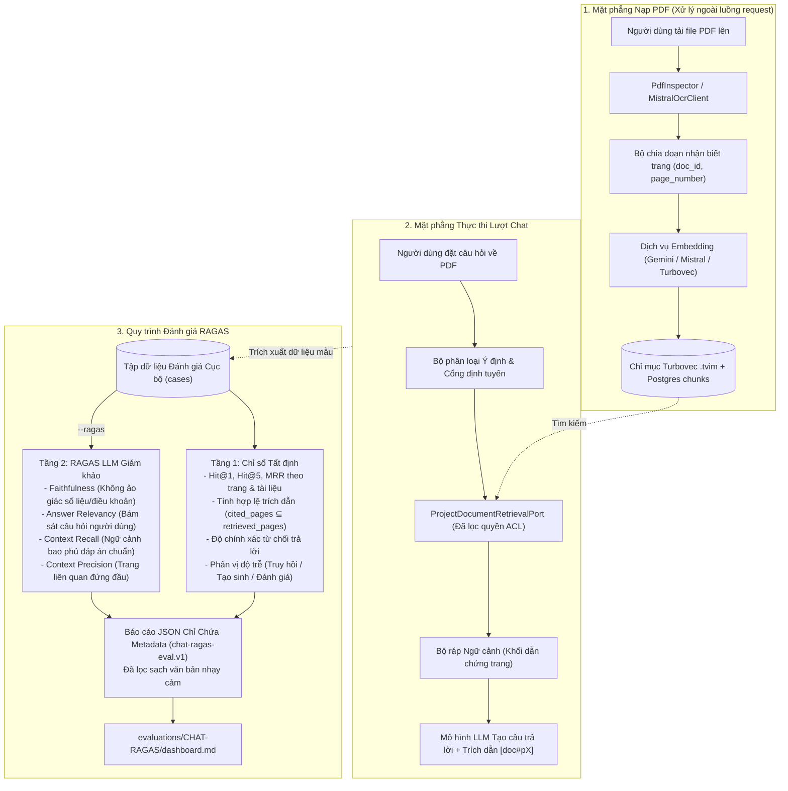

# Không Gian Đánh Giá Chat-RAGAS

Thư mục này được dành riêng để đánh giá luồng AI Chat khi trả lời từ tài liệu
người dùng tải lên (**Chat với tài liệu PDF / DOCX**) hoặc tri thức công ty,
sử dụng kết hợp cả các chỉ số tất định (deterministic) và bộ chỉ số RAGAS (LLM làm giám khảo).

Khu vực này được tách biệt có chủ đích khỏi [RETRIEVAL](../RETRIEVAL/): chất lượng truy hồi
cao không chứng minh được câu trả lời đa lượt là đáng tin cậy, trích dẫn đúng số trang,
hay không bị ảo giác dữ liệu.

---

## 1. Chat với PDF: Luồng Hệ Thống & Quy Trình Đánh Giá RAGAS

Luồng Chat với PDF hoàn chỉnh bao gồm **Mặt phẳng Nạp & Truy hồi Tài liệu**
kết hợp với **Khung Đánh giá RAGAS** để đo lường toàn diện từ truy hồi đến chất lượng tạo câu trả lời:



---

## 2. Quy Trình Các Bước Đánh Giá RAGAS cho Chat với PDF

### Bước 1: Chuẩn bị Tập Dữ Liệu Cục Bộ
Xây dựng tập câu hỏi mẫu bám sát tài liệu PDF với đa dạng các dạng câu hỏi (probes):
- **Câu hỏi tra cứu sự kiện (Factoid):** Nhắm vào bảng biểu, điều khoản hoặc số liệu ở một trang PDF cụ thể.
- **Câu hỏi tổng hợp đa trang (Cross-page):** Đòi hỏi dẫn chứng nằm ở nhiều trang khác nhau trong tài liệu.
- **Câu hỏi ngoài phạm vi (Unanswerable):** Câu hỏi hợp lý nhưng nội dung PDF không đề cập (kiểm tra khả năng từ chối trả lời).

Dữ liệu được lưu trong file cục bộ (ví dụ: `var/eval/chat_pdf_eval.local.json`):

```json
{
  "dataset_version": "pdf-contract-v1",
  "provider": "gemini",
  "model": "gemini-2.0-flash",
  "cases": [
    {
      "id": "pdf-case-001",
      "expected_document_ids": ["nda-contract-2026"],
      "expected_pages": [3],
      "retrieved_document_ids": ["nda-contract-2026", "nda-contract-2026"],
      "citation_document_ids": ["nda-contract-2026"],
      "citation_pages": [3],
      "should_abstain": false,
      "abstained": false,
      "latency_ms": {
        "retrieval": 18,
        "generation": 280,
        "evaluator": 450
      },
      "question": "LOCAL ONLY - Thời hạn bảo mật thông tin trong hợp đồng là bao lâu?",
      "answer": "LOCAL ONLY - Nghĩa vụ bảo mật kéo dài 3 năm kể từ ngày chấm dứt hợp đồng [nda-contract-2026#p3].",
      "contexts": [
        "LOCAL ONLY - Điều 5.2 (Thời hạn): Mọi nghĩa vụ bảo mật theo Thỏa thuận này sẽ tiếp tục có hiệu lực trong thời hạn ba (3) năm kể từ ngày chấm dứt hợp đồng."
      ],
      "reference_answer": "LOCAL ONLY - Nghĩa vụ bảo mật duy trì hiệu lực 3 năm sau khi chấm dứt."
    }
  ]
}
```

### Bước 2: Tính toán Tầng 1 — Các Chỉ Số Tất Định (Offline)
Kiểm tra hiệu quả định tuyến, xếp hạng tìm kiếm, tính hợp lệ của trích dẫn và độ trễ mà không cần gọi API LLM tốn phí:
- **Hit@K & MRR theo Trang / Tài liệu:** Xác nhận tài liệu và trang mục tiêu nằm ở thứ hạng cao.
- **Tính hợp lệ của Trích dẫn (Citation Linkage):** Đảm bảo tất cả số trang được trích dẫn đều tồn tại trong danh sách đoạn trích trả về (`cited_pages ⊆ retrieved_pages`).
- **Độ chính xác Từ chối (Abstention Accuracy):** Đo lường khả năng chủ động từ chối trả lời đối với các câu hỏi ngoài phạm vi tài liệu.

### Bước 3: Đánh giá Tầng 2 — Bộ Chỉ Số RAGAS (`--ragas`)
Khi truyền cờ `--ragas`, kịch bản `scripts/evaluate_chat_rag.py` sẽ thực thi 4 chỉ số nòng cốt:
1. **Faithfulness (Độ trung thực / Phát hiện ảo giác):**
   $$\text{Faithfulness} = \frac{|\text{Số luận điểm được hỗ trợ bởi ngữ cảnh PDF trích xuất}|}{|\text{Tổng số luận điểm trong câu trả lời}|}$$
   Đảm bảo mô hình không tự bịa đặt ngày tháng, điều khoản hay số liệu không có trong PDF.
2. **Answer Relevancy (Độ phù hợp của câu trả lời):**
   Đo lường mức độ câu trả lời đi thẳng vào vấn đề mà không lan man hay né tránh.
3. **Context Recall (Độ bao phủ của ngữ cảnh):**
   $$\text{Context Recall} = \frac{|\text{Số câu trong đáp án chuẩn có dẫn chứng từ đoạn trích PDF}|}{|\text{Tổng số câu trong đáp án chuẩn}|}$$
   Xác nhận bộ truy hồi đã lấy về đầy đủ các trang chứa thông tin cần thiết.
4. **Context Precision (Độ chính xác của ngữ cảnh):**
   Đánh giá mức độ ưu tiên xếp các trang/đoạn trích liên quan lên đầu ngữ cảnh.

### Bước 4: Xuất Báo Cáo Metadata (`chat-ragas-eval.v1`)
Hệ thống tự động lọc bỏ toàn bộ văn bản câu hỏi, câu trả lời và trích đoạn PDF, chỉ ghi các điểm số và thông tin định danh vào `evaluations/CHAT-RAGAS/baselines/`.

---

## 3. Ranh Giới Dữ Liệu & Quy Định Bảo Mật

| Quy định | Chi tiết |
|---|---|
| **Tuyệt đối không commit văn bản PDF** | Văn bản trích từ PDF, câu hỏi thực tế và câu trả lời của người dùng **chỉ lưu cục bộ** và không bao giờ đưa lên Git. |
| **Báo cáo chỉ lưu trữ Metadata** | Báo cáo baseline JSON chỉ lưu Case ID, Document/Page ID, Điểm số đánh giá và Phân vị độ trễ. |
| **Không dùng điểm số làm policy cứng** | Điểm số RAGAS là bằng chứng đo lường chất lượng, không dùng làm điều kiện chặn runtime trước khi hiệu chuẩn thực tế. |

---

## 4. Các Lệnh Thực Thi

```powershell
# 1. Chạy đánh giá tất định offline (nhanh, không tốn API)
uv run python scripts/evaluate_chat_rag.py --input var/eval/chat_pdf_eval.local.json

# 2. Chạy đánh giá RAGAS với mô hình giám khảo (Gemini hoặc Mistral)
uv run python scripts/evaluate_chat_rag.py --input var/eval/chat_pdf_eval.local.json --ragas --evaluator-provider google

# 3. Lưu báo cáo baseline trực tiếp vào thư mục CHAT-RAGAS
uv run python scripts/evaluate_chat_rag.py --input var/eval/chat_pdf_eval.local.json --ragas --output evaluations/CHAT-RAGAS/baselines/chat-rag-eval-2026-08-22-pdf-gemini-2.0-flash.json

# 4. Cập nhật lại bảng điều khiển tổng hợp của dự án
uv run python scripts/build_evaluation_dashboard.py
```

---

## 5. Cấu Trúc Báo Cáo & Thư Mục

```text
evaluations/CHAT-RAGAS/
├── README.md                 # Tài liệu quy ước & luồng đánh giá Chat với PDF
├── dashboard.md              # Bảng theo dõi trạng thái quyết định & kết quả
└── baselines/
    ├── README.md             # Hướng dẫn lưu trữ báo cáo baseline
    └── chat-rag-eval-YYYY-MM-DD-<dataset>-<model>.json
```
