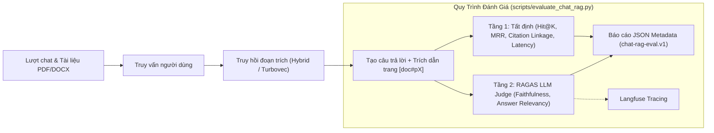

# Bảng Điều Khiển Đánh Giá Chat-RAGAS

> **Trạng thái:** Chưa có báo cáo đánh giá Chat-RAGAS baseline nào được ghi nhận.  
> **Không gian lưu trữ:** [`evaluations/CHAT-RAGAS/baselines/`](./baselines/)  
> **Hợp đồng & Đặc tả:** [`tasks/specs/SPEC-chat-ragas-evaluation.md`](../../tasks/specs/SPEC-chat-ragas-evaluation.md) & [`docs/evaluations/RAGAS.md`](../../docs/evaluations/RAGAS.md)

---

## 1. Trạng Thái Quyết Định Kiến Trúc & Đo Lường

| Khía cạnh | Dẫn chứng hiện tại | Quyết định & Định hướng |
|---|---|---|
| **Phân loại ý định chat (Routing)** | Đã có báo cáo phân loại riêng (`evaluations/CHAT/`) | Cần bảo đảm cổng định tuyến kích hoạt đúng tài liệu người dùng tải lên. |
| **Chất lượng truy hồi (Retrieval)** | Đo bởi Tầng 1 (`Hit@1`, `Hit@5`, `MRR`) & `evaluate_retrieval.py` | Sử dụng harness tất định làm nguồn chân lý, không dùng LLM để đoán lại retrieval. |
| **Tính hợp lệ trích dẫn (Citation Linkage)** | Tầng 1 kiểm tra `cited_pages ⊆ retrieved_pages` | Phải đạt 100% tỷ lệ trích dẫn hợp lệ nằm trong ngữ cảnh đã truy xuất. |
| **Độ trung thực (Faithfulness)** | Tầng 2 RAGAS (`--ragas`) | Mục tiêu $\ge 0.95$ trên bộ golden để bảo đảm không bịa đặt số liệu/điều khoản. |
| **Độ phù hợp (Answer Relevancy)** | Tầng 2 RAGAS (`--ragas`) | Mục tiêu $\ge 0.85$ bảo đảm câu trả lời đi thẳng vào trọng tâm câu hỏi. |
| **Hiệu chuẩn tiếng Việt** | Chưa có prompt dịch tiếng Việt committed | Bắt buộc kiểm định với 30 case người chấm trước khi dùng điểm số làm gate. |
| **Phân bổ độ trễ (Latency)** | Đo riêng p50/p95 cho 3 giai đoạn | Giám sát điểm nghẽn độ trễ giữa retrieval, generation và judge evaluator. |

---

## 2. Tiêu Chí Nghiệm Thu (Adoption Gate)

Một báo cáo baseline được chấp thuận khi đáp ứng đủ các điều kiện:
1. **Ranh giới bảo mật:** 100% báo cáo JSON không chứa văn bản thô của câu hỏi, câu trả lời, hay trích đoạn tài liệu (đã qua kiểm thử đệ quy `_assert_no_local_only_fields`).
2. **Tách biệt mô hình giám khảo:** Mô hình judge phải khác biệt so với mô hình sinh ($\text{model\_judge} \neq \text{model\_generator}$) và ghi nhận rõ ràng cả 2 model trong báo cáo.
3. **Hiệu chuẩn ngôn ngữ:** Điểm số RAGAS chỉ có giá trị khi judge chạy trên prompt tiếng Việt đã được hiệu chuẩn và lưu trữ trong repository.
4. **Cô lập độ trễ:** Báo cáo ghi nhận đầy đủ độ trễ phân vị p50/p95 riêng cho 3 chặng: truy hồi, tạo sinh, và đánh giá.

---

## 3. Sơ Đồ Quy Trình Đánh Giá 2 Tầng

---

## 4. Lịch Sử Các Bản Đo Baseline

*(Bảng này sẽ được cập nhật tự động khi các báo cáo baseline đầu tiên được xuất vào thư mục `baselines/`)*

| Thời gian | Dataset Version | Generator Model | Evaluator Model | Hit@1 | MRR | Citation Valid | Faithfulness | Relevancy | Latency p95 |
|---|---|---|---|---|---|---|---|---|---|
| *Chưa có* | — | — | — | — | — | — | — | — | — |
