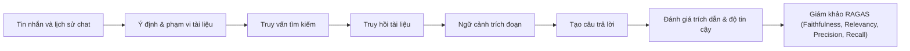

# Bảng Điều Khiển Đánh Giá Chat-RAGAS

> Trạng thái: Chưa có báo cáo đánh giá Chat-RAGAS nào được ghi nhận.

## Trạng Thái Quyết Định

| Khía cạnh | Dẫn chứng hiện tại | Quyết định |
|---|---|---|
| Phân loại ý định chat | Đã có báo cáo phân loại riêng (`evaluations/CHAT/`) | Chưa chứng minh được câu trả lời bám sát tài liệu |
| Chất lượng truy hồi | Chưa có báo cáo Chat-RAGAS | Chưa so sánh được chất lượng tìm kiếm theo trang tài liệu |
| Độ trung thực (Faithfulness) | Chưa có báo cáo Chat-RAGAS | Chưa đánh giá được nguy cơ ảo giác nội dung |
| Độ bao phủ & chính xác ngữ cảnh | Chưa có báo cáo Chat-RAGAS | Chưa đo lường được tính đầy đủ và thứ tự ngữ cảnh |
| Tính hợp lệ của trích dẫn | Chưa có báo cáo Chat-RAGAS | Chưa xác minh được trích dẫn trang có nằm trong ngữ cảnh |
| Phạm vi tài liệu đa lượt | Chưa có báo cáo Chat-RAGAS | Chưa chứng minh được tính cô lập tài liệu qua các lượt chat |
| Phân bổ độ trễ | Chưa có số liệu thành phần | Chưa xác định được điểm nghẽn hiệu năng |

## Sơ Đồ Quy Trình Dự Kiến

Báo cáo kế tiếp cần tuân thủ [hợp đồng Chat-RAGAS](./README.md), bao gồm một tập dữ liệu con đã qua thẩm định của con người, và công bố riêng biệt thời gian truy hồi, tạo sinh cùng thời gian đánh giá.
