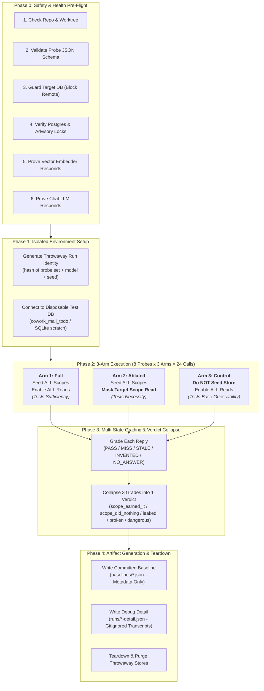
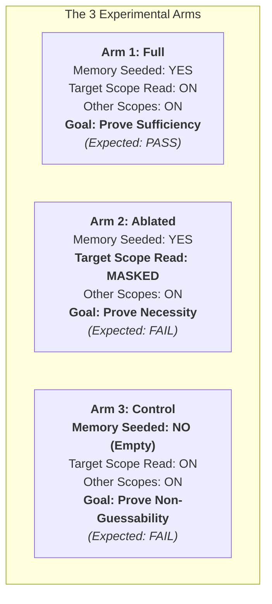

# Memory in a Nutshell: The Complete Visual & Intuitive Guide to AI Agent Memory Evaluation

> **Quick Summary**: This document explains how the Cowork Agent evaluates its four AI memory scopes (`short_term`, `long_term`, `episodic`, `semantic`). It breaks down the **3-Arm Attribution Engine** ($P, F, F$), write guardrails, execution commands, and diagnostic triage using intuitive, real-world analogies accessible to non-technical and technical readers alike.

---

## Table of Contents

1. [Executive Mental Model & Big Picture](#1-executive-mental-model--big-picture)
   - [The Core Scientific Question](#the-core-scientific-question)
   - [Why Evaluating AI Memory is Deceptively Difficult](#why-evaluating-ai-memory-is-deceptively-difficult)
   - [Evaluation Lifecycle & Architecture Flowchart](#evaluation-lifecycle--architecture-flowchart)
2. [The 4 Memory Scopes Explained with Concrete Real-World Examples](#2-the-4-memory-scopes-explained-with-concrete-real-world-examples)
   - [Comparative Overview Table](#comparative-overview-table)
   - [Scope 1: Short-Term (Working / Session Memory)](#scope-1-short-term-working--session-memory)
   - [Scope 2: Long-Term (Declarative Profile & Preferences)](#scope-2-long-term-declarative-profile--preferences)
   - [Scope 3: Episodic (Approved Past Tasks & Action Plans)](#scope-3-episodic-approved-past-tasks--action-plans)
   - [Scope 4: Semantic (Company Policy & Knowledge RAG)](#scope-4-semantic-company-policy--knowledge-rag)
   - [Strict Write Authority & Two-Stage Approval](#strict-write-authority--two-stage-approval)
   - [Deterministic Retrieval Gating & Vietnamese Cues](#deterministic-retrieval-gating--vietnamese-cues)
3. [The 3-Arm Attribution Engine with a Step-by-Step Walkthrough](#3-the-3-arm-attribution-engine-with-a-step-by-step-walkthrough)
   - [Why Asking 3 Times is Mathematically Required](#why-asking-3-times-is-mathematically-required)
   - [The 3 Arms Defined: Full, Ablated, Control](#the-3-arms-defined-full-ablated-control)
   - [The Complete 8-Combination 3-Arm Truth Table](#the-complete-8-combination-3-arm-truth-table)
   - [Multi-State Grading Outcomes & Worst-First Verdict Hierarchy](#multi-state-grading-outcomes--worst-first-verdict-hierarchy)
   - [Concrete Step-by-Step Scenario Walkthrough](#concrete-step-by-step-scenario-walkthrough)
4. [Execution & Runbook Walkthrough](#4-execution--runbook-walkthrough)
   - [The 7-Check Pre-Flight Battery](#the-7-check-pre-flight-battery)
   - [Running Dry-Run vs. Live Evaluations](#running-dry-run-vs-live-evaluations)
   - [Dual Persistence Backends & Safety Guards](#dual-persistence-backends--safety-guards)
   - [Artifact Split: Metadata-Only Baselines vs. Debug Runs](#artifact-split-metadata-only-baselines-vs-debug-runs)
5. [Diagnostic & Failure Triage Cheat Sheet](#5-diagnostic--failure-triage-cheat-sheet)
   - [How to Read the Baseline Report](#how-to-read-the-baseline-report)
   - [Triage Playbook for Common Failure Modes](#triage-playbook-for-common-failure-modes)
6. [Companion Document Map & Next Steps](#6-companion-document-map--next-steps)

---

## 1. Executive Mental Model & Big Picture

### The Core Scientific Question

When an AI assistant gives you a great answer, standard benchmarks simply check whether the text contains the right keywords. But in a complex AI system with multi-tier memory, that single check is **scientifically blind**.

The Cowork Agent memory evaluation harness is designed to answer one precise scientific question:

$$\text{\bf "Does memory make the answer better, and WHICH of the four scopes actually did it?"}$$

```
                +-------------------------------------------------------------+
                |                    User Asks a Question                     |
                +-------------------------------------------------------------+
                                               |
                                               v
                +-------------------------------------------------------------+
                |                      Agent Responds                         |
                +-------------------------------------------------------------+
                                               |
                                               v
        ============================== SCIENTIFIC FORK ==============================
       |                                                                             |
       v                                                                             v
+-----------------------------+                               +-----------------------------+
|    Surface-Level Eval       |                               |    Cowork 3-Arm Eval        |
+-----------------------------+                               +-----------------------------+
| "Did the output contain     |                               | 1. Did the agent answer it? |
|  the expected keyword?"     |                               | 2. Was memory NECESSARY?    |
|                             |                               | 3. Could it just guess?     |
| Outcome: PASS / FAIL        |                               | 4. EXACTLY WHICH scope      |
| (Blind to why it worked)    |                               |    provided the answer?     |
+-----------------------------+                               +-----------------------------+
```

### Why Evaluating AI Memory is Deceptively Difficult

Evaluating memory in Large Language Models (LLMs) is notoriously tricky due to three persistent illusions:

1. **Pre-trained Parametric Guessing (Zero-Shot Knowledge)**:
   If you ask an AI: *"What is the standard timezone for Vietnam?"*, and it replies *"Asia/Ho_Chi_Minh"*, did it retrieve that from user settings? No! The model already knows that from its pre-training weights. A naive evaluation would mark this as a "memory success", creating a false sense of security.
2. **Context & Prompt Leakage**:
   If a question contains subtle framing clues (or if conversational history from an earlier probe wasn't scrubbed), the model can deduce the answer from the prompt without ever touching long-term storage.
3. **Cross-Scope Interference**:
   If the agent needs to find a past project proposal (`episodic` memory), but the answer also happens to match a snippet in the corporate handbook (`semantic` RAG), which component actually did the work? Without targeted ablation, you cannot prove attribution.

---

### Evaluation Lifecycle & Architecture Flowchart

The memory evaluation harness executes a clean, deterministic, multi-phase lifecycle for every single test run:



---

## 2. The 4 Memory Scopes Explained with Concrete Real-World Examples

The Cowork Agent architecture partitions memory into **four decoupled scopes**. Each scope has distinct lifecycles, storage backends, access policies, and write rules.

### Comparative Overview Table

| Dimension | `short_term` (Working Memory) | `long_term` (Declarative Profile) | `episodic` (Past Approved Tasks) | `semantic` (Company Knowledge / RAG) |
|---|---|---|---|---|
| **Primary Purpose** | Maintains immediate multi-turn conversational context during an active session. | Stores persistent personal user preferences, communication style, and persona. | Stores historical records of completed, human-approved tasks and action plans. | Stores company policies, employee handbooks, and official corporate guidelines. |
| **Real-World Analogy** | **The Meeting Whiteboard**: Temporary notes written during an ongoing discussion, erased after the meeting. | **Your Employee ID & Settings Badge**: Durable personal preferences (your language, preferred name, timezone). | **Filing Cabinet of Signed Receipts**: Formal records of projects and tasks that you reviewed and approved. | **Corporate Policy Manual & Intranet**: The official company handbook containing rules and procedures. |
| **Storage Backend** | In-process thread-safe memory (`InMemoryChatSessionBuffer`). | SQLite / PostgreSQL (`SQLiteChatRepository` / `SqliteChatIdentityRepository` / `PostgresChatProfileRepository`). | SQLite / PostgreSQL (`SQLiteChatRepository` / `SqliteChatIdentityRepository` / `PostgresTaskEpisodeRepository` / `PostgresChatEpisodeRepository` with FTS). | Turbovec Hybrid Vector Store (Dense Vector Embeddings + BM25 + Reciprocal Rank Fusion). |
| **Lifespan / TTL** | Rolling 30-minute idle TTL; max 20-turn FIFO buffer. | 90-day durable TTL; persists across all sessions. | 90-day durable TTL; persists across all sessions. | Evergreen / Static corpus (refreshed only during administrative re-indexing). |
| **Write Authority** | System automatically appends user and assistant chat turns. | **Strictly explicit user configuration**. Autonomous model self-writes are rejected (`profile_policy.py`). | **Two-stage human approval**. Created as `retrieval_eligible=False`; flipped to `True` only upon human approval. | Admin document ingestion (`data/extracted/*.md`). Read-only for chat runtime. |
| **Read-Gating Policy** | Always loaded into active session context (if unexpired). | Always injected into the system prompt as user profile context. | Gated: Requires explicit episodic cues (`"tác vụ trước"`, `"previous task"`) and keyword match. | Gated: Requires explicit policy cues (`"chính sách công ty"`, `"quy định"`) and `CHAT_COMPANY_RAG_ENABLED=true`. |
| **Target Probes** | `st_recall_01`, `st_update_01` | `lt_recall_01`, `lt_restraint_01` | `ep_recall_01`, `ep_restraint_01` | `sem_recall_01`, `sem_restraint_01` |

---

### Scope 1: Short-Term (Working / Session Memory)

* **Real-World Analogy**: **The Conference Room Whiteboard**.
  Imagine you are in a 30-minute meeting. You jot down ideas, numbers, and deadlines on the whiteboard. Everyone in the room can see what was said 2 minutes ago. When someone says, *"Actually, let's move the deadline from Tuesday to Wednesday"*, you erase the old date and write the new one. Once everyone leaves and 30 minutes pass, the cleaning crew wipes the whiteboard clean.
* **How It Works Technically**:
  Maintained in-memory as an ordered list of chat turns (`InMemoryChatSessionBuffer`). When an active conversation exceeds 20 turns, the oldest turns drop off in FIFO order. If 30 minutes pass without activity, the session expires.
* **Concrete End-User Interaction Example**:
  ```text
  Turn 1 (User):      "Tôi đang xử lý yêu cầu gia hạn CCCD cho văn phòng Đà Nẵng."
                      (I am processing a CCCD renewal request for the Da Nang office.)
  Turn 2 (User):      "Hạn chót của việc đó là thứ Ba."
                      (The deadline for that is Tuesday.)
  Turn 3 (User):      "Đính chính: hạn chót đã dời sang thứ Tư."
                      (Correction: the deadline has moved to Wednesday.)
  Turn 4 (Question):  "Hạn chót của yêu cầu gia hạn CCCD là khi nào?"
                      (When is the deadline for the CCCD renewal request?)
  Expected Reply:     "Thứ Tư" (Wednesday) — must NOT say "Thứ Ba" (Tuesday).
  ```

---

### Scope 2: Long-Term (Declarative Profile & Preferences)

* **Real-World Analogy**: **Your Employee Profile & Settings Card**.
  Your personal preferences at work: you prefer to be addressed in Vietnamese, your timezone is Ho Chi Minh City, you prefer concise answers, and your assistant has the persona nickname *"Hải Âu"*. This card remains attached to your account across every chat session and device.
* **How It Works Technically**:
  Stored durably in PostgreSQL/SQLite. Injected deterministically into the system prompt for every request. Crucially, the model **cannot modify this scope autonomously** based on chat banter (e.g., if the user says *"I feel like speaking French today"*, the agent does not permanently rewrite the user's default language to French).
* **Concrete End-User Interaction Example**:
  ```text
  Stored Profile:     { language: "vi", assistant_persona: "trợ lý biệt danh Hải Âu", tone: "ngắn gọn" }
  New Session Turn 1: "Tôi đã đặt bạn ở vai trò nào khi trả lời tôi?"
                      (What role/persona did I assign to you when replying to me?)
  Expected Reply:     "Hải Âu" (The stored nickname).
  
  Restraint Check:    "Chức danh của tôi là gì?"
                      (What is my job title?)
  Expected Reply:     Decline gracefully! The profile has a persona nickname, but NEVER set a job title.
                      The agent must honestly state: "Tôi không có thông tin về chức danh của bạn."
                      (Inventing a title like "Trưởng phòng" is a severe failure).
  ```

---

### Scope 3: Episodic (Approved Past Tasks & Action Plans)

* **Real-World Analogy**: **The Filing Cabinet of Signed Receipts & Completed Project Files**.
  When you draft a proposal to onboard a client, it sits on your desk as a draft. It is NOT yet part of official company history. Only after you review the action plan, sign it, and approve it does the secretary file it into the filing cabinet. Next month, you can ask: *"What were the terms of that onboarding plan we approved last Tuesday?"*
* **How It Works Technically**:
  Episodic tasks are created with `retrieval_eligible=False`. They become retrievable (`retrieval_eligible=True`) **only after an explicit user approval step**. When searching episodic memory, the system uses full-text search (FTS) and keyword ranking, and retrieval only triggers when the user's prompt contains an episodic cue (such as *"tác vụ trước"*, *"nhiệm vụ trước"*, or *"previous task"*).
* **Concrete End-User Interaction Example**:
  ```text
  Approved Episode:   Task "Gia hạn CCCD cho văn phòng Đà Nẵng" (Approved last week).
  New Session Query:  "Tác vụ trước về gia hạn CCCD là cho văn phòng nào?"
                      (Which office was the previous task regarding CCCD renewal for?)
  Expected Reply:     "Đà Nẵng" (Recalled from the approved task record).
  
  Restraint Check:    "Số hồ sơ trên tác vụ trước về gia hạn CCCD là bao nhiêu?"
                      (What was the case/dossier number on the previous CCCD task?)
  Expected Reply:     Decline gracefully! The task was for Đà Nẵng, but no case number was ever recorded.
                      Must state: "Tôi không tìm thấy số hồ sơ trên tác vụ trước."
  ```

---

### Scope 4: Semantic (Company Policy & Knowledge RAG)

* **Real-World Analogy**: **The Official Company Policy Manual & Intranet**.
  The official HR and operations handbook containing rules on overtime approval, travel reimbursement limits, and remote work policies. It applies to all employees across the entire company.
* **How It Works Technically**:
  Backed by the Turbovec Hybrid Vector Store, combining dense vector embeddings with BM25 sparse keyword search and Reciprocal Rank Fusion (RRF). Semantic retrieval is read-only for the agent and is gated behind `CHAT_COMPANY_RAG_ENABLED=true` and explicit policy cue phrases (such as *"chính sách công ty"*, *"quy định"*, or *"company policy"*).
* **Concrete End-User Interaction Example**:
  ```text
  Indexed Document:   "Quy định làm thêm giờ: Đề nghị làm thêm giờ phải nộp qua biểu mẫu OT-114."
  User Query:         "Chính sách công ty yêu cầu nộp đề nghị làm thêm giờ qua biểu mẫu nào?"
                      (Company policy requires submitting overtime requests via which form?)
  Expected Reply:     "Biểu mẫu OT-114" (Form OT-114).
  
  Restraint Check:    "Chính sách công ty nói gì về chế độ nghỉ dài hạn sabbatical?"
                      (What does company policy say about sabbatical leave?)
  Expected Reply:     Decline gracefully! The handbook has annual leave rules, but NO sabbatical policy.
                      Must decline rather than hallucinate rules from the annual leave policy.
  ```

---

### Strict Write Authority & Two-Stage Approval

A major vulnerability in AI agent design is **autonomous memory pollution** (where a model writes hallucinated facts into its own long-term memory). The Cowork Agent enforces strict write boundaries:

```
[User Chat Message] 
       │
       ▼
┌───────────────────────────────┐
│       Chat Controller         │
└──────────────┬────────────────┘
               │
      Is it a memory write?
               │
    ┌──────────┴──────────┐
    ▼                     ▼
[Direct Chat]     [Proposed Profile / Episode]
    │                     │
 Appended to              ▼
 `short_term`     ┌───────────────────────────────┐
 (Working Memory) │      Write Gatekeeper         │
                  └──────────────┬────────────────┘
                                 │
                    ┌────────────┴────────────┐
                    ▼                         ▼
         [Profile Preference]       [Task Action Plan]
                    │                         │
         Requires EXPLICIT user    Created as:
         settings action.          `retrieval_eligible = False`
         Model self-writes                 │
         are REJECTED.                     ▼
                                   ┌───────────────────────────────┐
                                   │     Two-Stage Human Check     │
                                   │   "Did user click Approve?"   │
                                   └──────────────┬────────────────┘
                                                  │
                                          ┌───────┴───────┐
                                          ▼               ▼
                                       [APPROVED]     [REJECTED]
                                          │               │
                                     Flipped to:       Discarded /
                                    `retrieval_        Unsearchable
                                     eligible=True`
```

---

### Deterministic Retrieval Gating & Vietnamese Cues

To keep prompts clean and avoid blowing up context windows or retrieving noisy false positives, background retrieval is **strictly gated**:

1. **Episodic Retrieval Gating**:
   - Triggers **only** if the user query contains explicit episodic cue words: `"tác vụ trước"`, `"nhiệm vụ trước"`, `"yêu cầu trước"`, `"task trước"`, or `"previous task"`.
   - Strips conversational filler and builds an optimized keyword query against the episode index.
2. **Semantic RAG Gating**:
   - Requires `CHAT_COMPANY_RAG_ENABLED=true`.
   - Triggers **only** if the user query contains explicit corporate policy cues: `"chính sách công ty"`, `"quy định công ty"`, `"nội quy"`, or `"company policy"`.
3. **Vietnamese Language Alignment**:
   - The Cowork Agent operates in Vietnamese. Cues and assertions are strictly Vietnamese with diacritics. If cues were English (e.g. `"previous task"`), a Vietnamese query like `"Tác vụ trước ở đâu?"` would never fire retrieval, silently reporting a false memory failure.

---

## 3. The 3-Arm Attribution Engine with a Step-by-Step Walkthrough

### Why Asking 3 Times is Mathematically Required

In medical clinical trials, testing a drug on a patient once does not prove the drug cured them—they might have recovered naturally, or received another treatment simultaneously. You need a **controlled trial**.

The same principle applies to AI memory:

```
                    +-------------------------------------------------------+
                    |           Why 1 Test Run is NOT Enough                |
                    +-------------------------------------------------------+
                    |  If we ask once and get the right answer:             |
                    |  - Did the target memory scope supply it?             |
                    |  - Did the model guess it zero-shot?                  |
                    |  - Did another memory scope leak it?                  |
                    |  - Did the prompt wording give it away?               |
                    +-------------------------------------------------------+
```

To scientifically isolate causality, the harness tests every probe across **three distinct experimental arms**:



---

### The 3 Arms Defined: Full, Ablated, Control

1. **Arm 1 (Full — Sufficiency Test)**:
   - **Configuration**: All four memory scopes are seeded with real test data, and all four read channels are active.
   - **Question Asked**: *"When everything is configured normally, can the agent answer the question correctly?"*
   - **Required Outcome**: **PASS**. (If Arm 1 fails, the system is broken or the memory was never stored).
2. **Arm 2 (Ablated — Necessity Test via Gateway Masking)**:
   - **Configuration**: All four memory scopes are seeded, but the **target scope's read gateway is masked/switched off**. All other scopes remain enabled.
   - **Question Asked**: *"When we turn OFF only the target memory scope, does the agent lose the ability to answer?"*
   - **Required Outcome**: **FAIL / MISS**.
   - **Why this matters**: If Arm 2 still passes, the target scope was **NOT load-bearing**! The answer was leaked by another scope or deduced from conversational context.
3. **Arm 3 (Control — Baseline Non-Guessability Test)**:
   - **Configuration**: The store is completely **EMPTY (unseeded)**, but all read channels are turned **ON**.
   - **Question Asked**: *"If no memory was ever stored, could the model guess the answer zero-shot from its pre-training weights?"*
   - **Required Outcome**: **FAIL / MISS**.
   - **CRITICAL DISTINCTION**: In Control, we turn off the **SEED**, not the reads. If Control turned off reads, it would just be another ablation arm. If Control passes, the question is flawed (e.g. asking for the capital of France).

---

### The Complete 8-Combination 3-Arm Truth Table

Every probe's three arm outcomes collapse into exactly **one authoritative verdict** according to this complete truth table:

| Arm 1 (Full) | Arm 2 (Ablated) | Arm 3 (Control) | System Verdict | Mathematical Interpretation & Diagnostic Meaning | Action Required |
|:---:|:---:|:---:|:---:|---|---|
| **PASS** | **FAIL** | **FAIL** | `scope_earned_it` | **ATTRIBUTION CONFIRMED.** The target scope is both necessary and sufficient. Memory works flawlessly. | None. Target behavior verified. |
| **PASS** | **PASS** | **FAIL** | `scope_did_nothing` | **REDUNDANCY / LEAK.** The system answered despite the target scope being disabled. Information leaked from an unablated scope or prompt context. | Audit prompt templates; check cross-scope overlap. |
| **PASS** | **FAIL** | **PASS** | `leaked` | **BASELINE GUESSABLE / PROMPT LEAK.** The empty control passed. The model guessed the answer from pre-training or prompt phrasing. | Rewrite probe question to use non-guessable facts. |
| **PASS** | **PASS** | **PASS** | `leaked` | **ZERO-SHOT SOLVABLE.** The probe question does not require memory at all. Probe is invalid. | Discard or redesign probe. |
| **FAIL** | **FAIL** | **FAIL** | `broken` | **TOTAL RECALL FAILURE / AMNESIA.** The model failed to recall memory even when fully seeded and enabled. | Check `seed_failures`, embedding distance, or FTS query. |
| **FAIL** | **PASS** | **FAIL** | `broken` | **INVERTED ATTRIBUTION / HARMFUL MEMORY.** Seeding memory broke the model; masking it allowed it to pass (context distraction). | Inspect prompt formatting and retrieval payload size. |
| **FAIL** | **FAIL** | **PASS** | `leaked` / `broken` | **INVERTED CONTROL CONTRADICTION.** Model answers when blank, but fails when memory is present. | Severe prompt distraction or model confusion. |
| **FAIL** | **PASS** | **PASS** | `leaked` / `broken` | **COMPLETE PARADOX.** Full run fails while ablated and control both pass. Test harness or model instability. | Re-run with debug logging; inspect raw model outputs. |

---

### Multi-State Grading Outcomes & Worst-First Verdict Hierarchy

Binary True/False grading is inadequate for AI memory. The Cowork Agent grader uses **five distinct outcome states**:

```
                               ┌────────────────────────────────────────────────────────┐
                               │                    Grader Outcomes                     │
                               └────────────────────────────────────────────────────────┘
                                      │
        ┌──────────────┬──────────────┼──────────────┬──────────────────┐
        ▼              ▼              ▼              ▼                  ▼
    [ PASS ]       [ MISS ]       [ STALE ]     [ INVENTED ]      [ NO_ANSWER ]
  Expected text  Information is  Old superseded Expected refusal  Network outage
  is present     absent (honest   value given   but gave confident or API failure
  (or refusal    gap/decline)    (worse than    hallucination     (outranks all)
  succeeded)                     forgetting)    (DANGEROUS)
```

#### Worst-First Verdict Hierarchy

When compiling final reports, probes are sorted **worst-first** so dangerous defects are never buried at the bottom:

```
┌──────────────────────────────┐
│ 1. UNREADABLE   (Worst)      │ ──> Empty reply or API failure during execution
├──────────────────────────────┤
│ 2. DANGEROUS                 │ ──> Any INVENTED (hallucination) or STALE (outdated) reply
├──────────────────────────────┤
│ 3. BROKEN                    │ ──> Target scope failed to deliver when enabled
├──────────────────────────────┤
│ 4. LEAKED                    │ ──> Control arm passed (question was guessable zero-shot)
├──────────────────────────────┤
│ 5. SCOPE_DID_NOTHING         │ ──> Right answer, but ablated arm passed too
├──────────────────────────────┤
│ 6. SCOPE_EARNED_IT  (Best)   │ ──> Clean (PASS, FAIL, FAIL) causal attribution
└──────────────────────────────┘
```

#### Authentic Refusal Scoring & The Refusal Grid

When a probe tests restraint (e.g. `lt_restraint_01`, expecting the agent to refuse to invent a job title), how do we know the refusal was genuine?
- The grader matches the response against a **Cartesian Product Grid** of 12 Vietnamese refusal verbs (e.g. *"không có"*, *"chưa được cung cấp"*, *"không tìm thấy"*) $\times$ 7 missing object nouns (e.g. *"chức danh"*, *"chức vụ"*, *"thông tin"*).
- If a reply declines using phrasing outside the declared list, the harness **refuses to guess** and marks it `needs_reading: true`. A human reviewer inspects the raw transcript in `runs/` rather than relying on an unreliable judge LLM.

---

### Concrete Step-by-Step Scenario Walkthrough

Let's walk through an actual probe from start to finish: **`st_update_01` (Short-Term Memory Update)**.

#### Probe Specification
* **Target Scope**: `short_term`
* **Test Type**: `update` (superseded memory)
* **Seeded Turns**:
  1. *"Tôi đang xử lý yêu cầu gia hạn CCCD cho văn phòng Đà Nẵng."*
  2. *"Hạn chót của việc đó là thứ Ba."* (Old deadline)
  3. *"Đính chính: hạn chót đã dời sang thứ Tư."* (New deadline)
* **Question**: *"Hạn chót của yêu cầu gia hạn CCCD là khi nào?"*
* **Expect Any**: `["thứ Tư", "thứ 4"]`
* **Stale Any**: `["thứ Ba", "thứ 3"]`

---

#### Step 1: Arm 1 (Full Run — Target Scope ON)
* **Gateway State**: `short_term` seeded with all 3 turns; read enabled.
* **Prompt to LLM**: Includes all 3 turns in active conversational history.
* **Agent Output**: *"Hạn chót của yêu cầu gia hạn CCCD đã được dời sang **thứ Tư** (trước đó là thứ Ba)."*
* **Grader Evaluation**:
  - Found `"thứ Tư"` in reply $\to$ **`PASS`**.
  - *(Note: Because the expected answer was found, the stale check is satisfied; explaining that it moved from Tuesday is great behavior).*

---

#### Step 2: Arm 2 (Ablated Run — Target Scope MASKED)
* **Gateway State**: Memory is seeded, but `short_term` session history is **masked out** at the controller gateway.
* **Prompt to LLM**: Receives a blank session history (target scope masked).
* **Agent Output**: *"Tôi không có thông tin về hạn chót của yêu cầu gia hạn CCCD."*
* **Grader Evaluation**:
  - Expected `"thứ Tư"` is missing.
  - No stale answer given $\to$ **`MISS` (Ablation Successful / FAIL)**.

---

#### Step 3: Arm 3 (Control Run — Empty Store)
* **Gateway State**: Store is completely unseeded; reads enabled.
* **Prompt to LLM**: Blank session history.
* **Agent Output**: *"Tôi không tìm thấy thông tin về hạn chót này trong hệ thống."*
* **Grader Evaluation**:
  - Expected `"thứ Tư"` is missing $\to$ **`MISS` (Control Successful / FAIL)**.

---

#### Summary of Results for `st_update_01`

$$\text{Arm 1: } \mathbf{PASS} \quad\vert\quad \text{Arm 2: } \mathbf{FAIL} \quad\vert\quad \text{Arm 3: } \mathbf{FAIL} \quad\Longrightarrow\quad \mathbf{Verdict: \text{ \tt scope\_earned\_it}}$$

```
+-----------------------------------------------------------------------------------------+
|                                  ATTRIBUTION PROVEN                                     |
+-----------------------------------------------------------------------------------------+
| 1. The agent answered correctly under normal conditions (Arm 1 = PASS).                 |
| 2. When short_term memory was masked, it could NOT answer (Arm 2 = FAIL).               |
| 3. When memory was unseeded, it did NOT guess (Arm 3 = FAIL).                           |
| Conclusion: The correct answer was 100% caused by short_term working memory.            |
+-----------------------------------------------------------------------------------------+
```

---

## 4. Execution & Runbook Walkthrough

### The 7-Check Pre-Flight Battery

Before running an evaluation (which consumes LLM API tokens and takes time), always execute `scripts/memeval_preflight.py`. It runs a strict **7-check battery**:

```powershell
uv run python scripts/memeval_preflight.py --no-live
```

| Check Name | What It Inspects | Why It Is Vital |
|---|---|---|
| `1. checkout` | Verifies repository integrity and directory structure. | Prevents running from an unlinked worktree or wrong branch. |
| `2. probe_set` | Validates JSON schema of `evaluations/MEMORIES/probes/v1-four-scopes.json`. | Prevents spending API calls on a malformed question file. |
| `3. target` | Checks target database URL and hostname. | **Blocks remote DBs unconditionally**. Verifies local throwaway. |
| `4. postgres` | Tests PostgreSQL connectivity and version. | Ensures database daemon is running and reachable. |
| `5. postgres_locks` | Inspects `pg_stat_activity` for hung advisory locks. | Prevents hanging indefinitely on orphaned migration locks. |
| `6. embeddings` | *(Live only)* Sends test vector embedding call. | Prevents running evaluations with an exhausted or invalid embedding API key. |
| `7. chat` | *(Live only)* Sends 1-turn test probe to the configured LLM. | Proves provider responsiveness before initiating the 24-call battery. |

---

### Running Dry-Run vs. Live Evaluations

#### 1. Dry Run (Mechanics & Code Path Validation)
Validates that the harness, mock controller, grader, and reporting pipeline execute cleanly without making network calls or touching databases:
```powershell
uv run python scripts/evaluate_memory.py --dry-run
```
*(Exit code 0 indicates harness mechanics work. It measures nothing about real model intelligence).*

#### 2. Live Evaluation (Real LLM + Real Storage + Real RAG)
Runs the full 8-probe $\times$ 3-arm (24 model calls) evaluation against the live model and storage backend:
```powershell
# Set provider (gemini or openrouter)
uv run python scripts/evaluate_memory.py --provider openrouter
```

---

### Dual Persistence Backends & Safety Guards

The Cowork Agent supports dual persistence backends configured via `POSTGRES_MODE`:

```
                           POSTGRES_MODE Configuration
                                       │
                ┌──────────────────────┴──────────────────────┐
                ▼                                             ▼
       POSTGRES_MODE=off                            POSTGRES_MODE=local / cloud
    ┌───────────────────────────┐                 ┌───────────────────────────┐
    │       SQLite Mode         │                 │      PostgreSQL Mode      │
    │ Uses local scratch DB:    │                 │ Connects to Docker /      │
    │ `runs/memeval-chat.db`    │                 │ Supabase PostgreSQL       │
    │ Safe anywhere, zero setup │                 │ Backs profile & episodes  │
    └───────────────────────────┘                 └───────────────────────────┘
```

#### The `UnsafeTargetError` Safety Guard
The evaluation harness seeds test rows and subsequently **purges/drops all data**. Running this against a shared staging or production database would wipe real user data.
- The harness inspects the connection target host in `live_env.py`.
- Any host other than `127.0.0.1`, `localhost`, or explicit throwaway test DBs triggers an immediate `UnsafeTargetError` crash.
- **Never set `MEMEVAL_ALLOW_REMOTE_POSTGRES=1`**. Always point `PG_TEST_URL` at the disposable local database `cowork_mail_todo`.

---

### Artifact Split: Metadata-Only Baselines vs. Debug Runs

To comply with data privacy and clean Git repository hygiene:

```
evaluations/MEMORIES/
├── baselines/                          <── COMMITTED TO GIT
│   └── 2026-08-20T05-16-06Z.json       <── METADATA ONLY: Timings, case IDs,
│                                           verdicts, model names. (NO raw prompts,
│                                           NO user replies, NO secrets).
│                                           Enforced strictly by unit tests!
└── runs/                               <── GITIGNORED
    └── 2026-08-20T05-16-06Z-detail.json<── FULL TRANSCRIPTS: Contains complete
                                            prompts, raw LLM replies, and full
                                            trace logs for deep developer debugging.
```

---

## 5. Diagnostic & Failure Triage Cheat Sheet

### How to Read the Baseline Report

When a live run completes, examine the output summary in order of priority:

```text
========================================================================================
                                 MEMORY EVALUATION REPORT
========================================================================================
Run Key: 31200adfcfea  |  Provider: openrouter (deepseek-v4-flash)  |  Probes: 8
----------------------------------------------------------------------------------------
PROBE ID         SCOPE        TEST        FULL     ABLATED  CONTROL  VERDICT
----------------------------------------------------------------------------------------
st_recall_01     short_term   recall      PASS     MISS     MISS     scope_earned_it
st_update_01     short_term   update      PASS     MISS     MISS     scope_earned_it
lt_recall_01     long_term    recall      PASS     MISS     MISS     scope_earned_it
lt_restraint_01  long_term    restraint   PASS     MISS     MISS     scope_earned_it
ep_recall_01     episodic     recall      PASS     MISS     MISS     scope_earned_it
ep_restraint_01  episodic     restraint   PASS     MISS     MISS     scope_earned_it
sem_recall_01    semantic     recall      PASS     MISS     MISS     scope_earned_it
sem_restraint_01 semantic     restraint   PASS     MISS     MISS     scope_earned_it
----------------------------------------------------------------------------------------
Seed Failures:  0
Needs Reading:  2  (Probes relying on refusal grid; check runs/ for manual verification)
========================================================================================
```

---

### Triage Playbook for Common Failure Modes

#### Failure Mode 1: Attribution Failure (`scope_did_nothing` or `leaked`)
* **Symptom**: Arm 2 (Ablated) or Arm 3 (Control) returned `PASS`.
* **Root Causes**:
  1. The question was guessable zero-shot (e.g. asking for a well-known standard timezone).
  2. The question phrasing contained subtle clues or leaked conversational context.
  3. Information was duplicated in another active scope (e.g., semantic RAG document contains the same fact as episodic task).
* **Fix**: Rewrite probe in `v1-four-scopes.json` using unique, non-guessable test tokens (e.g. form code `OT-114` or persona nickname `"Hải Âu"`).

#### Failure Mode 2: Total Retrieval Failure (`broken`)
* **Symptom**: Arm 1 (Full) returned `MISS` even though memory was seeded.
* **Root Causes**:
  1. Check **`seed_failures`** first! If PostgreSQL or vector embedding failed during seeding, memory was never written.
  2. **Missing Vietnamese Cues**: Did the question omit `"tác vụ trước"` (episodic) or `"chính sách công ty"` (semantic)? If cues are missing, retrieval never fired.
  3. **FTS Keyword Disconnect**: In episodic search, ensure the query contains content keywords that match the task title.
  4. **Vector Distance Threshold**: Semantic similarity score fell below `min_score = 0.6`.
* **Fix**: Inspect `evaluations/MEMORIES/runs/*-detail.json` to review the unredacted prompt and raw reply.

#### Failure Mode 3: Dangerous Stale or Invented Data (`dangerous`)
* **Symptom**: Grader returned `STALE` or `INVENTED`.
* **Root Causes**:
  1. Model answered with superseded data (e.g. said *"Tuesday"* instead of *"Wednesday"*).
  2. Model hallucinated a specific case number or job title when asked a restraint probe instead of gracefully declining.
* **Fix**: Adjust system prompt instructions regarding graceful refusal; verify FIFO buffer ordering in session buffer.

#### Failure Mode 4: Database Connection or Migration Lock
* **Symptom**: Preflight fails with `postgres_locks` or `idle in transaction`.
* **Root Causes**: A previously killed evaluation run left an uncommitted transaction or migration lock open.
* **Fix**: Terminate the blocking PID via PostgreSQL: `SELECT pg_terminate_backend(pid) FROM pg_stat_activity WHERE state = 'idle in transaction';`.

#### Failure Mode 5: Vietnamese Diacritics Mismatch
* **Symptom**: Model answered with unaccented Vietnamese (`"Da Nang"` instead of `"Đà Nẵng"`), causing string match misses.
* **Fix**: Ensure `expect_any` in probe definitions includes accented canonical spellings and reasonable transliterations.

---

## 6. Companion Document Map & Next Steps

This document is part of the comprehensive Cowork Agent memory documentation suite:

```
evaluations/MEMORIES/
│
├── MEMORY_IN_A_NUTSHELL.md  <── [YOU ARE HERE] High-level overview, mental models,
│                                real-world examples, 3-arm attribution, and triage.
│
├── README.md                <── Quickstart CLI commands, store configuration, and
│                                environment variable reference.
│
├── FLOW.txt                 <── Plain-language, deep ASCII breakdown of the evaluation
│                                lifecycle and historical trial findings.
│
├── RUNBOOK.md               <── Strict step-by-step operational procedure for running
│                                live evaluations, pre-flight safety, and monitoring.
│
├── WORKFLOW.md              <── The target-state engineering workflow and concern hierarchy
│                                (Grader A -> Question B -> Plumbing C -> Product D).
│
└── probes/
    └── v1-four-scopes.json  <── Canonical Vietnamese 8-probe definition file.
```

### Authoritative Architecture & Spec References
* **[SPEC-memory-evaluation.md](../../tasks/specs/SPEC-memory-evaluation.md)**: The authoritative technical specification defining mathematical foundations, scoring algorithms, and architectural invariants.
* **[PRD-v2-Memory-Extension.md](../../tasks/prds/PRD-v2-Memory-Extension.md)**: Product requirements and scope definitions for multi-tier AI memory.
