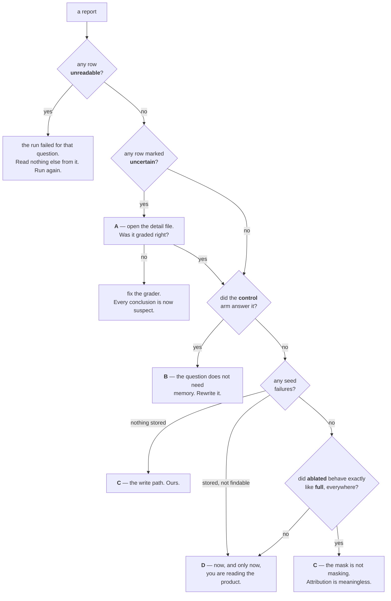

# RUNBOOK — running the memory evaluation

**The procedure**: what to check before spending money, how to run it, how to
read what came back, and how to triage a bad result before touching anything.

What any of it means is [MEMORY_IN_A_NUTSHELL.md](./MEMORY_IN_A_NUTSHELL.md);
the commands and store configuration are [README.md](./README.md); the reasons
are [SPEC-memory-evaluation.md](../../tasks/specs/SPEC-memory-evaluation.md).

---

## The rules that do not bend

Each exists because breaking it either destroys real data or produces a report
that reads as a fact and is not one.

1. **Never point the harness at a remote or production database.** It fills
   memory and then deletes it.
3. **Never set `MEMEVAL_ALLOW_REMOTE_POSTGRES=1`, and never weaken the guard in
   `live_env.probe_environment`.** A refused host is the guard working.
4. **Never edit production code to make a report green.** Fixing a real defect
   the harness found is the job. Turning a report green by editing the thing
   being measured is not — that is a separate, deliberate change, failing test
   first.
5. **`runs/` is gitignored and holds full reply text.** `baselines/` stays
   metadata-only; a test enforces it. Never paste reply text into a committed
   file.
6. **One run at a time.** Concurrent runs contend on the schema migration
   advisory lock and wedge, and two live runs on one provider account draw far
   more dropouts than one.
7. **DO NOT use rtk when run memory eval (use `rtk proxy` or set `RTK_DISABLED=1`).**

Everything below assumes `PYTHONPATH=src`, `PYTHONIOENCODING=utf-8`, `RTK_DISABLED=1`, and the
interpreter `.venv/Scripts/python.exe` — bare `python` hits the Windows App
Execution Alias and fails. The eval provider/model is loaded from configuration
(`LLM_PROVIDER` in `.env`, e.g. `gemini`) by default.

---

## 1. Pre-check — prove every dependency answers

```bash
# PostgreSQL target (loads provider from config by default):
LOCAL_URL="$(grep -m1 '^DATABASE_URL_LOCAL=' .env | cut -d= -f2-)"
PG_TEST_URL="${LOCAL_URL%/*}/cowork_memeval" PYTHONPATH=src PYTHONIOENCODING=utf-8 RTK_DISABLED=1 \
  .venv/Scripts/python.exe scripts/memeval_preflight.py

# SQLite target (zero setup, scratch DB):
POSTGRES_MODE=off PYTHONPATH=src PYTHONIOENCODING=utf-8 RTK_DISABLED=1 \
  .venv/Scripts/python.exe scripts/memeval_preflight.py
```

> **Provider & Model Configuration**: By default, the harness loads the provider and model configured in your environment / `.env` (`LLM_PROVIDER`, e.g., `gemini`). Only use the flexible `--provider <name>` (and `--model <model>`) flags when explicitly testing or comparing models for the [Model Memory Eval Leaderboard](../../docs/references/agent-memory/MODEL-MEMORY-EVAL-LEADERBOARD.md).

Read the password out of `.env` like this rather than typing it. It must not
appear in a command line, a log, or a report.

Exit `0` means nothing failed. Exit `1` means **do not run the evaluation**.
`--json` prints the same machine-readably; `--no-live` skips the two checks that
cost money and downgrades them to warnings — useful for wiring, useless as
evidence that a key works.

| Check | The question it asks | On failure |
|---|---|---|
| `probe_set` | Does the latest question file load and validate? | Fix it before spending a single call. |
| `target` | Which store would this write to, and is it allowed to? | Point `PG_TEST_URL` at a local throwaway. If the remote override is set, **unset it**. |
| `postgres` | Does that database answer? | Start the server, or create `cowork_memeval`. |
| `postgres_locks` | Did a killed run leave backends idle in transaction? | See §5, "the run hangs". |
| `embeddings` | Does the corpus embedder return a vector of the right size? | `semantic` cannot be filled. A run still completes and reports it as a **seed failure** — not as a memory that found nothing. |
| `chat` | Does the model answer with text? | There is no run. Without a reply there is nothing to grade. |

The last two are why this script exists. A key that is *set* proves nothing; a
key that is exhausted produces a full report in which a memory looks empty.
Each spends one call and prints the whole `__cause__` chain on failure — the
chat adapters raise `ChatReplyUnavailable("configured chat provider is
unavailable")` from the real error, so without the chain a broken run reports
twenty-four identical arms and no reason for any of them.

### The offline tier, which costs nothing

Run it too. It is what CI blocks on, and a failure here means the harness itself
is wrong, which makes every number a run produces meaningless.

```bash
PYTHONPATH=src .venv/Scripts/python.exe -m pytest -q
```
```bash
.venv/Scripts/python.exe -m ruff check src/ tests/ scripts/
```
```bash
.venv/Scripts/python.exe -m mypy --strict src/cowork_agent/features/ai_chat/memory_eval/
```
```bash
PYTHONPATH=src .venv/Scripts/python.exe scripts/evaluate_memory.py --dry-run --output /tmp/dry.json
```

A dry run **measures nothing**. It proves the wiring assembles a report.

---

## 2. The run
```bash
# PostgreSQL target (loads provider from config by default):
LOCAL_URL="$(grep -m1 '^DATABASE_URL_LOCAL=' .env | cut -d= -f2-)"
PG_TEST_URL="${LOCAL_URL%/*}/cowork_memeval" PYTHONPATH=src PYTHONIOENCODING=utf-8 \
  .venv/Scripts/python.exe scripts/evaluate_memory.py \
    --output evaluations/MEMORIES/baselines/<name>-postgres.json

# SQLite target (zero setup, scratch DB):
POSTGRES_MODE=off PYTHONPATH=src PYTHONIOENCODING=utf-8 \
  .venv/Scripts/python.exe scripts/evaluate_memory.py \
    --output evaluations/MEMORIES/baselines/<name>-sqlite.json
```

The provider and model are loaded from configuration (`LLM_PROVIDER`, e.g. `gemini`)
by default. Pass `--provider <name>` (e.g. `--provider openrouter`) only when
explicitly overriding the configured provider.

Name `<name>` for what was measured, not when — the timestamp is inside the
report.

**Which question file.** Both commands above run the latest default,
`v2-four-scopes-wide` — the wide 20-question set (`evaluations/MEMORIES/probes/v2-four-scopes-wide.json`).
Pass `--probe-set evaluations/MEMORIES/probes/v1-four-scopes.json` if explicitly
targeting the legacy 8-question v1 set. Put the set in `<name>`: a v1 baseline
and a v2 report are two different measurements, not two versions of one, and
only `probe_set_id` inside the file says which is which.

**Cost.** v2 (default): 20 questions × 3 arms = 60 asks, and it seeds three
episodes instead of one, roughly **130 model calls**. Single-digit minutes.
Budget the time and the quota accordingly, and keep to one run at a time — rule 6
above, and SPEC §15.1 item 10: two concurrent live runs drew far more dropouts
than one, and more turns per run makes that worse.

v1 (legacy): 8 questions × 3 arms = 24 asks, ~52 model calls.

Run it in the background and wait rather than polling.

**While it runs**, two things are worth reacting to:

- **Any line about a key being evicted, exhausted or invalid.** The run is still
  worth finishing — the affected scope becomes a seed failure — but say so in
  the write-up instead of reporting that scope's numbers.
- **Silence past roughly ten minutes.** Go to §5.

---

## 3. Reading the report

Read the fields **in this order**. Each one can invalidate everything below it.

1. **`seed_failures`** — always first. A memory that could not be filled did not
   find nothing; it was never asked. Every scope named here has no result this
   run, whatever its counts say.
2. **`provider`, `model`, `probe_set_id`, `schema_version`, `run_key`,
   `nonce`** — what this was graded against and what answered it.
3. **`verdicts`**, worst first.
4. **`needs_reading`** — conclusions resting on the refusal phrase list
   (`certain:false`). Resolve them by reading the replies in
   `runs/…-detail.json`.
5. **`per_scope`** — the counts, last. They summarise everything above and mean
   nothing without it.

What each verdict means is the table in
[MEMORY_IN_A_NUTSHELL.md §5](./MEMORY_IN_A_NUTSHELL.md), including the four
traps — read those before quoting a number to anyone.

**One run is one sample.** Two runs at identical settings have disagreed on 2 of
8 questions. A claim that something improved or regressed needs repeated runs
with the variation stated (SPEC §7.3).

---

## 4. The write-up

Save it at `evaluations/MEMORIES/reports/<YYYY-MM-DD>-<probe-set>.md`, as a
repo-relative path. That directory is gitignored on purpose: a write-up quotes
questions and replies in full, the same reason `runs/` is.

Write it in Vietnamese — the questions, seeds and replies are Vietnamese, and a
write-up in another language ends up translating its own evidence. Identifiers,
field names, verdict labels and paths stay verbatim.

Follow the standard report format and template defined in
[REPORT_FORMAT.md](./reports/REPORT_FORMAT.md), which structures the report
according to the Pyramid Principle (Executive Summary, Benchmark Dataset &
Seed Ground Truth, Scope Scorecard, Qualitative 3-Arm Analysis, Action Items,
and Technical Appendix).

Automate all calculations, scorecard tables, and quote extraction using:

```bash
PYTHONPATH=src .venv/Scripts/python.exe scripts/build_memory_evaluation_report.py
```
*(Optionally pass `--baseline <path>` and `--detail <path>` to target a specific run).*


---

## 5. When something breaks — validate before fixing

A bad result is not automatically a bad memory. Sort it into one of four
concerns first:

| | Concern | The question it owns | A failure here looks like | Fix policy |
|---|---|---|---|---|
| **A** | **the grader** | Was this answer graded correctly? | an honest refusal graded "made up" | Harness. Fix freely, red test first. |
| **B** | **the question** | Does answering it actually require memory? | the `control` arm answers it too | Harness. Fix freely. |
| **C** | **the plumbing** | Did we fill and mask what we claimed? | seed failures; `ablated` behaving exactly like `full` | Harness. Fix freely. |
| **D** | **the product** | Does memory retrieval actually return anything? | nothing comes back from a store that has the row | Production. Fix deliberately, never to make a report green. |

> **A failure in A, B or C makes every reading of D meaningless.** Rule them out
> in that order.



In particular: before concluding a question was guessable (B), check the mask
actually masks (C). If the hidden value were still reaching the model, the arm
would be lying and every conclusion in every report would be void.
`tests/unit/features/ai_chat/memory_eval/test_arm_masking_reaches_the_model.py`
is that check.

### The drill

1. **Reproduce, or admit you cannot.** A conclusion seen once is a hypothesis.
2. **Read the actual replies** in `runs/…-detail.json` before theorising. Most
   surprising verdicts are explained by the text.
3. **State one hypothesis, and say what measurement would falsify it.**
4. **Measure before implementing.** The episodic defect in SPEC §7.5 was found
   this way, and the first proposed fix was killed by the measurement that was
   supposed to confirm it.
5. **Write the failing test first**, then fix, then rerun the offline tier.
6. **Record it.** A defect belongs in the spec; a gap you chose not to close
   belongs in SPEC §15.1 as a named limit, not in silence.

### Known failure modes

| Symptom | What it is |
|---|---|
| Every arm returns `chat_provider_unavailable` | The provider, not the memory. `ChatReplyUnavailable` hides its cause; the pre-check prints the `__cause__` chain. |
| The run hangs with no output | A killed run left the `schema_migrations` advisory lock held by an idle backend; advisory locks are session-scoped and survive rollback. Terminate backends **scoped to the eval database only**: `SELECT pg_terminate_backend(pid) FROM pg_stat_activity WHERE datname = 'cowork_memeval' AND pid <> pg_backend_pid()`. |
| `psycopg_pool.PoolTimeout: pool initialization incomplete` | Windows: something ran on the default ProactorEventLoop. Async psycopg needs `asyncio.SelectorEventLoop` — `live_env.run_with_selector_loop` exists for this. |
| `UnicodeEncodeError` printing a reply | `PYTHONIOENCODING=utf-8` was not set. |
| A whole scope empty, with a key-eviction line earlier in the log | An exhausted key. That scope has **no result** — a seed failure, not a finding. |
| `UnsafeTargetError` | The guard working. Point `PG_TEST_URL` at a local throwaway. Do not set the override. |

---

## 6. Afterwards

- `baselines/<name>.json` is committable; the detail file under `runs/` is not,
  and is already gitignored.
- **Changing a question changes nothing the report records.** `run_key` hashes
  `(probe_set_id, model, seed)` — question text and `expect_any` are in none of
  them, and `probe_set_id` is set by hand. Two reports can carry identical
  identity fields and have been graded against different questions. Check
  `git log evaluations/MEMORIES/probes/` before comparing two reports, and say
  so in the write-up (SPEC §15.1 item 8).
