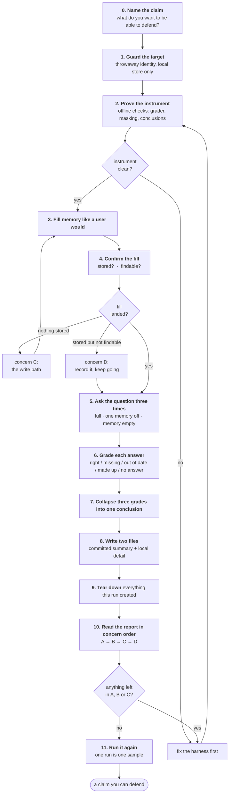
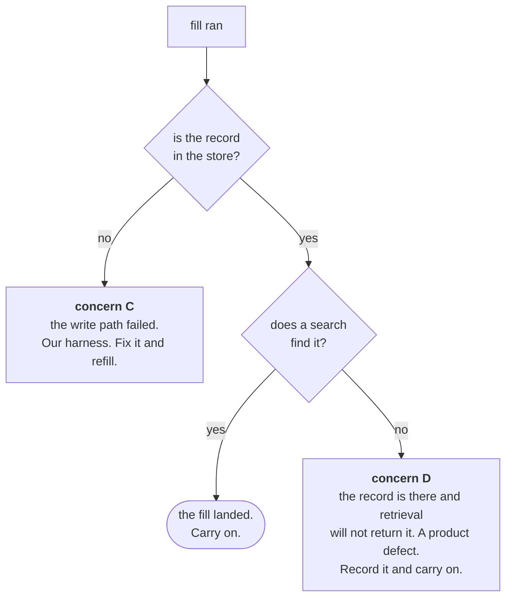
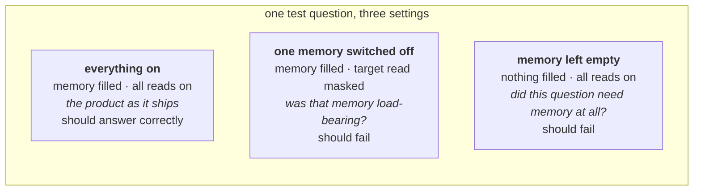
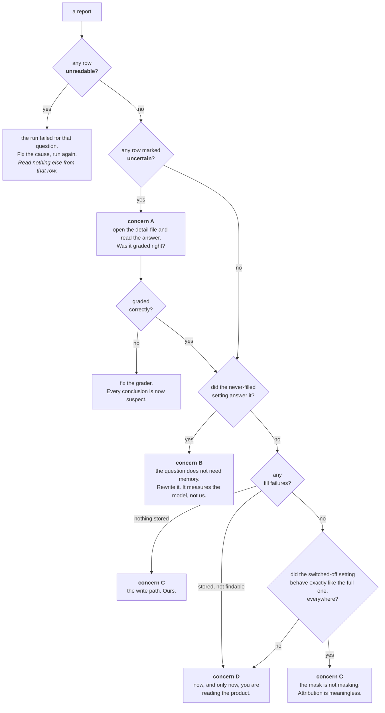

# The evaluation workflow, as it should run

**What this file is.** The target-state process for one memory evaluation, end
to end, with the reason each step exists. `FLOW.txt` explains *what the harness
is*; the spec (`tasks/specs/SPEC-memory-evaluation.md`) explains *why every
design decision was made*; this file explains
*the order you do things in, and what breaks if you skip a step*.

Plain words are used throughout. §0 of the spec pairs each one with the short
name it has in the code.

---

## The one rule the whole workflow is built around

Four different things can make a run look bad, and only the last one is about
the product:

| | Concern | The question it owns | What a failure here looks like |
|---|---|---|---|
| **A** | the grader | Was this answer graded correctly? | an honest refusal graded "made up" |
| **B** | the question | Does answering it actually require memory? | the never-filled setting answers it too |
| **C** | the plumbing | Did we fill and mask what we claimed? | fill failures; the switched-off setting behaves like the full one |
| **D** | the product | Does memory retrieval actually return anything? | nothing comes back from a store that has the row |

> **A failure in A, B or C makes every reading of D meaningless.**
> You cannot diagnose the product through a broken grader, a guessable
> question, or plumbing that did not do what it said.

A, B and C are ours to fix freely — they are the instrument. **D is the
product**, and it is fixed deliberately, never to make a report look better.

Everything below is that rule turned into an order of operations.

---

## The whole workflow

---

## What each step is, when it happens, and why it exists

### 0. Name the claim

**What.** Write down the sentence you want to be able to say afterwards —
"episodic memory is what lets a returning user find their open task" — before
you run anything.

**When.** Before touching the harness.

**Why.** A run produces eight conclusions. Without a claim stated in advance,
whichever conclusion is most interesting becomes the finding, and that is how a
network blip became a "leaked" verdict in the first Vietnamese run. The claim
also tells you which of the eight questions you actually need.

**Value.** It is the difference between measuring and browsing.

---

### 1. Guard the target

**What.** Build a throwaway identity from a hash of the question set, the model
and the fill, and point the harness at a local throwaway store. Any non-local
database host is refused.

**When.** First thing in every run, before a single write.

**Why.** The harness **fills memory and then deletes it**. Against a shared or
production database that is a write-and-delete on real users' data. The
throwaway identity also stops two runs colliding, and stops a run reading
material some earlier run left behind.

**Value.** The one step whose absence is not a bad measurement but a bad day. A
refused host is the guard working — fix the environment, never the guard.

---

### 2. Prove the instrument before the subject

**What.** Run the offline checks: the grader, the memory masking, the
conclusion rules, the report shape. No model, no store, no network.

**When.** Every run, and every time any of those files change.

**Why.** This is concerns A and C, checked for free. A grader that
misreads a refusal, or a mask that does not mask, corrupts every number that
comes after it — and you cannot see either one from the report, because both
produce a plausible-looking wrong answer rather than an error.

The concrete case: one missing Vietnamese phrase caused a clean refusal to be
graded "made up", which made a whole memory type the most severe finding in the
report. Nothing downstream could have caught it.

**Value.** Failures here cost nothing to find and everything to miss. This step
is why the offline checks gate and the live run does not.

---

### 3. Fill memory the way a user would

**What.** Put material into each memory through the same path a real user
takes: speak the turns, write the profile with an explicit source stamp, ask
for the task **and then approve it**, index the document set.

**When.** Once per question per setting, except the never-filled setting, which
is skipped by definition.

**Why.** Writing rows straight into the database would skip the authorization
step — and for tasks, that step is the thing being measured. A freshly created
task is deliberately unreadable until approved; filling only the first half and
then asking for recall reports amnesia that is actually the eligibility gate
working correctly.

**Value.** It keeps the run honest about *what shipped*. A memory that only
works when the harness writes to it directly does not work.

---

### 4. Confirm the fill — as two separate questions

**What.** Ask **"is the record stored?"** with a plain listing that runs no
search. Then, separately, ask **"can a search find it?"**, using the stored
record's own title as the search text.

**When.** Immediately after filling, before asking anything of the model.

**Why.** This is the step that was collapsing two facts into one number, and it
is worth being precise about:

A store can hold a record that a particular search does not match. Reporting
both as "the check came back empty" is what made sixteen fill failures
unreadable — every one of them said the store was empty, and the store was
full. The search text was English while the records were Vietnamese, and the
database requires every word of a search to appear in the record.

The search half uses the **stored record's own title** because every word of a
title is in that record's search index by construction. It is the friendliest
search that record will ever get, so an empty result cannot be blamed on
wording, on language, or on the model having reworded the fill request.

**Value.** It turns a dead end into a diagnosis. Every fill failure now points
at exactly one owner.

---

### 5. Ask the question three times

**What.** The same question, three settings, one thing different between them.

**When.** After the fill is confirmed. Each question gets a fresh conversation
unless it targets short-term memory.

**Why.** If the answer changes *only* when the target memory is removed, the
change can only have come from that memory. That is the entire attribution
mechanism, and no single-setting run can produce it.

**The one thing everyone gets backwards:** the empty setting empties the
**store**. It does not switch off **reading**. All memories stay switched on
and simply have nothing in them. If it disabled the reads instead, it would
just be a second switched-off setting, and a question the model can answer from
its own training would pass under "everything on" and look like a memory
success.

**Value.** One setting tells you *whether* memory helped. Three tell you
*which* memory, and whether memory was needed at all.

---

### 6. Grade each answer

**What.** A pure function over text: right, missing, out of date, made up — and
**no answer**, which is not a grade.

**When.** Immediately, in process. No model, no clock, no network.

**Why four grades and not pass/fail.** A system that says "I don't know" is
behaving correctly under uncertainty. A system that confidently returns last
month's answer, or invents one, is dangerous. Both are "fail" on a boolean.

**Why "no answer" is separate.** A turn that produced no text says nothing
about memory in either direction. Grading it "missing" counts a provider outage
as a memory that forgot — three of the twenty-four answers in the first
Vietnamese run were empty for exactly that reason, and they produced three
conclusions about an outage.

**Where the grader admits doubt.** Deciding whether an answer *declined* rests
on a list of phrases, and that list can never be complete. Those rows are
marked uncertain and counted, and the answer text waits in the local detail
file for a person to read. The harness does not guess and does not ask a judge
model.

> A benchmark may not publish a conclusion it cannot defend. So it publishes
> the doubt instead.

**Value.** The grade distinguishes an unhelpful system from a dangerous one,
which is the distinction the product actually cares about.

---

### 7. Collapse three grades into one conclusion

**What.** Three grades become one line a person reads. Sorted worst first.

| conclusion | what it means |
|---|---|
| `unreadable` | one setting produced no answer. **Checked first, overrides everything.** The run failed for this question; run it again. |
| `dangerous` | something was made up or out of date. Overrides everything below. |
| `broken` | this memory is not delivering at all. |
| `leaked` | the never-filled setting answered it too. Not a memory question. |
| `scope_did_nothing` | right answer, wrong credit — it came from somewhere else. |
| `scope_earned_it` | this memory did its job, and we know it was this one. |

**When.** After all three settings have been graded.

**Why `unreadable` is checked before everything else.** Every other rule would
read silence as evidence. "Everything on produced no text" reads as `broken`. A
never-filled setting producing no text reads as the store correctly having
nothing to say. Neither is something the run observed.

**Value.** Eight lines instead of twenty-four, sorted so the row that needs you
is never buried under a wall of passes.

---

### 8. Write two files

**What.** A committed summary carrying only counts, conclusions, timings and
model identifiers — and a local, uncommitted detail file carrying the full
question and answer text.

**When.** End of the run, before teardown.

**Why.** A report that carries the questions and expected answers into the
repository teaches the next model the test. The split is enforced by a check,
not by care.

**Value.** The summary is comparable across runs forever; the detail file is
what you actually debug from.

---

### 9. Tear down

**What.** Delete every store this run created. The company document set is
never touched.

**When.** Always, including after a failed run.

**Why.** Leftover material from run *n* is material run *n+1* did not fill and
cannot account for. That is a leak in the measurement, and it looks exactly
like a memory that remembered something impressive.

**Value.** Each run starts from the same place, so two runs are comparable.

---

### 10. Read the report in concern order

**What.** Do not read the conclusions first. Read in this order, and stop at
the first thing that is wrong:

**When.** Every time, before quoting a number to anyone.

**Why.** Reading conclusions first is how you end up fixing a search threshold
to satisfy a check that was never measuring the threshold.

**Value.** It converts a report into exactly one owner per failing row.

---

### 11. Run it again before believing it

**What.** Two runs at identical settings, minimum, before any claim about a
change or a regression.

**When.** Before every comparison. Always.

**Why.** Two runs at identical settings have been seen to disagree on two of
eight questions — including the never-filled setting, which has no memory in it
at all. Small models drift. One run is one sample.

**Value.** It is the difference between "this changed" and "these two runs
differ", and only one of those is a finding.

---

## What this workflow still does not tell you

- **Cross-tenant leakage is not measured here.** Filling a second tenant is not
  wired, and a question asking for material nobody filled gets a refusal from an
  empty store — which would read as a passing tenancy check while proving
  nothing. Isolation is covered strictly, and offline, by the memory-policy
  checks.
- **"Episodic" means task records only.** Conversation summaries have no
  production caller.
- **A completed run means the harness ran.** It does not mean memory is good.

---

**Where to go next**

| file | what it holds |
|---|---|
| `FLOW.txt` | what the harness is, in plain text, with a worked example |
| `tasks/specs/SPEC-memory-evaluation.md` | the reason behind every decision above |
| `README.md` | how to run it and how to read a report |
