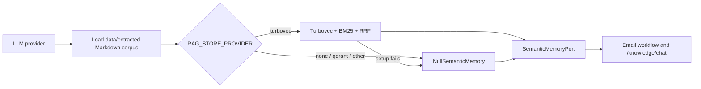

# Email RAG — Architecture Implementation Status
> **Document status:** re-verified against branch `main` (commit `9ed895c`) on
> **2026-08-18**; previous snapshot 2026-08-14. This report describes the code in
> this checkout, not a target architecture. Corrections from the re-verification
> are tagged **[2026-08-18]**.

## Executive summary

Email RAG is implemented as a retrieval-only capability behind
`SemanticMemoryPort`. `build_semantic_memory()` loads the committed Markdown
corpus and builds Turbovec 4-bit hybrid memory (dense + BM25 + RRF). Unknown,
retired (`qdrant`), or failed providers degrade to `NullSemanticMemory`, which
returns a structured empty response rather than blocking an email run.

## Implemented architecture

| Area | Status | Current behavior and evidence |
|---|---|---|
| Corpus source | Implemented | `knowledge_base.py` loads committed `data/extracted/*.md`, creates document/section metadata, and does not ingest raw email bodies. |
| Turbovec store | Implemented | `TurbovecSemanticMemory` 4-bit `IdMapIndex` over `.data/turbovec_index.tvim`, wrapped with BM25 + RRF. |
| Empty-result fallback | Implemented | When no memory can be built, `NullSemanticMemory` returns `retrieval_status=no_results` with no chunks. |
| Email workflow wiring | Implemented | `DigestWorker` invokes retrieval for `RETRIEVE_RAG`, skips it for `DIRECT_PLAN`, forwards chunks to the generator, and records missing information when retrieval is empty or unavailable. |
| Citation boundary | Implemented | Validation removes generated citation IDs that are not present in the retrieval response for the current request. |
| Knowledge HTTP API | Implemented | `app.py` exposes readiness, document-list, and `/v1/mail-todo/knowledge/chat` endpoints. The chat endpoint returns the port's chunks, status, and latency; it does not generate an answer. |
| React presentation | Implemented | The React client renders `retrieval_status=no_results` as a no-match state. A client transport timeout/error remains distinct from an API no-result response. |

## Runtime behavior and degradation

1. Startup calls `build_semantic_memory()`.
2. Default `RAG_STORE_PROVIDER=turbovec` builds the hybrid store over the
   committed corpus.
3. A Turbovec bootstrap failure, or `none` / `qdrant` / unknown provider,
   produces `NullSemanticMemory`. Retrieval then succeeds as an API operation
   with `no_results`, rather than failing the digest workflow.
4. A healthy retriever returning no matching chunks also returns `no_results`.
   This is distinct from a React-client-to-backend network/timeout failure.

## Security and data boundaries

- Gmail access remains read-only.
- Raw email bodies and attachment content are transient; the RAG corpus comes
  only from repository Markdown files.
- *[2026-08-18]* `f2d20e0` (2026-08-13) removed multi-tenancy from this plane.
  `tenant_id` still threads through `load_corpus()` and the BM25 ranker, but it is
  always `LOCAL_TENANT_ID`, so the filter is structurally present and semantically
  inert. `tests/unit/integrations/rag/test_rag.py` no longer contains a tenant test;
  its scope coverage is the `document_ids` / `years` / `months` allowlist.
- Per-user, group, document-status, and document-level ACL policies are not
  implemented. The current corpus is company-wide.
- *[2026-08-18]* `POST /v1/mail-todo/knowledge/chat` calls retrieval with
  `RetrievalLimits(min_score=-1.0)` (`app.py:1043`), which disables the relevance
  floor for that endpoint. Combined with the open abstention gap, this endpoint
  cannot return `no_results` on relevance grounds — only on an empty index.

## Known gaps and limits

| Gap | Status | Why it matters |
|---|---|---|
| Live embedding quality vs hashing | Partial | `scripts/evaluate_retrieval.py` measures dense / turbovec / hybrid stacks. *[2026-08-18: the "no Qdrant control group" caveat is obsolete — Qdrant was deleted in `c441822` / `5a2c87d`. The live gap is that no run on the current corpus uses a real embedder; both committed reports are `hashing`, and they score a 1,069-chunk index the chunker no longer produces (now 949).]* |
| Calibrated abstention | Missing | `no_results` is structurally supported, but no validated runtime score or margin policy separates unrelated Vietnamese queries from relevant corpus content. |
| Active end-to-end deadline | Partial | Embedding/reranker transports have their own timeouts, but `RetrievalLimits.timeout_ms` is not enforced as one deadline across every remote step. |
| Reranking in the runtime | **Absent** *[2026-08-18]* | `bootstrap.py::_wrap_hybrid` builds `HybridSemanticMemory(documents, embedder, dense=dense)` — no reranker argument. `JinaRerankerAdapter` is imported only by `scripts/evaluate_retrieval.py`, and the unified `rag/reranker.py` (Cohere default) has no caller in `src/`. Company retrieval therefore ends at RRF fusion. The earlier "observability" framing understated this: there is no rerank step to observe, and `SemanticRetrievalResponse` (`query_id`, `chunks`, `retrieval_status`, `latency_ms`) has no field to report one. |
| Semantic grounding | Partial *[2026-08-18]* | Citation IDs are constrained to retrieved chunks, and `features/email_action_plan/citation_accuracy.py` now measures step-to-chunk Jaccard overlap (10 unit tests). It has no caller outside its test, so entailment of generated plan claims is still unproven in any committed report. |
| Binary ingestion | Partial | The administrator CLI converts local DOCX and native-text PDF files into Markdown. Scan, image-based, and mixed PDFs fail safely with `mistral_not_configured` until Mistral OCR is configured; XLSX/PPTX and Gmail-attachment ingestion do not exist. *[2026-08-18: "upload ... do not exist" is scoped to this company-CLI plane only. A separate project-document upload plane does exist — `api/projects.py`, `orchestration/project_document_worker.py`, `rag/project_index.py` — with its own async ingestion and per-project index. It is out of scope for this document; see the CHAT-RAG area.]* |
| Corpus administration | Missing | No persistent document registry, version history, incremental update, or asynchronous ingestion pipeline exists **for the company corpus**. *[2026-08-18: the project-document plane does have a registry and an async worker; this row is about `data/extracted/` only.]* |

## Operational checks

| Check | Expected result |
|---|---|
| `GET /v1/mail-todo/knowledge/ready` | `ready` when a non-null store and corpus are available; `degraded` for `NullSemanticMemory`; `unavailable` when the corpus cannot load. |
| `POST /v1/mail-todo/knowledge/chat` with no matching chunk | HTTP 200 with `retrieval_status: "no_results"` and an empty `chunks` list. |
| React query for the same response | A no-match state. |
| Turbovec unavailable at boot | Warning in backend log, then `NullSemanticMemory`. |

## Source of truth

- `src/cowork_agent/integrations/rag/bootstrap.py`
- `src/cowork_agent/integrations/rag/knowledge_base.py`
- `src/cowork_agent/integrations/rag/turbovec_memory.py`
- `src/cowork_agent/integrations/rag/hybrid.py`
- `src/cowork_agent/ingestion_cli.py`
- `src/cowork_agent/app.py`
- `src/cowork_agent/features/email_action_plan/workflow.py`

## Local knowledge ingestion

The `mail-todo-ingest-knowledge` administrator CLI accepts `--source`,
`--output`, `--force`, and `--dry-run`. It deterministically discovers local
DOCX/PDF files, writes non-empty Markdown atomically, and records hashes in an
ingestion manifest. Run it with `KNOWLEDGE_INGEST_OCR_ENABLED=false` until
`MISTRAL_API_KEY` is configured.

Native-text PDFs and DOCX files are supported. PDFs that need OCR fail with
`mistral_not_configured` and do not create partial output. The CLI never
downloads Gmail attachments, has no upload API, and does not write the
Turbovec snapshot; after a successful ingestion, restart the API/worker so
`.data/turbovec_index.tvim` is rebuilt.
- [RETRIEVAL-EVALUATION-STATUS.md](./RETRIEVAL-EVALUATION-STATUS.md) — evaluation & test coverage map
- [Architecture harness](../../docs/architectures/README.md) — the C4 model of the system as implemented
