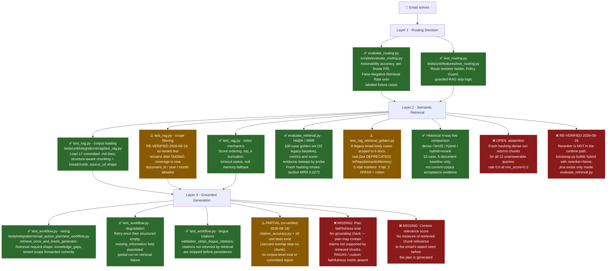

# RAG Evaluation — Status Report

> **Document status:** re-verified claim by claim against the checkout on branch `main`
> (commit `9ed895c`) on **2026-08-18**. Statements that no longer matched the code are
> corrected in place and tagged **[re-verified 2026-08-18]**; the previous snapshot was
> 2026-08-17, revised after the golden-set and evaluation-harness work landed (C4, C5, C6
> are implemented — see
> [SPEC](../../../tasks/specs/SPEC-rag-golden-set-and-eval.md) / [PLAN](../../../tasks/plans/PLAN-rag-golden-set-and-eval.md)).  
> Earlier revisions of this file described a **3-document** corpus including
> `dang_ky_tam_tru.md`, and chunking by **H2 only**. Both are stale: the committed corpus is
> **17 documents** (with legacy E2E test scoped to 6 documents) and chunking splits on **H1 and H2**. Corrected throughout.
>
> **[re-verified 2026-08-18] The chunk count in every 2026-08-17 figure below is stale.**
> `load_corpus(data/extracted)` now yields **949 chunks**, not 1,069. The structure-aware
> chunking fixes (`f480906`, `0d06d4d`, both 2026-08-17) landed *after* the saved reports
> were generated at 08:42 and 08:58 UTC, so both committed baselines score an index that no
> longer exists. Treat every current-corpus number here as un-reproducible until the harness
> is re-run.
> Purpose: map what is already tested vs. what is missing for the full Email-RAG quality evaluation story.  
> The evaluation pipeline covers three conceptually distinct layers:  
> **Routing** (does the classifier decide that RAG is needed?) →  
> **Retrieval** (does semantic search return the right chunks?) →  
> **Generation** (does the LLM use those chunks to produce a grounded plan?).

---

## Evaluation Coverage Map

### Plain English Summary (1 Line Per Eval)

**Layer 1 · Routing (The Traffic Controller)**
- ✅ **Offline Routing Benchmark (`evaluate_routing.py`)**: Tests if the AI correctly recognizes when an email needs company guidebook lookups (prevents blind guessing).
- ✅ **Route Resolver Logic (`test_routing.py`)**: Tests the safety rules that force RAG retrieval when explicit document types are requested (ensures safety compliance).
- ❌ **Corpus-Matched Routing Fixtures**: Missing test emails that explicitly ask about ingested procedures (like CCCD renewal) to prove routing works on real domain content.

**Layer 2 · Retrieval (The Librarian)**
- ✅ **Corpus Loader & Chunking (`test_rag.py`, `test_markdown_chunking.py`, `test_structure_normalizer.py`)**: Tests that markdown guidebooks load cleanly and split along the recovered heading hierarchy, that each chunk carries its breadcrumb, and that tables, fenced code and list items are never cut mid-block.
- ⚠️ **Scope Filtering (`test_rag.py`)** *[re-verified 2026-08-18]*: The tenant-ACL tests this line claimed no longer exist — `f2d20e0` (2026-08-13) removed multi-tenancy, and `test_rag.py` now tests the `document_ids` / `years` / `months` allowlist instead. Cross-tenant leakage is untested across all three files (`test_rag.py`, `test_bm25.py`, `test_hybrid.py`) because the concept was retired; per-user and per-document ACL remain unimplemented on this plane.
- ✅ **Search Index Mechanics (`test_rag.py`)**: Tests score sorting, top-k limits, timeouts, and fallback handling when search fails (ensures basic system stability).
- ✅ **Retrieval Metrics Harness (Hit@K / MRR)**: 100 labeled questions (32 in the legacy baseline) measure document and section retrieval; fresh hashing runs prove harness mechanics, while fresh real-embedding evidence is still needed for semantic acceptance.
- ⚠️ **End-to-End Retrieval Fixtures** *[re-verified 2026-08-18]*: 8 legacy email-body cases over six documents go through the real graph, but on the **deprecated** `InRepoSemanticMemory` — the production store (`TurbovecSemanticMemory` + hybrid) is never exercised end to end. Two xfail markers (`q-006`, `q-014`) now XPASS and must be removed.
- ✅ **Historical Hybrid Search Benchmark**: Keyword, AI vector, fused, and reranked search were measured on the legacy 32-case / six-document corpus. The retained comparison is not current-corpus acceptance evidence.
- ❌ **Abstention on Unanswerable Questions**: The system never says "I don't know" — every retriever returns confident-looking chunks for questions the guidebooks cannot answer. *[re-verified 2026-08-18: still true; `abstention_rate: 0.0` with 12 false answers in both committed 2026-08-17 reports. The harness itself does measure it — `abstention_stats()` also reports `false_abstention_rate` — so this is a product gap, not a missing metric.]*
- ❌ **Reranking Is Measured But Never Shipped** *[new, 2026-08-18]*: `bootstrap.py:97` builds `HybridSemanticMemory(documents, embedder, dense=dense)` with no reranker. `JinaRerankerAdapter` is imported only by `scripts/evaluate_retrieval.py`. The best baseline on record (hybrid + rerank, section MRR 0.955) therefore describes a configuration production does not run.

**Layer 3 · Generation (The Plan Writer)**
- ✅ **Pipeline Integration Wiring (`test_workflow.py`)**: Tests that retrieved guidebook chunks are correctly passed to the AI plan writer (ensures plumbing works).
- ✅ **Graceful Error Degradation (`test_workflow.py`)**: Tests that if search fails, the system warns the user instead of breaking or crashing (ensures high reliability).
- ✅ **Fake Citation Stripping (`test_workflow.py`)**: Tests that citations to non-existent document chunks are automatically removed before saving (prevents broken links).
- ⚠️ **Citation Accuracy Verification** *[re-verified 2026-08-18]*: No longer missing at unit level — `features/email_action_plan/citation_accuracy.py` computes per-step Jaccard overlap between instruction text and the cited chunk, covered by 10 cases in `tests/unit/features/test_citation_accuracy.py`. What is still missing is a corpus-level run: nothing calls `inspect_citation_accuracy()` outside its own test, so no report exists.
- ❌ **Plan Faithfulness / Hallucination Check**: Missing automated checks (e.g. RAGAS) to ensure generated action plans don't fabricate steps absent from the guidebooks.
- ❌ **Context Relevance Scoring**: Missing evaluation measuring if retrieved chunks are actually relevant to the email's request before generating the plan.

---

## Layer 1 — Routing Evaluation

### ✅ Available

#### `scripts/evaluate_routing.py` — Offline Routing Benchmark

| Property | Detail |
|---|---|
| **Scope** | All labeled fixture cases under `tests/fixtures/routing/` |
| **Mode** | `--dry-run` (deterministic fake, perfect by construction) or live LLM provider |
| **Metrics** | Actionability accuracy, per-Route precision & recall, **False-Negative Retrieval Rate** |
| **Output** | JSON report written to `evaluations/baselines/routing-eval-<date>.json` |
| **PRD ref** | PRD-v1 §16 Milestone 2 exit obligation (task T2.6) |

The **False-Negative Retrieval Rate** (`false_negative_retrieval.rate`) is the primary quality gate: it tracks how often emails labeled `RETRIEVE_RAG` were incorrectly routed to `DIRECT_PLAN` or `NO_ACTION`. This is PRD-v1 §14's highest-risk error class.

#### `tests/unit/features/test_routing.py` — Route Resolver Unit Tests

Covers the resolve-route ladder (actionability → sufficiency → guard → route), the Policy Guard forcing `RETRIEVE_RAG` when `expected_document_types` is non-empty, and the guarded-RAG skip rule (retrieval is skipped, not guessed, when no query/gaps are present).

### ❌ Missing

- **No semantic classifier evaluation against the real corpus.** The routing fixtures contain synthetic email bodies, none of which reference procedures from `data/extracted/`. A routing case whose email body mentions needing CCCD renewal or marriage registration steps (directly mirroring a corpus document) would verify the full intent-to-route path with real content.

---

## Layer 2 — Retrieval Quality Evaluation

### ✅ Available

#### `tests/unit/integrations/rag/` — RAG Unit Test Suite

| Test File | What it checks |
|---|---|
| `test_rag.py` | Corpus loading (17 `.md` docs), structure-aware chunking with breadcrumbs, score ordering/top_k, timeout status, `NullSemanticMemory`, `HashingEmbedder` determinism, and the `document_ids` / `years` / `months` allowlist. **[re-verified 2026-08-18] It contains no tenant/ACL test** — the word `tenant` does not appear in the file. |
| `test_bm25.py` | BM25 lexical ranking, exact term match, Markdown/case/punctuation normalization. **[re-verified 2026-08-18] No tenant/ACL coverage** — the word `tenant` does not appear in this file either, although `bm25.py` still accepts a `tenant_id` argument. |
| `test_rrf.py` | Reciprocal Rank Fusion, 1-based position rank scoring (`RRF_K=60`), duplicate handling, score fusion |
| `test_hybrid.py` | `HybridSemanticMemory` composition of dense + BM25 + RRF, candidate pool limits, query assembly, and Jina reranker integration (12 rerank assertions). **[re-verified 2026-08-18] No tenant ACL gate is tested.** The reranker path is well covered here yet never constructed by `bootstrap.py`, so these assertions guard code the runtime does not reach. |
| `test_jina_reranker.py` | `JinaRerankerAdapter` cross-encoder reranker boundary, HTTP transport, custom User-Agent, exception fallback to original candidate order, `FakeJinaReranker` |

> **Important caveat:** every test using `HashingEmbedder` — a deterministic fake that converts text to a numeric hash vector — validates *mechanics* (index building, scoring pipeline, ACL logic, chunk filtering), but **not semantic similarity**. Ranking order under it is arbitrary, which is why no test there asserts *which* document wins; an earlier `cap_lai_cccd` assertion was removed once H1 chunking exposed it as a chunk-boundary coincidence. Semantic quality is measured by the golden set below, under a real embedder.

### ✅ C4 — Retrieval Hit@K / MRR Harness (implemented)

`tests/fixtures/rag/retrieval_golden.json` holds **100 labeled cases** (expanded from the 32 legacy baseline cases) over the 17-document corpus, loaded by `tests/fixtures/rag/loader.py` and scored by `scripts/evaluate_retrieval.py`. Metrics are Hit@1, Hit@3, MRR, Recall@5 and abstention rate, reported at **document level and section level**. The evaluator also emits privacy-safe score provenance and evaluation-only absolute-score/margin calibration sweeps; it does not choose or apply a runtime threshold.

Two design constraints make the numbers meaningful and must not be simplified away:

1. **Section level is the headline, not document level.** The retained six-document baseline is topically disjoint, so document-level Hit@1 can saturate near 1.0 even for raw BM25. Only section-level MRR discriminates.
2. **Acceptance is stated per probe slice, never on the aggregate.** Every case is tagged `lexical`, `semantic`, `mixed`, or `unanswerable`. An aggregate that improves while `semantic` regresses is a failure — and that is exactly what the C6 measurement caught.

The loader validates every label against live `load_corpus` output, so a re-chunk fails loudly instead of silently scoring 0.0.

**Fresh offline harness run (2026-08-17) — superseded:** `uv run python scripts/evaluate_retrieval.py --dry-run` evaluated 100 cases over **17 documents / 1,069 chunks** with the deterministic `HashingEmbedder`. *[re-verified 2026-08-18: the same call now loads **949 chunks**; the chunker changed after this run, so these figures cannot be reproduced and must be regenerated before use.]* It reported document MRR **0.5576**, section MRR **0.2272**, section Recall@5 **0.3913**, and abstention **0.000** across 12 unanswerable cases. These numbers validate the current corpus/fixture/harness path only; hashing vectors do not measure semantic retrieval quality.

### ✅ C5 — End-to-end email → retrieval fixture (closed 2026-08-09)

`tests/integration/email_action_plan/test_rag_retrieval_golden.py` replays the **8 legacy golden cases carrying an `email_body`** through the real `DigestWorker` graph: `FakeMailbox` → `FakeRouteClassifier` → **real `InRepoSemanticMemory`** over the six legacy corpus documents → generator. The assertion is on the chunk the generator actually received, so nothing between routing and generation can drop or reorder retrieval and still pass.

Offline it runs on `HashingEmbedder`; cases that cannot rank correctly under a non-semantic embedder are `xfail` with the measured reason. **All 7 answerable cases pass under `--embedder gemini`.**

> **[re-verified 2026-08-18] The xfail inventory in the previous revision was wrong on every count.** The file marks **5** cases, not 3, and they are `q-001`, `q-006`, `q-014`, `q-016` (hashing) plus `q-029` (abstention) — `q-026` is not among them. A live run reports `3 xfailed, 2 xpassed`: **`q-006` and `q-014` now pass under `HashingEmbedder`** after the structure-aware chunking work, so their markers are rotten and should be deleted (`strict=False` is why they do not fail the suite). The retriever is also the **deprecated** `InRepoSemanticMemory` (`DeprecationWarning: use TurbovecSemanticMemory`), so this fixture does not cover the store the API and worker actually build. The assertion was deliberately not weakened to "appears somewhere in the top 5", which would rebuild the blind spot this work exists to remove.

### ✅ C6 — Historical Hybrid Comparative Benchmark (retained)

Four variants, same 32 legacy cases and six-document corpus, reports in `evaluations/baselines/retrieval-eval-2026-08-08-gemini-*.json`. The table below is historical context only: it predates the 100-case / 17-document corpus and must not be used as the current benchmark or acceptance gate.

**Section-level MRR — the discriminating metric:**

| slice | n | dense | bm25 | hybrid (RRF) | hybrid + rerank |
|---|--:|--:|--:|--:|--:|
| **overall** | 28 | 0.929 | 0.795 | 0.869 | **0.955** |
| `lexical` | 6 | 0.833 | 0.917 | 0.917 | **1.000** |
| `semantic` | 6 | **0.917** | 0.375 | 0.556 | 0.792 |
| `mixed` | 16 | 0.969 | 0.906 | 0.969 | **1.000** |

| other metric | dense | bm25 | hybrid | hybrid + rerank |
|---|--:|--:|--:|--:|
| section Hit@1 | 0.857 | 0.679 | 0.786 | **0.929** |
| document Hit@1 | 0.964 | 0.857 | **1.000** | 0.929 |
| Recall@5 (section) | — | — | 0.964 | **1.000** |
| abstention rate | 0.000 | 0.000 | 0.000 | 0.000 |
| latency p50 / p95 (ms) | 438 / 937 | 0 / 0 | 438 / 937 | 1027 / 2432 |

Four findings, in order of importance:

1. **RRF fusion on its own is a regression, and only the reranker rescues it.** Hybrid drops overall section MRR from dense's 0.929 to 0.869, and collapses `semantic` from 0.917 to 0.556. The mechanism is in `rrf.py`: scores are discarded and only positions are fused, unweighted, at `1/(60+rank)`. A chunk dense ranks #1 scores `1/61`; a chunk dense ranks #3 that BM25 ranks #1 scores `1/63 + 1/61` and wins. Worse, a pure-BM25 #1 ties a pure-dense #1 exactly, and the tie breaks **alphabetically by `chunk_id`**. On `semantic` queries BM25's ranking is near-random, so it is casting an equal vote on the slice where it is least competent.
2. **Document-level Hit@1 says hybrid is the winner (1.000) — and it is wrong.** This is precisely the saturation trap the probe slicing was built to expose. Anyone reading only document-level numbers would have shipped a regression.
3. **The probe tags are predictive, so the golden set is doing its job.** BM25 peaks on `lexical` (0.917) and collapses on `semantic` (0.375) — a 0.54 spread the aggregate would have hidden entirely.
4. **`hybrid + rerank` is the best configuration measured**, and is the only one that clears dense on the aggregate. It still trails dense on `semantic` (0.792 vs 0.917), which at n=6 is roughly 1.5 rank-slips — worth re-measuring on a larger semantic slice before treating it as settled. It also costs ~2.3× dense's p50 latency.

> **Reranker defect found and fixed during this measurement.** The first `--rerank` run returned metrics byte-identical to plain hybrid. The cause was not agreement: Cloudflare fronts `api.jina.ai` and rejects `urllib`'s default User-Agent with `HTTP 403 error code: 1010`, and `JinaRerankerAdapter.rerank` catches every exception and returns the untouched candidate order. **The reranker had never executed a single successful call**, while the report still recorded `reranker: jina`. Fixed by sending an explicit `User-Agent` (`jina_reranker.py`). The silent-fallback behaviour is correct for production — retrieval must not fail because reranking is down — but it is undetectable from the outside, and every number in the table above depends on a fallback that reports nothing. Surfacing whether the reranker actually ran is tracked as an open observability gap.
>
> **[re-verified 2026-08-18] The gap is larger than "observability".** `bootstrap.py::_wrap_hybrid`
> constructs `HybridSemanticMemory(documents, embedder, dense=dense)` and passes **no** reranker,
> so the company-RAG runtime never reranks at all; `JinaRerankerAdapter` is referenced only by
> `scripts/evaluate_retrieval.py`. `SemanticRetrievalResponse` also has just four fields
> (`query_id`, `chunks`, `retrieval_status`, `latency_ms`) with nowhere to publish a rerank
> signal. The unified `rag/reranker.py` (Cohere-default, with key rotation) has **no caller in
> `src/` at all**. Consequence for decision-making: the strongest row in the table above
> measures a stack that is not shipped.

### ❌ C7 — Abstention on unanswerable queries (open)

**The fresh hashing dense run does not abstain on any unanswerable query.** All 12 current unanswerable cases returned chunks above threshold (`abstention_rate = 0.000`). The retained legacy reports also show 0.000, but no fresh Gemini/BM25/hybrid/Jina comparison was run for this snapshot. `min_score = 0.2` is not a calibrated abstention policy.

This is a real product gap, not a measurement artifact, and it is the one SPEC §4 added the `unanswerable` probe specifically to catch. It also makes the SPEC §7 Phase-2 gate "abstention must not decrease" vacuous — it is already at the floor. `q-029` is marked `xfail` in the C5 integration test with that reason recorded.

The evaluator now records score provenance and provides **evaluation-only**
absolute-score and margin calibration sweeps. These make the answerable versus
unanswerable trade-off inspectable, but do not select or apply a runtime
threshold. A production abstention policy remains open until it is chosen and
validated against fresh live evidence.

Note the related consequence: `latency_ms` reads `0` for local-only retrievers because `SemanticRetrievalResponse.latency_ms` is an `int` and in-repo retrieval is sub-millisecond. That is a contract-level truncation, not a harness bug.

---

## Layer 3 — Generation Quality Evaluation

### ✅ Available

#### `tests/integration/email_action_plan/test_workflow.py` — RAG Wiring Tests

| Test | What it checks |
|---|---|
| `test_retrieve_rag_candidate_retrieves_once_and_feeds_generator` | Exactly one `memory.retrieve()` call; request shape (run_id, tenant_id, query, knowledge_gaps, filters) forwarded correctly; `generator.received_retrievals` contains the response |
| `test_direct_plan_candidate_makes_zero_retrieval_calls` | `DIRECT_PLAN` emails never touch `SemanticMemory` |
| `test_retrieval_failure_retries_once_then_degrades_to_structured_empty` | Two attempts on failure, then degraded plan with `missing_information` field populated |
| `test_genuine_empty_retrieval_marks_missing_info_without_degraded_marker` | Healthy port returning `NO_RESULTS` populates `missing_information` without marking the plan as degraded |
| `test_validation_strips_bogus_citations_from_direct_plan_task` | Citations not backed by a real retrieval chunk are removed before persistence |

All of the above use `RecordingMemory` (a canned fake) or `FakePlanGenerator`. They test the **integration wiring and contracts** — not the semantic quality of generated output.

### ❌ Missing

#### D4 — Citation Accuracy Evaluation *(downgraded from Missing to Partial, 2026-08-18)*

The claim "no test verifies that a plan step referencing `cit_X` is actually discussing the
content of the chunk with `chunk_id == cit_X`" is **no longer true**.
`src/cowork_agent/features/email_action_plan/citation_accuracy.py` provides
`inspect_citation_accuracy(task, retrieval_response)`, returning a `CitationAccuracyReport`
with `found_count`, `missing_count`, `mean_overlap`, and a per-citation `CitationOverlap`
(Jaccard word overlap between the step instruction and the cited chunk).
`tests/unit/features/test_citation_accuracy.py` covers it with 10 cases.

**What is still needed:** the function has no caller outside its own test. Nothing runs it over
a real corpus query, and no report is committed — so there is still no *evidence*, only a
measurement primitive. Wiring it into `evaluate_retrieval.py` (or a Layer-3 harness) is now a
small job rather than a from-scratch one.

#### D5 — Plan Faithfulness / Grounding Score

No automated check that the generated action plan's procedure steps are *grounded* in the retrieved chunks and do not introduce unsupported claims. The target architecture references RAGAS as an option (see [EMAIL-RAG-ARCHITECHTURE.md](../../references/understand/EMAIL-RAG-ARCHITECHTURE.md) §11), but no RAGAS harness exists yet for email action plans. The Chat-RAG area has an opt-in `--ragas` path (see [CHAT-RAG](../CHAT-RAG/README.md)) that has never been run.

**Metrics to add:** RAGAS Faithfulness, RAGAS Answer Relevance, or a custom LLM-as-judge check.

#### D6 — Context Relevance Score

No measurement of whether the retrieved chunks are relevant to the email's stated request *before* the plan is generated. A retrieval returning high-scoring but topically wrong chunks would currently go undetected until the plan is read by a human.

**Metric to add:** Context Precision / Context Recall (RAGAS) or manual golden-set relevance labels for the six corpus documents. The C4 golden set already supplies the (query → expected section) labels these metrics need.

---

## Current Evidence Reconciliation

The following corrections supplement the original coverage map and distinguish
implemented evaluation mechanics from runtime guarantees.

| Evaluation area | Current status | Evidence boundary |
|---|---|---|
| C7 abstention | Runtime missing; evaluation-only support available | The fresh hashing dense run returned chunks for all 12 current unanswerable cases (`abstention_rate = 0.000`). `evaluate_retrieval.py` emits score evidence and absolute-score/margin sweeps, but it does not select or apply a runtime gate. |
| Citation accuracy | Partial *(2026-08-18)* | `citation_accuracy.py` + `test_citation_accuracy.py` measure step-to-chunk Jaccard overlap at unit level. No caller outside the test, no corpus-level run, no committed report. |
| Plan faithfulness | Missing | No automated claim-to-evidence or generated-plan faithfulness evaluation exists. |
| Context relevance | Partial labels | The 100-case golden set (32 legacy) supports document/section Hit@K, MRR, and Recall@5. It does not provide exhaustive semantic relevance judgments for every returned chunk against the email need. |
| Reranker evidence | Evaluation-only *(2026-08-18)* | Reranking exists in `scripts/evaluate_retrieval.py` only. `bootstrap.py` wires the runtime hybrid with `reranker=None`, so no production request is ever reranked and there is no applied/fallback signal to publish. Retained Jina baselines describe an unshipped configuration. |

### Interpretation rule

Do not describe score sweeps as a calibrated runtime abstention policy, citation
ID validation as semantic grounding, or target-section labels as exhaustive
context-relevance judgments.

## Summary Table

| Layer | Eval item | Status | Location |
|---|---|---|---|
| Routing | Actionability accuracy | ✅ Available | `scripts/evaluate_routing.py` |
| Routing | Per-Route precision / recall | ✅ Available | `scripts/evaluate_routing.py` |
| Routing | False-Negative Retrieval Rate | ✅ Available | `scripts/evaluate_routing.py` |
| Routing | Route resolver unit tests | ✅ Available | `tests/unit/features/test_routing.py` |
| Routing | Fixtures grounded in corpus content | ❌ Missing | — |
| Retrieval | Corpus loading & chunking | ✅ Available | `tests/unit/integrations/rag/test_rag.py` |
| Retrieval | ACL / tenant filtering | ⚠️ Retired *(2026-08-18)* | Multi-tenancy removed in `f2d20e0`. None of `test_rag.py`, `test_bm25.py`, `test_hybrid.py` contains the string `tenant`; only the source modules still take the argument. |
| Retrieval | Score ordering, top_k, timeout | ✅ Available | `tests/unit/integrations/rag/test_rag.py` |
| Retrieval | BM25, RRF & Hybrid unit tests | ✅ Available | `tests/unit/integrations/rag/` (`test_bm25.py`, `test_rrf.py`, `test_hybrid.py`, `test_jina_reranker.py`) |
| Retrieval | Real-embedding Hit@K / MRR | ✅ Available | `scripts/evaluate_retrieval.py`, `tests/fixtures/rag/` |
| Retrieval | Email → corpus retrieval fixture | ✅ Available | `tests/integration/email_action_plan/test_rag_retrieval_golden.py` |
| Retrieval | Hybrid retrieval benchmark (BM25 + dense + RRF) | ✅ Historical baseline | `evaluations/baselines/retrieval-eval-2026-08-08-gemini-*.json` (32 cases / 6 documents) |
| Retrieval | Abstention on unanswerable queries | ❌ Missing | measured at 0.000 for every retriever |
| Retrieval | Reranking in the runtime path | ❌ Missing *(2026-08-18)* | `bootstrap.py:97` passes no reranker; Jina lives only in `scripts/evaluate_retrieval.py` |
| Generation | Retrieval wiring (request shape, feed to generator) | ✅ Available | `tests/integration/email_action_plan/test_workflow.py` |
| Generation | Degradation on retrieval failure | ✅ Available | `tests/integration/email_action_plan/test_workflow.py` |
| Generation | Bogus citation stripping | ✅ Available | `tests/integration/email_action_plan/test_workflow.py` |
| Generation | Citation accuracy (plan ↔ chunk content) | ⚠️ Partial *(2026-08-18)* | `citation_accuracy.py`, `tests/unit/features/test_citation_accuracy.py` — primitive only, never run over a corpus |
| Generation | Plan faithfulness / grounding (RAGAS or judge) | ❌ Missing | — |
| Generation | Context relevance before generation | ❌ Missing | — |

**[re-verified 2026-08-18] 12 of 20 evaluation items are covered; 2 previously-green items (tenant ACL, end-to-end fixture) were downgraded and 1 new gap (reranking absent from the runtime) was added. The current 100-case / 17-document retrieval harness is implemented and has fresh offline mechanics evidence. Current-corpus semantic acceptance across dense, BM25, RRF, and Jina reranking remains unverified pending fresh live-provider runs; abstention (C7) also remains open.
Layer 3 (generation fidelity) still lacks citation accuracy, faithfulness, and context-relevance measurement.**

---

## Recommended Next Steps

Items 1 and 2 of the previous revision (golden set, end-to-end fixture) are **done**. What remains, in priority order:

1. **Re-run current-corpus live variants before relying on hybrid.** The retained 32-case comparison says plain RRF hybrid regressed semantic retrieval, but it is historical. Run dense, BM25, hybrid, and hybrid + actual Jina reranking against the 100-case / 17-document corpus, then evaluate each probe slice before selecting a default.

2. **Fix abstention (C7).** A cosine floor of 0.2 does not separate "relevant" from "same language, unrelated topic" for Vietnamese administrative text. Calibrate the threshold against the 12 unanswerable cases and 88 answerable cases jointly — the golden set already contains everything needed to pick a number — or add a margin rule (top score must exceed the runner-up by some delta). Re-measure `abstention_rate` afterwards; it is currently 0.000 and any real value is an improvement.

3. **Decide whether the reranker ships at all, before making it observable.** *[revised 2026-08-18]* The original wording assumed the runtime reranks and merely fails to say so. It does not rerank: `bootstrap.py::_wrap_hybrid` passes no reranker. Either wire `JinaRerankerAdapter` (or the unused Cohere-default `rag/reranker.py`) into the runtime and then add the applied/fallback signal, or delete the adapters and stop publishing rerank baselines as product evidence. Keeping the current split — best-measured stack absent from production — is the worst of the three.

4. **Regenerate the current-corpus baselines.** Both committed 2026-08-17 reports score a 1,069-chunk index; the corpus now chunks to 949. Re-run before any number in this file is quoted.

5. **Delete the two rotten xfail markers.** `q-006` and `q-014` XPASS in `test_rag_retrieval_golden.py`, and migrate that fixture off the deprecated `InRepoSemanticMemory` so the end-to-end path covers the store production builds.

6. **Add a faithfulness smoke test** using an LLM-as-judge or deterministic keyword check: given a known chunk text and a generated plan step, assert the step text is a paraphrase of the chunk rather than a fabrication. This is the biggest remaining hole — Layer 3 has no quality measurement at all.

7. **Grow the `semantic` slice beyond n=6** before treating the dense-vs-rerank gap on that slice as settled; one rank slip currently moves it by 0.08.

8. **Wire RAGAS** (optional, production milestone) when `data/extracted/` grows well beyond six documents and real-world query hit-rate needs tracking across versions.

---

*Related documents:*
- [EMAIL-RAG-ARCHITECHTURE.md](../../references/understand/EMAIL-RAG-ARCHITECHTURE.md) — full system architecture including target retrieval pipeline
- [agent-experience-registry.md](../../references/agent-experience-registry.md) — known patterns and gotchas
- [SPEC-rag-golden-set-and-eval.md](../../../tasks/specs/SPEC-rag-golden-set-and-eval.md) — golden-set schema, probe taxonomy, acceptance gates
- [PLAN-rag-golden-set-and-eval.md](../../../tasks/plans/PLAN-rag-golden-set-and-eval.md) — task breakdown and the T-6 comparison procedure
- `tests/unit/integrations/rag/test_rag.py` — current retrieval unit tests
- `tests/fixtures/rag/` — golden set, loader, and schema README
- `scripts/evaluate_retrieval.py` — retrieval benchmark harness
- `tests/integration/email_action_plan/test_rag_retrieval_golden.py` — end-to-end email → corpus fixtures
- `tests/integration/email_action_plan/test_workflow.py` — workflow-level RAG wiring tests
- `scripts/evaluate_routing.py` — offline routing benchmark

## Local knowledge ingestion

An administrator CLI now ingests local DOCX and native-text PDF documents as
Markdown for the corpus. It is covered by focused unit/integration tests for
manifest skips, atomic output, deterministic discovery, safe rejection paths,
CLI exit codes, and compatibility with `load_corpus()`.

Scan, image-based, and mixed PDFs currently return
`mistral_not_configured`; no Mistral request is made until OCR is enabled and
an API key is provided. There is no Gmail-attachment ingestion or upload API,
and this ingestion capability is not yet included in the retrieval-quality
golden set or the live-provider benchmark. *[re-verified 2026-08-18: "live-Qdrant benchmark" was stale — Qdrant was deleted in `c441822` / `5a2c87d` (2026-08-14/15); `RAG_STORE_PROVIDER=qdrant` now degrades to `NullSemanticMemory`.]*

---

## Structure-Aware Chunking Run (2026-08-17)

`scripts/evaluate_retrieval.py --embedder hashing --retriever hybrid`, before/after on the same
corpus and harness (baseline measured in a detached `HEAD` worktree). No slice regressed.

| | doc hit@1 | doc hit@3 | doc mrr | doc recall@5 | sec hit@1 | sec mrr | sec recall@5 |
|---|---|---|---|---|---|---|---|
| before | 0.6818 | 0.7955 | 0.7409 | 0.8295 | 0.3261 | 0.4362 | 0.6087 |
| after | 0.7045 | 0.8636 | 0.7862 | 0.9091 | 0.3478 | 0.4467 | 0.6304 |

Both rows score the 46 section labels that existed at the time. The saved baseline
[`retrieval-eval-2026-08-17-hashing-hybrid.json`](../baselines/retrieval-eval-2026-08-17-hashing-hybrid.json)
was produced after labelling 40 statute cases, so it scores **86** labels and its section-level
figures (hit@1 0.3256, mrr 0.4273) are not comparable with the table above - the metric now
covers the hardest documents in the corpus instead of skipping them.

Still open: `excluded_case_count` is 2, not 0 - q-019 and q-021 (`dang-ky-xe`) carry no section
label. Both sit inside the locked 32-case legacy block. q-019's note is stale: it records that
heading lines are excluded from chunk text, which is no longer true.
