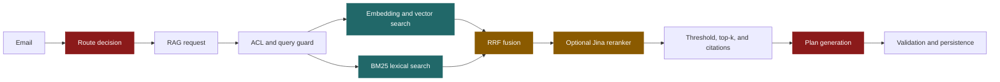

# Retrieval Evaluation Dashboard

> Generated from metadata-only JSON under `evaluations/baselines/`. Do not use hashing runs as semantic-quality or production-latency evidence.

## Decision Snapshot

- **Current corpus:** 17 documents / 1069 chunks, 100 cases.
- **Current evidence:** mechanical-only; live semantic evidence missing.
- **Historical comparison reports:** 5; retain for context only.

## Pipeline

Green: exercised by retrieval reports. Amber: exercised only as part of a combined retriever. Red: no report-local quality or latency evidence.

## Current Corpus Evidence

| Report | Embedder | Retriever | Corpus | Section MRR | Semantic MRR | p50 / p95 ms | Evidence |
|---|---|---|---|---:|---:|---:|---|
| `retrieval-eval-2026-08-17-hashing-dense.json` | hashing | dense | 100 cases / 17 docs / 1069 chunks | 0.2272 | 0.0449 | 0 / 0 (integer-truncated) | mechanical-only |
| `retrieval-eval-2026-08-17-hashing-hybrid.json` | hashing | hybrid | 100 cases / 17 docs / 1069 chunks | 0.4362 | 0.1692 | 25 / 37 | mechanical-only |

## Historical Baselines

| Report | Embedder | Retriever | Corpus | Section MRR | Semantic MRR | p50 / p95 ms | Evidence |
|---|---|---|---|---:|---:|---:|---|
| `retrieval-eval-2026-08-08-gemini-dense.json` | gemini | dense | 32 cases / 6 docs / 36 chunks | 0.9286 | 0.9167 | 450 / 483 | live semantic |
| `retrieval-eval-2026-08-08-gemini-bm25.json` | gemini | bm25 | 32 cases / 6 docs / 36 chunks | 0.7946 | 0.3750 | 0 / 0 (integer-truncated) | live semantic |
| `retrieval-eval-2026-08-08-gemini-hybrid.json` | gemini | hybrid | 32 cases / 6 docs / 36 chunks | 0.8690 | 0.5556 | 438 / 937 | live semantic |
| `retrieval-eval-2026-08-08-gemini-hybrid-rerank.json` | gemini | hybrid + jina | 32 cases / 6 docs / 36 chunks | 0.9554 | 0.7917 | 1027 / 2432 | live semantic |
| `retrieval-eval-2026-08-08-hashing-dense.json` | hashing | dense | 32 cases / 6 docs / 36 chunks | 0.5101 | 0.1167 | 0 / 0 (integer-truncated) | mechanical-only |

## Component Performance Map

| Pipeline component | Latency evidence | Quality evidence | Decision state |
|---|---|---|---|
| Route decision | Not emitted by retrieval reports | Separate routing fixture only | Instrument before blaming retrieval |
| ACL and query guard | Included in retrieval total only | Unit-tested; no per-stage benchmark | Correctness covered, performance unknown |
| Embedding and vector search | Included in retrieval total only | Current hashing runs are mechanical-only | Need live-provider stage timing |
| BM25 lexical search | Included in hybrid total only | Historical lexical slice exists | No independent current latency |
| Hybrid retrieval and RRF fusion | Included in hybrid total only | Historical semantic regression signal | Re-measure on current live corpus |
| Jina reranker | Included in hybrid+rereank total only | Historical aggregate improvement, semantic trade-off | Add applied/fallback and stage timing |
| Threshold and abstention | Included in retrieval total only | Current hashing abstention is 0.000 | Runtime policy remains open |
| Plan generation and citation validation | Not emitted here | No grounded-plan quality evaluation | Instrument and evaluate separately |

## Bottleneck Readout

- **Current bottleneck:** not identifiable from the stored reports. Per-component timing is not emitted; they measure only end-to-end retrieval latency.
- **Current retrieval coverage:** dense, hybrid.
- **Current quality limit:** every current report uses hashing embeddings, so rank differences are not semantic evidence.
- **Historical trade-off:** live six-document reports retain useful context, but cannot select the current default.
- **Highest-value next measurement:** emit per-component timings from one current live dense/hybrid/rerank run.

## Refresh Contract

1. Store every evaluator JSON under `evaluations/`; retrieval reports belong in `baselines/`.
2. Run the relevant evaluator with its default output path, then run `python scripts/build_evaluation_dashboard.py`.
3. Do not compare reports across different corpus/case counts as a release decision.
4. Add `embedding_ms`, `dense_search_ms`, `bm25_ms`, `fusion_ms`, `rerank_ms`, `post_filter_ms`, routing, and generation timings before assigning a component bottleneck.
