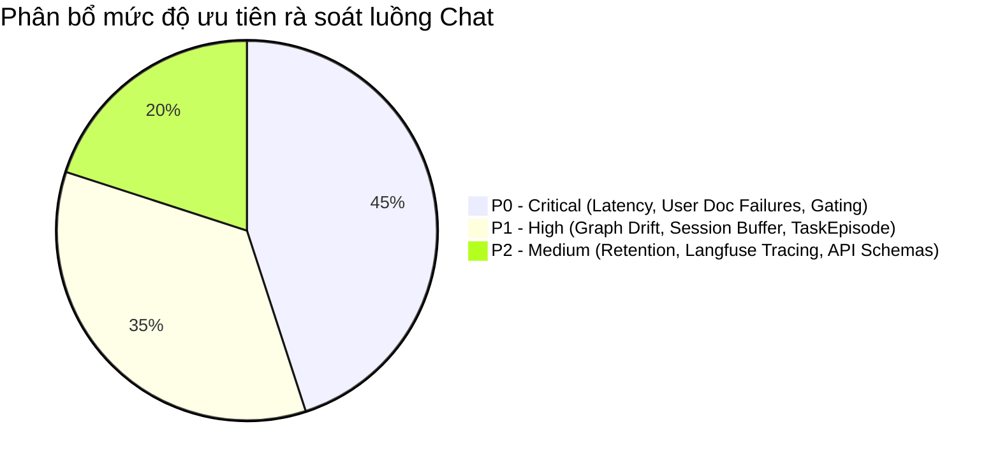

# PLAN: Kế hoạch Viết Tài liệu & Rà soát Kỹ thuật Luồng AI Chat (Non-Email)

## 1. Mục tiêu (Goal)
Chuẩn hóa và hoàn thiện bộ tài liệu kỹ thuật, đánh giá chi tiết các khâu xử lý trong luồng **AI Chat & Typed Memory Subsystem** (độc lập với Email RAG). Xác định rủi ro, phân loại mức độ ưu tiên rà soát từ **P0 (Critical)** đến **P2 (Maintenance)** và lập lộ trình xử lý kỹ thuật.

---

## 2. Ma trận Mức độ Ưu tiên (Priority Matrix)



---

## 3. Danh mục các Khâu cần Rà soát theo Mức độ Ưu tiên

### 🔴 P0 — Critical (Cần xử lý & làm rõ docs ngay)

#### 1. Phân loại Intent & Độ trễ P95 (Intent Classification & Precondition Gate)
* **Thành phần liên quan:**
  - [`src/cowork_agent/features/ai_chat/intent/service.py`](../../src/cowork_agent/features/ai_chat/intent/service.py)
  - [`src/cowork_agent/features/ai_chat/intent/prompt.py`](../../src/cowork_agent/features/ai_chat/intent/prompt.py)
  - [`src/cowork_agent/features/ai_chat/intent/resolver.py`](../../src/cowork_agent/features/ai_chat/intent/resolver.py)
  - [`evaluations/CHAT/baselines/chat-routing-eval-2026-08-14.json`](../../evaluations/CHAT/baselines/chat-routing-eval-2026-08-14.json)
* **Trọng tâm rà soát:**
  - **P95 Latency Threshold:** Báo cáo eval ghi nhận P95 = **2375ms** (vượt ngưỡng mục tiêu $\le 1500\text{ms}$ tại [`evaluation.py`](../../src/cowork_agent/features/ai_chat/intent/evaluation.py)). Cần tài liệu hóa nguyên nhân (thêm 1 round-trip LLM phân loại) và giải pháp tối ưu (fast-path heuristic hoặc nén prompt).
  - **Precondition Narrowing:** Logic tự động thu hẹp route `RAG` $\rightarrow$ `CHAT` khi catalog tài liệu dự án chưa có file sẵn sàng (`ReadyDocumentRef`).
  - **Vietnamese & Adversarial Query Handling:** Đảm bảo độ chính xác phân loại các câu hỏi đa nghĩa, tiếng Việt không dấu hoặc câu mang tính prompt injection ([`test_user_intent_vietnamese.py`](../../tests/unit/features/ai_chat/test_user_intent_vietnamese.py)).

#### 2. Mặt phẳng Tài liệu Người dùng & Trạng thái Degraded (User Documents Plane)
* **Thành phần liên quan:**
  - [`src/cowork_agent/integrations/rag/project_documents.py`](../../src/cowork_agent/integrations/rag/project_documents.py)
  - [`src/cowork_agent/orchestration/project_document_worker.py`](../../src/cowork_agent/orchestration/project_document_worker.py)
* **Trọng tâm rà soát:**
  - **OCR Gap:** Không có OCR adapter cho User Documents. Các file PDF scan/ảnh trả về lỗi `ocr_unavailable`. Cần tài liệu hóa rõ ràng ranh giới lỗi và hướng dẫn người dùng.
  - **Fallback / Degraded Mode:** Xử lý khi chỉ mục Turbovec (`.tvim`) bị lock/corrupt hoặc Postgres/SQLite chunks timeout ($>10\text{s}$) $\rightarrow$ chuyển sang `project_documents_degraded` và phát sinh cảnh báo SSE an toàn.
  - **Dual Plane Isolation:** Chứng minh bằng sơ đồ và code rằng Company RAG (`data/extracted/`) không bao giờ bị merge hoặc fallback nhầm vào User Documents.

---

### 🟡 P1 — High (Quan trọng về kiến trúc & mở rộng)

#### 3. Điều phối Turn & Đồng bộ Kiến trúc Graph (Turn Controller vs Graph Engine)
* **Thành phần liên quan:**
  - [`src/cowork_agent/features/ai_chat/controller.py`](../../src/cowork_agent/features/ai_chat/controller.py)
  - [`src/cowork_agent/features/ai_chat/graph/runner.py`](../../src/cowork_agent/features/ai_chat/graph/runner.py)
* **Trọng tâm rà soát:**
  - **Architectural Drift:** Làm rõ sự khác biệt giữa thiết kế trong target architecture (tài liệu đã gỡ bỏ 2026-08-27) (Graph `classify -> retrieve -> assemble -> stream -> persist`) và mã nguồn live (`ChatController.stream_message` nguyên khối).
  - **SSE Streaming & Idempotency:** Chu trình phát các SSE events (`started`, `delta`, `memory_citation`, `task_proposal`, `completed`, `error`) và replay qua `idempotency_key`.

#### 4. Quản lý Bộ nhớ Ngắn hạn & Khả năng Scale (Session Buffer)
* **Thành phần liên quan:**
  - [`src/cowork_agent/features/ai_chat/session_buffer.py`](../../src/cowork_agent/features/ai_chat/session_buffer.py)
* **Trọng tâm rà soát:**
  - **In-memory Only:** Hiện tại `InMemoryChatSessionBuffer` lưu buffer trong tiến trình. Cần ghi chú rõ điều kiện deploy (yêu cầu sticky sessions nếu chạy multi-worker/container) và roadmap chuyển sang Redis.

#### 5. Vòng đời Đề xuất & Phê duyệt TaskEpisode
* **Thành phần liên quan:**
  - [`src/cowork_agent/features/ai_chat/episode_policy.py`](../../src/cowork_agent/features/ai_chat/episode_policy.py)
  - [ADR-004](../../tasks/adr/ADR-004-chat-native-task-episodes.md)
* **Trọng tâm rà soát:**
  - **Explicit User Request Gate:** Chỉ tạo episode khi `is_explicit_task_request(request) == True`.
  - **State Machine & Retrieval Invariants:** Mọi episode mới đều khởi tạo với `retrieval_eligible = False`. Chỉ chuyển sang `True` khi người dùng gọi API `/episodes/{id}/approve` hoặc `/complete`. Bị từ chối (`rejected`) thì giữ nguyên `False`.

---

### 🟢 P2 — Medium (Bảo trì, vận hành & giám sát)

#### 6. Bộ nhớ Khai báo (Declarative) & Chính sách Lưu trữ (Retention)
* **Thành phần liên quan:**
  - [`src/cowork_agent/features/ai_chat/profile_policy.py`](../../src/cowork_agent/features/ai_chat/profile_policy.py)
  - [`src/cowork_agent/features/ai_chat/retention.py`](../../src/cowork_agent/features/ai_chat/retention.py)
* **Trọng tâm rà soát:**
  - **Provenance:** Profile chỉ cập nhật qua `explicit_user_config` (không tự suy diễn từ user document).
  - **TTL & Expiry:** Logic `compute_expires_at` và các script dọn dẹp bộ nhớ [`scripts/purge_chat_memory.py`](../../scripts/purge_chat_memory.py).

#### 7. Giám sát & Quan sát Bộ nhớ (Observability & Tracing)
* **Thành phần liên quan:**
  - [`src/cowork_agent/features/ai_chat/memory_observability.py`](../../src/cowork_agent/features/ai_chat/memory_observability.py)
  - [`src/cowork_agent/api/chat.py`](../../src/cowork_agent/api/chat.py)
* **Trọng tâm rà soát:**
  - Định dạng Langfuse traces (`@observe` metadata), log cấu trúc citations và độ trễ từng khâu.

---

## 4. Kế hoạch Viết & Cập nhật Tài liệu

| Bước | Hành động | File đích / Cần tạo mới | Trạng thái |
|---|---|---|---|
| **B1** | Cập nhật Level 1 Architecture document cho AI Chat & Typed Memory | [MODIFY] [`docs/architectures/c3-api-ai-chat.md`](../../docs/architectures/c3-api-ai-chat.md) | Sẵn sàng |
| **B2** | Viết tài liệu hướng dẫn kỹ thuật chi tiết luồng AI Chat (Deep-Dive & Runbook) | [NEW] [`docs/references/ai-chat-subsystem-guide.md`](../../docs/references/ai-chat-subsystem-guide.md) | Sẵn sàng |
| **B3** | Cập nhật bảng chỉ số đánh giá và báo cáo latency intent classifier | [MODIFY] `evaluations/CHAT/README.md` | Sẵn sàng |
| **B4** | Cập nhật Skill Tree tự động | [MODIFY] [`SKILL_TREE.md`](../../.agents/skills/corpus2skill/SKILL_TREE.md) | Sẵn sàng |

---

## 5. Verification Commands

```bash
# 1. Chạy test suite AI Chat
uv run pytest tests/unit/features/ai_chat tests/unit/domain/test_chat_contracts.py tests/unit/api/test_owned_history_checkout.py -q

# 2. Lint & type check
uv run ruff check .
uv run mypy src

# 3. Đồng bộ Skill Tree
uv run python scripts/auto_corpus2skill.py
```
