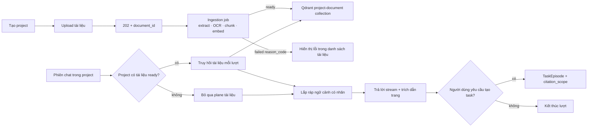

# Product Requirements Document

## Cowork Agent — Project Documents và AI Chat với tài liệu ("chat with the PDF")

| Trường | Giá trị |
|---|---|
| Sản phẩm | Cowork Agent — AI Chat Assistant |
| Trạng thái tài liệu | Accepted for implementation |
| Phiên bản | 3.0 |
| Ngày | 2026-08-12 |
| Phụ thuộc | PRD-v1 (Email + RAG) và PRD-v2 (Memory Extension) đã hoàn thành |
| Thẩm quyền kiến trúc | [ADR-005](../../docs/adr/ADR-005-project-scoped-chat-documents.md), [TARGET-ARCHITECTURE §21](../../docs/architectures/TARGET-ARCHITECTURE.md) |
| Chủ sở hữu tính năng | AI Chat Controller (`feature: ai_chat`) |
| Vector store | Qdrant (bắt buộc cho plane này) |
| OCR | Bật, dùng Mistral OCR |
| Retention mặc định | 30 ngày |
| Reflexion / Scheduling | Ngoài phạm vi |

---

## 1. Tóm tắt điều hành

PRD-v3 bổ sung hai thứ vào AI Chat Assistant:

1. **Project** — một không gian làm việc do người dùng tạo, chứa tài liệu và
   nhiều phiên chat.
2. **Project document plane** — mặt phẳng truy hồi ngữ nghĩa thứ hai, cho phép
   người dùng tải PDF/DOCX lên project và hỏi đáp có trích dẫn tới từng trang.

Người dùng tải tài liệu lên một lần trong project, sau đó mọi phiên chat thuộc
project đó đều có thể grounding trên tài liệu. Không có bước attach/detach theo
từng phiên.

Vòng lặp giá trị:

```text
Tạo project
→ tải tài liệu lên project
→ hệ thống trích xuất (native text + OCR), chunk theo trang, index vào Qdrant
→ mở phiên chat trong project
→ mỗi lượt chat truy hồi bằng chứng từ tài liệu của project
→ trả lời có trích dẫn document + page
→ khi người dùng yêu cầu rõ ràng, tạo TaskEpisode với citation toạ độ tài liệu
```

Ranh giới dữ liệu quan trọng: tài liệu của người dùng **không bao giờ** nhập vào
company RAG corpus, không bao giờ vào TaskEpisode dưới dạng văn bản, và không bao
giờ vào luồng Email Agent PRD-v1.

---

## 2. Giả thuyết sản phẩm

> Khi tài liệu được gom theo project thay vì theo phiên chat, người dùng nhận
> được câu trả lời grounded có trích dẫn trang mà không phải tải lại tài liệu cho
> mỗi cuộc hội thoại, và độ chính xác truy hồi cao hơn so với việc truy hồi trên
> toàn bộ tài liệu của người dùng.

---

## 3. Vấn đề cần giải quyết

Semantic memory hiện tại là company corpus do quản trị viên biên tập: ingest
offline bằng CLI vào `data/extracted/`, phạm vi theo tenant, có trạng thái
`document_status: ready`, và dựng lại được từ repository.

Tài liệu người dùng tự tải lên không khớp với mặt phẳng đó:

- người dùng sở hữu tài liệu, không có quy trình duyệt;
- phạm vi hẹp hơn tenant và phải xoá được theo yêu cầu;
- dữ liệu không dựng lại được;
- truy hồi hiện tại chỉ kích hoạt theo cụm từ gợi ý ("company policy"), nên phần
  lớn câu hỏi về tài liệu sẽ không đọc tài liệu;
- chunker hiện tại cắt theo heading Markdown, không có provenance trang, nên
  không thể trích dẫn "trang 7";
- phiên chat chưa có container, nên tài liệu gắn theo `session_id` sẽ phải tải
  lại cho mỗi cuộc hội thoại mới.

---

## 4. Mục tiêu

1. Cho phép người dùng tạo, liệt kê và xoá Project.
2. Gắn mỗi phiên chat vào đúng một project, có default project để hợp đồng
   `POST /sessions` hiện tại không vỡ.
3. Cho phép tải PDF/DOCX lên project với phản hồi `202` và trạng thái theo dõi
   được.
4. Trích xuất văn bản gốc và OCR các trang scan trong giới hạn đã cấu hình.
5. Chunk theo trang để mọi trích dẫn quy về `page_start`/`page_end`.
6. Index vào collection Qdrant riêng, lọc theo tenant/user/project/document.
7. Truy hồi tất định mỗi lượt chat khi project có tài liệu `ready`.
8. Lắp ráp ngữ cảnh có nhãn `project_document_evidence` và quy tắc ưu tiên rõ
   ràng.
9. Trả lời có trích dẫn trang, hoặc nói rõ tài liệu không chứa câu trả lời.
10. Cho phép TaskEpisode trích dẫn tài liệu dưới dạng toạ độ với
    `citation_scope`.
11. Hỗ trợ xoá theo document, project, user và toàn feature; purge lan tới object
    store, extracted text và Qdrant points.
12. Áp dụng retention mặc định 30 ngày.
13. Phát telemetry chỉ chứa metadata.

---

## 5. Ngoài phạm vi

- chia sẻ project hoặc tài liệu cho người dùng khác hay ở mức workspace;
- đẩy tài liệu project vào company corpus;
- hiểu hình ảnh, biểu đồ, cấu trúc bảng ngoài phần text do OCR trả về;
- chỉnh sửa, chú thích hoặc tái sinh tài liệu;
- re-ingest theo lịch hoặc tự động;
- ingest attachment Gmail (vẫn ngoài phạm vi theo ADR-003);
- episodic retrieval theo project (hoãn lại; chỉ ghi `project_id`);
- bất kỳ in-chat tool nào, kể cả `@Email`;
- Reflexion, multi-agent orchestration, scheduling.

---

## 6. Người dùng mục tiêu

- **Người dùng chính**: nhân viên tri thức cần hỏi đáp trên tài liệu của chính
  mình (hợp đồng, báo cáo, tài liệu kỹ thuật) trong nhiều phiên chat.
- **Bên liên quan**: đội kỹ thuật sở hữu Chat Controller, RAG, Qdrant,
  persistence và telemetry; đội bảo mật/quyền riêng tư duyệt việc lưu trữ dữ
  liệu người dùng và việc gửi ảnh trang tới nhà cung cấp OCR.

---

## 7. User stories

### US-01 — Tạo project

Là người dùng, tôi muốn tạo project để gom tài liệu và các phiên chat liên quan
vào một chỗ.

### US-02 — Tải tài liệu lên

Là người dùng, tôi muốn tải PDF/DOCX lên project và thấy trạng thái xử lý rõ
ràng thay vì phải chờ trong lúc gửi tin nhắn.

### US-03 — Hỏi đáp trên tài liệu

Là người dùng, tôi muốn hỏi về nội dung tài liệu trong project và nhận câu trả
lời kèm trích dẫn tài liệu và số trang.

### US-04 — Dùng lại tài liệu qua nhiều phiên

Là người dùng, tôi muốn mở phiên chat mới trong cùng project mà không phải tải
lại tài liệu.

### US-05 — Tài liệu scan

Là người dùng, tôi muốn PDF scan cũng dùng được nhờ OCR, và được báo lỗi rõ ràng
khi vượt giới hạn thay vì nhận kết quả rỗng.

### US-06 — Biết khi tài liệu không có câu trả lời

Là người dùng, tôi muốn trợ lý nói rõ tài liệu không chứa thông tin, thay vì bịa
ra nội dung.

### US-07 — Xoá dữ liệu

Là người dùng, tôi muốn xoá một tài liệu hoặc cả project và chắc chắn dữ liệu bị
xoá khỏi mọi nơi lưu trữ.

### US-08 — Ranh giới riêng tư

Là người dùng, tôi muốn tài liệu của mình không trở thành kiến thức chung của
công ty và không bị người khác truy hồi.

---

## 8. Trải nghiệm end-to-end



---

## 9. Nguyên tắc sản phẩm

1. Project là ranh giới truy hồi của tài liệu người dùng.
2. Tài liệu người dùng và company corpus là hai lớp dữ liệu khác nhau, không
   trộn.
3. ACL được dựng trước khi embed truy vấn.
4. Truy hồi tài liệu là tất định, không phụ thuộc cụm từ gợi ý.
5. Mọi khẳng định lấy từ tài liệu phải có trích dẫn document + trang.
6. Không đủ bằng chứng thì nói thiếu, không bịa.
7. Ingestion không bao giờ chạy trên request path của lượt chat.
8. Không index đầu ra trích xuất rỗng hoặc một phần.
9. Văn bản tài liệu không vào episode, log, telemetry, fixture.
10. Suy giảm dịch vụ phải hiển thị rõ, không âm thầm trả lời bằng kiến thức
    tham số của mô hình.

---

## 10. Yêu cầu chức năng

### FR-01 — Project container

Hệ thống phải hỗ trợ tạo, liệt kê và xoá Project với hợp đồng:

```yaml
project_id: string
tenant_id: string
user_id: string
name: string
is_default: boolean
created_at: datetime
updated_at: datetime
```

Project không bao giờ vượt qua ranh giới user hoặc tenant.

### FR-02 — Default project

Mỗi user phải có một default project được tạo ở lần dùng đầu tiên. `POST
/sessions` không kèm `project_id` phải phân giải về default project.

### FR-03 — Phiên chat thuộc project

`project_id` là trường bắt buộc của chat session scope. Mọi thao tác bộ nhớ của
phiên phải mang `project_id`, và fail closed khi thiếu hoặc không nhất quán.

### FR-04 — Tải tài liệu lên

`POST /v1/cowork/chat/projects/{project_id}/documents` nhận multipart, trả `202`
kèm `document_id` và `status` (hoặc `200` nếu trùng nội dung byte cũ). Việc trích xuất chạy trong job nền.

### FR-05 — Kiểm tra đầu vào

Trước khi nhận, hệ thống phải kiểm tra:

- media type theo nội dung đã sniff, không theo phần mở rộng tên file;
- kích thước theo `KNOWLEDGE_INGEST_MAX_BYTES`;
- số trang theo `KNOWLEDGE_INGEST_MAX_PDF_PAGES`;
- tài liệu mã hoá bị từ chối (`encrypted_document`);
- hạn ngạch số tài liệu và tổng dung lượng theo project (`quota_exceeded`).

### FR-06 — Trích xuất và OCR

Hệ thống dùng lại `PdfInspector` và `DocxExtractor` của PRD-v1. Các trang được
báo là cần OCR sẽ gửi tới Mistral OCR trong giới hạn `KNOWLEDGE_INGEST_MAX_OCR_PAGES`,
`KNOWLEDGE_INGEST_TIMEOUT_SECONDS` và `KNOWLEDGE_INGEST_MAX_ATTEMPTS`. Trang đã
có native text không bao giờ bị OCR lại. Đầu ra rỗng hoặc một phần không được
index.

### FR-07 — Chunk theo trang

Mỗi chunk phải mang `page_start` và `page_end` suy ra từ marker
`<!-- Page N -->`, sau đó cắt theo ranh giới đoạn văn dưới giới hạn kích thước
hiện có.

### FR-08 — Index riêng biệt

Chunk được ghi vào collection Qdrant riêng cho project document, với payload
gồm `tenant_id`, `user_id`, `project_id`, `document_id`, `page_start`,
`page_end`, `document_title`, `section`, `expires_at`.

### FR-09 — Trạng thái ingestion

Hợp đồng bản ghi tài liệu project (`ProjectDocument`):

```yaml
document_id: string
tenant_id: string
user_id: string
project_id: string
filename: string
media_type: string
byte_size: integer
content_sha256: string
status: string
reason_code: string | null
page_count: integer | null
ocr_page_count: integer | null
chunk_count: integer | null
created_at: datetime
updated_at: datetime
expires_at: datetime
```

Chuyển đổi trạng thái:

```text
received → extracting → indexing → ready
mọi trạng thái → failed(reason_code)
ready|failed → deleted
```

Tập reason code:

```text
file_too_large · pdf_page_limit_exceeded · empty_extraction
unsupported_media_type · encrypted_document
ocr_page_limit_exceeded · ocr_failed
quota_exceeded · embedding_unavailable · index_unavailable
```

`document_id` suy ra tất định từ `tenant_id`, `user_id`, `project_id` và
sha256 nội dung; tải lại đúng byte cũ trả về bản ghi cũ, không index bản sao.

### FR-10 — Truy hồi tất định

Khi project của phiên có ít nhất một tài liệu `ready`, plane tài liệu được truy
vấn ở mọi lượt chat. Client có thể thu hẹp bằng `document_ids`; mặc định là toàn
bộ tài liệu `ready` của project. Company RAG giữ nguyên chính sách gợi ý hiện
tại.

### FR-11 — ACL trước khi embed

Bộ lọc `tenant_id`, `user_id`, `project_id`, trạng thái `ready` và điều kiện
chưa hết hạn phải được dựng **trước** khi embed truy vấn. Project không có tài
liệu `ready` là plane bị tắt, không phải truy vấn không lọc.

### FR-12 — Lắp ráp ngữ cảnh

Bộ lắp ráp thêm nhãn `project_document_evidence`. Thứ tự ưu tiên:

```text
current_instruction
> project_document_evidence
> current_company_evidence
> stored_preference
> advisory_episode
```

Phạm vi thẩm quyền: tài liệu project có thẩm quyền về **nội dung của chính nó**;
company RAG có thẩm quyền về **quy trình và chính sách công ty**. Khi hai nguồn
mâu thuẫn về quy trình, hệ thống nêu cả hai kèm trích dẫn, không tự ý chọn.

### FR-13 — Trích dẫn theo trang

Mọi khẳng định lấy từ tài liệu phải kèm `document_title` và khoảng trang. Giao
diện hiển thị trích dẫn tài liệu bằng cùng kiểu chip với trích dẫn company RAG,
có nhãn phân biệt nguồn.

### FR-14 — Không đủ bằng chứng

Khi không chunk nào vượt ngưỡng điểm, trợ lý phải nói rõ tài liệu trong project
không chứa câu trả lời và liệt kê thông tin còn thiếu. Bịa nội dung là lỗi
validation.

### FR-15 — Trích dẫn trong TaskEpisode

TaskEpisode mở rộng hợp đồng mang thêm `project_id` và trích dẫn toạ độ:

```yaml
project_id: string
rag_citations:
  - citation_scope: company | project_document
    document_id: string
    document_title: string
    section: string | null
    page_start: integer | null
    page_end: integer | null
    source_url: string | null
```

Episode ghi bắt buộc `project_id`. Phạm vi **truy hồi** episodic giữ nguyên theo
PRD-v2 FR-09 (tenant, user, `feature: ai_chat`).

### FR-16 — Xoá

Hệ thống hỗ trợ xoá theo: một tài liệu, một project, toàn bộ tài liệu của một
user, và toàn feature AI Chat. Việc xoá phải purge object store, extracted text
và Qdrant points, và lặp lại được cho tới khi mọi store xác nhận. Xoá tài liệu
không xoá episode đang trích dẫn nó; trích dẫn đó hiển thị là không còn khả
dụng.

### FR-17 — Retention

Mặc định 30 ngày kể từ lúc tải lên, cấu hình được theo tenant. Tài liệu hết hạn
bị loại khỏi truy hồi **trước khi** xếp hạng và bị purge bởi cơ chế purge nền
hiện có.

### FR-18 — Telemetry

Hệ thống phát metadata cho: kết quả upload và reason code, thời lượng từng giai
đoạn ingestion, số trang OCR, số chunk, trạng thái truy hồi, số kết quả, độ trễ,
tỉ lệ degraded, và kết quả xoá/purge. Telemetry sản xuất không chứa văn bản tài
liệu, tên file đầy đủ hoặc nội dung truy vấn.

### FR-19 — Trình bày sản phẩm

Màn hình project hiển thị: danh sách tài liệu kèm trạng thái và reason code,
tiến trình ingestion, nút xoá, và ngày hết hạn. Mọi vùng dữ liệu có đủ bốn trạng
thái loading / empty / error / success theo chuẩn của SPEC-Demo-Frontend §6.

---

## 11. Thất bại và fallback

| Tình huống | Hành vi |
|---|---|
| Vi phạm kiểm tra đầu vào | `failed(reason_code)` ngay lúc upload, không giữ byte ngoài bản ghi lỗi |
| Vector store / Qdrant tắt hoặc không khả dụng lúc upload | API upload trả `503` (`index_unavailable`), từ chối ngay thay vì nhận file |
| Trích xuất lỗi | `failed`, không index, chat không bị ảnh hưởng |
| OCR lỗi | retry có giới hạn, sau đó `failed(ocr_failed)` |
| Embedding lỗi | giữ `indexing`, retry backoff có giới hạn, sau đó `failed(embedding_unavailable)` |
| Qdrant không khả dụng lúc truy vấn | một lần retry, sau đó kết quả rỗng + `degraded: true`, lượt chat nêu rõ bằng chứng tài liệu không khả dụng |
| Truy hồi timeout | một lần retry, sau đó `timeout` + `degraded: true` |
| Tài liệu bị xoá hoặc hết hạn giữa phiên | bị bộ lọc loại bỏ, lượt chat tiếp tục |
| Không chunk nào vượt ngưỡng | `no_results`, trả lời nêu rõ tài liệu không bao phủ câu hỏi |

Plane tài liệu suy giảm không bao giờ chuyển sang sinh nội dung không nguồn, và
không ảnh hưởng Email Agent PRD-v1.

---

## 12. Bảo mật và quyền riêng tư

- Byte tải lên, extracted text và kết quả OCR là dữ liệu người dùng: mã hoá at
  rest, kiểm tra quyền ở mọi lần đọc.
- OCR gửi ảnh trang tới nhà cung cấp bên ngoài; điều này phải được nêu rõ trong
  copy sản phẩm ở luồng upload.
- Văn bản tài liệu không vào company corpus, TaskEpisode, declarative profile,
  hay bất kỳ luồng Email PRD-v1 nào.
- Truy cập chéo tenant, chéo user và chéo project fail closed.
- Development trace không phải nguồn bộ nhớ và không được bật ở production.

---

## 13. Chỉ số thành công

### Chất lượng sản phẩm

- tỉ lệ câu trả lời có trích dẫn hợp lệ;
- độ chính xác trích dẫn trang trên tập nhãn;
- tỉ lệ trả lời "không có trong tài liệu" đúng (không bịa);
- tỉ lệ tài liệu ingest thành công, tách theo native text và OCR;
- so sánh chất lượng khi bật/tắt plane tài liệu trên cùng tập câu hỏi.

### An toàn và chính sách

Các chỉ số sau phải bằng không:

- truy hồi tài liệu chéo tenant;
- truy hồi tài liệu chéo user;
- truy hồi tài liệu chéo project;
- truy hồi tài liệu đã hết hạn hoặc đã xoá;
- văn bản tài liệu xuất hiện trong episode, log hoặc telemetry.

### Độ tin cậy

- độ trễ ingestion theo giai đoạn;
- độ trễ truy hồi tài liệu p50/p95;
- tỉ lệ degraded;
- tỉ lệ hoàn tất xoá và purge.

---

## 14. Tiêu chí nghiệm thu

PRD-v3 được chấp nhận khi:

1. Người dùng tạo, liệt kê và xoá được project.
2. Default project tồn tại và `POST /sessions` không kèm `project_id` vẫn chạy.
3. Mọi phiên chat mang `project_id`, thiếu thì fail closed.
4. Upload trả `202` (hoặc `200` nếu trùng nội dung) và trạng thái theo dõi được qua endpoint status.
5. Kiểm tra media type dựa trên nội dung, không dựa trên phần mở rộng.
6. Vượt giới hạn kích thước, trang, hạn ngạch hoặc tài liệu mã hoá trả đúng
   reason code.
7. Trang cần OCR được OCR trong giới hạn; trang native không bị OCR lại.
8. Đầu ra trích xuất rỗng hoặc một phần không bao giờ được index.
9. Mọi chunk có `page_start` và `page_end`.
10. Chunk nằm trong collection Qdrant riêng, không nằm trong company collection.
11. Bộ lọc ACL được dựng trước khi embed truy vấn.
12. Project có tài liệu `ready` thì mọi lượt chat truy hồi plane tài liệu.
13. Project không có tài liệu `ready` thì plane bị tắt, không truy vấn không lọc.
14. Ngữ cảnh có nhãn `project_document_evidence` và đúng thứ tự ưu tiên.
15. Câu trả lời dựa trên tài liệu luôn kèm trích dẫn document + trang.
16. Không đủ bằng chứng thì trả lời nêu thiếu, không bịa.
17. TaskEpisode chỉ chứa toạ độ trích dẫn, không chứa văn bản tài liệu.
18. Xoá theo document/project/user/feature purge cả object store, extracted text
    và Qdrant points.
19. Tài liệu hết hạn bị loại trước khi xếp hạng.
20. Qdrant không khả dụng thì trả `degraded: true`, không thay thế bằng nguồn
    khác.
21. Telemetry sản xuất chỉ chứa metadata.
22. Không có in-chat tool, scheduler hay ingest attachment Gmail nào được thêm.

---

## 15. Cột mốc bàn giao

### V3-M1 — Project container

- hợp đồng project, lưu trữ, default project;
- `project_id` trong chat session scope và memory namespace;
- API project CRUD;
- kiểm thử fail-closed khi thiếu hoặc sai `project_id`.

### V3-M2 — Ingestion job và OCR

- hợp đồng document record và state machine;
- validation, trích xuất, Mistral OCR client, chunk theo trang;
- reason code đầy đủ;
- chưa có truy hồi.

### V3-M3 — Qdrant project-document collection

- schema payload và index cho tenant/user/project/document;
- ghi và xoá lan truyền;
- kiểm thử ACL-first.

### V3-M4 — Truy hồi và lắp ráp ngữ cảnh

- truy hồi tất định theo project;
- nhãn `project_document_evidence` và thứ tự ưu tiên;
- xử lý mâu thuẫn với company RAG.

### V3-M5 — Trích dẫn và TaskEpisode

- hiển thị trích dẫn trang trong chat;
- `citation_scope` và `project_id` trong episode;
- xử lý trích dẫn tới tài liệu đã xoá.

### V3-M6 — Retention, xoá và governance

- retention 30 ngày và purge nền;
- audit xoá;
- safety counters và ngưỡng launch;
- đánh giá bật/tắt plane tài liệu trên tập nhãn.

---

## 16. Phụ thuộc

- Qdrant khả dụng (bắt buộc, không có fallback in-repo cho plane này);
- `MISTRAL_API_KEY` và `KNOWLEDGE_INGEST_OCR_ENABLED=true`;
- các lệnh cục bộ `detect-pdf` và `pdf2md` mà `PdfInspector` gọi;
- nhà cung cấp embedding hiện có;
- PostgreSQL cho project, document record và episode;
- object store có mã hoá cho byte tài liệu;
- cơ chế purge nền hiện có;
- danh tính tenant/user đã xác thực.

---

## 17. Rủi ro và giảm thiểu

| Rủi ro | Ảnh hưởng | Giảm thiểu |
|---|---|---|
| Rò rỉ tài liệu chéo user/project | Sự cố riêng tư nghiêm trọng | ACL dựng trước khi embed, collection riêng, safety counter bằng không |
| OCR sai hoặc thiếu chữ | Trả lời sai nhưng có vẻ có nguồn | Ngưỡng điểm, trích dẫn trang để người dùng đối chiếu, báo `ocr_failed` rõ ràng |
| Ảnh trang gửi ra nhà cung cấp ngoài | Vấn đề tuân thủ | Nêu rõ trong copy sản phẩm, giới hạn số trang, không lưu ngoài project |
| Qdrant sập | Mất khả năng hỏi tài liệu | `degraded: true` hiển thị rõ, không thay thế nguồn |
| Truy hồi mọi lượt làm tăng chi phí/độ trễ | Trải nghiệm kém | `top_k` và timeout có giới hạn, chỉ bật khi project có tài liệu ready |
| Tài liệu lớn vượt giới hạn | Người dùng thất vọng | Reason code rõ ràng ngay lúc upload, không xử lý một phần |
| Xoá sót ở một store | Vi phạm riêng tư | Xoá điều phối tập trung, lặp lại được, có audit |
| Người dùng nhầm tài liệu cá nhân là kiến thức công ty | Kỳ vọng sai | Nhãn nguồn khác nhau trong trích dẫn và trên UI |

---

## 18. Quyết định sản phẩm

### Đã chốt

- Tài liệu thuộc **project**, không thuộc phiên chat.
- Không có bước attach/detach theo phiên.
- Qdrant là bắt buộc cho plane tài liệu.
- OCR bật, dùng Mistral OCR.
- Retention mặc định 30 ngày.
- Truy hồi tài liệu là tất định, không theo cụm từ gợi ý.
- Không thêm SSE event type mới; dùng `memory_citation` với `citation_scope`.
- Episodic retrieval scope giữ nguyên theo PRD-v2; chỉ ghi thêm `project_id`.
- Tài liệu người dùng không bao giờ vào company corpus.

### Còn mở

- hạn ngạch cụ thể theo project (số tài liệu, tổng dung lượng);
- ngưỡng `min_score` và `top_k` cho plane tài liệu sau đo đạc;
- có cho phép người dùng đổi retention theo tài liệu hay không;
- có bật project-scoped episodic retrieval ở phiên bản sau hay không;
- ngưỡng chất lượng số cụ thể để launch.

---

## 19. Tóm tắt baseline

```text
Tạo project
→ upload tài liệu (202)
→ job: validate · extract · OCR · chunk theo trang · embed · index Qdrant
→ mở phiên chat trong project
→ mỗi lượt: ACL trước khi embed → truy hồi tài liệu project
→ lắp ráp ngữ cảnh có nhãn theo thứ tự ưu tiên
→ trả lời stream kèm trích dẫn document + trang
→ khi được yêu cầu rõ ràng: TaskEpisode với citation toạ độ
→ retention 30 ngày, xoá purge mọi store
→ telemetry chỉ metadata
```
