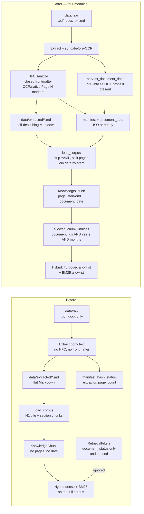

# Capability Map: Company Knowledge Ingestion

> **Status:** Approved 2026-08-16
> **Source:** Review of `docs/references/ingestion-pipeline-brainstorming.md`
>   (Document Loading specialization) plus live code in
>   `src/cowork_agent/integrations/knowledge_ingestion/`
> **Spec index:** this file. Do not guess which spec is active — select by
>   module id.

Company knowledge ingestion is several independently testable capabilities.
They share extractors and the `data/extracted/*.md` corpus. They do **not**
share one spec.

## Modules

| Module id | Responsibility | Depends on | Spec |
|---|---|---|---|
| `document-loading` | Company CLI Document Loading: discover, extract, NFC-sanitize, emit closed document metadata, persist atomic Markdown + manifest. Stops at `data/extracted/*.md`. | — | [SPEC-document-loading.md](./SPEC-document-loading.md) |
| `page-aware-corpus-load` | `load_corpus()` parses `<!-- Page N -->` into `KnowledgeChunk.page_start` / `page_end`. Coordinates survive onto `SemanticChunk`. | `document-loading` | [SPEC-page-aware-corpus-load.md](./SPEC-page-aware-corpus-load.md) |
| `format-txt-md` | Expand the company CLI whitelist to `.txt` and `.md`. | `document-loading` | [SPEC-format-txt-md.md](./SPEC-format-txt-md.md) |
| `retrieval-metadata-filters` | Query-time filters on `document_ids` and binary `document_date` (`years` / `months`). No `category`. | `page-aware-corpus-load` | [SPEC-retrieval-metadata-filters.md](./SPEC-retrieval-metadata-filters.md) |

## Build order

```text
document-loading
    → page-aware-corpus-load
        → format-txt-md
        → retrieval-metadata-filters   (only after a real filter source exists)
```

`format-txt-md` and `retrieval-metadata-filters` are independent of each other.

## Before / after

Company plane only. Left is the pipeline before these four modules; right is live code after they landed. `category` is still absent.



| Step | Before | After |
|---|---|---|
| Discover | `.pdf` / `.docx` | also `.txt` / `.md`; text never goes to OCR |
| Persist | raw extracted body | NFC + closed frontmatter; OCR pages get `<!-- Page N -->` |
| Manifest | operational fields only | plus optional `document_date` from binaries |
| `load_corpus` | H1 + sections; page comments ignored | strips frontmatter; `page_start`/`page_end`; join date by stem |
| Retrieve | whole corpus; `document_status` unused | pre-filter `document_ids` / `years` / `months`; empty allowlist → `NO_RESULTS` without embed |

Missing binary date stays `None` and fails a year/month filter. Callers that still pass only `document_status=ready` keep the before ranking.

## Plane boundary

These module ids apply to the **company CLI plane**
(`mail-todo-ingest-knowledge` → `data/extracted/*.md`).

The project-document plane (ADR-007 / ADR-008) is a different consumer. It may
later reuse `sanitize_text()` from `document-loading`. It is not a module on
this map.

Emails and email attachments are never ingested (ADR-003).

## Stable ids

Module ids are kebab-case and are not renamed mid-initiative. New specs,
plans, and PRs name the module id they implement.
