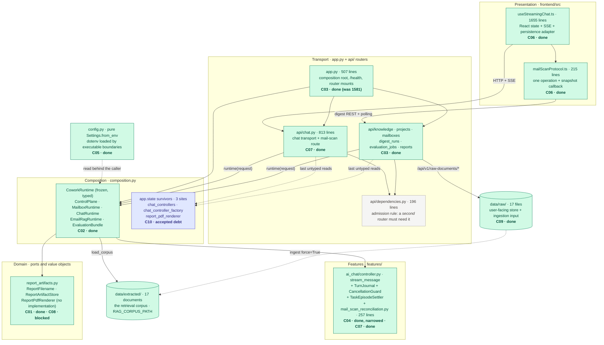
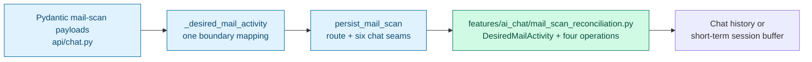
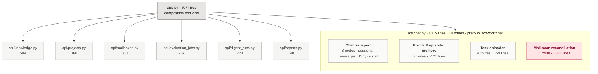
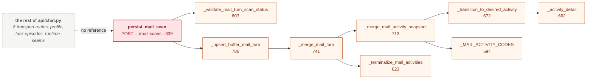
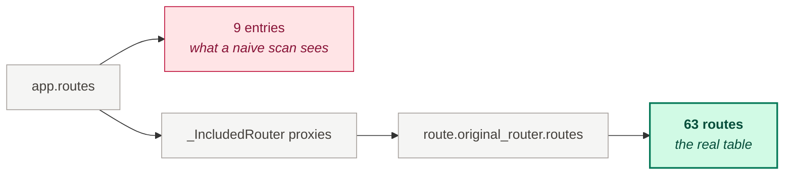

# SPEC: Architecture Improvement Program

**Status:** Living register — update it in the same commit that changes a workstream's state
**Date opened:** 2026-08-25
**Baseline verified at:** `dev` @ `216399e` (backend gate green: ruff clean, mypy clean on 201 files, pytest 2135 passed / 9 skipped)
**Vocabulary:** `codebase-design` — module, interface, depth, seam, adapter, leverage, locality, and the **deletion test**
**Decision records:** [ADR-013](../adr/ADR-013-composition-as-typed-value.md), [ADR-014](../adr/ADR-014-turn-pipeline-stays-one-function.md), [ADR-015](../adr/ADR-015-routers-own-their-transport.md), [ADR-016](../adr/ADR-016-report-artifacts-are-validated-domain-values.md), [ADR-017](../adr/ADR-017-settings-parsing-is-pure.md)

---

## 1. Why this file exists

This program has been tracked in OS-temp handoff documents and a temp HTML review. Windows
deleted one of them once already, and the work now runs across several agents at the same
time, so "what is done, what is open, what was deliberately rejected" cannot live in a
conversation or in `%TEMP%`.

**This file is the register.** It is in the repo, it is the source of truth for status, and
each ADR links back to a row here.

Rules for keeping it honest:

1. One row per workstream in §3, with a **stable ID that is never reused**.
2. A workstream leaves **Open** only when an ADR is written, or its §4 entry records why no
   ADR is needed.
3. **Rejections are recorded, not deleted** (§5). Re-deriving a rejected option is the exact
   failure mode this file exists to prevent.
4. Evidence is **a command someone can run**, not a remembered number. Numbers in this file
   are stamped with the commit they were measured at.
5. When you close a row, add a line to §9.

---

## 2. Where the program came from

A six-candidate architecture review, argued in `codebase-design` vocabulary. Every candidate
was accepted or rejected on the **deletion test**: *would deleting this module concentrate
complexity, or merely relocate it?* Two candidates were explicitly "deliberately not
proposed" and are recorded in §5 so they stay that way.

Source documents, all outside the repo and all volatile:

| Document | Path | State |
|---|---|---|
| Original review | `%TEMP%\architecture-review-20260825-022000.html` | temp; **already deleted once**. Its actionable content is carried into §4. |
| Roadmap 02 → 04 → 03 | `%APPDATA%\Qoder\SharedClientCache\cache\plans\Runtime_Deepening_Roadmap_464a1314.md` | complete; superseded by §4 |
| Post-merge decisions | `%TEMP%\decisions-runtime-deepening.html` | five decisions; four now resolved, see §3 |
| Handoff — roadmap | `%TEMP%\handoff-architecture-roadmap-20260825.md` | historical; content absorbed here |
| Handoff — C07 deep dive | `%TEMP%\handoff-runtime-deepening-roadmap.md` | historical; C07 is complete and its durable record is §4.5 |
| C07 before/after, illustrated | `%TEMP%\c07-chat-module-before-after.html` | a reading copy of §4.5 for humans; the diagrams here are the same ones |

If any of those are gone, this file is sufficient to continue.

### 2.1 Where each workstream sits

One map, so a reader can place a row in §3 without opening five files. Every node is annotated
with the workstream that owns it and its state.



The dependency direction is ADR-001's and is not negotiable:
`domain ← features ← integrations/orchestration/persistence ← app`. C02 is where it finally
got enforced at the composition edge; everything above reads its dependencies through
`runtime(request)` rather than reaching for an attribute and hoping.

---

## 3. The register

| ID | Workstream | Strength | Status | Record |
|---|---|---|---|---|
| **C01** | Report artifacts have no module — 3 hard-coded paths to `data/reports` | Strong | **Done** — `9c4e5fc` | [ADR-016](../adr/ADR-016-report-artifacts-are-validated-domain-values.md) |
| **C02** | Composition is a 440-line closure and ~60 untyped `app.state` keys | Strong | **Done** — slices 02-1…02-8 | [ADR-013](../adr/ADR-013-composition-as-typed-value.md) |
| **C04** | One chat turn is one 617-line generator | Strong | **Done, narrowed** — slices 04-1…04-3 | [ADR-014](../adr/ADR-014-turn-pipeline-stays-one-function.md) |
| **C03** | ~30 route closures never moved to routers | Worth exploring | **Done** — slices 03-1…03-3c | [ADR-015](../adr/ADR-015-routers-own-their-transport.md) |
| **C07** | Turn-reconciliation logic living in the transport layer (`api/chat.py`) | Strong | **Done — C07 slice** | §4.5 |
| **C05** | `Settings.from_env(load_env_file=True)` reads disk behind the caller | Worth exploring | **Done** — `67822e9` | [ADR-017](../adr/ADR-017-settings-parsing-is-pure.md) |
| **C06** | `useStreamingChat` runs both the SSE and the mail-poll protocol | Worth exploring | **Done — frontend protocol extraction** | §4.7 |
| **C08** | PDF renderer deliberately unshipped (route returns 501) | — | **Blocked** on a human dependency decision | §4.8 |
| **C09** | A stray corpus input in `data/raw/` — latent re-ingest risk | Minor | **Done** — moved to `data/OCR/` | §4.9 |
| **C10** | Three `app.state` survivors, one of them undocumented | — | **Accepted debt**, with revisit criteria | §4.10 |

Operational items from the post-merge decisions doc, for completeness — **not architecture
workstreams**, no ID, no tracking:

- *Unpushed commits* — resolved at the original baseline. This living register does not track
  later branch divergence; inspect Git directly.
- *E2E verification* — addressed at `216399e` (`test(e2e): fix locators and mocks…`). Playwright
  still needs a live server and credentials to run, so treat it as green-by-construction, not
  green-by-observation.

---

## 4. The workstreams

### 4.1 C01 — Report artifacts have no module · **Done** (`9c4e5fc`)

Three hard-coded paths to `data/reports`, and a model-supplied filename written to disk inside
`except Exception: log and continue` — a live path-traversal defect. Two frontend-called routes
(`/reports/{f}/download`, `/reports/{f}/pdf`) had no server-side implementation at all.

Closed by giving the artifact a module: `domain/report_artifacts.py` (the `ReportFilename`
value object — `parse` raises, `sanitize` degrades — plus the `ReportArtifactStore` and
`ReportPdfRenderer` **ports**), `persistence/report_artifacts.py`, and `api/reports.py`.

The implementation predates this program's ADR habit. [ADR-016](../adr/ADR-016-report-artifacts-are-validated-domain-values.md)
now records its two lasting contracts: filenames are validated domain values, and all report
persistence crosses one injected store interface. C08 remains a separate renderer decision.

```bash
git show 9c4e5fc --stat
```

---

### 4.2 C02 — Composition is a bag of attributes · **Done** · ADR-013

Everything the app is made of was constructed in one `lifespan` closure and published as ~60
untyped `app.state.<key>` attributes, so every consumer defended itself with
`getattr(request.app.state, "x", None)` plus `cast(Any, ...)` — 28× in `app.py`, 11× in
`api/chat.py`, 8× in `api/projects.py`.

Now one frozen `CoworkRuntime` in `composition.py`, assembled from the groups `ControlPlane`,
`MailboxRuntime`, `ChatRuntime`, `EmailRagRuntime`, `EvaluationBundle`, published once as
`app.state.runtime` and read through `runtime(request)`.

Two invariants worth not losing:

- **Accessor, not `Depends`** — the SSE stream runs per-token and must pay no DI overhead.
- **WHERE-not-WHAT** — each slice moved only *where* a dependency is read from, never *what*
  is composed or in what order. That is why the composition-order constraints (report store
  before any credentialed settings read) survived untouched.

Residue is tracked as **C10**.

---

### 4.3 C04 — The turn generator · **Done, narrowed** · ADR-014

The roadmap proposed splitting `stream_message` into six stages over a `TurnState`. **That
split was adversarially reviewed and rejected** — see §5. What shipped instead:

- `TurnJournal.record()` — one call for "transition activity, persist it, refresh the live-turn
  registry, return the event to yield", replacing 7 hand-written pairs.
- `CancellationGuard` — one answer to "must this turn stop?", replacing 6 re-spellings of
  `turn_id in self._cancelled_turn_ids or await is_cancelled()`.
- `TaskEpisodeSettler` — both halves of landing a task episode, which had been mirror images
  ~60 lines apart.
- Slice 04-2 promoted `read_active_turns`, `read_project_documents` and `read_task_episode` to
  the memory gateway's **public** interface, so the gateway no longer has a second, undeclared
  interface reached through private names.

`stream_message` is still one linear function, deliberately.

---

### 4.4 C03 — Routers own their transport · **Done** · ADR-015

`app.py` went from 1581 lines (83 commits — the repo's hottest file) to **507**. Four new
router modules: `api/knowledge.py`, `api/digest_runs.py`, `api/mailboxes.py`, and
`api/dependencies.py` for the shared request-scoped seams.

`api/dependencies.py` carries an **admission rule in its own docstring**, so it does not become
a junk drawer: *a helper moves there when a second router needs it.* Honour that rule — it is
the reason C07 below must not promote anything into it.

Module sizes at `216399e`:

```bash
wc -l src/cowork_agent/api/*.py src/cowork_agent/app.py | sort -n
```

| Module | Lines |
|---|---:|
| `api/chat.py` | **1015** |
| `api/knowledge.py` | 509 |
| `app.py` | 507 |
| `api/projects.py` | 360 |
| `api/mailboxes.py` | 330 |
| `api/evaluation_jobs.py` | 267 |
| `api/digest_runs.py` | 228 |
| `api/dependencies.py` | 196 |
| `api/reports.py` | 148 |

That table is the whole of C07's context: candidate 03 left chat alone because chat was
already a module, which is what makes it the outlier now.

---

### 4.5 C07 — Mail-scan turn reconciliation moved below transport · **Done**

#### Implemented shape — 2026-08-26

The route remains a chat-session operation in [`api/chat.py`](../../src/cowork_agent/api/chat.py),
with all six request-scoped seams (`_verified_principal`, `_require_session`, `_sessions`,
`_chat_group`, `_buffer`, and `_history_repository`) left in place. The reconciliation policy
now lives in
[`features/ai_chat/mail_scan_reconciliation.py`](../../src/cowork_agent/features/ai_chat/mail_scan_reconciliation.py):

- `DesiredMailActivity` is the transport-free desired-state value.
- `validate_mail_turn_scan_status` enforces aggregate scan/turn status compatibility.
- `reconcile_mail_activities` owns append-only activity plans, transitions, and terminalization.
- `reconcile_mail_turn` owns idempotent durable-turn reconciliation.
- `upsert_buffer_mail_turn` applies the same reconciliation path to the short-term buffer.

The Pydantic request types stay private to transport. `_desired_mail_activity` maps each payload
once into `ChatActivityDetail` and `DesiredMailActivity`; the feature module has no import from
`cowork_agent.api`. This preserves ADR-001's dependency direction while keeping the route with
the chat identity, session, history, and buffer seams it actually needs.



Current measured shape: `api/chat.py` is 813 lines and
`features/ai_chat/mail_scan_reconciliation.py` is 257 lines. The focused feature + chat API
gate passed **927 tests**. The route-table oracle matched before and after: **63 routes**, both
with SHA-256
`510666a9554de543c654c7603c3ffbc201a4536349e7fd4d28d3ddbc00979aca`.

#### Pre-implementation decision record (historical)

> The deep-dive handoff for this item is `%TEMP%\handoff-runtime-deepening-roadmap.md`.
> Everything load-bearing is reproduced here.

**Not a size argument.** The argument is that **a self-contained mail-scan subject lives inside
the chat transport module, and nothing outside it reaches in.**

#### The module today — 18 routes, four subjects

Every other module in `api/` owns one subject. This one owns four:

| Subject | Routes | Declared at |
|---|---:|---|
| Chat transport — sessions, messages, SSE, cancel | 8 | `216`, `224`, `270`, `399`, `429`, `453`, `463`, `477` |
| Profile & episodic memory | 5 | `499`, `511`, `525`, `529`, `533` |
| Task episodes | 4 | `542`, `548`, `554`, `560` |
| **Mail-scan reconciliation** | **1** | **`339`** |

```bash
grep -n '@router\.' src/cowork_agent/api/chat.py
```



#### The cluster

| Span | What | Lines |
|---|---|---:|
| `chat.py:141–187` | `_MailScanPayload`, `_ActivityDetailPayload`, `_ActivitySnapshotPayload`, `_PersistMailScanPayload` | ~47 |
| `chat.py:339–398` | `persist_mail_scan` — `POST /sessions/{id}/mail-scans` | ~60 |
| `chat.py:594–821` | `_MAIL_ACTIVITY_CODES`, `_validate_mail_turn_scan_status`, `_terminalize_mail_activities`, `_activity_detail`, `_transition_to_desired_activity`, `_merge_mail_activity_snapshot`, `_merge_mail_turn`, `_upsert_buffer_mail_turn` | ~228 |

**~335 lines — a third of the module.** Verified, not assumed:

- Each of the eight helpers is referenced **only** inside `chat.py`; nothing in `src/` or
  `tests/` imports them.
- Each has exactly one call site. Every internal call site (`chat.py:674, 678, 715, 724, 737,
  744, 768, 771, 790, 814`) is inside the cluster. The only call from outside is
  `persist_mail_scan` at `chat.py:355–390`.

```bash
grep -rln "_merge_mail_turn\|_terminalize_mail_activities\|_upsert_buffer_mail_turn" src/ tests/ --include=*.py
```

#### The call graph — a strictly nested tree with one root

This is the finding. Five levels deep, ten call sites, every one of them inside the cluster.
The rest of the module connects to it by nothing at all.



**Deletion test: passes.** Subject-wise it is also a poor fit — this is mail-digest *activity
reconciliation* (merging desired activity snapshots onto a stored turn, terminalizing them by
scan status), not chat turn transport. Remove only this and `chat.py` lands at ~680 lines,
comparable to `knowledge.py`, and is genuinely one subject.

**Two clusters that do NOT justify extraction** — recorded so nobody re-derives them:

- *Profile / declarative memory*, ~125 lines (routes `511–541` and `499–510`, `_write_profile`
  `869–906`, `_user_namespace` `907–921`, `_ChatProfilePayload` `200–210`, repositories
  `939–956`) — entangled with chat memory reads. Weak case.
- *Task episodes*, ~54 lines (routes `542–572`, `_task_episode_action` `846–860`,
  `_task_episode_response` `861–868`) — too small to carry a module.

#### The shape after — one new sibling, chat rejoins the band

```mermaid
flowchart TB
    subgraph CHAT["api/chat.py · ~680 lines · 17 routes"]
        direction TB
        T["<b>Chat transport</b><br/>8 routes · sessions, messages, SSE, cancel"]
        PR["<b>Profile &amp; episodic memory</b><br/>5 routes · ~125 lines"]
        TE["<b>Task episodes</b><br/>4 routes · ~54 lines"]
    end

    subgraph NEW["api/mail_scans.py · ~335 lines · 1 route"]
        direction TB
        MS["<b>Mail-scan reconciliation</b><br/>create_mail_scan_router&#40;&#41;<br/>4 payload models · 8 helpers"]
    end

    APP["app.py · 508 lines<br/>composition root · one line added"]
    APP --> K["api/knowledge.py<br/>509"]
    APP --> P["api/projects.py<br/>360"]
    APP --> M["api/mailboxes.py<br/>330"]
    APP --> E["api/evaluation_jobs.py<br/>267"]
    APP --> D["api/digest_runs.py<br/>228"]
    APP --> R["api/reports.py<br/>148"]
    APP --> CHAT
    APP --> NEW

    classDef sibling fill:#f5f5f4,stroke:#a8a29e,color:#44403c;
    classDef root fill:#e7e5e4,stroke:#78716c,color:#1c1917;
    classDef own fill:#fafaf9,stroke:#a8a29e,color:#44403c;
    classDef good fill:#d1fae5,stroke:#047857,color:#064e3b,stroke-width:2px;
    class K,P,M,E,D,R sibling;
    class APP root;
    class T,PR,TE own;
    class MS good;
```



Sizes after the move are estimates derived from the measured span totals; everything else in
this section is measured.

**Proposed shape, if approved.** One slice, one commit, the `api/reports.py` shape exactly:

1. New `src/cowork_agent/api/mail_scans.py` — docstring stating why mail-digest reconciliation
   is its own subject; the four payload models; the eight helpers; `create_mail_scan_router()`.
2. `app.py` gains one `include_router(create_mail_scan_router())`.
3. `chat.py` loses the cluster; `ruff check --fix` clears the F401 cascade.
4. Amend ADR-015 with the module and the admission-rule reasoning, or write ADR-016 if the
   decision turns out broader than one module.

**Do not** promote any of the *eight mail-scan helpers* into `api/dependencies.py` — see the
admission rule in §4.4. That instruction does **not** extend to the seam helpers below, which
are a different matter entirely.

#### ⚠ The complication — the route is not as free-standing as the helpers

The eight helpers are isolated. **`persist_mail_scan` is not.** It reaches six request-scoped
seams that are private to `chat.py`:

| Seam | Line | Reaches |
|---|---|---|
| `_verified_principal` | 822 | `runtime(request).chat.chat_principal_resolver` |
| `_require_session` | 957 | `_sessions` → `_chat_group` |
| `_sessions` | 976 | `_chat_group` |
| `_chat_group` | 922 | `runtime(request).chat` |
| `_buffer` | 935 | `_chat_group` |
| `_history_repository` | 1009 | `_control_plane` |

So moving the route to its own router module **triggers** ADR-015's admission rule rather than
violating it: a second router would then need these, and they would have to move to
`api/dependencies.py`. The slice is therefore not "one new file plus one `include_router`" —
it also rewrites part of `chat.py`'s seam layer and grows a shared module.

It is also a genuine argument *against* a router split. The route authenticates a **chat**
principal, requires a **chat session** scope, and writes a **`ChatTurn`** to the chat history
repository or the chat session buffer. By subject, it is a chat-session operation whose payload
happens to be a mail scan.

#### The alternative that the signatures point at

Seven of the eight helpers are pure functions over domain values — no `Request`, no port:

```text
_validate_mail_turn_scan_status(turn_status: ChatTurnStatus, mail_scan: MailScanSummary) -> None
_terminalize_mail_activities(activities, turn_status, *, at) -> tuple[ChatActivity, ...]
_activity_detail(payload) -> ChatActivityDetail | None
_transition_to_desired_activity(activity, desired, *, at) -> ChatActivity
_merge_mail_activity_snapshot(existing, desired, *, at) -> tuple[ChatActivity, ...]
_merge_mail_turn(existing, incoming, desired_activities, *, at) -> ChatTurn
_upsert_buffer_mail_turn(buffer: ChatSessionBufferPort, scope, incoming, desired, *, at) -> ChatTurn
```

Only the last takes a port. That reframes the finding: this is not *a router module in the
wrong place* — it is **turn-reconciliation logic living in the transport layer**, which
ADR-001's direction (`domain ← features ← … ← app`) says belongs in `features/ai_chat/`,
exactly where ADR-014 put `TurnJournal` and `TaskEpisodeSettler`.

Moving the seven pure helpers down to `features/ai_chat/` takes ~275 of the 335 lines out of
`chat.py`, leaves the route with its seams, changes no route and no transport, and needs no
promotion into `dependencies.py`.

**One wrinkle to decide either way:** those helpers take the Pydantic request models
`_ActivitySnapshotPayload` / `_ActivityDetailPayload`. A `features/` module importing transport
payload types points the dependency arrow the wrong way, so the move wants a conversion to a
domain value at the route boundary — which makes the slice bigger than a pure code move.

**Verification is not the test suite.** `POST /sessions/{id}/mail-scans` has thin direct
coverage. Use the route-table oracle in §7.3; the table must stay **63 routes, byte-identical**.

#### Status — shape decided 2026-08-25

**The user chose option A:** move the seven pure helpers **down a layer** into
`features/ai_chat/`, leaving `persist_mail_scan` and its six seams where they are.

- The `api/mail_scans.py` router (option B) is **rejected** — it would drag the identity and
  session seams into `api/dependencies.py` for a cosmetic file split. See §5.
- Consequence: **the route table cannot change**, so the route oracle in §7.3 is a
  belt-and-braces check here rather than the primary one. The backend gate is.
- `chat.py` lands around 740 lines rather than 680, since the route and payload models stay.

**The payload boundary — decided 2026-08-25.** The seven helpers currently take the Pydantic
request models `_ActivitySnapshotPayload` / `_ActivityDetailPayload`. A `features/` module
importing transport payloads points ADR-001's arrow the wrong way, so:

> **Convert to a domain value at the route boundary.** `persist_mail_scan` maps the Pydantic
> payload into a domain type once; the helpers in `features/ai_chat/` take only domain values
> and never import from `api/`. The rejected alternative — moving the Pydantic models down with
> the helpers — is faster but leaves a permanent `features → api` import, which is the one thing
> ADR-001 exists to prevent.

That makes the slice bigger than a code move: a new domain type (a desired-activity snapshot
with its optional detail) has to be named and placed. Name it from the domain, not from the
transport payload it replaces.

**Implemented 2026-08-26.** The historical exploration above is retained to preserve why the
router split was rejected; the implemented shape and verification evidence are at the top of
this section.

---

### 4.6 C05 — Settings parsing is pure · **Done** (`67822e9`) · ADR-017

`Settings.from_env(load_env_file=True)` re-reads `.env` from disk on every call, so a caller
that believes it controls the environment does not.

Measured at `216399e`:

```bash
grep -rn "\.from_env(" src/ --include=*.py | wc -l
grep -rn "load_env_file" src/ --include=*.py | wc -l
```

38 and 41 respectively.

**Two observed consequences, not hypotheticals:**

- A test that deletes an API key from the environment does not make it absent — the next
  `from_env` reloads it from `.env`. That has caused a **real, billed provider call** from what
  was meant to be an offline test.
- It is why a fresh worktree without `.env` fails
  `test_create_app_wires_runtime_recovery_and_auth_when_enabled` at baseline: candidate 05's
  friction showing up as a test failure.

Closed by removing dotenv I/O and the `load_env_file` switch from all settings parsers. A parser
now reads only its supplied mapping or the current `os.environ`; the FastAPI app, worker,
ingestion CLI, live evaluation commands, and Gmail-candidate command call the one
`load_runtime_environment()` seam before parsing settings. The optional Gemini last-resort
parser follows the same rule.

The regression test creates a local `.env` containing a provider key, deletes that key from the
process environment, and proves `OpenRouterSettings.from_env()` still rejects the missing key.
The ingestion CLI test proves an executable boundary still loads `.env` before composing its
settings. [ADR-017](../adr/ADR-017-settings-parsing-is-pure.md) records the lifecycle rule.

Evidence:

```bash
uv run pytest tests/unit/test_config.py tests/unit/test_ingestion_cli.py -q
uv run pytest tests/unit --ignore=tests/unit/scripts -q
uv run pytest tests/unit/scripts -q
uv run pytest tests/integration/test_knowledge_ingestion_to_rag.py -q
uv run ruff check .
uv run mypy src
```

---

### 4.7 C06 — `useStreamingChat` runs two protocols · **Done**

The mail-poll protocol now lives behind one deep operation in
`frontend/src/dashboard/hooks/mailScanProtocol.ts`:

```ts
runMailScanProtocol({ providers, signal, onProgress }): Promise<MailScanSnapshot>
```

Its three-field snapshot (`content`, aggregate `progress`, `terminal`) hides active connection
lookup, remembered mailbox selection, provider-specific query construction, idempotent run
creation, 1.5-second polling, five-error tolerance, cancellation, task-count fallback,
concurrent provider execution, ordered copy, and aggregate terminal detection. The module
imports the existing mail client directly; no speculative port was added for its one adapter.

`useStreamingChat.ts` is now **1655 lines** (down from 1822) and remains the React adapter. It
maps snapshots into message state and activities while retaining mail-scan persistence and
dedupe sequencing, chat status, background completion, history refresh, cancellation,
attachments, SSE parsing, and the hook's public returned object. The existing hook tests keep
the integration contract; `mailScanProtocol.test.ts` owns protocol characterization through
the same external interface callers use.

Evidence:

```bash
cd frontend
pnpm exec vitest run src/dashboard/hooks/mailScanProtocol.test.ts src/dashboard/hooks/useStreamingChat.test.tsx
pnpm lint
pnpm check-types
pnpm test
pnpm build
```

---

### 4.8 C08 — PDF renderer unshipped · **Blocked on a human decision**

`POST /reports/{f}/pdf` returns `501 pdf_export_unavailable`. Faithful Vietnamese Markdown
rendering needs an embedded Unicode TTF, and that dependency choice was **deliberately not made
unilaterally**. The `ReportPdfRenderer` port is defined so an implementation can be registered
without a transport change. The UI falls back to source download.

**Do not "fix" this by silently adding a PDF library. Ask first.** Also documented as a
`[!NOTE]` in `docs/architectures/current-architectures/03-control-plane-persistence-and-uis.md`.

#### Dependency decision

The implementation choice is intentionally narrow. Every option must bundle an open Unicode
font in the repository; relying on an operating-system font would make Vietnamese output vary by
machine and break offline builds.

| Option | Strength | Cost / constraint | Decision signal |
|---|---|---|---|
| **fpdf2 + bundled Noto Sans** | Pure-Python-friendly installation on Windows; embeds and subsets TrueType/OpenType fonts; enough layout primitives for the report Markdown subset | The adapter must map headings, paragraphs, lists, emphasis, links, and fenced code explicitly | **Recommended** for the current report surface |
| **WeasyPrint + bundled Noto Sans** | Best HTML/CSS fidelity after Markdown-to-HTML conversion | Python-library use on Windows requires the native Pango/MSYS2 runtime, expanding installation and CI support | Choose only if CSS fidelity is worth the native runtime |
| **ReportLab + bundled Noto Sans** | Mature PDF engine with TrueType font support and no browser renderer | Platypus mapping is more manual than fpdf2 for the same Markdown subset | Choose when ReportLab is already an organizational standard |

The required human answer is one of `fpdf2`, `WeasyPrint`, or `ReportLab`. Command execution
permission is not the decision: selecting a dependency changes the product's install/runtime
contract and is why this workstream remains blocked.

#### Library-neutral implementation contract

After the dependency is selected, C08 is complete only when all of the following are true:

1. A concrete adapter implements `ReportPdfRenderer` outside `domain/`; the domain port remains
   unaware of the selected library.
2. `CoworkRuntime` owns `report_pdf_renderer: ReportPdfRenderer | None`. Production composition
   registers the adapter, the report route reads the typed field, and
   `app.state.report_pdf_renderer` plus its `getattr`/`cast` are deleted.
3. The adapter bundles and embeds an open Unicode font deterministically. It performs no network
   access and does not discover fonts from the host operating system.
4. The supported report Markdown subset is explicit and tested: Vietnamese headings and body
   text, paragraphs, ordered/unordered lists, emphasis, links as visible text plus URL, and fenced
   code. Unsupported constructs degrade to readable text rather than disappearing.
5. The existing route contract stays stable: unknown report is 404; a rendered report is
   `application/pdf` with an attachment filename derived from `ReportFilename`; no report content
   or local path appears in errors or logs.
6. Tests prove the emitted bytes are a valid PDF and extract back the representative Vietnamese
   text. A `%PDF` prefix alone is not sufficient evidence of correct Unicode rendering.
7. A new ADR records the renderer/library/font choice, C10 closes its final untyped survivor, the
   four Level 1 architecture documents are synchronized, and this register plus `tasks/todo.md`
   mark C08 done.
8. Verification runs the narrow renderer and report-route tests first, followed by `ruff`, `mypy`,
   and the full backend suite. Because the dependency changes `pyproject.toml` and `uv.lock`, a
   clean `uv sync --extra dev --extra postgres` must also succeed.

Verified at `216399e`: **nothing in `src/` ever writes `app.state.report_pdf_renderer`.** The
only writer in the tree is `tests/integration/api/test_reports_api.py:151`. So in production
`_renderer()` reads `None` unconditionally — the 501 is structural, not conditional. See C10:
whoever ships the renderer should give it a typed `CoworkRuntime` field and delete the last
`getattr`, rather than adding a second untyped write.

---

### 4.9 C09 — A stray corpus input, already defused · **Done**

> **This entry was wrong when first written and is corrected here.** Two claims did not
> survive checking: that the textbook is in the production retrieval corpus, and that no test
> guards the corpus any more. Both are false. Rule 4 of §1 exists because of exactly this — the
> original entry inferred from `ls data/raw/ | wc -l` instead of tracing what reads that
> directory.

**The two directories are not the same thing.**

| Directory | What it is | Contents |
|---|---|---|
| `data/extracted/` | **the retrieval corpus.** `RAG_CORPUS_PATH` in `integrations/rag/bootstrap.py:32`; read by `load_corpus` at `composition.py:838` and `bootstrap.py:70` | **17** documents + `ingestion-manifest.json` (17 entries) |
| `data/raw/` | **the user-facing raw document store.** `RAW_DOCS_DIR` in `api/knowledge.py:45`; users upload, list and download through `/api/v1/raw-documents/*`. Also the *input* to ingestion | **18** files |

What actually happened:

- `ed19c4f` *"fix read pdf and ORC"* (2026-08-24) added the textbook to `books/`, `data/OCR/`,
  `data/raw/` **and** `data/extracted/design-machine-learning-systems.md` (5535 lines). That
  last one put it in the retrieval corpus, 17 → 18, and broke the three tests.
- `216399e` **deleted** `data/extracted/design-machine-learning-systems.md`. The retrieval
  corpus is back to 17 and the textbook is **not** retrievable.

```bash
git log --oneline --follow --diff-filter=AD --name-status -- "data/extracted/design-machine-learning-systems.md"
ls data/extracted/ | wc -l
```

**The corpus guard is alive.** `tests/unit/scripts/test_evaluate_retrieval.py:975` runs the real
evaluation CLI and asserts `report["corpus"]["document_count"] == 17`. It passes. Only
`test_rag.py` moved to synthetic fixtures, and that test was never a corpus-composition guard.

#### What was actually left

1. **A latent re-entry path.** `data/raw/` is the ingestion input —
   `scripts/evaluate_rag_pipeline_latency.py:94` calls
   `service.ingest(raw_dir, extracted_dir, force=True)`. A full re-ingest would pull the
   textbook back into `data/extracted/` and the corpus would silently become 18 again. The
   test above would catch it, so this was a rediscovery cost, not a silent failure.
2. **An odd entry in the user-facing document list.** `GET /api/v1/raw-documents`
   (`knowledge.py:362`) lists every file in the directory sorted by mtime descending, so the
   most recently added file leads — an English ML textbook at the head of a list of Vietnamese
   administrative procedures, reporting `has_extracted_md: false`.

#### Resolution — moved, not deleted (2026-08-25)

Two facts found at execution time changed the action from the one first proposed:

- **`books/` was already gone.** `e91486e` *"remove folder book"* deleted it, so `data/raw/`
  held the **only** copy in the tree. The "9.7 MB committed twice" argument was already stale.
- **Deleting would not have reclaimed anything.** The blob is permanent in git history from
  `ed19c4f` regardless, so removal saves nothing on clone size — the only real argument for
  deletion evaporates, while the cost (losing the OCR experiment's source document) stays.

So the file **moved to `data/OCR/`**, the OCR experiment's own directory, where its extraction
(`design-machine-learning-systems.md`), its figures and its golden dataset already live:

```bash
git mv "data/raw/design machine learning systems.pdf" "data/OCR/design machine learning systems.pdf"
```

`data/raw/` is back to **17 files**. Nothing reads `data/OCR/` — verified, it is not an input
to any pipeline — so the ingestion path is closed and the document list is clean, with no data
lost. Backend gate green after the move: 2137 passed, 9 skipped.

**Left alone deliberately:** `report/OCR-EVALUATION-REPORT.md` still links to
`books/design machine learning systems.pdf`, a path dead since `e91486e`. That is the OCR
agent's file and they are mid-flight; flag it to them rather than editing it.

---

### 4.10 C10 — `app.state` survivors · **Accepted debt**

Three live sites remain in `src/`:

| Site | Key | Why it survives |
|---|---|---|
| `api/chat.py:767, 770` | `chat_controllers` | Request-time per-session controller cache. Created lazily on first request; a frozen value cannot hold it. Sanctioned by ADR-013 point 3. |
| `app.py:419`; `api/chat.py:783` | `chat_controller_factory` | Published once after the single runtime assembly and read by the request-time cache. Sanctioned by ADR-013. |
| `api/reports.py:54` | `report_pdf_renderer` | Optional `getattr` read with no production writer — it exists so a test can inject a stub (C08), now documented in ADR-013. |

```bash
grep -rn "app\.state" src/ --include=*.py
```

**ADR-013 corrected 2026-08-26:**

1. The obsolete `raw_document_repository` survivor was removed; candidate 03 replaced it with a
   typed control-plane read.
2. `report_pdf_renderer`, the last untyped optional read, is recorded with its C08 revisit rule.

**Revisit criterion:** when C08 is decided, the renderer becomes a typed runtime field and this
row shrinks to the two request-time caches, which are correct as they are.

---

## 5. Closed without action — do not re-open

Recording these is the point of the file. Each was examined and rejected on evidence.

| Thing | Why it stays closed |
|---|---|
| **The six-stage `TurnState` split of `stream_message`** | 28 locals cross the proposed boundaries — a stage taking 28 fields and returning 28 fields has an interface as wide as its implementation: zero depth. It is also not a pipeline (`response_mode` is decided in *route* and overruled in *assemble-context*), termination is not stage-shaped (12 early returns, one inside the delta loop), and the replay buffer is appended at 17 sites with no stage boundary to live on. Full argument in ADR-014. |
| **Porting chat memory to SQLite, or extracting a shared abstraction over `postgres.py` + `sqlite_chat.py`** | ADR-010. The ~3,000 near-parallel lines look like a duplication finding but are not one to act on: extracting a shared abstraction invests in parity the project has decided not to want. Postgres is the control plane; SQLite is dev/eval only. |
| **`domain/_chat_contracts_memory.py` (1,480 lines)** | A contracts file, not depth debt. Leave it. |
| **`features/batch_evaluation/`** | Large and hot, but its commits read as *hardening* — lease ownership, cancellation cleanup, replay bounds, watchdog progress. A module converging, not fighting its shape. Re-review when it stops changing weekly. |
| **A separate `api/mail_scans.py` router (C07 option B)** | Rejected 2026-08-25. `persist_mail_scan` reaches six seams private to `chat.py` (§4.5), so a second router would force the identity and session seams into `api/dependencies.py` — a real change to the shared seam layer bought for a cosmetic file split. The route is a chat-session operation by subject: it authenticates a chat principal, requires a chat session scope, and writes a `ChatTurn`. |
| **Promoting mail-scan reconciliation into `api/dependencies.py`** | Rejected and now superseded by C07's implemented feature boundary. Shared transport dependencies admit a helper only when a second router needs it; reconciliation is feature policy, so it belongs in `features/ai_chat/mail_scan_reconciliation.py`. The six chat seams remain private to `chat.py` because the route did not move. |
| **ADR-001's dependency direction** | `domain ← features ← integrations/orchestration/persistence ← app`. Not up for renegotiation; C02 is where it finally got enforced at the composition edge. |

---

## 6. Standing constraints

**Ask before** — these are not judgement calls to make alone:

- SQL migrations. Moving *where* a migration is invoked from is fine; changing *what* it does
  is not. Flag it if the distinction blurs.
- RAG bootstrap fallbacks.
- The PDF renderer dependency (C08).

**Security** (from `AGENTS.md`, binding):

- Never commit `.env` or secrets; never put secrets in `VITE_*`.
- Gmail is `gmail.readonly`. Raw email and attachments are **transient** — never persist them,
  never ingest them into company RAG or long-term memory.

**Test discipline** — `tests/README.md` is a routing index (R1–R16) plus an
**invariant-ownership registry**. Check §3 there before writing a test: add cases to the file
that owns the invariant rather than creating a parallel layer test. Relevant routes:
**R11** `tests/integration/api` for anything touching routes, **R2** `tests/unit/features` for
the chat controller and mail-scan reconciliation policy, **R1** for domain. C07 therefore uses
R2 for the feature rules and R11 for the one-time payload mapping and unchanged route behavior.

**Documentation duty** — every workstream updates `docs/architectures/current-architectures/`
in the same change: `README.md` (Live Module Status Matrix),
`02-ai-chat-and-typed-memory.md`, `03-control-plane-persistence-and-uis.md`,
`04-overall-architecture.md`, and bumps `Last Updated`.

**Commit discipline** — one commit per slice; every commit independently revertable and
gate-green. A 60-key refactor lands as eight commits, not one.

---

## 7. Verification

### 7.1 Backend gate

PowerShell chains with `;`, not `&&`:

```bash
uv run ruff check . ; uv run mypy src ; uv run pytest -q
```

Green at `216399e`: ruff clean · mypy clean on 201 source files · **2135 passed, 9 skipped**.
No known-failing tests on `dev` as of this writing. A *fresh worktree* is different — it starts
without dev extras (`uv sync --extra dev --extra postgres`) and without `.env`, which produces
its own baseline failures. Prove a new failure is not yours with
`git stash push --include-untracked` → run the node ids → `git stash pop`; the
`--include-untracked` flag matters.

### 7.2 Frontend gate

```bash
cd frontend && pnpm lint && pnpm check-types && pnpm test && pnpm build
```

Playwright `pnpm run test:e2e` needs a live server and credentials.

### 7.3 Route-table oracle — the one that matters for C07

FastAPI's `include_router` leaves a lazy `_IncludedRouter` **proxy** in `app.routes` rather than
copying routes onto the app. `app.routes` alone is **not** the route table: a naive scan sees 9
of 63. That bug hid a dead security invariant for months (ADR-015 §Consequences).



This oracle guarded all six candidate-03 commits and must guard C07. It has lived only in
session scratchpads so far, so it is reproduced here — the table must be **63 routes,
byte-identical, before and after**:

```python
"""Route-table oracle: flatten FastAPI's lazy _IncludedRouter wrappers."""
import io, json, sys


def flatten(routes):
    for route in routes:
        orig = getattr(route, "original_router", None)
        inner = getattr(orig, "routes", None) if orig is not None else None
        if inner is not None:
            yield from flatten(inner)
            continue
        path = getattr(route, "path", None)
        if path is None:
            continue
        methods = ",".join(sorted(getattr(route, "methods", None) or []))
        yield (path, methods)


from cowork_agent.app import create_app

rows = sorted(set(flatten(create_app().routes)))
with io.open(sys.argv[1], "w", encoding="utf-8") as fh:
    json.dump(rows, fh, indent=1)
print(len(rows), "routes ->", sys.argv[1])
```

Promoting it to `scripts/` is an open option; it has been re-derived twice already.

---

## 8. Environment notes that have cost time

- `dev` is checked out at `C:\WORK\EMAIL-AGENT-v1`. Worktrees go under `.claude/worktrees/`.
- **The Windows console is cp1252.** Printing non-ASCII (Vietnamese UI strings, `§`, `→`) from
  a Python one-liner raises `UnicodeEncodeError`. Prefix with `PYTHONIOENCODING=utf-8`.
- Recursive `grep` from the repo root times out. Scope it to a subtree or a file list.
- Merge resolutions in files with Vietnamese text must be built by picking a line **verbatim**
  from one side plus substring substitution — never retyped, or the punctuation is silently
  mangled.
- Explanations for the user ship as **styled `.html` files**, not terminal prose. This spec is
  markdown because it is a repo artifact that agents read.

### Suggested skills

| Skill | When |
|---|---|
| `codebase-design` | Before writing anything. The whole register is in its vocabulary. Use those words, not "component" or "layer". |
| `grilling` | Before any code on C07. It is what produced ADR-014's rejection of a split that looked obvious. Point it at the claim that mail-scan is a separate subject. |
| `superpowers:brainstorming` | Before plan mode, if the user wants options beyond the single slice in §4.5. |
| `superpowers:executing-plans` | Once a slice plan is agreed. |
| `superpowers:using-git-worktrees` | If a workstream becomes more than one commit. |

Context7 MCP is configured — use it for FastAPI / Starlette / Pydantic questions rather than
web search.

---

## 9. Changelog

| Date | Change |
|---|---|
| 2026-08-26 | **C08 decision surface made executable.** Added the three dependency options, a recommendation, and library-neutral acceptance criteria covering the typed runtime cutover, bundled Unicode font, Markdown subset, PDF extraction proof, ADR/docs, and clean dependency sync. C08 remains blocked until the human selects a library. |
| 2026-08-26 | **C05 completed.** Settings parsers are pure, executable entry points own the single dotenv-loading seam, regression coverage prevents `.env` from replenishing a deleted provider key, and ADR-017 records the boundary. |
| 2026-08-26 | **C01/C10 records completed and register drift repaired.** Added ADR-016 for the report filename/store contracts, corrected ADR-013's survivor list, and synchronized the C06/C07/C09/C10 checklist and section statuses with the register. No runtime behavior changed. |
| 2026-08-26 | **C07 closed.** Moved mail-scan status validation, activity/turn reconciliation, and buffer upsert policy from `api/chat.py` into `features/ai_chat/mail_scan_reconciliation.py`. Transport maps Pydantic activity payloads once into `DesiredMailActivity`; the route and its six chat seams remain in `chat.py`. Current sizes: 813 and 257 lines. Focused feature + chat API gate: 927 passed. Route oracle: 63 routes before and after, identical SHA-256 `510666a9554de543c654c7603c3ffbc201a4536349e7fd4d28d3ddbc00979aca`. |
| 2026-08-26 | **C06 closed.** Extracted the concurrent Gmail/Outlook mail-poll protocol from `useStreamingChat` into the deep `runMailScanProtocol` operation. The hook remains the React/persistence adapter; routes, mail client, cancellation semantics, provider ordering, and public hook interface are unchanged. Added protocol characterization and refreshed all four required Level 1 architecture documents. |
| 2026-08-25 | **C09 closed.** Moved rather than deleted: `books/` was already gone (`e91486e`), so `data/raw/` held the only copy, and deleting reclaims nothing because the blob is permanent in history. The PDF now sits in `data/OCR/` beside its extraction and golden dataset. `data/raw/` back to 17 files; gate green (2137 passed). |
| 2026-08-25 | **C07 payload boundary decided** — convert to a domain value at the route boundary; `features/` must not import `api/` payload models. Slice now includes naming a new domain type. |
| 2026-08-25 | **Decisions.** C07 shape settled — option A, move the seven pure helpers down into `features/ai_chat/`; option B (a new router) rejected and recorded in §5. C06 scheduled as the next agent's sole mandate. C05 re-confirmed parked. C08 still blocked on the user. |
| 2026-08-25 | **C09 corrected — the original entry was wrong.** `data/extracted/` (17 docs) is the retrieval corpus, not `data/raw/` (18 files, the user-facing store). `ed19c4f` did add the textbook to the retrieval corpus, but `216399e` **removed** it, and `test_evaluate_retrieval.py:975` still asserts a 17-document corpus and passes. Downgraded to a latent re-ingest risk plus 9.7 MB duplicated. |
| 2026-08-25 | **C07 correction.** `persist_mail_scan` reaches six seams private to `chat.py`, so a router split *triggers* ADR-015's admission rule instead of avoiding it — the earlier "do not promote anything into `dependencies.py`" instruction was too broad and is now scoped to the eight mail-scan helpers. Recorded the alternative the signatures point at: seven of eight helpers are pure domain functions and belong in `features/ai_chat/`, not a new router. **The proposed shape in this section is now one of three options and none is approved.** |
| 2026-08-25 | Enriched with architecture context: §2.1 program map pinning all ten workstreams to the modules they touch; §4.5 gained the 18-route/four-subject inventory, the before diagram, the call-graph tree, and the after diagram; §7.3 gained the `_IncludedRouter` diagram. No status changed. |
| 2026-08-25 | Register opened at `216399e`. C01–C04 recorded as done (ADR-013/014/015). C07 opened, awaiting a go/no-go. C05 and C06 carried forward unscheduled. C08 confirmed blocked, with the new finding that no production writer for `report_pdf_renderer` exists. **C09 opened** — the corpus lost its test guard when the failing assertions moved to synthetic fixtures. **C10 opened** — two ADR-013 corrections identified. |
