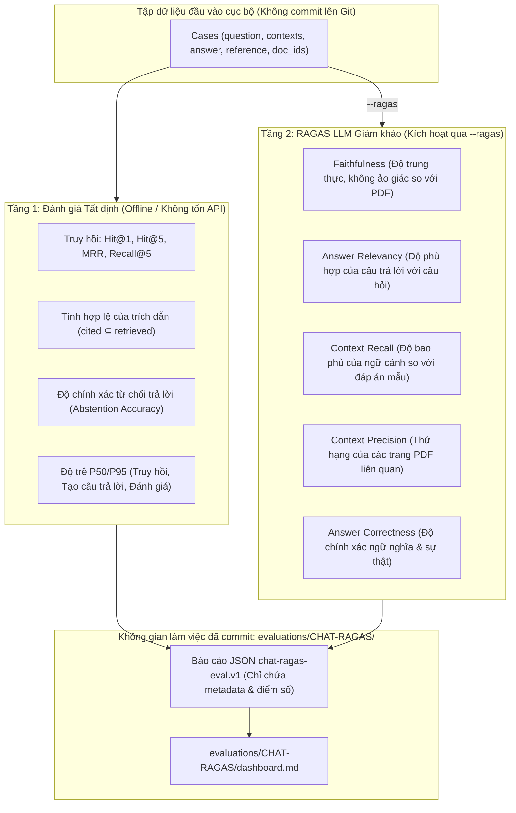

# SPEC — Khung Đánh Giá RAGAS Tối Giản (Chat-RAGAS)

> **Trạng thái:** Đã phê duyệt triển khai  
> **Ngày tạo:** 2026-08-22  
> **Không gian làm việc:** `evaluations/CHAT-RAGAS/` (đổi tên từ `evaluations/CHAT-RAG/`)  
> **Kịch bản thực thi:** `scripts/evaluate_chat_rag.py`  
> **Thẩm quyền kiến trúc:** Khép lại các khoảng trống đánh giá về độ tin cậy tạo câu trả lời (grounding), trích dẫn tài liệu PDF/DOCX và các chỉ số context precision/recall mà không làm lộ dữ liệu nhạy cảm lên Git.

---

## 1. Mục đích & Vấn đề cần giải quyết

Hệ thống Cowork Agent xử lý tác vụ qua hai luồng làm việc chính: **Email RAG** (tạo kế hoạch hành động từ email đơn lượt) và **AI Chat** (trò chuyện đa lượt với tài liệu người dùng tải lên và tri thức công ty).

Các bộ đo đánh giá hiện tại gồm có:
1. **Định tuyến (Routing)** (`evaluate_routing.py`, `evaluate_chat_routing.py`): Đánh giá việc phân loại ý định và kích hoạt công cụ.
2. **Chất lượng truy hồi (Retrieval)** (`evaluate_retrieval.py`): Đo lường Hit@K, MRR, Section Recall/Precision trên cơ chế tìm kiếm lai (hybrid/dense).

Tuy nhiên, **chất lượng truy hồi tốt không đồng nghĩa với câu trả lời được tạo ra là đáng tin cậy**. Bộ truy hồi có thể lấy về đúng các đoạn văn bản (chunks) từ PDF, nhưng mô hình tạo văn bản (generator) vẫn có thể bị ảo giác (hallucination), nhầm lẫn số liệu, bỏ sót các cảnh báo quan trọng hoặc bịa đặt số trang trích dẫn.

Tài liệu này đặc tả một **khung đánh giá RAGAS (Retrieval Augmented Generation Assessment) tối giản và bảo mật dữ liệu** dành cho luồng Chat với tài liệu người dùng (`CHAT-RAGAS`), bao gồm:
- **Kiến trúc đánh giá 2 tầng (Dual-Tier Pipeline):** Tầng 1 là các chỉ số tất định (deterministic) không tốn chi phí API, Tầng 2 là các chỉ số RAGAS sử dụng mô hình LLM làm giám khảo (LLM-as-a-judge).
- **Ranh giới bảo mật nghiêm ngặt (Privacy Boundary):** Câu hỏi gốc, câu trả lời và nội dung trích đoạn từ tài liệu PDF chỉ lưu trữ cục bộ khi chạy thử nghiệm và **tuyệt đối không được commit vào Git**.
- Chuẩn hóa báo cáo baseline chỉ chứa metadata tại thư mục `evaluations/CHAT-RAGAS/baselines/`.

---

## 2. Công nghệ & Thư viện sử dụng

- **Ngôn ngữ & Môi trường:** Python 3.11+ (thực thi qua `uv run`)
- **Khung đánh giá:** `ragas` (v0.2+ / v0.4+) cùng với `datasets` (tùy chọn cài đặt khi cần chạy đánh giá trực tiếp)
- **Nhà cung cấp mô hình giám khảo (Evaluator LLM):**
  - **Google Gemini:** `gemini-2.0-flash` / `gemini-1.5-flash` qua `google-genai` / `ragas.llms.llm_factory` / `LangchainLLMWrapper`
  - **Mistral AI:** `mistral-large-latest` / `mistral-small-latest` & `mistral-embed` qua `mistralai` / `LangchainLLMWrapper(ChatMistralAI)` hoặc LiteLLM (`mistral/...`)
- **Kiểm thử & Chất lượng mã nguồn:** `pytest`, `pytest-xdist`, `ruff`, `mypy` (chế độ strict)
- **Báo cáo & Bảng điều khiển (Dashboard):** Markdown dashboard (`evaluations/CHAT-RAGAS/dashboard.md`) được cập nhật tự động bởi `scripts/build_evaluation_dashboard.py`

---

## 3. Kiến trúc & Các khía cạnh đánh giá

Quy trình đánh giá vận hành qua 2 tầng độc lập:



### 3.1 Tầng 1: Các chỉ số Tất định (Deterministic Metrics)

Tính toán trực tiếp mà không cần gọi LLM, phù hợp chạy kiểm tra hồi quy nhanh trong CI:

| Chỉ số | Mục tiêu | Định nghĩa & Ý nghĩa |
|---|---|---|
| **Hit@1** | $\ge 0.85$ | ID tài liệu hoặc trang mục tiêu xuất hiện ở vị trí đầu tiên của kết quả tìm kiếm |
| **Hit@5** | $\ge 0.95$ | ID tài liệu hoặc trang mục tiêu nằm trong top 5 kết quả tìm kiếm |
| **MRR** | $\ge 0.80$ | $\frac{1}{|Q|} \sum_{i=1}^{|Q|} \frac{1}{\text{rank}_i}$ tính trên kết quả hợp lệ đầu tiên |
| **Recall@5** | $\ge 0.90$ | Tỷ lệ các ID tài liệu/trang mong đợi xuất hiện trong top 5 kết quả |
| **Citation Linkage Valid Rate** | $1.00$ | $\frac{\text{Số case có cited\_ids } \subseteq \text{ retrieved\_ids}}{\text{Tổng số case}}$ (Đảm bảo số trang trích dẫn nằm trong ngữ cảnh truy hồi) |
| **Abstention Accuracy** | $\ge 0.95$ | Độ chính xác khi từ chối trả lời câu hỏi ngoài phạm vi tài liệu ($\text{should\_abstain} == \text{abstained}$) |
| **False-Abstention Rate** | $\le 0.05$ | Tỷ lệ từ chối sai đối với các câu hỏi có thể trả lời được |
| **Latency (p50 / p95)** | Theo dõi | Phân vị độ trễ đo riêng cho 3 giai đoạn: truy hồi, tạo câu trả lời và đánh giá |

### 3.2 Tầng 2: Các chỉ số RAGAS Tối giản (LLM-as-a-Judge)

Kích hoạt thông qua cờ `--ragas`, sử dụng các thành phần đánh giá đơn lượt của RAGAS:

| Chỉ số | Thành phần RAGAS | Dữ liệu yêu cầu | Ý nghĩa & Mục tiêu đánh giá |
|---|---|---|---|
| **Faithfulness** | `Faithfulness(llm=...)` | `answer`, `contexts` | Đo lường độ trung thực của câu trả lời dựa trên các đoạn trích từ PDF (phát hiện ảo giác). Mục tiêu: $\ge 0.90$. |
| **Answer Relevancy** | `AnswerRelevancy(llm=..., embeddings=...)` | `question`, `answer` | Đánh giá mức độ câu trả lời đi thẳng vào trọng tâm câu hỏi của người dùng. Mục tiêu: $\ge 0.85$. |
| **Context Recall** | `ContextRecall(llm=...)` | `contexts`, `reference` | Đo lường mức độ ngữ cảnh truy hồi bao phủ đầy đủ các sự kiện trong câu trả lời chuẩn. Mục tiêu: $\ge 0.85$. |
| **Context Precision** | `ContextPrecision(llm=...)` | `question`, `contexts`, `reference` | Đánh giá mức độ ưu tiên xếp các đoạn trích liên quan lên đầu ngữ cảnh. Mục tiêu: $\ge 0.80$. |
| **Answer Correctness** | `AnswerCorrectness(llm=...)` | `answer`, `reference` | Chỉ số tổng hợp đánh giá độ tương đồng ngữ nghĩa và tính chính xác so với câu trả lời chuẩn. |

---

## 4. Ranh giới Bảo mật & Hợp đồng Dữ liệu

### 4.1 Hợp đồng tập dữ liệu đầu vào cục bộ (TUYỆT ĐỐI KHÔNG COMMIT)

File dữ liệu đầu vào nằm ngoài Git (ví dụ: `var/eval/chat-ragas-dataset.local.json`):

```json
{
  "dataset_version": "local-chat-ragas-v1",
  "provider": "gemini",
  "model": "gemini-2.0-flash",
  "cases": [
    {
      "id": "chat-case-001",
      "expected_document_ids": ["policy-hr-01"],
      "retrieved_document_ids": ["policy-hr-01", "policy-it-03"],
      "citation_document_ids": ["policy-hr-01"],
      "should_abstain": false,
      "abstained": false,
      "latency_ms": {
        "retrieval": 25,
        "generation": 340,
        "evaluator": 520
      },
      "question": "Mức trợ cấp thiết bị làm việc từ xa là bao nhiêu?",
      "answer": "Mức trợ cấp thiết bị làm việc từ xa là 500 USD mỗi năm [policy-hr-01].",
      "contexts": [
        "Nhân viên được thanh toán tối đa 500 USD mỗi năm dương lịch cho thiết bị văn phòng tại nhà theo chính sách làm việc từ xa."
      ],
      "reference_answer": "Nhân viên nhận trợ cấp thiết bị làm việc từ xa 500 USD hàng năm."
    }
  ]
}
```

### 4.2 Cấu trúc báo cáo Baseline đã lọc sạch (`chat-ragas-eval.v1`)

Các file báo cáo commit tại `evaluations/CHAT-RAGAS/baselines/` **phải được lọc bỏ hoàn toàn các trường văn bản gốc**:

```json
{
  "schema_version": "chat-ragas-eval.v1",
  "generated_at": "2026-08-22T05:00:00Z",
  "dataset_version": "local-chat-ragas-v1",
  "provider": "gemini",
  "model": "gemini-2.0-flash",
  "evaluator_model": "gemini-2.0-flash",
  "case_count": 40,
  "metrics": {
    "retrieval": {
      "labeled_case_count": 35,
      "hit_at_1": 0.9143,
      "hit_at_5": 1.0,
      "mrr": 0.9429,
      "recall_at_5": 0.9714
    },
    "citation_linkage": {
      "case_count": 40,
      "valid_rate": 1.0
    },
    "abstention": {
      "labeled_case_count": 5,
      "accuracy": 1.0,
      "false_abstention_count": 0
    },
    "ragas": {
      "evaluated_case_count": 40,
      "faithfulness": 0.9425,
      "answer_relevancy": 0.8910,
      "context_precision": 0.8842,
      "context_recall": 0.9250,
      "answer_correctness": 0.9100
    },
    "latency_ms": {
      "retrieval": {"p50": 22, "p95": 48},
      "generation": {"p50": 310, "p95": 620},
      "evaluator": {"p50": 480, "p95": 910}
    }
  },
  "per_case": [
    {
      "case_id": "chat-case-001",
      "expected_document_count": 1,
      "retrieved_document_count": 2,
      "citation_document_count": 1,
      "hit_at_1": true,
      "hit_at_5": true,
      "reciprocal_rank": 1.0,
      "recall_at_5": 1.0,
      "citation_id_valid": true,
      "should_abstain": false,
      "abstained": false,
      "ragas_scores": {
        "faithfulness": 1.0,
        "answer_relevancy": 0.92,
        "context_precision": 1.0,
        "context_recall": 1.0
      },
      "latency_ms": {
        "retrieval": 25,
        "generation": 340,
        "evaluator": 520
      }
    }
  ]
}
```

---

## 5. Cấu trúc Thư mục Dự án

```text
evaluations/CHAT-RAGAS/
├── README.md                                # Quy định không gian làm việc & hướng dẫn chạy
├── dashboard.md                             # Bảng theo dõi quyết định & chất lượng hiện tại
└── baselines/
    ├── README.md                            # Quy ước lưu trữ báo cáo baseline
    └── chat-rag-eval-YYYY-MM-DD-*.json      # Báo cáo JSON chỉ chứa metadata

scripts/
├── evaluate_chat_rag.py                     # CLI thực thi đánh giá chính
└── build_evaluation_dashboard.py            # Script tổng hợp dashboard (hỗ trợ CHAT-RAGAS)

tests/
├── unit/scripts/
│   └── test_evaluate_chat_rag.py           # Unit tests kiểm tra tính toán & ranh giới bảo mật
└── fixtures/chat_rag/                       # Fixture giả lập phục vụ unit test
    └── sample_chat_ragas_dataset.json
```

---

## 6. Các lệnh Thực thi

### 6.1 Kiểm thử & Đảm bảo chất lượng

```powershell
# Chạy unit test kịch bản đánh giá
uv run pytest tests/unit/scripts/test_evaluate_chat_rag.py -q

# Chạy kiểm thử đa luồng theo chuẩn cấu hình máy
uv run pytest tests/unit/scripts/test_evaluate_chat_rag.py -n 4 --dist loadfile

# Kiểm tra lint và type checking
uv run ruff check scripts/evaluate_chat_rag.py tests/unit/scripts/test_evaluate_chat_rag.py
uv run mypy scripts/evaluate_chat_rag.py
```

### 6.2 Thực thi Đánh giá qua CLI

```powershell
# 1. Đánh giá tất định offline (nhanh, không tốn chi phí API)
uv run python scripts/evaluate_chat_rag.py --input var/eval/chat-ragas.local.json

# 2. Đánh giá RAGAS với mô hình giám khảo (Gemini hoặc Mistral)
uv run python scripts/evaluate_chat_rag.py --input var/eval/chat-ragas.local.json --ragas --evaluator-provider google

# 3. Chỉ định đường dẫn file báo cáo baseline
uv run python scripts/evaluate_chat_rag.py --input var/eval/chat-ragas.local.json --ragas --output evaluations/CHAT-RAGAS/baselines/chat-rag-eval-2026-08-22-synthetic-gemini-2.0-flash.json

# 4. Cập nhật lại dashboard tổng hợp
uv run python scripts/build_evaluation_dashboard.py
```

---

## 7. Cơ chế Tích hợp RAGAS & Nạp cấu hình Mô hình

Để đảm bảo tính nhất quán với cài đặt toàn dự án, mã nguồn nạp trực tiếp tùy chọn model từ `cowork_agent.config` (`GeminiSettings.from_env()`, `MistralSettings.from_env()`, `GeminiEmbeddingSettings.from_env()`):

```python
from typing import Any
from cowork_agent.config import GeminiSettings, GeminiEmbeddingSettings, MistralSettings


def resolve_evaluator_models(
    provider: str = "google",
    model_override: str | None = None,
) -> tuple[str, str]:
    """Resolve evaluator LLM and embedding model IDs from project config preferences."""
    if provider == "mistral":
        try:
            mistral_cfg = MistralSettings.from_env()
            llm_model = model_override or mistral_cfg.model
        except Exception:
            llm_model = model_override or "mistral-large-latest"
        return llm_model, "mistral-embed"

    # Default: Google Gemini
    try:
        gemini_cfg = GeminiSettings.from_env()
        emb_cfg = GeminiEmbeddingSettings.from_env()
        llm_model = model_override or gemini_cfg.model
        emb_model = emb_cfg.model
    except Exception:
        llm_model = model_override or "gemini-2.0-flash"
        emb_model = "gemini-embedding-2"
    return llm_model, emb_model


def init_evaluator(
    provider: str = "google",
    model_override: str | None = None,
) -> tuple[Any, Any]:
    """Initialize Ragas LLM and Embeddings wrappers using config-preferred model IDs."""
    model, emb_model = resolve_evaluator_models(provider, model_override)
    try:
        from ragas.llms import llm_factory
        from ragas.embeddings import embedding_factory
        
        evaluator_llm = llm_factory(model, provider=provider)
        evaluator_embeddings = embedding_factory(provider=provider, model=emb_model)
        return evaluator_llm, evaluator_embeddings
    except (ImportError, AttributeError):
        # Fallback to LangChain wrapper pattern
        from ragas.llms import LangchainLLMWrapper
        from ragas.embeddings import LangchainEmbeddingsWrapper

        if provider == "mistral":
            from langchain_mistralai import ChatMistralAI, MistralAIEmbeddings
            llm = ChatMistralAI(model=model)
            emb = MistralAIEmbeddings(model=emb_model)
            return LangchainLLMWrapper(llm), LangchainEmbeddingsWrapper(emb)
        else:
            from langchain_google_genai import ChatGoogleGenerativeAI, GoogleGenerativeAIEmbeddings
            llm = ChatGoogleGenerativeAI(model=model)
            emb = GoogleGenerativeAIEmbeddings(model=emb_model)
            return LangchainLLMWrapper(llm), LangchainEmbeddingsWrapper(emb)
```

```python
def run_ragas_evaluation(
    samples: list[dict[str, Any]],
    evaluator_llm: Any = None,
    evaluator_embeddings: Any = None,
) -> dict[str, Any]:
    """Execute Ragas evaluation on dataset samples with exception isolation."""
    from datasets import Dataset
    from ragas import evaluate
    from ragas.metrics import (
        faithfulness,
        answer_relevancy,
        context_precision,
        context_recall,
    )

    dataset = Dataset.from_list(samples)
    metrics = [faithfulness, answer_relevancy, context_precision, context_recall]
    
    result = evaluate(
        dataset=dataset,
        metrics=metrics,
        llm=evaluator_llm,
        embeddings=evaluator_embeddings,
        raise_exceptions=False,
    )
    return result
```

---

## 8. Ranh giới Triển khai (Boundaries)

### 8.1 Luôn luôn thực hiện (Always)
- **Lọc sạch dữ liệu nhạy cảm:** Kiểm thử đệ quy phải đảm bảo tuyệt đối không có văn bản câu hỏi, câu trả lời, hay trích đoạn PDF nào bị ghi vào file baseline JSON đã commit.
- **Duy trì khả năng chạy độc lập:** Đảm bảo `evaluate_chat_rag.py` hoạt động bình thường ở chế độ tất định ngay cả khi môi trường chưa cài đặt `ragas` / `datasets`.
- **Ghi nhận độ trễ riêng biệt:** Tách biệt phân vị độ trễ của 3 giai đoạn: truy hồi, tạo sinh và đánh giá.
- **Báo lỗi tường minh khi sai định dạng:** Báo lỗi rõ ràng nếu file dữ liệu đầu vào thiếu trường bắt buộc hoặc sai định dạng ID tài liệu.

### 8.2 Cần hỏi trước (Ask First)
- **Đặt ngưỡng chặn câu trả lời ở runtime:** Không dùng điểm số RAGAS làm chính sách chặn câu trả lời thời gian thực khi chưa qua hiệu chuẩn diện rộng.
- **Thay đổi nhà cung cấp mô hình giám khảo:** Thay đổi mặc định giữa Gemini và Mistral cần được thống nhất về chi phí và thời gian chạy.
- **Đổi cấu trúc thư mục lưu baseline:** Giữ toàn bộ báo cáo tại `evaluations/CHAT-RAGAS/baselines/`.

### 8.3 Tuyệt đối không làm (Never)
- **Tuyệt đối không commit dữ liệu người dùng:** Chỉ các fixture giả lập trong `tests/fixtures/chat_rag/` mới được phép chứa văn bản mẫu.
- **Không nhầm lẫn các tầng đo lường:** Không lấy độ chính xác định tuyến hay điểm tương đồng vector để khẳng định câu trả lời không bị ảo giác.
- **Không bỏ qua các case lỗi:** Khi `raise_exceptions=False` trả về NaN, phải ghi nhận rõ ràng số lượng case bị lỗi trong báo cáo.

---

## 9. Danh mục Công việc Triển khai (Checklist)

### Giai đoạn 1: Chuyển đổi Không gian làm việc (Đã hoàn thành)
- [x] Tạo cấu trúc thư mục `evaluations/CHAT-RAGAS/` (`README.md`, `dashboard.md`, `baselines/README.md`).
- [x] Dọn dẹp không gian cũ `evaluations/CHAT-RAG/`.
- [x] Đồng bộ các liên kết trong `evaluations/README.md` và `evaluations/HARNESS-GUIDE.md`.
- [x] Cập nhật đường dẫn mặc định `DEFAULT_OUTPUT_DIR` trong `scripts/evaluate_chat_rag.py`.
- [x] Cập nhật unit test trong `tests/unit/scripts/test_evaluate_chat_rag.py`.

### Giai đoạn 2: Nâng cấp Kịch bản Đánh giá (`scripts/evaluate_chat_rag.py`)
- [ ] Bổ sung tham số dòng lệnh CLI:
  - `--evaluator-provider` (`google` [mặc định], `mistral`)
  - `--evaluator-model` (nạp từ `config.py`, cho phép ghi đè qua CLI)
  - `--max-workers` (giới hạn số luồng gọi mô hình giám khảo đồng thời)
  - `--save-per-case-scores` (bật/tắt lưu điểm số chi tiết từng case vào báo cáo)
- [ ] Cập nhật hàm `run_ragas()` hỗ trợ nạp mô hình từ `cowork_agent.config` và bao bọc wrapper chuẩn.
- [ ] Chuyển đổi định dạng dữ liệu sang `SingleTurnSample` / `EvaluationDataset`.
- [ ] Thiết lập cơ chế cách ly lỗi (`raise_exceptions=False`) và thống kê số case đánh giá thành công/thất bại.
- [ ] Đảm bảo đầy đủ type annotations và vượt qua kiểm tra nghiêm ngặt của `mypy`.

### Giai đoạn 3: Bộ Fixture & Unit Test
- [ ] Tạo file fixture giả lập `tests/fixtures/chat_rag/sample_chat_ragas_dataset.json`.
- [ ] Viết unit test xác thực kết quả đánh giá giả lập RAGAS với các trường `faithfulness`, `answer_relevancy`, `context_precision`, `context_recall`.
- [ ] Viết unit test đệ quy xác thực không có trường văn bản gốc nào lọt vào báo cáo đầu ra.
- [ ] Viết unit test xử lý thông báo lỗi thân thiện khi chưa cài đặt thư viện RAGAS.
- [ ] Chạy kiểm thử toàn diện: `uv run pytest tests/unit/scripts/test_evaluate_chat_rag.py -n 4 --dist loadfile`.

### Giai đoạn 4: Tích hợp Bảng điều khiển (`scripts/build_evaluation_dashboard.py`)
- [ ] Nâng cấp `build_evaluation_dashboard.py` để quét các file JSON trong `evaluations/CHAT-RAGAS/baselines/`.
- [ ] Hiển thị bảng Markdown tóm tắt lịch sử đánh giá Chat-RAGAS (Hit@1, MRR, Faithfulness, Relevancy, Precision, Recall, Latency).
- [ ] Tự động cập nhật nội dung file `evaluations/CHAT-RAGAS/dashboard.md`.

### Giai đoạn 5: Kiểm tra Toàn diện & Xác thực Thực tế
- [ ] Chạy toàn bộ test suite: `uv run pytest -q`.
- [ ] Kiểm tra linter: `uv run ruff check scripts/evaluate_chat_rag.py tests/unit/scripts/test_evaluate_chat_rag.py`.
- [ ] Kiểm tra kiểu dữ liệu: `uv run mypy src scripts/evaluate_chat_rag.py`.
- [ ] Chạy thử nghiệm offline với fixture mẫu và kiểm tra báo cáo JSON đảm bảo 100% là metadata.
