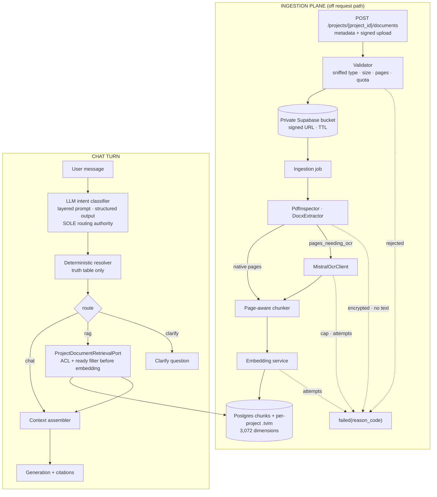

# Technical Spec — Chat with User Documents ("Chat with the PDF")

| Trường | Giá trị |
|---|---|
| Trạng thái | Accepted — implementation-aligned |
| Ngày | 2026-08-13 |
| Nguồn yêu cầu | [PRD-v3](../prds/PRD-v3-chat-with-user-documents.md), `docs/references/user_preference.md` |
| Thẩm quyền kiến trúc | [ADR-007](../adr/ADR-007-project-scoped-classifier-gated-user-documents.md), [ADR-008](../adr/ADR-008-turbovec-project-document-plane.md), [TARGET-ARCHITECTURE §21](../../docs/architectures/TARGET-ARCHITECTURE.md) |
| Thay thế | Baseline user-wide/no-Project của SPEC v3.0 |
| Baseline kỹ thuật | Python 3.11+, FastAPI, PostgreSQL, Supabase Storage, Turbovec `.tvim`, Gemini embeddings |
| Feature owner | AI Chat Controller (`feature: ai_chat`) |

> ADR-007 supersedes every user-wide/no-Project statement in earlier revisions. This
> revision is Project-scoped throughout: all document catalog, ingestion, retrieval,
> deletion and citation operations require `project_id`; every chat session is bound
> to exactly one Project.

---

## 1. Mục đích

Biến yêu cầu trong `user_preference.md` thành thiết kế triển khai được: người
dùng tải PDF/DOCX lên, hỏi trong chat, hệ thống **tự quyết định** có cần truy hồi
tài liệu hay không, rồi trả lời có trích dẫn tới từng trang.

Hai thành phần kỹ thuật chính:

1. **Project document RAG plane** — một mặt phẳng truy hồi ngữ nghĩa riêng chứa tài liệu
   của người dùng, khoá theo `workspace_id` + `user_id` + `project_id` + `document_id`.
2. **Intent classifier + deterministic resolver** — cổng quyết định `needs_rag` /
   `needs_tool`, thay cho cơ chế cue-phrase hiện tại.

## 2. Quyết định Project-scoped được chấp nhận

| Chủ đề | Baseline cũ | Contract hiện hành |
|---|---|---|
| Container | Corpus chung theo user | **Project bắt buộc**; documents và chat sessions cùng scope Project |
| Ownership | `tenant/user/document` | `workspace/user/project/document`; mọi ID ngoại scope trả 404 |
| Upload | Multipart qua API | Metadata initiation → signed Supabase upload URL → explicit `/complete` |
| Retrieval | User-wide | Project-scoped, optional `document_ids`, classifier-gated |
| Vector visibility | Một trạng thái payload | Two-phase publish: `indexing` khi upsert, `ready` chỉ sau khi đủ chunk |
| Feature control | UI/API độc lập | `USER_DOCUMENTS_ENABLED` khóa đồng thời backend document routes và frontend surface |

Project là ranh giới bền vững giúp người dùng giữ các bộ tài liệu và lịch sử chat
không liên quan tách biệt. Company RAG và Project-document RAG là hai plane riêng;
không plane nào là fallback của plane kia.

## 3. Phạm vi

Trong phạm vi:

- Upload, validate, extract (native + OCR), chunk theo trang, embed, index.
- Postgres `project_document_chunks` + `.tvim` theo project, ACL-first (ADR-008).
- Intent classifier phân tầng làm cổng định tuyến duy nhất, resolver tất định, 5 route.
- Graph orchestration cho lượt chat (xem §10, quyết định D-01).
- Context assembly có section `user_document_evidence` và thứ tự ưu tiên.
- API tài liệu, migration PostgreSQL, retention 30 ngày, xoá lan truyền.
- Telemetry metadata-only, safety counters, bộ đo classifier.

Ngoài phạm vi: xem §17.

## 4. Kiến trúc tính năng



## 5. Cấu trúc module

> The tree retained below describes the original planned decomposition and is no
> longer normative. The implementation-aligned ownership is:

```text
src/cowork_agent/
├── api/projects.py                              # Project + document HTTP routes
├── domain/project_documents.py                  # query/response and evidence contracts
├── features/ai_chat/intent/                     # classifier, prompt, resolver/service
├── integrations/knowledge_ingestion/
│   └── project_documents.py                     # PDF/DOCX extraction
├── integrations/rag/
│   ├── markdown_chunking.py                     # shared deterministic chunker
│   ├── project_documents.py                     # hybrid store + canonical retriever
│   └── project_index.py                         # per-project Turbovec .tvim
├── integrations/storage/supabase.py             # private signed upload/download
├── orchestration/project_document_worker.py     # ingestion + durable cleanup workers
└── persistence/
    ├── migrations/012_project_document_chunks.sql
    ├── repositories/projects.py                 # Project/document/job source of truth
    └── repositories/project_document_chunks.py  # chunk text + FTS allowlist
```

The following legacy map is historical context only:

```text
src/cowork_agent/
├── domain/
│   ├── _chat_contracts_memory.py       # SỬA: UserDocumentRead/Query, MemoryReadOptions.user_document
│   ├── _chat_contracts_common.py       # SỬA: MemoryCitationType/DocumentScope
│   └── user_document_contracts.py      # MỚI: UserDocument, chunk, retrieval response, IntentDecision
├── features/
│   ├── ai_chat/
│   │   ├── intent/
│   │   │   ├── __init__.py             # MỚI
│   │   │   ├── prompt.py               # MỚI: template phân tầng + prompt_version
│   │   │   ├── classifier.py           # MỚI: gọi LLM + parse structured output
│   │   │   └── resolver.py             # MỚI: bảng chân trị → ChatRoute
│   │   ├── graph/
│   │   │   ├── __init__.py             # MỚI
│   │   │   ├── state.py                # MỚI: ChatGraphState (lean)
│   │   │   ├── nodes.py                # MỚI: node functions thuần, không phụ thuộc framework
│   │   │   └── runner.py               # MỚI: lắp graph (xem D-01)
│   │   ├── generation_context.py       # SỬA: USER_DOCUMENT_EVIDENCE + precedence
│   │   ├── retrieval_policy.py         # SỬA: cue-only → classifier-driven
│   │   ├── controller.py               # SỬA: gọi graph runner
│   │   ├── memory_gateway.py           # SỬA: đọc plane tài liệu người dùng
│   │   └── ports.py                    # SỬA: IntentClassifierPort, UserDocumentRetrievalPort
│   └── user_documents/                 # MỚI
│       ├── __init__.py
│       ├── ports.py                    # ObjectStorePort, OcrPort, IngestionQueuePort, DocumentRepositoryPort
│       ├── validation.py               # sniff media type, size, page, quota
│       ├── chunking.py                 # chunk theo trang
│       ├── ingestion.py                # UserDocumentIngestionService (state machine)
│       └── retention.py                # expires_at, lọc hết hạn, purge
├── integrations/
│   ├── knowledge_ingestion/
│   │   └── mistral_ocr.py              # MỚI: MistralOcrClient (lấp chỗ trống hiện tại)
│   └── rag/
│       └── user_documents.py           # MỚI: QdrantUserDocumentMemory
├── persistence/
│   ├── migrations/005_user_documents.sql (+ .down.sql)   # MỚI
│   └── repositories/                   # SỬA: UserDocumentRepository (local + postgres)
└── api/
    └── documents.py                    # MỚI: router tài liệu
```

Ràng buộc tái sử dụng: `PdfInspector`, `DocxExtractor`, `PdfInspection`,
`OcrPage` được dùng lại nguyên trạng. `KnowledgeIngestionService` **không** được
sửa — nó là CLI của quản trị viên cho company corpus, vòng đời khác.

## 6. Hợp đồng dữ liệu

### 6.1 UserDocument

```yaml
document_id: string        # opaque UUID
project_id: string
workspace_id: string
user_id: string

filename: string
media_type: application/pdf | application/vnd.openxmlformats-officedocument.wordprocessingml.document
byte_size: integer
page_count: integer | null
ocr_page_count: integer | null
content_sha256: string

status: received | extracting | indexing | ready | failed | deleting | deleted
error_code: string | null
chunk_count: integer | null

created_at: datetime
updated_at: datetime
expires_at: datetime       # created_at + USER_DOCUMENTS_RETENTION_DAYS
```

Máy trạng thái:

```text
received → extracting → indexing → ready
extracting | indexing → failed(error_code)
received | extracting | indexing | ready | failed → deleting → deleted
```

Deduplication key là `(project_id, content_sha256)` cho document chưa bị xoá;
upload lại đúng byte trong cùng Project trả bản ghi hiện có. `document_id` vẫn là
opaque UUID và không mã hoá filename hoặc document text.

Reason codes:

```text
file_too_large · pdf_page_limit_exceeded · empty_extraction
unsupported_media_type · encrypted_document
ocr_page_limit_exceeded · ocr_failed
quota_exceeded · embedding_unavailable · index_unavailable
```

### 6.2 UserDocumentChunk

```yaml
chunk_id: string           # document_id + ordinal
document_id: string
project_id: string
workspace_id: string
user_id: string
ordinal: integer
page_start: integer
page_end: integer
section: string | null
text: string
```

### 6.3 IntentDecision — output của classifier

```yaml
intent: chat | knowledge_query | action_request
needs_rag: boolean
needs_tool: boolean
tool_name: string | null
needs_clarification: boolean
retrieval_query: string | null
confidence: number          # 0.0..1.0
reason_codes:
  - general_chat
  - user_document_required
  - explicit_document_reference
  - external_action_requested
  - missing_information
```

Ràng buộc validate:

- `needs_rag = true` **bắt buộc** kèm `retrieval_query` không rỗng, ≤
  `MAX_RETRIEVAL_QUERY_LENGTH`.
- `needs_tool = false` bắt buộc kèm `tool_name = null`.
- Ở MVP, `needs_tool = true` bị resolver hạ xuống `false` và ghi counter
  `chat.intent.tool_requested_but_disabled`.
- `intent` chỉ là nhãn quan sát; **không** dùng để định tuyến. Định tuyến chỉ
  dựa vào ba boolean.

### 6.4 ChatRoute — output của resolver

```python
class ChatRoute(StrEnum):
    CHAT = "chat"
    RAG = "rag"
    TOOL = "tool"
    RAG_TOOL = "rag_tool"
    CLARIFY = "clarify"
```

Bảng chân trị (thứ tự đánh giá từ trên xuống):

| Điều kiện | Route |
|---|---|
| `needs_clarification` | `CLARIFY` |
| `needs_rag and needs_tool` | `RAG_TOOL` |
| `needs_rag` | `RAG` |
| `needs_tool` | `TOOL` |
| còn lại | `CHAT` |

MVP hiện thực `CHAT`, `RAG`, `CLARIFY`. `TOOL` và `RAG_TOOL` có trong enum và
trong test bảng chân trị, nhưng node thực thi chưa tồn tại; resolver không bao
giờ trả về chúng khi `USER_DOCUMENTS_TOOL_AXIS_ENABLED=false`.

Cổng chặn cứng, chạy **sau** resolver, **trước** node retrieve: nếu người dùng
không có tài liệu `ready` nào thì `RAG → CHAT`, ghi
`reason_codes += no_ready_documents`. Không gọi embedding, không mở `.tvim`.

### 6.5 UserDocumentQuery / Response

Query kế thừa `_QueryScopedMemoryRead` như `SemanticMemoryQuery`, với fixed
filter riêng:

```python
class UserDocumentQuery(_QueryScopedMemoryRead):
    _max_items = MAX_USER_DOCUMENT_RETRIEVAL_ITEMS  # 8
    _fixed_filter_name = "document_scope"
    _fixed_filter_value = "user_document"
```

`MemoryReadOptions` nhận thêm một trường, có mặc định để không phá caller cũ:

```python
user_document: UserDocumentRead | UserDocumentQuery = UserDocumentRead(enabled=False)
```

Response:

```yaml
chunks:
  - chunk_id: string
    document_id: string
    document_title: string
    section: string | null
    page_start: integer
    page_end: integer
    text: string
    relevance_score: number
    rerank_score: number | null

retrieval_status: success | no_results | timeout | authorization_denied | partial
degraded: boolean
latency_ms: integer
```

### 6.6 Citation

`EpisodeCitation` nhận thêm ba trường, mặc định giữ nguyên hành vi cũ:

```yaml
citation_scope: company | user_document   # default company
page_start: integer | null
page_end: integer | null
```

Episode vẫn chỉ lưu **toạ độ**. Văn bản chunk, văn bản trang đã trích xuất và
transcript đầy đủ tiếp tục bị cấm khỏi episode, log, telemetry, fixture.

## 7. Pipeline ingestion

```text
POST /projects/{project_id}/documents (202)
→ authorize     : VerifiedPrincipal owns Project; feature flag enabled
→ register      : filename, media_type, byte_size, sha256; enforce Project quotas
→ signed upload : browser PUT trực tiếp vào private Supabase object
→ complete      : verify object exists; enqueue durable PostgreSQL job
→ extracting    : PdfInspector.inspect | DocxExtractor.extract
                  pages_needing_ocr → MistralOcrClient, giới hạn max_ocr_pages
                  trang native không bao giờ OCR lại
→ indexing      : shared Markdown chunker → Gemini embed 3.072d
                  → persist chunks in Postgres then add vectors to the project .tvim
→ publish       : PostgreSQL document_status=ready (allowlist gate)
→ ready         : guarded PostgreSQL transition + counts; nếu transition fail thì xoá chunks/vectors
```

Quy tắc:

- Validate dựa trên **content sniffing**, không dựa vào phần mở rộng tên file.
- `PdfInspector` shell ra lệnh cục bộ ⇒ extraction **chỉ** chạy trong job, không
  bao giờ trên request path.
- Đầu ra trích xuất rỗng hoặc một phần **không bao giờ** được index; document
  chuyển `failed(empty_extraction)`.
- Vượt `max_ocr_pages` → `failed(ocr_page_limit_exceeded)`. Provider lỗi sau
  `max_attempts` → `failed(ocr_failed)`.
- Chunk theo trang: đọc marker `<!-- Page N -->` do extractor sinh ra, cắt theo
  ranh giới đoạn văn dưới ngưỡng kích thước hiện hành, mỗi chunk mang
  `page_start` / `page_end`. Chunk không được bắc cầu qua ranh giới trang trừ
  khi một đoạn văn liên tục vắt qua trang, khi đó `page_end > page_start`.

`MistralOcrClient` lấp đúng chỗ trống `mistral_not_configured` hiện có tại
`integrations/knowledge_ingestion/service.py:130`, dùng lại
`KnowledgeIngestionSettings` (`MISTRAL_API_KEY`, `KNOWLEDGE_INGEST_MODEL`,
`KNOWLEDGE_INGEST_TIMEOUT_SECONDS`, `KNOWLEDGE_INGEST_MAX_ATTEMPTS`,
`KNOWLEDGE_INGEST_MAX_OCR_PAGES`). Client là adapter thuần: nhận ảnh trang, trả
`tuple[OcrPage, ...]`, không ghi file, không giữ trạng thái.

## 8. Lưu trữ hybrid (Postgres + Turbovec) và ACL

Plane tài liệu dự án không dùng Qdrant. Văn bản chunk, toạ độ trang và ACL nằm
trong Postgres (`project_document_chunks`); chân dense là một file `.tvim`
Turbovec 4-bit **theo từng project**, cache cục bộ tại
`USER_DOCUMENTS_INDEX_ROOT` (mặc định `var/project-indexes`). Bản bền nằm trên
Supabase Storage. Company corpus (`QDRANT_COLLECTION=company_knowledge`) không
tham gia plane này.

Mỗi hàng chunk mang:

```yaml
workspace_id · user_id · project_id · document_id · chunk_id
filename · section · page_start · page_end · text
vector_id          # ID ngoài của Turbovec, ổn định khi ingest lại
fts                # tsvector sinh tự động, xếp hạng bằng ts_rank_cd
```

Sẵn sàng để retrieval khi `document_status='ready'` và `expires_at > now`.

**ACL-first**: truy vấn SQL (`workspace_id`, `user_id`, `project_id`, optional
`document_ids`, `document_status=ready`, `expires_at > now`) chạy **trước khi**
query được embed, và trả về allowlist `vector_id[]` cho chân dense. Retriever
canonical đọc lại catalogue ready trên PostgreSQL và loại mọi evidence vừa
chuyển sang `deleting`, `deleted` hoặc hết hạn. Đây là hàng rào bắt buộc cho
race deletion giữa authorization và I/O chỉ mục.

Chunk mới không vào allowlist cho đến khi worker ghi xong văn bản + vector và
PostgreSQL chuyển document sang `ready`. File `.tvim` theo project khiến rò
chéo tenant trở nên bất khả về mặt cấu trúc; năm điều kiện ACL còn lại nằm
trong `WHERE` SQL.

Không có fallback in-repo cho plane này. Chỉ mục hoặc Postgres chết ⇒ trả kết
quả rỗng với `degraded: true` / `reason_code=index_unavailable`, không thay
thế bằng bằng chứng company-plane.

## 9. Router — classifier là thẩm quyền định tuyến duy nhất

### 9.1 Nguyên tắc

Định tuyến tập trung ở **một lời gọi LLM structured output** mỗi lượt. Không có
lớp keyword/regex nào được phép kết luận thay nó, kể cả kết luận "có".

Lý do: cue chỉ nhìn thấy chuỗi ký tự, còn quyết định thật là một phán đoán về
**phụ thuộc tri thức**. Cùng một từ "PDF" xuất hiện trong câu cần truy hồi và
trong câu không cần. Bất kỳ lớp rules nào đủ mạnh để bắt đúng trường hợp bẫy thì
cũng đã là một bộ phân loại — chỉ là bộ phân loại tệ hơn, không kiểm thử được
bằng bộ fixture gán nhãn, và không cải thiện được bằng prompt.

Hệ quả: trường hợp bẫy và các trường hợp mơ hồ được giải bằng **prompt phân
tầng** (§9.2), không bằng danh sách cụm từ.

### 9.2 Prompt phân tầng

Prompt được lắp theo năm tầng, thứ tự cố định, mỗi tầng có một việc:

**Tầng 1 — Nguyên tắc quyết định.** Một câu hỏi duy nhất, không mở rộng:

> Would the quality or correctness of the requested answer depend on retrieving
> information from the user's own documents?

**Tầng 2 — Quy tắc ưu tiên khi tín hiệu xung đột.** Đây là nơi giải trường hợp
bẫy, xếp theo thứ tự áp dụng:

1. **Chủ thể của yêu cầu cuối cùng quyết định.** Chỉ mệnh lệnh hoặc câu hỏi cuối
   cùng của người dùng mới định nghĩa nhiệm vụ. Câu dẫn, lời kể, bối cảnh không
   định nghĩa nhiệm vụ.
2. **Nhắc tới tài liệu ≠ cần tài liệu.** Nếu tài liệu được nhắc tới nhưng không
   phải là đối tượng của yêu cầu cuối cùng thì `needs_rag = false`.
   → *"I uploaded a PDF yesterday. Anyway, explain Python decorators."* = `false`.
3. **Dấu chuyển chủ đề đặt lại chủ thể** (`anyway`, `by the way`, `btw`,
   `nhân tiện`, `à mà`, `quay lại`, `chuyển sang`).
4. **Chỉ định trực chỉ không có tiền lệ trong hội thoại thì trỏ về tài liệu.**
   *"What does it say about checkpointing?"* khi hội thoại chưa nêu chủ đề nào =
   `needs_rag = true`.
5. **Câu hỏi hồi tưởng mơ hồ ưu tiên truy hồi.** *"What were the requirements
   again?"* = `true`, vì trả lời sai do thiếu bằng chứng tốn kém hơn một lần truy
   hồi thừa.
6. **Kiến thức chung, định nghĩa, khái niệm phổ quát** = `false`, trừ khi người
   dùng hỏi tài liệu của họ nói gì về khái niệm đó.
7. **Khi vẫn không quyết được và người dùng có tài liệu `ready`** = `true`. Quy
   tắc chốt, khớp với chính sách ưu tiên recall ở §9.4.

**Tầng 3 — Bằng chứng có giới hạn.** Classifier chỉ được nhìn: câu hỏi hiện tại,
tối đa `_MAX_ACTIVE_SESSION_TURNS = 8` lượt gần nhất, và **danh sách tiêu đề tài
liệu `ready`** (chỉ tên, không nội dung, không chunk). Tiêu đề là thứ cho phép
phân biệt "tài liệu của tôi có nói không" với kiến thức chung mà không tốn một
vòng truy hồi.

**Tầng 4 — Ví dụ hiệu chuẩn.** Bốn nhóm, cân bằng số lượng, phản chiếu đúng bốn
nhóm trong bộ fixture ở §17: obvious RAG · obvious chat · ambiguous · distractor
(nhắc tài liệu nhưng không cần). Ví dụ trong prompt và ví dụ trong fixture
**không được trùng nhau** — nếu trùng thì bộ đo chỉ đo trí nhớ của prompt.

**Tầng 5 — Schema đầu ra và ràng buộc.** `IntentDecision` ở §6.3, kèm yêu cầu
`reason_codes` phải giải thích được quyết định.

Toàn bộ prompt nằm trong repo dưới dạng template có `prompt_version`. Đổi prompt
là một thay đổi có kiểm soát: phải chạy lại bộ fixture §17 và không được tụt
ngưỡng §15.

### 9.3 Các lớp tất định còn lại (không phải định tuyến)

Ba cơ chế tất định vẫn tồn tại, nhưng **chỉ được phép thu hẹp năng lực, không bao
giờ được tự sinh ra một route**:

| Cơ chế | Tác dụng |
|---|---|
| Precondition gate | không có tài liệu `ready` ⇒ `RAG → CHAT`, không gọi embedding/index |
| Schema validation | output sai schema ⇒ kích hoạt §9.4 |
| Tool axis downgrade | `needs_tool = true` khi trục tool tắt ⇒ hạ về `false` |

### 9.4 Chính sách lỗi

```text
Classifier timeout hoặc schema không hợp lệ
→ retry một lần
→ vẫn hỏng: fail-open sang needs_rag = true (khi user có tài liệu ready)
→ ghi reason_codes += classifier_unavailable
```

Fail-open sang RAG là có chủ ý: sai sót nguy hiểm nhất là bỏ sót truy hồi và trả
lời không có bằng chứng. Với trục tool thì ngược lại — mọi lỗi đều hạ
`needs_tool` về `false` (fail-closed), vì hành động sai tốn kém hơn.

Nguyên tắc: **RAG routing ưu tiên recall, tool routing ưu tiên precision.**

## 10. Graph orchestration

### 10.1 State (lean)

```python
class ChatGraphState(TypedDict):
    messages: Annotated[list[ChatTurn], add]

    tenant_id: str
    user_id: str
    session_id: str
    query: str

    needs_rag: bool
    needs_tool: bool
    needs_clarification: bool
    route: str | None
    retrieval_query: str | None

    citation_ids: Annotated[list[str], add]
    errors: Annotated[list[str], add]
    final_answer: str | None
```

Cấm tuyệt đối trong state: `pdf_bytes`, toàn văn tài liệu, danh sách chunk, prompt
đã lắp. Chunk truy hồi thuộc mặt phẳng ngữ cảnh của một lượt, không thuộc state
bền vững. Vi phạm làm checkpoint phình và lộ nội dung tài liệu vào nơi lưu trữ.
Có một test khẳng định mọi giá trị trong state đều là scalar, id, hoặc danh sách
id.

### 10.2 Node và edge

```text
classify → (conditional) → retrieve → assemble → generate → persist
                        ↘ assemble (route=chat)
                        ↘ clarify (route=clarify)
```

| Node | Trách nhiệm | Không được làm |
|---|---|---|
| `classify` | LLM classifier → resolver → 3 boolean + route | gọi hybrid retrieve |
| `retrieve` | `UserDocumentRetrievalPort` với ACL filter | quyết định route |
| `assemble` | dựng `GenerationContext` có section mới | gọi LLM sinh câu trả lời |
| `generate` | stream reply + citation | ghi bộ nhớ |
| `clarify` | phát một câu hỏi làm rõ, kết thúc lượt | truy hồi |
| `persist` | ghi turn, chat summary, episode khi được yêu cầu rõ ràng | ghi văn bản tài liệu |

Node là **hàm thuần**, nhận state và các port, trả về state delta. Chúng phải
unit-test được mà không cần dựng graph.

### 10.3 D-01 — Quyết định cần xác nhận: LangGraph

`user_preference.md` §7 dùng cú pháp reducer của LangGraph
(`Annotated[list[Message], add]`), nên SPEC này **mặc định chọn LangGraph** làm
lớp lắp graph, thêm dependency `langgraph`, đặt trong `graph/runner.py`.

Ràng buộc để chi phí đảo ngược thấp:

- `state.py` và `nodes.py` không import `langgraph`.
- `runner.py` là module duy nhất biết tới framework.
- `ChatController` hiện tại giữ nguyên trách nhiệm HTTP/SSE và gọi runner; không
  viết lại controller.
- Checkpointer của LangGraph **không** được dùng làm nguồn sự thật cho session
  buffer — `ChatSessionBufferPort` vẫn là nơi lưu trạng thái phiên. Checkpointer
  nếu bật chỉ phục vụ debug trong môi trường dev.

Nếu bạn muốn tránh dependency mới, chỉ `runner.py` bị thay bằng một vòng lặp
tất định ~40 dòng; phần còn lại của SPEC không đổi.

## 11. Context assembly

`ContextSource` nhận thêm `USER_DOCUMENT_EVIDENCE = "user_document_evidence"`.
`GenerationContext` nhận thêm `user_document_evidence: LabeledSection[...] | None`.

Thứ tự ưu tiên khi xung đột:

```text
current_instruction
> user_document_evidence
> current_company_evidence
> stored_preference
> advisory_episode
```

Phạm vi thẩm quyền, vì thứ hạng không phải toàn bộ quy tắc:

- Tài liệu người dùng có thẩm quyền về **nội dung của chính nó** — nó nói gì, ở
  trang nào.
- Company RAG (nếu bật) giữ thẩm quyền về **quy trình và chính sách công ty**.
- Khi hai nguồn mâu thuẫn, cả hai được nêu kèm trích dẫn và mâu thuẫn được nói
  rõ. Không im lặng chọn bên thứ hạng cao hơn.
- Khi không chunk nào vượt ngưỡng điểm, câu trả lời phải nói rằng tài liệu không
  chứa thông tin đó và liệt kê phần còn thiếu. Bịa từ kiến thức tham số là lỗi
  validation.

Company RAG trong chat được đưa sau cờ `CHAT_COMPANY_RAG_ENABLED`, mặc định
`false` ở MVP. Đường dẫn cue-phrase hiện tại trong `retrieval_policy.py` được giữ
lại nhưng chỉ chạy khi cờ bật.

## 12. API

```text
GET    /v1/cowork/chat/document-health
POST   /v1/cowork/chat/projects
GET    /v1/cowork/chat/projects
POST   /v1/cowork/chat/projects/{project_id}/documents
GET    /v1/cowork/chat/projects/{project_id}/documents
GET    /v1/cowork/chat/projects/{project_id}/documents/{document_id}
POST   /v1/cowork/chat/projects/{project_id}/documents/{document_id}/complete
GET    /v1/cowork/chat/projects/{project_id}/documents/{document_id}/download
DELETE /v1/cowork/chat/projects/{project_id}/documents/{document_id}
DELETE /v1/cowork/chat/projects/{project_id}
```

- Cùng prefix `/v1/cowork/chat` và cùng `VerifiedPrincipal` với router chat hiện
  có; không có `user_id` trong query param.
- Upload initiation nhận JSON metadata và trả short-lived signed URL; browser PUT
  byte trực tiếp vào private bucket rồi gọi `/complete`. Storage credential không
  bao giờ đi qua frontend.
- Khi `USER_DOCUMENTS_ENABLED=false`, mọi route `/documents...` trả `503` trước
  identity/repository/storage I/O. Project/session/chat routes vẫn hoạt động.
- Frontend đọc `/document-health`, fail closed trong lúc chưa xác định trạng thái,
  ẩn upload và panel khi feature tắt.
- Status polling không stream, có deadline mặc định 5 phút và `AbortSignal`.
  Gỡ attachment, đổi Project hoặc unmount phải huỷ polling và request đang chạy.
  Panel cho phép xoá document đang `received`, `extracting` hoặc `indexing`.
- **Không thêm SSE event type mới.** Bằng chứng tài liệu được công bố qua
  `memory_citation` sẵn có, phân biệt bằng `citation_scope`.
- Không có endpoint session mới: session hiện tại không đổi hình dạng.

## 13. Persistence

Canonical schema nằm ở `009_canonical_project_documents.sql`: `projects`,
`project_documents`, durable ingestion jobs và durable cleanup jobs. PostgreSQL
là source of truth cho ownership/status/counts; source bytes nằm trong private
Supabase Storage; extracted chunk text nằm ở `project_document_chunks` (ADR-008).

Khối `005_user_documents.sql` dưới đây là historical draft, đã bị ADR-007 và
migration 009 thay thế; không được dùng để triển khai mới:

```sql
CREATE TABLE user_documents (
    document_id      TEXT PRIMARY KEY,
    tenant_id        TEXT NOT NULL,
    user_id          TEXT NOT NULL,
    filename         TEXT NOT NULL,
    media_type       TEXT NOT NULL,
    byte_size        BIGINT NOT NULL,
    content_sha256   TEXT NOT NULL,
    page_count       INTEGER,
    ocr_page_count   INTEGER,
    chunk_count      INTEGER,
    status           TEXT NOT NULL,
    reason_code      TEXT,
    created_at       TIMESTAMPTZ NOT NULL,
    updated_at       TIMESTAMPTZ NOT NULL,
    expires_at       TIMESTAMPTZ NOT NULL
);
CREATE UNIQUE INDEX user_documents_content_key
    ON user_documents (tenant_id, user_id, content_sha256);
CREATE INDEX user_documents_owner_status
    ON user_documents (tenant_id, user_id, status);
CREATE INDEX user_documents_expiry ON user_documents (expires_at);
```

Bảng metadata không lưu văn bản tài liệu. Văn bản gốc nằm ở object store có mã
hoá; văn bản chunk nằm ở `project_document_chunks`; vector nằm ở `.tvim` theo
project (ADR-008).

## 14. Cấu hình

```text
USER_DOCUMENTS_ENABLED=true
USER_DOCUMENTS_INDEX_ROOT=var/project-indexes
USER_DOCUMENTS_MAX_FILE_BYTES=26214400
USER_DOCUMENTS_MAX_PAGES=100
USER_DOCUMENTS_MAX_DOCUMENTS_PER_PROJECT=50
USER_DOCUMENTS_MAX_PROJECT_BYTES=524288000
USER_DOCUMENTS_RETENTION_DAYS=30
USER_DOCUMENTS_TOP_K=8
USER_DOCUMENTS_MIN_SCORE=0.6
USER_DOCUMENTS_RETRIEVAL_TIMEOUT_MS=3000
USER_DOCUMENTS_INGESTION_STREAM=cowork:project-document-ingestion
USER_DOCUMENTS_TOOL_AXIS_ENABLED=false

CHAT_INTENT_CLASSIFIER_ENABLED=true
CHAT_INTENT_CLASSIFIER_MODEL=<provider model id>
CHAT_INTENT_CLASSIFIER_TIMEOUT_MS=10000
CHAT_COMPANY_RAG_ENABLED=false

GEMINI_EMBEDDING_MODEL=gemini-embedding-2
GEMINI_EMBEDDING_DIMENSIONS=3072
GEMINI_EMBEDDING_TIMEOUT_SECONDS=30
GEMINI_EMBEDDING_BATCH_SIZE=100
```

`USER_DOCUMENTS_ENABLED` và `CHAT_INTENT_CLASSIFIER_ENABLED` mặc định `true`.
`false` là operator kill switch rõ ràng, không phải trạng thái mặc định. Collection
hiện hữu có dimension khác 3.072 là configuration error và phải cut over/reindex;
không được query hoặc upsert vector sai dimension.

Bí mật đọc từ `.env`; `.env.example` chỉ chứa placeholder, không hostname thật,
không key thật. OCR dùng lại `MISTRAL_API_KEY` và nhóm `KNOWLEDGE_INGEST_*` hiện
có.

## 15. Telemetry và đo lường

Sự kiện (metadata-only):

```text
user_document.upload.accepted · user_document.upload.rejected
user_document.ingestion.started · user_document.ocr.invoked
user_document.ingestion.completed · user_document.ingestion.failed
user_document.deleted · user_document.expired

chat.intent.classified · chat.intent.precondition_downgraded
chat.intent.classifier_retried · chat.intent.fallback_to_rag
chat.route.decided
user_document.retrieval.requested · .completed · .empty · .degraded
```

Trường được phép: `workspace_id`, `user_id`, `project_id`, `session_id`, `document_id`, `route`,
`reason_codes`, `confidence`, `chunk_count`, `retrieval_status`, `degraded`,
`latency_ms`, `token_usage`. Bị cấm: văn bản truy vấn thô, văn bản chunk, văn bản
trang, prompt đã lắp.

Bộ đo classifier (chỉ số quan trọng nhất của tính năng):

| Chỉ số | Định nghĩa | Ngưỡng gate đề xuất |
|---|---|---|
| Retrieval recall | trong các câu **thật sự** cần tài liệu, tỉ lệ được truy hồi | ≥ 0.95 |
| Retrieval precision | trong các câu đã truy hồi, tỉ lệ **thật sự** cần | ≥ 0.75 |
| Missed-RAG rate | cần tài liệu nhưng route = CHAT | ≤ 0.05 |
| Tool precision | (khi bật trục tool) | ≥ 0.95 |
| Classifier p95 latency | | ≤ 1500 ms |

Safety counters phải bằng 0 trong test: truy hồi chéo tenant, truy hồi chéo
user, truy hồi tài liệu đã hết hạn hoặc đã xoá, văn bản tài liệu xuất hiện trong
episode/log/telemetry.

## 16. Lỗi và fallback

| Sự cố | Hành vi |
|---|---|
| Validate từ chối | `failed(reason_code)` ngay tại upload, không tạo job, không giữ byte ngoài bản ghi lỗi |
| Extraction lỗi | `failed`, không index, chat không bị ảnh hưởng |
| OCR provider chết | retry có giới hạn → `failed(ocr_failed)`; không index riêng phần trang native |
| Embedding chết | giữ `indexing`, backoff → `failed(embedding_unavailable)` |
| Feature flag tắt | document routes trả `503`; frontend ẩn upload/panel; Project, chat, Email Agent tiếp tục hoạt động |
| Processing không đạt terminal state | frontend abort polling sau 5 phút, hiện timeout và vẫn cho phép xoá |
| Project index chết lúc truy vấn | một retry → kết quả rỗng + `degraded: true`; lượt chat nói rõ bằng chứng tài liệu không khả dụng |
| Retrieval timeout | một retry → `timeout` + `degraded: true` |
| Tài liệu bị xoá/hết hạn giữa authorization và query | allowlist SQL chỉ nhận `ready`, sau query tái kiểm tra PostgreSQL catalog; stale evidence bị loại |
| Không chunk nào vượt ngưỡng | `no_results`; câu trả lời nói tài liệu không đề cập |
| Classifier chết | §9.3 |

Plane suy giảm **không bao giờ** rơi về sinh câu trả lời không nguồn, và không
bao giờ ảnh hưởng standalone Email Agent PRD-v1.

## 17. Kiểm thử

| Lớp | Nội dung |
|---|---|
| Unit — resolver | bảng chân trị 5 route, thứ tự đánh giá, hạ cấp tool khi tắt trục |
| Unit — precondition | không có tài liệu `ready` ⇒ `RAG → CHAT`, không gọi embedding/index |
| Unit — prompt | template lắp đủ 5 tầng; `prompt_version` đổi khi nội dung đổi; ví dụ trong prompt không trùng fixture |
| Unit — chunking | `page_start`/`page_end` đúng theo marker; đoạn vắt trang |
| Unit — validation | sniff type, size, quota, encrypted |
| Unit — state | mọi trường trong `ChatGraphState` là scalar/id/list id |
| Contract | `UserDocumentQuery` fixed filter; `MemoryReadOptions` tương thích ngược; `EpisodeCitation` mặc định `company` |
| Integration — ingestion | received → ready; mọi nhánh `failed(reason_code)`; idempotent theo sha256 |
| Integration — retrieval | ACL + `document_status=ready` dựng trước embedding; `indexing` không retrievable; promote `ready` mới thấy; deletion race sau query trả rỗng |
| Frontend — polling | timeout abort request; external `AbortSignal` dừng loop; không còn timer/request sau Project switch hoặc unmount |
| Frontend — deletion | processing document có nút xoá; optimistic `deleting`; không gửi DELETE lặp |
| Privacy | không có văn bản tài liệu trong episode, log, telemetry, fixture |
| Eval — classifier | fixture gán nhãn ≥ 60 câu, theo mẫu `tests/fixtures/routing/`, chia đều bốn nhóm: obvious RAG / obvious chat / ambiguous / distractor. Nhóm distractor là bài kiểm tra chính của tầng 2 trong §9.2 |
| Eval — grounded answer | tập vàng câu hỏi có trích dẫn trang đúng |

Fixture classifier là tài sản mới, phải có trước khi bật classifier ở demo; không
có nó thì §15 không đo được.

## 18. Thứ tự triển khai

1. Contracts: `UserDocument`, chunk, `IntentDecision`, `ChatRoute`,
   `UserDocumentQuery`, mở rộng `EpisodeCitation` — kèm test contract.
2. Ingestion: validation → extraction → `MistralOcrClient` → chunk theo trang →
   state machine + migration. Chưa có truy hồi.
3. `project_document_chunks` + per-project `.tvim` ACL-first + xoá lan truyền.
4. Router: prompt phân tầng → classifier → resolver + fixture gán nhãn + bộ đo §15.
5. Graph + context assembly + trích dẫn theo trang trong câu trả lời.
6. Retention, xoá, safety counters, gate đánh giá.

Mốc 1–3 không đổi hành vi chat hiện tại; chat chỉ đổi từ mốc 4.

## 19. Ngoài phạm vi

- Chia sẻ Project/tài liệu giữa người dùng hoặc ở mức workspace.
- Đưa tài liệu người dùng vào company corpus (cấm vĩnh viễn, không phải hoãn).
- Hiểu ảnh, biểu đồ, cấu trúc bảng vượt quá văn bản OCR.
- Sửa, chú thích, tái sinh tài liệu; tái ingest tự động hoặc theo lịch.
- Ingest attachment Gmail (vẫn ngoài phạm vi theo ADR-003).
- Bất kỳ tool thực thi nào trong chat, bao gồm `@Email`.
- Reflexion, multi-agent, ReAct loop tự trị.
- Episodic retrieval theo tài liệu.

## 20. Quyết định cần bạn xác nhận

| # | Quyết định | Mặc định trong SPEC |
|---|---|---|
| D-01 | LangGraph làm lớp lắp graph | **Có**, cô lập trong `graph/runner.py` |
| D-02 | Project là container bắt buộc cho documents + chat sessions | **Có**, theo ADR-007 |
| D-03 | Company RAG trong chat tắt ở MVP | **Có**, sau cờ `CHAT_COMPANY_RAG_ENABLED` |
| D-04 | Classifier thay cue-phrase làm cổng truy hồi | **Có**, fail-open sang RAG |
| D-05 | Trục tool có trong contract, tắt khi chạy | **Có** |
