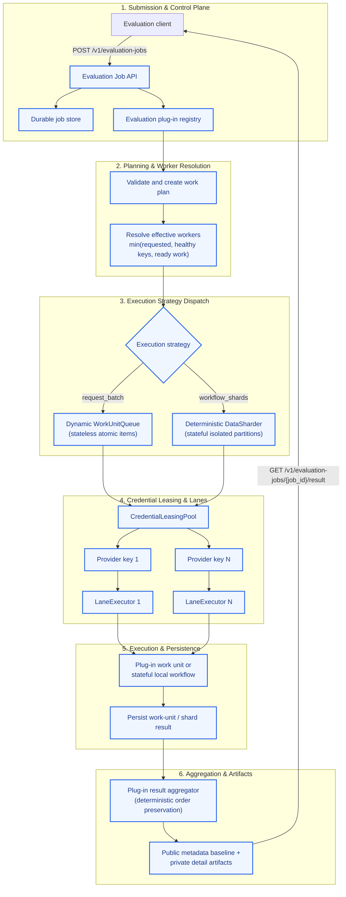
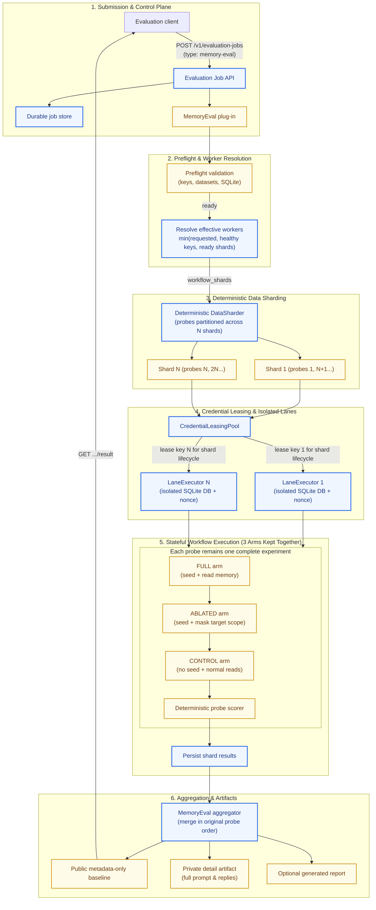
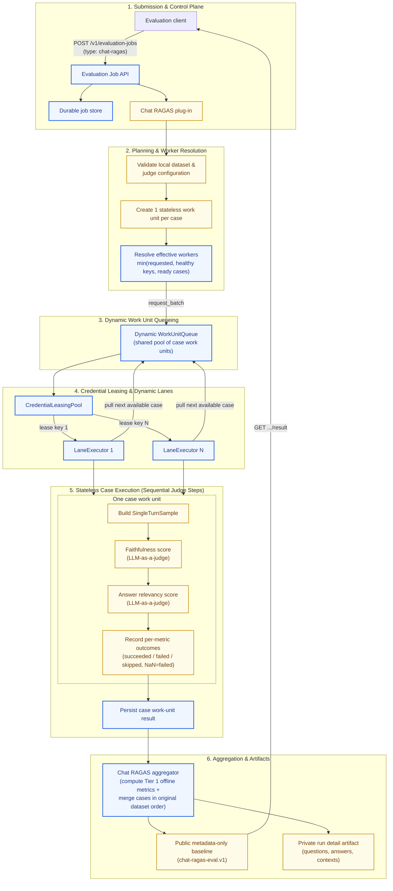

# Pluggable Batch Evaluation API — Specification (v1)

**Status:** Proposed (updated 2026-08-23).
**Area:** evaluation control plane, provider integrations, and evaluation harnesses.
**Companions:**

- [SPEC-memory-evaluation.md](./SPEC-memory-evaluation.md) — parent memory-evaluation contract.
- [SPEC-memory-eval-harness-v3-scalability.md](./SPEC-memory-eval-harness-v3-scalability.md) — current memory harness correctness and scalability work.
- [SPEC-chat-ragas-evaluation.md](./SPEC-chat-ragas-evaluation.md) — authoritative Chat RAGAS metrics, dataset, privacy, and reporting contract used by the RAGAS pluggability stress test.
- [Memory evaluation runbook](../../evaluations/MEMORIES/RUNBOOK.md) — current operational safety rules.
- [Level 1 system design and brainstorming](../../docs/references/pluggable-batch-eval-level1-brainstorming.md) — terminology, scheduling modes, and scope decisions adopted here.
- [Level 1 plug-in simulation preview](../../docs/references/pluggable-batch-eval-level1-plugin-simulation-brainstorming.md) — concise core/memory integration preview and RAGAS stress-test boundary aligned to this specification.

---

## Problem Statement

Evaluation tooling currently consists primarily of separate CLI workflows.
Memory evaluation selects one provider adapter and one API key, then runs every
probe and its three experimental arms sequentially.

The internal evaluation developer may configure one or more Mistral API keys
with independent usage limits. Three keys are the current deployment example,
not a Level 1 maximum. Level 1 must validate independence with a concurrent
smoke test rather than treating configuration as proof. When independence
holds, the system runs up to the requested `max_workers`, bounded by healthy
credentials and ready work, while recording which non-secret credential alias
ran each lane.

The same batch-processing control plane should later support memory,
retrieval, routing, email-intent, and similar evaluations without building a
new scheduler or endpoint family for every evaluator.

A generic "send every prompt to any available key" implementation is unsafe
for memory evaluation because:

- Each memory probe is a stateful experiment.
- Its `full`, `ablated`, and `control` arms must remain comparable.
- Seeding, querying, scoring, artifact writing, and teardown form one workflow.
- Concurrent workers must never share a scratch database, tenant, session,
  output path, or mutable live session.
- Ordinary Mistral chat-completion requests do not execute the local memory
  setup and teardown workflow; our module must own that orchestration.

The repository already has multi-key parsing and round-robin key rotation, but
the Mistral settings and chat reply adapter currently consume one key.

## Solution

Build an internal asynchronous evaluation API backed by these modules:

1. An evaluation plug-in registry.
2. A durable evaluation job store.
3. A `CredentialLeasingPool` that owns key lifecycle and exclusive leases.
4. A `WorkUnitQueue` for stateless atomic requests and a `DataSharder` for
   stateful deterministic partitions.
5. A `LaneExecutor` that runs one concurrent lane per healthy leased key using
   one of two execution strategies:
   - `request_batch` for stateless plug-in-defined work units.
   - `workflow_shards` for stateful local evaluation workflows.
6. An artifact store and deterministic result aggregator.

The recommended memory-evaluation integration partitions complete probes into
up to the effective worker count of isolated SQLite workflow shards. Each shard
leases one Mistral key and processes its assigned probes sequentially. Every
probe's three arms remain in the same shard.

### Level 1 — Basic batch-processing system

This is the reusable atomic execution primitive:

`execute_job(evaluator_type, target_model, dataset, credential_pool, max_workers) -> JobResult`

It performs data batching by splitting one evaluator, one target model, and one
dataset across healthy credential lanes. The application owns its queue,
scheduling, progress, retries, and aggregation. It uses ordinary provider
chat-completion calls and does not call a provider Batch API. Multi-model
benchmark matrices are a composition layer above Level 1, not another Level 1
execution mode.

### Memory evaluation — Level 1 `workflow_shards` use case

Memory evaluation uses workflow shards in the first implementation. A shard
owns complete probes, and each complete probe owns all three arms. Arms are not
distributed independently.

The current injected `AskProbe` remains the highest useful memory-evaluation
test seam. The generic evaluation job module becomes the highest HTTP-level
test seam.

### Composition above Level 1

A future multi-model suite orchestrator dispatches one Level 1 job per target
model, waits for their terminal results, and merges compatible manifests into a
leaderboard. One Level 1 job never mixes target models, providers, or automatic
cross-provider failover. This keeps scheduling, retry, and failure attribution
local to one model and credential pool.

## User Stories

1. As an evaluator, I want to submit an evaluation asynchronously, so that I
   do not hold an HTTP connection for a long-running workload.
2. As an evaluator, I want a stable job identifier, so that I can inspect
   progress later.
3. As an evaluator, I want idempotent submission, so that retrying a timed-out
   request does not create duplicate paid work.
4. As an evaluator, I want to select a registered evaluation type, so that
   memory, retrieval, and routing evaluations share one API.
5. As an evaluator, I want invalid parameters rejected before provider calls,
   so that configuration mistakes do not spend money.
6. As an evaluator, I want preflight checks before execution, so that unusable
   keys, datasets, models, or databases fail early.
7. As an evaluator, I want to request `max_workers` from `1` upward, so that I
   can choose sequential execution or use more configured credentials without
   changing the evaluator.
8. As an evaluator, I want each key represented by a non-secret alias, so that
   I can diagnose failures without exposing credentials.
9. As an evaluator, I want one failed key to stop receiving new work and its
   unstarted stateless items returned to the queue, so that healthy keys can
   continue.
10. As an evaluator, I want rate-limited keys placed into cooldown, so that
    temporary throttling is not mistaken for permanent exhaustion.
11. As an evaluator, I want job progress expressed in work units and provider
    requests, so that progress is meaningful for different evaluation types.
12. As an evaluator, I want partial failures reported explicitly, so that
    incomplete output is never presented as a valid complete benchmark.
13. As an evaluator, I want deterministic aggregation, so that concurrency
    does not reorder evaluation cases.
14. As a memory evaluator, I want each probe's three arms kept together, so
    that attribution remains valid.
15. As a memory evaluator, I want each shard to use an isolated scratch
    database and namespace, so that workers cannot contaminate each other.
16. As a memory evaluator, I want full reply text stored only in private
    artifacts, so that committed baselines remain metadata-only.
17. As a memory evaluator, I want PostgreSQL parity runs to remain serial
    initially, so that advisory-lock contention does not invalidate runs.
18. As a developer, I want to add a new evaluator by registering a plug-in
    rather than adding new endpoints.
19. As a developer, I want fake job-store, credential-pool, queue, and ordinary
    completion adapters, so that scheduling, retries, cancellation, and
    aggregation are testable offline.
20. As an internal evaluation developer, I want cancellation to stop new pulls,
    cancel supported in-flight requests, discard incomplete work units, and run
    cleanup, so that unwanted spending stops without publishing invalid output.
21. As an internal evaluation developer, I want secrets excluded from requests,
    persistence, logs, errors, and artifacts.
22. As an internal evaluation developer, I want request and token budgets, so that
    unexpectedly large jobs are rejected or stopped.
23. As a benchmark reader, I want the execution manifest to record shard and
    credential aliases, so that I can detect whether infrastructure differences
    affected the result.
24. As a benchmark reader, I want the probe-set hash, evaluator version,
    provider, model, and execution mode recorded, so that two runs can be
    compared honestly.
25. As an evaluator, I want a job requesting more workers than healthy
    credentials to continue at the lower effective count with a warning, not
    fail before useful work begins.
26. As a Chat RAGAS evaluator, I want cases distributed across the same Level 1
    worker pool, so that RAGAS does not require another scheduler or endpoint.
27. As a Chat RAGAS evaluator, I want metric failures and NaN scores reported
    per case and metric, so that an incomplete score cannot look complete.

## Implementation Decisions

### API contract

| Operation | Contract |
|---|---|
| `POST /v1/evaluation-jobs` | Accept a registered evaluation type, provider, model, dataset reference, execution options including `max_workers`, and evaluation-specific parameters. Require `Idempotency-Key`. Return `202`, job id, status URL, and result URL. |
| `GET /v1/evaluation-jobs/{job_id}` | Return state, safe progress, timestamps, work-unit or shard counts, requested and effective worker counts, warnings, retry counts, and failure classification. Never return prompts, replies, or secrets. |
| `GET /v1/evaluation-jobs/{job_id}/result` | Return the artifact manifest when terminal. Return `409` while work is still running. |
| `POST /v1/evaluation-jobs/{job_id}/cancel` | Request cancellation and return `202`. Cancellation is idempotent. |
| `GET /v1/evaluation-types` | List statically registered evaluation types, versions, supported execution modes, and validated parameter schemas. |

The endpoint accepts a credential-pool alias such as `mistral-eval`, never
actual API keys.

Submission accepts exactly one `evaluation_type`, one `provider`, one
`target_model`, one `dataset_ref`, one `credential_pool`, one `execution_mode`,
`execution_options.max_workers`, budget limits, and validated plug-in
parameters. `max_workers` is an integer greater than or equal to `1` and
defaults to `1`. Evaluation CLIs expose the same setting as `--max-workers`.

Effective worker count is:

`min(requested max_workers, healthy compatible credentials, ready work units)`

Requesting `4` workers with 3 healthy Mistral keys runs 3 workers. The job does
not fail. Status and the execution manifest include a safe warning with code
`WORKER_COUNT_REDUCED` plus `requested_workers`, `effective_workers`, and
`available_credentials`. Worker count may shrink again if a credential later
cools down or becomes disabled. Fewer ready work units may temporarily leave
workers idle without producing this credential-capacity warning.

Response fields use stable job, status, result, progress, timestamp, warning,
and failure-code schemas; private content is never embedded in an API response.

`Idempotency-Key` is claimed atomically with a canonical request hash before
provider spend. A retry with the same key and request returns the original job.
The same key with a different request returns `422`. The key record is retained
at least as long as the longest supported client retry window.

All errors use one safe shape: `{"error": {"code": string, "message":
string, "details"?: object}}`. Validation returns `422`; missing or invalid
authentication returns `401`; insufficient evaluator authorization returns
`403`; unknown jobs return `404`; non-terminal result reads return `409`;
unexpected failures return `500` without internals.

The first release is local or administrator-only for internal evaluation
developers. It is not part of the normal Cowork Agent user experience and is
never exposed to ordinary product users.

### Plug-in interface

Each registered evaluation plug-in declares:

- A stable evaluation type and version.
- Its validated parameter schema.
- Whether it supports `request_batch`, `workflow_shards`, or both.
- How to perform preflight checks.
- How to construct a deterministic work plan.
- Which work units may run concurrently.
- How to execute one work unit, including any bounded sequential metric or
  provider steps inside that unit.
- How to report per-step outcomes when a work unit contains multiple steps.
- How to aggregate successful and failed units.
- Whether an underlying library has its own worker pool and how that nested
  concurrency is disabled or fixed at `1`.
- Which artifacts are public metadata and which are private.
- How to clean up temporary resources.
- How to classify retryable, permanent, provider, product, and evaluation
  failures.

Plug-ins are registered at application startup. The API cannot upload Python,
specify a module path, or submit a shell command.

Level 1 keeps four narrow interfaces:

| Module | Interface responsibility |
|---|---|
| `WorkUnitQueue` | Recover ready stateless work from durable item state; atomically claim, acknowledge, or return one item. Queue memory is only a projection of job-store truth. |
| `DataSharder` | Deterministically partition stateful work into ordered, isolated shards for a given healthy-lane count. |
| `CredentialLeasingPool` | Lease one healthy credential alias exclusively; release, cool down, or disable it without exposing its value. |
| `LaneExecutor` | Pull a stateless plug-in-defined work unit or run one assigned stateful shard with a leased credential, then persist work-unit and step outcomes. |

The job module composes these interfaces. Plug-ins define evaluation semantics;
they do not implement scheduling, credential lifecycle, or HTTP state handling.

### Credential configuration and leasing

Use the existing multi-key environment parser with one documented naming
convention:

- `MISTRAL_API_KEY`
- `MISTRAL_API_KEY2`
- `MISTRAL_API_KEY3`
- `MISTRAL_API_KEYN`

`N` is any positive configured suffix; Level 1 does not hardcode three keys.
The shared parser also accepts underscore-number variants, but project
documentation and examples use the convention above consistently.

Level 1 supports a dynamic healthy pool size. One configured key produces one
sequential lane. `N` healthy configured keys can produce up to `N` concurrent
lanes when the job requests at least `N` workers and has enough ready work. One
key can hold at most one lease because per-key concurrency is `1` in Level 1.

Independent limits are a deployment assumption, not a fact inferred from key
count. A concurrent opt-in smoke test must check for cross-key `429` behavior.
Provider-reported organization-wide limits take precedence and are surfaced in
the execution manifest. Operators request fewer workers when independence is
not demonstrated.

Current status: the shared utility can parse these names, but the Mistral
evaluation adapter still uses the single `MISTRAL_API_KEY` field.
Implementation connects the evaluation-only Mistral transport to the pool.

The existing round-robin rotator is evolved into or wrapped by a lease-aware
pool with these states:

- `available`
- `leased`
- `cooling_down`
- `disabled`

One workflow shard retains the same credential lease for its lifecycle. One
stateless lane keeps a lease while pulling items and releases it when the lane
stops. Only a salted fingerprint or configured alias is persisted.

Failure rules:

- `401/403` authentication failure disables that credential. For
  `request_batch`, the claimed item returns to the shared queue only when no
  provider execution occurred; unclaimed items remain available to healthy
  lanes.
- `429` applies provider-directed backoff and cooldown to that credential.
- Transport and `5xx` errors retry with bounded exponential backoff.
- An ambiguous request timeout is recorded as an attempt with an unknown
  provider outcome. It is retried only under the job's explicit retry budget.
- Local work-item ids deduplicate stored results, even though a timed-out retry
  may still produce a second billed provider call.
- Stateless reassignment to another key is recorded in the execution manifest.
- A started `workflow_shards` shard is never stolen or resumed by another lane
  in Level 1. Credential failure makes that shard fail or partially succeed;
  deterministic retry starts a new shard attempt with fresh scratch state.
- Job-level consecutive-provider-failure protection remains in place.

### Job states

The canonical successful progression is:

`accepted -> validating -> queued -> running -> collecting -> succeeded`

Terminal alternatives are:

- `partially_succeeded`
- `failed`
- `cancelled`

Cancellation passes through `cancellation_requested`. State transitions are
monotonic and persisted before being returned to clients. Cancellation stops
new queue claims immediately. Supported in-flight HTTP requests are cancelled;
their work units remain incomplete and are never aggregated as successful.
Every lane executes plug-in cleanup before terminal job state is recorded.

Durable work-unit state, not in-memory task state, is authoritative. On process
restart, queued items remain ready, completed items remain complete, and
orphaned running attempts are classified as unknown before retry policy decides
whether to requeue or fail them. Restart recovery must never silently duplicate
an attempt whose provider outcome is unknown.

### Execution modes

#### `request_batch`

- For stateless, independently serializable plug-in work units.
- Implemented entirely by Level 1 modules; it does not upload JSONL files or
  create Mistral batch jobs.
- Partitions inputs into atomic work items with stable ids and durable states.
- Uses a bounded dynamic pull queue shared by all healthy lanes. A lane pulls
  only after it holds a credential lease.
- Executes one bounded plug-in-defined work unit at a time. A unit may contain
  one provider request or a short sequential set of metric/provider steps.
- Runs one request lane per healthy lease up to the effective worker count.
- A cooling-down lane pauses its pull loop without blocking healthy lanes.
- When a key is disabled, its unstarted item returns to the queue. Completed or
  unknown attempts are never blindly replayed.
- Persists work-unit and step state, safe error classification, latency, token
  usage when returned, and the private result artifact.
- Uses bounded queues and budgets so a large evaluation cannot create
  unbounded tasks or provider spend.

#### `workflow_shards`

- For evaluations requiring local state, database operations, retrieval,
  multi-turn calls, or teardown.
- Executes a plug-in-defined shard locally.
- May use normal provider completions through a leased key.
- Uses deterministic partitioning and one isolated scratch environment per
  shard; shards do not share the stateless pull queue.
- Keeps the same lease for the shard lifecycle and processes its assigned work
  sequentially.
- Does not perform dynamic work stealing in Level 1. Rebalancing would require
  fresh scratch initialization and a separate correctness design.
- Uses the same leasing, progress, retry-budget, cancellation, and aggregation
  policies as `request_batch` while retaining stateful local steps.

### Memory-evaluation adapter

The first concurrent implementation is SQLite-only:

- Partition probes deterministically into at most the effective worker count of
  shards.
- Keep all three arms of a probe in the same shard.
- Give every shard a separate scratch SQLite file, live session, adapter set,
  transcript, nonce, and artifact path.
- Let each worker process its assigned probes sequentially.
- Use one Mistral credential lease per worker.
- Start up to the effective worker count, with one healthy leased key per
  worker.
- Merge rows in the original probe-set order.
- Preserve the existing scorer, verdict derivation, seeding rules, masking
  behavior, and teardown.
- Preserve the existing metadata-only baseline and private detail artifact
  distinction.
- Record an execution manifest containing job id, shard ids, credential
  aliases, local request-attempt ids, retries, and per-shard state.
- Never move unstarted probes between active shards in Level 1.

PostgreSQL memory evaluation remains concurrency `1` in this specification.
Parallel PostgreSQL execution requires a separate design proving migration,
connection-pool, and cleanup behavior.

### Chat RAGAS adapter — pluggability stress test

This stress test depends on
[SPEC-chat-ragas-evaluation.md](./SPEC-chat-ragas-evaluation.md). That companion
spec owns Chat RAGAS metrics, datasets, judge configuration, privacy, and report
semantics. This specification owns only generic job execution and proves that
the Level 1 core can host those semantics through a plug-in.

Chat RAGAS is the second concrete Level 1 plug-in and the acceptance test for
whether the core is genuinely reusable. It must use the existing job API,
`request_batch`, `WorkUnitQueue`, `CredentialLeasingPool`, `LaneExecutor`, job
states, and artifact store. It must not add another endpoint, scheduler, queue,
or execution mode.

RAGAS work-unit rules:

- One Chat RAGAS case is one stateless work unit. Free lanes pull cases from the
  shared queue, so slow cases do not strand other healthy credentials.
- The work unit builds one sample and scores its configured judge metrics
  sequentially. The first version uses `faithfulness` and `answer_relevancy`.
- Use RAGAS per-sample metric scoring such as `single_turn_ascore`; do not submit
  the full dataset to a second internal executor. If a compatibility path uses
  `ragas.evaluate`, its `RunConfig.max_workers` is fixed at `1`.
- Deterministic Tier 1 retrieval, citation, abstention, and latency metrics run
  inside plug-in aggregation and require no additional credential lease.
- Each case/metric result is `succeeded`, `failed`, or `skipped`. Missing,
  non-finite, or NaN scores are `failed`, never silently omitted.
- Aggregate means include only successful finite scores and record attempted,
  succeeded, failed, and skipped denominators for each metric.
- Metric failure does not erase successful metrics from the same case. A case
  or metric failure contributes to partial-success classification.
- Input questions, answers, references, and retrieved contexts remain private.
  They never enter job metadata, warnings, logs, or committable baselines.
- Case results merge in original dataset order regardless of completion order.

Minimal-core-change criterion:

- Core changes are limited to `max_workers` resolution/warnings and allowing
  `LaneExecutor` to invoke one plug-in-defined stateless work unit with bounded
  sequential steps.
- RAGAS-specific sample creation, judge setup, metric sequencing, failure
  interpretation, privacy filtering, and aggregation stay inside the RAGAS
  plug-in.
- Adding Chat RAGAS requires no change to Level 1 endpoints, job states,
  `WorkUnitQueue`, `CredentialLeasingPool`, persistence model, or artifact-store
  interface. If implementation requires any of those changes, this stress test
  has exposed a missing Level 1 interface and the spec must be revisited first.

### Persistence and artifacts

Use a dedicated, gitignored SQLite control-plane database for evaluation-job
metadata in the first release. Do not reuse the memory-evaluation scratch
database.

The job-store abstraction permits a later PostgreSQL implementation, but no
product database migration is part of this specification.

Artifact paths remain deterministic under the canonical `evaluations/`
workspace:

- Committable baseline: metadata only.
- Private run detail: full questions and replies.
- Job manifest: metadata only.
- Provider raw response bodies: not retained by default. A plug-in-specific
  debug mode may retain them only in a private, gitignored artifact with an
  explicit retention policy.
- Safe provider error classifications: metadata only; raw error bodies remain
  private and are not returned by the API.
- Generated report: follows the evaluation plug-in's privacy policy.

Scratch SQLite files are temporary execution resources, not artifacts. Teardown
deletes them after success, partial success, failure, or cancellation. Cleanup
failure is recorded without exposing paths or content and prevents the job from
claiming complete cleanup. Metadata-only job records and manifests remain until
explicit operator deletion in Level 1; automated retention and garbage
collection policy is a later operational feature.

### Incremental delivery roadmap

1. **Foundation:** job API, job store, static plug-in registry, fake queue and
   lane adapters, status/result/cancellation, idempotency, and restart recovery.
2. **Level 1 stateless execution:** `WorkUnitQueue`,
   `CredentialLeasingPool`, dynamic `max_workers` resolution, generalized
   `LaneExecutor`, ordinary Mistral transport, warnings, and deterministic
   result collection.
3. **Memory evaluation:** deterministic SQLite workflow sharding across the
   effective worker count of healthy verified-independent keys,
   deterministic aggregation, and existing report compatibility.
4. **Chat RAGAS stress test:** case-level stateless work units, sequential
   per-case metrics, no nested concurrency, finite-score validation, explicit
   per-metric denominators, and metadata-only aggregation.
5. **Future evaluators:** retrieval, routing, email-intent, and other stateless
   evaluations register adapters without new endpoint families.
6. **Advanced option:** only after measuring a real need, extract memory-eval
   prompt preparation from controller execution so more work can use the
   custom `request_batch` strategy without weakening the three-arm contract.

## Testing Decisions

Tests assert externally visible behavior rather than worker implementation
details.

The primary test seam is the evaluation job service with:

- A fake plug-in registry.
- A fake job store.
- A fake credential pool.
- A fake plug-in work-unit executor and ordinary-completion transport.
- A fake clock and retry scheduler.
- A fake artifact store.

API integration tests cover:

- `202` submission and status URLs.
- Idempotent duplicate submission.
- Reusing an idempotency key with a different request returns `422`.
- Validation before job creation or provider spend.
- Status progression.
- Result conflict while running.
- Cancellation.
- Partial failure.
- Secret and content redaction.
- Authorization.
- Safe, consistent error envelopes.
- Restart recovery from orphaned running attempts without blind replay.
- Omitted `max_workers` defaults to `1`.
- `max_workers=2` with 3 healthy keys runs 2 workers without warning.
- `max_workers=4` with 3 healthy keys runs 3 workers and returns
  `WORKER_COUNT_REDUCED`.
- `max_workers < 1` returns `422` before job creation or provider spend.

`request_batch` tests cover:

- Healthy lanes pull dynamically from one bounded queue.
- One cooling-down lane does not block other lanes.
- A disabled key returns its unstarted item to the queue.
- Completed and unknown attempts are not blindly replayed.
- Completion order does not change aggregate order.
- A stateless work unit may report multiple sequential step outcomes without
  creating another worker pool.

Credential-pool tests cover:

- One-key, three-key, and `N`-key parsing.
- Deduplication.
- One-key sequential fallback.
- Three simultaneous leases across three independent keys.
- No simultaneous duplicate lease of the same key.
- Per-key cooldown and recovery without pausing healthy keys.
- Permanent disablement.
- Cancellation release.
- No raw key in representations or logs.

Memory plug-in tests extend the existing `AskProbe` and live-runner seams:

- A probe's three arms never cross shards.
- Shards never share a database, tenant, user, session, nonce, or output path.
- Concurrent completion order does not change report ordering.
- Per-shard failure produces `partially_succeeded`, not a complete-looking
  report.
- Teardown runs for every shard, including cancellation and failure.
- Scratch SQLite files are deleted on every terminal path.
- Stateful shards never steal probes from each other.
- Baselines remain metadata-only.
- Existing full/ablated/control masking tests remain unchanged.
- The serial path and one-key configuration remain backward compatible.

Chat RAGAS plug-in tests cover:

- One case produces one stateless work unit.
- Cases use the shared dynamic queue and respect effective worker count.
- Metrics within one case execute sequentially; RAGAS internal worker count is
  absent or fixed at `1`.
- One metric failure preserves another successful metric from the same case.
- Missing, infinite, and NaN values are recorded as failed metrics.
- Per-metric attempted, succeeded, failed, and skipped counts match results.
- Aggregate means include only successful finite scores with explicit
  denominators.
- Concurrent completion does not change original case order.
- Questions, answers, references, and contexts never enter metadata, warnings,
  logs, or committable baselines.
- Registering Chat RAGAS adds no endpoint, job state, scheduler, queue,
  credential-pool, persistence, or artifact-store change.

The repository's narrowest relevant routes are feature tests, LLM integration
tests, script tests, and API integration tests. Live Mistral validation is an
opt-in smoke test and does not run in ordinary CI. The smoke test saturates all
three configured keys concurrently and records per-alias `429` timing so
cross-key throttling is visible before multi-lane execution is enabled. Three
keys are the current smoke-test fixture, not a Level 1 maximum.

## Out of Scope

- Uploading executable evaluation plug-ins through the API.
- Running arbitrary commands or accepting arbitrary filesystem paths.
- A public multi-tenant evaluation service.
- A multi-model benchmark matrix inside one Level 1 job. A future suite
  orchestrator composes multiple Level 1 jobs instead.
- Changes to product chat behavior.
- Changes to memory scoring or verdict semantics.
- Concurrent PostgreSQL memory-evaluation shards.
- Using multiple keys to evade provider terms or limits outside the explicitly
  independent limits assigned to these keys.
- Automatic cross-provider failover within one benchmark.
- Dynamic work stealing between active `workflow_shards` shards.
- Nested RAGAS concurrency above `1` inside a Level 1 worker.
- Any use of Mistral's built-in Batch API, including batch file upload, inline
  batch submission, provider batch-job polling, or provider batch result files.
- A frontend dashboard.
- SQL migrations without separate approval.
- Committing private questions, replies, provider outputs, or API keys.

## Further Notes

Mistral's batch product is conceptual inspiration only. This specification does
not depend on or call it. Our application owns the job lifecycle and invokes
the same ordinary chat-completion transport used by non-batch Mistral features.
Level 1 modules are responsible for work-item ids, concurrency, retries,
progress, cancellation, result persistence, and deterministic aggregation.

Current repository seams supporting this design:

- The memory runner executes probes and arms through an injected `AskProbe`.
- Each probe and arm already receives an isolated identity.
- The CLI builds one Mistral reply adapter from one Mistral settings object.
- Mistral settings currently load one `MISTRAL_API_KEY`.
- Multi-key parsing and async-safe round-robin rotation already exist.
- The current Chat RAGAS runner submits the whole dataset to `ragas.evaluate`
  and has no `max_workers` CLI option; integrating the plug-in replaces that
  concurrency ownership with Level 1 case work units.
- Current RAGAS supports direct per-sample metric scoring. A compatibility path
  using `ragas.evaluate` must force its internal worker count to `1`.
- The memory-evaluation runbook currently requires one run at a time because
  of PostgreSQL advisory locks and previously observed same-provider
  contention. This specification replaces provider-side single-lane behavior
  only for the explicitly independent Mistral keys and keeps PostgreSQL serial.

### Acceptance criteria

- [ ] One through `N` configured Mistral keys are discovered without exposing
      values.
- [ ] One healthy key produces one sequential lane.
- [ ] Effective worker count equals the minimum of requested workers, healthy
      compatible credentials, and ready work units.
- [ ] Requesting 4 workers with 3 healthy keys runs 3 workers and emits
      `WORKER_COUNT_REDUCED` without failing the job.
- [ ] An opt-in concurrent smoke test can confirm or reject the independent-key
      assumption without persisting key values or prompt content.
- [ ] `request_batch` lanes pull from one bounded dynamic queue; cooling down or
      disabling one key does not stop healthy lanes.
- [ ] Process restart classifies orphaned attempts and never blindly replays an
      unknown provider outcome.
- [ ] A SQLite memory evaluation runs with isolated workflow shards up to the
      effective worker count.
- [ ] Every probe retains all three arms on one shard.
- [ ] Stateful workflow shards do not steal probes from each other.
- [ ] PostgreSQL mode enforces concurrency `1`.
- [ ] Successful, failed, partially successful, and cancelled shards always
      attempt cleanup; scratch SQLite files do not become retained artifacts.
- [ ] Aggregated output is deterministic.
- [ ] Incomplete execution cannot appear as a successful complete benchmark.
- [ ] Another evaluator can be added through a registered plug-in without a
      new endpoint family.
- [ ] Chat RAGAS runs as case-level `request_batch` work units without new Level
      1 endpoints, job states, schedulers, queues, persistence interfaces, or
      artifact interfaces.
- [ ] Chat RAGAS records explicit per-metric outcomes and denominators; NaN is
      failed and never silently omitted.
- [ ] Chat RAGAS uses no nested worker pool and preserves metadata-only output.
- [ ] Offline tests cover scheduler, isolation, redaction, retry, and state
      transition behavior.
- [ ] One Level 1 job accepts exactly one target model; multi-model comparison
      is composed from multiple jobs.
