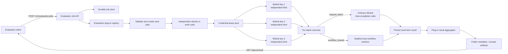
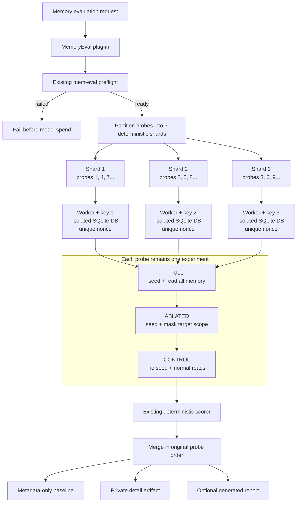

# Pluggable Batch Evaluation API — Specification (v1)

**Status:** Proposed (2026-08-22).
**Area:** evaluation control plane, provider integrations, and evaluation harnesses.
**Companions:**

- [SPEC-memory-evaluation.md](./SPEC-memory-evaluation.md) — parent memory-evaluation contract.
- [SPEC-memory-eval-harness-v3-scalability.md](./SPEC-memory-eval-harness-v3-scalability.md) — current memory harness correctness and scalability work.
- [Memory evaluation runbook](../../evaluations/MEMORIES/RUNBOOK.md) — current operational safety rules.

---

## Problem Statement

Evaluation tooling currently consists primarily of separate CLI workflows.
Memory evaluation selects one provider adapter and one API key, then runs every
probe and its three experimental arms sequentially.

The AI evaluation developer has three Mistral API keys with independent usage
limits. Using one key does not consume or reduce the other keys' limits. The
evaluation system should therefore be able to run three safe concurrent lanes,
one per key, while preserving experiment correctness and recording which
non-secret credential alias ran each lane.

The same batch-processing control plane should later support memory,
retrieval, routing, email-intent, and similar evaluations without building a
new scheduler or endpoint family for every evaluator.

A generic "send every prompt to any available key" implementation is unsafe
for memory evaluation because:

- Each memory probe is a stateful experiment.
- Its `full`, `ablated`, and `control` arms must remain comparable.
- Seeding, querying, scoring, artifact writing, and teardown form one workflow.
- Concurrent workers must never share a scratch database, tenant, session,
  output path, or mutable live session.
- Ordinary Mistral chat-completion requests do not execute the local memory
  setup and teardown workflow; our module must own that orchestration.

The repository already has multi-key parsing and round-robin key rotation, but
the Mistral settings and chat reply adapter currently consume one key.

## Solution

Build an asynchronous evaluation API for AI evaluation developers, backed by:

1. An evaluation plug-in registry.
2. A durable evaluation job store.
3. A credential leasing pool.
4. A shard scheduler.
5. A custom batch execution module with two worker strategies:
   - `request_batch` for independent ordinary provider requests.
   - `workflow_shards` for stateful local evaluation workflows.
6. An artifact store and deterministic result aggregator.

The recommended memory-evaluation integration partitions complete probes into
three isolated SQLite workflow shards. Each shard leases one Mistral key and
processes its assigned probes sequentially. Every probe's three arms remain in
the same shard.

### Level 1 — Basic batch-processing system

This is the reusable foundation. The application owns its queue, scheduling,
progress, retries, and aggregation. It uses ordinary Mistral chat-completion
calls and does not call Mistral's built-in Batch API.

### Level 2 — Memory evaluation plugged into the system

Memory evaluation uses workflow shards in the first implementation. A shard
owns complete probes, and each complete probe owns all three arms. Arms are not
distributed independently.

The current injected `AskProbe` remains the highest useful
memory-evaluation test seam. The generic evaluation job service becomes the
highest API-level test seam.

## User Stories

1. As an evaluator, I want to submit an evaluation asynchronously, so that I
   do not hold an HTTP connection for a long-running workload.
2. As an evaluator, I want a stable job identifier, so that I can inspect
   progress later.
3. As an evaluator, I want idempotent submission, so that retrying a timed-out
   request does not create duplicate paid work.
4. As an evaluator, I want to select a registered evaluation type, so that
   memory, retrieval, and routing evaluations share one API.
5. As an evaluator, I want invalid parameters rejected before provider calls,
   so that configuration mistakes do not spend money.
6. As an evaluator, I want preflight checks before execution, so that unusable
   keys, datasets, models, or databases fail early.
7. As an evaluator, I want three independently limited Mistral keys used
   concurrently when safe, so that independent work completes faster.
8. As an evaluator, I want each key represented by a non-secret alias, so that
   I can diagnose failures without exposing credentials.
9. As an evaluator, I want one failed key to stop receiving new work, so that
   the remaining keys can continue.
10. As an evaluator, I want rate-limited keys placed into cooldown, so that
    temporary throttling is not mistaken for permanent exhaustion.
11. As an evaluator, I want job progress expressed in work units and provider
    requests, so that progress is meaningful for different evaluation types.
12. As an evaluator, I want partial failures reported explicitly, so that
    incomplete output is never presented as a valid complete benchmark.
13. As an evaluator, I want deterministic aggregation, so that concurrency
    does not reorder evaluation cases.
14. As a memory evaluator, I want each probe's three arms kept together, so
    that attribution remains valid.
15. As a memory evaluator, I want each shard to use an isolated scratch
    database and namespace, so that workers cannot contaminate each other.
16. As a memory evaluator, I want full reply text stored only in private
    artifacts, so that committed baselines remain metadata-only.
17. As a memory evaluator, I want PostgreSQL parity runs to remain serial
    initially, so that advisory-lock contention does not invalidate runs.
18. As a developer, I want to add a new evaluator by registering a plug-in
    rather than adding new endpoints.
19. As a developer, I want a fake provider-batch adapter, so that scheduling,
    retries, cancellation, and aggregation are testable offline.
20. As an AI evaluation developer, I want cancellation to stop queued work and
    cancel local workers and cancellable in-flight requests, so that unwanted
    spending stops promptly.
21. As an AI evaluation developer, I want secrets excluded from requests,
    persistence, logs, errors, and artifacts.
22. As an AI evaluation developer, I want request and token budgets, so that
    unexpectedly large jobs are rejected or stopped.
23. As a benchmark reader, I want the execution manifest to record shard and
    credential aliases, so that I can detect whether infrastructure differences
    affected the result.
24. As a benchmark reader, I want the probe-set hash, evaluator version,
    provider, model, and execution mode recorded, so that two runs can be
    compared honestly.

## Implementation Decisions

### API contract

| Operation | Contract |
|---|---|
| `POST /v1/evaluation-jobs` | Accept a registered evaluation type, provider, model, dataset reference, execution options, and evaluation-specific parameters. Require `Idempotency-Key`. Return `202`, job id, status URL, and result URL. |
| `GET /v1/evaluation-jobs/{job_id}` | Return state, safe progress, timestamps, shard counts, retry counts, and failure classification. Never return prompts, replies, or secrets. |
| `GET /v1/evaluation-jobs/{job_id}/result` | Return the artifact manifest when terminal. Return `409` while work is still running. |
| `POST /v1/evaluation-jobs/{job_id}/cancel` | Request cancellation and return `202`. Cancellation is idempotent. |
| `GET /v1/evaluation-types` | List statically registered evaluation types, versions, supported execution modes, and validated parameter schemas. |

The endpoint accepts a credential-pool alias such as `mistral-eval`, never
actual API keys.

The first release is for AI evaluation developers only. It is not part of the
normal Cowork Agent user experience.

### Plug-in interface

Each registered evaluation plug-in declares:

- A stable evaluation type and version.
- Its validated parameter schema.
- Whether it supports `request_batch`, `workflow_shards`, or both.
- How to perform preflight checks.
- How to construct a deterministic work plan.
- Which work units may run concurrently.
- How to execute one work unit.
- How to aggregate successful and failed units.
- Which artifacts are public metadata and which are private.
- How to clean up temporary resources.
- How to classify retryable, permanent, provider, product, and evaluation
  failures.

Plug-ins are registered at application startup. The API cannot upload Python,
specify a module path, or submit a shell command.

### Credential configuration and leasing

Use the existing multi-key environment parser with one documented naming
convention:

- `MISTRAL_API_KEY`
- `MISTRAL_API_KEY2`
- `MISTRAL_API_KEY3`

The shared parser also accepts underscore-number variants, but project
documentation and examples should use the convention above consistently.

These three keys have independent usage limits. The scheduler therefore allows
three concurrent Mistral lanes by default, bounded to one leased lane per key.
It must not apply a shared-workspace quota assumption to this configured pool.
Provider-reported global limits, if any are encountered at runtime, still take
precedence and must be surfaced rather than ignored.

Current status: the shared utility can parse these names, but the Mistral
evaluation adapter still uses the single `MISTRAL_API_KEY` field.
Implementation connects the evaluation-only Mistral transport to the pool.

The existing round-robin rotator is evolved into or wrapped by a lease-aware
pool with these states:

- `available`
- `leased`
- `cooling_down`
- `disabled`

One workflow shard or native provider batch retains the same credential lease
for its external lifecycle. Only a salted fingerprint or configured alias is
persisted.

Failure rules:

- `401/403` authentication failure disables that credential.
- `429` applies provider-directed backoff and cooldown to that credential.
- Transport and `5xx` errors retry with bounded exponential backoff.
- An ambiguous request timeout is recorded as an attempt with an unknown
  provider outcome. It is retried only under the job's explicit retry budget.
- Local work-item ids deduplicate stored results, even though a timed-out retry
  may still produce a second billed provider call.
- Reassignment to another key is recorded in the execution manifest.
- Job-level consecutive-provider-failure protection remains in place.

### Job states

The canonical successful progression is:

`accepted -> validating -> queued -> running -> collecting -> succeeded`

Terminal alternatives are:

- `partially_succeeded`
- `failed`
- `cancelled`

Cancellation passes through `cancellation_requested`. State transitions are
monotonic and persisted before being returned to clients.

### Execution modes

#### `request_batch`

- For stateless, independently serializable provider requests.
- Implemented entirely by our batch module; it does not upload JSONL files or
  create Mistral batch jobs.
- Partitions inputs into locally tracked work items with stable ids.
- Sends one ordinary Mistral chat-completion request per work item.
- Runs up to three request lanes concurrently, one per independently limited
  key, with configurable per-key concurrency initially defaulting to `1`.
- Persists attempt state, safe error classification, latency, token usage when
  returned, and the private result artifact.
- Uses bounded queues and budgets so a large evaluation cannot create
  unbounded tasks or provider spend.

#### `workflow_shards`

- For evaluations requiring local state, database operations, retrieval,
  multi-turn calls, or teardown.
- Executes a plug-in-defined shard locally.
- May use normal provider completions through a leased key.
- Uses the same custom scheduler, leasing, progress, retry, and aggregation
  machinery as `request_batch` while retaining its stateful local steps.

### Memory-evaluation adapter

The first concurrent implementation is SQLite-only:

- Partition probes deterministically into at most three shards.
- Keep all three arms of a probe in the same shard.
- Give every shard a separate scratch SQLite file, live session, adapter set,
  transcript, nonce, and artifact path.
- Let each worker process its assigned probes sequentially.
- Use one Mistral credential lease per worker.
- Start up to three workers concurrently because the keys have independent
  usage limits.
- Merge rows in the original probe-set order.
- Preserve the existing scorer, verdict derivation, seeding rules, masking
  behavior, and teardown.
- Preserve the existing metadata-only baseline and private detail artifact
  distinction.
- Record an execution manifest containing job id, shard ids, credential
  aliases, local request-attempt ids, retries, and per-shard state.

PostgreSQL memory evaluation remains concurrency `1` in this specification.
Parallel PostgreSQL execution requires a separate design proving migration,
connection-pool, and cleanup behavior.

### Persistence and artifacts

Use a dedicated, gitignored SQLite control-plane database for evaluation-job
metadata in the first release. Do not reuse the memory-evaluation scratch
database.

The job-store abstraction permits a later PostgreSQL implementation, but no
product database migration is part of this specification.

Artifact paths remain deterministic under the canonical `evaluations/`
workspace:

- Committable baseline: metadata only.
- Private run detail: full questions and replies.
- Job manifest: metadata only.
- Provider raw output and error files: private.
- Generated report: follows the evaluation plug-in's privacy policy.

### Incremental delivery roadmap

1. **Foundation:** job API, job store, static plug-in registry, fake executor,
   status/result/cancellation, and idempotency.
2. **Custom multi-key executor:** lease-aware credential pool, three
   independent concurrency lanes, bounded work queue, ordinary Mistral
   chat-completion transport, and deterministic result collection.
3. **Memory evaluation:** SQLite workflow sharding across three keys,
   deterministic aggregation, and existing report compatibility.
4. **Future evaluators:** retrieval, routing, email-intent, and other stateless
   evaluations register adapters without new endpoint families.
5. **Advanced option:** only after measuring a real need, extract memory-eval
   prompt preparation from controller execution so more work can use the
   custom `request_batch` strategy without weakening the three-arm contract.

## Testing Decisions

Tests assert externally visible behavior rather than worker implementation
details.

The primary test seam is the evaluation job service with:

- A fake plug-in registry.
- A fake job store.
- A fake credential pool.
- A fake ordinary-completion transport.
- A fake clock and retry scheduler.
- A fake artifact store.

API integration tests cover:

- `202` submission and status URLs.
- Idempotent duplicate submission.
- Validation before job creation or provider spend.
- Status progression.
- Result conflict while running.
- Cancellation.
- Partial failure.
- Secret and content redaction.
- Authorization.

Credential-pool tests cover:

- Three-key parsing.
- Deduplication.
- Three simultaneous leases across three independent keys.
- No simultaneous duplicate lease of the same key.
- Per-key cooldown and recovery without pausing healthy keys.
- Permanent disablement.
- Cancellation release.
- No raw key in representations or logs.

Memory plug-in tests extend the existing `AskProbe` and live-runner seams:

- A probe's three arms never cross shards.
- Shards never share a database, tenant, user, session, nonce, or output path.
- Concurrent completion order does not change report ordering.
- Per-shard failure produces `partially_succeeded`, not a complete-looking
  report.
- Teardown runs for every shard, including cancellation and failure.
- Baselines remain metadata-only.
- Existing full/ablated/control masking tests remain unchanged.
- The serial path and one-key configuration remain backward compatible.

The repository's narrowest relevant routes are feature tests, LLM integration
tests, script tests, and API integration tests. Live Mistral validation is an
opt-in smoke test and does not run in ordinary CI.

## Out of Scope

- Uploading executable evaluation plug-ins through the API.
- Running arbitrary commands or accepting arbitrary filesystem paths.
- A public multi-tenant evaluation service.
- Changes to product chat behavior.
- Changes to memory scoring or verdict semantics.
- Concurrent PostgreSQL memory-evaluation shards.
- Using multiple keys to evade provider terms or limits outside the explicitly
  independent limits assigned to these keys.
- Automatic cross-provider failover within one benchmark.
- Any use of Mistral's built-in Batch API, including batch file upload, inline
  batch submission, provider batch-job polling, or provider batch result files.
- A frontend dashboard.
- SQL migrations without separate approval.
- Committing private questions, replies, provider outputs, or API keys.

## Further Notes

Mistral's batch product is conceptual inspiration only. This specification does
not depend on or call it. Our application owns the job lifecycle and invokes
the same ordinary chat-completion transport used by non-batch Mistral features.
The custom module is responsible for work-item ids, concurrency, retries,
progress, cancellation, result persistence, and deterministic aggregation.

Current repository seams supporting this design:

- The memory runner executes probes and arms through an injected `AskProbe`.
- Each probe and arm already receives an isolated identity.
- The CLI builds one Mistral reply adapter from one Mistral settings object.
- Mistral settings currently load one `MISTRAL_API_KEY`.
- Multi-key parsing and async-safe round-robin rotation already exist.
- The memory-evaluation runbook currently requires one run at a time because
  of PostgreSQL advisory locks and previously observed same-provider
  contention. This specification replaces provider-side single-lane behavior
  only for the explicitly independent Mistral keys and keeps PostgreSQL serial.

### Acceptance criteria

- [ ] Three configured Mistral keys are discovered without exposing values.
- [ ] The scheduler leases all three independent keys concurrently when at
      least three shards are ready.
- [ ] A SQLite memory evaluation runs with three isolated workflow shards.
- [ ] Every probe retains all three arms on one shard.
- [ ] One-key behavior remains supported.
- [ ] PostgreSQL mode enforces concurrency `1`.
- [ ] Failed or cancelled shards always clean up.
- [ ] Aggregated output is deterministic.
- [ ] Incomplete execution cannot appear as a successful complete benchmark.
- [ ] Another evaluator can be added through a registered plug-in without a
      new endpoint family.
- [ ] Offline tests cover scheduler, isolation, redaction, retry, and state
      transition behavior.
